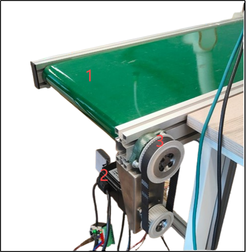
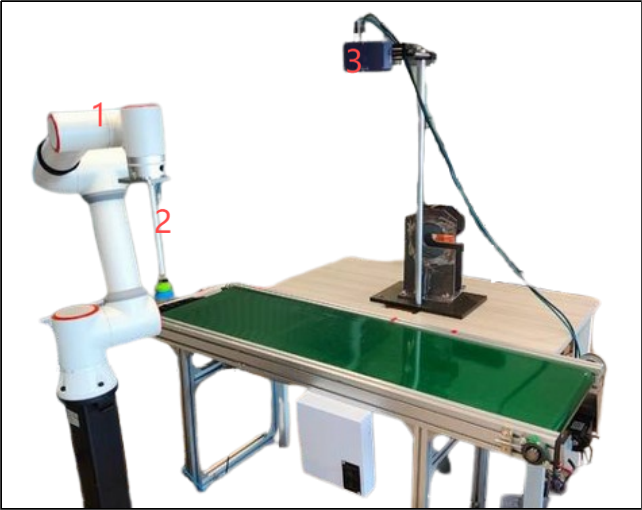
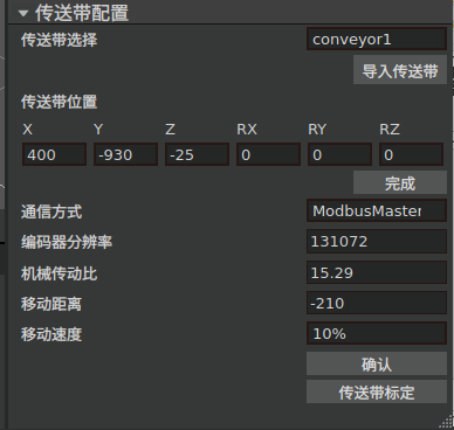
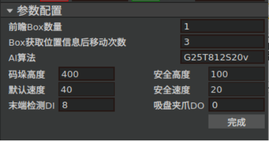
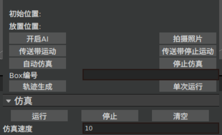
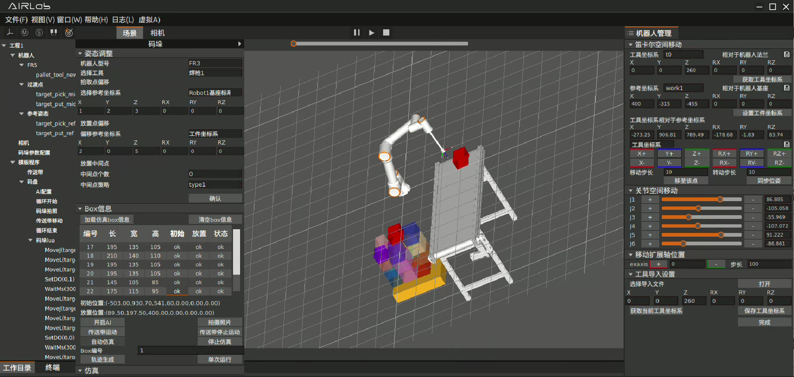
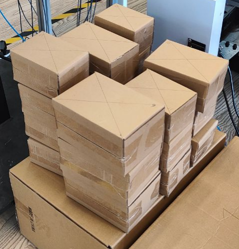
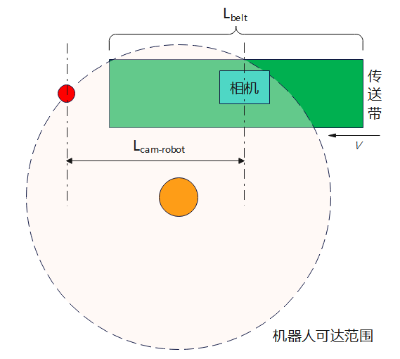

使用案例
=============

.. toctree:: 
   :maxdepth: 6

前言
----------------

简介
~~~~~~~
首先，非常感谢您使用我们公司的AIRLab混合码垛软件。请您仔细阅读本产品使用案例说明，以确保您能够正确地使用我们的产品并获得最佳的使用体验。

本使用案例旨在为用户提供一个AIRLab混合码垛软件的实际应用示例，帮助用户更好地理解和掌握软件的操作方法和功能。本案例基于我们在测试环境中的实际操作，展示了从初始配置到任务执行的完整流程。

.. important:: 如果您在使用过程中遇难以解决的问题，请与我们的售后人员联系。我们非常感谢您的支持和信任，期待为您提供更好的服务和产品。

其他相关文档
~~~~~~~~~~~~~~~
《AIRLab混合码垛软件用户使用手册》。

运行环境
----------

硬件环境
~~~~~~~~~~~

计算机
+++++++++

- **型号**：昀晅工控机EPC-E12-A01。
- **操作系统**：Ubuntu 22.04.3 LTS-64bit。
- **内存**：32GB。
- **GPU**：英伟达RTX A2000。

机器人
+++++++++

- **机器人型号**：法奥FR5协作机器人。
- **机器人版本**：V6.0及以上。
- **控制器软件版本**：V3.7.2。
- **固件版本**：FR_CRTL_FV2.010.09 Apr 16 2024 08:46:28。

相机
+++++++++

- **相机型号**：星猿哲XYZ AL-M 3D相机

传送带
+++++++++

- **传送带**：平皮带式，长1.5m
- **电机型号**：60S01330L5HMQD-05，400W伺服电机，工作电压48V，三协
- **配件**：同步轮、同步带

.. centered:: 图表 7-2-1 传送带

.. note:: 
    1-传送带

    2-伺服电机

    3-同步带轮及轮

整体搭建
+++++++++
图中传送带起点在右侧，即箱子从右侧放上传送带。相机放置在距传送带起点约700mm处，距传送带面高度800mm，说明详见4.1、4.3节；机器人放置在传送带终点附近，具体位置以不影响视觉标定和拾取箱子为宜，说明详见4.1节。

.. centered:: 图表 7-2-2 搭建完成的混合码垛硬件环境

.. note:: 
    1-机器人

    2-吸盘

    3-摄像头

软件环境
~~~~~~~~~~~
请参考《AIRLab混合码垛软件用户使用手册》第2节“安装与配置”进行软件环境的安装。

案例步骤
-------------

坐标系标定
~~~~~~~~~~~~~~~
在开始码垛前，需要标定码盘（工件）、传送带（工件）和吸盘（工具）的坐标系，具体操作方法详见法奥协作机器人使用手册的5.4.1节“工具坐标”和5.4.3节“工件坐标”。

参考链接：https://fr-documentation.readthedocs.io/zh-cn/latest/CobotsManual/intro.html#id4

开启软件
~~~~~~~~~~~~
参考《AIRLab混合码垛软件用户使用手册》5.2节开启软件和ROS2节点。

码垛任务初始化
~~~~~~~~~~~~~~~~
参考《AIRLab混合码垛软件用户使用手册》5.3节进行码垛任务初始化。

传送带参数按下图进行配置：

.. centered:: 图表 7-3-1 传送带参数配置

混合码垛参数按下图进行配置，AI模型选用G25T812S20v2：

.. centered:: 图表 7-3-2 混合码垛参数配置

码垛任务运行
~~~~~~~~~~~~~~~
完成初始化配置后，在码垛面板上的运行控制区点击“开启AI”按钮：

.. centered:: 图表 7-3-3 混合码垛运行控制区

将要码垛的箱子放上传送带，点击界面左上方的手自动模式切换按钮，切换机器人模式为自动模式，然后点击三维场景渲染界面上方的运行按钮，软件即开始自动运行“拍照->传送带运动->机器人码垛”的作业过程

码垛运行过程中，在码垛面板上的“Box信息”一栏可以实时查询每个箱子的尺寸、在传送带上的初始位置和在码盘上的预计放置位置；在三维场景界面能够看到每个箱子的仿真模型，在Box信息表格中点击某个箱子编号，软件会在三维场景界面中用红色突出显示对应的箱子（图7-3-4）。

.. centered:: 图表 7-3-4 码垛运行中的三维场景界面

停止和重启码垛任务
~~~~~~~~~~~~~~~~~~~~
当AI推理正常结束时，软件下方终端窗口会显示“AI规划已停止”，表示本轮码垛作业已正常完成，将码好的箱子和传送带上剩余的箱子整理完毕，点击“开启AI”按钮重启新一轮码垛即可。如果要在码垛运行过程中手动停止，点击三维场景渲染界面上方的停止按钮即可。

码垛效果
~~~~~~~~~~~
最终码垛效果如下：

.. centered:: 图表 7-3-5 码垛效果示意图

补充说明
-------------

前瞻数的限制
~~~~~~~~~~~~~~~~
视觉标定对于相机和机器人的相对位置有一定的要求，需要保证机器人的末端在相机的视野范围内。机器人的位置在传送带终点附近，获取Box信息后传送带移动次数一般设置为（k+1）次，则获取Box信息后传送带移动距离为(k+1)L\ :sub:`postmove`\，这个距离一定满足：

.. centered:: (k+1)L\ :sub:`postmove`\ < L\ :sub:`cam-robot`\

其中，L\ :sub:`cam-robot`\是沿传送带运动方向机器人最远可达位置与相机间的距离，这意味着前瞻数k是有上限的。

本案例中，我们设置的L\ :sub:`cam-robot`\距离约为750mm，L\ :sub:`postmove`\=210mm，因此k最大值可以取2。

.. centered:: 图表 7-4-1 传送带、相机和机器人的位置关系

传送带长度的选取
~~~~~~~~~~~~~~~~~~~~
传送带长度L\ :sub:`belt`\的选取与前瞻数k、相机相对于传送带起点的距离L\ :sub:`cam`\和获取Box信息后传送带单次移动距离L\ :sub:`postmove`\有关，L\ :sub:`belt`\一般应满足：

.. centered:: L\ :sub:`belt`\ > (k+1)L\ :sub:`postmove`\ + L\ :sub:`cam`\

在本案例中，k=2，L\ :sub:`postmove`\=210mm，L\ :sub:`cam`\=700mm，则计算得到L\ :sub:`belt`\ > 1330mm，这里我们使用的传送带长度为1500mm，故可以满足要求。

相机距离传送带高度的选取
~~~~~~~~~~~~~~~~~~~~~~~~~
假设码垛箱子最大边长为max(L\ :sub:`box`\)，那么相机距离传送带面的高度H\ :sub:`cam`\可用如下公式计算：

.. centered:: H\ :sub:`cam`\ = H\ :sub:`cam-box`\ + max(L\ :sub:`box`\) = (2μ + 1)max(L\ :sub:`box`\), μ = 1.21