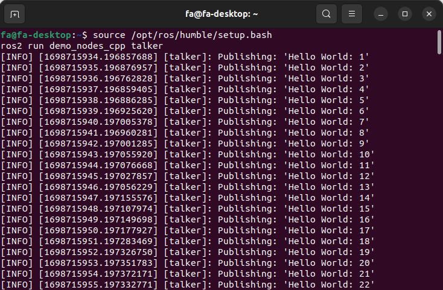
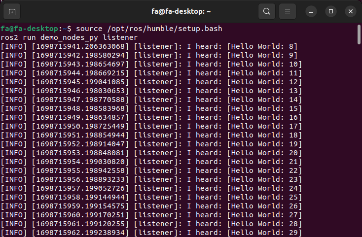
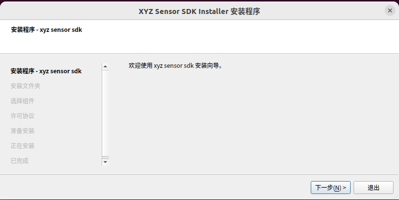

安装与配置
=============

.. toctree:: 
   :maxdepth: 6

环境要求
----------------
本软件适用于具有如下配置的计算机/工控机：

- 操作系统：Ubuntu 22.04.3 LTS-64bit
- 内存：不小于16GB（推荐32GB）
- Python版本：3.10

ROS2安装
-------------
参考链接：https://docs.ros.org/en/humble/Installation/Ubuntu-Install-Debians.html

设置语言环境
~~~~~~~~~~~~~~~~~

.. code-block:: c++
    :linenos:
    
    locale  # check for UTF-8
    sudo apt update && sudo apt install locales
    sudo locale-gen en_US en_US.UTF-8
    sudo update-locale LC_ALL=en_US.UTF-8 LANG=en_US.UTF-8
    export LANG=en_US.UTF-8
    locale  # verify settings

安装源
~~~~~~~~~
将ROS 2 apt存储库添加到系统中，首先确保Ubuntu Universe存储库是启用的：

.. code-block:: c++
    :linenos:

    sudo apt install software-properties-common
    sudo add-apt-repository universe

用apt添加ROS 2 GPG密钥：

.. code-block:: c++
    :linenos:

    sudo apt update && sudo apt install curl -y
    sudo curl -sSL https://raw.githubusercontent.com/ros/rosdistro/master/ros.key -o /usr/share/keyrings/ros-archive-keyring.gpg

添加至sources list：

.. code-block:: c++
    :linenos:

    echo "deb [arch=$(dpkg --print-architecture) signed-by=/usr/share/keyrings/ros-archive-keyring.gpg] http://packages.ros.org/ros2/ubuntu $(. /etc/os-release && echo $UBUNTU_CODENAME) main" | sudo tee /etc/apt/sources.list.d/ros2.list > /dev/null

安装ROS2包
~~~~~~~~~~~~
ROS2 安装：

.. code-block:: c++
    :linenos:

    sudo apt update
    sudo apt upgrade

桌面安装(推荐): ROS, RViz, demos, tutorials：

.. code-block:: c++
    :linenos:
    
    sudo apt install ros-humble-desktop

ROS-Base 安装 (Bare Bones):通信库、消息包、命令行工具：

.. code-block:: c++
    :linenos:

    sudo apt install ros-humble-ros-base

开发工具安装:编译器和其他构建ROS包的工具：

.. code-block:: c++
    :linenos:

    sudo apt install ros-dev-tools

环境搭建
~~~~~~~~~~~~~~~~
将source /opt/ros/humble/setup.bash添加到.bashrc中：

.. code-block:: c++
    :linenos:

    echo 'source /opt/ros/humble/setup.bash' >> ~/.bashrc

测试Talker-listener
~~~~~~~~~~~~~~~~~~~~~~~
如果您安装了上面的ros-humble-desktop，您可以尝试一些示例。

在一个终端中，source setup文件，然后运行c++ 的talker：

.. code-block:: c++
    :linenos:

    source /opt/ros/humble/setup.bash
    ros2 run demo_nodes_cpp talker

在另一个终端中，source setup文件，然后运行python的 listener：

.. code-block:: c++
    :linenos:

    source /opt/ros/humble/setup.bash
    ros2 run demo_nodes_py listener

演示结果如图2-2-1和图2-2-2所示，您应该看到talker正在发布消息，而listener接受了那些消息，从而验证c++和Python api是否正常工作。

.. centered:: 图表 2-2-1 ros2启动c++的talker

.. centered:: 图表 2-2-2 ros2启动python的listener

ROS2-control安装
-----------------------
参考链接：
https://github.com/ros-controls/control.ros.org/blob/master//doc/getting_started/getting_started.rst

工作区创建及源码下载
~~~~~~~~~~~~~~~~~~~~~~~~

.. code-block:: c++
    :linenos:

    mkdir -p ~/ros2_control_ws/src
    cd ~/ros2_control_ws/
    wget https://raw.githubusercontent.com/ros-controls/control.ros.org/master/ros_controls.$ROS_DISTRO.repos
    vcs import src < ros_controls.$ROS_DISTRO.repos

安装依赖
~~~~~~~~~~~~

.. code-block:: c++
    :linenos:

    rosdep update --rosdistro=$ROS_DISTRO
    sudo apt-get update
    rosdep install --from-paths src --ignore-src -r -y

编译
~~~~~~~~~~~~

.. code-block:: c++
    :linenos:

    ./opt/ros/${ROS_DISTRO}/setup.sh
    colcon build --symlink-install

PCL安装
--------------
参考链接：https://pcl.readthedocs.io/projects/tutorials/en/latest/compiling_pcl_posix.html

下载安装包并解压
~~~~~~~~~~~~~~~~~~~~~
解压安装包：

.. code-block:: c++
    :linenos:

    unzip pcl-master.zip

创建工作目录
~~~~~~~~~~~~~~~~~~~~~

.. code-block:: c++
    :linenos:

    cd pcl-master
    mkdir build
    cd build

编译
~~~~~~~~~~~~~~~~~~~~~
使用默认选项运行CMake构建系统

.. code-block:: c++
    :linenos:

    cmake ..

编译：

.. code-block:: c++
    :linenos:

    make -j2
    sudo make -j2 install

OpenCV安装
---------------
参考链接：https://docs.opencv.org/4.5.4/d7/d9f/tutorial_linux_install.html

下载安装包并解压
~~~~~~~~~~~~~~~~~~~
解压安装包：

.. code-block:: c++
    :linenos:

    unzip opencv-4.5.4.zip

创建工作目录
~~~~~~~~~~~~~~~~

.. code-block:: c++
    :linenos:

    cd opencv-4.5.4
    mkdir build
    cd build

编译
~~~~~~~~~~~~~~~~
使用默认选项运行CMake构建系统：

.. code-block:: c++
    :linenos:

    cmake ..

编译：

.. code-block:: c++
    :linenos:

    make
    sudo make install

Opencascade安装
--------------------

下载安装包并解压
~~~~~~~~~~~~~~~~~
解压安装包：

.. code-block:: c++
    :linenos:

    tar -xzvf opencascade-7.4.0.tgz

创建工作目录
~~~~~~~~~~~~~~~~~~~~~

.. code-block:: c++
    :linenos:

    cd opencascade-7.4.0
    mkdir build
    cd build

编译
~~~~~~~~~~~~~~~~
使用默认选项运行CMake构建系统：

.. code-block:: c++
    :linenos:

    cmake ..

编译：

.. code-block:: c++
    :linenos:

    make
    sudo make install

Nodeeditor安装
-----------------------
参考链接：https://github.com/paceholder/nodeeditor

下载安装包并解压
~~~~~~~~~~~~~~~~~
解压安装包(我们对nodeeditor源码进行了修改，请使用我们提供的安装包)：

.. code-block:: c++
    :linenos:

    unzip nodeeditor

创建工作目录
~~~~~~~~~~~~~~~~~~~~~

.. code-block:: c++
    :linenos:

    cd nodeeditor
    mkdir build
    cd build

编译
~~~~~~~~~~~~~~~~
使用默认选项运行CMake构建系统：

.. code-block:: c++
    :linenos:

    cmake ..

编译：

.. code-block:: c++
    :linenos:

    make-j
    sudo make install

XYZ Sensor SDK安装
-----------------------

下载安装包并解压
~~~~~~~~~~~~~~~~~~
解压安装包xyz-sensor-sdk-installer_staging_linux_amd64_0.5.5-pre.2+662156be.run，进入root超级用户：

.. code-block:: c++
    :linenos:

     ./xyz-sensor-sdk-installer_staging_linux_amd64_0.5.5-pre.2+662156be.run

.. centered:: 图表 2.8-1 XYZ Sensor SDK安装示意图

进入以下目录
~~~~~~~~~~~~~~~~~~~

.. code-block:: c++
    :linenos:

    cd /opt/xyz-sensor-sdk/lib

复制lib文件
~~~~~~~~~~~~~~~~

.. code-block:: c++
    :linenos:

    sudo cp lib* /usr/lib

法奥ROS2功能包安装
----------------------

下载ros2_ws包
~~~~~~~~~~~~~~~~
解压安装包：

.. code-block:: c++
    :linenos:

    unzip ros2_ws.zip

进入以下目录
~~~~~~~~~~~~

.. code-block:: c++
    :linenos:

    cd ros2_ws

Python第三方库安装
~~~~~~~~~~~~~~~~~~
使用下面的指令安装AI功能包所需的Python第三方库：

.. code-block:: c++
    :linenos:

    pip3 install -r src/requirements.txt

设置环境变量
~~~~~~~~~~~~~~
将source ~/ros2_ws/install/setup.bash添加到.bashrc中

.. code-block:: python
    :linenos:

    echo 'source ~/ros2_ws/install/setup.bash' >> ~/.bashrc

如图2.4所示在source /opt/ros/humble/setup.bash上方添加以下指令并保存

.. code-block:: c++
    :linenos:

    export LD_LIBRARY_PATH=/usr/local/lib/ 

.. image:: airlab_pictures/004.png
   :width: 6in
   :align: center

.. centered:: 图表 2-9-1 环境变量设置