操作指南
=============

.. toctree:: 
   :maxdepth: 6

坐标系标定
--------------
在开始码垛前，需要标定码盘（工件）、传送带（工件）和吸盘（工具）的坐标系，具体操作方法详见法奥协作机器人使用手册的第5.4.1节“工具坐标”和第5.4.3节“工件坐标”。

参考链接：https://fr-documentation.readthedocs.io/zh-cn/latest/CobotsManual/intro.html#id4

开启ROS2节点
---------------
打开一个新的终端，输入下列命令以开启混合码垛运行所需的ROS2节点：

.. code-block:: c++
    :linenos:

    cd 
    ./fr_pallet.sh

执行命令后会打开4个终端窗口，分别运行机器人指令节点、视觉节点、AI节点和AIRLab软件。

码垛任务初始化
----------------
码垛任务初始化步骤包括导入配置文件、视觉标定、配置机器人参数和配置混合码垛参数。

导入配置文件
~~~~~~~~~~~~~~~~~~
点击菜单栏“文件 - 导入”，打开配置文件设置窗口：

.. image:: airlab_pictures/039.png
   :width: 6in
   :align: center

.. centered:: 图表 5-3-1 配置文件设置窗口

点击“打开”，打开配置文件选择窗口，选择配置文件，点击“Open”按钮导入文件：

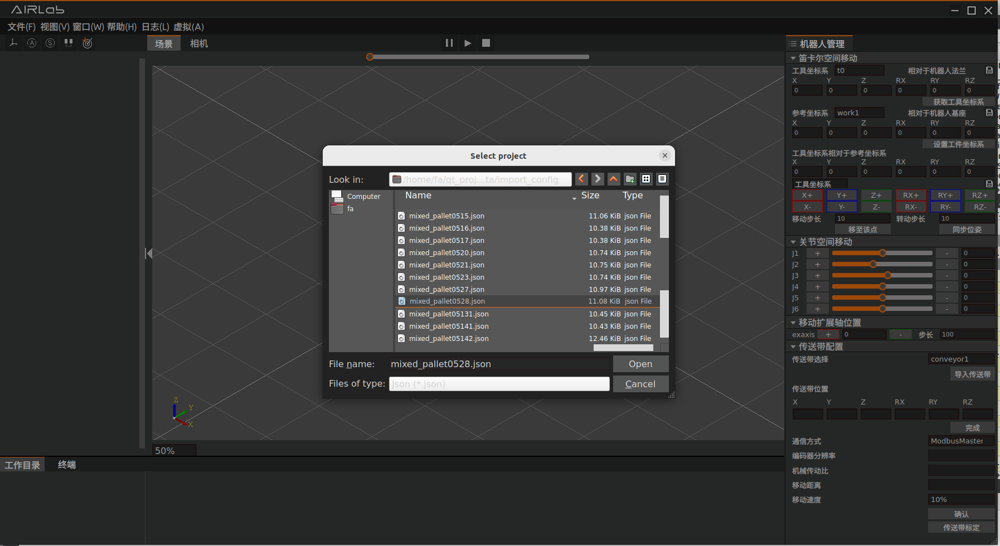

.. centered:: 图表 5-3-2 配置文件选择窗口

导入配置文件之后的软件界面如下图所示，配置文件中的内容显示在左侧的工程树中：

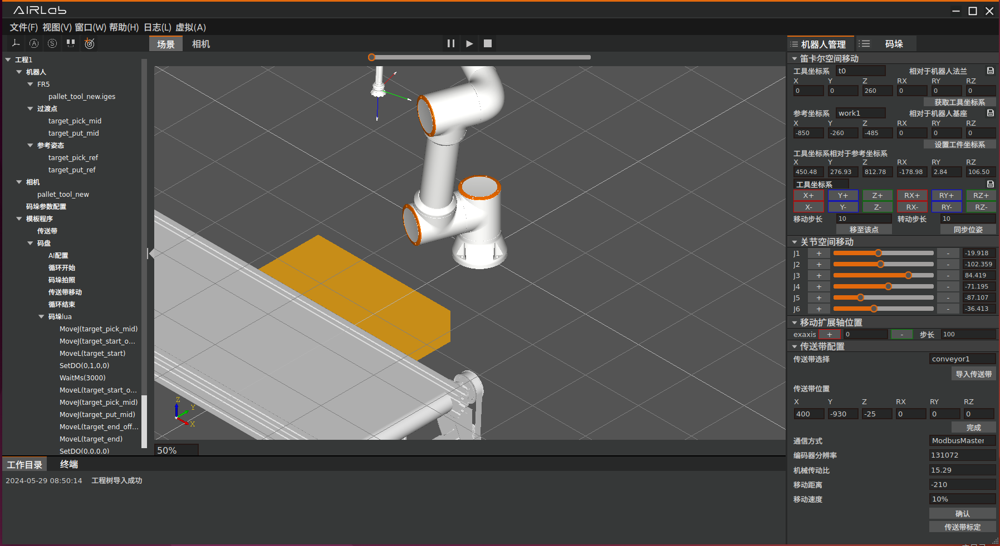

.. centered:: 图表 5-3-3 导入配置文件后的软件界面

视觉标定
~~~~~~~~~~~~
视觉标定是标定机器人、传送带和相机三者之间的相对关系，整个码垛环境搭建好后只需标定一次，后续过程中三者的位置不发生变动则无需再次标定，如果发生位置变动则需重新标定。

相机手眼标定
++++++++++++++
.. important:: 将标定板装在机器人末端法兰处，手动拖动机器人末端至相机下方，保证相机能完整拍摄到标定板。

1. 首先点击工程树的相机，右侧机器人管理面板下方出现相机标定页面。
2. 当每次开始标定时，点击重新标定按钮，然后开始标定。
3. 整体标定需要完成八次拍摄，第一次通过手动拖动机器人到合适位置进行拍摄，后续需要平移三次，再手动拖动调整位姿四次，每次移动完成后再点击拍照按钮，完成全部的八次拍照。
4. 当点击拍照按钮，相机完成一次拍摄后，右侧显示拍摄到的点云图，日志打印是否拍摄成功。

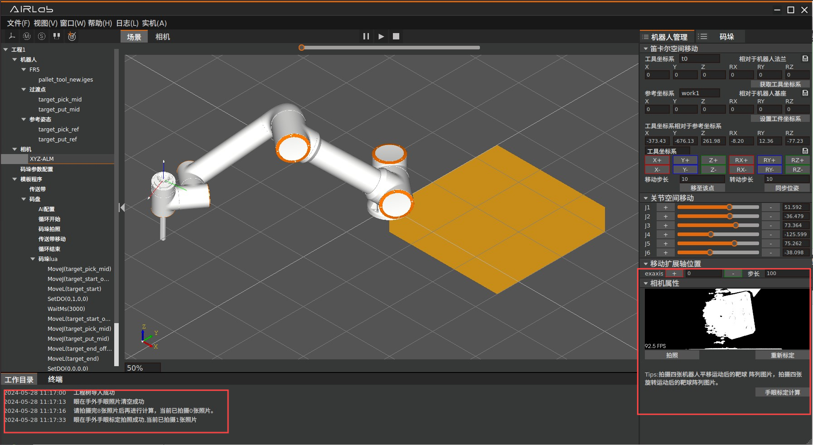

.. centered:: 图表 5-3-4 手眼标定拍照操作示意图

前三次平移机器人操作需将软件上方状态切换为实机状态，点击右侧工具坐标系的平移点动按钮（X+,X-,Y+,Y-,Z+,Z-），将机器人朝任意方向平移，平移后仍然要保证相机能完整拍摄到标定板。

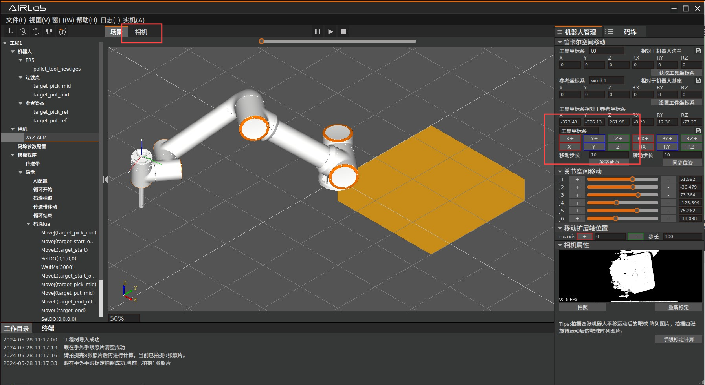

.. centered:: 图表 5-3-5 手眼标定平移机器人操作示意图 

后四次手动拖动机器人操作需人工拖动机器人改变机器人的位姿，同样需要保证相机能完整拍摄到标定板。当某次日志打印拍摄失败时，一般原因是没有拍全标定板，重新平移或者拖动机器人，继续进行该次拍摄。

当完成八次拍摄后，点击手眼标定计算按钮，程序内部完成计算后，日志打印计算完成并输出标定误差，误差在0.5mm以内即可完成手眼标定，否则建议重新标定。

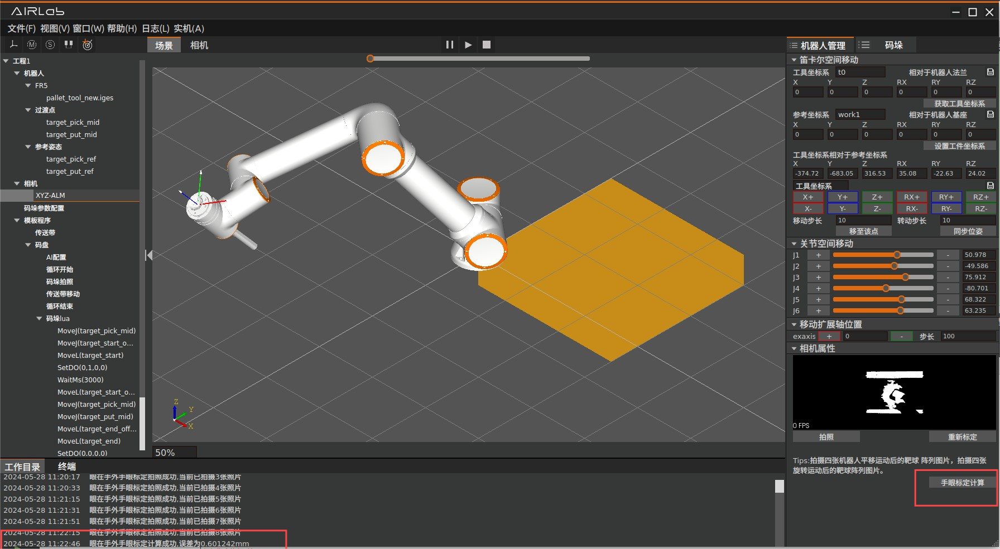

.. centered:: 图表 5-3-6 手眼标定计算操作示意图

传送带标定
++++++++++++
传送带标定按钮在机器人管理面板的右下角，点击该按钮进入传送带标定界面。

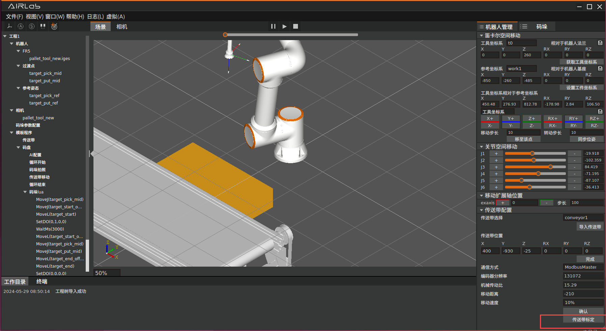

.. centered:: 图表 5-3-7 传送带标定按钮示意图

.. important:: 首先进行传送带移动向量标定。进入传送带标定界面，将标定板置于传送带上，保证相机能拍到完整的标定板。

移动向量标定总共拍摄两张图片，首先点击拍摄图片按钮，拍摄完成后显示点云图片，终端打印是否拍摄成功。

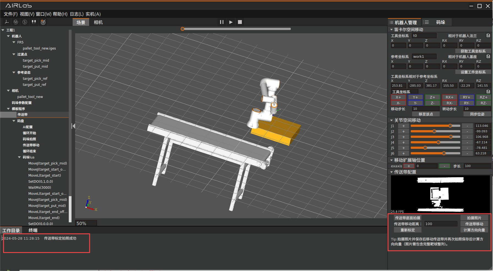

.. centered:: 图表 5-3-8 传送带移动向量标定拍摄按钮示意图

第二次点击传送带移动，保证传送带正向移动，移动完成后点击拍摄图片按钮完成一次拍摄，拍摄成功后点击计算方向向量按钮，程序计算完成后输出误差，误差为0.1mm左右则标定成功。

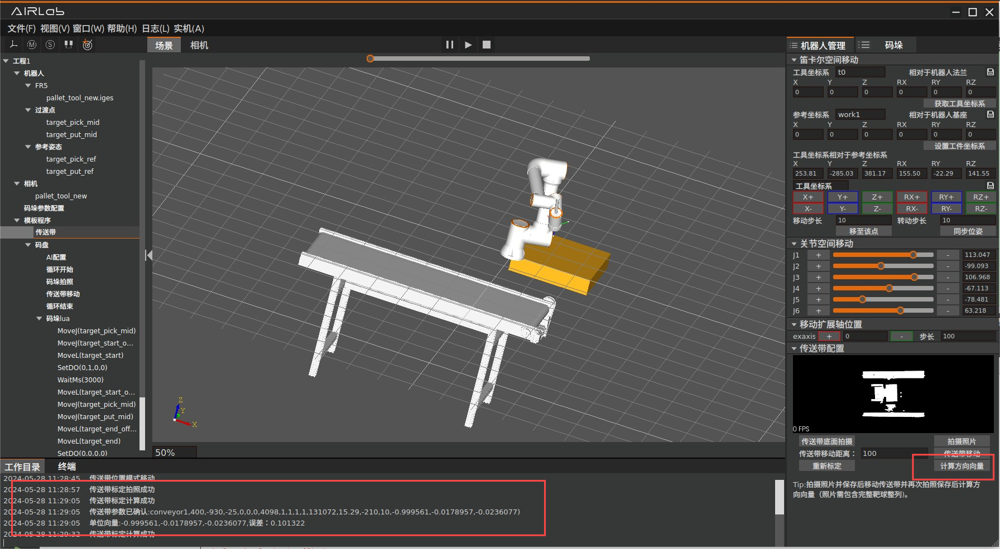

.. centered:: 图表 5-3-9 传送带移动向量计算按钮示意图

然后进行传送带底面高度标定。将标定板移走，保证相机只拍摄到传送带的底面，点击传送带底面拍摄按钮，完成拍摄后程序内部自动计算传送带的高度，返回成功。此时视觉ros节点会打印计算得到的传送带高度。

.. image:: airlab_pictures/048.png
   :width: 6in
   :align: center

.. centered:: 图表 5-3-10 传送带底面高度标定按钮示意图

配置机器人参数
~~~~~~~~~~~~~~~~~~
机器人参数在右侧的机器人管理面板进行配置：导入机器人、工具、码盘及设置坐标系方法参考3.4.1.4自定义模块。

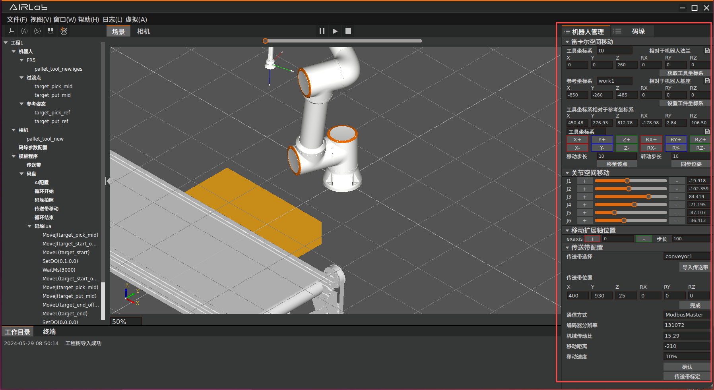

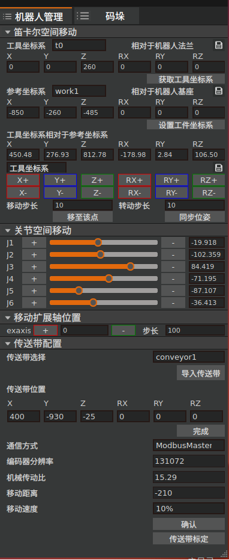

.. centered:: 图表 5-3-11 机器人管理界面

在“点位信息修改”一栏中，可以通过示教修改和记录码垛作业所需的点位，如箱子的拾取点和放置点，以及它们各自的参考姿态：

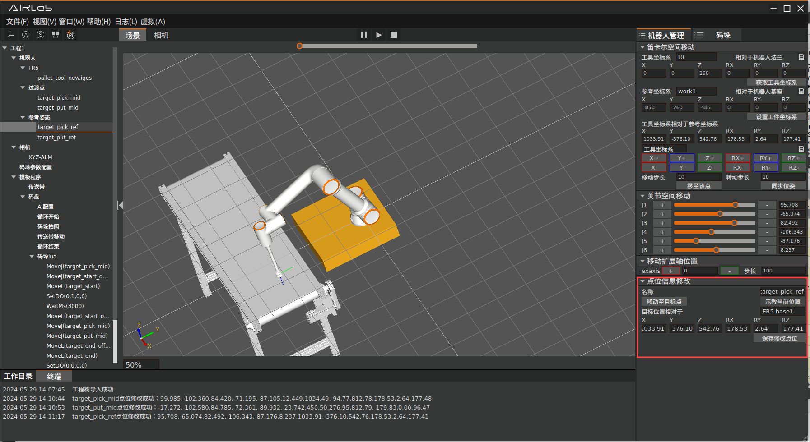

.. centered:: 图表 5-3-12 箱子拾取点的参考姿态

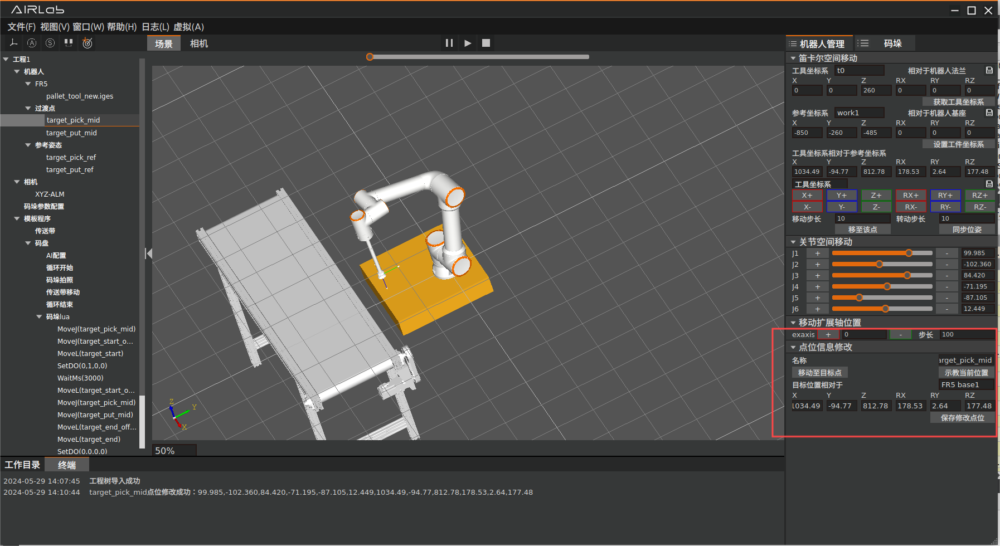

.. centered:: 图表 5-3-13 箱子拾取点

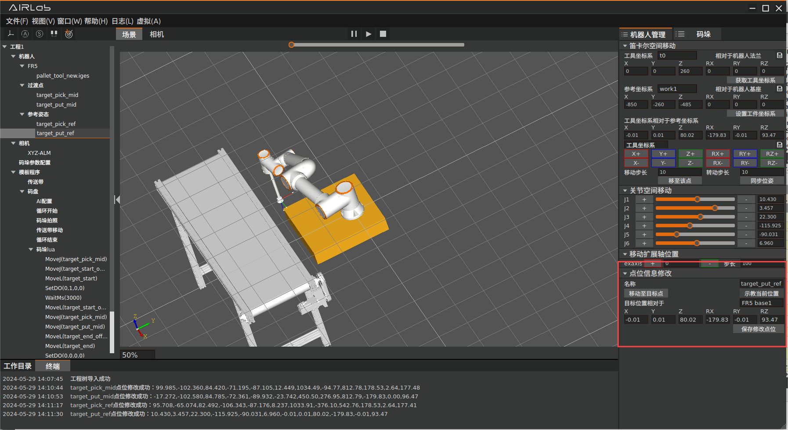

.. centered:: 图表 5-3-14 箱子放置点的参考姿态

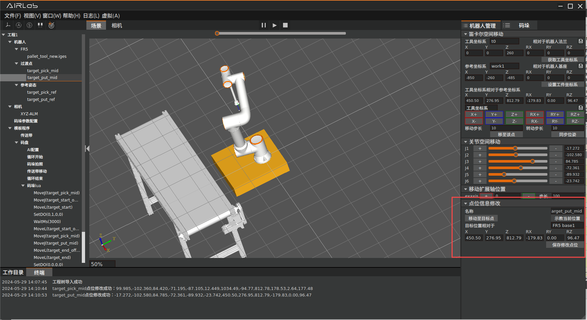

.. centered:: 图表 5-3-15 箱子放置点

传送带的相关参数在“传送带配置”一栏中进行配置：

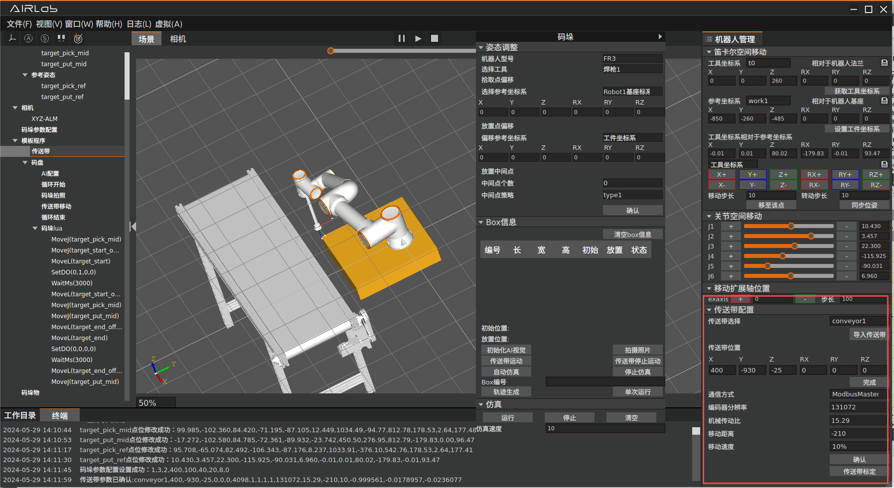

.. centered:: 图表 5-3-16 传送带配置

配置混合码垛参数
~~~~~~~~~~~~~~~~~~~~~~~
在右侧的码垛面板配置混合码垛参数，点击“码垛”文本左侧的文件目录图标可以实现面板悬浮：

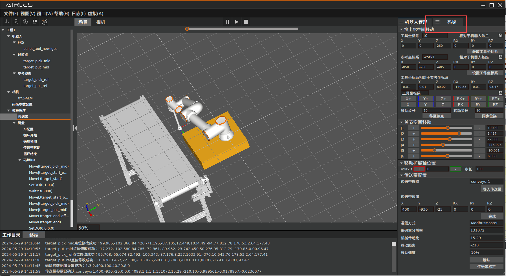

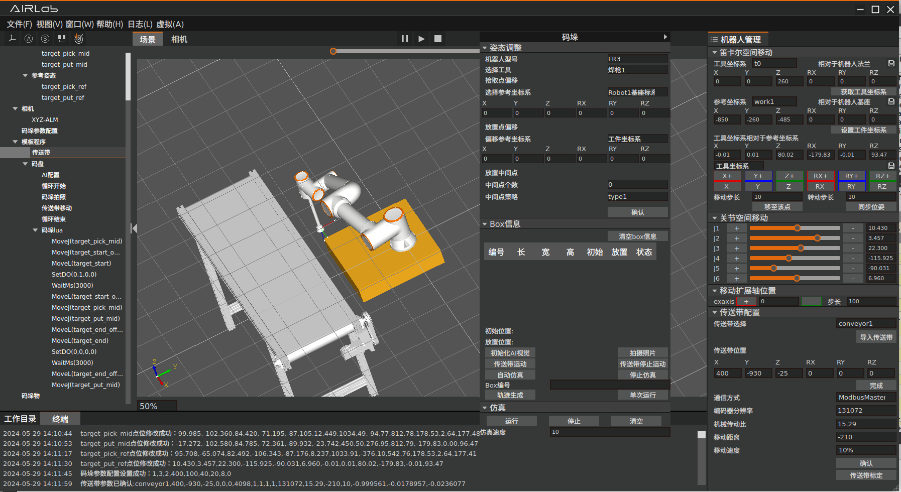
   
.. centered:: 图表 5-3-17 混合码垛面板及其悬浮效果

在黄框的“姿态调整”区，可根据实际情况进行拾取点和放置点等点位姿态的偏移调整；在红框的“参数配置”区设置前瞻Box数量、AI模型、码垛高度等参数，完成后请点击“完成”按钮：

.. image:: airlab_pictures/058.png
   :width: 6in
   :align: center
   
.. centered:: 图表 5-3-18 混合码垛参数配置

码垛任务运行
--------------
完成初始化配置后，如需单步调试运行则需要在在码垛面板上的运行控制区（图5.6绿框区域）点击“初始化AI视觉”按钮。

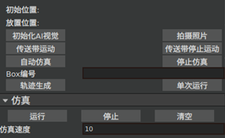
   
.. centered:: 图表 5-4-1 混合码垛运行控制区

此时AI节点终端窗口会显示如下内容，代表AI节点已初始化成功：

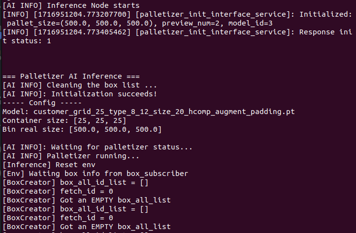
   
.. centered:: 图表 5-4-2 AI节点初始化成功

将要码垛的箱子放上传送带，点击界面左上方的手自动模式切换按钮，切换机器人模式为自动模式，然后点击三维机器人及功能区上方的运行按钮，软件即开始自动运行“拍照->传送带运动->机器人码垛”的作业过程。

码垛运行过程中，在码垛面板上的“Box信息”一栏可以实时查询每个箱子的尺寸、在传送带上的初始位置和在码盘上的预计放置位置；在三维场景界面能够看到每个箱子的仿真模型，在Box信息表格中点击某个箱子编号，软件会在三维场景界面中用红色突出显示对应的箱子（如下图所示）。

.. note:: 
    - 1-开始按钮
    - 2-停止按钮

.. image:: airlab_pictures/061.png
   :width: 6in
   :align: center
   
.. centered:: 图表 5-4-3 码垛运行中的三维场景界面

停止和重启码垛任务
---------------------
当AI节点的推理正常结束时，AI节点终端窗口会显示如下内容：

.. image:: airlab_pictures/062.png
   :width: 6in
   :align: center
   
.. centered:: 图表 5-5-1 AI节点推理结束

这表示本轮码垛作业已经正常完成，将码好的箱子和传送带上剩余的箱子整理完毕，点击“开启AI”按钮重启新一轮的码垛即可。

如果要在码垛运行过程中手动停止，点击三维机器人及功能区上方的停止按钮即可。