用户界面
=============

.. toctree:: 
   :maxdepth: 6

主界面
----------
如图所示AIRLab软件主要包括以下六个模块：菜单栏、工具栏、工程树、三维机器人及功能区、指令反馈区、操作区。其中三维机器人及功能区主要显示机器人、工具、工件模型及场景元素，指令反馈区反馈指令执行结果。

.. note:: 点击工作目录或终端进行工作目录和指令反馈结果显示的切换

菜单栏、工具栏、操作区、工程树介绍见3.2-3.5。

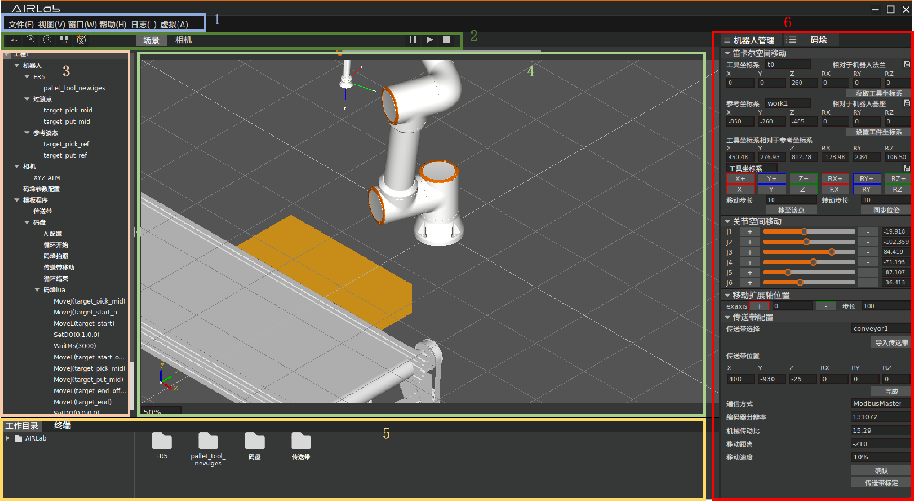

.. centered:: 图表 3-1-1 主界面

菜单栏
------------
菜单栏包括以下五个模块：文件、视图、窗口、帮助、日志、虚拟，其中窗口和帮助功能暂未开放，点击虚拟功能后该按钮会变为实机，即实时同步当前机器人位置至三维场景，在实机情况下点击该按钮则切换会虚拟状态，不会实时同步机器人位置至三维场景。文件、视图、日志介绍见3.2.1-3.2.4。

文件
~~~~~~~~~~~
点击文件后会出现下图所示弹窗。

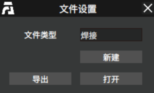

.. centered:: 图表 3-2-1 文件弹窗

如需创建新的配置文件，可选择创建的文件类型。

.. note:: 当前仅支持焊接、码垛。

选择后点击新建后创建新的配置文件。如下图所示为创建的码垛配置文件。

.. image:: airlab_pictures/007.png
   :width: 6in
   :align: center

.. centered:: 图表 3-2-2 新建码垛文件

如需导入已经保存的配置文件，则点击打开，如下图所示选择需导入的文件后点击确认，即可导入已保存的配置文件。

.. image:: airlab_pictures/008.png
   :width: 6in
   :align: center

.. centered:: 图表 3-2-3 打开已保存配置文件

如需导出当前场景则点击导出，输入保存的配置文件名后点击保存，即可保存当前场景为配置文件。

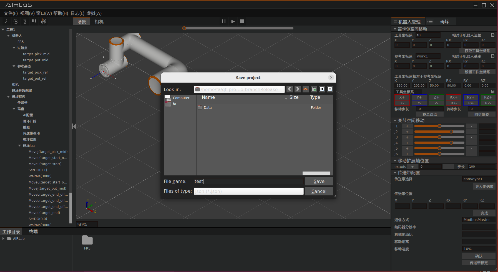

.. centered:: 图表 3-2-4 导出当前场景

视图
~~~~~~~~~~~
视图功能如下表所示。

.. centered:: 表 3.1 视图功能对应表

.. list-table::
   :widths: 50 80
   :align: center

   * - Zoom
     - 通过鼠标滚轮放大图像或缩小三维场景

   * - Pan
     - 长按鼠标滚轮移动实现三维场景平移

   * - Rotate
     - 长按鼠标滚轮移动实现三维场景旋转

   * - Reset
     - 将三维场景还原到初始状态

   * - Fit all
     - 自动调整可视区域的大小和位置

   * - 前视
     - 将视角切换至前视视角

   * - 后视
     - 将视角切换至后视视角

   * - 俯视
     - 将视角切换至俯视视角

   * - 仰视
     - 将视角切换至仰视视角

   * - 左视
     - 将视角切换至左视视角

   * - 右视
     - 将视角切换至右视视角

   * - 全视
     - 将视角切换至全视视角

日志
~~~~~~~~~~~~~~
点击日志后会出现下图所示弹窗。

日志等级分别为：DEBUG 、INFO、WARNING、ERROR。

- **DEBUG**：会自动记录DEBUG 、INFO、WARNING、ERROR级别的日志；
- **INFO**：会自动记录INFO、WARNING、ERROR级别的日志；
- **为WARNING**，会自动记录WARNING、ERROR级别的日志；
- **ERROR**：会自动记录ERROR级别的日志，默认日志等级为INFO。

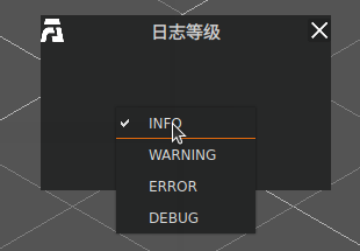

.. centered:: 图表 3.2-5 日志等级设置

工具栏
-----------
点击场景显示当前三维场景，点击相机显示相机视野。其余工具栏功能如下所示。

   

   

   

   

   

   

   
操作区
-------------
如下图所示，操作区包括两个模块，一个是机器人模块，另一个是码垛模块。

.. note:: 码垛模块需导入码垛工程文件后才会出现。

点击黄色框区域会切换操作区为机器人模块，点击红色框区域会将码垛模块以弹窗形式显示（可以移动），点击绿色模块会将操作区切换为码垛模块（无法移动）。

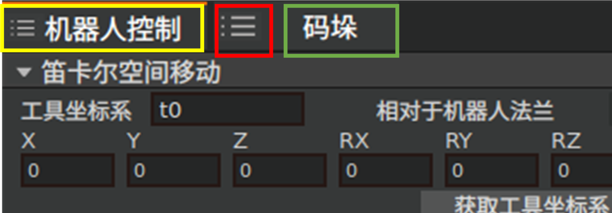

.. centered:: 图表 3-4-1 操作区切换1

当码垛模块以弹窗形式显示时，点击下图红色区域会将操作确切换为码垛模块，且无法移动。

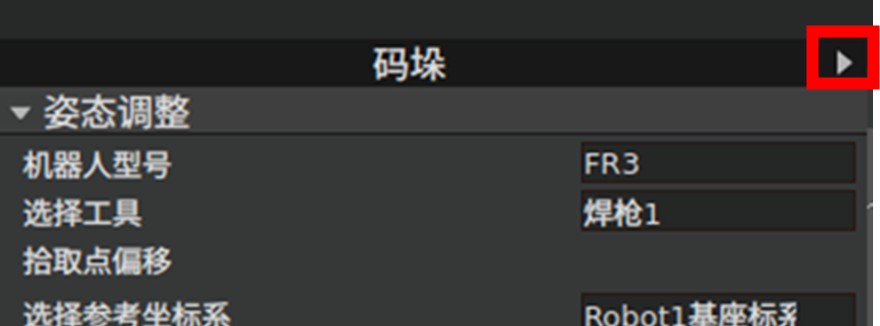

.. centered:: 图表 3-4-2 操作区切换2

机器人模块包括两个部分，一个部分为机器人管理，另一部分为其他控制。

机器人管理
~~~~~~~~~~~

如下图所示机器人管理分为四个部分：笛卡尔空间移动，关节空间移动、移动扩展轴位置、自定义模块。

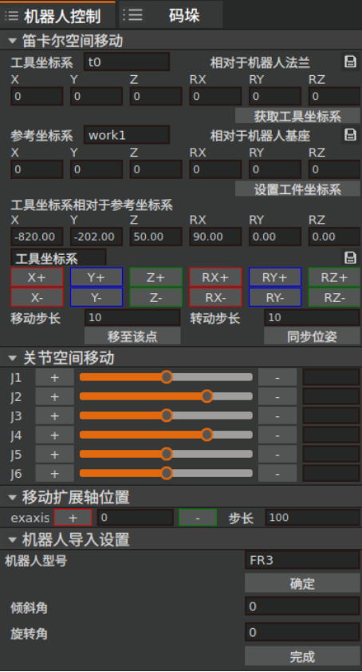

.. centered:: 图表 3-4-3 机器人管理

笛卡尔空间移动
+++++++++++++++++
笛卡尔空间移动包含以下功能，工具工件坐标系设置，笛卡尔坐标显示，点动。

**工具坐标系设置**：红色矩形框区域可选择当前AIRLab的工具坐标系编号，蓝色矩形框区域可以设置AIRLab的工具坐标系，点击获取工具坐标系，可以获取当前机器人的工具坐标系值并应用至AIRLab，保存功能暂未开放。

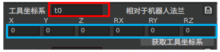

.. centered:: 图表 3-4-4 获取工具坐标系

**工件坐标系设置**：红色矩形框区域可选择当前AIRLab的工件坐标系编号，蓝色矩形框区域可以设置AIRLab的工件坐标系，点击设置工件坐标系，可以获取当前AIRLab的工件坐标系设置为机器人当前工件坐标系（工件号为选中工件号），保存功能暂未开放。

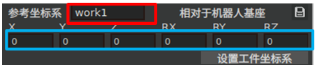

.. centered:: 图表 3-4-5 设置工件坐标系

当前状态为虚拟时，点击“+”“—”，或设置笛卡尔空间位姿实现机器人三维模型笛卡尔空间运动，长按0.6s后触发运动，松开或运动到位停止运动。当前状态为实体时，点击“+”“—”或设置笛卡尔空间位姿实现实际机器人笛卡尔空间运动。黄色矩形区域，显示当前AIRLab机器人笛卡尔坐标。

.. note:: 可以通过修改移动步长和转动步长设置步长。

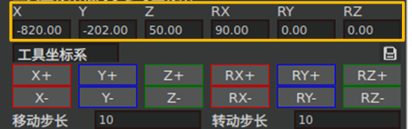

.. centered:: 图表 3-4-6 笛卡尔空间点动

关节空间移动
++++++++++++++
关节空间移动，显示当前三维场景中机器人关节角度。拖动J1-J6滑槽或设置J1-J6关节值实现机器人三维模型关节空间运动。

当前状态为虚拟时，点击“+”“—”或设置关节空间位姿实现机器人三维模型关节空间运动，长按0.6s后触发运动，松开或运动到位停止运动。当前状态为实体时，点击“+”“—”实现实际机器人关节空间运动。

.. note:: 可以通过修改移动步长和转动步长设置步长。

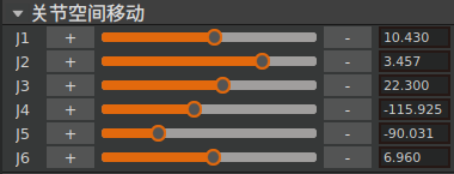

.. centered:: 图表 3-4-7 关节空间点动

扩展轴空间移动
+++++++++++++++
扩展轴移动(需导入扩展轴)，显示当前三维场景中扩展轴位置。拖动滑槽或设置值实现扩展轴三维模型空间运动。

点击“+”“—”或设置关节空间位姿实现机器人三维模型关节空间运动，长按0.6s后触发运动，松开或运动到位停止运动。

.. note:: 可以通过修改移动步长和转动步长设置步长。

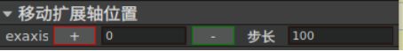

.. centered:: 图表 3-4-8 移动扩展轴

自定义模块
+++++++++++++++
自义定模块包括以下内容：机器人导入设置、工具导入设置、相机配置（手眼标定）、传送带配置、码盘配置、码垛参数配置、点位修改。

**机器人导入设置**：选择实际的机器人型号后点击导入，会在三维场景中导入机器人（如已连接ROS会自动获取机器人DH参数并补偿），可以在此处设置机器人倾斜角和旋转角，点击确定实现机器人其他安装方式安装。

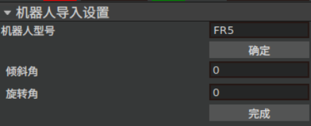

.. centered:: 图表 3-4-9 机器人导入设置

**工具导入设置**：点击打开后选择需导入的工具模型，会在当前三维场景中导入对应的工具模型。点击获取当前工具坐标系可以获取当前机器人的工具坐标系，点击完成会将设置的内容保存在缓冲区（如需保存项目需导出文件）。

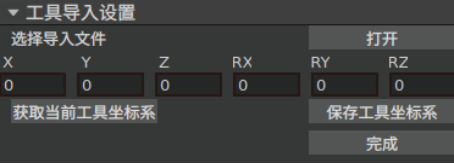

.. centered:: 图表 3-4-10 工具导入设置

**相机配置**：包括相机选择和相机设置（手眼标定），选择相机型号后点击确定设置当前的相机。相机设置（手眼标定）详见5.3.2.1。

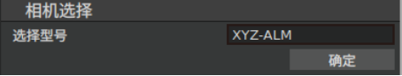

.. centered:: 图表 3-4-11 相机选择

**传送带配置**：包括传送带参数配置和传送带手眼标定，选择传送带后点击导入传送带即可在三维场景中导入传送带模型，输入传送带的位置后点击完成设置传送带在三维场景中的位置（传送带位置与实际位置存在误差只会影响三维场景的视觉效果，不影响使用）。设置传送带的通信方式、输出传送带分辨率、机械传动比、单次移动距离和移动速度后点击确认，保存传送带参数至缓存区。点击传送带标定进入传送带标定页面，详见5.3.2.2。

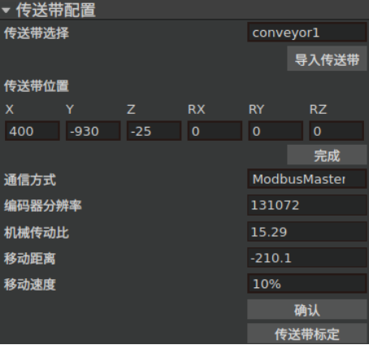

.. centered:: 图表 3-4-12 传送带配置

**码盘配置**：输出需生成码盘的长、宽、高并选择码盘的坐标原点（建议选择原点在上表面端点1），点击生成码盘会在三维场景中生成码盘。输入码盘的坐标系后点击设置，会在三维场景中重新设置码盘位置。

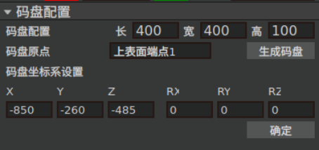

.. centered:: 图表 3-4-13 码盘配置

**码垛参数配置**：需设置码垛前瞻Box数k、Box获取位置信息后需移动次数、选择的AI算法、码垛的上限高度、安全高度（拾取点上方的过渡位置）、默认速度、安全速度（接近放置和拾取点时的速度）、控制吸盘和夹爪的DO信号、末端检测DI（暂未开放），点击完成后完成设置。其中关于前瞻数k、Box获取位置信息后需移动次数和AI算法的解释详见4.2。

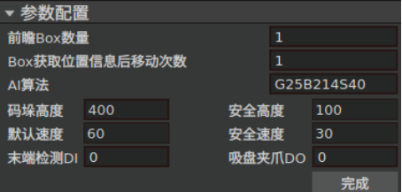

.. centered:: 图表 3-4-14 码垛参数配置

**点位修改**：示教当前位置一般在实体情况下使用（虚拟机器人与实际机器人位置实时同步），将机器人移动至合适点位后点击示教当前位置会保存该点位为当前位置（AIRLab码垛模块暂不支持修改过渡点位和参考姿态点位的名称）。保存修改点位一般用于虚拟情况下使用，以当前三维场景中机器人的位置为初始姿态，以目标笛卡尔位置为参数，进行逆运动学求解，并保存目标位置（逆运动学求解与参考姿态相关参考姿态不合适会出错）。

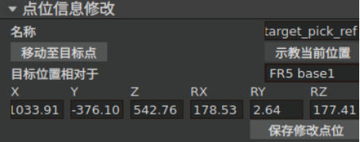

.. centered:: 图表 3-4-15 点位信息修改

其他控制
~~~~~~~~~~~~~~
机器人控制主要包括IO控制和外部轴设置两个模块。

如下图所示，括IO控制模块可以实现对机器人控制箱中数字输出、模拟输出（0-10v）和末端工具数字输出、模拟输出（0-10v）扩展IO数字输出、模拟输出（0-10v）进行手动控制： 

**DO 操作**：选择端口号，点击开启设置对应DO为高电平，点击关闭设置对应DO为低电平。

**AO 操作**：选择端口号，右侧输入框输入值（0-100），该数值为百分比，设置 100 即表示设置该 AO 端，点击设置实现对应AO端口设置。

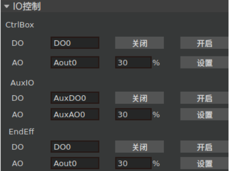

.. centered:: 图表 3-4-16 IO控制

如下图所示，外部轴控制模块可以实现对机器人外部轴控制。

**加载**：根据选择的扩展轴编号加载外部轴协议。

**去除使能**：外部轴去除使能。

**伺服使能**：外部轴使能。

**正向点动**：根据设置的运行速度、加速度、距离进行外部轴正向点动。

**反止点动**：根据设置的运行速度、加速度、距离进行外部轴反向点动。

**停止点动**：外部轴停止点动。

**零点设置**：根据当前的回零方式、寻零速度、箍位速度进行外部轴回零。

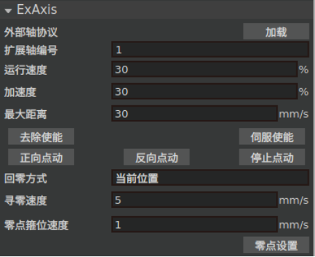

.. centered:: 图表 3-4-17 外部轴控制

码垛模块
~~~~~~~~~~~~~
码垛模块包含三部分内容：姿态调整、Box信息和仿真。

姿态调整
+++++++++++++++
姿态调整模块可以拾取点和放置点进行补偿。拾取点补偿目前仅开放机器人基坐标为参考坐标系，放置点补偿目前仅开放机器人工件坐标系为参考坐标系。

放置中间点为码垛放置的中间点，选择n中间点和中间点策略（当前仅有一种策略，假设放置位置为z1，码垛高度为h，安全高度为safe_h,则Zmax=h+safe_h, Zmin =z1+h,在Zmax和 Zmin之间设置n个中间点），点击完成后完成设置，并保存至缓冲区。

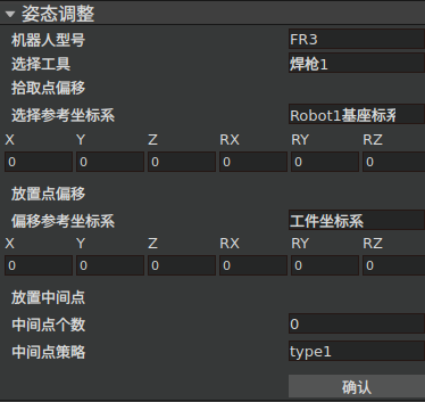

.. centered:: 图表 3-4-18 姿态调整

Box信息
+++++++++++++
**清空Box信息**：可以清空当前已接受的Box信息;

**初始化AI视觉**：清空AI和视觉的缓存信息准备开始下一次的码垛作业；

**拍摄照片**：下发指令控制相机拍摄照片；

**传送带运动**：下发指令控制相机拍摄照片，拍摄成功后控制传送带运动一次；

**传送带停止运动暂未开放**：自动仿真开启后，按照已接受到的Box信息在三维场景中进行仿真作业（如需仿真需将模式设置为虚拟）；

**停止仿真**：点击后停止自动仿真；轨迹生成，根据选择的Box编号生成第n个box的仿真轨迹；

**单次运行**：下发指令实现第n个箱子的单次码垛。其中初始化AI视觉、传送带运动和单次运行用于手动调试以确认是否需要进行位姿补偿。

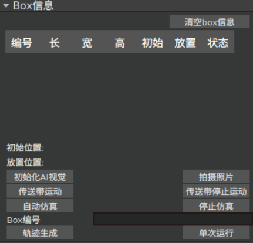

.. centered:: 图表 3-4-19 Box信息

仿真
+++++++++++++
设置仿真速度后，点击运行，机器人进行单次的仿真码垛。

.. important:: 需轨迹生成后才可使用。

点击停止停止运动；

点击清空，清空仿真轨迹。

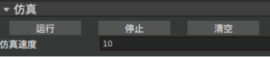

.. centered:: 图表 3-4-20 仿真

工程树
---------
点击工程树跳转的自定义界面如下表所示。

.. centered:: 表 3.2 工程树跳转的自定义界面

.. list-table::
   :widths: 50 80
   :header-rows: 0
   :align: center

   * - **当前节点**
     - **跳转目标**

   * - 机器人
     - 机器人导入设置

   * - FR3、FR5、FR10、FR16、FR20
     - 工具导入设置

   * - target_pick_mid
     - 点位修改

   * - target_put_mid
     - 点位修改

   * - target_pick_ref
     - 点位修改

   * - target_put_ref
     - 点位修改

   * - 相机
     - 相机设置

   * - XYZ-ALM
     - 相机属性（手眼标定）

   * - 码垛参数配置
     - 码垛参数配置

   * - 传送带
     - 传送带配置

   * - 码盘
     - 码盘配置