附录
========

.. toctree:: 
  :maxdepth: 5

附录1：运动控制器错误及处理方式
--------------------------------

.. figure:: appendix/001.png
   :align: center
   :width: 6in

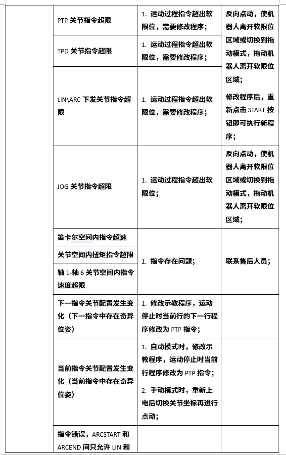

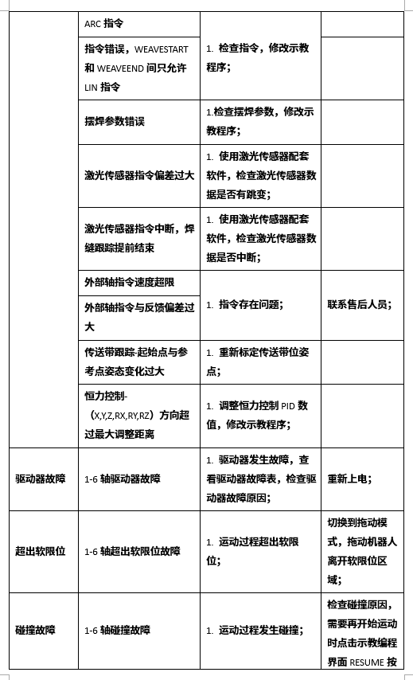

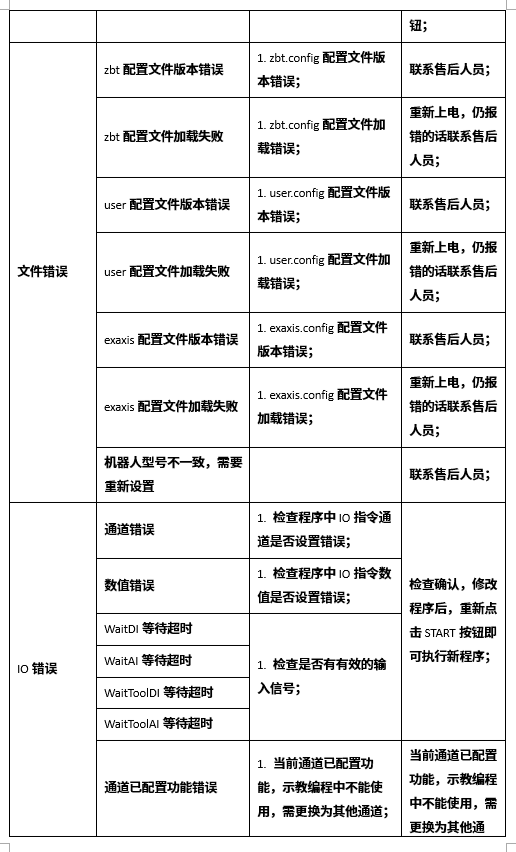
   
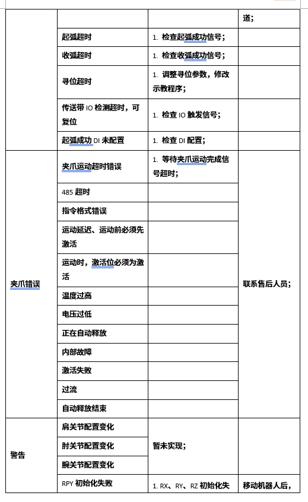
   
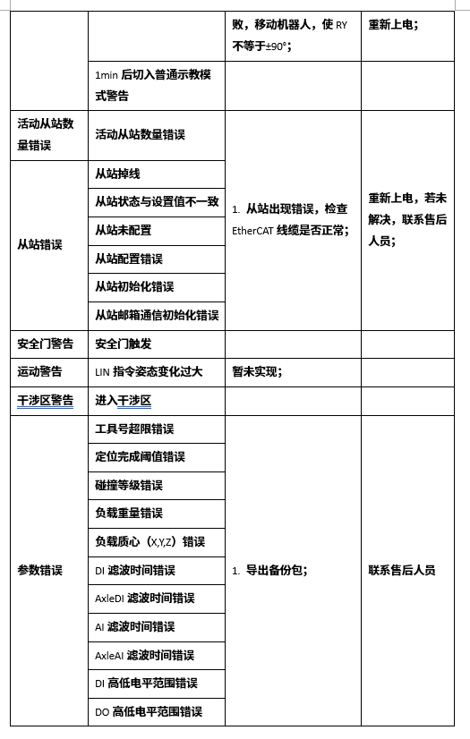
   
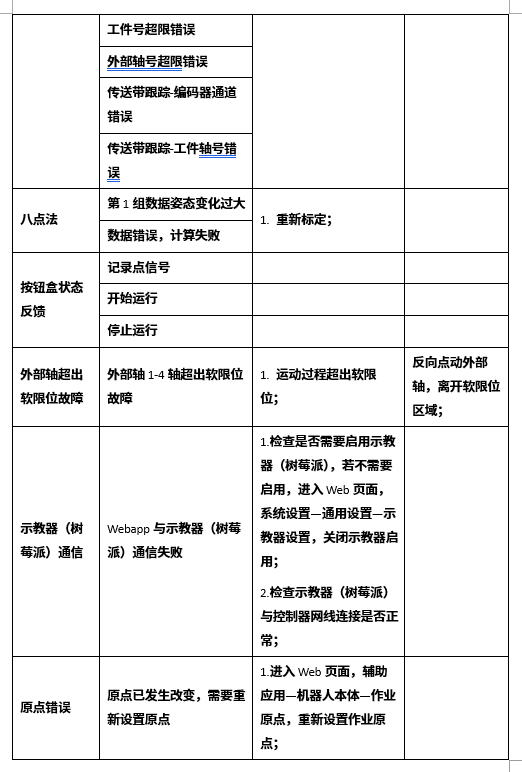

附录2：伺服驱动器故障代码表
---------------------------

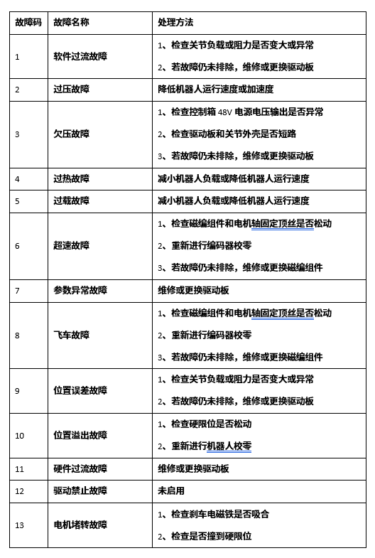
   
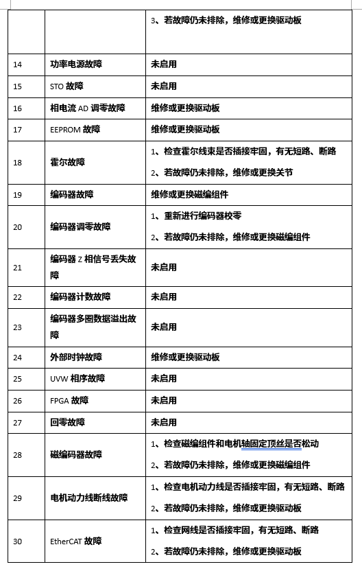
   
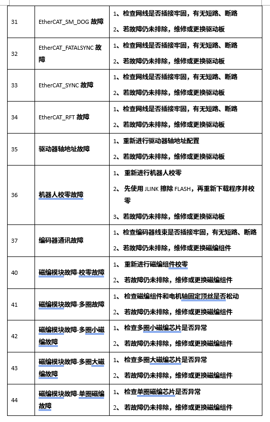
   
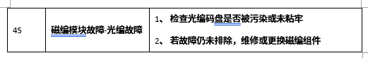

附录3：末端板485升级
---------------------------

现场使用时，有可能更新固件，满足新的要求，会提供新的升级文件（XX_XX_MAIN.bin），通过485接口对末端板进行升级（需要借助USB转485模块）。升级步骤如下：

**Step1：485接线**，在机器人末端处有5Pin通信航空接头，航空接头Pin脚分布及其pin脚说明如图表1所示。将机器人末端的485-A、485-B与USB转485工具的A、B使用双绞线连接。

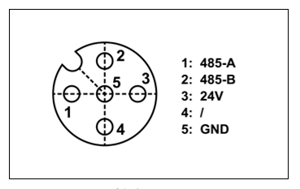

.. centered:: 图表3-1 航空接头Pin脚分布

**Step2，硬件连接**，将USB转485工具的USB端与PC连接，在PC设备管理器中，如果识别到USB&485工具，会出现如下界面。

.. figure:: appendix/013.png
   :align: center
   :width: 6in

.. centered:: 图表3-2 USB&485端口识别说明

**Step3：升级工具**，在完成接线后，打开“法奥串口调试助手”，点击“末端板”按钮，在“串口参数设置”功能中选择上述识别的串口，波特率115200，数据位8位，校验位无，停止位1，然后打开串口，成功之后会出现“串口打开成功”的提示。

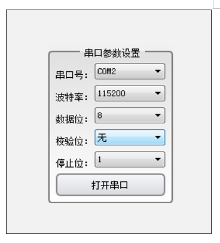

.. centered:: 图表3-3 串口参数设置

**Step4：固件升级**，选择“末端板”，点击“固件升级”，如图表所示：

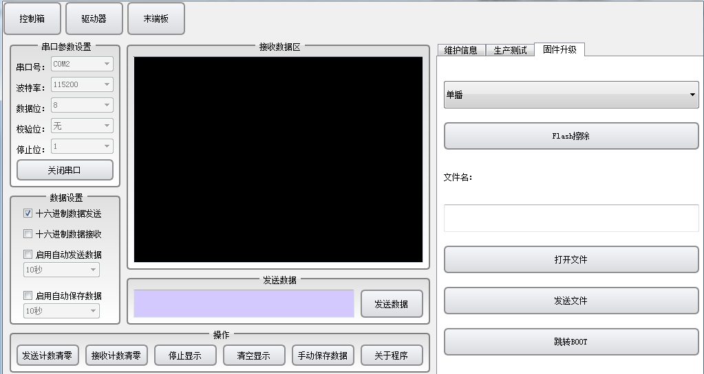

.. centered:: 图表3-4 末端板固件升级

-  首先点击“Flash擦除”，擦除成功之后，会在接收数据区提示擦除成功。

-  打开文件（待升级文件），选择存放的路径，如下所示，选择完成后，待升级文件名会出现在文件名显示框中。

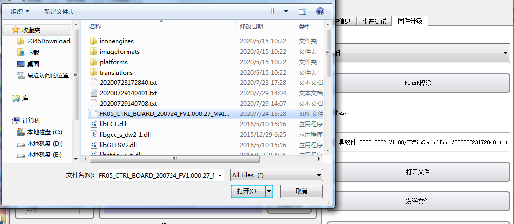

.. centered:: 图表3-5 选择升级文件

-  点击“发送文件”，当进度条显示100%时，表示已经完成发送升级文件。

**Step5：升级验证**，系统重启上电，在“维护信息”栏，选择“查询末端板固件版本信息”，在“接收数据区”会显示固件版本信息，如果和升级的文件版本信息一致，说明升级成功，否则升级失败.

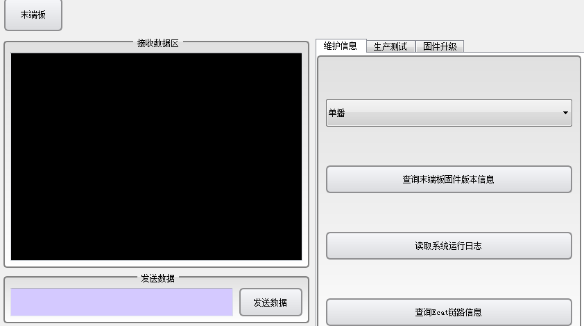

.. centered:: 图表3-6 查询固件版本信息

附录4：控制箱485升级
------------------------

在机器人控制箱板有“电源通信”接口，将USB&485工具A、B分别接入其接口的“485-A”、“485-B”。

其升级过程操作同末端板，软件对应选择即可，此处不在赘述。

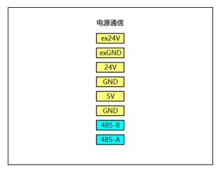

.. centered:: 图表4-1 电源通信接口

附录5：备件、易损件清单
-----------------------------

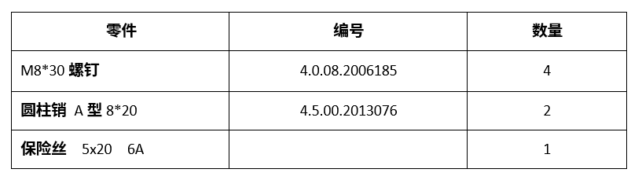