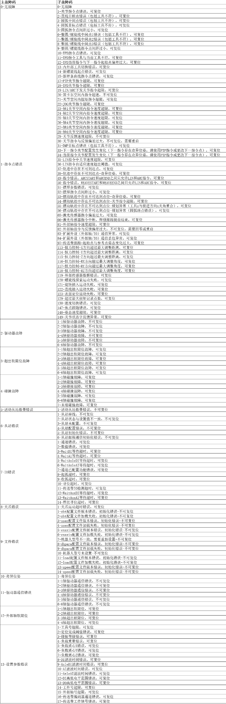
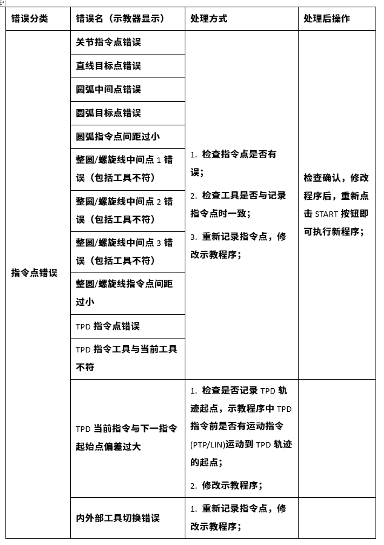
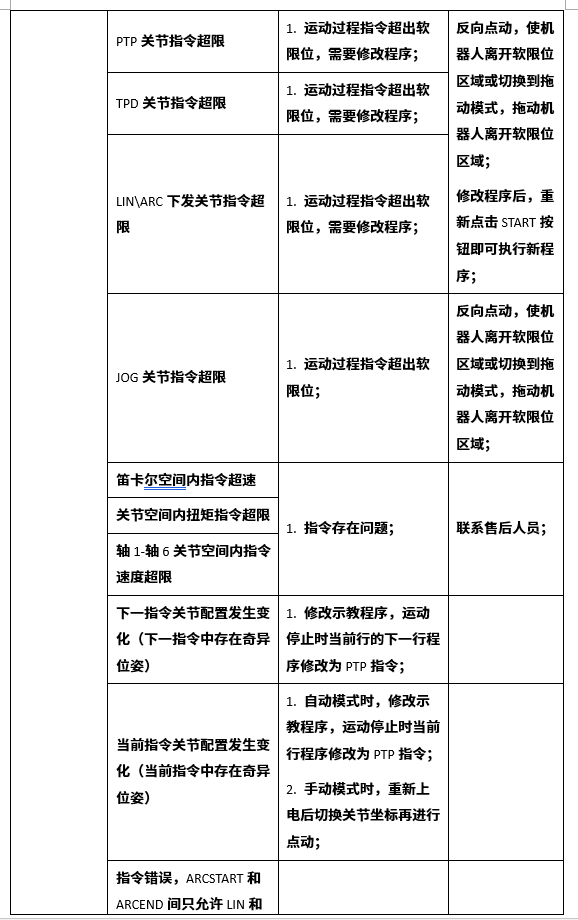
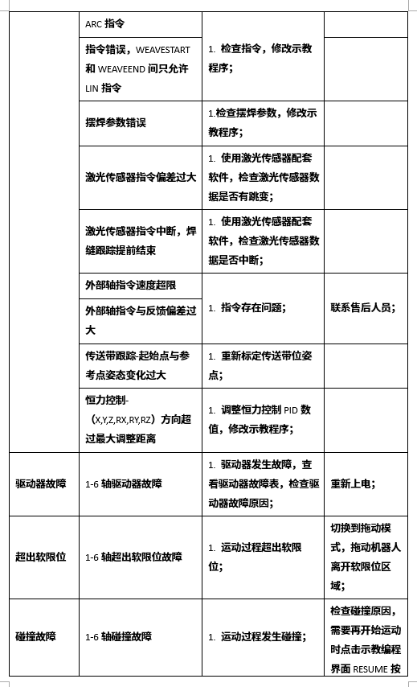
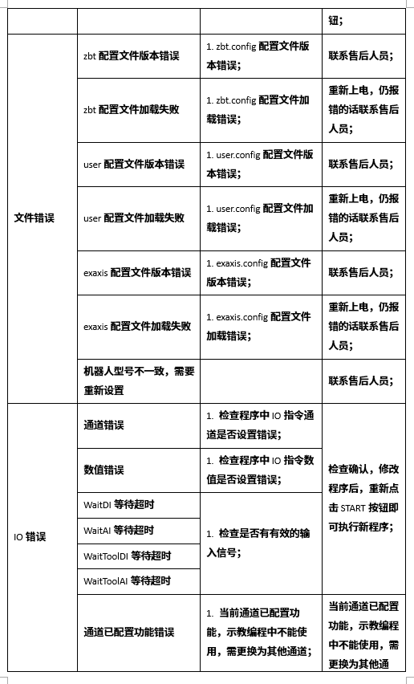
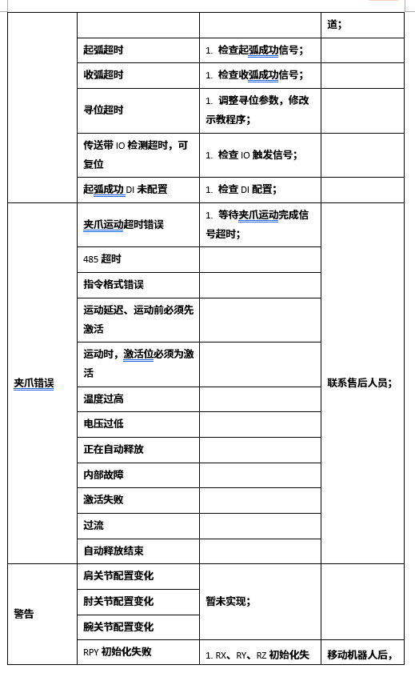
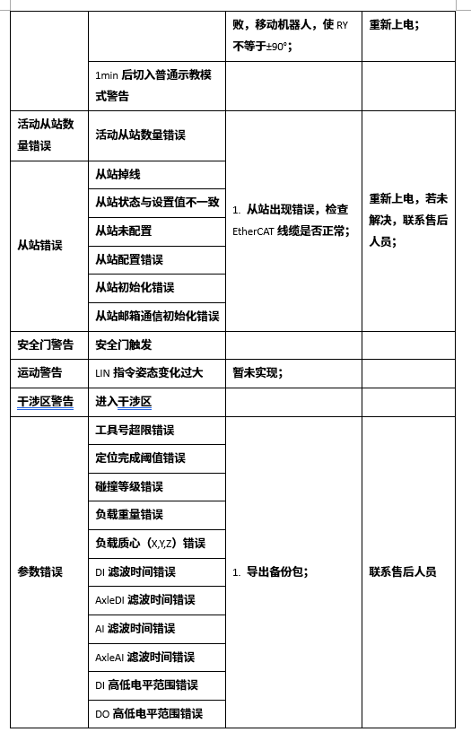
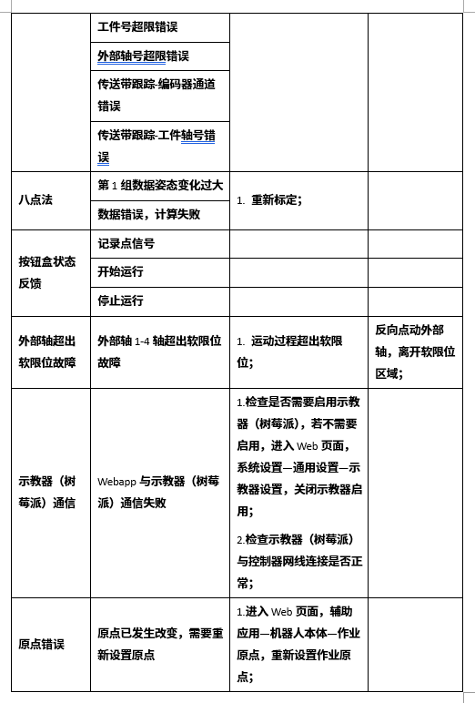

附录
========

.. toctree:: 
  :maxdepth: 5

附录1：运动控制器错误及处理方式
--------------------------------

.. centered:: 图表 18.1-1 控制器故障码

附录2：伺服驱动器故障代码表
---------------------------

.. list-table::
   :widths: 20 40 80
   :header-rows: 0
   :align: center

   * - **故障码**
     - **故障名称**
     - **处理方法**

   * - 1
     - 软件过流故障
     - | 1、检查关节负载或阻力是否变大或异常
       | 2、若故障仍未排除，维修或更换驱动板

   * - 2
     - 过压故障
     - 降低机器人运行速度或加速度

   * - 3
     - 欠压故障
     - | 1、检查控制箱48V 电源电压输出是否异常
       | 2、检查驱动板和关节外壳是否短路
       | 3、若故障仍未排除，维修或更换驱动板

   * - 4
     - 过热故障
     - 减小机器人负载或降低机器人运行速度

   * - 5
     - 过载故障
     - 减小机器人负载或降低机器人运行速度

   * - 6
     - 超速故障
     - | 1、检查磁编组件和电机轴固定顶丝是否松动
       | 2、重新进行编码器校零
       | 3、若故障仍未排除，维修或更换磁编组件

   * - 7
     - 参数异常故障
     - 维修或更换驱动板

   * - 8
     - 飞车故障
     - | 1、检查磁编组件和电机轴固定顶丝是否松动
       | 2、重新进行编码器校零
       | 3、若故障仍未排除，维修或更换磁编组件

   * - 9
     - 位置误差故障
     - | 1、检查关节负载或阻力是否变大或异常
       | 2、若故障仍未排除，维修或更换驱动板

   * - 10
     - 位置溢出故障
     - | 1、检查硬限位是否松动
       | 2、重新进行机器人校零

   * - 11
     - 硬件过流故障
     - 维修或更换驱动板

   * - 12
     - 驱动禁止故障
     - 未启用

   * - 13
     - 电机堵转故障
     - | 1、检查刹车电磁铁是否吸合
       | 2、检查是否撞到硬限位
       | 3、若故障仍未排除，维修或更换驱动板

   * - 14
     - 功率电源故障
     - 未启用

   * - 15
     - STO 故障
     - 未启用

   * - 16
     - 相电流 AD 调零故障
     - 维修或更换驱动板

   * - 17
     - EEPROM 故障
     - 维修或更换驱动板

   * - 18
     - 霍尔故障
     - | 1、检查霍尔线束是否插接牢固，有无短路、断路
       | 2、若故障仍未排除，维修或更换关节

   * - 19
     - 编码器故障
     - 维修或更换磁编组件

   * - 20
     - 编码器调零故障
     - | 1、重新进行编码器校零
       | 2、若故障仍未排除，维修或更换磁编组件
   
   * - 21
     - 编码器Z相信号丢失故障
     - 未启用

   * - 22
     - 编码器计数故障
     - 未启用

   * - 23
     - 编码器多圈数据溢出故障
     - 未启用

   * - 24
     - 外部时钟故障
     - 维修或更换驱动板

   * - 25
     - UVW 相序故障
     - 未启用

   * - 26
     - FPGA故障
     - 未启用

   * - 27
     - 回零故障
     - 未启用

   * - 28
     - 磁编码器故障
     - | 1、检查磁编组件和电机轴固定顶丝是否松动
       | 2、若故障仍未排除，维修或更换磁编组件

   * - 29
     - 电机动力线断线故障
     - | 1、检查电机动力线是否插接牢固，有无短路、断路
       | 2、若故障仍未排除，维修或更换驱动板

   * - 30
     - EtherCAT故障
     - | 1、检查网线是否插接牢固，有无短路、断路
       | 2、若故障仍未排除，维修或更换驱动板

   * - 31
     - EtherCAT_SM_DOG故障
     - | 1、检查网线是否插接牢固，有无短路、断路
       | 2、若故障仍未排除，维修或更换驱动板

   * - 32
     - EtherCAT_FATALSYNC故障
     - | 1、检查网线是否插接牢固，有无短路、断路
       | 2、若故障仍未排除，维修或更换驱动板

   * - 33
     - EtherCAT_SYNC故障
     - | 1、检查网线是否插接牢固，有无短路、断路
       | 2、若故障仍未排除，维修或更换驱动板

   * - 34
     - EtherCAT_RFT故障
     - | 1、检查网线是否插接牢固，有无短路、断路
       | 2、若故障仍未排除，维修或更换驱动板

   * - 35
     - 驱动器轴地址故障
     - | 1、重新进行驱动器轴地址配置
       | 2、若故障仍未排除，维修或更换驱动板

   * - 36
     - 机器人校零故障
     - | 1、重新进行机器人校零
       | 2、先使用JLINK 擦除 FLASH，再重新下载程序并校零
       | 3、若故障仍未排除，维修或更换驱动板

   * - 37
     - 编码器通讯故障
     - | 1、检查编码器线束是否插接牢固，有无短路、断路 
       | 2、若故障仍未排除，维修或更换磁编组件

   * - 40
     - 磁编模块故障-校零故障
     - | 1、重新进行磁编组件校零
       | 2、若故障仍未排除，维修或更换磁编组件

   * - 41
     - 磁编模块故障-多圈故障
     - | 1、检查磁编组件和电机轴固定顶丝是否松动
       | 2、若故障仍未排除，维修或更换磁编组件

   * - 42
     - 磁编模块故障-多圈小磁编故障
     - | 1、检查多圈小磁编芯片是否异常
       | 2、若故障仍未排除，维修或更换磁编组件

   * - 43
     - 磁编模块故障-多圈大磁编故障
     - | 1、检查多圈大磁编芯片是否异常
       | 2、若故障仍未排除，维修或更换磁编组件

   * - 44
     - 磁编模块故障-单圈磁编故障
     - | 1、检查单圈磁编芯片是否异常
       | 2、若故障仍未排除，维修或更换磁编组件

   * - 45
     - 磁编模块故障-光编故障
     - | 1、检查光编码盘是否被污染或未粘牢
       | 2、若故障仍未排除，维修或更换磁编组件

附录3：末端板485升级
---------------------------

现场使用时，有可能更新固件，满足新的要求，会提供新的升级文件（XX_XX_MAIN.bin），通过485接口对末端板进行升级（需要借助USB转485模块）。升级步骤如下：

**Step1：485接线**，在机器人末端处有5Pin通信航空接头，航空接头Pin脚分布及其pin脚说明如图表1所示。将机器人末端的485-A、485-B与USB转485工具的A、B使用双绞线连接。

.. centered:: 图表 18.3-1 航空接头Pin脚分布

**Step2，硬件连接**，将USB转485工具的USB端与PC连接，在PC设备管理器中，如果识别到USB&485工具，会出现如下界面。

.. centered:: 图表 18.3-2 USB&485端口识别说明

**Step3：升级工具**，在完成接线后，打开“法奥串口调试助手”，点击“末端板”按钮，在“串口参数设置”功能中选择上述识别的串口，波特率115200，数据位8位，校验位无，停止位1，然后打开串口，成功之后会出现“串口打开成功”的提示。

.. centered:: 图表 18.3-3 串口参数设置

**Step4：固件升级**，选择“末端板”，点击“固件升级”，如图表所示：

.. centered:: 图表 18.3-4 末端板固件升级

-  首先点击“Flash擦除”，擦除成功之后，会在接收数据区提示擦除成功。

-  打开文件（待升级文件），选择存放的路径，如下所示，选择完成后，待升级文件名会出现在文件名显示框中。

.. centered:: 图表 18.3-5 选择升级文件

-  点击“发送文件”，当进度条显示100%时，表示已经完成发送升级文件。

**Step5：升级验证**，系统重启上电，在“维护信息”栏，选择“查询末端板固件版本信息”，在“接收数据区”会显示固件版本信息，如果和升级的文件版本信息一致，说明升级成功，否则升级失败.

.. centered:: 图表 18.3-6 查询固件版本信息

附录4：控制箱485升级
------------------------

在机器人控制箱板有“电源通信”接口，将USB&485工具A、B分别接入其接口的“485-A”、“485-B”。

其升级过程操作同末端板，软件对应选择即可，此处不在赘述。

.. centered:: 图表 18.4-1 电源通信接口

附录5：备件、易损件清单
-----------------------------

.. list-table::
   :widths: 40 40 20
   :header-rows: 0
   :align: center

   * - **零件**
     - **编号**
     - **数量**

   * - M8*30 螺钉
     - 4.0.08.2006185
     - 4

   * - 圆柱销A型8*20
     - 4.5.00.2013076
     - 2

   * - 保险丝5x206A
     - 
     - 1