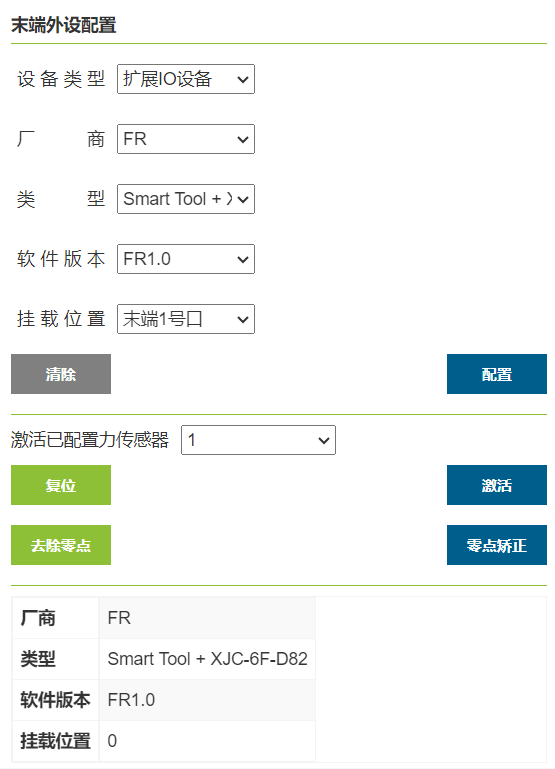
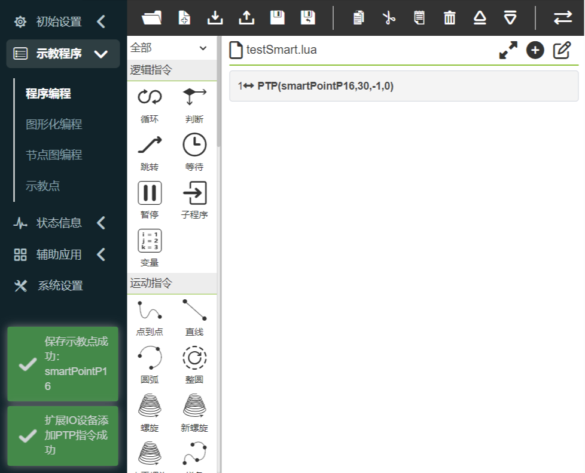
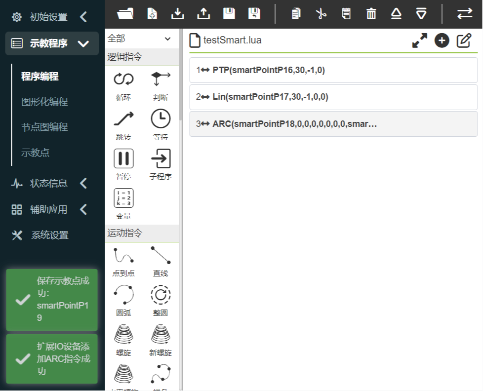
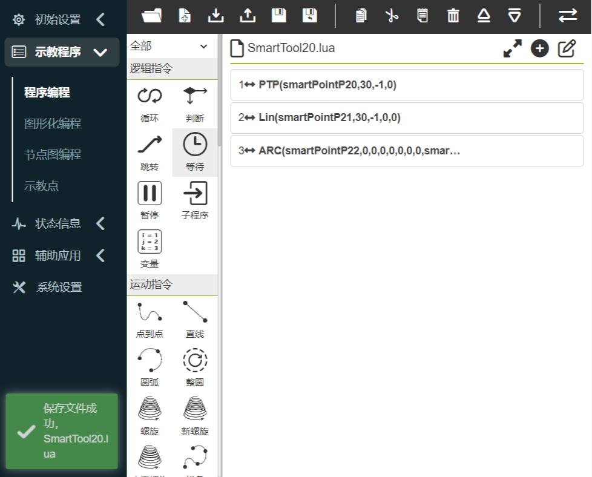
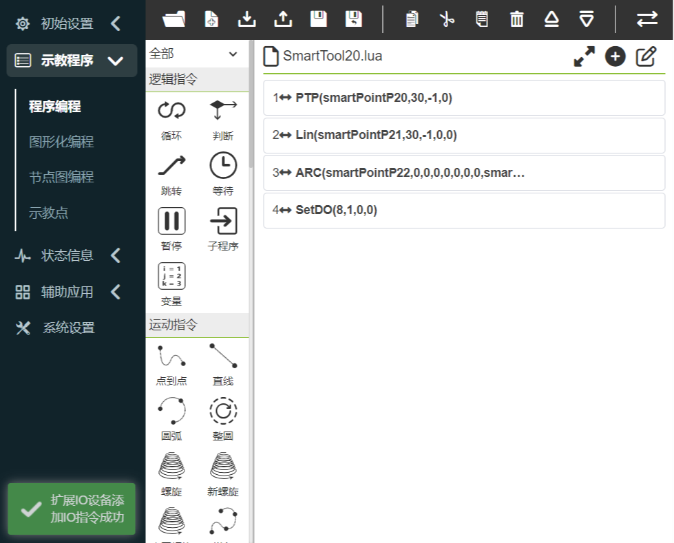
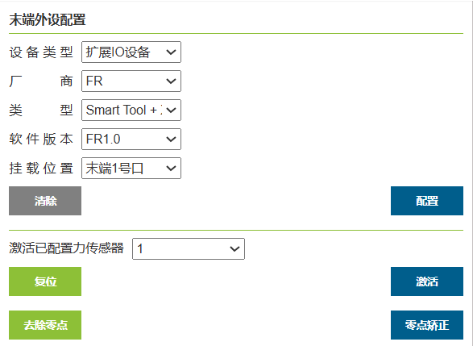
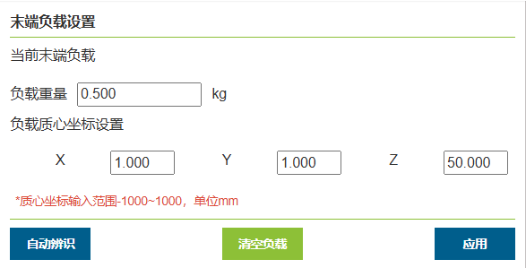
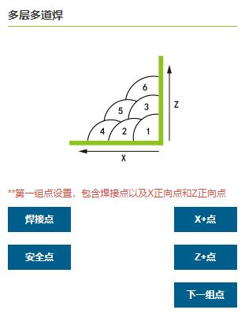

辅助应用
===============

.. toctree:: 
   :maxdepth: 6

机器人打包
-----------------

在“辅助应用——工具应用”的菜单栏下，点击“机器人打包”按钮，进入机器人一键打包界面。

.. important:: 
   在操作打包功能之前，请先确认机器人周围环境和状态，防止发生碰撞。
   
   若出厂，则出厂前先进去系统设置-通用设置，进行恢复出厂设置。

**Step1**：在移至打包点前先将机器人移至零点。

**Step2**：点击“移至零点”按钮，确认机器人机械零点正确，各关节如图中橙色圆圈位置缺口对齐。

**Step3**：点击“移至打包点”按钮，机器人按照包装工艺各轴角度运行至打包点。

.. centered:: 图表 14.1‑1 机器人一键打包

系统升级
-----------------

在“辅助应用——工具应用”的菜单栏下，点击“系统升级”按钮，进入系统升级界面。系统升级分为软件升级、驱动器升级和系统关机。

**软件升级**：在软件升级下点击“上传文件”，选择U盘中的software.tar.gz升级包，点击上传升级包，升级按钮旁显示“上传中…上传百分比”。
待后台文件下载完成，界面显示“上传完成，正在升级中”，进行文件MD5和版本号检测，通过后，解密解压升级文件，并提示"升级成功，请重新启动控制箱！"，如果其中检测，解压或发生其他错误，升级按钮旁显示“升级失败”。

.. image:: application/002.png
   :width: 3in
   :align: center

.. centered:: 图表 14.2‑1 系统升级

.. important:: 
   软件升级包名为确定的software.tar.gz，如果升级包名与之不一致，那么会出现升级失败，修改为确定的升级包名称即可。
 
**固件升级**：机器人进入BOOT模式后，上传升级压缩包，选择需要升级的从站（控制箱从站，本体驱动器从站1~6，末端从站），进行升级操作，并显示升级状态。

.. image:: application/003.png
   :width: 3in
   :align: center

.. centered:: 图表 14.2‑2 固件升级

**从站配置文件升级**：机器人去使能后，上传升级文件，选择需要升级的从站（控制箱从站，本体驱动器从站1~6，末端从站），进行升级操作，并显示升级状态。

.. image:: application/004.png
   :width: 3in
   :align: center

.. centered:: 图表 14.2‑3 从站配置文件升级

数据备份
-----------

在“辅助应用——工具应用”的菜单栏下，点击 “数据备份”进入数据备份界面，如下图所示。

备份包数据中包含工具坐标系数据，系统配置文件，示教点数据，用户程序，模板程序和用户配置文件，当用户需要将本机器人相关数据移到另一台机器人上使用时，可通过此功能快速实现。

.. image:: application/005.png
   :width: 3in
   :align: center

.. centered:: 图表 14.3‑1 数据备份界面

10s数据记录
------------

在“辅助应用——工具应用”的菜单栏下，点击“10s数据记录”进入10s数据记录功能界面。

首先选择记录类型，分为默认参数记录和自选参数记录，默认参数记录为系统自动设置记录的数据，自选参数记录用户可自行选择需要记录的参数数据，参数个数最多为15个。选定参数列表后，选择记录参数，点击“右移”按钮即可将参数配置到参数列表中。点击“开始记录”机器人开始记录数据，点击“停止记录”机器人停止记录数，点击“下载数据”可下载最后10s的数据。

.. centered:: 图表 14.4‑1 10s数据记录

示教点配置
------------

在“辅助应用——工具应用”的菜单栏下，点击“示教点配置”进入示教点配置功能界面。

用户在使用按钮盒或其它IO信号记录示教点功能前，首先对示教点名称前缀，编号上限和示教方法进行配置，名称前缀支持自定义前缀和以当前程序名作为前缀两种模式。例如，自定义名称前缀“P”，编号上限“3”，示教方法“机器人示教”，记录机器人当前末端（工具）点依次为：P1、P2、P3，再次记录将覆盖之前记录点。

.. image:: application/007.png
   :width: 3in
   :align: center

.. centered:: 图表 14.5‑1 示教点配置

作业原点
-----------

在“辅助应用——工具应用”的菜单栏下，点击“作业原点”进入作业原点配置功能界面。

该页面显示作业原点的名称和关节位置信息，作业原点命名为固定名pHome，点击“设置”以当前机器人位姿作为作业原点，点击“移至该点”机器人会运动到作业原点。此外DI配置中增加移动至作业原点可配置选项，DO配置中增加到达作业原点可配置选项。

.. image:: application/008.png
   :width: 3in
   :align: center

.. centered:: 图表 14.6‑1 作业原点

末端LED配置
--------------

在“辅助应用——工具应用”的菜单栏下，点击“末端LED配置”进入末端LED颜色配置功能界面。

可配置LED颜色为绿色，蓝色和白青色，用户可以根据需求对自动模式，手动模式和拖动模式的LED颜色进行配置，不同模式不可配置同一种颜色。

.. image:: application/009.png
   :width: 3in
   :align: center

.. centered:: 图表 14.7‑1 末端LED配置

外设协议
-----------

在“辅助应用——工具应用”的菜单栏下，点击“外设协议”进入外设协议配置功能界面。

该页面是对外设协议的配置页面，用户可以根据当前使用的外设进行协议配置。

.. centered:: 图表 14.8‑1 外设协议配置

在程序示教中增加基于Modbus-rtu通讯的读写寄存器lua接口， 输入寄存器地址0x1000寄存器数量为50个，共100字节数据内容；保持寄存器地址0x2000，寄存器数量为50个，共100字节数据内容。

::

   ModbusRegRead（fun_code，reg_add，reg_num）：读寄存器；

   fun_code： 功能码，0x03-保持寄存器，0x04-输入寄存器

   reg_add： 寄存器地址

   reg_num： 寄存器数量

::

   ModbusRegWrite（fun_code，reg_add，reg_num，reg_value）：写寄存器；

   fun_code 功能码，0x06-单个寄存器，0x10-多个寄存器

   reg_add： 寄存器地址

   reg_num： 寄存器数量

   reg_value： 字节数组

::

   ModbusRegGetData（reg_num）：获取寄存器数据；

   reg_num： 寄存器数量

   返回值说明：

   reg_value: 数组变量

程序示例截图：

.. image:: application/011.png
   :width: 4in
   :align: center

.. centered:: 图表 14.8‑2 Modbus-rtu通讯lua程序示例

主程序配置
------------------

在“辅助应用——工具应用”的菜单栏下，点击“主程序配置”进入主程序配置功能界面。

配置主程序可以与DI配置主程序启动配合使用，配置的主程序需要先试运行以确保安全，在机器人设置中配置对应DI为启动主程序信号功能后，用户可以控制该DI信号实现运行主程序。

.. centered:: 图表 14.9‑1 主程序配置

拖动锁定
--------------

在“辅助应用——工具应用”的菜单栏下，点击“拖动锁定”进入拖动示教锁定配置功能界面。

针对拖动示教增加了锁定自由度功能，当拖动示教功能开关设置为使能状态时，各自由度参数在用户拖动机器人时生效。例如，当参数设置为X:10，Y:0，Z:10，RX:10，RY:10，RZ:10时，在拖动模式下拖拽机器人，可以限制机器人只移动Y方向，假如需要在拖动时保持机器人姿态不变，只移动X，Y，Z方向，可以将X，Y，Z设置为0，RX，RY，RZ设置为10。

.. image:: application/013.png
   :width: 3in
   :align: center

.. centered:: 图表 14.10‑1 拖动示教锁定配置

Smart Tool
------------------

在“辅助应用——工具应用”的菜单栏下，点击“Smart Tool”进入Smart Tool配置功能界面。

依次配置A-E键位和IO键。Smart Tool配置完成后，任务管理器内部维护每个按钮对应的功能，当检测到某按钮被按下时，自动执行该按钮对应功能项。

A-E键位功能：

-  **运动指令**：选择PTP、LIN、ARC运动指令时，需要输入对应点速度。配置成功后，示教程序新增一条相关运动指令。配置ARC运动指令时，需先配置PTP/LIN指令。
  
-  **DO输出**：选择“DO输出”时，显示下拉框可选择输出DO0⁓DO7选项。

.. image:: application/014.png
   :width: 3in
   :align: center

.. centered:: 图表 14.11‑1 Smart Tool配置（A-E键位）

IO键位功能：

-  **IO信号配置**：下拉框可选择DO0⁓DO7选项、CO0⁓CO7选项、End-DO0、End-DO1和扩展IO（Aux-DO0⁓Aux-DO127）；

-  **组合指令**：选择“IO信号”后，特定条件下显示“焊机选择”和“点速度”配置项，生成不同程序指令。

.. important::
   -  当IO信号配置为DO0~DO7或CO0~CO7（未配置"起弧"）时，程序添加SetDO；此时隐藏“焊接选择”和“点速度”。
   -  当IO信号配置为End-DO0、End-DO1时，程序添加SetToolDO；此时隐藏“焊接选择”和“点速度”。
   -  当IO信号配置为扩展IO（未配置"焊机起弧"）时，程序添加SetAuxDO；此时隐藏“焊接选择”和“点速度”。
   -  当IO信号配置为CO0~CO7（配置"起弧"）时，"焊机选择"为"无"时，程序添加SetDO；此时隐藏“焊接选择”和“点速度”。
   -  当IO信号配置项为扩展IO（配置""焊机起弧"）时，"焊机选择"为"无"时，程序添加SetAuxDO；此时隐藏“焊接选择”和“点速度”。
   -  当IO信号配置为CO0~CO7（配置"起弧"）或扩展IO（配置"焊机起弧"）时，"焊机选择"为"焊接"时，首次按下程序添加ARCStart，第二次程序添加ARCEnd，第三次程序添加ArcStart,第四次程序添加ARCStart,交替往复以上操作；此时隐藏“焊接选择”和“点速度”。
   -  当IO信号配置为CO0~CO7（配置"起弧"）或扩展IO（配置"焊机起弧"）时，"焊机选择"为"LIN+焊接"时，首次按下程序添加LIN和ARCStart，第二次程序添加LIN和ARCEnd，第三次程序添加LIN和ARCStart,第四次程序添加LIN和ARCEnd,交替往复以上操作；此时显示“焊接选择”和“点速度”。
   -  当IO信号配置为CO0~CO7（配置"起弧"）或扩展IO（配置"焊机起弧"）时，"焊机选择"为"LIN+焊接+摆动"时，首次按下程序添加LIN、ARCStart和WeaveStart，第二次程序添加LIN、ARCEnd和WeaveEnd，第三次程序添加LIN、ARCStart和WeaveStart,第四次程序添加LIN、ARCEnd和WeaveEnd,交替往复以上操作；此时隐藏“焊接选择”和“点速度”。

  

.. centered:: 图表 14.11‑2 Smart Tool配置（IO键位）

.. 力传感器辅助拖动功能设置
.. ~~~~~~~~~~~~~~~~~~~~~~~~~

.. 在“机器人设置”中的“DI配置”下，点击不同的DI下拉框，可以配置辅助拖动开启、辅助关闭和辅助拖动开启/关闭

.. - 控制箱DI功能配置力传感器拖动功能，可直接通过控制箱DI输入进行力传感器拖动。
.. - 机器人末端DI功能配置力传感器拖动功能,可通过末端DI输入进行力传感器拖动
.. - 机器人拖动模式下TPD轨迹记录基础上增加力传感器辅助拖动模式得TPD轨迹记录，实现更柔顺得TPD轨迹拖动。

.. .. image:: application/271.png
..    :width: 4in
..    :align: center

.. .. centered:: 图表 4.9‑35 力传感器辅助拖动功能设置

.. .. important:: 当检测到力传感器拖动开启状态时，机器人切换至力传感器拖动状态；当检测到力传感器拖动关闭DI状态时，关闭力传感器拖动状态；

SmartTool+力传感器组合
--------------------------

在“初始设置——外设——末端工具”菜单栏中，点击“适配设备”进入末端外设配置界面。

设备类型选择“扩展IO设备”，扩展IO设备配置信息分为厂商、类型、软件版本和挂载位置。不同厂商对应不同的类型，当前厂商为NSR和FR。

用户可根据具体的生产需求来配置相应的设备信息，配置成功后展示设备信息表格。若用户需要更改配置，可先选择相应的编号，点击“清除”按钮，来清除相应的信息，并重新根据需求配置设备信息。

.. important:: 点击清除配置前，相应的设备应处于未激活状态。

.. centered:: 图表 14.12‑1 NSR界面

.. centered:: 图表 14.12‑2 FR界面

NSR
~~~~~~~~~~~~
NSR对应的类型为：SmartTool

1. 硬件安装

1)将SmartTool 手柄拆开，取出中间的工装，安装在机器人末端。

.. image:: application/018.png
   :width: 3in
   :align: center

.. centered:: 图表 14.12‑3 安装SmartTool 手柄中间的工装

2)工装安装完成后，将SmartTool手柄拼接好，拼接成功后将连接线与机器人末端连接。

.. image:: application/019.png
   :width: 3in
   :align: center

.. centered:: 图表 14.12‑4 SmartTool 手柄安装成功

2. 设备信息配置

.. important:: 请确保您的SmartTool手柄已经固定安装于机器人末端并正确连接机器人末端。

1)在“辅助应用——工具应用”菜单栏中点击Smart Tool功能菜单，进入此功能配置页面。根据需求对末端手柄上的各个按键功能进行自定义，包括（新建程序、保持程序、PTP、Lin、ARC、摆焊开始、摆焊结束和IO端口）；

.. centered:: 图表 14.12‑5 SmartTool手柄按键功能配置界面

2)SmartTool手柄按键功能配置完成后，在扩展IO设备配置厂商为“NSR”，选择“类型”、“软件版本”和“挂在位置”信息，点击“配置”按钮；

.. centered:: 图表 14.12‑6 NSR设备信息配置界面

3)配置设备信息成功后，查看表格数据。

3. 应用

设备信息配置成功后，打开“示教程序——程序编程”界面，新建“testSmartTool.lua”程序。根据需求按下SmartTool手柄按键（按键功能配置示例：A键——PTP、B键——LIN、C键——ARC、D键——新建程序、E键——保存程序、IO键——CO0），此时机器人接收反馈，对程序进行相应的操作。示教程序如下图：

.. centered:: 图表 14.12‑7 按下A键的testSmartTool.lua程序

.. centered:: 图表 14.12‑8 按下B键的testSmartTool.lua程序

.. centered:: 图表 14.12‑9 按下C键的testSmartTool.lua程序

.. centered:: 图表 14.12‑10 按下D键的testSmartTool.lua程序

.. centered:: 图表 14.12‑11 按下E键的testSmartTool.lua程序

.. centered:: 图表 14.12‑12 按下IO键的testSmartTool.lua程序

FR
~~~~~~~~~~~~

FR对应的类型为“SmartTool ”与力传感器组合使用，协作机器人可适配鑫精诚、NSR和港智创信的三种力传感器，使用不同传感器时只需要加载对应的通信协议即可，具体如下：

- SmartTool + XJC-6F-D82（鑫精诚）。
- SmartTool + NSR-FT Sensor A（NSR）。
- SmartTool + GZCX-6F-75A（港智创信）。

1. 硬件安装

1) 将SmartTool手柄安装于机器人末端并正确连接机器人末端（详细安装参考NSR的硬件安装）。

2) SmartTool手柄安装完毕后，将力传感器（以港智创信为例）安装于SmartTool手柄末端，并将连接线与SmartTool手柄连接。

.. image:: application/029.png
   :width: 3in
   :align: center

.. centered:: 图表 14.12‑13 港智创信力传感器安装于SmartTool手柄末端

2. 设备配置

.. important:: 请确保您的SmartTool手柄已经固定安装于机器人末端并正确连接机器人末端以及力传感器已经固定安装于SmartTool手柄末端并正确连接SmartTool手柄。

1) 配置SmartTool手柄（参考NSR的SmartTool按键功能配置）。

2) SmartTool手柄按键功能配置完成后，在扩展IO设备配置厂商为“FR”，选择“类型”、“软件版本”和“挂在位置”信息，点击“配置”按钮；

.. centered:: 图表 14.12‑14 FR设备信息配置界面

3) 配置设备信息成功后，选择已配置的力传感器，点击“激活”按钮激活力传感器，激活成功后点击“零点矫正”按钮进行力传感器的清零，查看表格数据；

.. centered:: 图表 14.12‑15 力传感器校零

4) 根据当前末端安装，在“末端负载”界面配置负载数据，在“工具坐标”界面配置工具坐标的数据、工具类型和安装位置。

.. centered:: 图表 14.12‑16 “末端负载”配置

.. centered:: 图表14.12‑17 “工具坐标”配置

3. 应用

设备信息配置成功后，可以独立实现SmartTool按键功能和力传感器的功能，例如：测量力的大小及受力方向和基于力传感器的辅助拖动锁定。

.. centered:: 图表 14.12‑18 测量力的大小及受力方向

干涉区配置
--------------

在“辅助应用——工具应用”的菜单栏下，点击“干涉区配置”进入干涉区配置功能界面。

首先我们需要对干涉方式和进入干涉区操作进行配置，干涉方式分为“轴干涉”和“立方体干涉”，当开启后，会显示激活标志。首先进行进入干涉区运动配置“继续运动”或者“停止”。

.. centered:: 图表 14.13‑1 干涉区配置

接下来设置进入干涉区拖动配置，用户可以根据需求设置拖动模式下进入干涉区后策略，不限制拖动，阻抗回调和切换回手动模式。

.. image:: application/036.png
   :width: 3in
   :align: center

.. centered:: 图表 14.13‑2 干涉区拖动配置

选择轴干涉，需要对轴干涉的参数进行配置，检测方法分为“指令位置”和“反馈位置”两种，干涉区模式分为“范围内干涉”和“范围外干涉”两种，接下来设置每个关节的范围以及各个关节范围是否使能，可以输入数值，也可以通过“机器人示教”按钮将当前机器人的位置记录到当中，最后点击应用即可。

.. image:: application/037.png
   :width: 3in
   :align: center

.. centered:: 图表 14.13‑3 轴干涉配置

选择立方体干涉，需要对立方体干涉的参数进行配置，检测方法分为“指令位置”和“反馈位置”两种，干涉区模式分为“范围内干涉”和“范围外干涉”两种，参考坐标系分为“基坐标”和“工件坐标”，根据实际使用选择设置。接下来设进行范围设置，范围设置分为两种方法，首先看第一种方法“两点法”，即立方体的两个对角的顶点组成，我们可以通过输入或者机器人示教记录位置。最后点击应用即可。

.. centered:: 图表 14.13‑4 立方体干涉配置

接下来看第二种方法“中心点+边长”，即立方体的中心位置点和立方体的边长构成干涉区，我们可以通过输入或者机器人示教记录位置。最后点击应用即可。

.. centered:: 图表 14.13‑5 立方体干涉配置

焊接专家库
----------------

点击“辅助应用”中的“焊接专家库”的菜单栏，进入焊接专家库功能界面。

直焊
~~~~~~~~~~~~

点击“焊件形状”下的“直焊”，进入直焊指导界面。在各项机器人基础设置配置完成的基础上，我们可以通过几个简单的步骤快速生成焊接示教程序。主要包含以下五个步骤，由于功能间存在互斥，所以实际生成一个焊接示教程序的步骤少于五步。

步骤一，是否使用扩展轴，如果使用扩展轴需要配置好扩展轴相关坐标系以及使能扩展轴。

.. image:: application/040.png
   :width: 3in
   :align: center

.. centered:: 图表 14.14‑1 扩展轴配置

步骤二，标定起点，起点安全点，终点，终点安全点。若第一步选择了扩展轴，会加载扩展轴移动功能，配合相关点的标定。

.. image:: application/041.png
   :width: 3in
   :align: center

.. centered:: 图表 14.14‑2 标定相关点

步骤三，选择是否需要激光，如果是的话，需要编辑激光寻位指令的参数。

.. image:: application/042.png
   :width: 3in
   :align: center

.. centered:: 图表 14.14‑3 激光寻位配置

步骤四，选择是否需要摆焊，如果需要摆焊，需要编辑摆焊相关参数。

.. centered:: 图表 14.14‑4 摆焊配置

步骤五，给程序命名，并在程序示教界面中自动打开该程序。

.. image:: application/044.png
   :width: 3in
   :align: center

.. centered:: 图表 14.14‑5 保存程序

圆弧焊
~~~~~~~~~~~~

点击“焊件形状”下的“圆弧焊”，进入圆弧焊指导界面。在各项机器人基础设置配置完成的基础上，我们可以通过两个简单的步骤快速生成焊接示教程序。主要包含以下两个步骤。

步骤一，标定起点，起点安全点，圆弧过渡点，终点和终点安全点。

.. centered:: 图表 14.14‑6 标定点

步骤二，给程序命名，并在程序示教界面中自动打开该程序。

.. centered:: 图表 14.14‑7 保存程序

多层多道焊
~~~~~~~~~~~~

当焊脚尺寸大于10mm的焊缝时，通常会采用多层多道焊接功能。本功能能够模板化配置焊接程序，在多层多道焊接的第一道焊接过程种加入电弧跟踪功能，并在后续的多道直线焊接过程中修正焊缝偏差，从而提高焊缝质量。

电弧跟踪多层多道焊接功能操作流程如下：

1) 设置工具坐标系，填入焊枪的工具尺寸与姿态。

.. note::
   界面数值仅为示例，以实际工具状态为准。

.. centered:: 图表 14.14-8 设置工具坐标系

2) 点击“辅助应用”，选择“焊接专家库”，在“焊件形状”种选择“多层多道焊”。

.. image:: application/048.png
   :width: 6in
   :align: center

.. centered:: 图表 14.14-9 打开多层多道焊接界面

3) 若要使用电弧跟踪功能，务必打开“首层焊接摆动功能”开关，并配置对应的摆动参数。

.. centered:: 图表 14.14-10 打开首层焊接摆动功能

4) 点击“配置”按钮， 编辑摆动参数，之后点击“配置”。

.. note::
   若需要电弧跟踪进行左右补偿的情况，仅可选择“三角波摆动”和“正弦波摆动”类型，摆动频率不得低于0.5Hz，摆动幅度不得小于3mm，摆动左右等待时间需一致，摆动方位角需为0。

.. centered:: 图表 14.14-11 配置摆动参数

5) 打开“电弧跟踪功能”开关，编辑对应的上下与左右补偿参数，之后点击“下一步”进入多层多道焊设置页面。

.. note::
   电弧跟踪参数根据实际焊接情况参考《电弧跟踪功能操作手册》或联系相关技术人员进行配置。

.. image:: application/051.png
   :width: 6in
   :align: center

.. centered:: 图表 14.14-12 配置电弧跟踪参数

6) 此处“焊接点”为焊接开始位置；“X+点”为自定义偏置坐标系相对焊接点X+方向上的一点；“Z+点”为自定义偏置坐标系相对焊接点Z+方向上的一点；“安全点”为上一次焊接完成到下一次焊接开始的过渡位置。示教并设置完成后点击“下一步”选取焊接结束点相关位置。

.. image:: application/052.png
   :width: 6in
   :align: center

.. centered:: 图表 14.14-13 多层多道焊接直线开始点位置设置

7) 选择“直线点”，此处“焊接点”为焊接结束位置；“X+点”为自定义偏置坐标系相对“焊接点”X+方向上的一点；“Z+点”为自定义偏置坐标系相对“焊接点”Z+方向上的一点。示教并设置完成后点击“下一步”设置多层多道焊接参数。

.. image:: application/053.png
   :width: 6in
   :align: center

.. centered:: 图表 14.14-14 多层多道焊接直线结束点位置设置

8) 在此页面能够设置多层多道焊接的数量，以及分布位置。点击参数表“On/Off”框选择激活的多层多道焊接位置对应值，在“X”“Z”“B”列填入期望的在自定义坐标系中的对应偏移位置与角度。设置完成后点击“完成”按钮进入下一步。

.. image:: application/054.png
   :width: 6in
   :align: center

.. centered:: 图表 14.14-15 多层多道焊接参数设置

9) 至此已完成全部参数配置，输入希望保存的程序名，点击“保存”按钮可自动生产对应的多层多道焊接程序。

.. image:: application/055.png
   :width: 6in
   :align: center

.. centered:: 图表 14.14-16 多层多道焊接程序生成

10) 点击“打开程序”按钮，读取上一步骤保存的lua程序，程序内容如下图所示。

.. image:: application/056.png
   :width: 6in
   :align: center

.. centered:: 图表 14.14-17 电弧跟踪多层多道焊接程序示例
