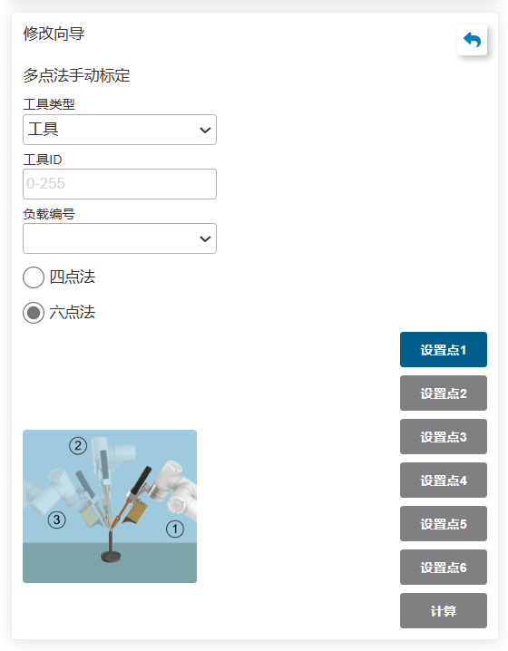
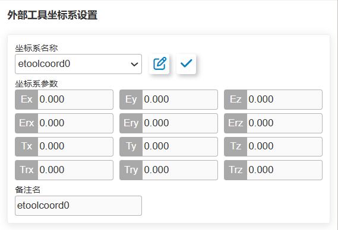
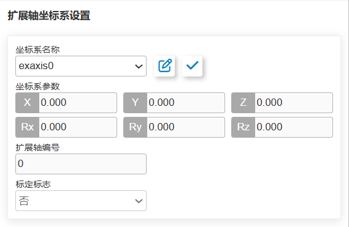
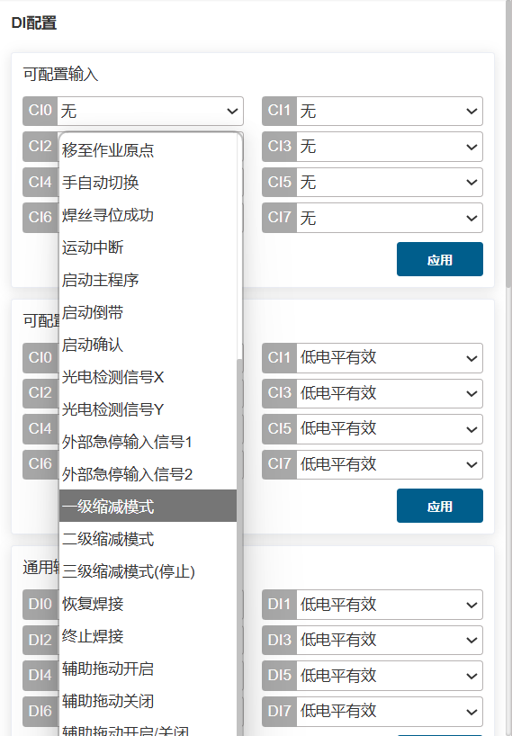
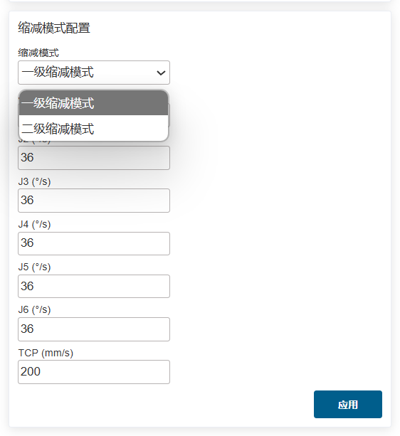
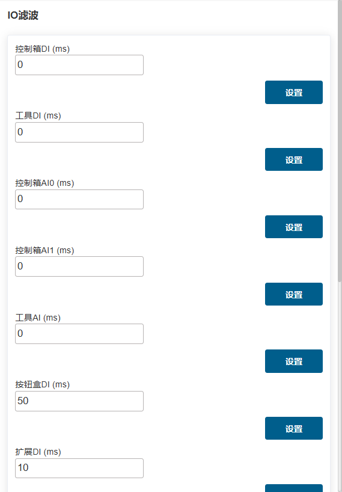
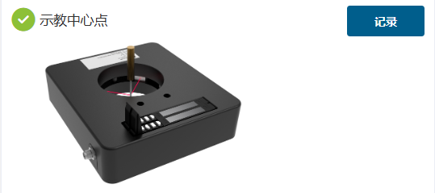
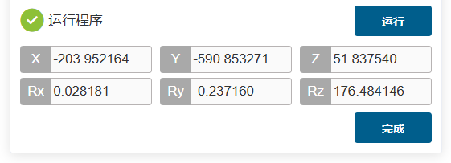

基础设置
===============

.. toctree:: 
   :maxdepth: 6

坐标系
--------------

工具坐标
~~~~~~~~~~~~~

在“初始设置——基础——坐标系”的菜单栏下，点击“工具”进入工具坐标页面 。

工具坐标可实现工具坐标的修改、清空与应用。在工具坐标系的下拉列表中，选择对应的坐标系后会在下方显示对应坐标值（坐标系名称可自定义），工具类型以及安装位置（仅在传感器类型工具下显示），选择某一坐标系后点击“应用”按钮，当前使用的工具坐标系变为所选择的坐标，如下所示。

   
.. centered:: 图表 6.1‑1 设置工具坐标

在QNX下：

- 工具坐标系有15个编号。

在Linux下：

- 工具坐标系有20个编号。

点击“修改”可根据提示对该编号的工具坐标系进行重新设置。工具标定方法分为四点法和六点法，四点法只标定工具TCP，即工具中心点的位置，其姿态默认与末端姿态一致，六点法则在四点法的基础上增加了两点，用于标定工具的姿态，这里我们以六点法为例进行讲解。

.. centered:: 图表 6.1‑2 设置工具坐标

在机器人空间选择一个固定的点，将工具以三个不同的姿态移至固定点，依次设置1-3点。如下图左上方所示。将工具垂直移至固定点设置点4，如下图右上方所示。保持该姿态不变，利用基坐标移动，在水平方向移动一段距离，设定点5，该方向即设定的工具坐标系X轴正方向。回到固定点，垂直往上移动一段距离，设定点6，该方向即工具坐标系Z轴正方向，工具坐标系Y正方向则通过右手定则确定。点击计算按钮计算工具位姿，若需重新设置，点击取消按修改钮重新进行新建工具坐标系步骤。

.. image:: base/003.png
   :width: 3in
   :align: center

.. centered:: 图表 6.1‑3 六点法示意图

完成最后步骤后，点击“完成”可返回工具坐标界面，点击“保存”即可存储刚才建立的工具坐标系。

.. important:: 
   1. 末端安装工具后，必须要进行工具坐标系的标定及应用，否则会导致机器人执行运动指令时工具中心点的位置和姿态不符合预期值。
   2. 工具坐标系一般使用toolcoord1~toolcoord14，应用toolcoord0代表工具TCP的位置中心在末端法兰中心，在进行工具坐标系标定时，首先需将工具坐标系应用至toolcoord0，然后选择其他工具坐标系进行标定及应用。

外部工具坐标
~~~~~~~~~~~~~

在“初始设置——基础——坐标系”的菜单栏下，点击“外部工具”进入外部工具坐标系界面。

外部工具坐标系设置界面中可实现外部工具坐标的修改、清空与应用。

外部工具坐标系的下拉列表中共有15个编号，从etoolcoord0~etoolcoord14，选择对应的坐标系后会在下方显示对应坐标值，选择某一坐标系后点击“应用”按钮，当前使用的工具坐标系变为所选择的坐标，如下图所示。

.. centered:: 图表 6.1‑4 外部工具坐标

点击“修改”可根据提示对该编号的工具坐标系进行重新设置，如下图所示。

.. centered:: 图表 6.1‑5 六点法示意图

**1.三点法确定外部TCP**

- **设置点1**：已测量工具的TCP移动至外部TCP，点击设置点1按钮；

- **设置点2**：由点1沿外部TCF坐标系X轴移动一段距离，点击设置点2按钮；

- **设置点3**：回到点1，由点1沿外部TCF坐标系Z轴移动一段距离，点击设置点3按钮；

- **计算**：点击计算按钮得到外部TCF；

**2.六点法确定工具TCF**

- **设置点1-4**：在机器人空间选择一个固定的点，将工具从四个不同的角度移至所选的点上，依次设置1-4点；

- **设置点5**：回到固定的点沿工具TCF坐标系X轴移动一段距离，点击设置点5按钮；

- **设置点6**：回到固定的点沿工具TCF坐标系Y轴移动一段距离，点击设置点6按钮；

- **计算**：点击计算按钮得到工具TCF；

若需重新设置，点击取消按钮重新进去新建工具坐标系步骤。

完成最后步骤后，点击“完成”可返回工具坐标界面，点击“保存”即可存储刚才建立的工具坐标系。

.. important:: 
   1. 使用外部工具必须要进行外部工具坐标系的标定及应用，否则会导致机器人执行运动指令时工具中心点的位置和姿态不符合预期值。
   2. 外部工具坐标系一般使用etoolcoord1~etoolcoord14，应用etoolcoord0代表外部工具TCP的中心位置在末端法兰中心，在进行工具坐标系标定时，首先需将工具坐标系应用至etoolcoord0，然后选择其他工具坐标系进行标定。

工件坐标
~~~~~~~~~~~~~

在“初始设置——基础——坐标系”的菜单栏下，点击“工件”进入工件坐标界面。工件坐标可实现工件坐标的修改、清空与应用。工件坐标系的下拉列表中共有15个编号，选择对应的坐标系（wobjcoord0~
wobjcoord14），后会在下方的“坐标系坐标”中显示对应坐标值，选择某一坐标系后点击“应用”按钮，当前使用的工件坐标系变为所选择的坐标，如下图所示。

.. centered:: 图表 6.1‑6 设置工件坐标

工件坐标系一般是基于工具基础上进行标定的，需要在已建立工具坐标系的基础上进行工件坐标系的建立。点击“修改”可根据提示对该编号的工件坐标系进行重新设置。固定好工件，选择标定方法“原点-X轴-Z轴”或“原点-X轴-XY+平面”，两种标定方法前两点的选取都是一致的，第三点有所区别，选第一种方法标定的是工件坐标系的Z方向，选第二种方法标定的是XY+平面上一点，根据图示标定即可。点击计算按钮计算工件位姿，若需重新设置，点击取消按修改钮重新进行新建工件坐标系步骤。

.. image:: base/007.png
   :width: 3in
   :align: center

.. centered:: 图表 6.1‑7 三点法示意图

完成最后步骤后，点击“完成”可返回工件坐标界面，点击“保存”即可存储刚才建立的工件坐标系。

.. important:: 
   1. 工件坐标系是基于工具基础上进行标定的，需要在已建立工具坐标系的基础上进行工件坐标系的建立。
   2. 工件坐标系一般使用wobjcoord1~wobjcoord14，应用wobjcoord0代表工件坐标系原点在基坐标原点，在进行工件坐标系标定时，首先需将工件坐标系应用至wobjcoord0，然后选择其他工件坐标系进行标定及应用。

扩展轴坐标
~~~~~~~~~~~~~

在“初始设置——基础——坐标系”的菜单栏下，点击“扩展轴”进入扩展轴坐标系界面。扩展轴坐标系设置界面中可实现扩展轴坐标的修改、清空与应用。

扩展轴坐标系的下拉列表中共有5个编号，从eaxis0~eaxis4，选择对应的坐标系后会在下方显示对应坐标值，选择某一坐标系后点击“应用”按钮，当前使用的扩展轴坐标系变为所选择的坐标，如下图所示。

.. centered:: 图表 6.1‑8 扩展轴坐标

点击“修改”可根据提示对该编号的扩展轴标系进行重新设置，如下图所示。标定之前先清空需要标定的扩展轴坐标系，应用此扩展轴坐标系。

先看第一种扩展轴方案-直线导轨的标定方法。选择扩展轴的编号，获取信息可以获取对应扩展轴的驱动器信息，我们可以根据该信息进行参数配置。

配置完后设置DH参数，直线导轨方案默认为0。设置机器人相对扩展轴位置，直线导轨为扩展轴上。若不标定，点击保存即可，此时扩展轴只能异步运动。

.. centered:: 图表 6.1‑9 直线导轨配置

若需跟机器人同步运动，点击标定，进入标定界面，在扩展轴零点处，点击操作区Eaxis使能扩展轴，将机器人末端中心（应用工具坐标系下用工具末端点）以两个不同姿势对准扩展轴上固定一点，分别设定点1和点2。

去除使能，将扩展轴移动一段距离，使能后，同样将机器人末端中心点对准之前固定点，设定点3。去除使能，将扩展轴移至零点，使能扩展轴。将机器人末端中心点移至固定点垂直往上空间一点，设定点4，计算坐标系并保存。

.. image:: base/010.png
   :width: 3in
   :align: center

.. centered:: 图表 6.1‑10 直线导轨标定

接下来看第二种扩展轴方案-变位机的标定方法。变位机由两个扩展轴组成，选择扩展轴的编号，获取信息可以获取对应扩展轴的驱动器信息，我们可以根据该信息进行参数配置。

配置完后设置DH参数，根据图示测量出变位机的DH参数，输入到输入框中。设置机器人相对扩展轴位置，变位机为扩展轴外。若不标定，点击保存即可，此时扩展轴只能异步运动。

.. centered:: 图表 6.1‑11 变位机配置

若需跟机器人同步运动，点击标定，进入标定界面，在扩展轴零点处，点击操作区Eaxis使能扩展轴，在变位机上建立坐标系，选择一点，输入该点在该坐标系下的笛卡尔位姿，比如选择Y正向一点，测出Y为100mm，则输入如图所示数值，点击参考点，即可设定参考点。后续四个标定点都需将机器人末端中心（应用工具坐标系下用工具末端点）对准该参考点。

.. centered:: 图表 6.1‑12 变位机参考点配置

将机器人末端中心（应用工具坐标系下用工具末端点）对准该参考点，设定点1，点击操作区Eaxis点动两个轴一小段距离，将机器人末端中心对准参考点，设定点2，继续点动两个轴，机器人末端中心对准参考点，设定点3，最后继续点动两个轴，将机器人末端中心对准参考点，设定点4，点击计算，得到坐标系结果，点击保存，应用即可。

.. image:: base/013.png
   :width: 3in
   :align: center

.. centered:: 图表 6.1‑13 变位机标定

接下来看第三种扩展轴方案-单轴变位机的标定方法。该变位机由一个旋转扩展轴组成，选择扩展轴的编号，获取信息可以获取对应扩展轴的驱动器信息，我们可以根据该信息进行参数配置。DH参数设置为0。设置机器人相对扩展轴位置，变位机为扩展轴外。若不标定，点击保存即可，此时扩展轴只能异步运动。

.. centered:: 图表 6.1‑14 单轴变位机配置

若需跟机器人同步运动，点击标定，进入标定界面，在扩展轴零点处，点击操作区Eaxis使能扩展轴，在变位机上建立坐标系，选择一点，输入该点在该坐标系下的笛卡尔位姿，点击“参考点”，即可设定参考点。

后续四个标定点都需将机器人末端中心（应用工具坐标系下用工具末端点）对准该参考点。将机器人末端中心（应用工具坐标系下用工具末端点）对准该参考点，设定点1，点击操作区Eaxis点动旋转轴一小段距离，将机器人末端中心对准参考点，设定点2，继续点动旋转轴，机器人末端中心对准参考点，设定点3，最后继续点动旋转轴，将机器人末端中心对准参考点，设定点4，点击计算，得到坐标系结果，点击保存，应用即可。

.. centered:: 图表 6.1‑15 单轴变位机标定

.. important:: 
   1. 扩展轴坐标系是基于工具基础上进行标定的，需要在已建立工具坐标系的基础上进行扩展轴坐标系的建立。
   2. 扩展轴系一般使用exaxis1~ exaxis4，应用exaxis0代表无扩展轴坐标系，在进行扩展轴坐标系标定时，首先需将扩展轴坐标系应用至exaxis0，然后选择其他扩展轴坐标系进行标定及应用。

负载
--------------

末端
~~~~~~~~~~~~~

在“初始设置——基础——负载”的菜单栏下，点击“末端”进入末端负载界面。

在配置末端负载时请将所使用的末端工具的质量以及对应的质心坐标分别输入“负载质量”和“负载质心坐标X、Y和Z”输入框中并应用。

.. important:: 
    负载质量不可超过机器人的最大负载范围。具体机器人型号对应的负载范围请参考2.1. 基本参数，质心坐标设置范围为0-1000，单位mm。

.. centered:: 图表 6.2‑1 负载设定示意图

.. important:: 
   机器人末端安装负载后，必须正确设置末端负载重量以及质心坐标，否则会影响机器人的拖动功能以及碰撞检测功能使用。

用户对工具质量或质心不确定的情况下，可以通过点击“自动辨识”进入负载辨识功能对工具数据测定。

在进行测定之前，确保负载已安装后选择版本。点击“工具数据测定”按键，进入负载运动测试界面。

.. centered:: 图表 6.2‑2 负载辨识关节设置

点击“负载辨识启动”进行测试，如遇紧急情况请及时停止运动。

.. centered:: 图表 6.2‑3 负载辨识启动

运动结束后，点击“获取辨识结果”按键，获取计算出的工具数据，并显示在页面上，如需应用到负载数据中，点击应用即可。

.. centered:: 图表 6.2‑4 负载辨识结果

关节
--------------

软限位
~~~~~~~~~~~~~

在“初始设置——基础——关节”的菜单栏下，点击“软限位”进入软限位界面。

机器人行程内可能存在其它设备，限位角度可对机器人进行软限位，使机器人运动不超过某个坐标值，防止机器人碰撞。触发软限位机器人停止为机器人自动触发，无停止距离。

管理员可使用默认值也可输入角度值。输入角度值，可分别对机器人关节正负角度进行限位，当输入值超出2.1-基本参数中的机器人基本参数表格所列出的机器人关节软限位角度值，会将限位角度调整为所能设定最大值。当机器人报出超出指令超限时，需要进入拖动模式，将机器人关节拖动至限位角度之内。界面如下图所示：

.. centered:: 图表 6.3‑1 机器人限位示意图

碰撞等级
~~~~~~~~~~~~~

在“初始设置——基础——关节”的菜单栏下，点击“碰撞等级”进入碰撞等级界面。

碰撞等级分为一到十级，一到三级检测比较灵敏，机器人需要在推荐速度下运行。同时可以选择自定义百分比设置，100%即对应十级。碰撞策略可以设置机器人碰撞后的处理方式，分为报错停止和继续运动，用户可以根据具体使用需求来设定。如下图所示：

.. centered:: 图表 6.3‑2 碰撞等级示意图

碰撞后响应策略
++++++++++++++++

.. important:: 注意：该碰撞后响应策略功能只在Linux版本下使用。

在原有运动中碰撞策略的基础上，增加“重力矩模式”和“振荡响应模式”，旨在保证人机协作的安全。

两种策略在触发时，均会从自动模式或手动模式，切换至拖动模式，重力矩模式会根据碰撞力大小及方向远离碰撞点，而振荡响应模式则会在远离碰撞点后，回到碰撞位置。同时，新增静止下的碰撞检测。

碰撞策略
++++++++++++++++

重力矩模式
**********************

碰撞策略中的重力矩模式，设置步骤如下。

**步骤1**：在“初始设置——基础——关节”菜单栏下，点击“碰撞等级”，进入对应界面。

**步骤2**：在“碰撞策略”一栏中， 点击下拉框选择“重力矩模式”，界面如下图所示；然后，点击“应用”按钮，功能即可启用。

.. note:: 在机器人运行中，若负载质量变化较大，不建议使用该策略；若运行速度过快，不建议使用该策略。

.. centered:: 图表 6.3-3 碰撞策略之重力矩模式

振荡响应模式
**********************

碰撞策略中的振荡响应模式，设置步骤如下。

**步骤1**：在“初始设置——基础——关节”菜单栏下，点击“碰撞等级”，进入对应界面。

**步骤2**：在“碰撞策略”一栏中， 点击下拉框选择“振荡响应模式”，界面如下图所示；然后，点击“应用”按钮，功能即可启用。

.. note:: 在机器人运行中，若运行速度过快，不建议使用该策略。

.. centered:: 图表 6.3-4 碰撞策略之振荡响应模式

静态下碰撞检测
++++++++++++++++

静态下碰撞检测的设置步骤如下。

**步骤1**：在“初始设置——基础——关节”菜单栏下，点击“碰撞等级”，进入对应界面。

**步骤2**：将静态下碰撞检测的开关打开，如下图所示。当检测到关节扭矩指令与扭矩反馈差距过大，机器人将进入拖动模式，避免产生持续的挤压力。

.. centered:: 图表 6.3-5 静态下碰撞检测

摩擦力补偿
~~~~~~~~~~~~~

在“初始设置——基础——关节”的菜单栏下，点击“摩擦力补偿”进入摩擦力补偿设置界面。

**摩擦力补偿系数**：摩擦力补偿所针对的使用场景仅在拖动模式下，摩擦力补偿系数可设置范围为0~1，数值越高，拖动时补偿的力就越大。摩擦力补偿系数根据安装方式的不同需要单独设置每个轴的补偿系数。

**摩擦力补偿开关**：用户可根据实际机器人及使用习惯开启或关闭摩擦力补偿。

.. centered:: 图表 6.3-6 摩擦力补偿设置

.. important:: 
   机器人摩擦力补偿功能需要谨慎使用，根据实际情况，设置合理的补偿系数，一般推荐中间值0.5左右。

I/O设置
-----------

I/O配置
~~~~~~~~~

点击菜单栏“初始设置——基础——I/O设置”，点击“DI”、“DO”子菜单进入DI和DO配置界面。其中控制箱CI0-CI7和CO0-CO7可配置，末端DI0和DI1可配置。

在生产中协作机器人需要连接外设时或因故障或者其它因素突然停止，需要输出DO信号，实现声光报警提示，输入可配置功能如下表格所示：

.. centered:: 表格 6.4‑1 控制箱输入可配置功能

.. list-table:: 
   :widths: 15 80
   :header-rows: 1
   :align: center

   * - 功能编号
     - 功能名称
   * - 0
     - 无
   * - 1
     - 起弧成功信号
   * - 2
     - 焊接准备信号
   * - 3
     - 传送带检测
   * - 4
     - 暂停
   * - 5
     - 恢复
   * - 6
     - 启动 
   * - 7
     - 停止  
   * - 8
     - 暂停/恢复
   * - 9
     - 启动/停止
   * - 10
     - 脚踏拖动开关
   * - 11
     - 移至作业原点
   * - 12
     - 手自动切换
   * - 13
     - 焊丝寻位成功
   * - 14
     - 运动中断
   * - 15
     - 启动主程序
   * - 16
     - 启动倒带
   * - 17
     - 启动确认
   * - 18
     - 激光检测信号 X
   * - 19
     - 激光检测信号 Y
   * - 20
     - 外部急停输入信号1（仅在QNX下可配置）
   * - 21
     - 外部急停输入信号2（仅在QNX下可配置）
   * - 22
     - 一级缩减模式（仅在QNX下可配置）
   * - 23
     - 二级缩减模式（仅在QNX下可配置）
   * - 24
     - 三级缩减模式（停止）（仅在QNX下可配置）
   * - 25
     - 恢复焊接
   * - 26
     - 终止焊接
   * - 27
     - 辅助拖动开启
   * - 28
     - 辅助拖动关闭
   * - 29
     - 辅助拖动开启/关闭

输出可配置功能如下表格所示：

.. centered:: 表格 6.4‑2 控制箱输出可配置功能

.. list-table:: 
   :widths: 15 80
   :header-rows: 1
   :align: center

   * - 功能编号
     - 功能名称
   * - 0
     - 无
   * - 1
     - 报错
   * - 2
     - 运动
   * - 3
     - 喷涂启停
   * - 4
     - 喷涂清枪
   * - 5
     - 起弧
   * - 6
     - 送气
   * - 7
     - 正向送丝
   * - 8
     - 反向送丝
   * - 9
     - JOB 输入口 1
   * - 10
     - JOB 输入口 2
   * - 11
     - JOB 输入口 3
   * - 12
     - 传送带启停
   * - 13
     - 暂停
   * - 14
     - 到达作业原点
   * - 15
     - 进入干涉区
   * - 16
     - 焊丝寻位启停控制
   * - 17
     - 机器人启动完成
   * - 18
     - 程序启动停止
   * - 19
     - 自动手动模式
   * - 20
     - 急停输出信号1（仅在QNX下可配置）
   * - 21
     - 急停输出信号2（仅在QNX下可配置）
   * - 22
     - Lua脚本程序运行/停止
   * - 23
     - 安全状态输出（仅在QNX下可配置）
   * - 24
     - 保护性停止状态输出（仅在QNX下可配置）
   * - 25
     - 机器人运动中（仅在QNX下可配置）
   * - 26
     - 机器人缩减模式（仅在QNX下可配置）
   * - 27
     - 机器人非缩减模式（仅在QNX下可配置）
   * - 28
     - 预留
   * - 29
     - 指令点错误
   * - 30
     - 驱动器错误
   * - 31
     - 超出软限位错误
   * - 32
     - 碰撞错误
   * - 33
     - 活动从站数量错误
   * - 34
     - 从站错误
   * - 35
     - IO错误
   * - 36
     - 夹爪错误
   * - 37
     - 文件错误
   * - 38
     - 奇异位姿错误
   * - 39
     - 驱动器通信错误
   * - 40
     - 参数错误
   * - 41
     - 外部轴超出软限位错误

.. centered:: 表格 6.4‑3 末端输入可配置功能

.. list-table:: 
   :widths: 15 80
   :header-rows: 1
   :align: center

   * - 功能编号
     - 功能名称
   * - 0
     - 无
   * - 1
     - 拖动模式
   * - 2
     - 示教点记录
   * - 3
     - 手自动切换
   * - 4
     - TPD 轨迹记录启动/停止
   * - 5
     - 暂停
   * - 6
     - 恢复
   * - 7
     - 启动
   * - 8
     - 停止
   * - 9
     - 暂停/恢复
   * - 10
     - 启动/停止
   * - 11
     - 辅助拖动开启
   * - 12
     - 辅助拖动关闭
   * - 13
     - 辅助拖动开启/关闭

其中控制箱默认配置：CO0为1-机器人报错，CO1为2-机器人运动中。

.. centered:: 图表 6.4‑1 控制箱DI和DO配置

**末端DI默认配置**：DI0拖动示教，DI1示教点记录。

.. centered:: 图表 6.4‑2 末端DI配置

配置完成后，可在对应状态下，于控制箱I/O页面中查看相应的输出DO状态。

.. important:: 
   已配置DI、DO禁止在程序编程中使用。

**缩减模式配置（一级、二级、三级）**：一级和二级缩减模式可以配置关节速度和末端TCP速度，三级缩减模式是停止可以不用配置速度。

.. centered:: 图表 6.4‑3 缩减模式配置

I/O别名配置
~~~~~~~~~~~~~~~~~~~~

点击菜单栏“初始设置——基础——I/O设置”，点击“别名”子菜单进入配置界面，根据实际使用场景配置控制箱和末端IO信号的给定含义名称。配置成功后，有关IO信号内容的模块显示对应别名，模块如下：

.. centered:: 图表 6.4‑4 IO别名配置

I/O滤波
~~~~~~~~~~

点击菜单栏“初始设置——基础——I/O设置”，点击“滤波”子菜单进入IO滤波时间设置界面，滤波时间设置界面包括：

- 控制箱DI滤波时间
- 末端板DI滤波时间
- 控制箱AI0滤波时间
- 控制箱AI1滤波时间
- 末端板AI0滤波时间
- 按钮盒DI滤波时间
- 扩展DI滤波时间
- 扩展AI0滤波时间
- 扩展AI1滤波时间
- 扩展AI2滤波时间
- 扩展AI3滤波时间
- Smart DI 滤波时间

用户可以根据自己的需求来设定对应的参数，点击相应的设置按钮即可。如下图所示：

.. centered:: 图表 6.4‑4 滤波界面

.. important:: 
   I/O滤波时间范围为[0~200]，单位ms。

输出复位配置
~~~~~~~~~~~~~

点击菜单栏“初始设置——基础——I/O设置”，点击“输出复位”子菜单进入配置界面，根据实际使用过程中是否复位的需求，配置不同输出在停止/暂停后是否需要复位。目前输出包括：

- 控制箱DO
- 控制箱AO
- 末端版DO
- 末端版AO
- 扩展DO
- 扩展AO
- SmartTool DO

.. centered:: 图表 6.4‑6 输出复位配置

.. 配置导入导出
.. ~~~~~~~~~~~~~~~

.. 在“初始设置”中的“机器人设置”的菜单栏下，点击“配置导入导出”进入配置导入导出界面。

.. **导入机器人配置文件**：用户导入文件名为user.config的机器人配置文件，该文件包含机器人设置功能中的各个参数。点击“选择文件”按钮，选中修改完且内容符合规范的配置文件，点击“导入”按钮，当出现导入完成的提示时，文件中的参数即被成功设置。

.. **导出机器人配置文件**：点击“导出”按钮，即可将机器人配置文件user.config导出到本地。

.. **导入控制器数据库**：用户导入文件名为fr_controller_data.db的控制器数据库文件。点击“选择文件”按钮，选中修改完且内容符合规范的数据库文件，点击“导入”按钮，当出现导入完成的提示时，文件中的参数即被成功设置。

.. **控制器数据库**：点击“导出”按钮，即可将机器人控制器数据库文件导出到本地。

.. .. image:: base/031.png
..    :width: 3in
..    :align: center

.. .. centered:: 图表 6.5-1 配置导入导出

工具TCP自动标定
-----------------------------------

概述
~~~~~~~~~

机器人工具TCP（Tool Center Position, TCP）自动标定使用光电传感器设备（双对管十字交叉型）对机器人工具TCP进行快速校准。通过在机器人运动期间统计工具在光电传感器设备中触发I/O信号的时刻，建立机器人末端法兰与工具坐标系间的转换关系来精确标定机器人工具坐标系。

传感器设备坐标系标定操作流程
~~~~~~~~~~~~~~~~~~~~~~~~~~~~~~~~~~~~~~~~~~~~~~

安装机器人
++++++++++++++++++++++++++

安装绝对定位精度在1.2 mm内的机器人于作业工作台，并在机器人末端法兰安装标定传感器设备坐标系的专用特制工具。

.. centered:: 图表 6.5‑1 机器人安装示例

安装传感器设备
+++++++++++++++++++++++++++++++++

将光电传感器设备的两组棕、蓝及黑色信号线，分别接线至机器人控制箱两组24V、0V和CI0、CI1端口（任意可用的可配置数字信号输入端口即可），控制箱上电启动机器人并点亮光电传感器设备的X、Y轴光束。

.. image:: base/035.png
   :width: 2in
   :align: center

.. centered:: 图表 6.5‑2 光电传感器设备示例

设置机器人工具TCP自动标定系统坐标系
++++++++++++++++++++++++++++++++++++++++++++++++++++++++++

根据机器人工具TCP自动标定系统，首先粗定位光电传感器设备放置于机器人灵活工作空间，并使光电传感器设备坐标系与机器人基坐标系方位大致相同。

如上图所示，其中单位轴、及属于{b}表示为机器人基坐标系、单位轴、及属于{e}表示为末端法兰坐标系及单位轴、及属于{s}为传感器坐标系。

.. image:: base/036.png
   :width: 4in
   :align: center

.. centered:: 图表 6.5‑3 机器人工具TCP自动标定系统坐标系设置

（1）将机器人末端法兰的姿态调整为Rx、Ry及Rz分别为180°、0°及0°，并确保这一姿态在调整后的整个标定传感器设备坐标系的运动过程中维持不变；

（2）使机器人工具TCP在机器人基坐标系与传感器坐标系的X、Y轴方向上共同执行MoveL运动；

（3）观察机器人在运动期间，一旦满足当光电传感器设备的X、Y轴光束始终维持触发I/O信号的状态，即可将光电传感器设备的安装位置精确定位为当前所处位置。

根据Web界面标定传感器坐标系
+++++++++++++++++++++++++++++++++++++++++

在机器人Web控制界面中，依次点击“初始设置”-“基础”-“坐标系”-“工具”，进入“工具坐标系设置”界面；

在“坐标系名称”下拉菜单中选择参考坐标系，并选择相应的“工具类型”和“安装位置”，然后点击“修改”，进入“修改向导”界面；

选择“光电自动标定”，进入光电自动标定界面，点击“配置”，进入“光电校准设备配置”界面，若当前存在以往设置，则点击“修改”。

.. centered:: 图表 6.5‑4 进入光电自动标定界面示例

设置I/O
***********************

选择X轴光束和Y轴光束的控制箱输入端口号，然后点击“设置”，设置成功后则会在“设置I/O”标识前出现绿色勾号标记。

.. centered:: 图表 6.5‑5 设置光电传感器设备的X、Y轴光束I/O端口示例

示教中心点
******************************

拖动机器人使工具TCP将光电传感器设备的X、Y轴光束I/O信号同时触发，然后沿着基坐标系Z+轴方向移至传感器设备测量平面（X、Y轴光束交汇处）上方5 mm附近。

.. warning:: 注意在此过程中，机器人末端法兰姿态为Rx、Ry及Rz分别为180°、0°及0°保持不变，然后点击“记录”，设置成功后则会在“示教中心点”标识前出现绿色勾号标记。

.. centered:: 图表 6.5‑6 示教机器人工具TCP位于传感器设备测量平面中心

设置参数
****************************

设置“运动半径”、“角速度”及“下移距离”三个自定义参数。

（1）“运动半径”参数为机器人工具进行圆周运动的半径，参考所用传感器设备的有效测量半径为35 mm，建议设为“10-15 mm”，过大易使工具与传感器发生干涉、过小易使传感器X、Y轴光束I/O信号发生干涉；

（2）“角速度”参数为机器人工具进行圆周运动的匀速角速度，建议设为“10-40 deg/s”，过大易使工具末端产生冲击颤动及传感器I/O信号的数据掉帧；

（3）“下移距离”参数为机器人执行两次圆周运动的圆心间的欧式距离，参考所用传感器设备的有效测量高度为25 mm，建议设为“5-15mm”，过大易使工具与传感器发生干涉。

然后点击“设置”，设置成功后会在“设置参数”标识前出现绿色勾号标记。

.. centered:: 图表 6.5‑7 自定义参数设置示例

运行
*********************

在自动模式下，点击“运行”，即启动传感器设备坐标系的标定操作。待操作完成后，界面显示出所标定传感器坐标系的x、y及z坐标值和Rx、Ry及Rz的姿态角度，然后点击“完成”保存当前数据并退出当前界面。

.. centered:: 图表 6.5‑8 传感器设备坐标系标定结果示例

.. warning:: 注意当前操作，建议机器人每次生产任务的生命周期（机器人电源关闭-启动操作）均进行该操作，以防止作业期间出现的高频振动导致传感器设备安装位置发生小量偏移及误操作导致的控制器内传感器设备坐标系标定数据释放而引发的错误。

工具坐标系标定操作流程
~~~~~~~~~~~~~~~~~~~~~~~~~~~~~~~~~~~~~~~~~~~~~~

完成“光电校准设备配置”界面后，在该标识前出现绿色打勾标记，即表示为传感器设备坐标系设置成功。卸下机器人末端法兰的专用特制工具，安装待标定的未知工具。点击“校准”，即启动工具TCP自动标定操作，待操作完成后，界面显示工具坐标系标定结果。

.. centered:: 图表 6.5‑9 工具TCP标定结果示例

点击“保存”，则在“当前工具坐标系”界面的“坐标系名称”下拉菜单中，所选择的参考坐标系中更新当前工具TCP的标定结果。

在“当前工具坐标系”界面中，点击“应用”，则在当前参考工具坐标系中应用当前工具TCP标定结果。

.. important:: 
  需要注意的是：

  （1）在点击“校准”前，可通过观察标定的传感器设备坐标系x、y及z坐标结果是否与实际传感器设备安装位置有明显误差来避免标定工具坐标系过程中发生错误。若情况发生，原因则可能是机器人工具TCP自动标定系统坐标系设置错误，需要调整传感器设备的安装位置后，重新标定传感器设备坐标系；

  （2）点击“校准”后，可通过观察机器人执行两次圆周运动后调整末端法兰姿态是否发生明显大幅度调整（>90°）来避免标定工具坐标系过程中发生错误。若情况发生，原因则可能是“运动半径”参数设置过小，导致传感器设备I/O信号发生干涉，则需要修改“运动半径”参数后，重新点击“校准”；

  （3）建议标定工具类型末端为圆柱体、主轴方向与末端法兰主轴方向大致平行、半径在10 mm内，工具末端可测量长度应在5 - 15 mm内（非工具整体长度），则不易与传感器设备产生干涉。
