机器人从站模式
===============================================================

.. toctree:: 
   :maxdepth: 6

概述
-------------------

为了便于PLC通过不同的工业总线协议（CC-Link、Profinet、Ethernet/IP、EtherCAT）对机器人进行运动控制，在集成式mini控制箱上增加FRJ-PCIeN-EIP/CC/PN-RJ-V10板卡、FRJ-PCIeN-EC/PN/EIP/CC-RJ-V20板卡设备，开发机器人从站模式，实现功能如下：

- 1.主站设备向机器人从站发送输入信号，可以控制机器人执行相应动作，例如：控制机器人控制箱DO的输出、控制机器人运动等；

- 2.主站设备读取对应地址的数值即可获取对应的机器人实时状态数据，例如：机器人关节数据、TCP位置、机器人是否运动到位等。

环境配置
--------------------------

板卡型号、软件版本描述如下：

.. list-table:: 
   :widths: 20 50 30
   :header-rows: 1
   :align: center

   * - **协议类型**
     - **板卡型号**
     - **机器人软件版本**

   * - CC-Link IEF Basic
     - FRJ-PCIeN-EIP/CC/PN-RJ-V10板卡
     - V3.8.4及以上

   * - CC-Link IEF Basic
     - FRJ-PCIeN-EC/PN/EIP/CC-RJ-V20板卡
     - V3.9.6及以上

   * - Profinet
     - FRJ-PCIeN-EIP/CC/PN-RJ-V10板卡
     - V3.8.4及以上

   * - Profinet
     - FRJ-PCIeN-EC/PN/EIP/CC-RJ-V20板卡
     - V3.9.6及以上

   * - Ethernet/IP
     - FRJ-PCIeN-EIP/CC/PN-RJ-V10板卡
     - V3.8.4及以上

   * - Ethernet/IP
     - FRJ-PCIeN-EC/PN/EIP/CC-RJ-V20板卡
     - V3.9.6及以上

   * - EtherCAT
     - FRJ-PCIeN-EC/PN/EIP/CC-RJ-V20板卡
     - V3.9.6及以上

板卡安装
~~~~~~~~~~~~~~~~~~~~~~~~~~~~~~~~~~~~~~~~~~~~~~~~~~~~~~

(1) 查验物料：FRJ-PCIeN 板卡、配套钣金件外形参照如下所示。

.. image:: remote_mode/001.png
   :width: 4in
   :align: center

.. centered:: 图表 19.2-1 安装钣金（正面）

.. image:: remote_mode/002.png
   :width: 4in
   :align: center

.. centered:: 图表 19.2-2 安装钣金（背面）

.. image:: remote_mode/003.png
   :width: 4in
   :align: center

.. centered:: 图表 19.2-3 FRH-PCIeN-EC/EIP/CC/PN-RJ-V10板卡

.. image:: remote_mode/004.png
   :width: 4in
   :align: center

.. centered:: 图表 19.2-4 FRJ-PCIeN-EIP/CC/PN-RJ-V10板卡

(2) 将板卡安装到集成式mini控制箱，如图所示。

.. image:: remote_mode/005.png
   :width: 4in
   :align: center

.. centered:: 图表 19.2-5 钣金安装示意图

.. image:: remote_mode/008.png
   :width: 4in
   :align: center

.. centered:: 图表 19.2-6 核心主板安装示意图

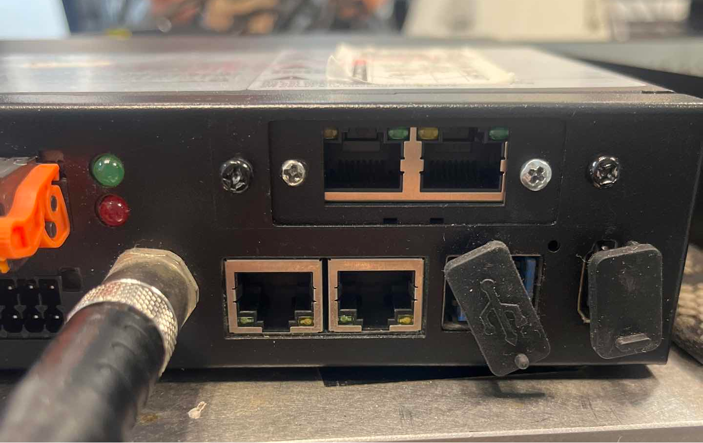

.. centered:: 图表 19.2-7 RJ45 网口扩展卡安装示意图

.. note:: 注：所有螺钉均需拧紧。

(3) 机器人控制箱和PLC接线如下图所示。

.. image:: remote_mode/010.png
   :width: 4in
   :align: center

.. centered:: 图表 19.2-8 控制箱&三菱PLC接线图    

.. image:: remote_mode/011.png
   :width: 4in
   :align: center

.. centered:: 图表 19.2-9 控制箱&西门子PLC接线图

.. image:: remote_mode/012.png
   :width: 4in
   :align: center

.. centered:: 图表 19.2-10 控制箱&汇川PLC接线图

.. image:: remote_mode/013.png
   :width: 4in
   :align: center

.. centered:: 图表 19.2-11 控制箱&汇川PLC接线图

.. note:: 
    1：机器人控制箱（板卡网口）；
    2：交换机；
    3：笔记本PC；
    4：三菱PLC（CC-Link IEF Basic网口）；
    5：西门子PLC（Profinet网口）；
    6：汇川PLC（Ethernet/IP）；
    7：汇川PLC（EtherCAT网口）；
        
PLC环境搭建
~~~~~~~~~~~~~~~~~~~~~~~~~~~~~~~~~~~~~~~~~~~~~~~~~~~~~~~~

实现各协议从站指令所搭建的测试环境如下表所示，其中包括各协议中所使用PLC的型号，固件版本及测试软件。

.. centered:: 表 2-1 测试环境

.. list-table:: 
   :widths: 20 40 40
   :header-rows: 1
   :align: center

   * - 协议
     - Profinet
     - CC-link

   * - 品牌
     - 西门子
     - 三菱

   * - 型号
     - CPU 1515-2 PN
     - FX5S-30TR/DS

   * - 固件
     - 6ES75152AM020AB0
     - 30MR/ES V1.3

   * - 软件
     - TIA Portal V17
     - GXWorks3V1.097B

   * - 板卡IP地址
     - IP可配置
     - IP可配置

   * - PLC IP地址
     - IP无需同网段
     - IP同网段
		
.. list-table:: 
   :widths: 20 40 40
   :header-rows: 1
   :align: center

   * - 协议
     - Ethernet/IP
     - EtherCAT

   * - 品牌
     - 汇川
     - 汇川

   * - 型号
     - Easy521-0808TN
     - Easy521-0808TN

   * - 固件
     - /
     - /

   * - 软件
     - AutoShop 4.11.0.1
     - AutoShop 4.11.0.1

   * - 板卡IP地址
     - IP可配置
     - IP可配置

   * - PLC IP地址
     - IP同网段
     - IP同网段
		
汇川Ethernet/IP
+++++++++++++++++++++++++++++++++++++++++++++++++++++

(1) EDS文件导入

打开汇川编程软件AutoShop，新建PLC工程，右侧工具箱栏选择“EtherNet/IP Devices”。

鼠标左键点击“EtherNet/IP”后，右键弹出“导入EDS”对话框，左键确定，找到放置板卡EDS文件的文件夹。导入成功后“EtherNet/IP Devices”目录下会出现板卡的名称，关闭工程重新打开，导入EDS文件完成。

.. image:: custom_protocol_slave/001.png
   :width: 6in
   :align: center

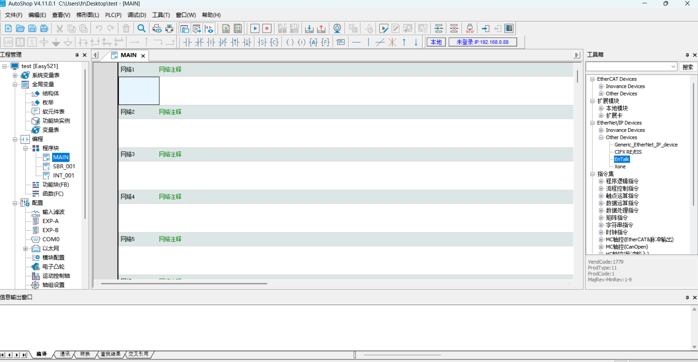

(2) EtherNet/IP 参数设置

双击左侧工具栏下“EtherNet/IP”下的从站，弹出参数设置窗口：

.. image:: custom_protocol_slave/003.png
   :width: 6in
   :align: center

填写板卡IP地址：

.. image:: custom_protocol_slave/004.png
   :width: 6in
   :align: center

单击选择“连接”，进行数据输入输出字节大小设置：

.. image:: custom_protocol_slave/005.png
   :width: 6in
   :align: center

点击“编辑连接”，进入弹窗，将输入输出字节数均改为256：

.. image:: custom_protocol_slave/006.png
   :width: 6in
   :align: center

单击选择“数据集”，将输入输出数据类型设置为“INT”，位长度设置为“2048”：

.. image:: custom_protocol_slave/007.png
   :width: 6in
   :align: center

.. image:: custom_protocol_slave/008.png
   :width: 6in
   :align: center

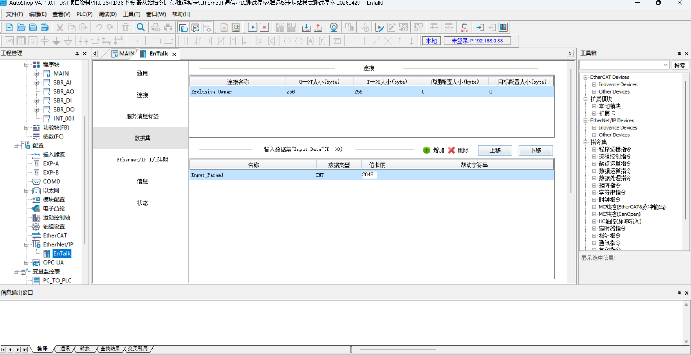

对“数据集”参数设置成功后，单击选择“EtherNet/IP I/O映射”分别输入D0和D200,D0和D200分别对应PLC端接收和发送数组的起始地址。

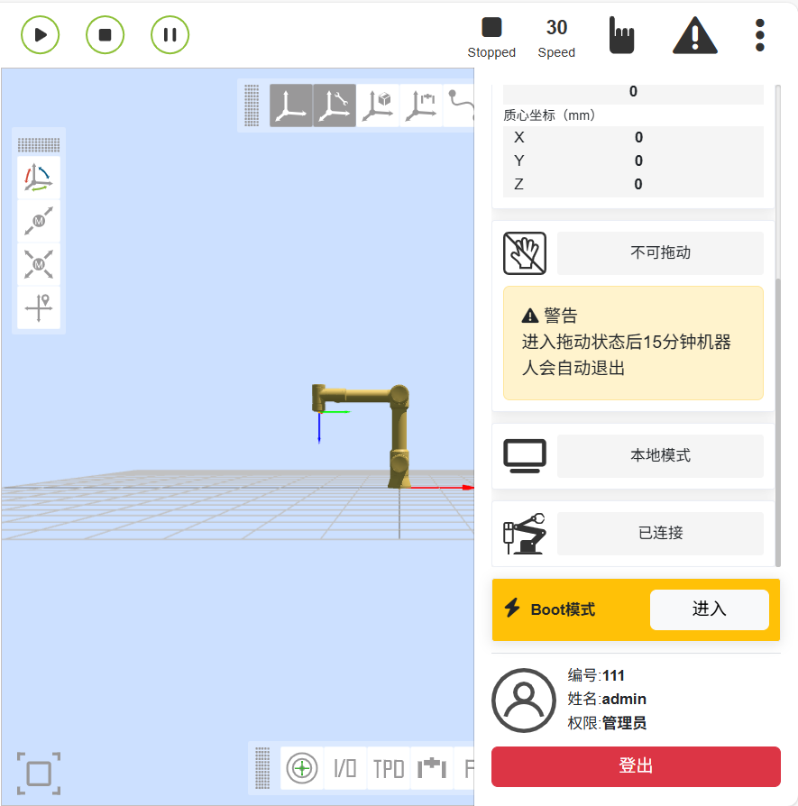

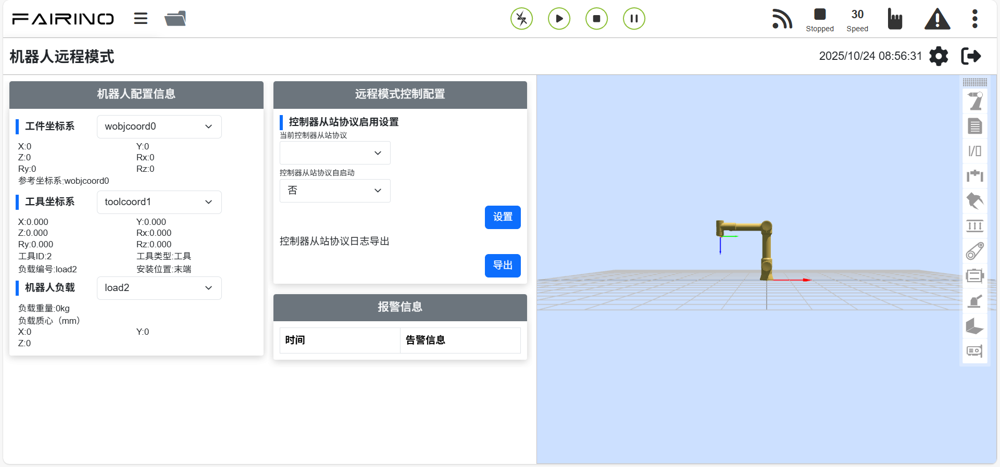

(3) 程序下载

打开测试程序，将PLC IP地址修改为与板卡同网段，下载程序后运行。

西门子Profinet
++++++++++++++++++++++++++++++++++++++++++++++++++++++++

(1) GSD文件（XML文件）导入

打开西门子编程软件TIA Portal V17，新建PLC工程，选择“设备与网络”，右侧“硬件目录”选择双击6ES7 515-2AM02-0AB0添加PLC模块。

.. image:: custom_protocol_slave/012.png
   :width: 6in
   :align: center

在 TIA PORTAL 软件中菜单栏选择“选项”->“管理通用站描述文件(GSD)”可安装或删除已经安装完成的 GSD 文件。

.. image:: custom_protocol_slave/013.png
   :width: 6in
   :align: center

安装 GSD 文件，如上选择“管理通用站描述文件(GSD)”，出现“管理通用站描述文件”窗口。

从“源路径”选择要安装 GSD 文件的文件夹，从所显示 GSD 文件的列表中选择要安装的一个或者多个文件，单击“安装”按钮。如下图所示。

.. image:: custom_protocol_slave/014.png
   :width: 6in
   :align: center

安装成功后，可在硬件目录下，其它现场设备找到安装的 GSD 文件的设备，如下图所示。

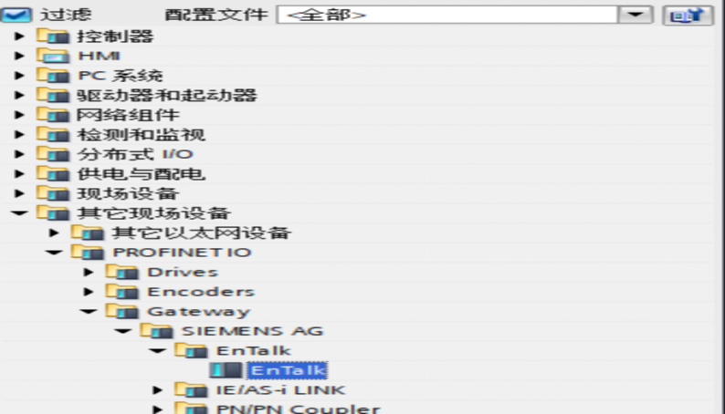

分配IO：目录寻找模块拖动Input与Output。

.. image:: custom_protocol_slave/016.png
   :width: 6in
   :align: center

编译程序：左侧项目树双击进入“设备和网络”，右击“PLC_1”模块，下拉菜单选择编译，单机“硬件和软件（仅更改）”。编译完成后将在软件视图下方提示“编译完成”：

.. image:: custom_protocol_slave/017.png
   :width: 6in
   :align: center

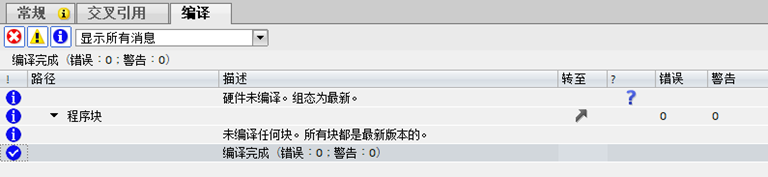

下载程序到设备：左侧项目树双击进入“设备和网络”，右击“PLC_1”模块，下拉菜单选择“下载到设备”，单机“硬件和软件（仅更改）”：

.. image:: custom_protocol_slave/019.png
   :width: 6in
   :align: center

搜索并下载设备：弹窗后如下图配置PG/PC接口类型，点击开始搜索，选择需要下载程序的设备，点击下载：

.. image:: custom_protocol_slave/020.png
   :width: 6in
   :align: center

.. image:: custom_protocol_slave/021.png
   :width: 6in
   :align: center

三菱CC-link
+++++++++++++++++++++++++++++++++++++++++++++++++

(1) CC-Link IEF Basic设置

开启使用CC-link：左侧导航菜单栏选择“以太网端口”，设置PLC ip地址，保证与骥远板卡地址同网段。点击“CC-link IEF Basic使用有无”，选择 “使用”：

.. image:: custom_protocol_slave/022.png
   :width: 6in
   :align: center

CC-Link 网络配置设置：同样在CC-Link IEF Basic设置，选择“网络配置设置”，模块选择CC-Link IEF Basic通用模块。拖拽到视图左下方，完成硬件配置：

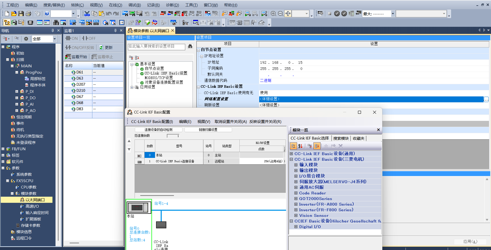
   
.. image:: custom_protocol_slave/024.png
   :width: 6in
   :align: center

设置从站的点数和IP地址：

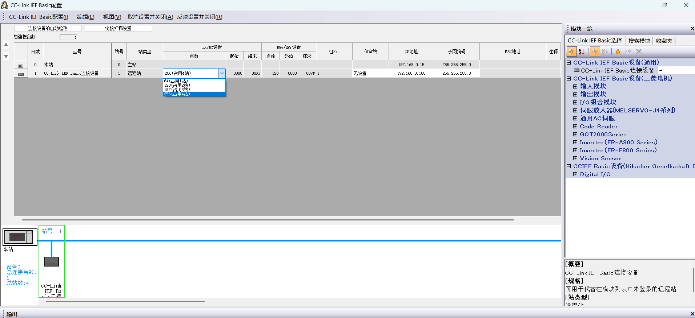
   
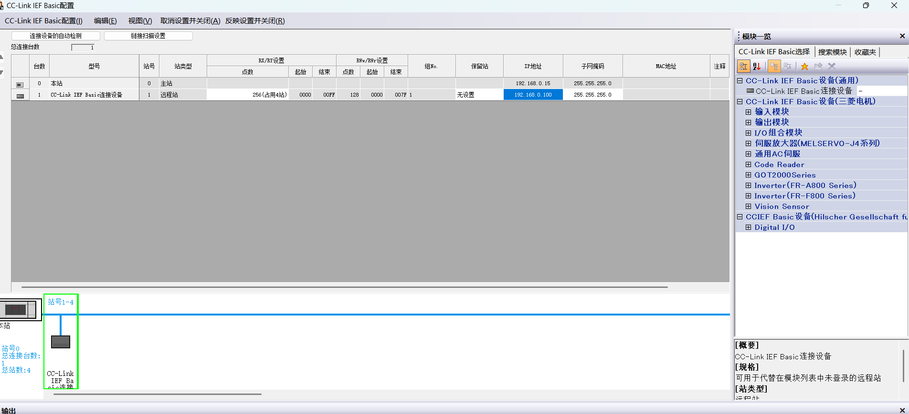

CC-Link 刷新设置：同样在CC-Link IEF Basic设置，点击刷新设置，自定义传输设置：256字节接收，256字节发送。
   
.. image:: custom_protocol_slave/027.png
   :width: 6in
   :align: center

(2) 程序下载

打开测试程序后，点击“在线”→“写入至可编程控制器”进入下载界面。
   
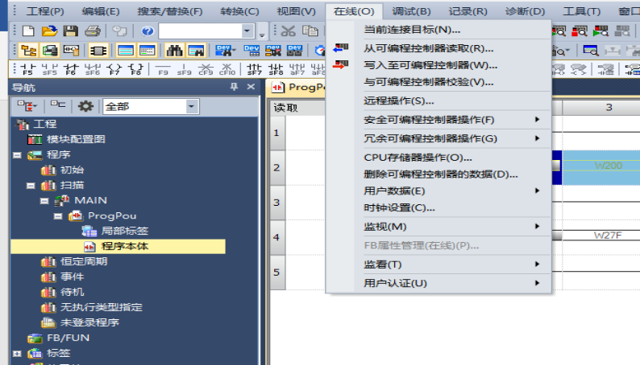

打开下载界面后，点击左上方“参数+程序”，再点击右下角“执行”进行下载，等待下载完成。
   
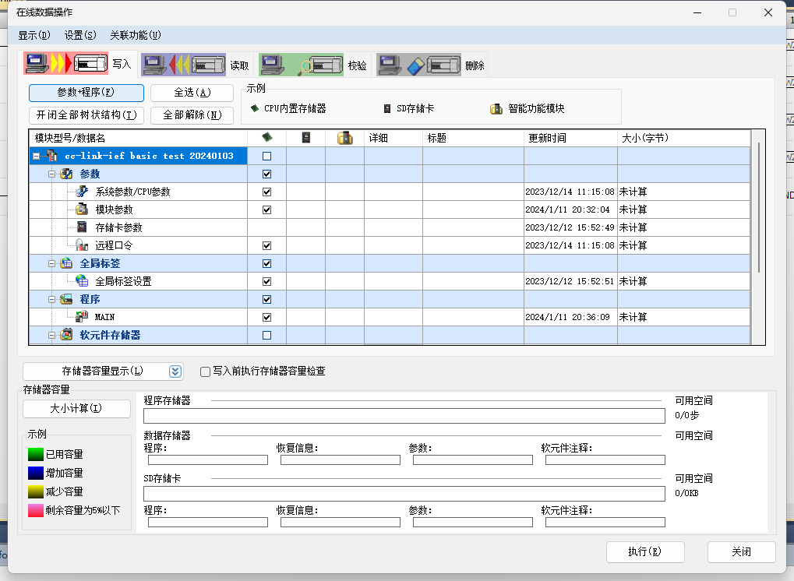

汇川EtherCAT
++++++++++++++++++++++++++++++++++++++++++++++

(1) XML文件导入

打开汇川编程软件AutoShop，新建PLC工程，右侧工具箱栏选择“EtheCATDevices”：
   
.. image:: custom_protocol_slave/030.png
   :width: 6in
   :align: center

鼠标左键点击“EtheCATDevices”后，右键弹出“导入设备XML”对话框，左键确定，找到放置板卡XML文件的文件夹。

导入成功后“EtherCAT Devices”目录下会出现板卡的名称，这时关闭工程重新打开后完成XML文件导入流程。
   
.. image:: custom_protocol_slave/031.png
   :width: 6in
   :align: center

(2) 添加EtherCAT从站

右侧工具栏→“EtehrCAT Devices”→“Other Devices”→“JIYuan”→“Xone-PCIe-ECATs”,鼠标双击“Xone-PCIe-ECATs”，添加EtherCAT从站，此时可以看到左侧工程项目下EtherCAT主站下添加从站成功。
   
.. image:: custom_protocol_slave/032.png
   :width: 6in
   :align: center
   
.. image:: custom_protocol_slave/033.png
   :width: 6in
   :align: center

(3) 添加PDO
   
.. image:: custom_protocol_slave/034.png
   :width: 6in
   :align: center
   
.. image:: custom_protocol_slave/035.png
   :width: 6in
   :align: center

(4) EtherCAT地址映射

左侧工具栏双击变量表，新建输入为256字节的数组，软元件地址为D0。新建输出为256字节的数组，软元件地址为D200。
   
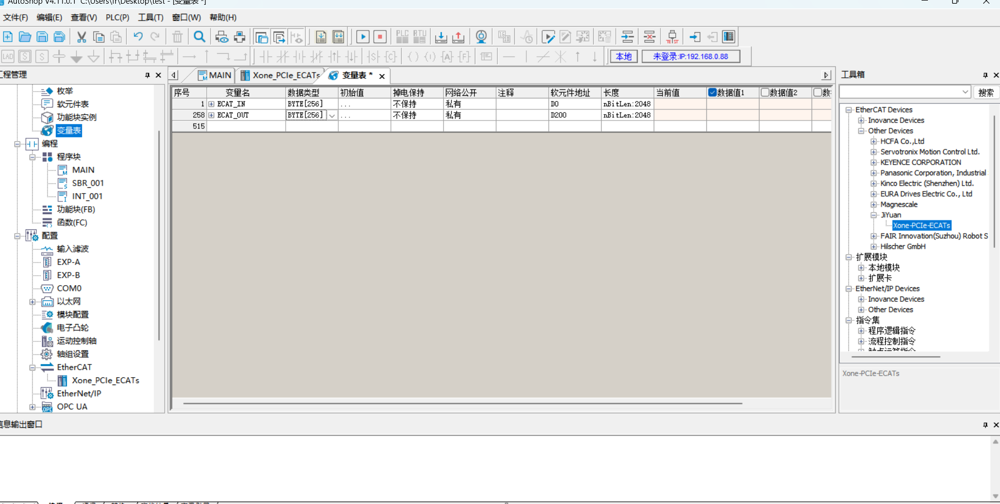

左侧工具栏“EtherCAT”下双击“Xone-PCIe-ECATs”，在弹出对话框中单击 “I/O功能映射”，单击方框进行变量地址绑定，在弹出对话框中单击“变量表”，在选择需要对应的输入\输出，单击确定，其他地址按顺序绑定操作同上。
   
.. image:: custom_protocol_slave/037.png
   :width: 6in
   :align: center

(5) 程序下载

打开测试程序，将PLC IP地址改为与板卡同网段，下载程序后运行。

机器人从站模式相关操作说明
--------------------------------------------------------------------------------------

加载从站模式
~~~~~~~~~~~~~~~~~~~~~~~~~~~~~~~~~~~~~~~~~~

(1) 打开WebApp，进入初始设置->外设->板卡通讯->手动配置。
   
.. image:: custom_protocol_slave/038.png
   :width: 6in
   :align: center

首先，对板卡IP地址进行配置，如不填写，则板卡按照默认IP: 192.168.0.100进行启动配置。目前IP配置仅适用于EIP、CC-link协议，PN协议由PLC主站扫描从站设备分配IP。

.. note:: 页面上更改IP地址后，需要加载从站模式方可生效。
   
接着，依次选择DI、DO、AO所需映射功能（见附录），各参数意义如下：

- DI为机器人控制：机器人从站接受外部信号输入，执行映射的功能；
- DO为机器人状态输出：机器人从站反馈状态信号至主站；
- AO为机器人状态反馈：机器人从站反馈状态数据至主站，AO0~AO15为有符号整形(int16)，AO16~AO31为单精度浮点数(float)。

(2) 点击“配置”按钮，生成开放协议lua文件。
   
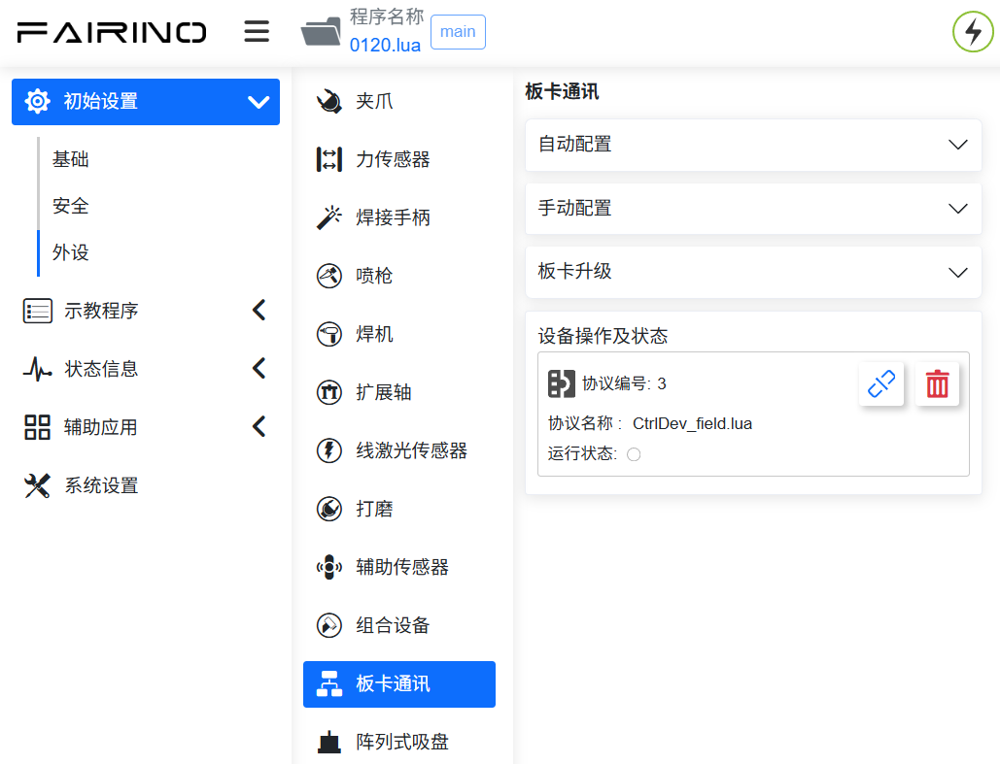

.. note:: 开放协议lua文件支持下载，可在自动配置界面导入开放协议lua文件。

生成程序示例如下：

.. code-block:: console
   :linenos:

   local id = 3 
   local ctrlDI = {0, 0, 0, 0, 0, 0}
   local funcDI = {0, 0, 0, 0, 0, 0, 0, 0, 0, 0, 0, 0, 0, 0, 0, 0}
   local DOState = {0, 0, 0, 0, 0, 0, 0, 0}
   local AOState = {0, 0, 0, 0, 0, 0, 0, 0, 0, 0, 0, 0, 0, 0, 0, 0, 0, 0, 0, 0, 0, 0, 0, 0, 0, 0, 0, 0, 0, 0, 0, 0}
   -- Launch the board communication process
   SetFieldBusIP("192.168.0.99")
   LoadFieldBusSlave()
   sleep_ms(8000)
   while(1) do
      -- Set the DO status
      CtrlBoxDO, CtrlBoxCO, CtrlBoxDI, CtrlBoxCI, errState, motionState, moveToOriginState, robotStartDoneState, modeChangeState, programStartStopState, emergencyState, reduceState, collision, enablestate, safetyStop0, safetyStop1, pauseState, interfereState = GetRobotFuncDOState()
      DOState[1] = CtrlBoxDO
      DOState[2] = CtrlBoxCO
      DOState[3] = CtrlBoxDI
      DOState[4] = CtrlBoxCI
      local ctrlWord0 = 0
      ctrlWord0 = SetBitWithIndex(ctrlWord0, 0, errState)
      ctrlWord0 = SetBitWithIndex(ctrlWord0, 1, motionState)
      ctrlWord0 = SetBitWithIndex(ctrlWord0, 2, moveToOriginState)
      ctrlWord0 = SetBitWithIndex(ctrlWord0, 3, robotStartDoneState)
      ctrlWord0 = SetBitWithIndex(ctrlWord0, 4, modeChangeState)
      ctrlWord0 = SetBitWithIndex(ctrlWord0, 5, programStartStopState)
      ctrlWord0 = SetBitWithIndex(ctrlWord0, 6, emergencyState)
      ctrlWord0 = SetBitWithIndex(ctrlWord0, 7, reduceState)
      DOState[5] = ctrlWord0
      local ctrlWord1 = 0
      ctrlWord1 = SetBitWithIndex(ctrlWord1, 0, collision)
      ctrlWord1 = SetBitWithIndex(ctrlWord1, 1, enablestate)
      ctrlWord1 = SetBitWithIndex(ctrlWord1, 2, safetyStop0)
      ctrlWord1 = SetBitWithIndex(ctrlWord1, 3, safetyStop1)
      ctrlWord1 = SetBitWithIndex(ctrlWord1, 4, pauseState)
      ctrlWord1 = SetBitWithIndex(ctrlWord1, 5, interfereState)
      DOState[6] = ctrlWord1
      SetFieldBusDOState(DOState)

      -- Set the AO status
      mainErrCode, subErrCode, TCPSpeed, axisPos1, axisPos2, axisPos3, axisPos4, axisPos5, axisPos6, jointVelFeedback1, jointVelFeedback2, jointVelFeedback3, jointVelFeedback4, jointVelFeedback5, jointVelFeedback6, jointCurFeedback1, jointCurFeedback2, jointCurFeedback3,jointCurFeedback4,jointCurFeedback5,jointCurFeedback6, jointTorqueFeedback1, jointTorqueFeedback2,jointTorqueFeedback3,jointTorqueFeedback4, jointTorqueFeedback5, jointTorqueFeedback6, cartPosx, cartPosy, cartPosz, cartPosrx, cartPosry, cartPosrz = GetRobotFuncAOState()
      AOState[1] = mainErrCode
      AOState[2] = subErrCode
      AOState[17] = axisPos1
      AOState[18] = axisPos2
      AOState[19] = axisPos3
      AOState[20] = axisPos4
      AOState[21] = axisPos5
      AOState[22] = axisPos6
      AOState[23] = cartPosx
      AOState[24] = cartPosy
      AOState[25] = cartPosz
      AOState[26] = cartPosrx
      AOState[27] = cartPosry
      AOState[28] = cartPosrz
      SetFieldBusAOState(AOState)
      sleep_ms(10) 

      -- Set the DI status
      -- Configue the DI function and update it in real-time
      ctrlDI[1],ctrlDI[2],ctrlDI[3],ctrlDI[4],ctrlDI[5],ctrlDI[6] = GetFieldBusDIState()
      funcDI[1] = ctrlDI[1] 
      funcDI[2] = ctrlDI[2] 
      funcDI[3] = GetBitWithIndex(ctrlDI[3], 0)
      funcDI[4] = GetBitWithIndex(ctrlDI[3], 1)
      funcDI[5] = GetBitWithIndex(ctrlDI[3], 2)
      funcDI[6] = GetBitWithIndex(ctrlDI[3], 3)
      funcDI[7] = GetBitWithIndex(ctrlDI[3], 4)
      funcDI[8] = GetBitWithIndex(ctrlDI[3], 5)
      funcDI[9] = GetBitWithIndex(ctrlDI[3], 6)
      funcDI[10] = GetBitWithIndex(ctrlDI[3], 7)
      funcDI[11] = GetBitWithIndex(ctrlDI[4], 0)
      funcDI[12] = GetBitWithIndex(ctrlDI[4], 1)
      funcDI[13] = GetBitWithIndex(ctrlDI[4], 2)
      funcDI[14] = GetBitWithIndex(ctrlDI[4], 3)
      funcDI[15] = GetBitWithIndex(ctrlDI[4], 4)
      funcDI[16] = GetBitWithIndex(ctrlDI[4], 5)
      SetRobotFuncDIState(funcDI)
      local stopFlag = GetOpenLUAStopFlag(id)
      if(stopFlag ~= 0) then 
         UnloadFieldBusSlave()
         break
      end
      sleep_ms(10)
   end

(3) 点击加载按钮，加载机器人从站模式。
   
.. image:: custom_protocol_slave/040.png
   :width: 6in
   :align: center

.. note:: 机器人从站模式加载成功后，支持开机自启动功能。如需使用远程模式，请先卸载从站模式。

(4) 点击右侧板卡状态栏按钮，监控DI、DO、AI、AO交互信息，各参数介绍如下：

- CtrlDO：外部主站下发控制箱DO/CO信号输入值；
- DI：外部主站控制信号输入值；
- Aux_DI：通讯板卡扩展DI；
- DO：机器人从站反馈信号输出值；
- Aux_DO：通讯板卡扩展DO；
- AI：外部主站输入值；
- AI0~AI15：int16类型；
- AI16~AI31：float类型；
- AO：机器人从站输出值；
- AO0~AO15：int16类型；
- AO16~AO31：float类型。

.. note:: DI、DO、AI、AO各参数信息详见《RD36-机器人从站模式地址对照表-V1.0-20260605》。
   
.. image:: custom_protocol_slave/041.png
   :width: 4in
   :align: center

(5) 加载完成后，可通过示教程序->通讯指令->板卡生成板卡lua指令，实现设置从站DO、AO，获取从站DI、AI，等待从站DI、AI。
   
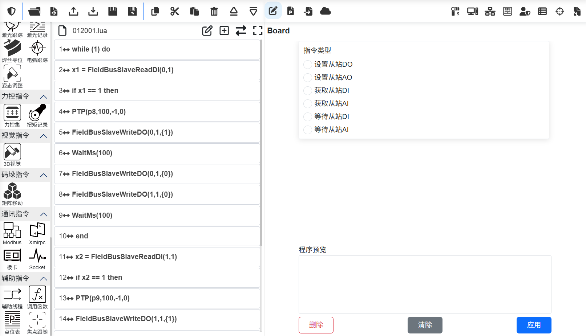

板卡固件升级及通讯周期配置
--------------------------------------------------------------------------

FRJ-PCIeN-EIP/CC/PN-RJ-V10板卡
~~~~~~~~~~~~~~~~~~~~~~~~~~~~~~~~~~~~~~~~~~~~~~~~~~~~~~~~~~~~~~~~~~~~~~~~~~~~~~~~~~
板卡进行协议切换时，需进行固件升级，使用上位机升级FRJ-PCIeN-EIP/CC/PN-RJ-V10板卡固件，步骤如下：

(1) 打开WinPcap_4_1_3.exe，安装网卡驱动包。

(2) 将PC（Win11系统）网口与板卡网口直连，打开Device Assistant v1.1.0.exe，双击“以太网”，点击左上角“刷新”按钮，可以扫描到当前连接的板卡设备。
   
.. image:: custom_protocol_slave/043.png
   :width: 6in
   :align: center
      
.. image:: custom_protocol_slave/044.png
   :width: 6in
   :align: center

(3) 双击扫描到的板卡设备，进入固件更新界面。将PC和获取到的板卡ip配置在同网段，点击“固件更新”菜单栏右侧“…”按钮，上传待升级的固件，点击“更新”按钮，左下角文本框提示“升级成功”打印即可。
      
.. image:: custom_protocol_slave/045.png
   :width: 6in
   :align: center

(4) 板卡升级成功会执行复位操作，等待板卡复位完成（5s），输入需要的通讯周期（支持1~100ms），点击“设置”按钮，左下角提示“周期设置成功”打印后，重启控制箱即可。
      
.. image:: custom_protocol_slave/046.png
   :width: 6in
   :align: center

FRJ-PCIeN-EC/PN/EIP/CC-RJ-V20板卡
~~~~~~~~~~~~~~~~~~~~~~~~~~~~~~~~~~~~~~~~~~~~~~~~~~~~~~~~~~~~~~~~~~~~~~~~~~~~~~~~~~

板卡进行协议切换时，需进行固件升级，登录机器人界面升级FRJ-PCIeN-EC/PN/EIP/CC-RJ-V20板卡固件，步骤如下：

(1) 网址输入192.168.58.2进入机器人界面，点击 “初始设置”->“外设”->“板卡通讯”界面，可以获取到FRJ-PCIeN-EC/PN/EIP/CC-RJ-V20板卡固件版本号。选择待升级的bin文件，点击上传，等待固件升级成功后，重启控制箱即可。
      
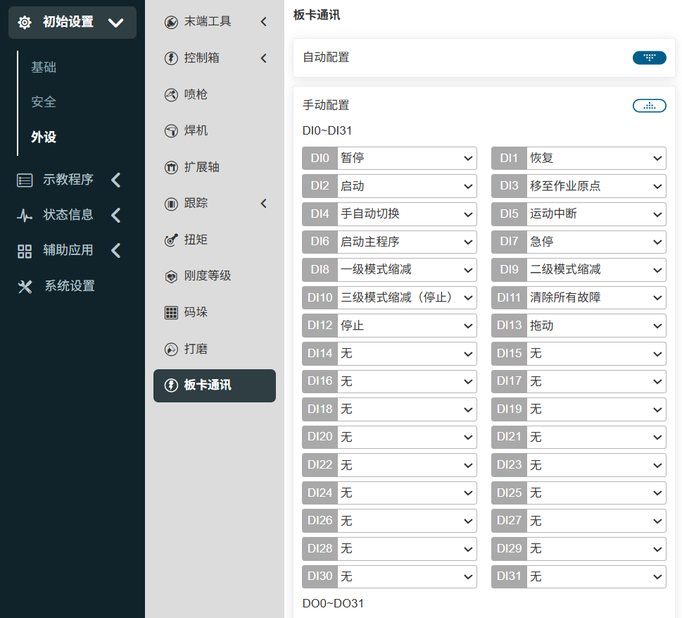

.. note:: FRJ-PCIeN-EC/PN/EIP/CC-RJ-V20板卡升级固件需卸载已运行的开放协议。

(2) 网址输入192.168.58.2进入机器人界面，点击 “初始设置”->“外设”->“板卡通讯”界面，可以获取到板卡通讯周期。输入所需通讯周期（1~100ms），点击“配置”按钮，等待配置成功后，重启控制箱即可。
      
.. image:: custom_protocol_slave/048.png
   :width: 6in
   :align: center

.. note:: FRJ-PCIeN-EC/PN/EIP/CC-RJ-V20板卡配置通讯周期需卸载已运行的开放协议。

:download:`板卡通讯固件及配置文件 <../_static/_doc/板卡通讯固件及配置文件.zip>`

:download:`各协议PLC测试程序汇总 <../_static/_doc/各协议PLC测试程序汇总.zip>`
