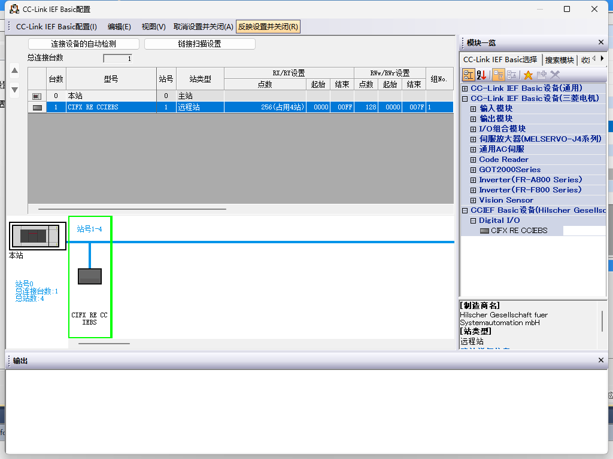
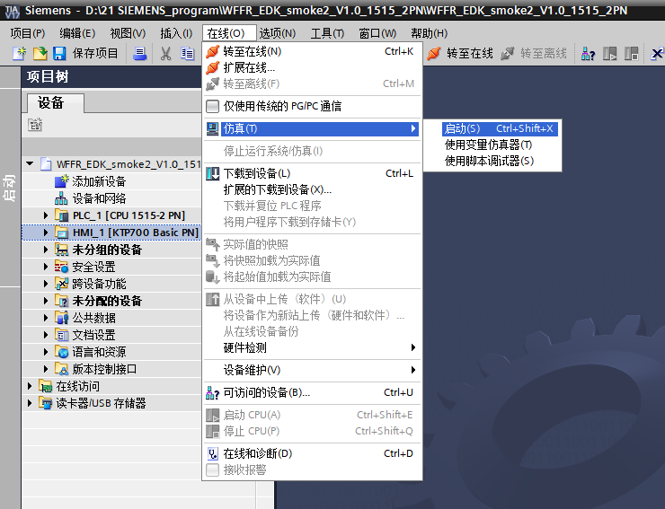

自定义协议从站指令
===========================

.. toctree:: 
   :maxdepth: 6

概述
-------------------

为了便于PLC通过不同的工业总线协议（CC-Link、Profinet、Ethernet/IP和EtherCAT）对机器人进行运动控制，在集成式mini控制箱上增加赫优讯板卡模块，实现功能如下：

1) CC-Link slave 协议支持；
2) Profinet slave 协议支持；
3) Ethernet/IP slave 协议支持；
4) EtherCAT slave 协议支持；

环境配置
--------------------------

硬件环境搭建
~~~~~~~~~~~~~~~~~~~~~~~~~~~~~~~~~~

1. 将赫优讯板卡安装到集成式mini控制箱，如图所示。

.. image:: custom_protocol_slave/001.png
   :width: 4in
   :align: center

.. centered:: 图表 17.2-1 赫优讯板卡安装

.. image:: custom_protocol_slave/002.png
   :width: 4in
   :align: center

.. centered:: 图表 17.2-2 赫优讯板卡网口

2. 机器人控制箱和PLC接线如下图所示。

.. centered:: 图表 17.2-3 控制箱&三菱PLC接线图

.. image:: custom_protocol_slave/004.png
   :width: 4in
   :align: center

.. centered:: 图表 17.2-4 控制箱&西门子PLC接线图

.. centered:: 图表 17.2-5 控制箱&欧姆龙PLC接线图

.. image:: custom_protocol_slave/006.png
   :width: 4in
   :align: center

.. centered:: 图表 17.2-6 控制箱&欧姆龙PLC接线图

.. note:: 
    1：机器人控制箱（板卡网口）；
    2：交换机；
    3：笔记本PC；
    4：三菱PLC（CC-link网口）；
    5：西门子PLC（Profinet网口）；
    6：欧姆龙PLC（Ethernet/IP网口）；
    7：欧姆龙PLC（EtherCAT网口）；

.. important:: 当协议切换为EtherCAT总线时，板卡的网口需要区分为EtherCAT_IN和EtherCAT_OUT，此时，欧姆龙PLC的EtherCAT网口需要与板卡的EtherCAT_IN网口通过一根网线直连。

软件环境搭建
~~~~~~~~~~~~~~~~~~~~~~~~~~~~~~~~~~

1. 浏览器IP输入192.168.58.2，账号为admin，密码为123，点击“登录”，进入机器人控制箱Web界面。

.. image:: custom_protocol_slave/007.png
   :width: 6in
   :align: center

.. centered:: 图表 17.2-7 Web登录界面

2. 点击辅助应用->工具应用->系统升级界面，选择software.tar.gz文件，上传升级包。

.. centered:: 图表 17.2-8 软件升级

.. note:: qnx控制箱web版本需要3.7.6及以上，linux控制箱web版本需要3.7.4及以上。

3. 进入外设->远程控制， 控制模式选择“Profinet控制”，厂商选择“Hilscher”，循环周期选择“4ms”，点击“设置”。

.. centered:: 图表 17.2-9 接口配置

4. 点击右上角“本地模式”->切换远程模式。

.. centered:: 图表 17.2-10 切换远程模式

5. 选择控制器从站协议，点击“设置”按钮。

.. centered:: 图表 17.2-11 配置通讯协议

.. note:: 切换不同的协议，需要重启控制箱再进行协议的配置。

PLC环境搭建
~~~~~~~~~~~~~~~~~~~~~~~~~~~~~~~~~~

实现各协议从站指令所搭建的测试环境如下表所示，其中包括各协议中所使用PLC的型号，固件版本及测试软件。

.. list-table:: 
   :widths: 100 100 100 100 100
   :header-rows: 1
   :align: center

   * - 协议
     - 品牌
     - 型号
     - 固件
     - 软件
  
   * - Profinet
     - 西门子
     - CPU 1515-2 PN
     - 6ES75152AM020AB0
     - TIA Portal V17
  
   * - CC-link
     - 三菱
     - FX5S-30TR/DS
     - 30MR/ES V1.3
     - GX Works3 V1.097B
  
   * - Ethernet/IP
     - 欧姆龙
     - MX102-1100
     - V1.3
     - Sysmac Studio V1.50
  
   * - EtherCAT
     - 欧姆龙
     - MX102-1100
     - V1.3
     - Sysmac Studio V1.50

西门子Profinet
++++++++++++++++++++++++++++++++++

1. GSD文件（XML文件）导入

打开西门子编程软件TIA Portal V17，新建PLC工程，选择“设备与网络”，右侧“硬件目录”选择双击6ES7 515-2AM02-0AB0添加PLC模块。

在 TIA PORTAL 软件中菜单栏选择“选项”->“管理通用站描述文件(GSD)”可安装或删除已经安装完成的 GSD 文件。

以安装赫优讯 GSD 文件为例，如上选择“管理通用站描述文件(GSD)”，出现“管理通用站描述文件”窗口。

从“源路径”选择要安装 GSD 文件的文件夹，从所显示 GSD 文件的列表中选择要安装的一个或者多个文件，单击“安装”按钮。如下图所示。

安装成功后，可在硬件目录下，其它现场设备找到安装的 GSD 文件的设备，如下图所示。

2. 运行程序

打开工程“QNXtest”。

编译程序：左侧项目树双击进入“设备和网络”，右击“PLC_1”模块，下拉菜单选择编译，单机“硬件和软件（仅更改）”。编译完成后将在软件视图下方提示“编译完成”。

下载程序到设备：左侧项目树双击进入“设备和网络”，右击“PLC_1”模块，下拉菜单选择“下载到设备”，单机“硬件和软件（仅更改）”。

搜索并下载设备：弹窗后如下图配置PG/PC接口类型，点击开始搜索，选择需要下载程序的设备，点击下载。

三菱CC-link
++++++++++++++++++++++++++++++++++

1. CC-Link IEF Basic设置

开启使用CC-link：左侧导航菜单栏选择“以太网端口”，设置PLC ip地址，保证与赫优讯板卡地址同网段。点击“CC-link IEF Basic使用有无”，选择 “使用”。

CC-Link 网络配置设置：同样在CC-Link IEF Basic设置，选择“网络配置设置”，模块选择赫优讯CIFX Digital I/O模块。拖拽到视图左下方，完成硬件配置。

CC-Link 刷新设置：同样在CC-Link IEF Basic设置，点击刷新设置，自定义传输设置：256字节接收，256字节发送。

2. 程序下载

打开测试程序后，点击“在线”→“写入至可编程控制器”进入下载界面。

打开下载界面后，点击左上方“参数+程序”，再点击右下角“执行”进行下载，等待下载完成。

HMI设置（CC-link仿真）
~~~~~~~~~~~~~~~~~~~~~~~~~~~~~~~~~~~~~~~~~

1. 登录HMI界面后使能“Enable Task”建立PLC与控制器通信连接。

2. 点击01_MC_EnableRobot界面后再点击“EnableRobot”使能机器人，使用过程中如有报错，点击“Reset”复位。

.. image:: custom_protocol_slave/028.png
   :width: 6in
   :align: center

3. 点击“02_MC_ToolData”进入工具信息界面，左边输入参数后点击WriteToolData写入工具信息；右边点击ReadToolData读取现有工具信息。
   
.. image:: custom_protocol_slave/029.png
   :width: 6in
   :align: center

4. 点击“03_MC_FrameData”进入工件信息界面，左边输入参数后点击WriteFrameData写入工件信息；右边点击ReadFrameData读取现有工件信息。
   

5. 点击“04_MC_LoadData”进入负载信息界面，左边输入参数后点击WriteLoadData写入负载信息；右边点击ReadLoadData读取现有负载信息。
   

6. 点击“05_MC_RobotReferenceDynamics”进入机器人最大速度和最大加速度界面，左边输入参数后点击WriteRobotRefD写入最大速度和最大加速度信息；右边点击ReadRobotRefD读取最大速度和最大加速度信息。
   
.. image:: custom_protocol_slave/032.png
   :width: 6in
   :align: center

7. 点击“06_MC_Robot DefaultDynamics”进入机器人默认速度和默认加速度界面，左边输入参数后点击WriteRobotDefD写入默认速度和默认加速度信息；右边点击ReadRobotDefD读取默认速度和默认加速度信息。
   
.. image:: custom_protocol_slave/033.png
   :width: 6in
   :align: center

8. 点击“07_MC_RobotSwLimits”进入坐标限位界面，左边输入最大限位和最小限位参数值后点击WriteRobotSwLimits写入限位参数信息；右边点击ReadRobotSwLimits读取现有限位参数信息。
   
.. image:: custom_protocol_slave/034.png
   :width: 6in
   :align: center

9. 点击“08_MC_ReadActualPosition”进入读取实际位置界面，点击读取ReadPosition读取现有位置信息。
   
.. image:: custom_protocol_slave/035.png
   :width: 6in
   :align: center

10. 点击“09_MC_MoveLinearAbsolute”进入线性运动界面，输入坐标参数后点击MoveLinearAbsolute使机器人以目标位置线性移动。
   

11. 点击“10_MC_MoveAxesAbsolute”进入轴坐标运动界面，输入坐标参数后点击MoveAxesAbsolute使机器人以输入的轴坐标为终点向目标位置移动。
   
.. image:: custom_protocol_slave/037.png
   :width: 6in
   :align: center

12. 点击“11_MC_MoveDirectAbsolute”进入直接运动界面，输入坐标参数后点击MoveDirectAbsolute使机器人以输入参数为终点直接向目标位置移动。
   

13. 点击“12_MC_Groups”进入直接运动操作界面，其中，点击GroupInterrupt可以使机器人在运动过程中中断移动，点击GroupContinue使机器人继续向目标位置移动。点击GroupStop停止（结束）正在进行的位置移动动作。如在过程中触犯报警或错误，点击GroupReset复位机器人错误。
   
.. image:: custom_protocol_slave/039.png
   :width: 6in
   :align: center

14. 点击“13_MC_PositionConversion”进入位置换算界面，XtoJ1可进行笛卡尔位姿到关节角度的转换，J1toX可进行关节角度到笛卡尔位姿的转换。
   
.. image:: custom_protocol_slave/040.png
   :width: 6in
   :align: center

15. 点击“14_MC_GroupJog”进入机器人点动界面，配置完毕后下拉坐标轴选择需要点动的轴，再选择轴的旋转方向。点击JogMove进行点动。右边MC_ChangeSpeedOverride可调整机械臂的移动速度。
   
.. image:: custom_protocol_slave/041.png
   :width: 6in
   :align: center

HMI设置（Profinet仿真）
~~~~~~~~~~~~~~~~~~~~~~~~~~~~~~~~~~~~~~~~~

1. 打开程序后单击选择项目树中的“HMI_1[ktp700 Basic PN]”，之后在菜单栏中点击“在线”→“仿真”→“启动”。等待软件编译并仿真。

2. 仿真后功能与威纶通屏幕（CC-link）内容一致。可参考上述内容设置。
   

.. image:: custom_protocol_slave/043.png
   :width: 6in
   :align: center

附录
-------------------

指令列表
~~~~~~~~~~~~~~~~~~~~~~~~~~~

.. list-table:: 
   :widths: 20 80
   :header-rows: 1
   :align: center

   * - 命令码
     - 指令描述

   * - 0x1000
     - 机器人使能

   * - 0x1001
     - 重置所有错误

   * - 0x1002
     - 机器人停止运动

   * - 0x1003
     - 读取实际位置

   * - 0x1004
     - 设置机器人速度

   * - 0x1005
     - 机器人继续运动

   * - 0x1006
     - 机器人暂停运动

   * - 0x1007
     - 根据joint位置计算出笛卡尔位置

   * - 0x1008
     - 根据笛卡尔位置计算出joint位置

   * - 0x2000
     - 写工具信息

   * - 0x2001
     - 读工具信息

   * - 0x2002
     - 写工件信息

   * - 0x2003
     - 读工件信息

   * - 0x2004
     - 写负载信息

   * - 0x2005
     - 读负载信息

   * - 0x2006
     - 写reference dynamic信息

   * - 0x2007
     - 读reference dynamic信息

   * - 0x2008
     - 写default dynamic信息

   * - 0x2009
     - 读default dynamic信息

   * - 0x2010
     - 写软限位信息

   * - 0x2011
     - 读软限位信息

   * - 0x3000
     - MoveAxes（基于关节角度）

   * - 0x3001
     - MoveLinear

   * - 0x3002
     - MoveDirect（基于笛卡尔坐标系）

   * - 0x3003
     - jog运动

   * - 0x3004
     - jog停止