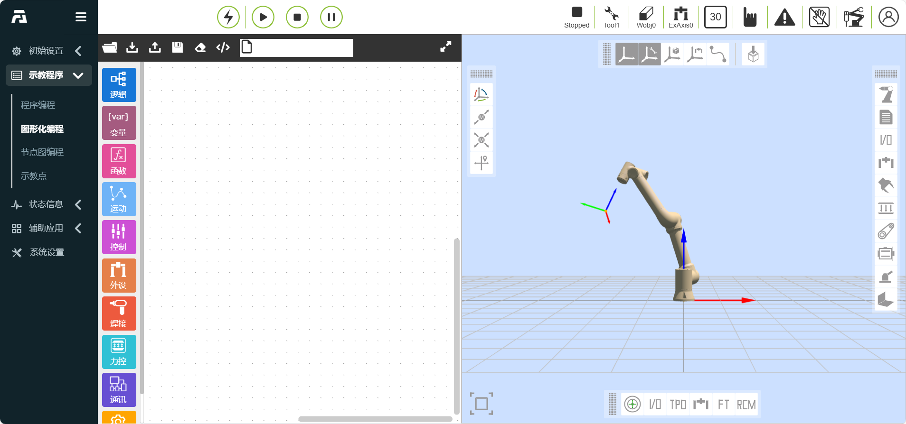
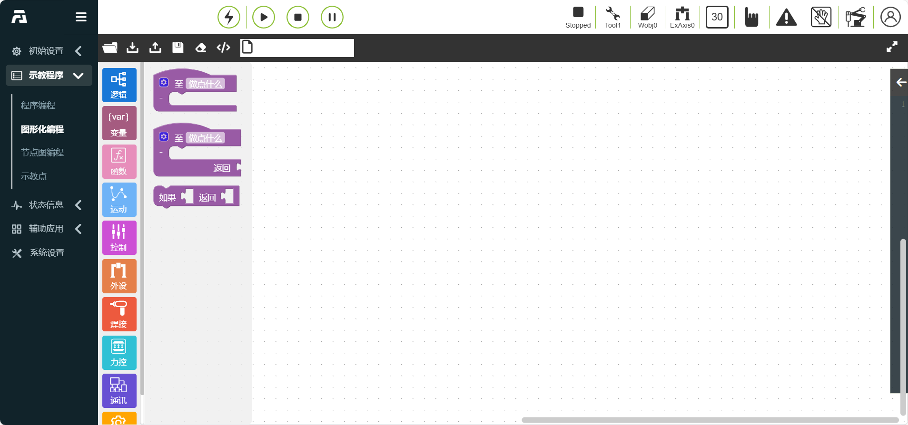
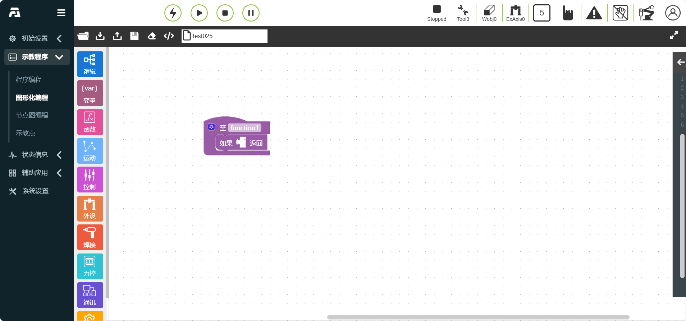
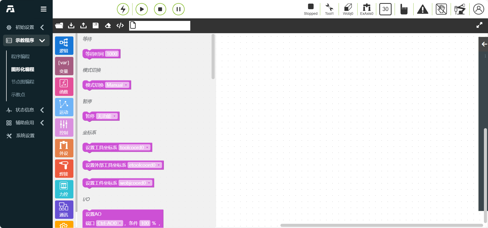
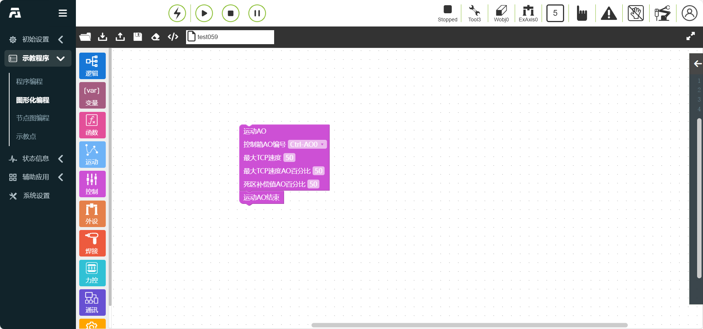
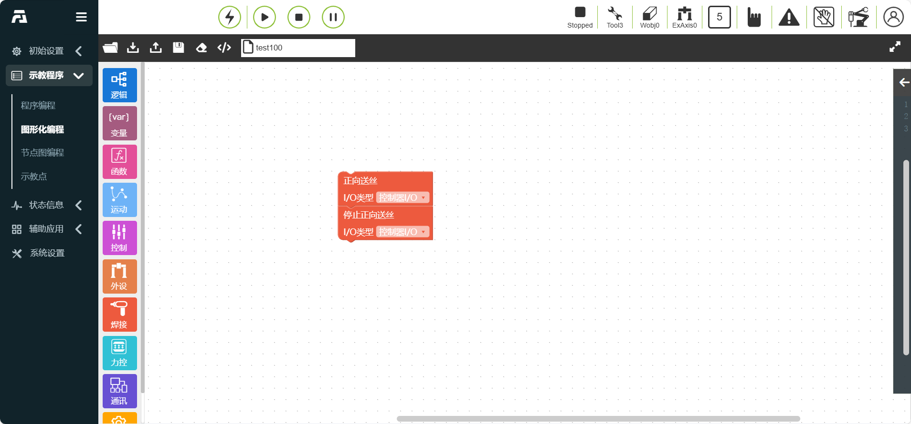
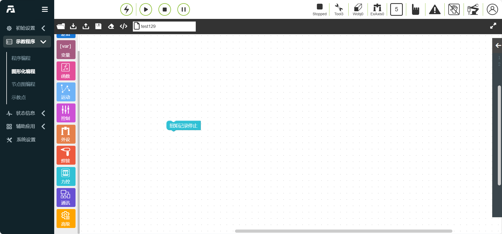
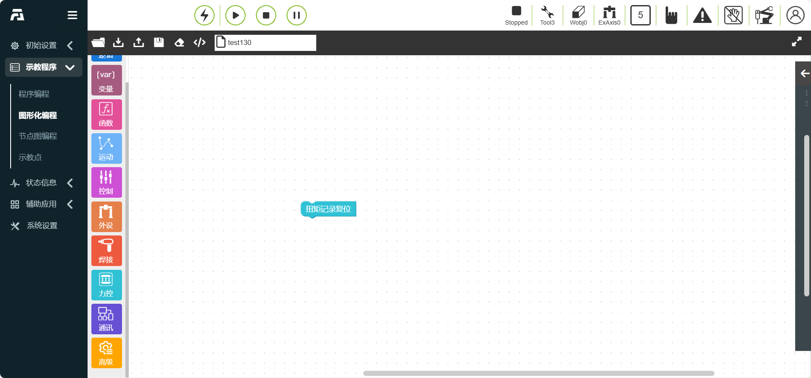
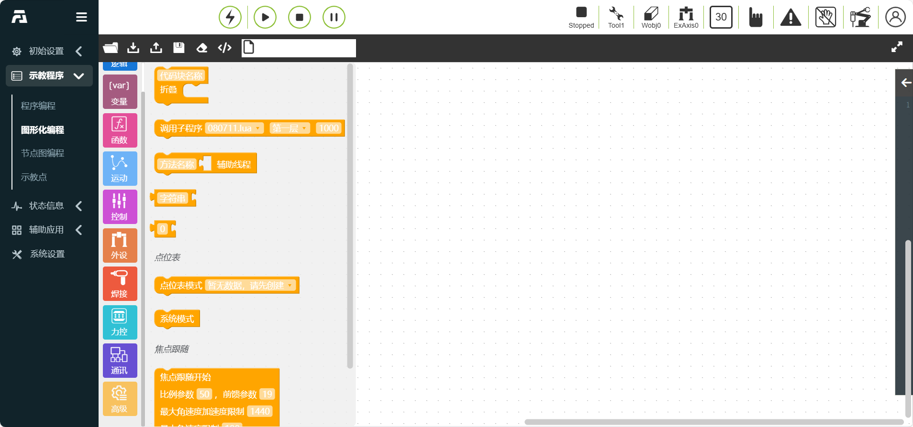
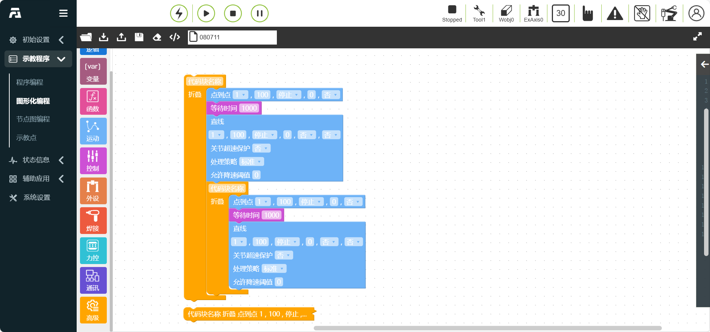

图形化编程
===============

.. toctree:: 
   :maxdepth: 6

简介
----------

由于示教器一般不会外接键鼠等外设，在示教器端访问机器人WebAPP时，用户可以通过图形化编程功能进行机器人示教程序编辑。功能标准化函数实现使用Blockly库，可以集成在WebAPP系统中，根据需要实现自定义代码块，并且拖拽编程完成后转换为LUA程序通过现有指令协议下发运行。

通过使用图形编程，能够做到简单易懂，易操作，语言汉化操作。

页面分为三个区域：“操作栏”、“toolbox工具栏”和“workspace代码编辑区”，整体的布局设计如图如下：

.. centered:: 图表 10.1‑1 图形化编程界面

**操作栏**

1) **加载**：负责workspace的重新加载
2) **导入**：负责导入相关图形化编程程序
3) **导出**：负责导出已保存的工作区中的图形化编程程序“保存”按钮功能为代码块编辑完成后保存为对应的示教程序
4) **保存**：负责保存已编辑好的图形化代码块
5) **清空**：负责快速清空代码编辑区
6) **代码**：负责将代码块转译成Lua代码

**Toolbox**

1) 包含所有指令和逻辑代码的代码块，可以拖动到workspace创建代码块并编辑
2) Toolbox工具栏部分会根据指令类型进一步分类
3) 逻辑类指令：if-else，while等
4) 基础运动类指令：PTP，LIN，ARC等依据应用场景指令分类：涂胶，焊接，传送带等。在使用的过程中可以方便地找到所需代码块

**Workspace**：在代码编辑区中可以编辑和展示图形化的代码块。

逻辑类图形化编程命令
--------------------------
逻辑类图形化编程命令包含 循环、数字等逻辑命令。

.. image:: graphical/003.png
   :width: 6in
   :align: center

.. centered:: 图表 10.2 逻辑类图形化编程

If/Else判断指令
~~~~~~~~~~~~~~~~~~~~~
拖动“If/Else判断指令”代码块,进入图形化编辑界面工作区。（该指令需要一定编程基础，如需帮助，请联系我们）

.. centered:: 图表 10.2-1 If/Else判断指令代码块

While指令
~~~~~~~~~~~~~~~~~~~~~
拖动“While指令”代码块,进入图形化编辑界面工作区。（该指令需要一定编程基础，如需帮助，请联系我们）

在While后方添加输入等待条件，在while内部添加运动指令代码块，点击保存即可。（为方便操作，可任意输入do内容，在程序中编辑其他指令插入代替）

.. centered:: 图表 10.2-2 While指令代码块

跳转指令
~~~~~~~~~~~~~~~~~~~~~
拖动“跳转指令”代码块,进入图形化编辑界面工作区。（该指令需要一定编程基础，如需帮助，请联系我们）

- 跳转名称：输入跳转名称，来确定跳转位置

.. centered:: 图表 10.2-3 跳转指令代码块

.. important:: 跳转名称不能以数字开头。

变量类图形化编程命令
--------------------------
变量类图形化编程命令包含创建变量命令。

.. image:: graphical/004.png
   :width: 6in
   :align: center

.. centered:: 图表 10.3 变量类图形化编程

变量指令
~~~~~~~~~~~~~~~~~~~~~
点击“创建”按钮，可输入需要定义得变量名称。

拖动“变量指令”代码块,进入图形化编辑界面工作区。

“变量”指令节点,参数：

.. centered:: 图表 10.3-1 变量指令代码块

函数类图形化编程命令
--------------------------
函数类图形化编程命令包含创建函数命令。

.. centered:: 图表 10.4 函数类图形化编程

函数方法指令
~~~~~~~~~~~~~~~~~~~~~
拖动“函数方法指令”代码块,进入图形化编辑界面工作区。

“函数方法”指令节点,参数：

- 函数名：运行的函数名称

.. centered:: 图表 10.4-1 函数方法指令代码块

运动类图形化编程命令
--------------------------
运动类图形化编程命令包含 PTP、Lin 、ARC等运动命令。

.. image:: graphical/006.png
   :width: 6in
   :align: center

.. centered:: 图表 10.5 运动类图形化编程

点到点指令
~~~~~~~~~~~~~~~~~~~~~
拖动“点到点指令”代码块,进入图形化编辑界面工作区。

可以选择需要到达的点，平滑过渡时间设置可以实现该点到下一点的运动是连续的，是否偏移设置，可以选择基于基坐标系偏移和基于工具坐标偏移，并弹出x,y,z,rx,ry,rz偏移量设置，PTP具体路径为运动控制器自动规划的最优路径。

“点到点”指令节点,参数：

- 点名称：示教点位

- 调试速度(%)：0 ~ 100

- 停止：false/true

- 平滑过渡(ms)：平滑过渡时间 0 ~ 500

- 是否偏移 否/基坐标偏移/工具坐标偏移 选择否时，dx~drz参数值不生效

- dx~drz：偏移量

.. centered:: 图表 10.5-1 点到点指令代码块

直线指令
~~~~~~~~~~~~~~~~~~~~~
拖动“直线指令”代码块,进入图形化编辑界面工作区。

该指令功能与“点到点”指令相似，但该指令所到达点的路径为直线。

“直线”指令节点,参数：

- 点名称：示教点位

- 调试速度(%)：0 ~ 100

- 停止：false/true，选择true时，平滑过渡参数值不生效

- 平滑过渡(mm)：平滑过渡半径 0 ~ 1000

- 是否寻位：false/true

- 寻位点变量：REF0~99/RES0~99，是否寻位选择false时，参数不生效

- 是否偏移： 否

- 关节超速保护：否/是

- 处理策略：标准/超速时报错停止/自适应降速

- 允许降速阈值：0~100

.. centered:: 图表 10.5-2 直线指令代码块

直线（过渡点角速度可调）指令
~~~~~~~~~~~~~~~~~~~~~~~~~~~~~~~~~~~~~~~~~~~~~~~~~~~~~~~
拖动“直线（过渡点角速度可调）指令”代码块,进入图形化编辑界面工作区。

该指令功能与“点到点”指令相似，但该指令包含过渡点角速度可调。

“直线（过渡点角速度可调）”指令节点,参数：

- 点名称：示教点位

- 调试速度(%)：0 ~ 100

- 停止：false/true，选择true时，平滑过渡参数值不生效

- 平滑过渡(mm)：平滑过渡半径 0 ~ 1000

- 是否寻位：false/true

- 寻位点变量：REF0~99/RES0~99，是否寻位选择false时，参数不生效

- 是否偏移： 否

- 过渡点角速度可调：否/是

- 最大角速度：0~300

.. image:: graphical/028.png
   :width: 6in
   :align: center

.. centered:: 图表 10.5-3 直线（过渡点角速度可调）指令代码块

直线(seamPos)指令
~~~~~~~~~~~~~~~~~~~~~
拖动“直线(seamPos)指令”代码块,进入图形化编辑界面工作区。

该指令功能应用于焊接场景中使用激光传感器。

“直线(seamPos)”指令节点,参数：

- 点名称：示教点位

- 调试速度(%)：0 ~ 100

- 停止：false/true，选择true时，平滑过渡参数值不生效

- 平滑过渡(mm)：平滑过渡半径 0 ~ 1000

- 焊缝缓存数据选择：执行规划数据/执行记录数据

- 板材类型：波纹板/瓦楞板/围栏板/油桶/波纹甲壳钢

- 是否偏移： 否/基坐标偏移/工具坐标偏移/激光原始数据偏移 选择否时，dx~drz参数值不生效

- dx~drz：偏移量

.. centered:: 图表 10.5-4 直线(seamPos)指令代码块

圆弧指令
~~~~~~~~~~~~~~~~~~~~~
拖动“圆弧指令”代码块,进入图形化编辑界面工作区。

圆弧运动包含两个点，第一点为圆弧中间过渡点，第二点为终点，过渡点和终点都可以对是否偏移进行设置，可以选择基于基坐标系偏移和基于工具坐标偏移，设置x,y,z,rx,ry,rz偏移量，终点可以设置平滑过渡半径，实现运动连续效果。

“圆弧”指令节点,参数：

- 圆弧中间点：示教点位

- 是否偏移： 否/基坐标偏移/工具坐标偏移 选择否时，dx~drz参数值不生效

- dx~drz：偏移量

- 圆弧终点：示教点位

- 是否偏移： 否/基坐标偏移/工具坐标偏移 选择否时，dx~drz参数值不生效

- dx~drz：偏移量

- 调试速度(%)：0 ~ 100

- 停止：false/true，选择true时，平滑过渡参数值不生效

- 平滑过渡(mm)：平滑过渡半径 0 ~ 1000

.. centered:: 图表 10.5-5 圆弧指令代码块

整圆指令
~~~~~~~~~~~~~~~~~~~~~
拖动“整圆指令”代码块,进入图形化编辑界面工作区。

点击“整圆”指令节点,进入节点图编辑界面。

整圆运动包含两个点，第一点为整圆中间过渡点1，第二点为整圆中间过渡点2，过渡点2可以设置是否偏移，该偏移量同时生效于过渡点1和过渡点2

“整圆”指令节点,参数：

- 整圆中间点1：示教点位

- 整圆中间点2：示教点位

- 调试速度(%)：0 ~ 100

- 是否偏移： 否/基坐标偏移/工具坐标偏移 选择否时，dx~drz参数值不生效

- dx~drz：偏移量

.. centered:: 图表 10.5-6 整圆指令代码块

螺旋指令
~~~~~~~~~~~~~~~~~~~~~
拖动“螺旋指令”代码块,进入图形化编辑界面工作区。

螺旋线运动包含三个点，该三个点组成一个圆，在第三点设置页面，包含螺旋圈数，姿态修正角，半径增量和转轴方向增量这几个参数设置，螺旋圈数即该螺旋线的运动圈数，姿态修正角修正的是螺旋线结束时的姿态与螺旋线第一点的姿态，半径增量即每一圈半径的增量，转轴方向增量即螺旋轴方向的增量。设置 是否偏移，该偏移量生效于整个螺旋线的轨迹。

“螺旋”指令节点,参数：

- 螺旋线中间点1：示教点位

- 螺旋线中间点2：示教点位

- 螺旋线中间点3：示教点位

- 调试速度(%)：0 ~ 100

- 是否偏移： 否/基坐标偏移/工具坐标偏移 选择否时，dx~drz参数值不生效

- dx~drz：偏移量

- 螺旋圈数：0 ~ 100

- 姿态角修正rx(°)：-1000 ~ 1000

- 姿态角修正ry(°)：-1000 ~ 1000

- 姿态角修正rz(°)：-1000 ~ 1000

- 半径增量(mm)：-100 ~ 100

- 转轴方向增量(mm)：-100 ~ 100

.. centered:: 图表 10.5-7 螺旋指令代码块

新螺旋指令
~~~~~~~~~~~~~~~~~~~~~
拖动“新螺旋指令”代码块,进入图形化编辑界面工作区。

点击“新螺旋”指令节点,进入节点图编辑界面。

新螺旋运动为优化版螺旋线运动，该指令只需要一个点加各参数的配置实现螺旋线运动。机器人以当前位置作为起点，用户设置调试速度，是否偏移，螺旋圈数，螺旋倾角，初始半径，半径增量，转轴方向增量和旋转方向这几个参数，螺旋圈数即该螺旋线的运动圈数，螺旋倾角即工具Z轴与水平方向的夹角，姿态修正角修正的是螺旋线结束时的姿态与螺旋线第一点的姿态，初始半径即第一圈半径大小，半径增量即每一圈半径的增量，转轴方向增量即螺旋轴方向的增量，旋转方向即顺时针和逆时针。

“新螺旋”指令节点,参数：

- 螺旋线起点：示教点位

- 调试速度(%)：0 ~ 100

- 是否偏移： 否/基坐标偏移/工具坐标偏移 选择否时，dx~drz参数值不生效

- dx~drz：偏移量

- 螺旋圈数：0 ~ 100

- 螺旋倾角(°)：-100 ~ 100

- 初始半径：0 ~ 100

- 半径增量(mm)：-100 ~ 100

- 转轴方向增量(mm)：-100 ~ 100

- 旋转方向：顺时针/逆时针

.. centered:: 图表 10.5-8 新螺旋指令代码块

水平螺旋指令
~~~~~~~~~~~~~~~~~~~~~
拖动“水平螺旋指令”代码块,进入图形化编辑界面工作区。

“H-Spiral”指令为水平空间螺旋线运动，该指令设置于单段运动（直线）指令之后。

“水平螺旋”指令节点,参数：

- 螺旋半径: 0~100mm

- 螺旋角速度: 0~2rev/s

- 旋转方向: 螺旋顺/逆时针

- 螺旋倾角: 0~40°

.. centered:: 图表 10.5-9 水平螺旋指令代码块

样条指令
~~~~~~~~~~~~~~~~~~~~~
拖动“样条指令”代码块,进入图形化编辑界面工作区。

该指令分为样条组起始，样条段和样条组结束三部分，样条组开始是样条运动的起始标志，样条段目前节点图只包含SPL段，样条组结束是样条运动的结束标志。

“样条-SPTP”指令节点,参数：

- 点名称：示教点位

- 调试速度(%)：0 ~ 100

.. centered:: 图表 10.5-10 样条指令代码块

新样条指令
~~~~~~~~~~~~~~~~~~~~~
拖动“新样条指令”代码块,进入图形化编辑界面工作区。

该指令为样条指令算法优化指令，后续会替代现有的样条指令，该指令分为多点轨迹起始，多点轨迹段和多点轨迹结束三部分，多点轨迹开始是多点轨迹运动的起始标志，多点轨迹段即设置各个轨迹点，点击图标进入点位添加界面，多点轨迹结束是多点轨迹运动的结束标志，在此可以设置控制模式和调试速度，控制模式分 为给定控制点和给定路径点。

“新样条”指令节点,参数：

- 控制模式：示教点位

- 全局平均衔接时间：整数型，大于10，默认值为2000ms

“新样条-SPL”指令节点,参数：

- 点名称：示教点位

- 调试速度(%)：0 ~ 100

- 平滑过渡半径：0 ~ 1000

- 是否最后一个点：否/是

.. centered:: 图表 10.5-11 新样条指令代码块

摆动指令
~~~~~~~~~~~~~~~~~~~~~
拖动“摆动指令”代码块,进入图形化编辑界面工作区。

该指令包含两部分，第一部分选择配置好参数的摆焊编号，连接Body代表连接节点的程序在“开始摆焊”和“停止摆焊”中间执行。

“摆动”指令节点,参数：

- 编号：0~7

.. centered:: 图表 10.5-12 摆动指令代码块

点偏移指令
~~~~~~~~~~~~~~~~~~~~~
拖动“点偏移指令”代码块,进入图形化编辑界面工作区。

该指令为整体偏移指令，输入各个偏移量，连接Body代表连接节点的程序在开始和关闭之间执行，中间的运动指令会基于基坐标（或工件坐标）进行偏移。

“点偏移”指令节点,参数：

- ∆x：偏移量，-300~300

- ∆y：偏移量，-300~300

- ∆z：偏移量，-300~300

- ∆rx：偏移量，-300~300

- ∆ry：偏移量，-300~300

- ∆rz：偏移量，-300~300

.. centered:: 图表 10.5-13 点偏移指令代码块

伺服指令
~~~~~~~~~~~~~~~~~~~~~
拖动“伺服指令”代码块,进入图形化编辑界面工作区。

伺服控制（笛卡尔空间运动）指令，该指令可以通过绝对位姿控制或基于当前位姿偏移来控制机器人运动。

“伺服”指令节点,参数：

- 运动方式：绝对位置/基坐标偏移/工具坐标偏移

- x：偏移量，-300~300

- y：偏移量，-300~300

- z：偏移量，-300~300

- rx：偏移量，-300~300

- ry：偏移量，-300~300

- rz：偏移量，-300~300

- 比例系数x：0~1

- 比例系数y：0~1

- 比例系数z：0~1

- 比例系数rx：0~1

- 比例系数ry：0~1

- 比例系数rz：0~1

- 加速度(%)：0~100

- 速度(%)：0~100

- 指令周期(s)：0.001~0.016

- 滤波时间(s)：0~1

- 比例放大：0~100

.. centered:: 图表 10.5-14 伺服指令代码块

轨迹指令
~~~~~~~~~~~~~~~~~~~~~
拖动“轨迹指令”代码块,进入图形化编辑界面工作区。

在该指令中，用户首先需要有记录好的轨迹。

“轨迹”指令节点,参数：

- 选择轨迹文件：记录好的轨迹

- 调试速度(%)：0 ~ 100，默认值为25

.. centered:: 图表 10.5-15 轨迹指令代码块

轨迹J指令
~~~~~~~~~~~~~~~~~~~~~
拖动“轨迹J指令”代码块,进入图形化编辑界面工作区。

在该指令中，用户首先需要有记录好的轨迹，可以在示教程序界面预先导入轨迹文件。轨迹指令和轨迹J指令适用于相机直接给定轨迹的通用接口，满足在已有固定格式的离散的轨迹点文件时，可导入系统使得机器人按照导入文件的轨迹进行运动。

“轨迹J”指令节点,参数：

- 选择轨迹文件：记录好的轨迹

- 调试速度(%)：0 ~ 100，默认值为25

- 轨迹模式：路径点/控制点

.. centered:: 图表 10.5-16 轨迹J指令代码块

轨迹复现指令
~~~~~~~~~~~~~~~~~~~~~
拖动“轨迹复现指令”代码块,进入图形化编辑界面工作区。

在该指令中，用户首先需要有记录好的轨迹。

进行程序编程时，首先用点到点指令到达对应轨迹起始点，然后在轨迹复现指令中选择轨迹，选择平滑轨迹，设置调试速度。轨迹加载指令主要用于预先读取轨迹文件，提取成轨迹指令，更好的应用于传送带跟踪场景。

“轨迹复现”指令节点,参数：

- 轨迹名称：记录好的轨迹

- 平滑轨迹：否/是

- 调试速度(%)：0 ~ 100，默认值为25

.. centered:: 图表 10.5-17 轨迹复现指令代码块

DMP指令
~~~~~~~~~~~~~~~~~~~~~
拖动“DMP指令”代码块,进入图形化编辑界面工作区。

DMP是一种轨迹模仿学习的方法，需要事先规划参考轨迹。在命令编辑界面 ，选择示教点作为新的起点，点击“添加”、“应用”后可保存该指令。DMP具体路径为以新的起点模仿参考轨迹的新轨迹。

“DMP”指令节点,参数：

- 点名称：示教点

- 调试速度(%)：0 ~ 100，默认值为100

.. centered:: 图表 10.5-18 DMP指令代码块

工具转换指令
~~~~~~~~~~~~~~~~~~~~~
拖动“工具转换指令”代码块,进入图形化编辑界面工作区。

选择所要进行自动转换的工具坐标系，点击“添加”、“应用”后可保存该指令，添加PTP、LIN指令时与Body相连可实现在该指令内部执行，工具坐标系下点位自动转换。

“工具转换”指令节点,参数：

- 工具坐标系：工具坐标系列表

.. centered:: 图表 10.5-19 工具转换指令代码块

工件转换指令
~~~~~~~~~~~~~~~~~~~~~
拖动“工件转换指令”代码块,进入图形化编辑界面工作区。

选择所要进行自动转换的工件坐标系，点击“添加”、“应用”后可保存该指令，添加PTP、LIN指令时与Body相连可实现在该指令内部执行，工件坐标系下点位自动转换。

“工件转换”指令节点,参数：

- 工件坐标系：工件坐标系列表

.. centered:: 图表 10.5-20 工件转换指令代码块

控制类图形化编程命令
--------------------------
控制类图形化编程命令包含Wait、IO等控制命令。

.. centered:: 图表 10.6 控制类图形化编程命令

等待指令
~~~~~~~~~~~~~~~~~~~~~
拖动“等待指令”代码块,进入图形化编辑界面工作区。

该指令为延时指令，分为“WaitMs”、“WaitDI”、“WaitMultiDI”和“WaitAI”四部分。

1. “等待”指令节点,参数：

- 等待时间(ms): 延时等待时间单位为毫秒，输入需要等待的毫秒数

.. centered:: 图表 10.6-1 等待指令代码块

2. “等待DI”指令节点,参数：

- DI端口号： Ctrl-DI0 ~ Ctrl-CI7(WaitDI,[0~15]), End-DI0 ~ End-DI1(WaitToolDI,[0~1])

- 状态： false/true

- 最大时间(ms)： 0 ~ 10000

- 等待超时处理：停止报错/继续执行/一直等待

.. centered:: 图表 10.6-2 等待DI指令代码块

3. “等待多条DI”指令节点，参数:

- 条件： 与/或

- 条件选择：选择位的状态开启的端口号，以逗号隔开，例DI0,DI1

- 真值对应端口：选择真值的端口号，以逗号隔开，例DI0,DI1

- 最大时间(ms)：0 ~ 10000,最大等待时间

- 等待超时处理：停止报错/继续执行/一直等待

.. centered:: 图表 10.6-3 等待多条DI指令代码块

4. “等待AI”指令节点，参数:

- 条件： 与/或

- AI端口号： Ctrl-AI0 ~ Ctrl-AI1(WaitAI,[0~1]), End-AI0(WaitToolAI,[0])

- 条件：大于/小于

- 数值(%)：1 ~ 100

- 最大时间(ms)：0 ~ 10000

- 等待超时处理：停止报错/继续执行/一直等待,等待超时处理一直等待时，最大时间默认为0

.. centered:: 图表 10.6-4 等待AI指令代码块

模式切换指令
~~~~~~~~~~~~~~~~~~~~~
拖动“模式切换指令”代码块,进入图形化编辑界面工作区。

该指令可切换机器人到手动模式，通常在一个程序结尾处添加，以便用户在程序运行结束后，使机器人自动切换到手动模式，拖动机器人。

“模式切换”指令节点,参数：

- 模式切换：手动模式

.. centered:: 图表 10.6-5 模式切换指令代码块

暂停指令
~~~~~~~~~~~~~~~~~~~~~
拖动“暂停指令”代码块,进入图形化编辑界面工作区。

该指令为暂停指令，在程序中插入该指令，当程序执行到该指令时，机器人会处于暂停状态，若想继续运行，点击控制区“暂停/恢复”按键即可。

“暂停”指令节点,参数：

- 暂停类型：无功能、气缸未到位等

.. centered:: 图表 10.6-6 暂停指令代码块

坐标系指令
~~~~~~~~~~~~~~~~~~~~~
拖动“设置工具坐标系”/“设置工件坐标系”代码块,进入图形化编辑界面工作区。

1. “设置工具坐标系”指令节点,参数：

- 工具坐标系名称：toolcoord1 ~ toolcoord14(SetToolList,[0~14]), etoolcoord0 ~ etoolcoord14(SetExToolList, [0~14])

.. centered:: 图表 10.6-7 设置工具坐标系指令代码块

2. “设置工件坐标系”指令节点,参数：

- 工件坐标系名称：wobjcoord1 ~ wobjcoord14

.. centered:: 图表 10.6-8 设置工件坐标系指令代码块

模拟AI指令
~~~~~~~~~~~~~~~~~~~~~
拖动“设置AO”/“获取AI”代码块,进入图形化编辑界面工作区。

在该指令中，分为设置模拟输出（SetAO/SPLCSetAO）和获取模拟输入（GetAI/SPLCGetAI）两部分功能。

1. “设置AO”指令节点,参数：

- 端口：Ctrl-AO0 ~ Ctrl-AO1(阻塞:SetAO,非阻塞:SPLCSetAO,[0~1]), End-AO0(阻塞:SetToolAO,非阻塞:SPLCSetToolAO,[0])

- 数值(%)：0 ~ 100

- 是否阻塞：阻塞/非阻塞

- 是否应用线程：否/是

.. centered:: 图表 10.6-9 设置AO指令代码块

2. “获取AI”指令节点,参数：

- 端口：Ctrl-AI0 ~ Ctrl-DI1(阻塞:GetAI,非阻塞:SPLCGetAI,[0~1]), End-AI0(阻塞:GetToolAI,非阻塞:SPLCGetToolAI,[0])

- 条件：大于/小于

- 数值(%)：0 ~ 100

- 最大时间(ms)：0 ~ 10000

- 是否阻塞：阻塞/非阻塞

- 是否应用线程：否/是

.. centered:: 图表 10.6-10 获取AI指令代码块

数字IO指令
~~~~~~~~~~~~~~~~~~~~~
拖动“设置DO”/“获取DI”代码块,进入图形化编辑界面工作区。

指令为IO指令，分为设置IO（SetDO/SPLCSetDO）和获取IO（GetDI/SPLCGetDI）两部分。

1. “设置DO”指令节点,参数：

- 端口：Ctrl-DO0 ~ Ctrl-CO7(阻塞:SetDO,非阻塞:SPLCSetDO,[0~15]), End-DO0 ~ End-DO1(阻塞:SetToolDO,非阻塞:SPLCSetToolDO,[0~1])

- 状态：false/true

- 是否阻塞：阻塞/非阻塞

- 平滑轨迹：Break/Serious

- 是否应用线程：否/是

.. centered:: 图表 10.6-11 设置DO指令代码块

2. “获取DI”指令节点,参数：

- 端口：Ctrl-DI0 ~ Ctrl-CI7(阻塞:GetDI,非阻塞:SPLCGetDI,[0~15]), End-DI0 ~ End-DI1(阻塞:GetToolDI,非阻塞:SPLCGetToolDI,[0~1])

- 是否阻塞：阻塞/非阻塞

- 状态：false/true

- 最大等待时间(ms)：0 ~ 10000

- 是否应用线程：否/是

.. centered:: 图表 10.6-12 获取DI指令代码块

运动DO指令
~~~~~~~~~~~~~~~~~~~~~
拖动“运动DO指令”代码块,进入图形化编辑界面工作区。

该指令实现直线运动过程中，根据设定的间隔，连续输出DO信号功能。

1. “运动DO连续输出”指令节点,参数：

- 端口：Ctrl-DO0 ~ Ctrl-DO0(MoveDOStart,[0~15]), End-DO1(MoveDOStart,[0~1])

- 设定间隔(mm)：0 ~ 500

- 输出脉冲占空比(%)：0 ~ 99

2. “运动DO单次输出”指令节点,参数：

- 端口：Ctrl-DO0 ~ Ctrl-DO0(MoveDOOnceStart,[0~15]), End-DO1(MoveDOOnceStart,[0~1])

- 输出模式：匀速段输出/自由配置

- 置位时间(ms)：0 ~ 1000 (匀速段输出模式默认为-1)

- 复位时间(ms)：0 ~ 1000 (匀速段输出模式默认为-1)

.. centered:: 图表 10.6-13 “运动DO单次/连续输出”指令代码块

运动AO指令
~~~~~~~~~~~~~~~~~~~~~
拖动“运动AO指令”代码块,进入图形化编辑界面工作区。

该指令配合运动指令使用时，可实现在运动过程中，根据实时TCP速度按比例输出AO信号。

“运动AO”指令节点,参数：

- 控制箱AO编号：Ctrl-AO0 ~ Ctrl-AO1(MoveAOStart,[0~1]), End-AO0(MoveToolAOStart,0)

- 最大TCP速度：0 ~ 100

- 最大TCP速度AO百分比：0 ~ 100

- 死区补偿值AO百分比：0 ~ 100

.. centered:: 图表 10.6-14 “运动AO”指令代码块
  
碰撞等级指令
~~~~~~~~~~~~~~~~~~~~~
拖动“碰撞等级指令”代码块,进入图形化编辑界面工作区。

该指令碰撞等级设置，通过该指令可以在程序运行中实时调节各轴碰撞等级，更灵活的部署应用场景。

“碰撞等级”指令节点,参数：

- 标准等级：标准等级/自定义百分比

- joint1-joint6(N)：0 ~ 100，碰撞阈值，数组型

.. centered:: 图表 10.6-15 碰撞等级指令代码块

加速度指令
~~~~~~~~~~~~~~~~~~~~~
拖动“加速度指令”代码块,进入图形化编辑界面工作区。

“加速度”命令是实现机器人加速度可单独设置功能，通过调节运动指令加速度缩放因子，可以增加或减小加减速时间，实现机器人动作节拍时间可调。

“加速度”指令节点,参数：

- 加速度百分比(%)：0 ~ 100

.. centered:: 图表 10.6-16 加速度指令代码块

外设类图形化编程命令
--------------------------
外设类图形化编程命令包含夹爪、喷枪、扩展轴等外设命令。

.. centered:: 图表 10.7 外设类图形化编程命令

夹爪指令
~~~~~~~~~~~~~~~~~~~~~
拖动“夹爪运动”、“夹爪激活”和“夹爪复位”代码块,进入图形化编辑界面工作区。

指令中，显示完成配置并且已被激活的夹爪编号，对夹爪开闭、开闭速度和开闭力矩的设置，数值为百分比，是否阻塞功能选项，选择阻塞即夹爪运动需等待上一条运动指令执行完才执行，选择非阻塞即夹爪运动与上一条运动指令并行。

1. “夹爪运动”节点,参数：

- 夹爪编号：已被激活的夹爪编号

- 夹爪位置：0~100

- 开闭速度：0~100

- 开闭力矩：0~100

- 最大时间(ms)：0~30000

- 是否阻塞：false/true

.. centered:: 图表 10.7-1 夹爪运动指令代码块

夹爪复位指令，显示已经配置的夹爪编号，可以添加夹爪复位指令到程序中。

2. “夹爪复位”节点,参数：

- 夹爪编号：已被激活的夹爪编号

.. centered:: 图表 10.7-2 夹爪复位指令代码块

夹爪激活指令，显示已经配置的夹爪编号，可以添加夹爪激活指令到程序中。

3. “夹爪激活”节点,参数：

- 夹爪编号：已被激活的夹爪编号

.. centered:: 图表 10.7-3 夹爪激活指令代码块

喷枪指令
~~~~~~~~~~~~~~~~~~~~~
拖动“喷枪指令”代码块,进入图形化编辑界面工作区。

该指令为喷涂相关指令，控制喷枪“开始喷涂”、“停止喷涂”、“开始清枪”和“停止清枪”。在编辑该程序相关节点时，需确认已经配置好喷枪外设，否则无法保存。详见机器人外设章节。

.. centered:: 图表 10.7-4 开始喷涂指令代码块

.. centered:: 图表 10.7-5 停止喷涂指令代码块

.. image:: graphical/067.png
   :width: 6in
   :align: center

.. centered:: 图表 10.7-6 开始清枪指令代码块

.. centered:: 图表 10.7-7 停止清枪指令代码块

扩展轴指令（控制器-PLC）
~~~~~~~~~~~~~~~~~~~~~~~~~~
拖动“扩展轴指令”代码块,进入图形化编辑界面工作区。

该指令针对使用外部轴的场景，与PTP指令组合使用，可将空间上一点X轴方向上的移动分解到外部轴运动。选择外部轴编号，运动方式选同步，选择需要到达的点。

分为UDP通信加载/配置、异步运动、同步PTP/LIN运动、同步ARC运动、回零指令和使能指令。

“UDP通信配置”指令节点,输入IP地址、端口号和通信周期；

.. centered:: 图表 10.7-8 UDP通信配置指令代码块

“异步运动”指令节点,参数：

- 点名称：示教点位

- 调试速度(%)：0~100

.. centered:: 图表 10.7-9 异步运动指令代码块

“同步PTP/LIN运动”指令节点,参数：

- 运动选择：PTP/LIN

- 点名称：示教点位

- 调试速度(%)：0~100

.. centered:: 图表 10.7-10 “同步PTP/LIN运动”指令代码块

“同步ARC运动”指令节点,默认运动方式为ARC,参数：

点名称：示教点位

调试速度(%)：0~100

.. centered:: 图表 10.7-11 “同步ARC运动”指令代码块

“扩展轴回零”指令节点,,参数：

- 扩展轴编号：1~4

- 回零方式：当前位置回零/负限位回零/正限位回零

- 寻零速度：0~2000，默认位5

- 零点箍位速度：0~2000，默认为1

.. centered:: 图表 10.7-12 扩展轴回零指令代码块

“扩展轴使能”指令节点,,参数：

- 扩展轴编号：1~4

.. centered:: 图表 10.7-13 扩展轴使能指令代码块

扩展轴指令（控制器-伺服驱动器）
~~~~~~~~~~~~~~~~~~~~~~~~~~~~~~~~~~~
拖动“扩展轴指令”代码块,进入图形化编辑界面工作区。

该指令可对扩展轴参数进行配置。根据不同的控制模式设置不同的参数。已配置好的扩展轴，可对其零点设定。

分为伺服ID、控制模式、伺服使能和伺服回零；控制模式中又分为位置模式和速度模式，这两个节点需要结合控制模式使用，否则单独添加无法生效。

“伺服ID”指令节点,,参数：

- 伺服ID：1~15

.. centered:: 图表 10.7-14 伺服ID指令代码块

“控制模式”指令节点,参数：

- 伺服ID：1~15

- 控制模式：位置模式/速度模式

.. centered:: 图表 10.7-15 控制模式指令代码块

“伺服使能”指令节点,,参数：

- 伺服ID：1~15

- 伺服使能：伺服使能/去除使能

.. centered:: 图表 10.7-16 伺服使能指令代码块

“伺服回零”指令节点,参数：

- 伺服ID：1~15

- 回零方式：当前位置回零/负限位回零/正限位回零

- 寻零速度：0~2000，默认位5

- 零点箍位速度：0~2000，默认为1

- 加速度百分比：1~100，默认为100

.. centered:: 图表 10.7-17 伺服回零指令代码块

“位置模式”指令节点,参数：

- 伺服ID：1~15

- 目标位置：无限制

- 寻零速度：无限制

- 加速度百分比：1~100，默认为100
  

.. centered:: 图表 10.7-18 位置模式指令代码块

“速度模式”指令节点,参数：

- 伺服ID：1~15

- 目标速度：无限制

- 加速度百分比：1~100，默认为100
  

.. centered:: 图表 10.7-19 速度模式指令代码块
   
传送带指令
~~~~~~~~~~~~~~~~~~~~~
该指令包含IO实时检测，位置实时检测，跟踪开启和跟踪关闭四条命令。详见机器人外设章节。

“IO实时检测”指令节点,参数：

- 最大等待时间：0~10000

.. centered:: 图表 10.7-20 IO实时检测指令代码块

“位置实时检测”指令节点,参数：

- 工作模式：跟踪抓取/跟踪运动/TPD跟踪

.. centered:: 图表 10.7-21 位置实时检测指令代码块

“跟踪开启”、“跟踪关闭”指令节点,参数：

工作模式：跟踪抓取/跟踪运动/TPD跟踪

.. centered:: 图表 10.7-22 跟踪开启/关闭指令代码块

打磨指令
~~~~~~~~~~~~~~~~~~~~~
拖动“打磨指令”代码块,进入图形化编辑界面工作区。

该指令用于打磨场景的使用，使用时需要先卸载驱动再加载驱动，然后设置打磨设备使能。

进而设置打磨设备的转速、接触力、伸出距离和控制模式，同时可以对打磨设备错误清除和设备力传感器清零。

.. centered:: 图表 10.7-23 通讯驱动加载/卸载指令代码块

“设备使能”指令节点,参数：

- 设备使能：上使能/下使能

.. centered:: 图表 10.7-24 设备使能指令代码块

.. centered:: 图表 10.7-25 设备错误清除指令代码块

.. centered:: 图表 10.7-26 设备力传感器清零指令代码块

“转速”指令节点,参数：

- 转速：0~5500

.. centered:: 图表 10.7-27 设备转速指令代码块

“设定力”指令节点,参数：

- 设定力：0~200

.. centered:: 图表 10.7-28 设定力指令代码块

“伸出距离”指令节点,参数：

- 伸出距离：0~12

.. image:: graphical/090.png
   :width: 6in
   :align: center

.. centered:: 图表 10.7-29 伸出距离指令代码块

“打磨接触力”指令节点,参数：

- 接触力：0~10000

.. centered:: 图表 10.7-30 打磨接触力指令代码块

“设定力过渡时间”指令节点,参数：

- 设定力过渡时间：0~10000

.. centered:: 图表 10.7-31 设定力过渡时间指令代码块

“工件重量”指令节点,参数：

- 工件重量：0~10000

.. centered:: 图表 10.7-32 工件重量指令代码块

“控制模式”指令节点,参数：

- 控制模式：回零模式/位置模式/力矩模式

.. image:: graphical/094.png
   :width: 6in
   :align: center

.. centered:: 图表 10.7-33 控制模式指令代码块

焊接类图形化编程命令
--------------------------
焊接类图形化编程命令包含寻位、段焊、焊接、激光跟踪等焊接命令。

.. image:: graphical/009.png
   :width: 6in
   :align: center

.. centered:: 图表 10.8 焊接类图形化编程命令

段焊指令
~~~~~~~~~~~~~~~~~~~~~
拖动“段焊指令”代码块,进入图形化编辑界面工作区。

该指令为焊接专用指令，主要用于一段焊，一段不焊的循环间断焊接场景。在起点与终点之间，使用该指令，选择段焊模式，选择起点和终点，设置调试速度，设置起弧的DO端口，执行长度，非执行长度，根据实际应用场景设置功能模式，摆动选择和取整规则即可实现段焊功能，详细操作可见程序示教页面段焊指令。

1. “收弧/起弧”指令节点,参数：

- I/O类型：控制器IO/扩展IO

- 焊接工艺编号： 0 ~ 7

- 最大等待时间(ms)：0 ~ 10000

.. centered:: 图表 10.8-1 “收弧/起弧”指令代码块

2. “段焊”指令节点,参数：

- 段焊模式：不变化姿态/变化姿态

- 起始点：示教点位

- 终点：示教点位

- 调试速度(%)：0~100，默认为100

- 执行长度：0~1000

- 非执行长度：0~1000

- 功能模式：0~100，默认为100

- 摆动选择：执行段不摆动/执行段摆动

- 取整规则：不取整/循环取整/单段取整

.. centered:: 图表 10.8-2 段焊指令代码块

焊接指令
~~~~~~~~~~~~~~~~~~~~~
拖动“焊接指令”代码块,进入图形化编辑界面工作区。

该指令主要用于焊机外设，在添加该指令前请确认在用户外设中焊机配置是否完成，详见机器人外设章节。

1. “焊机电压”指令节点,参数：

焊机电压：最小值为0

.. centered:: 图表 10.8-3 焊机电压指令代码块

2. “焊机电流”指令节点,参数：

焊机电流：最小值为0

.. centered:: 图表 10.8-4 焊机电流指令代码块

3. “送气/关气”指令节点,参数：

- I/O类型：控制器IO/扩展IO

.. centered:: 图表 10.8-5 “送气/关气”指令代码块

4. “正向送丝/停止正向送丝”指令节点,参数：

- I/O类型：控制器IO/扩展IO

.. centered:: 图表 10.8-6 “正向送丝/停止正向送丝”指令代码块

5. “反向送丝/停止反向送丝”指令节点,参数：

- I/O类型：控制器IO/扩展IO

.. centered:: 图表 10.8-7 “反向送丝/停止反向送丝”指令代码块

激光跟踪指令
~~~~~~~~~~~~~~~~~~~~~
拖动“激光跟踪指令”代码块,进入图形化编辑界面工作区。

该指令包含激光命令、跟踪命令和寻位命令三部分，在添加该指令前，请确认用户外设中激光跟踪传感器是否已经配置成功。详见机器人外设章节。

1. “打开/关闭传感器”指令节点，参数：

- 选择焊缝类型：0 ~ 49

.. centered:: 图表 10.8-8 “打开/关闭传感器—焊缝类型”指令代码块

- 选择任务号：0 ~ 255

.. centered:: 图表 10.8-9 “打开/关闭传感器—任务号”指令代码块

- 解决方案：0 ~ 5

.. centered:: 图表 10.8-10 “打开/关闭传感器—解决方案”指令代码块

2. “加载/卸载传感器”指令节点，参数：

- 功能选择：睿牛RRT-SV2-BP/创想CXZK-RBTA4L

.. centered:: 图表 10.8-11 “加载/卸载传感器”指令代码块

3. “开始/停止激光跟踪”指令节点，参数

- 坐标系名称：自定义配置坐标系

.. centered:: 图表 10.8-12 “开始/停止激光跟踪”指令代码块

4. “数据记录”指令节点，参数：

- 功能选择：停止记录/实时跟踪/开始记录/轨迹复现

- 等待时间(ms)： 0 ~ 10000

.. centered:: 图表 10.8-13 “数据记录”指令代码块

5. “传感器取点运动”指令节点，参数：

- 坐标系名称：自定义配置坐标系

- 运动方式： PTP/Lin

- 调试速度(%)： 0 ~ 100

.. centered:: 图表 10.8-14 “传感器取点运动”指令代码块

6. “激光跟踪复现”指令节点，参数：

.. centered:: 图表 10.8-15 “激光跟踪复现”指令代码块

7. “寻位开始/结束”指令节点，参数：

- 坐标系名称：自定义配置坐标系

- 方向： -x/-x/-y/-y/-z/-z/指定方向

- 方向点：未选择“指定方向”时，参数失效

- 速度(%)：0 ~ 100

- 长度(mm)：0 ~ 1000

- 最大寻位时间(ms)：0 ~ 10000

.. centered:: 图表 10.8-16 “寻位开始/结束”指令代码块

激光记录指令
~~~~~~~~~~~~~~~~~~~~~
拖动“激光记录指令”代码块,进入图形化编辑界面工作区。

该指令实现激光跟踪记录起点、终点取出功能，使机器人可以自动运动到起点位置，适用于从工件外部开始运动并进行激光跟踪记录的场合，同时上位机可获取记录数据中起点、终点的信息，用于后续运动。

实现激光跟踪复现速度可调功能，使机器人可以用一个很快的速度进行记录，然后按照正常焊接速度进行复现，可以提高作业效率。

1. “焊缝数据记录”指令节点,参数：

- 功能选择：停止记录/实时跟踪/开始记录/轨迹复现

- 等待时间(ms)：0~10000，默认为10

- 速度(%)：0~100，默认为30，选择轨迹复现时，该参数生效

.. centered:: 图表 10.8-17 焊缝数据记录指令代码块

2. “获取焊缝起点/终点”指令节点,参数：

- 运动方式：PTP/LIN

- 速度(%)：0~100，默认为30

.. centered:: 图表 10.8-18 “获取焊缝起点/终点”指令代码块

焊丝寻位指令
~~~~~~~~~~~~~~~~~~~~~
拖动“焊丝寻位指令”代码块,进入图形化编辑界面工作区。

该指令一般应用于焊接场景中，需要焊机与机器人IO和运动指令相结合使用。分为寻位开始、寻位结束、寻位点设置、计算偏移量和接触点数据写入。

“焊丝寻位开始/结束”指令节点,参数：

- 基准位置：不更新/更新

- 寻位速度：0~100

- 寻位距离：0~1000

- 自动返回标志：不自动返回/自动返回

- 自动返回速度：0~100

- 自动返回距离：0~1000

- 寻位方式：示教点寻位/带偏移量寻位

.. centered:: 图表 10.8-19 “焊丝寻位开始/结束”指令代码块

寻位点设置根据焊缝类型和计算方法添加点位。

- 当类型为角焊缝，计算方法为1D（xyz中的一个）时，点位添加从a点、b点中选择；

- 当类型为角焊缝，计算方法为2D（xyz中的两个）时，点位添加从a点、b点、e点、f点中选择；

- 当类型为角焊缝，计算方法为3D（xyz）时，点位添加从a点、b点、c点、d点、e点、f点中选择；

- 当类型为角焊缝，计算方法为2D-（xyz中的两个，rxryrz中的一个）时，点位添加从a点、b点、c点、d点、e点、f点中选择；

- 当类型为内外径，计算方法为2D2D（xyz中的两个）时，点位添加从a点、b点中选择；

- 当类型为点，计算方法为3D（xyz）时，点位添加从a点、b点、c点、d点、e点、f点中选择；

- 当类型为相机，计算方法为3D-（xyzrxryrz）时，点位添加从a点、b点中选择；

- 当类型为面，计算方法为3D-（xyzrxryrz）时，点位添加从a点、b点中选择；

.. centered:: 图表 10.8-20 “寻位点设置指南”指令代码块

计算偏移量根据焊缝类型和计算方法设置基准点和接触点。

- 当类型为角焊缝，计算方法为1D（xyz中的一个）时，设置基准点1、接触点1；

- 当类型为角焊缝，计算方法为2D（xyz中的两个）时，设置基准点1、基准点2、接触点1、接触点2；

- 当类型为角焊缝，计算方法为3D（xyz）时，设置基准点1、基准点2、基准点3、接触点1、接触点2、接触点3；

- 当类型为角焊缝，计算方法为2D-（xyz中的两个，rxryrz中的一个）时，设置基准点1、基准点2、基准点3、接触点1、接触点2、接触点3；

- 当类型为内外径，计算方法为2D2D（xyz中的两个）时，设置基准点1、基准点2、基准点3、接触点1、接触点2、接触点3；

- 当类型为点，计算方法为3D（xyz）时，设置接触点1、接触点2；

- 当类型为相机，计算方法为3D-（xyzrxryrz）时，设置接触点1、接触点2；

- 当类型为面，计算方法为3D-（xyzrxryrz）时，设置接触点1、接触点2、接触点3、接触点4、接触点5、接触点6；

.. centered:: 图表 10.8-21 “计算偏移量”指令代码块

“接触点数据写入”指令节点,参数：

- 接触点名称：RES0~99

- 接触点名称：数据格式为{0,0,0,0,0,0}；

.. centered:: 图表 10.8-22 “接触点数据写入”指令代码块

电弧跟踪指令
~~~~~~~~~~~~~~~~~~~~~
拖动“电弧跟踪指令”代码块,进入图形化编辑界面工作区。

该指令实现机器人焊缝跟踪利用焊缝的偏差检测进行补偿轨迹，可以使用电弧传感器来检测焊缝偏差。

“电弧跟踪开启/关闭”指令节点,参数：

- 电弧跟踪滞后时间(ms)：参考值 50

- 偏差补偿：关闭/开启

- 调节系数：0 ~ 300

- 补偿时间(cyc)：0 ~ 300

- 每次最大补偿量(mm)：0 ~ 300

- 总计最大补偿量(mm)：0 ~ 300

- 上下坐标系选择：摆动

- 上下基准电流设定方式：反馈/常数

- 上下基准电流(A)：0 ~ 300

.. centered:: 图表 10.8-23 电弧跟踪指令代码块

姿态调整指令
~~~~~~~~~~~~~~~~~~~~~
拖动“姿态调整指令”代码块,进入图形化编辑界面工作区。

该指令针对焊接跟踪自适应调整焊枪姿态场景，需要先示教PosA、PosB、PosC三个点位，否则无法添加节点。

记录好三个对应的姿态点后，根据机器人实际运动方向，添加姿态自适应调整指令。详见机器人外设章节。

“开启姿态调整”指令节点,参数：

- 板材类型： 波纹板/瓦楞板/围栏板/波纹甲壳钢

- 运动方向：从左至右/从右至左

- 姿态调整时间(ms)：0 ~ 1000

- 第一段长度(mm)：

- 拐点类型：由上往下/由下往上

- 第二段长度(mm)：

- 第三段长度(mm)：

- 第四段长度(mm)：

- 第五段长度(mm)：

.. centered:: 图表 10.8-24 姿态调整指令代码块

力控类图形化编程命令
--------------------------
力控类图形化编程命令包含力控集、扭矩记录等力控命令。

.. image:: graphical/010.png
   :width: 6in
   :align: center

.. centered:: 图表 10.9 力控类图形化编程命令

力控指令
~~~~~~~~~~~~~~~~~~~~~
拖动“力控指令”代码块,进入图形化编辑界面工作区。

该指令包含FT_Guard(碰撞检测)，FT_Control(恒力控制)，FT_Compliance(柔顺控制)，FT_Spiral(螺旋插入)，FT_Rot(旋转插入)，FT_Lin(直线插入)，FT_FindSurface(表面定位) ，FT_CalCenter(中心定位)八个指令，详见机器人外设章节。

1. “开启/关闭碰撞检测”指令节点,参数:

- 坐标系名称：自定义配置的坐标系

- Fx-Tx真值：true/false

- Fx-Tx当前值：根据实际情况输入

- Fx-Tx最大阈值：根据实际情况输入

- Fx-Tx最小阈值：根据实际情况输入

.. centered:: 图表 10.9-1 开启/关闭碰撞检测指令代码块

2. “开启/关闭控制”指令节点,参数：

- 坐标系名称：自定义配置的坐标系

- Fx-Tx真值：true/false

- Fx-Tx当前值：根据实际情况调整

- F_P_gain - F_D_gain：根据实际情况调整，不能为0

- 自适应启停状态：停止/开启

- ILC控制启停状态：停止/训练/实操

- 最大调整距离(mm)：0 ~ 1000

- 最大调整角度(°)：0 ~ 1000

.. centered:: 图表 10.9-2 开启/关闭控制指令代码块

3. “开启/关闭柔顺控制”指令节点,参数：

- 下发位置调节系数：0 ~ 1

- 柔顺开启力阈值(N)：0 ~ 100

.. centered:: 图表 10.9-3 开启/关闭柔顺控制指令代码块

4. “螺旋插入”指令节点,参数：

- 坐标系名称：工具坐标系/基坐标

- 每圈半径进给量(mm)：0 ~ 100,参考值：0.7

- 力或力矩阈值(N/Nm)：0 ~ 100,参考值：50

- 最大探索时间(ms)：0 ~ 60000, 参考值：60000

- 线速度最大值(mm/s)：0 ~ 100，参考值：5

.. centered:: 图表 10.9-4 螺旋插入指令代码块

5. “旋转插入”指令节点,参数:

- 坐标系名称：工具坐标系/基坐标

- 旋转角速度(°/s)：0 ~ 100,参考值：0.7

- 触发力或终止力矩(N/Nm)：0 ~ 100,参考值：50

- 最大旋转角度(°)：0 ~ 100,参考值：5

- 力的方向：方向z/方向mz

- 最大旋转角加速度(°/s^2)：0 ~ 100

- 插入方向：正/负

.. centered:: 图表 10.9-5 旋转插入指令代码块

6. “直线插入”指令节点,参数：

- 坐标系名称：工具坐标系/基坐标

- 动作终止力阈值(N)：0 ~ 100

- 直线速度(mm/s)：0 ~ 100,参考值：1

- 直线加速度(°/s^2)：0 ~ 100

- 最大插入距离(mm)：0 ~ 100

- 插入方向：正/负

.. centered:: 图表 10.9-6 直线插入指令代码块

7. “表面定位”指令节点,参数：

- 坐标系名称：工具坐标系/基坐标

- 移动方向：正/负

- 移动轴：X/Y/Z

- 探索直线速度(mm/s)：0 ~ 100

- 探索加速度(mm/s^2)：0 ~ 100

- 最大探索距离(mm)：0 ~ 100

- 动作终止力阈值(N)：0 ~ 100

.. centered:: 图表 10.9-7 表面定位指令代码块

8. “中间平面开始/结束计算”指令节点。

.. centered:: 图表 10.9-8 中间平面开始/结束计算指令代码块

扭矩记录指令
~~~~~~~~~~~~~~~~~~~~~
拖动“扭矩记录指令”代码块,进入图形化编辑界面工作区。

该指令为扭矩记录指令，包含“扭矩记录开始/“扭矩记录停止”和“扭矩记录复位”三种指令。

实现扭矩实时记录碰撞检测功能。

点击“扭矩记录启动”按钮，持续记录运动指令运行过程中的碰撞情况，记录的实时扭矩作为碰撞检测判断的理论值，以减少误报错概率。

当超出设定阈值范围时，记录碰撞检测持续时间。

点击“扭矩记录停止”按钮，停止记录。点击“扭矩记录复位”，状态恢复默认状态。

1. “扭矩记录开始”指令节点,参数：

- 平滑选择：不平滑(原始数据)/平滑(平滑后数据)

- 关节负阈值(Nm)：-100 ~ 0

- 关节正阈值(Nm)：0 ~ 100

- 关节持续检测碰撞时间(ms)：0 ~ 1000

.. centered:: 图表 10.9-9 扭矩记录开始指令代码块

2. “扭矩记录结束”指令节点

.. centered:: 图表 10.9-10 扭矩记录结束指令代码块

3. “扭矩记录复位”指令节点

.. centered:: 图表 10.9-11 扭矩记录复位指令代码块

通讯类图形化编程命令
--------------------------
通讯类图形化编程命令包含modbus主站设置（客户端）、modbus从站设置、读寄存器等通讯命令。

.. image:: graphical/011.png
   :width: 6in
   :align: center

.. centered:: 图表 10.10 通讯类图形化编程命令

Modbus指令
~~~~~~~~~~~~~~~~~~~~~
拖动“Modbus指令”代码块,进入图形化编辑界面工作区。

该指令功能为基于ModbusTCP协议的总线功能，用户可以通过相关指令控制机器人与ModbusTCP client或server通讯（主站与从站通讯），对线圈，离散量，寄存器进行读写操作。关于ModbusTCP更多操作功能，前请联系我们咨询。

使用modbus节点功能前，需要先在示教程序ModbusTCP配置中配置主站、从站以及DI、DO、AI、AO名称。

1. 主站数字输出设置,参数：

- Modbus主站名称：根据实际情况配置

- DO名称：根据实际情况配置

- 寄存器数量：整数型 0 ~ 128

- 寄存器值：根据寄存器数量来定，可输入多个数值。例如数量为3，值为1,0,1

.. centered:: 图表 10.10-1 主站“读/写数字输出”指令代码块

2. 主站数字输入设置,参数：

- Modbus主站名称：根据实际情况配置

- DI名称：根据实际情况配置

- 寄存器数量：整数型 0 ~ 128

.. centered:: 图表 10.10-2 主站“读数字输入”指令代码块

3. 主站模拟输出设置,参数：

- Modbus主站名称：根据实际情况配置

- AO名称：根据实际情况配置

- 寄存器数量：整数型 0 ~ 128

- 寄存器值：根据寄存器数量来定，可输入多个数值。例如数量为3，值为1,0,1

.. centered:: 图表 10.10-3 主站“读/写模拟输出”指令代码块

4. 主站模拟输入设置,参数：

- Modbus主站名称：根据实际情况配置

- AI名称：根据实际情况配置

- 寄存器数量：整数型 0 ~ 128

.. centered:: 图表 10.10-4 主站“读模拟输入”指令代码块

5. 主站等待数字输入设置,参数： 

- Modbus主站名称：根据实际情况配置

- DI名称：根据实际情况配置

- 等待状态：true/false

- 超时时间(ms)：整数型 0 ~ 128

.. centered:: 图表 10.10-5 主站“等待数字输入”指令代码块

6. 主站等待模拟字输入设置,参数：

- Modbus主站名称：根据实际情况配置

- AI名称：根据实际情况配置

- 等待状态：大于/小于

- 寄存器数量：整数型 0 ~ 128

- 寄存器值：根据寄存器数量来定，可输入多个数值。

.. centered:: 图表 10.10-6 主站“等待模拟输入指令代码块

7. 从站数字输出设置,参数：

- DO名称：根据实际情况配置

- 寄存器数量：整数型 0 ~ 128

- 寄存器值：根据寄存器数量来定，可输入多个数值。例如数量为3，值为1,0,1

.. centered:: 图表 10.10-7 从站“读/写数字输出”指令代码块

8. 从站数字输入设置,参数：

- DI名称：根据实际情况配置

- 寄存器数量：整数型 0 ~ 128

.. centered:: 图表 10.10-8 从站“读数字输入”指令代码块

9. 从站模拟输出设置,参数：

- AO名称：根据实际情况配置

- 寄存器数量：整数型 0 ~ 128

- 寄存器值：根据寄存器数量来定，可输入多个数值。例如数量为3，值为1,0,1

.. centered:: 图表 10.10-9 从站“读/写模拟输出”指令代码块

10. 从站模拟输入设置,参数：

- AI名称：根据实际情况配置

- 寄存器数量：整数型 0 ~ 128

.. centered:: 图表 10.10-10 从站“读模拟输入”指令代码块

11. 从站等待数字输入设置,参数：

- DI名称：根据实际情况配置

- 等待状态：true/false

- 超时时间(ms)：整数型

.. centered:: 图表 10.10-11 从站“等待数字输入”指令代码块

12. 从站等待模拟输入设置,参数：

- AI名称：根据实际情况配置

- 等待状态：大于/小于

- 寄存器数量：整数型 0 ~ 128

- 寄存器值：根据寄存器数量来定，可输入多个数值。

.. centered:: 图表 10.10-12 从站“等待模拟输入”指令代码块   

13. 读寄存器指令,参数：

- 功能码：0x01-线圈/0x02-离散量/0x03-保持寄存器/0x04-输入寄存器

- 寄存器、线圈、离散量地址：根据实际情况输入

- 寄存器、线圈、离散量数量：0 ~ 255

- 地址：根据实际情况输入

- 是否应用线程：否/是

.. centered:: 图表 10.10-13 “读寄存器”指令代码块

14. 读寄存器数据指令,参数：

- 寄存器、线圈、离散量数量：0 ~ 255

- 是否应用线程：否/是

.. centered:: 图表 10.10-14 “读寄存器数据”指令代码块

15. 写寄存器指令,参数：

- 功能码：0x01-线圈/0x02-离散量/0x03-保持寄存器/0x04-输入寄存器

- 寄存器、线圈地址：根据实际情况输入

- 寄存器、线圈数量：0 ~ 255

- 字节数组：根据实际情况输入

- 地址：根据实际情况输入

- 是否应用线程：否/是

.. centered:: 图表 10.10-15 “写寄存器指令”指令代码块

高级类图形化编程命令
--------------------------
高级类图形化编程命令包含dofile调用子程序、辅助线程、折叠指令等高级命令。

.. centered:: 图表 10.11 高级类图形化编程命令

折叠指令
~~~~~~~~~~~~~~~~~~~~~
拖动“折叠指令”代码块,进入图形化编辑界面工作区。

该指令提供多行代码块折叠显示，方便用户阅读代码块。

“折叠”指令节点,参数：

- 代码块名称：命名折叠代码块名称

.. centered:: 图表 10.11-1 折叠指令代码块

调用子程序指令
~~~~~~~~~~~~~~~~~~~~~
拖动“调用子程序指令”代码块,进入图形化编辑界面工作区。

该指令为调用子程序指令，在程序中插入该指令，当程序执行到该指令时，机器人会处于暂停状态，若想继续运行，点击控制区“暂停/恢复”按键即可。

“调用子程序”指令节点,参数：

- dofile文件：创建生成的文件名

- 第几层调用：第一层/第二层

- id编号：所属层级对应位置id

.. centered:: 图表 10.11-2 调用子程序指令代码块

辅助线程指令
~~~~~~~~~~~~~~~~~~~~~
拖动“辅助线程”代码块,进入图形化编辑界面工作区。

Thread命令为辅助线程功能，用户可以定义一个辅助线程与主线程同时运行，辅助线程主要与外部设备进行数据交互，支持socket通信，机器人DI状态获取，机器人DO状态设置，机器人状态信息获取，与主线程数据交互，主线程通过辅助线程获取的数据用于控制机器人运动逻辑的判断。

“辅助线程”指令节点,参数：

- 方法名称：辅助线程名称
  
- 调用函数：辅助线程调用函数值

.. centered:: 图表 10.11-3 辅助线程代码块

点位表指令
~~~~~~~~~~~~~~~~~~~~~
拖动“点位表”代码块,进入图形化编辑界面工作区。

该指令主要用于系统模式和点位表模式之间的模式切换，通过切换点位表来应用不同点位表内的示教点位。详情见章节12——示教点。

“点位表”指令节点,参数：

- 点位表模式：切换不同得点位表名称

.. centered:: 图表 10.11-4 点位表代码块

焦点跟随指令
~~~~~~~~~~~~~~~~~~~~~
拖动“焦点跟随”代码块,进入图形化编辑界面工作区。

该指令主要用于机器人运动过程中，始终聚焦在一个点上跟随移动。

“焦点跟随”指令节点,参数：

- 参数比例：0~100，默认值50
- 前馈参数：0~1000，默认值19
- 最大角速度加速度限制：0~10000，默认值1440
- 最大角速度限制：0~1000，默认值180
- 锁定X轴指向：参考输入矢量/水平/垂直

.. centered:: 图表 10.11-5 焦点跟随代码块

图形化编程命令使用示例
-------------------------
选择图形化编程类型后，点击需要使用的图形代码块，即可在工作区进行拖拽和拼接操作。

例如选择PTP和Lin运动指令以及控制指令Waitms进行拼接，外层可嵌套一个折叠高级指令并输入注释名称，则可实现代码块折叠操作。

其中点击下拉框可选择指令参数类型，输入框可填入指令参数数据。图形化编程命令示例如下：

.. centered:: 图表 10.12-1 图形化编程命令示例

图形化编程指令拼接和参数填入完成后，填写工作区名称，点击“保存”图标即可保存本次程序。选择编写完成的“工作区”，点击开始运行，即可执行本段程序。

图形化编程代码块模块化
~~~~~~~~~~~~~~~~~~~~~~~~~~~~~~
为了提高图形化编程代码可阅读性，增加了图形化编程代码块模块化功能，即高级指令：折叠指令代码块。

.. centered:: 图表 10.12-2 折叠指令代码块

1. 编写一段代码块指令，在外层添加折叠指令代码块，在输入框内编写该段指令的备注。

.. centered:: 图表 10.12-3 折叠指令效果图

2. 右键操作栏右击"折叠块"，该段指令代码块折叠，该代码块折叠成一行显示，且折叠下可正确执行程序。

.. centered:: 图表 10.12-4 折叠后效果图

3. 滚动鼠标，可实现页面缩放功能，具体效果如下：

.. centered:: 图表 10.12-5 页面缩放功能效果图

图形化编程同名覆盖
~~~~~~~~~~~~~~~~~~~~~~~~~~~~~~
在图形化编程页面，新建/加载文件后，更改工作区名称后点击保存。若更改的工作区名称文件已存在，则触发“示教点已存在”弹出框，如下图。

.. centered:: 图表 10.12-6 图形化编程程序覆盖

**Step1**：点击“取消”按钮，继续执行之前的操作。

**Step2**：点击“同步更新示教程序”复选框，再点击“覆盖”按钮，则当前图形化编程页面的lua程序覆盖更改后工作区文件名的lua程序。

图形化编程程序未保存验证
~~~~~~~~~~~~~~~~~~~~~~~~~~~~~~

在图形化编程页面，打开/新建程序后，若图形化编程程序发生改动未保存程序。

若点击“打开”文件操作，则触发“是否保存此程序”弹出框，提示“当前程序已发生改变，是否保存此程序的更改？”，如下图。

.. centered:: 图表 10.12-7 当前页面程序未保存验证

**Step1**：点击“不保存”按钮，继续执行之前的“打开”文件操作。

**Step2**：点击“保存”按钮，未保存的lua程序保存成功，并继续执行之前的“打开”文件操作。

若离开图形化编程页面，切换到其他页面时，同样触发“是否保存此程序”提示，且仍然停留在当前图形化编程页面，如下图。

.. centered:: 图表 10.12-8 切换页面程序未保存验证

**Step1**：点击“不保存”按钮，跳转到之前选择的页面。

**Step2**：点击“保存”按钮，未保存的lua程序保存成功，并跳转到之前选择的页面。若保存的程序名称已存在，提示示教点位已存在，是否覆盖。进行取消/覆盖操作后，跳转到之前选择的页面。