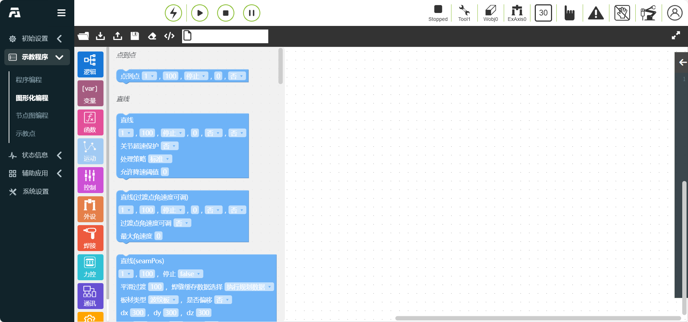
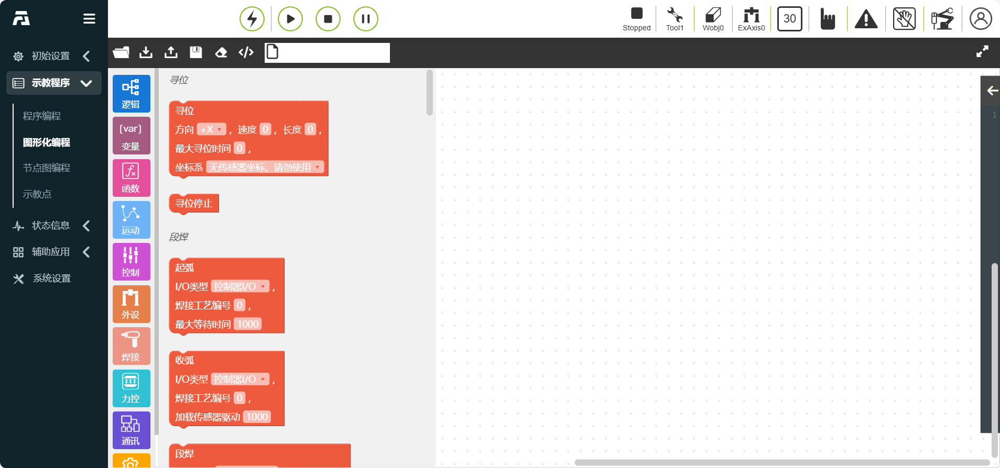
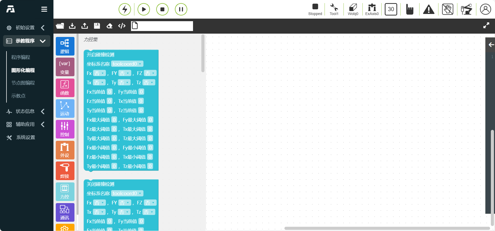
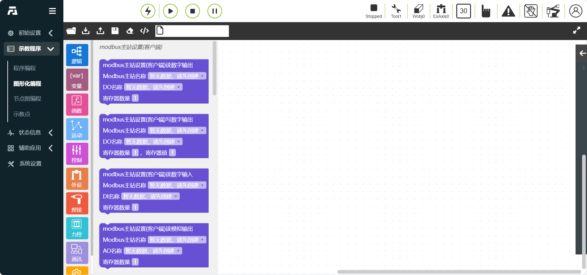

图形化编程
===============

.. toctree:: 
   :maxdepth: 6

图形化编程
------------------
由于示教器一般不会外接键鼠等外设，在示教器端访问机器人WebAPP时，用户可以通过图形化编程功能进行机器人示教程序编辑。功能标准化函数实现使用Blockly库，可以集成在WebAPP系统中，根据需要实现自定义代码块，并且拖拽编程完成后转换为LUA程序通过现有指令协议下发运行。

通过使用图形编程，能够做到简单易懂，易操作，语言汉化操作。

.. image:: graphical/001.png
   :width: 6in
   :align: center

.. centered:: 图表 10.1‑1 图形化编程界面

页面分为三个区域：“操作栏”、“toolbox工具栏”和“workspace代码编辑区”，整体的布局设计如图如下

.. centered:: 图表 10.1‑2 图形化编程页面布局整体设计

**操作栏**

1) “加载”按钮负责workspace的重新加载
2) “导入”按钮负责导入相关图形化编程程序
3) “导出”按钮负责导出已保存的工作区中的图形化编程程序“保存”按钮功能为代码块编辑完成后保存为对应的示教程序
4) “清空按钮”负责快速清空代码编辑区

**Toolbox**

1) 包含所有指令和逻辑代码的代码块，可以拖动到workspace创建代码块并编辑
2) Toolbox工具栏部分会根据指令类型进一步分类
3) 逻辑类指令：if-else，while等
4) 基础运动类指令：PTP，LIN，ARC等依据应用场景指令分类：涂胶，焊接，传送带等。在使用的过程中可以方便地找到所需代码块。

**Workspace**：在代码编辑区中可以编辑和展示图形化的代码块。

运动类图形化编程命令
~~~~~~~~~~~~~~~~~~~~~~~~~~
运动类图形化编程命令包含 PTP、Lin 、ARC等运动命令。

.. centered:: 图表 10.1‑3 运动类图形化编程

控制类图形化编程命令
~~~~~~~~~~~~~~~~~~~~~~~~~~
控制类图形化编程命令包含Wait、IO等控制命令。

.. centered:: 图表 10.1‑4 控制类图形化编程命令

高级类图形化编程命令
~~~~~~~~~~~~~~~~~~~~~~~~~~
高级类图形化编程命令包含dofile调用子程序、thread多线程、折叠指令等高级命令。

.. image:: graphical/005.png
   :width: 3in
   :align: center

.. centered:: 图表 10.1‑5 高级类图形化编程命令

图形化编程命令使用示例
-------------------------
选择图形化编程类型后，点击需要使用的图形代码块，即可在工作区进行拖拽和拼接操作。

例如选择PTP和Lin运动指令以及控制指令Waitms进行拼接，外层可嵌套一个折叠高级指令并输入注释名称，则可实现代码块折叠操作。其中点击下拉框可选择指令参数类型，输入框可填入指令参数数据。图形化编程命令示例如下：

.. centered:: 图表 10.2-1 图形化编程命令示例

图形化编程指令拼接和参数填入完成后，填写工作区名称，点击“保存”图标即可保存本次程序。选择编写完成的“工作区”，点击开始运行，即可执行本段程序。

图形化编程代码块模块化
~~~~~~~~~~~~~~~~~~~~~~~~~~
为了提高图形化编程代码可阅读性，增加了图形化编程代码块模块化功能，即高级指令：折叠指令代码块。

.. image:: graphical/007.png
   :width: 3in
   :align: center

.. centered:: 图表 10.2-2 折叠指令代码块

1.编写一段代码块指令，在外层添加折叠指令代码块，在输入框内编写该段指令的备注。

.. image:: graphical/008.png
   :width: 3in
   :align: center

.. centered:: 图表 10.2-3 折叠指令效果图

2.右键操作栏右击"折叠块"，该段指令代码块折叠，该代码块折叠成一行显示，且折叠下可正确执行程序

.. centered:: 图表 10.2-4 折叠后效果图

3.滚动鼠标，可实现页面缩放功能，具体效果如下：

.. centered:: 图表 10.2-5 页面缩放功能效果图

图形化编程同名覆盖
~~~~~~~~~~~~~~~~~~~~~~~~~~
在图形化编程页面，新建/加载文件后，更改工作区名称后点击保存。若更改的工作区名称文件已存在，则触发“示教点已存在”弹出框，如下图。

.. centered:: 图表 10.2-6 图形化编程程序覆盖

**Step1**：点击“取消”按钮，继续执行之前的操作。

**Step2**：点击“同步更新示教程序”复选框，再点击“覆盖”按钮，则当前图形化编程页面的lua程序覆盖更改后工作区文件名的lua程序。

图形化编程程序未保存验证
~~~~~~~~~~~~~~~~~~~~~~~~~~

在图形化编程页面，打开/新建程序后，若图形化编程程序发生改动未保存程序。

若点击“打开”文件操作，则触发“是否保存此程序”弹出框，提示“当前程序已发生改变，是否保存此程序的更改？”，如下图。

.. image:: graphical/012.png
   :width: 6in
   :align: center

.. centered:: 图表 10.2-7 当前页面程序未保存验证

**Step1**：点击“不保存”按钮，继续执行之前的“打开”文件操作。

**Step2**：点击“保存”按钮，未保存的lua程序保存成功，并继续执行之前的“打开”文件操作。

若离开图形化编程页面，切换到其他页面时，同样触发“是否保存此程序”提示，且仍然停留在当前图形化编程页面，如下图。

.. image:: graphical/013.png
   :width: 6in
   :align: center

.. centered:: 图表 10.2-8 切换页面程序未保存验证

**Step1**：点击“不保存”按钮，跳转到之前选择的页面。

**Step2**：点击“保存”按钮，未保存的lua程序保存成功，并跳转到之前选择的页面。若保存的程序名称已存在，提示示教点位已存在，是否覆盖。进行取消/覆盖操作后，跳转到之前选择的页面。