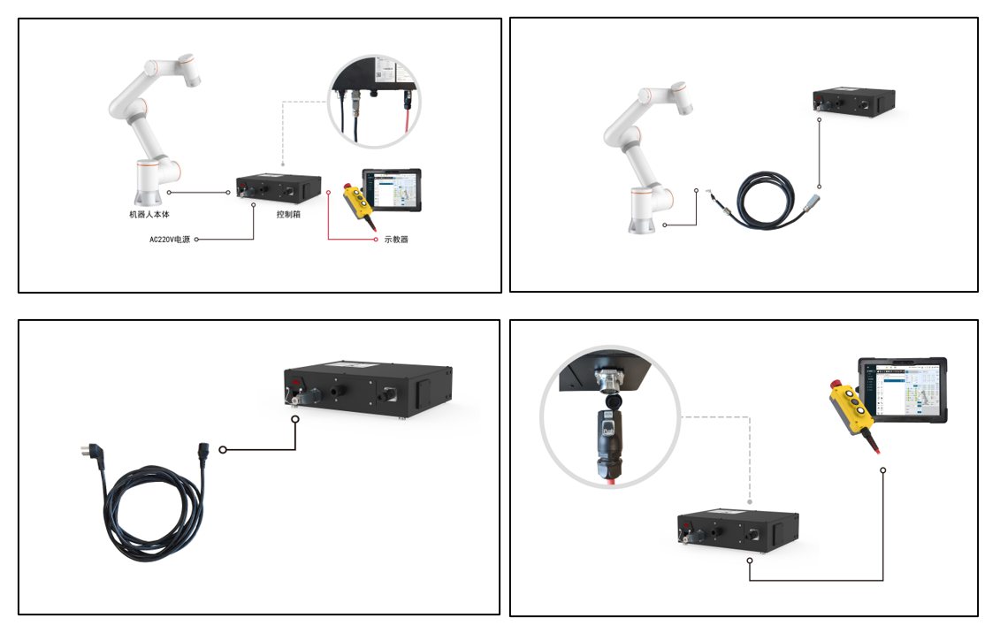
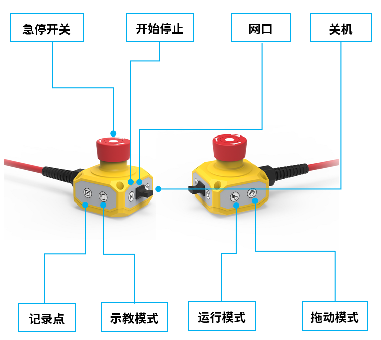

机器人安装上电
===================

.. toctree:: 
   :maxdepth: 6

安装机器人手臂
----------------

协作机器人安装在安装座上时，使用合规数量螺栓（强度不低于8.8级）将机器人拧紧固定在安装座上；建议安装座上使用两个合规销孔配合销钉进行机器人定位，以提高机器人安装精度，防止因为碰撞等使机器人发生移动。当机器人有较高运行精度要求时，请务必增加销钉对机器人进行定位。

.. centered:: 表格 1.1-1 机器人安装零件标准

.. list-table::
   :widths: 80 50 50 50
   :header-rows: 0
   :align: center

   * - **协作机器人型号**
     - **螺栓**
     - **螺栓扭矩**
     - **销孔规格**

   * - FR3
     - 4颗M6
     - ≥10Nm
     - φ5mm

   * - FR5
     - 4颗M8
     - ≥20Nm
     - φ8mm

   * - FR10
     - 4颗M8
     - ≥25Nm
     - φ8mm

   * - FR16
     - 4颗M8
     - ≥25Nm
     - φ8mm

   * - FR20
     - 6颗M10
     - ≥45Nm
     - φ8mm

   * - FR30
     - 6颗M10
     - ≥45Nm
     - φ8mm

.. important:: 
   推荐机器人安装座满足以下几个要求，以保证机器人安装牢固、稳定：
   
   （1）机器人安装座需要足够牢固且有足够的承载能力，应该至少能承载5倍的机器人重量，至少能承受10倍的1轴扭矩。

   （2）机器人安装座应表面平整，以保证与机器人接触面紧密接触；

   （3）机器人安装座应刚度足够强壮，固定牢固，不会和机器人发生共振；

   （4）机器人和其他部件同时运动时，安装座与其他运动部件应隔离开，不要固定在一起避免运动过程中的振动干扰；

   （5）如果机器人安装在移动平台或者外部轴上，移动平台或者外部轴的加速度应尽量低；

连接控制箱
----------------

本系列机器人可以配置三种不同电源输入的控制箱，控制箱电源输入信息详见控制箱铭牌信息。

机器人需要电气接地。机械手控制系统的外部连线均使用可插拔可快速安装的插头进行连接。

协作机器人接线面板如下图表：

.. centered:: 图表 1.2-1 控制箱接线面板

（1）30-60VDC
（2）176-264VAC~50-60Hz
（3）100-240VAC~50-60HZ

.. note:: 交流输入的控制箱区分窄电压和宽电压两个版本，控制箱接线端子和外形一致，单独通过外形不能区分，请通过控制箱铭牌进行确认，确认无误后再上电运行。

按钮盒接口默认为示教器控制端口，IP地址为192.168.58.2，使用网线连接按钮盒接口与电脑，电脑IP地址设为192.168.58.10或与之同一网段，打开谷歌浏览器输入192.168.58.2即可访问示教器页面。

认识按钮盒及末端LED
---------------------

按钮盒
~~~~~~~~~

.. centered:: 图表 1.3-1 控制箱接线面板

.. centered:: 表格 1.3-1 控制箱接线面板按键说明

.. list-table::
   :widths: 50 200
   :header-rows: 0
   :align: center

   * - **按键名**
     - **功能**

   * - 急停开关
     - 当按下急停开关，机器人进入紧急停止状态

   * - 开始停止
     - 开始/停止运行程序

   * - 网口
     - 连接web示教器

   * - 关机
     - 暂未启用

   * - 记录点
     - 记录示教点

   * - 示教模式
     - 进入/退出搭配示教器状态

   * - 运行模式
     - 自动/手动模式切换

   * - 拖动模式
     - 进入/退出拖动模式

末端LED
~~~~~~~~~

.. centered:: 表格 1.3-2 末端LED定义

.. list-table::
   :widths: 120 100
   :header-rows: 0
   :align: center

   * - **功能**
     - **LED颜色**

   * - 通信未建立时
     - “灭”“红”“绿”“蓝”交替

   * - 自动模式
     - 蓝色长亮

   * - 手动模式
     - 绿色长亮

   * - 拖动模式
     - 白青色长亮

   * - 按钮盒记录点（仅在使用按钮盒时）
     - 紫色闪烁两下

   * - 进入未搭配按钮盒状态（仅在使用按钮盒时）
     - 青蓝色闪烁两下

   * - 开始运行（仅在使用按钮盒时）
     - 蓝色闪烁两下

   * - 停止运行（仅在使用按钮盒时）
     - 红色闪烁两下

   * - 报错（仅在使用按钮盒时）
     - 红色长亮

   * - 校零完成
     - 白青色闪烁三下

   * - 去使能
     - 黄色闪烁两下

上电使能
----------------

上电前，请确认按钮盒急停按钮处理松开状态，按下控制箱红色开关按钮上电，使能成功后末端LED灯处于绿色常亮状态。
