硬件安装
===================

.. toctree:: 
	:maxdepth: 5

安全须知
------------

简介
~~~~~

本说明书会使用到以下警示，这些警示的作用是确保人身及设备的安全，当您在阅读本说明书时，必须遵守并执行本手册其他章节中的所有组装说明和指南，这一点非常重要。应特别注意与警告标志相关的文本。

.. important:: 
    - 如果机器人（机器人本体、控制箱、示教器或按钮盒）因人为原因被损坏、更改或修改，法奥意威拒绝承担所有责任；
    - 法奥意威对由于客户编写的程序出错而对机器人或任何其他设备造成的任何损坏概不负责。

人员安全
~~~~~~~~~~~~~~~~~~~~~~~~~~~~~

在运行机器人系统时，首先必须要确保作业人员的安全，下面列出一般性的注意事项，请妥善采取确保作业人员安全的相应措施。

1. 使用机器人系统的各作业人员，应通过法奥意威（苏州）机器人系统有限公司主办的培训课程接受培训。用户需确保其充分掌握安全、规范的操作流程，具备机器人操作资格。培训详情请向我公司查询，邮箱为 jiling@frtech.fr。

2. 使用机器人系统的各作业人员请不要穿宽松的衣服，不要佩戴珠宝。操作机器人时请确保长头发束在脑后。

3. 在设备运转之中，即使机器人看上去已经停止，也有可能是因为机器人在等待启动信号而处在即将动作的状态。即使在这样的状态下，也应该将机器人视为正在动作中。

4. 应在地板上画上线条来标清机器人的动作范围，使操作者了解机器人包含握持工具（机械手、工具等）的动作范围。

5. 确保在机器人操作区域附近建立安全措施（例如，护栏、绳索、或防护屏幕），保护操作者及周边人群。应根据需要设置锁具，使得负责操作的作业人员以外者不能接触机器人电源。

6. 在使用操作面板和示教器时，由于戴上手套可能会出现操作上的失误，务必在摘下手套后进行作业。

7. 在人被机器人夹住或围在里面等紧急和异常情况下，通过用力（至少700 N）推动或拉动机器人手臂，迫使关节移动。无电力驱动情况下手动移动机器人手臂仅限于紧急情况，并且可能会损坏关节。

危险识别
~~~~~~~~~~~~~~~~~~~~~~~~~~~~~~~

风险评估应考虑正常使用期间操作人员与机器人之间所有潜在的接触以及可预见的误操作。操作人员的颈部、脸部和头部不应暴露，以免发生碰触。在不使用外围安全防护装置的情况下使用机器人需要首先进行风险评估，以判断相关危险是否会构成不可接受的风险，例如

-  使用尖锐的末端执行器或工具连接器可能存在危险；

-  处理毒性或其他有害物质可能存在危险；

-  操作人员手指有被机器人底座或关节夹住的危险；

-  被机器人碰撞发生的危险；

-  机器人或连接到末端的工具固定不到位存在的危险；

-  机器人有效负载与坚固表面之间的冲击造成的危险。

集成商必须通过风险评估来衡量此类危险及其相关的风险等级，并且确定和实施相应的措施，以将风险降低至可接受的水平。请注意，特定机器人设备可能还存在其他重大危险。

通过将FR机器人所应用的固有安全设计措施与集成商和最终用户所实施的安全规范或风险评估相结合，将与FR协作性操作相关的风险尽可能降低至合理可行的水平。通过此文档可将机器人在安装前存在的任何剩余风险传达给集成商和最终用户。如果集成商的风险评估测定其特定应用中存在可能对用户构成不可接受风险的危险，集成商必
须采取适当的风险降低措施，以消除或最大限度降低这些危险，直至将风险降低至可接受的水平为止。在采取适当的风险降低措施（如有需要）之前使用是不安全的。

如果对机器人进行非协同性安装（例如，当使用危险工具时），风险评估可能推断集成商需要在其编程时连接额外的安全设备（例如，安全启动设备）确保人员及设备安全。

铭牌信息
~~~~~~~~~~~~~~

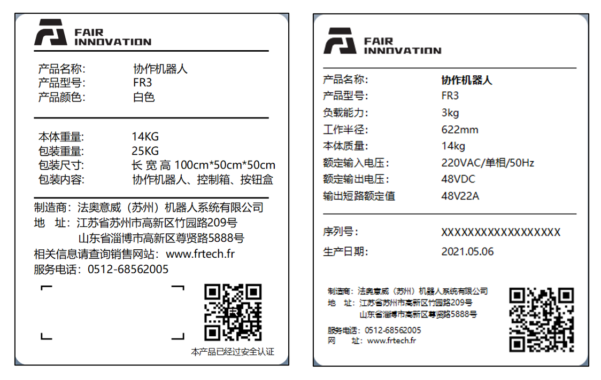

.. centered:: 图表 3.1-1 FR3型号协作机器人

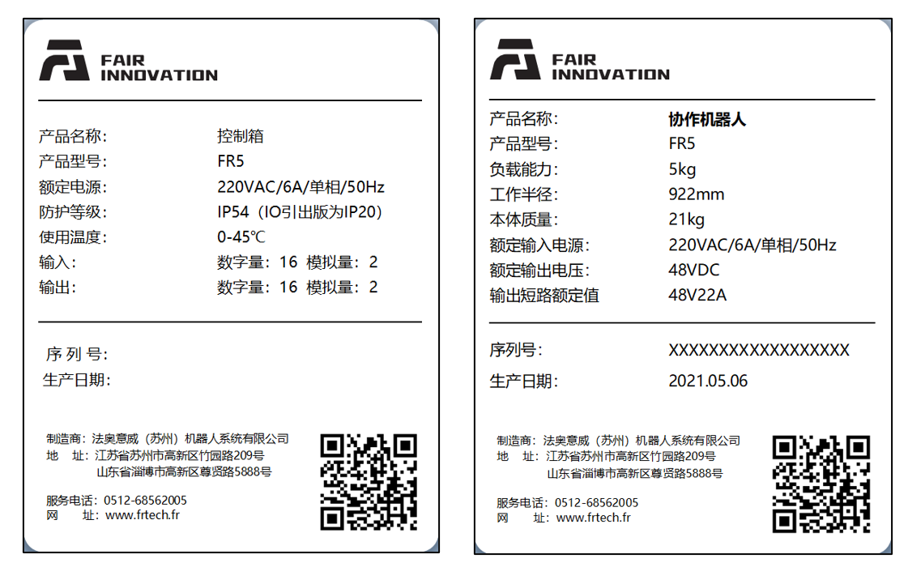

.. centered:: 图表 3.1-2 FR5型号协作机器人

.. centered:: 图表 3.1-3 FR10型号协作机器人

.. centered:: 图表 3.1-4 FR16型号协作机器人

.. figure:: installation/006.png
	:align: center
	:width: 6in

.. centered:: 图表 3.1-5 FR20型号协作机器人

有效性和责任
~~~~~~~~~~~~~~~~

本手册中的信息不包含设计、安装和操作一个完整的机器人应用，也不包含所有可能对这一完整的系统的安全造成影响的周边设备。该完整系统的设计和安装需符合该机器人安装所在国的标准和规范中确立的安全要求。

法奥意威的集成商有责任确保遵循相关国家的法律法规，确保完整的机器人应用中不存在任何重大危险。这包括但不限于以下内容：

-  对完整的机器人系统做一个风险评估

-  将风险评估定义的其他机械和附加安全设备连接在一起

-  在软件中建立适当的安全设置

-  确保用户不会对任何安全措施加以修改

-  确认整个机器人系统的设计和安装准确无误

-  明确使用说明

-  在机器人上标明集成商的相关标志和联系信息

-  收集技术文件中的所有文档，包括本手册

责任有限
~~~~~~~~~~~~~~

本手册所包含的任何安全信息都不得视为通用的机器人安全保证，即使遵守所有安全说明，依然有可能引起人员伤害或设备损坏。

该手册中的警告标志
~~~~~~~~~~~~~~~~~~~~~~~~~~~~~

下面的标志定义了本手册中所包含的危险等级规定说明。产品上也使用了同样的警告标志。

.. important:: 
	.. figure:: installation/008.png
		:width: 60
		:height: 50
		:align: left

	危险：这指的是即将引发危险的用电情况，如果不避免，可导致人员死亡或严重伤害。

.. important:: 
	.. figure:: installation/009.png
		:width: 60
		:height: 50
		:align: left

	触电危险：这指的是即将引发危险的触电情况，如果不避免，可导致人员触电死亡或严重伤害。

.. important:: 
	.. figure:: installation/010.png
		:width: 60
		:height: 50
		:align: left

	烫伤危险：这指的是可能引发危险的热表面，如果不避免接触了，可造成人员伤害。
	

使用前评估
~~~~~~~~~~~~~~~

首次使用机器人或进行任何修改之后，机器人默认速度低于250mm/s，请勿登录管理员修改速度进入高速模式，之后必须进行以下测试。确认所有安全输入和输出是正确的，并且连接正确。测试所有连接的安全输入和输出（包括多台机器或机器人共有的设备）是否功能正常。因此您必须：

-  测试紧急停止按钮和输入是否可以停止机器人并启动刹车。

-  测试防护输入是否可以停止机器人的运动。如果配置了防护重置，请在恢复运动之前检查是否需要激活。

-  测试操作模式是否可以切换操作模式，参见用户界面右上角的图标。

-  测试3 档位使动装置是否必须按下才能在手动模式下启动动作，并且机器人处于减速控制下（机器人软件版本V3.0前不支持该功能）。

-  测试系统紧急停止输出是否能够将整个系统带到安全状态。

紧急停止
~~~~~~~~~~~~~~

紧急停止按钮为0类停机，按下紧急停止按钮，立即停止机器人的一切运动。

下表显示触发0类停机的停止距离和停止时间。这些测量结果对应于机器人的以下配置：

-  延伸：100%（机器人手臂完全水平展开）

-  速度：100%（机器人一般速度设为100%，以180°/s的关节速度移动）

-  有效负载：最大有效负载

关节1，关节6测试机器人水平移动，旋转轴垂直于地面。关节2，关节3，关节4，关节5测试机器人遵循垂直轨迹，旋转轴平行于地面，并在机器人向下移动时停止。

.. centered:: 表格 3.1-1 0类停止距离(rad)
.. list-table::
   :widths: 10 15 15 15 15 15 15
   :header-rows: 0
   :class: sheet-center

   * - 
     - **关节1**
     - **关节2**
     - **关节3**
     - **关节4**
     - **关节5**
     - **关节6**

   * - **FR3**
     - 0.47
     - 0.60
     - 0.56
     - 0.29
     - 0.10
     - 0.06

   * - **FR5**
     - 0.51
     - 0.63
     - 0.60
     - 0.33
     - 0.16
     - 0.10

   * - **FR10**
     - 0.64
     - 0.70
     - 0.69
     - 0.42
     - 0.25
     - 0.13

   * - **FR16**
     - 0.60
     - 0.67
     - 0.65
     - 0.39
     - 0.22
     - 0.12

   * - **FR20**
     - 0.69
     - 0.75
     - 0.80
     - 0.48
     - 0.31
     - 0.22

.. centered:: 表格 3.1-2 0类停止时间(ms)
.. list-table::
   :widths: 10 15 15 15 15 15 15
   :header-rows: 0
   :class: sheet-center

   * - 
     - **关节1**
     - **关节2**
     - **关节3**
     - **关节4**
     - **关节5**
     - **关节6**

   * - **FR3**
     - 400
     - 470
     - 450
     - 280
     - 120
     - 90

   * - **FR5**
     - 420
     - 500
     - 480
     - 310
     - 150
     - 120

   * - **FR10**
     - 460
     - 540
     - 510
     - 330
     - 170
     - 140

   * - **FR16**
     - 440
     - 530
     - 490
     - 320
     - 160
     - 130

   * - **FR20**
     - 540
     - 600
     - 700
     - 400
     - 260
     - 170

紧急停止后，关闭电源，旋转紧急停止按钮，打开电源即可重新启动机器人。

同时机器人安全停止和软限位停止的停止时间和停止距离，见下表。这些测量结果对应于机器人的以下配置：

-  延伸：100%（机器人手臂完全水平展开）

-  速度：100%（机器人一般速度设为100%，以180°/s的关节速度移动）

-  有效负载：最大有效负载

关节1，关节6测试机器人水平移动，旋转轴垂直于地面。关节2，关节3，关节4，关节5测试机器人遵循垂直轨迹，旋转轴平行于地面，并在机器人向下移动时停止。

.. centered:: 表格 3.1-3 安全停止距离(rad)
.. list-table::
   :widths: 10 15 15 15 15 15 15
   :header-rows: 0
   :class: sheet-center

   * - 
     - **关节1**
     - **关节2**
     - **关节3**
     - **关节4**
     - **关节5**
     - **关节6**

   * - **FR3**
     - 0.49
     - 0.63
     - 0.58
     - 0.32
     - 0.12
     - 0.09

   * - **FR5**
     - 0.54
     - 0.65
     - 0.63
     - 0.35
     - 0.19
     - 0.12

   * - **FR10**
     - 0.66
     - 0.73
     - 0.71
     - 0.45
     - 0.27
     - 0.14

   * - **FR16**
     - 0.63
     - 0.69
     - 0.68
     - 0.41
     - 0.25
     - 0.14

   * - **FR20**
     - 0.71
     - 0.78
     - 0.82
     - 0.51
     - 0.33
     - 0.25

.. centered:: 表格 3.1-4 安全停止时间(ms)
.. list-table::
   :widths: 10 15 15 15 15 15 15
   :header-rows: 0
   :class: sheet-center

   * - 
     - **关节1**
     - **关节2**
     - **关节3**
     - **关节4**
     - **关节5**
     - **关节6**

   * - **FR3**
     - 410
     - 490
     - 410
     - 300
     - 130
     - 110

   * - **FR5**
     - 450
     - 520
     - 510
     - 330
     - 180
     - 140

   * - **FR10**
     - 480
     - 570
     - 530
     - 360
     - 190
     - 170

   * - **FR16**
     - 470
     - 550
     - 520
     - 340
     - 190
     - 150

   * - **FR20**
     - 560
     - 630
     - 720
     - 430
     - 280
     - 200

.. centered:: 表格 3.1-5 软限位停止距离(rad)
.. list-table::
   :widths: 10 15 15 15 15 15 15
   :header-rows: 0
   :class: sheet-center

   * - 
     - **关节1**
     - **关节2**
     - **关节3**
     - **关节4**
     - **关节5**
     - **关节6**

   * - **FR3**
     - 0.52
     - 0.65
     - 0.61
     - 0.34
     - 0.15
     - 0.11

   * - **FR5**
     - 0.56
     - 0.68
     - 0.65
     - 0.38
     - 0.21
     - 0.15

   * - **FR10**
     - 0.69
     - 0.75
     - 0.74
     - 0.47
     - 0.30
     - 0.18

   * - **FR16**
     - 0.65
     - 0.72
     - 0.70
     - 0.44
     - 0.27
     - 0.17

   * - **FR20**
     - 0.74
     - 0.80
     - 0.85
     - 0.53
     - 0.36
     - 0.27

.. centered:: 表格 3.1-6 软限位停止时间(ms)
.. list-table::
   :widths: 10 15 15 15 15 15 15
   :header-rows: 0
   :class: sheet-center

   * - 
     - **关节1**
     - **关节2**
     - **关节3**
     - **关节4**
     - **关节5**
     - **关节6**

   * - **FR3**
     - 430
     - 500
     - 430
     - 310
     - 150
     - 120

   * - **FR5**
     - 460
     - 540
     - 520
     - 350
     - 190
     - 160

   * - **FR10**
     - 500
     - 580
     - 550
     - 370
     - 210
     - 180

   * - **FR16**
     - 480
     - 570
     - 530
     - 360
     - 200
     - 170

   * - **FR20**
     - 580
     - 640
     - 740
     - 440
     - 300
     - 210

.. important:: 
	根据IEC 60204-1 和ISO 13850，紧急停止设备不是安全防护装置。它们是补充性防护措施，并不用于防止伤害。

无电力驱动的移动
~~~~~~~~~~~~~~~~~~~~~~~~~~~~

如果发生必须移动机器人关节但无法为机器人供电或者其他紧急情况，请联系机器人经销商，必要时可以使用暴力手段强制移动机器人以解救被困人员。

设备运输
---------

运输
~~~~~~

机器人和控制箱已作为成套设备校准。请勿将它们分开，那样将需要重新校准。

只能将机器人放在原包装中运输。如果今后要搬运机器人的话，请将包装材料保存在干燥处。

将机器人从包装移动到安装空间时，同时托住机器人的两个臂体。扶住机器人直至机器人机座的所有安装螺栓全部紧固好。

搬运
~~~~~~

协作机器人根据型号不同，总质量（含包装）范围在15kg-80 kg，当人力对协作机器人进行搬运或转移时，需要多人协助抬起，不推荐单人搬运，在运输过程中务必平稳，避免设备倾翻或者滑落。

.. warning:: 
	- 若采用专业设备进行搬运，请务必由具有相应操作资格的专业人员使用吊车或者叉车对协作机器人进行运输或者搬运，否则有可能会引起人员伤害或者其他事故。
	- 若采用人工搬运，请注意搬运途中人身安全；
	- 协作机器人包含精密零部件，在运输或者搬运过程中应该避免剧烈的振动或者晃动，否则有可能降低设备的性能。

存放
~~~~~~~

协作机器人应在-25~60℃，无凝霜环境下存放。

维护、报废处理
--------------

维护处置
~~~~~~~~~~~~~~

请用户间隔1个月对急停和保护性停止进行检测。判断安全功能是否有效。

急停和保护性停止接线请参考接线章节。

废弃处置
~~~~~~~~~~~~~~

FR机器人需要根据适用的国家法律法规及国家标准处置，详情可联系厂商。

安装规范
----------

机器人手臂安装
~~~~~~~~~~~~~~~~~

.. important:: 
	推荐机器人安装座满足以下几个要求，以保证机器人安装牢固、稳定：
   
   	（1）机器人安装座需要足够牢固且有足够的承载能力，应该至少能承载5倍的机器人重量，至少能承受10倍的1轴扭矩。

	（2）机器人安装座应表面平整，以保证与机器人接触面紧密接触；

	（3）机器人安装座应刚度足够强壮，固定牢固，不会和机器人发生共振；

	（4）机器人和其他部件同时运动时，安装座与其他运动部件应隔离开，不要固定在一起避免运动过程中的振动干扰；

	（5）如果机器人安装在移动平台或者外部轴上，移动平台或者外部轴的加速度应尽量低；

.. warning:: 
	应该避免以下安装方式：

	（I）避免将机器人固定在其它运动设备上

	.. figure:: installation/064.png
		:align: center
		:width: 3in

	.. centered:: 图表 3.4-1 避免安装在其它运动设备上

	确保机器人手臂正确并安全地安装到位。安装不稳定会导致事故。

.. note:: 
	可以采购精确的基座作为附件来使用。图表3.4-2、3.4-5、3.4-8、3.4-11 显示了销孔位置和螺丝安装位置。

FR3机器人手臂安装要求
++++++++++++++++++++++++

机器人安装在安装座上时，使用4颗强度不低于8.8级的M6螺栓将机器人固定在安装座上，螺栓须使用不少于10Nm扭矩拧紧；建议安装座上使用两个φ5mm销孔配合销钉进行机器人定位，以提高机器人安装精度，防止因为碰撞等使机器人发生移动。当机器人有较高运行精度要求时，请务必增加销钉对机器人进行定位。

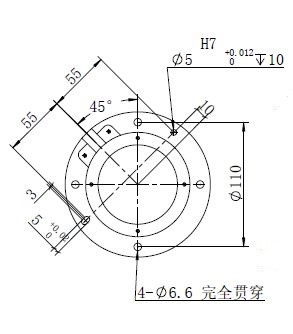

.. centered:: 图表 3.4-2 FR3型号协作机器人安装尺寸

.. important:: 
	根据不同的应用场景推荐几款机器人安装底座如下：

	（I）针对运动速度不太快，运行速度不太大，精度要求一般，且不方便固定在地面上的场合，推荐机器人安装底座如下：

	.. figure:: installation/062.png
		:align: center
		:width: 3in

	.. centered:: 图表 3.4-3 FR3型号协作机器人低要求安装底座

	（II）针对运动速度较快，运行速度较大，精度要求较高的场合，推荐机器人安装底座如下，并将机器人固定在牢固的地面上：

	.. figure:: installation/067.png
		:align: center
		:width: 3in

	.. centered:: 图表 3.4-4 FR3型号协作机器人高要求安装底座

FR5机器人手臂安装要求
++++++++++++++++++++++++++++

机器人安装在安装座上时，使用4颗强度不低于8.8级的M8螺栓将机器人固定在安装座上，螺栓须使用不少于20Nm扭矩拧紧；建议安装座上使用两个φ8mm销孔配合销钉进行机器人定位，以提高机器人安装精度，防止因为碰撞等使机器人发生移动。当机器人有较高运行精度要求时，请务必增加销钉对机器人进行定位。

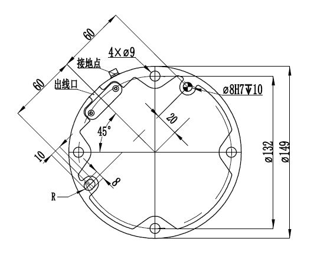

.. centered:: 图表 3.4-5 FR5型号协作机器人安装尺寸

.. important:: 
	根据不同的应用场景推荐几款机器人安装底座如下：

	（I）针对运动速度不太快，运行速度不太大，精度要求一般，且不方便固定在地面上的场合，推荐机器人安装底座如下：

	.. figure:: installation/062.png
		:align: center
		:width: 3in

	.. centered:: 图表 3.4-6 FR5型号协作机器人低要求安装底座

	（II）针对运动速度较快，运行速度较大，精度要求较高的场合，推荐机器人安装底座如下，并将机器人固定在牢固的地面上：

	.. figure:: installation/067.png
		:align: center
		:width: 3in

	.. centered:: 图表 3.4-7 FR5型号协作机器人高要求安装底座

FR10、FR16机器人手臂安装要求
+++++++++++++++++++++++++++++++

机器人安装在安装座上时，使用4颗强度不低于8.8级的M8螺栓将机器人固定在安装座上，螺栓须使用不少于25Nm扭矩拧紧；建议安装座上使用两个φ8mm销孔配合销钉进行机器人定位，以提高机器人安装精度，防止因为碰撞等使机器人发生移动。当机器人有较高运行精度要求时，请务必增加销钉对机器人进行定位。

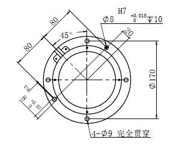

.. centered:: 图表 3.4-8 FR10、FR16型号协作机器人安装尺寸
	
.. important:: 
	根据不同的应用场景推荐几款机器人安装底座如下：

	（I）针对运动速度不太快，运行速度不太大，精度要求一般，且不方便固定在地面上的场合，推荐机器人安装底座如下：

	.. figure:: installation/065.png
		:align: center
		:width: 3in

	.. centered:: 图表 3.4-9 FR10、FR16型号协作机器人低要求安装底座

	（II）针对运动速度较快，运行速度较大，精度要求较高的场合，推荐机器人安装底座如下，并将机器人固定在牢固的地面上：

	.. figure:: installation/067.png
		:align: center
		:width: 3in

	.. centered:: 图表 3.4-10 FR10、FR16型号协作机器人高要求安装底座

FR20、FR30机器人手臂安装要求
+++++++++++++++++++++++++++++++

机器人安装在安装座上时，使用6颗强度不低于8.8级的M10螺栓将机器人固定在安装座上，螺栓须使用不少于45Nm扭矩拧紧；建议安装座上使用两个φ8mm销孔配合销钉进行机器人定位，以提高机器人安装精度，防止因为碰撞等使机器人发生移动。当机器人有较高运行精度要求时，请务必增加销钉对机器人进行定位。

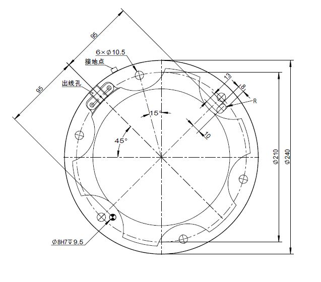

.. centered:: 图表 3.4-11 FR20、FR30型号协作机器人安装尺寸

.. important:: 

	因为FR20和FR30机器人自重较大及运行惯量较大，建议直接固定在地面上使用。推荐底座如下：

	.. figure:: installation/066.png
		:align: center
		:width: 3in

	.. centered:: 图表 3.4-12 FR20、FR30型号协作机器人安装底座

工具末端安装
~~~~~~~~~~~~~~~~

机器人工具法兰有四个M6螺纹孔，可用于将工具连接到机器人。M6螺栓必须使用8Nm的扭矩拧紧，其强度等级不低于8.8级。为了准确地重新定位工具，请在预留的Ø6销孔中使用销钉。

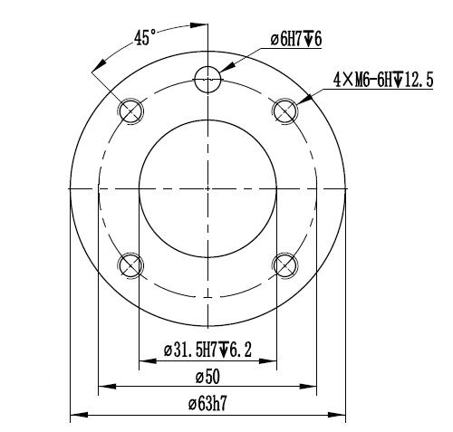

.. centered:: 图表 3.4-13 FR3/FR5/FR10/FR16型号机器人末端法兰图纸

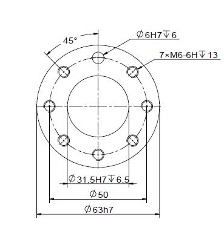

.. centered:: 图表 3.4-14 FR20/FR30型号机器人末端法兰图纸

.. important:: 
	- 确保工具正确并安全地安装到位。
	- 确保工具安全架构，不会有零件意外坠落造成危险。
	- 在机器人上法兰上安装长度超过8毫米的M6螺栓可能会破坏工具法兰并造成无法修复的损坏，从而导致必须更换工具法兰。

安装环境
~~~~~~~~~~~~~~

在安装及使用协作机器人时，确保满足以下要求：

-  环境温度0-45℃

-  湿度20-80RH不结露

-  无机械冲击和震动

-  海拔要求2000m以下

-  无腐蚀性气体，无液体，无爆炸性气体，无油污，无盐雾，无尘埃或金属粉末，无放射性材料，无电磁噪声，无易燃物品

-  避免设备在电流的不稳定条件下工作

-  用户需要在机器人电源前增加不小于10A/250V关断能力的空气开关。

.. note:: 
	如果要将协作机器人吊装或者装到竖直面时，请联系我们。

地板承载能力
~~~~~~~~~~~~~~~~

将机器人安装在一个坚固的表面，该表面应足以承受至少5倍的机器人手臂的重量，而且该表面不能有震动。

最大有效载荷
~~~~~~~~~~~~~~~~

机器人手臂的最大允许有效载荷取决于重心偏移。当负载重心距离变远，机器人承受的负载会变小。

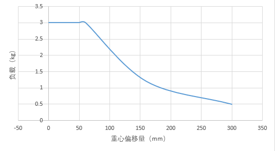

.. centered:: 图表 3.4-15 FR3型号协作机器人负载曲线

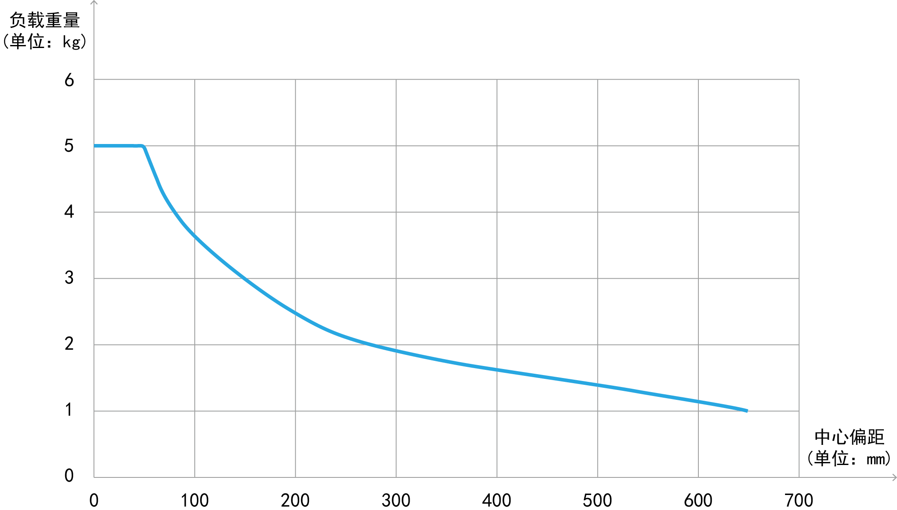

.. centered:: 图表 3.4-16 FR5型号协作机器人负载曲线

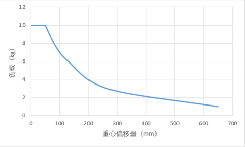

.. centered:: 图表 3.4-17 FR10型号协作机器人负载曲线

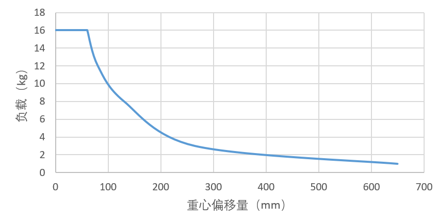

.. centered:: 图表 3.4-18 FR16型号协作机器人负载曲线

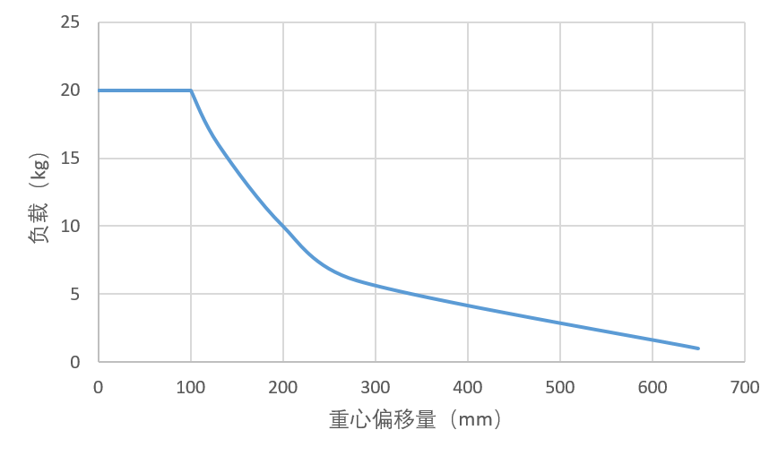

.. centered:: 图表 3.4-19 FR20型号协作机器人负载曲线

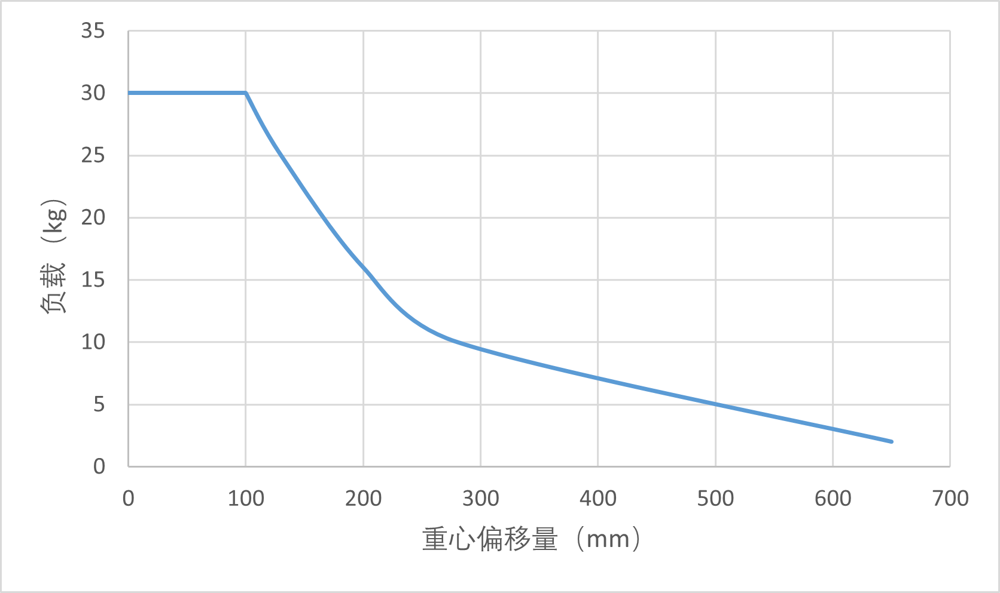

.. centered:: 图表 3.4-20 FR30型号协作机器人负载曲线

控制连接
----------

控制器接口
~~~~~~~~~~~~~~~

本系列机器人采用TN-S单相220V交流电源供电，设备自带5米电源线，三脚插头端插入现场提供的交流220V插座，机器人电气接地。

-  额定输入电压：6A/220VAC

-  额定输出电压：48V/21A

-  相数：单相

-  频率：50Hz

-  输出短路额定值：48V/22A

.. warning:: 
	在接线前，请务必确保电源处于关闭状态，并在旁边挂放安全警示牌。

本系列机械手控制系统的外部连线均使用可插拔可快速安装的插头进行连接。协作机器人接线面板如下图所示。

-  确保控制箱电源按钮关闭情况下（按钮打到0）将220V电源线接到电源插口(满载输入电压为6A/220VAC~7A/210VAC)

-  将机器人本体重载线缆连接到控制箱重载接口

-  将按钮盒航空插头插到控制箱示教器接口

-  控制箱两侧散热口，间隔距离不少于15CM

-  控制箱正面（用户钣金，开关电源键、重载与示教器线束）处，间隔距离不少于25CM

-  控制箱距离地面0.6-1.5m

-  不允许用户自行更换电源线缆

.. figure:: installation/037.png
	:align: center
	:width: 6in

.. centered:: 图表 3.5-1 机器人接线示意图

控制器I/O面板
~~~~~~~~~~~~~~~~~~~~~~~~~~~~

您可以使用控制箱内的I/O 来控制各种设备，包括气动继电器、PLC 和紧限位装置止按钮。图表3.5-2显示了控制箱的电气接口组，图表3.5-3显示了易制造控制箱的电气接口组。

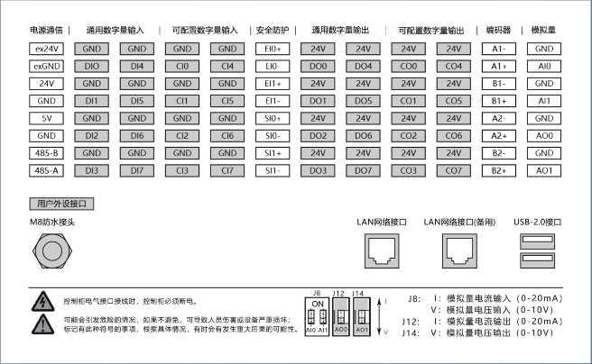

.. centered:: 图表 3.5-2 控制箱电气接口示意图

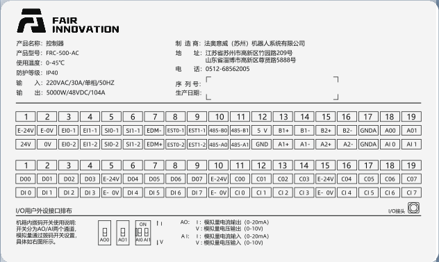

.. centered:: 图表 3.5-3 易制造控制箱电气接口示意图

RJ45网络接口组
~~~~~~~~~~~~~~~~~~~~~~~~~~~~~

控制箱内的网络接口组地址如下图所示，注意该图与控制箱内部网口地址顺序对应，机器人默认端口禁止插拔。用户网口可以用来与相机等设备通信，IP地址为192.168.57.2。按钮盒接口默认为示教器控制端口，IP地址为192.168.58.2，使用网线连接按钮盒接口与电脑，电脑IP地址设为192.168.58.10或与之同一网段，打开谷歌浏览器输入192.168.58.2即可访问示教器页面。易制造控制箱通过连接按钮盒的网口，访问示教器页面。

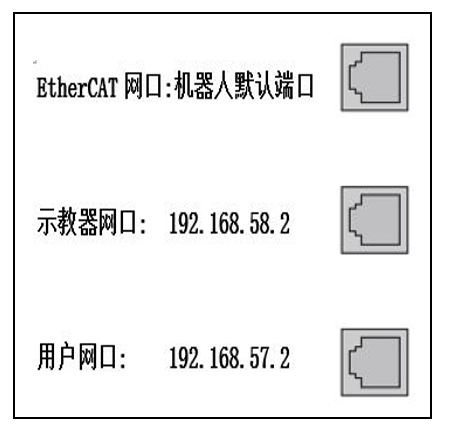

.. centered:: 图表 3.5-4 网络接口组示意图

末端板
~~~~~~~~~~~~~

您可以使用末端板的I/O和485通讯接口来控制各种设备，包括气动继电器、PLC和紧急停止按钮。Pin脚分布及其pin脚说明如下图所示。I/O连接器型号为M12连接器8芯母头。

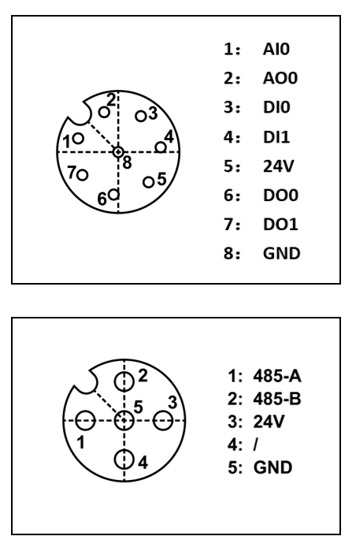

.. centered:: 图表 3.5-5 末端版电气接口示意图

接地说明
~~~~~~~~~~~~~~

1. 控制箱接地位于电源开关左上方M4组合螺钉处，如下图所示。

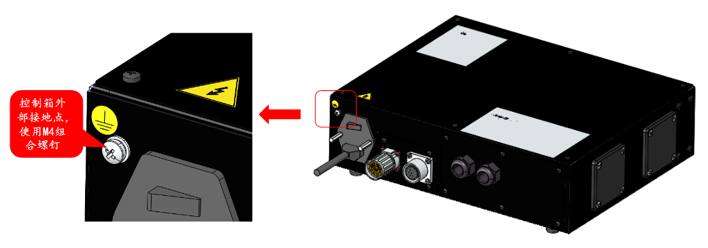

.. centered:: 图表 3.5-6 控制箱接地示意图

1. 本体接地位于基座出线处的右侧位置，如下图所示。

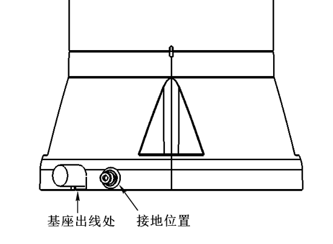

.. centered:: 图表 3.5-7 本体接地示意图

单独使用的保护导线，截面积不应小于：

- 2.5mm\ :sup:`2` 铜或16mm\ :sup:`2` 铝，如果提供机械损伤防护（导线管、管道等）
- 4mm\ :sup:`2` 铜或16mm\ :sup:`2` 铝，如果没有提供机械损伤防护

所有数字I/O 的通用规范
~~~~~~~~~~~~~~~~~~~~~~~~~~~~~~~~~~~~~~~~~~~

本节规定了下列控制箱24伏数字输入/输出的电气规范：

-  安全I/O

-  通用数字量I/O

机器人必须按照电气规范进行安装。

通过配置“电源通讯”接口，可以使用内部或外部24V电源为数字I/O供电。该接口中上面两个端子（ex24V和exon）为外部电源的24V和地，下面两个端子（24V和GND）为内部电源的24V和地。默认配置是使用内部电源，如下图所示。

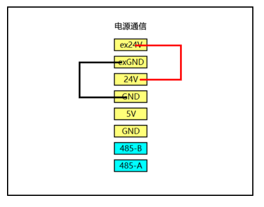

.. centered:: 图表 3.5-8 电源通信示意图01

如果负载功率较大，可以按如下图连接外部电源。

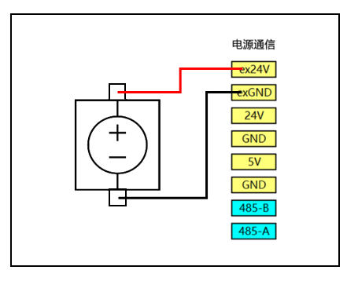

.. centered:: 图表 3.5-9 电源通信示意图02

内部和外部电源的电气规格如下表格所示：

.. centered:: 表格 3.5-1 内外部电源电气规格
.. list-table::
   :widths: 30 20 10 10 10 10
   :header-rows: 0
   :align: center

   * - **端子**
     - **参数**
     - **最小值**
     - **典型值**
     - **最大值**
     - **单位**

   * - | 内部24V电源
       | [ex24V -exGND]
       | [ex24V -exGND]
     - | 
       | 电压
       | 电流
     - | 
       | 23
       | 0
     - | 
       | 24
       | -
     - | 
       | 25
       | 2
     - | 
       | V
       | A

   * - | 内部24V电源
       | [24V- GND]
       | [24V- GND]
     - | 
       | 电压
       | 电流
     - | 
       | 23
       | 0
     - | 
       | 24
       | -
     - | 
       | 25
       | 1.5
     - | 
       | V
       | A

数字量I/O的电气规格如下表格所示：

.. centered:: 表格 3.5‑2 数字量I/O电气规格
.. list-table::
   :widths: 30 20 10 10 10 10
   :header-rows: 0
   :align: center

   * - **端子**
     - **参数**
     - **最小值**
     - **典型值**
     - **最大值**
     - **单位**

   * - | 数字量输出
       | [COx/DOx]
       | [COx/DOx]
       | [COx/DOx]
     - | 
       | 电流
       | 压降
       | 漏电流
     - | 
       | 0
       | 0
       | 0
     - | 
       | -
       | -
       | -
     - | 
       | 1
       | 0.5
       | 0.1
     - | 
       | A
       | V
       | mA

   * - [COx/DOx]
     - 功能
     - | -
     - NPN
     - | -
     - Type

   * - | 数字量输入
       | [EIx/SIx/CIx/DIx]
       | [EIx/SIx/CIx/DIx]
       | [EIx/SIx/CIx/DIx]
     - | 
       | OFF
       | ON
       | 电流(11~30A)
     - | 
       | -3
       | 11
       | 2
     - | 
       | -
       | -
       | -
     - | 
       | 5
       | 30
       | 15
     - | 
       | V
       | V
       | mA

   * - [EIx/SIx/CIx/DIx]
     - 功能
     - | -
     - NPN
     - | -
     - Type

安全I/O
~~~~~~~~~~~~~~~

本节描述了安全I/O的电气规范，必须遵守第3.5.6节中的通用电气规范。

安全装置和设备必须按照安全说明和风险评估进行安装，见第3.1。所有安全I/O都是成对的（冗余），必须作为两个独立的分支保存。单一故障不应导致安全功能丧失。

安全I/O包括紧急停止和安全停止。紧急停止输入仅用于紧急停止设备，安全停止输入用于各种安全相关保护设备。功能差异如下表格所示：

.. centered:: 表格 3.5-3 功能差异
.. list-table::
   :widths: 50 80 80
   :header-rows: 0
   :align: center

   * - 
     - **紧急停止**
     - **安全停止**

   * - **机器人停止移动**
     - 是
     - 是

   * - **停止类别**
     - 类别 0
     - 类别 1

   * - **P程序执行**
     - 停止
     - 暂停

   * - **机器人电源**
     - 关闭
     - 打开

   * - **重启**
     - 手动
     - 自动或手动

   * - **使用频率**
     - 不频繁
     - 经常

   * - **需要重新初始化**
     - 需要
     - 不需要

.. warning:: 
	- 切勿将安全信号连接到不具有正确安全级别的PLC。如果不遵守此警告，则可能导致严重伤害或死亡，因为其中一个安全停止功能可能被覆盖。必须将安全接口信号与正常I/O接口信号分开。
	- 所有与安全相关的I/O都是冗余构建的（两个独立通道）。必须保持两个通道分开，以便单个故障不会导致安全功能丧失。
	- 在将机器人投入运行之前，必须验证急停安全功能（机器人通电使能，按下急停按钮，机器人断电停止，关闭电源，旋转急停按钮，打开电源，机器人重新上电使能）。必须定期测试安全功能。
	- 机器人安装应符合这些规范。否则可能导致严重伤害或死亡，因为安全停止功能可能被越过。

以下小节给出了一些如何使用安全I/O的示例。

**默认安全配置**
机器人出厂时带有默认配置，无需任何附加安全设备即可进行操作，请参见下图表：

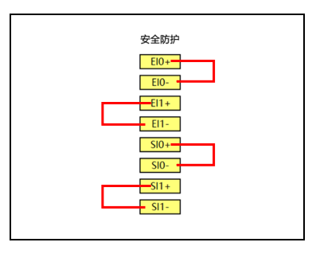

.. centered:: 图表 3.5-10 安全防护示意图01

**连接紧急停止按钮**
在大多数应用中，需要使用一个或多个额外的紧急停止按钮，请参见下图表：

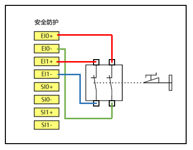

.. centered:: 图表 3.5-11 安全防护示意图02

**连接安全停止按钮**
安全停止装置的一个例子是当门打开时机器人停止的门开关，请参见下图表：

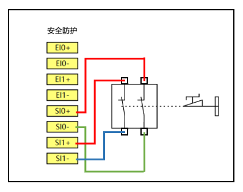

.. centered:: 图表 3.5-12 安全防护示意图03

通用数字量I/O
~~~~~~~~~~~~~~~~~~~~~~~~~~~~

本节描述了通用数字量 I/O的电气规范，必须遵守第3.5.6节中的通用电气规范。

通用数字量I/O可用于驱动继电器、电磁阀等设备或与其他PLC进行交互。

**数字量输出控制负载**

此示例演示如何连接数字量输出从而控制负载，请参见下图表：

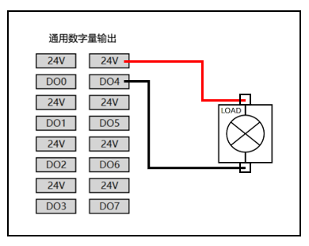

.. centered:: 图表 3.5-13 通用数字量输出示意图01

从按钮进行的数字输入
~~~~~~~~~~~~~~~~~~~~~~~~~~~~~~

下面的示例演示如何将简单按钮连接到数字量输入。

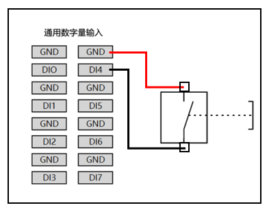

.. centered:: 图表 3.5-14 通用数字量输出示意图02

与其他设备或PLC交互
~~~~~~~~~~~~~~~~~~~~~~~~~~~~~~~

下面的示例演示如何与其他设备或PLC进行数字量输入输出交互。

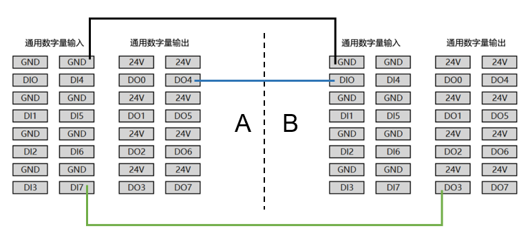

.. centered:: 图表 3.5-15 与其他设备或PLC交互示意图

模拟量I/O
~~~~~~~~~~~~~~~~

.. centered:: 表格 3.5-4 模拟量电流电压
.. list-table::
   :widths: 30 20 10 10 10 10
   :header-rows: 0
   :align: center

   * - **端子**
     - **参数**
     - **最小值**
     - **典型值**
     - **最大值**
     - **单位**

   * - | 模拟量电流输入
       | [AIx-END]
       | [AIx-END]
       | [AIx-END]
     - | 
       | 电流
       | 阻抗
       | 分辨率
     - | 
       | 0
       | -
       | -
     - | 
       | -
       | 500
       | 12
     - | 
       | 20
       | -
       | -
     - | 
       | mA
       | ohm
       | bit

   * - | 模拟量电压输入
       | [AIx-END]
       | [AIx-END]
       | [AIx-END]
     - | 
       | 电压
       | 阻抗
       | 分辨率
     - | 
       | 0
       | -
       | -
     - | 
       | -
       | 510
       | 12
     - | 
       | 10
       | -
       | -
     - | 
       | V
       | Kohm
       | bit

   * - | 模拟量电流输出
       | [AOx-END]
       | [AOx-END]
       | [AOx-END]
     - | 
       | 电流
       | 电压
       | 分辨率
     - | 
       | 0
       | 0
       | -
     - | 
       | -
       | -
       | 12
     - | 
       | 20
       | 10
       | -
     - | 
       | mA
       | V
       | bit

   * - | 模拟量电压输出
       | [AOx-END]
       | [AOx-END]
       | [AOx-END]
       | [AOx-END]
     - | 
       | 电压
       | 电流
       | 阻抗
       | 分辨率
     - | 
       | 0
       | 0
       | -
       | -
     - | 
       | -
       | -
       | 100
       | 12
     - | 
       | 10
       | 20
       | -
       | -
     - | 
       | V
       | mA
       | ohm
       | bit

模拟量I/O用来设置或测量其它设备的电压（0-10V）或电流（0-20mA）。

为了达到高精度，建议采用以下方法。

-  设备和控制箱使用相同的地（GND）。

-  使用屏蔽电缆或双绞线。

下面的示例演示如何使用模拟量I/O。

**使用模拟量输出**

下面的示例是演示使用模拟量输出控制传送带。

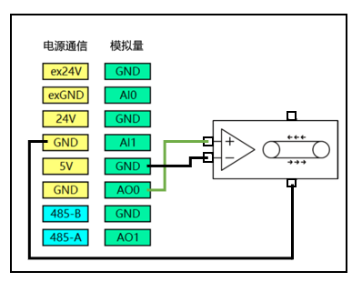

.. centered:: 图表 3.5-16 模拟量输出示意图

**使用模拟量输入**

下面的示例是演示使用模拟量输入连接模拟传感器。

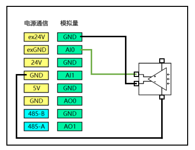

.. centered:: 图表 3.5-17 模拟量输入示意图

示教器及末端LED
------------------

机器人示教器可以使用一台电脑或者平板访问并控制机器人，连接方式可参考3.5.3节说明，此外用户也可以使用我们的FR-HMI示教器，该款示教器是选配件。

按钮盒简介
~~~~~~~~~~~~~~~

第一版按钮盒

.. figure:: installation/058.png
	:align: center
	:width: 6in

.. centered:: 图表 3.6-1 第一版按钮盒

**急停开关：**\ 当按下急停开关，机器人进入紧急停止状态。

**Type-c接口：**\ 连接web示教器的端口。

**按键1：**\ 短按自动/手动模式切换，长按进入/退出拖动模式。

**按键2：**\ 短按记录示教点，长按进入/退出不搭配示教器状态。

**按键3：**\ 短按开始/停止运行程序。

第二版按钮盒

.. figure:: installation/059.png
	:align: center
	:width: 6in

.. centered:: 图表 3.6-2 第二版按钮盒

**急停开关：**\ 当按下急停开关，机器人进入紧急停止状态。

**开始停止：**\ 开始/停止运行程序。

**网口：**\ 连接web示教器。

**关机：**\ 暂未启用。

**记录点：**\ 记录示教点。

**示教模式：**\ 进入/退出搭配示教器状态。

**运行模式：**\ 自动/手动模式切换。

**拖动模式：**\ 进入/退出拖动模式。

FR-HMI示教器简介
~~~~~~~~~~~~~~~~~~~~~~~~~~~~~~~

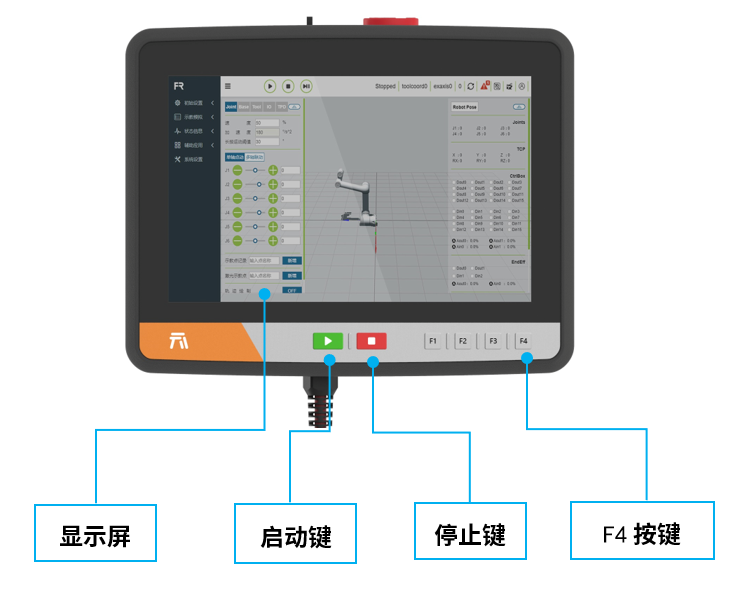

.. centered:: 图表 3.6-3 FR-HMI示教器正面

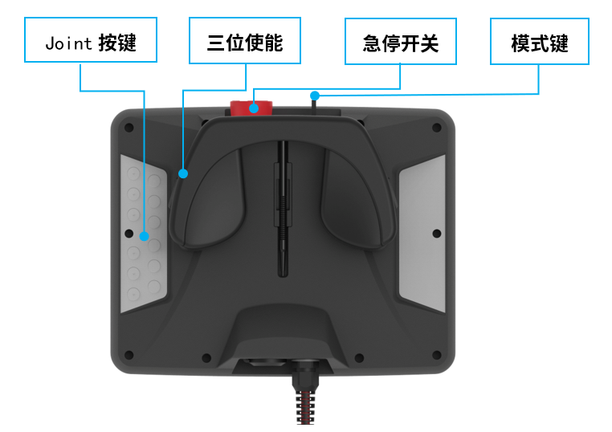

.. centered:: 图表 3.6-4 FR-HMI示教器背面

**显示屏：**\ 示教器的触摸操作与显示界面。

**启动键：**\ 启动程序。

**停止键：**\ 停止当前运行的程序。

**Joint按键：**\ 机器人关节点动。

**三位使能：**\ 手动模式使能机器人

**急停开关：**\ 当按下急停开关，机器人进入紧急停止状态。

**模式键：**\ 旋转按钮切换手自动模式。

末端LED定义
~~~~~~~~~~~~~~~~~

.. centered:: 表格 3.6‑1 末端LED定义表
.. list-table::
   :widths: 50 50
   :header-rows: 0
   :align: center

   * - **功能**
     - **LED 颜色**

   * - 通信未建立时
     - "灭", "红", "绿" , "蓝" 交替

   * - 自动模式
     - 蓝色长亮

   * - 手动模式
     - 绿色长亮

   * - 拖动模式
     - 白青色长亮

   * - 按钮盒记录点 (仅在使用按钮盒时)
     - 紫色闪烁两下

   * - 进入未搭配按钮盒状态(仅在使用按钮盒时)
     - 紫色闪烁两下

   * - 开始运行(仅在使用按钮盒时)
     - 青蓝色闪烁两下

   * - 停止运行(仅在使用按钮盒时)
     - 红色闪烁两下

   * - 报错 (仅在使用按钮盒时)
     - 红色长亮

   * - 校零完成
     - 白青色闪烁三下

   * - 去使能
     - 黄色闪烁两下