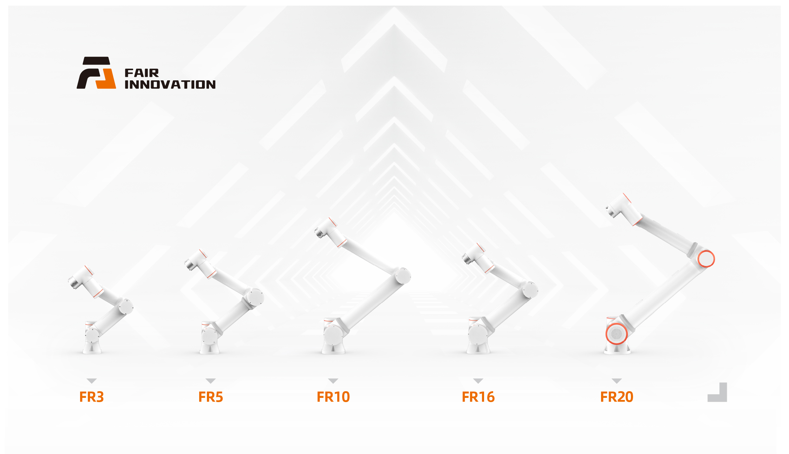

协作机器人
================

产品矩阵
------------

PDF下载
------------------
    :download:`法奥意威协作机器人用户手册 <https://pan.baidu.com/share/init?surl=tXF1NV06YS2VmrxVL0etiA&pwd=n9tn>`

快速开始
------------
.. toctree:: 
    :maxdepth: 6
    :numbered: 5

    install_power_robot
    access
    parameter_setting
    manual_teaching
    quick_programming

使用手册
------------
.. toctree:: 
    :maxdepth: 6
    :numbered: 8

    foreword
    robot_brief_introduction
    installation
    quick_start_robot
    teaching_pendant_software
    base
    safety
    robot_peripherals
    coding
    graphical
    node_editor_software
    points
    status
    application
    system
    appendix
    term

版本说明
-----------

.. toctree:: 
    :maxdepth: 6
    
    version_intro
