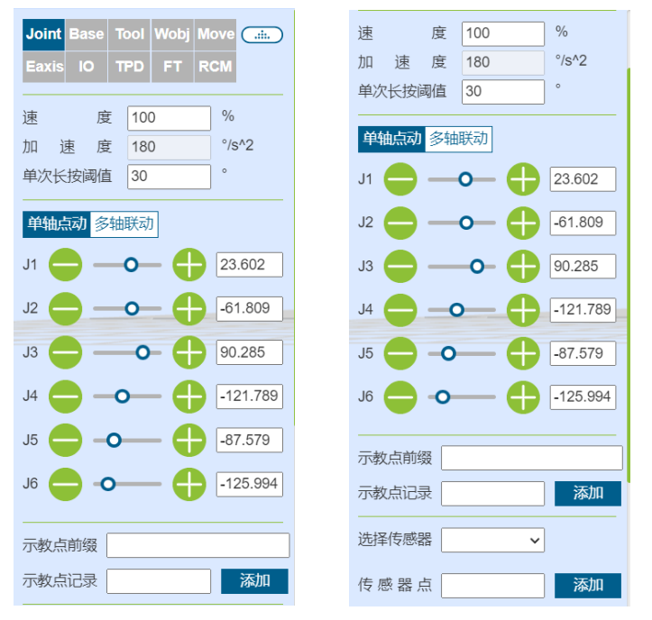

机器人手动示教
===================

手动示教并记录示教点
--------------------

手动示教包含两种方式，一种是按住末端拖动按钮进行拖动示教，一种是在操作区进行点动。示教到目标位置后，即可保存示教点。保存示教点时，该示教点的坐标系为当前机器人应用的坐标系。在该操作区上方可以对示教点速度，加速度设置，设置数值为机器人标准速度百分比，若设置100，即标准速度的百分之百。

.. centered:: 图表 4.1‑1 手动示教

查看示教点信息
--------------------

点击“示教管理”可显示所有保存的示教点信息，在该界面中可对示教点文件导入和导出，选中一个示教点后点击“删除”按钮即可将该点信息删除，示教点x,y,z,rx,ry,rz和v数值可进行修改，输入修改值，勾选左侧勾选兰，点击上方修改即可修改示教点信息。点击“开始运行”按钮，进行局部示教点的单点运行，将机器人移动到该点的位置。此外，用户可以通过名称搜索示教点。

.. image:: teaching_pendant_software/140.png
   :width: 6in
   :align: center

.. centered:: 图表 4.2‑1 示教管理界面

.. important:: 
    示教点x,y,z,rx,ry,rz的修改值不应超过机器人的工作范围。

