节点图编程
===============

.. toctree:: 
   :maxdepth: 6

基础信息
-----------

系统简介
~~~~~~~~~~~

节点图编程是针对机器人开发的编程软件，其主要功能和技术特点如下：

-  节点之间的连线较好的呈现程序的上下文逻辑关系；
-  通过创建节点、连线节点和编辑节点参数等操作，只需拖动操作和少量的参数输入即可完成机器人程序编写；
-  有助于更好地可视化代码，并更快地编写复杂和重复任务的脚本；

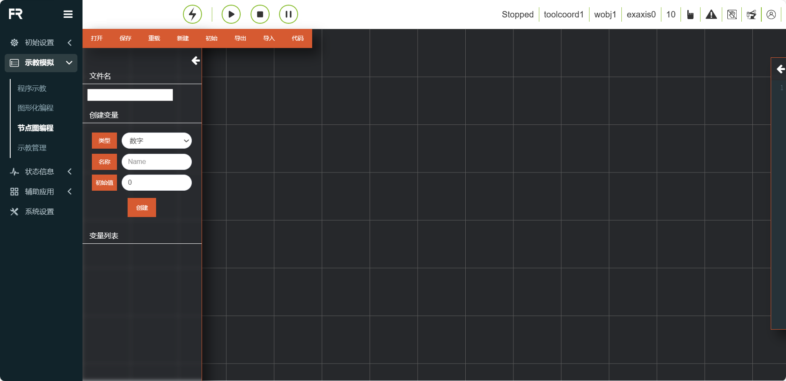

.. centered:: 图表 6.1-1 节点图编程界面

工具栏
~~~~~~~~~~

使用节点图编程页面左侧顶部的工具栏。

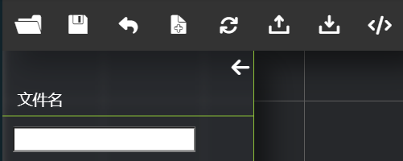

.. centered:: 图表 6.1-2 操作工具栏

.. note:: 
   名称：**打开**
   
   作用：打开用户程序文件

.. note:: 

   名称：**保存**
   
   作用：保存节点图编辑内容

.. note:: 

   名称：**重载**
   
   作用：重新加载上次操作的节点图内容到本地。

.. note:: 

   名称：**新建**
   
   作用：新建节点图编程文件

.. note:: 

   名称：**初始**
   
   作用：加载初始设置的节点图内容。

.. note:: 

   名称：**导出**
   
   作用：新建/打开节点图编程文件后，点击“导出”按钮，生成导出文件（json格式）。

.. note:: 

   名称：**导入**
   
   作用：点击“导入”按钮，弹出导入提示框。选择需要导入的文件，点击导入后，文件内容展示到节点图编程工作区。

.. note:: 

   名称：**代码**
   
   作用：节点图连接后，生成Lua代码。

节点图操作
-----------

节点程序
~~~~~~~~~~~

节点程序需要在空白处点击鼠标右键，打开节点程序选择栏。程序指令主要分为逻辑指令、运动指令、力控指令、控制指令、Modbus指令、扩展轴等指令。

节点程序选择栏上方输入框，可进行模糊搜索，快速定位所需节点指令。

具体节点程序操作流程如下：

-  点击“Begin”开始节点，创建开始节点编程位置；
-  点击选择的程序指令节点，对应节点图展示到工作区，可对其指令参数进行下拉框选择、输入操作；
-  指令节点右侧箭头作用：1.单个箭头图标连接下一个节点 2.多个箭头图标，第一个“Body”箭头图标连接内容节点，第二个“Completed”图标连接下一个节点；
-  将“Begin”开始节点与完成编写的节点程序相连,则结束节点编程操作；
  
逻辑指令节点
~~~~~~~~~~~~~

If/Else判断指令
+++++++++++++++++

点击“If/Else”相关指令节点,进入节点图编辑界面。（该指令需要一定编程基础，如需帮助，请联系我们）

“If/Else”指令:

- First: 连接if条件内的节点指令
- Second:若左侧只输入俩个判断条件，则表示连接else条件内的节点指令;若左侧三个判断条件都存在，则表示连接elseif条件内的节点指令
- Third: 若左侧三个判断条件都存在，则表示连接else条件
- Completed:连接后续节点指令

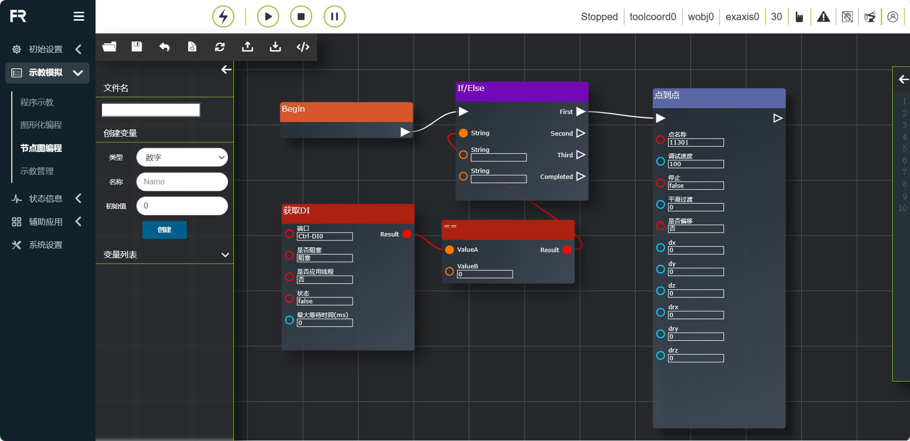

.. centered:: 图表 6.2.1 “If/Else”指令节点界面

While指令
++++++++++++++++

点击“While”相关指令节点,进入节点图编辑界面。

在While后方的输入框中输入等待条件，在do后方的输入框中输入循环期间的动作指令，点击保存即可。（为方便操作，可任意输入do内容，在程序中编辑其他指令插入代替）

“While”指令:

- Condition: while循环条件

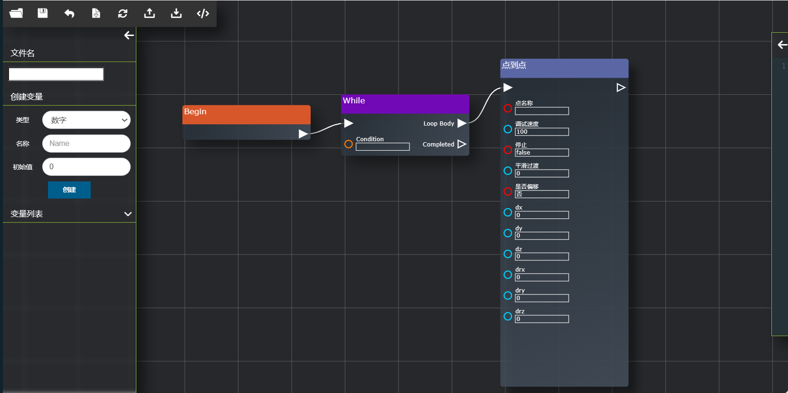

.. centered:: 图表 6.2.2 “While”指令节点界面

跳转指令
++++++++++

点击“跳转”相关指令节点,进入节点图编辑界面。

“跳转”指令，第一个“Body”箭头图标连接主体内容节点，第二个“Completed”箭头图标连接后续跳转位置goto指令节点。（该指令需要一定编程基础，如需帮助，请联系我们）

- 跳转名称: 输入跳转名称，来确定跳转位置

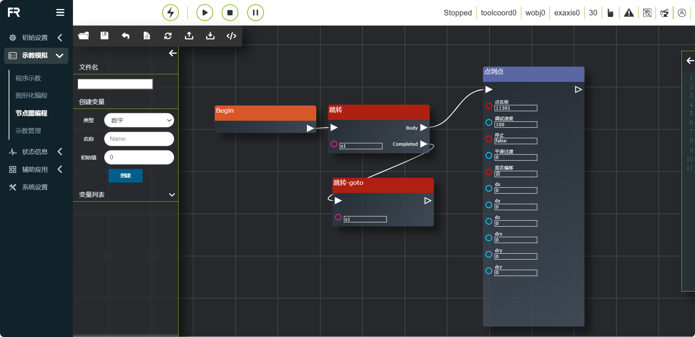

.. centered:: 图表 6.2.3 “跳转”指令节点界面

.. important:: 跳转名称不能以数字开头

等待指令
++++++++++

点击“等待”相关指令节点,进入节点图编辑界面

该指令为延时指令，分为“WaitMs”、“WaitDI”、“WaitMultiDI”和“WaitAI”四部分。

1.“等待”指令节点,参数: 

- 等待时间(ms): 延时等待时间单位为毫秒，输入需要等待的毫秒数

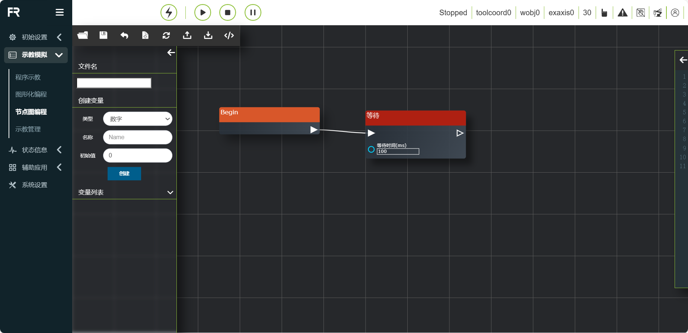

.. centered:: 图表 6.2.4 “等待”指令节点界面

2.“等待DI”指令节点，参数:

- DI端口号： Ctrl-DI0 ~ Ctrl-CI7(WaitDI,[0~15]), End-DI0 ~ End-DI1(WaitToolDI,[0~1])
- 状态： false/true
- 最大时间(ms)： 0 ~ 10000 
- 等待超时处理：停止报错/继续执行/一直等待

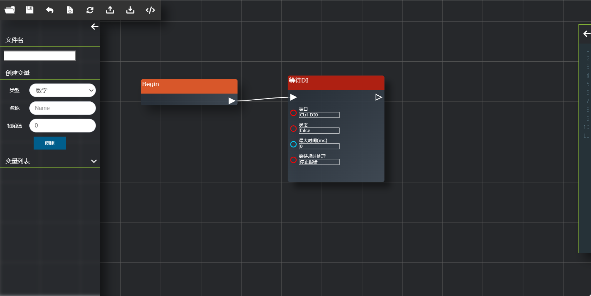

.. centered:: 图表 6.2.5 “等待DI”指令节点界面

3.“等待多条DI”指令节点，参数:

- 条件： 与/或
- 条件选择：选择位的状态开启的端口号，以逗号隔开，例DI0,DI1
- 真值对应端口：选择真值的端口号，以逗号隔开，例DI0,DI1
- 最大时间(ms)：0 ~ 10000,最大等待时间
- 等待超时处理：停止报错/继续执行/一直等待

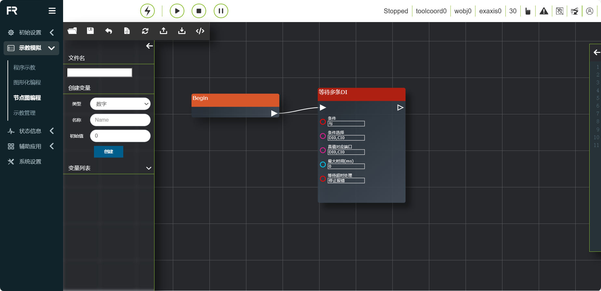

.. centered:: 图表 6.2.6 “等待多条DI”指令节点界面

4.“等待AI”指令节点，参数:

- 条件： 与/或
- AI端口号： Ctrl-AI0 ~ Ctrl-AI1(WaitAI,[0~1]), End-AI0(WaitToolAI,[0])
- 条件：大于/小于
- 数值(%)：1 ~ 100
- 最大时间(ms)：0 ~ 10000
- 等待超时处理：停止报错/继续执行/一直等待,等待超时处理一直等待时，最大时间默认为0

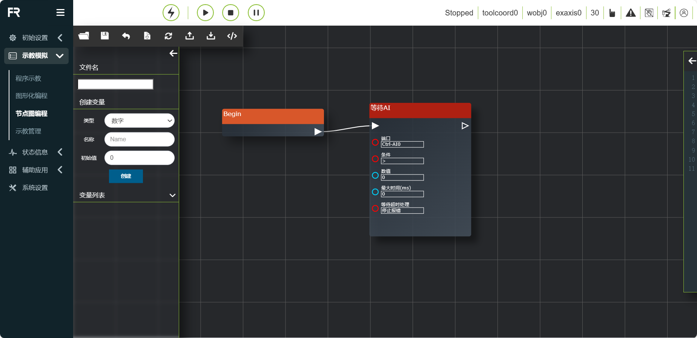

.. centered:: 图表 6.2.7 “等待AI”指令节点界面

暂停指令
++++++++++

点击“暂停”指令节点,进入节点图编辑界面

该指令为暂停指令，在程序中插入该指令，当程序执行到该指令时，机器人会处于暂停状态，若想继续运行，点击控制区“暂停/恢复”按键即可。

“暂停”指令节点,参数: 

- 暂停类型：无功能、气缸未到位等

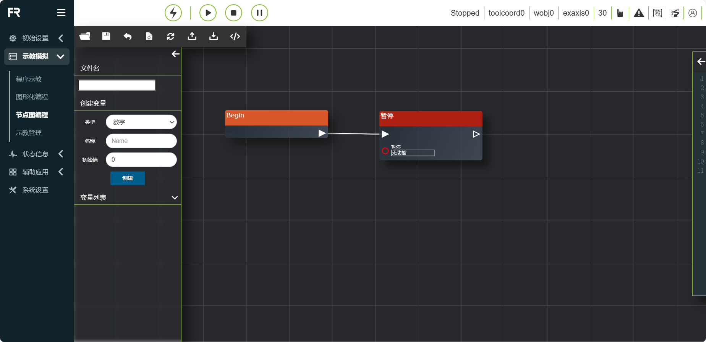

.. centered:: 图表 6.2.8 “暂停”指令节点界面

调用子程序指令
+++++++++++++++++

点击“调用子程序”指令节点,进入节点图编辑界面

该指令为暂停指令，在程序中插入该指令，当程序执行到该指令时，机器人会处于暂停状态，若想继续运行，点击控制区“暂停/恢复”按键即可。

“调用子程序”指令节点,参数: 

- dofile文件：创建生成的文件名
- 第几层调用：第一层/第二层
- id编号：所属层级对应位置id

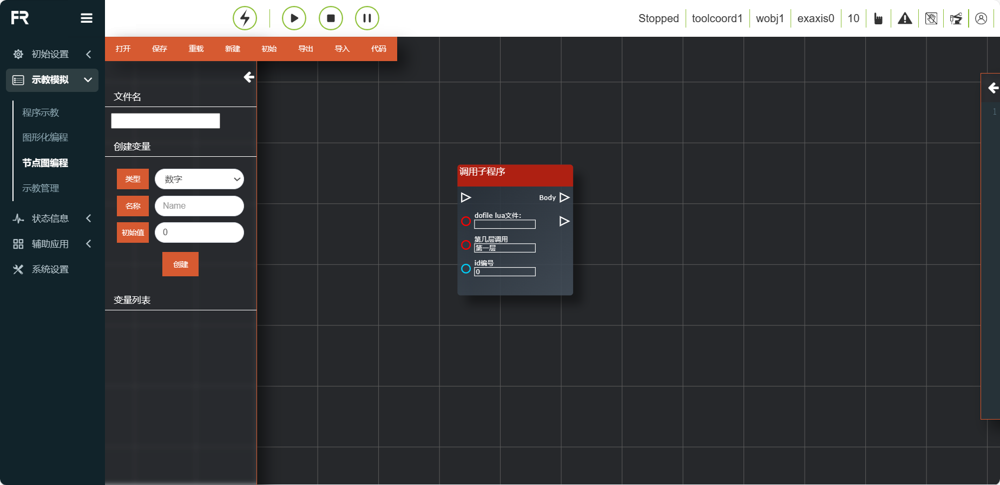

.. centered:: 图表 6.2.9 “调用子程序”指令节点界面

运动指令节点
~~~~~~~~~~~~~

点到点指令
+++++++++++++++++

点击“点到点”指令节点,进入节点图编辑界面

可以选择需要到达的点，平滑过渡时间设置可以实现该点到下一点的运动是连续的，是否偏移设置，可以选择基于基坐标系偏移和基于工具坐标偏移，并弹出x,y,z,rx,ry,rz偏移量设置，PTP具体路径为运动控制器自动规划的最优路径

“点到点”指令节点,参数: 

- 点名称：示教点位
- 调试速度(%)：0 ~ 100
- 停止：false/true
- 平滑过渡(ms)：平滑过渡时间 0 ~ 500
- 是否偏移 否/基坐标偏移/工具坐标偏移 选择否时，dx~drz参数值不生效
- dx~drz：偏移量

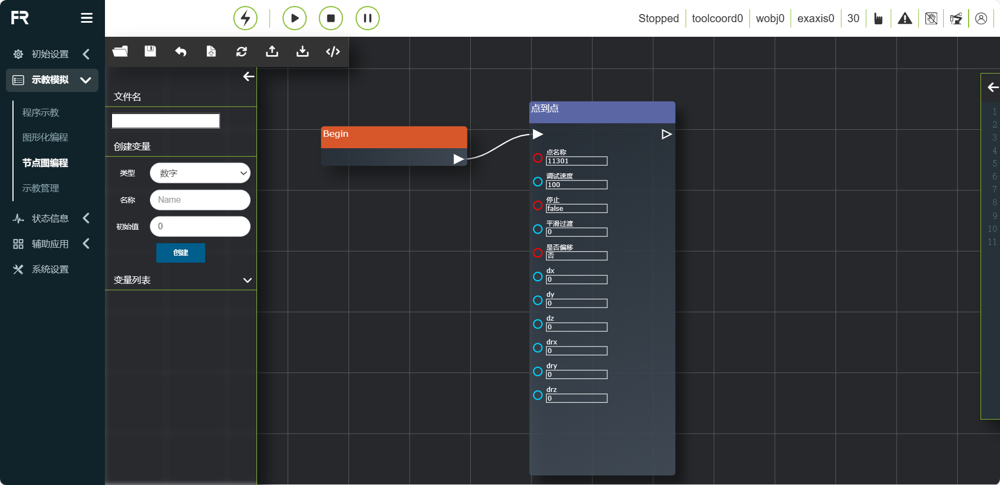

.. centered:: 图表 6.2.10 “点到点”指令节点界面

直线指令
+++++++++++++++++

点击“直线”指令节点,进入节点图编辑界面

该指令功能与“点到点”指令相似，但该指令所到达点的路径为直线

“直线”指令节点,参数: 

- 点名称：示教点位
- 调试速度(%)：0 ~ 100
- 停止：false/true，选择true时，平滑过渡参数值不生效
- 平滑过渡(mm)：平滑过渡半径 0 ~ 1000
- 是否偏移： 否/基坐标偏移/工具坐标偏移 选择否时，dx~drz参数值不生效
- 是否寻位：false/true
- 寻位点变量：REF0~99/RES0~99，是否寻位选择false时，参数不生效；
- 焊缝缓存数据选择：执行规划数据/执行记录数据，选择点名称为“seamPos”时，参数生效，否则不生效；
- 板材类型：波纹板/瓦楞板/围栏板/油桶/波纹甲壳钢，选择点名称为“seamPos”时，参数生效，否则不生效；

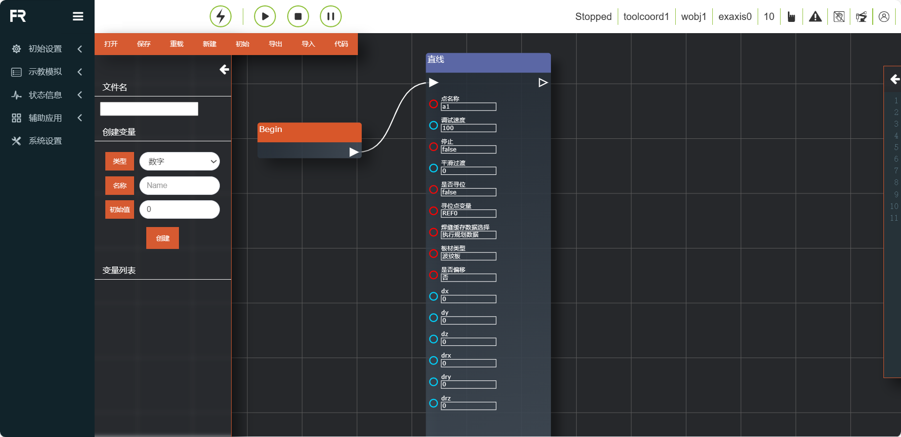

.. centered:: 图表 6.2.11 “直线”指令节点界面

圆弧指令
+++++++++++++++++

点击“圆弧”指令节点,进入节点图编辑界面

圆弧运动包含两个点，第一点为圆弧中间过渡点，第二点为终点，过渡点和终点都可以对是否偏移进行设置，可以选择基于基坐标系偏移和基于工具坐标偏移，设置x,y,z,rx,ry,rz偏移量，终点可以设置平滑过渡半径，实现运动连续效果

“圆弧”指令节点,参数: 

- 圆弧中间点：示教点位
- 是否偏移： 否/基坐标偏移/工具坐标偏移 选择否时，dx~drz参数值不生效
- dx~drz：偏移量
- 圆弧终点：示教点位
- 是否偏移： 否/基坐标偏移/工具坐标偏移 选择否时，dx~drz参数值不生效
- dx~drz：偏移量
- 调试速度(%)：0 ~ 100
- 停止：false/true，选择true时，平滑过渡参数值不生效
- 平滑过渡(mm)：平滑过渡半径 0 ~ 1000

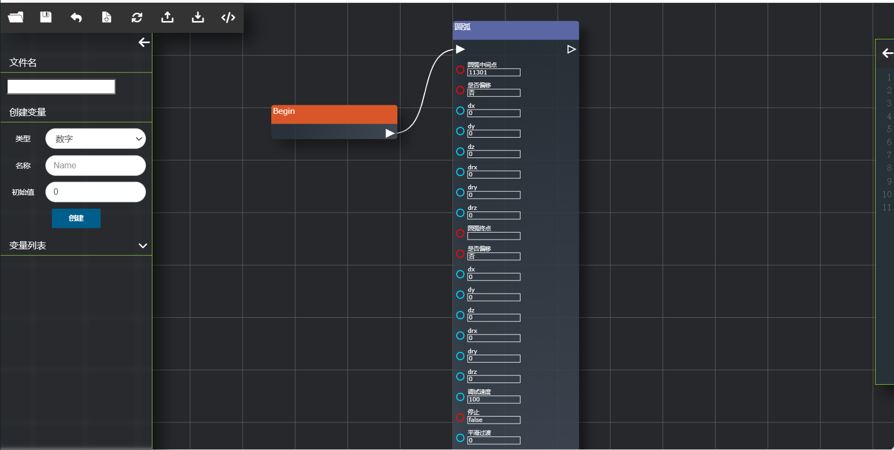

.. centered:: 图表 6.2.12 “圆弧”指令节点界面

整圆指令
+++++++++++++++++

点击“整圆”指令节点,进入节点图编辑界面

整圆运动包含两个点，第一点为整圆中间过渡点1，第二点为整圆中间过渡点2，过渡点2可以设置是否偏移，该偏移量同时生效于过渡点1和过渡点2

“整圆”指令节点,参数: 

- 整圆中间点1：示教点位
- 整圆中间点2：示教点位
- 调试速度(%)：0 ~ 100
- 是否偏移： 否/基坐标偏移/工具坐标偏移 选择否时，dx~drz参数值不生效
- dx~drz：偏移量

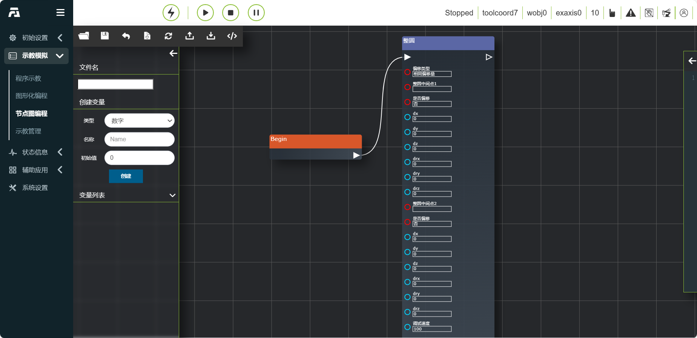

.. centered:: 图表 6.2.13 “整圆”指令节点界面

螺旋指令
+++++++++++++++++

点击“螺旋”指令节点,进入节点图编辑界面

螺旋线运动包含三个点，该三个点组成一个圆，在第三点设置页面，包含螺旋圈数，姿态修正角，半径增量和转轴方向增量这几个参数设置，螺旋圈数即该螺旋线的运动圈数，姿态修正角修正的是螺旋线结束时的姿态与螺旋线第一点的姿态，半径增量即每一圈半径的增量，转轴方向增量即螺旋轴方向的增量。设置 是否偏移，该偏移量生效于整个螺旋线的轨迹。

“螺旋”指令节点,参数: 

- 螺旋线中间点1：示教点位
- 螺旋线中间点2：示教点位
- 螺旋线中间点3：示教点位
- 调试速度(%)：0 ~ 100
- 是否偏移： 否/基坐标偏移/工具坐标偏移 选择否时，dx~drz参数值不生效
- dx~drz：偏移量
- 螺旋圈数：0 ~ 100
- 姿态角修正rx(°)：-1000 ~ 1000
- 姿态角修正ry(°)：-1000 ~ 1000
- 姿态角修正rz(°)：-1000 ~ 1000
- 半径增量(mm)：-100 ~ 100
- 转轴方向增量(mm)：-100 ~ 100

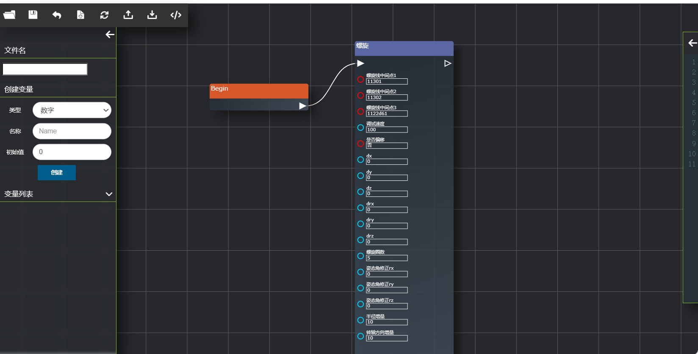

.. centered:: 图表 6.2.14 “螺旋”指令节点界面

新螺旋指令
+++++++++++++++++

点击“新螺旋”指令节点,进入节点图编辑界面

新螺旋运动为优化版螺旋线运动，该指令只需要一个点加各参数的配置实现螺旋线运动。机器人以当前位置作为起点，用户设置调试速度，是否偏移，螺旋圈数，螺旋倾角，初始半径，半径增量，转轴方向增量和旋转方向这几个参数，螺旋圈数即该螺旋线的运动圈数，螺旋倾角即工具Z轴与水平方向的夹角，姿态修正角修正的是螺旋线结束时的姿态与螺旋线第一点的姿态，初始半径即第一圈半径大小，半径增量即每一圈半径的增量，转轴方向增量即螺旋轴方向的增量，旋转方向即顺时针和逆时针。

“新螺旋”指令节点,参数: 

- 螺旋线起点：示教点位
- 调试速度(%)：0 ~ 100
- 是否偏移： 否/基坐标偏移/工具坐标偏移 选择否时，dx~drz参数值不生效
- dx~drz：偏移量
- 螺旋圈数：0 ~ 100
- 螺旋倾角(°)：-100 ~ 100
- 初始半径：0 ~ 100
- 半径增量(mm)：-100 ~ 100
- 转轴方向增量(mm)：-100 ~ 100
- 旋转方向：顺时针/逆时针

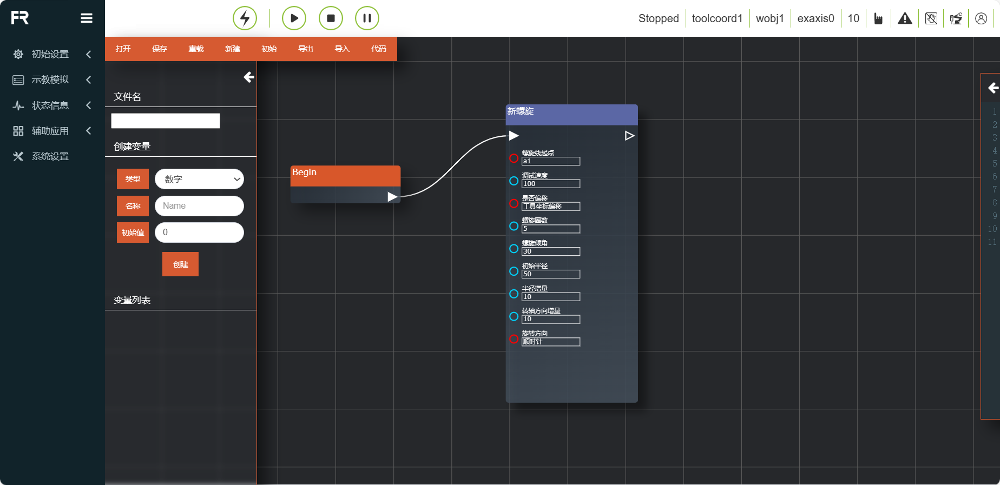

.. centered:: 图表 6.2.15 “新螺旋”指令节点界面

样条指令
+++++++++++++++++

点击“样条”指令节点,进入节点图编辑界面

该指令分为样条组起始，样条段和样条组结束三部分，样条组开始是样条运动的起始标志，样条段目前节点图只包含SPL段，样条组结束是样条运动的结束标志。

“样条-SPTP”指令节点,参数: 

- 点名称：示教点位
- 调试速度(%)：0 ~ 100

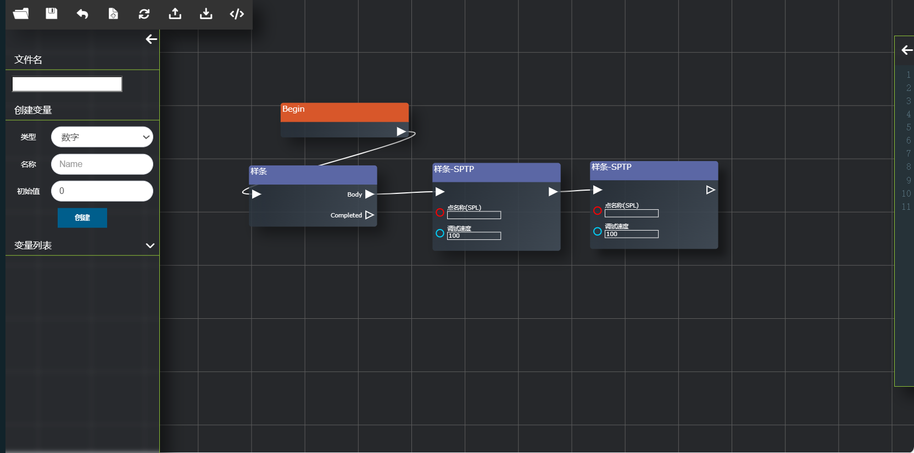

.. centered:: 图表 6.2.16 “样条”指令节点界面

新样条指令
+++++++++++++++++

点击“新样条”指令节点,进入节点图编辑界面

该指令为样条指令算法优化指令，后续会替代现有的样条指令，该指令分为多点轨迹起始，多点轨迹段和多点轨迹结束三部分，多点轨迹开始是多点轨迹运动的起始标志，多点轨迹段即设置各个轨迹点，点击图标进入点位添加界面，多点轨迹结束是多点轨迹运动的结束标志，在此可以设置控制模式和调试速度，控制模式分 为给定控制点和给定路径点。

“新样条”指令节点,参数: 

- 控制模式：示教点位

“新样条-SPL”指令节点,参数: 

- 点名称：示教点位
- 调试速度(%)：0 ~ 100
- 平滑过渡半径：0 ~ 1000
- 是否最后一个点：否/是

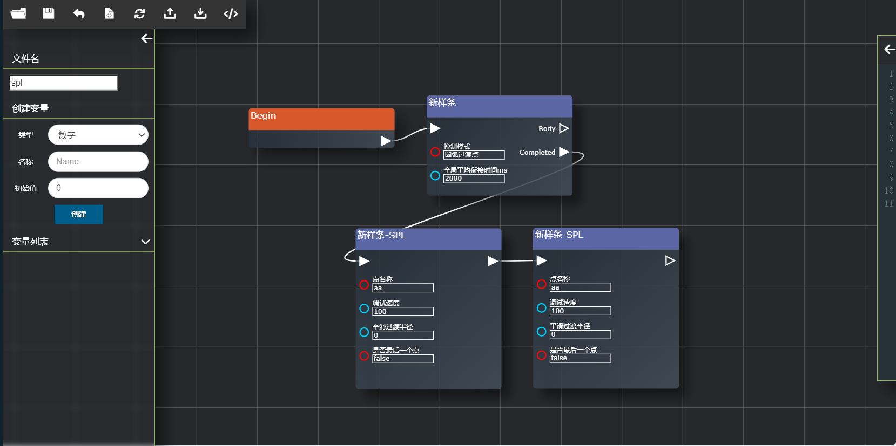

.. centered:: 图表 6.2.17 “新样条”指令节点界面

摆动指令
+++++++++++++++++

点击“摆动”指令节点,进入节点图编辑界面

该指令包含两部分，第一部分选择配置好参数的摆焊编号，连接Body代表连接节点的程序在“开始摆焊”和“停止摆焊”中间执行。

“摆动”指令节点,参数: 

- 编号：0~7

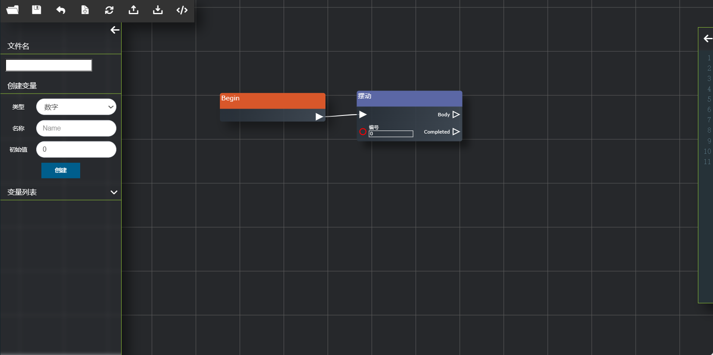

.. centered:: 图表 6.2.18 “摆动”指令节点界面

轨迹复现指令
+++++++++++++++++

点击“轨迹复现”指令节点,进入节点图编辑界面

在该指令中，用户首先需要有记录好的轨迹。

进行程序编程时，首先用点到点指令到达对应轨迹起始点，然后在轨迹复现指令中选择轨迹，选择平滑轨迹，设置调试速度。轨迹加载指令主要用于预先读取轨迹文件，提取成轨迹指令，更好的应用于传送带跟踪场景。

“轨迹复现”指令节点,参数: 

- 轨迹名称：记录好的轨迹
- 平滑轨迹：否/是
- 调试速度(%)：0 ~ 100，默认值为25

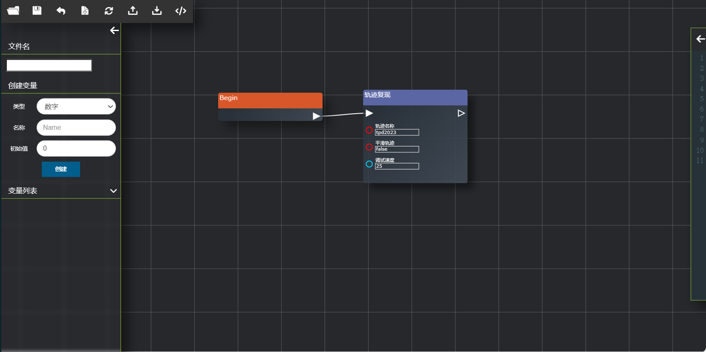

.. centered:: 图表 6.2.19 “轨迹复现”指令节点界面

点偏移指令
+++++++++++++++++

点击“点偏移”指令节点,进入节点图编辑界面

该指令为整体偏移指令，输入各个偏移量，连接Body代表连接节点的程序在开始和关闭之间执行，中间的运动指令会基于基坐标（或工件坐标）进行偏移。

“点偏移”指令节点,参数: 

- ∆x：偏移量，-300~300
- ∆y：偏移量，-300~300
- ∆z：偏移量，-300~300
- ∆rx：偏移量，-300~300
- ∆ry：偏移量，-300~300
- ∆rz：偏移量，-300~300

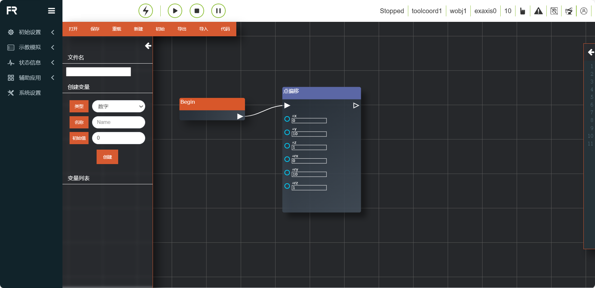

.. centered:: 图表 6.2.20 “点偏移”指令节点界面

伺服指令
+++++++++++++++++

点击“伺服”指令节点,进入节点图编辑界面

伺服控制（笛卡尔空间运动）指令，该指令可以通过绝对位姿控制或基于当前位姿偏移来控制机器人运动。

“伺服”指令节点,参数: 

- 运动方式：绝对位置/基坐标偏移/工具坐标偏移
- x：偏移量，-300~300
- y：偏移量，-300~300
- z：偏移量，-300~300
- rx：偏移量，-300~300
- ry：偏移量，-300~300
- rz：偏移量，-300~300
- 比例系数x：0~1
- 比例系数y：0~1
- 比例系数z：0~1
- 比例系数rx：0~1
- 比例系数ry：0~1
- 比例系数rz：0~1
- 加速度(%)：0~100
- 速度(%)：0~100
- 指令周期(s)：0.001~0.016
- 滤波时间(s)：0~1
- 比例放大：0~100

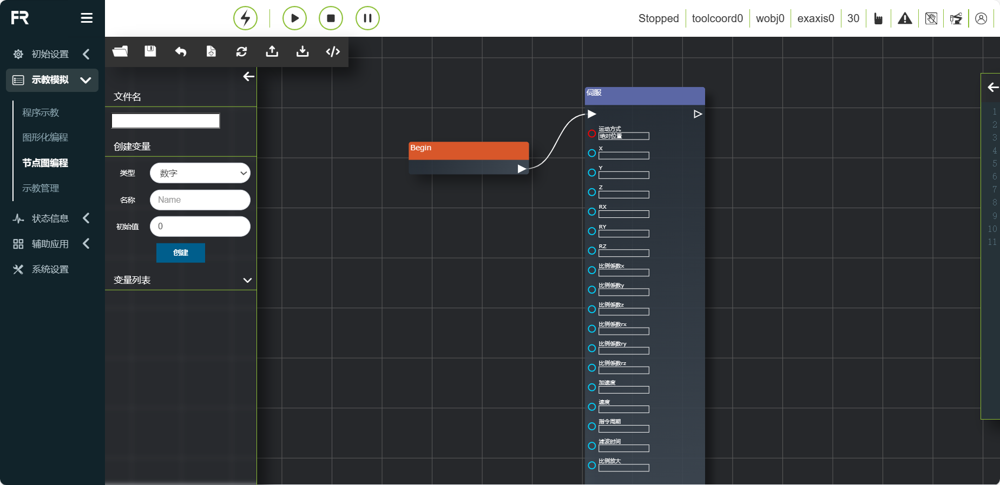

.. centered:: 图表 6.2.21 “伺服”指令节点界面

轨迹指令
+++++++++++++++++

点击“轨迹”指令节点,进入节点图编辑界面

在该指令中，用户首先需要有记录好的轨迹。

“轨迹”指令节点,参数: 

- 选择轨迹文件：记录好的轨迹
- 调试速度(%)：0 ~ 100，默认值为25

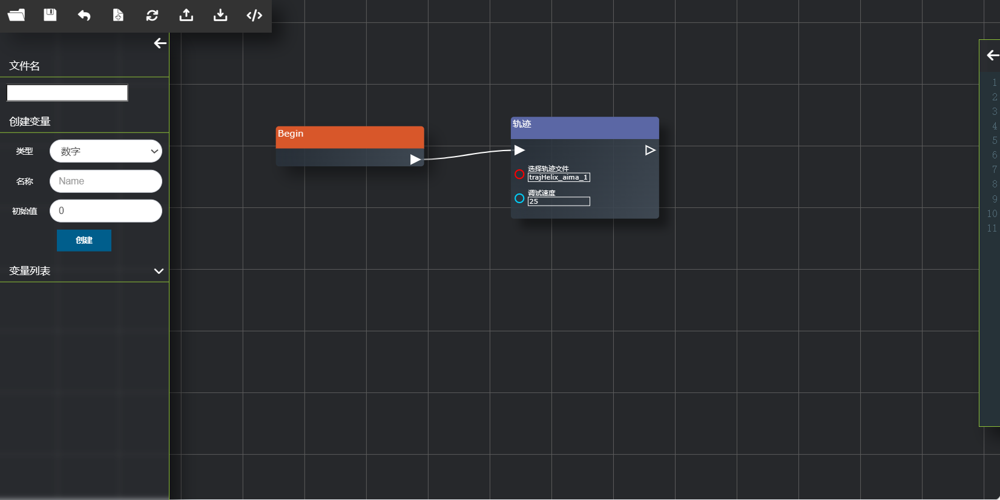

.. centered:: 图表 6.2.22 “轨迹”指令节点界面

轨迹J指令
+++++++++++++++++

点击“轨迹J”指令节点,进入节点图编辑界面

在该指令中，用户首先需要有记录好的轨迹，可以在示教程序界面预先导入轨迹文件。轨迹指令和轨迹J指令适用于相机直接给定轨迹的通用接口，满足在已有固定格式的离散的轨迹点文件时，可导入系统使得机器人按照导入文件的轨迹进行运动。

“轨迹J”指令节点,参数: 

- 选择轨迹文件：记录好的轨迹
- 调试速度(%)：0 ~ 100，默认值为25
- 轨迹模式：路径点/控制点

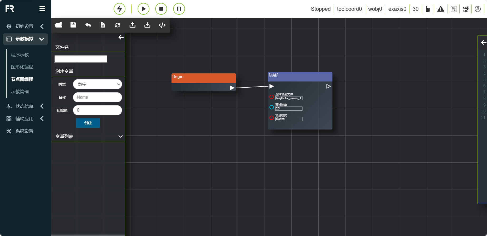

.. centered:: 图表 6.2.23 “轨迹J”指令节点界面

DMP指令
+++++++++++++++++

点击“DMP”指令节点,进入节点图编辑界面

DMP是一种轨迹模仿学习的方法，需要事先规划参考轨迹。在命令编辑界面 ，选择示教点作为新的起点，点击“添加”、“应用”后可保存该指令。DMP具体路径为以新的起点模仿参考轨迹的新轨迹。

“DMP”指令节点,参数: 

- 点名称：示教点
- 调试速度(%)：0 ~ 100，默认值为100

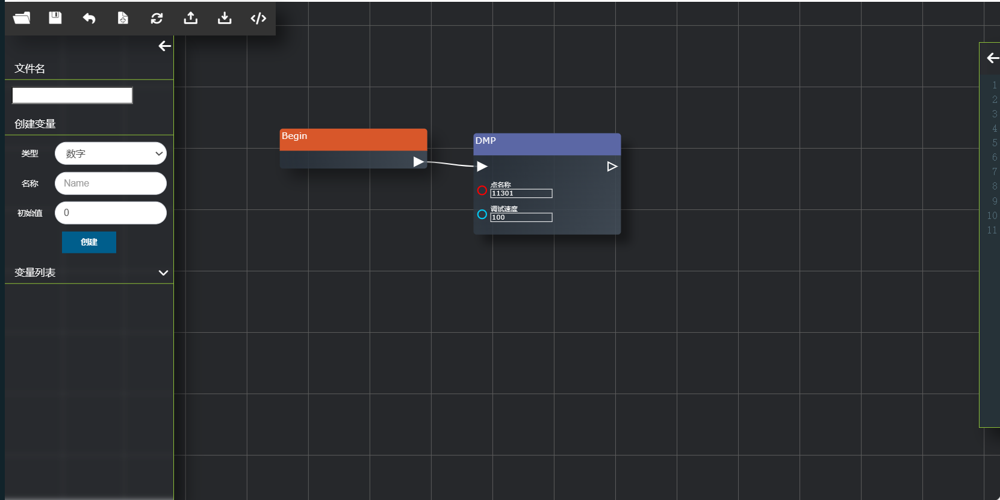

.. centered:: 图表 6.2.24 “DMP”指令节点界面

工件转换指令
+++++++++++++++++

点击“工件转换”指令节点,进入节点图编辑界面

选择所要进行自动转换的工件坐标系，点击“添加”、“应用”后可保存该指令，添加PTP、LIN指令时与Body相连可实现在该指令内部执行，工件坐标系下点位自动转换。

“工件转换”指令节点,参数: 

- 工件坐标系：工件坐标系列表

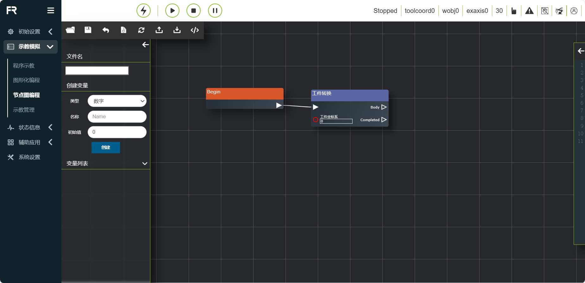

.. centered:: 图表 6.2.25 “工件转换”指令节点界面

工具转换指令
+++++++++++++++++

点击“工具转换”指令节点,进入节点图编辑界面

选择所要进行自动转换的工具坐标系，点击“添加”、“应用”后可保存该指令，添加PTP、LIN指令时与Body相连可实现在该指令内部执行，工具坐标系下点位自动转换。

“工具转换”指令节点,参数: 

- 工具坐标系：工具坐标系列表

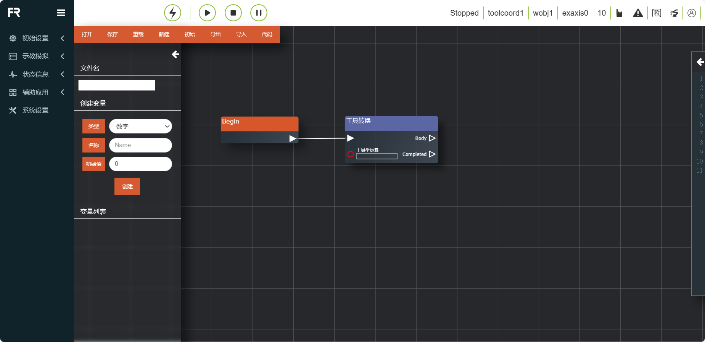

.. centered:: 图表 6.2.26 “工具转换”指令节点界面

控制指令界面
~~~~~~~~~~~~~

数字IO指令节点
+++++++++++++++++

点击“设置DO”/“获取DI”指令节点,进入节点图编辑界面

该指令为IO指令，分为设置IO（SetDO/SPLCSetDO）和获取IO（GetDI/SPLCGetDI）两部分。

1.“设置DO”指令节点,参数: 

- 端口：Ctrl-DO0 ~ Ctrl-CO7(阻塞:SetDO,非阻塞:SPLCSetDO,[0~15]), End-DO0 ~ End-DO1(阻塞:SetToolDO,非阻塞:SPLCSetToolDO,[0~1])
- 状态：false/true
- 是否阻塞：阻塞/非阻塞
- 平滑轨迹：Break/Serious
- 是否应用线程：否/是
  
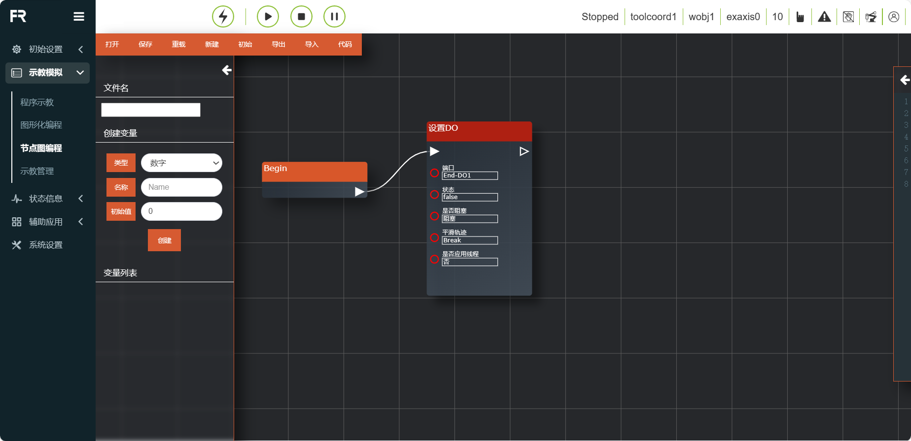

.. centered:: 图表 6.2.27 “设置DO”指令节点界面

2.“获取DI”指令节点,参数: 

- 端口：Ctrl-DI0 ~ Ctrl-CI7(阻塞:GetDI,非阻塞:SPLCGetDI,[0~15]), End-DI0 ~ End-DI1(阻塞:GetToolDI,非阻塞:SPLCGetToolDI,[0~1])
- 是否阻塞：阻塞/非阻塞
- 状态：false/true
- 最大等待时间(ms)：0 ~ 10000
- 是否应用线程：否/是
  
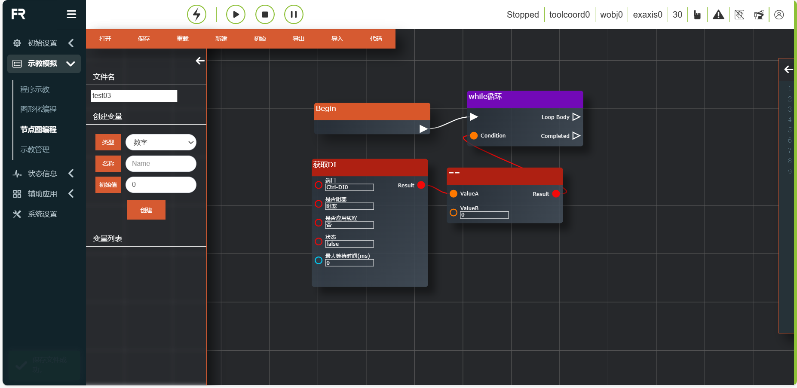

.. centered:: 图表 6.2.28 “获取DI”指令节点界面

模拟AI命令
++++++++++++++++

点击“设置AO”/“获取AI”指令节点，进入节点图编辑界面

在该指令中，分为设置模拟输出（SetAO/SPLCSetAO）和获取模拟输入（GetAI/SPLCGetAI）两部分功能。

1.“设置AO”指令节点,参数: 

- 端口：Ctrl-AO0 ~ Ctrl-AO1(阻塞:SetAO,非阻塞:SPLCSetAO,[0~1]), End-AO0(阻塞:SetToolAO,非阻塞:SPLCSetToolAO,[0])
- 数值(%)：0 ~ 100
- 是否阻塞：阻塞/非阻塞
- 是否应用线程：否/是
  
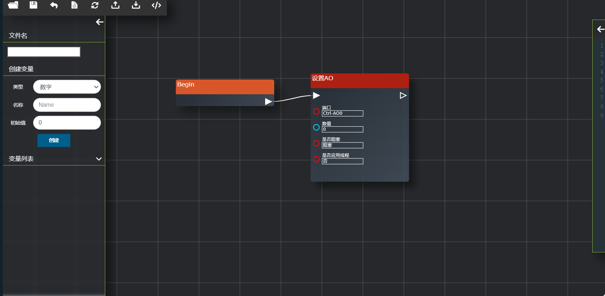

.. centered:: 图表 6.2.29 “设置AO”指令节点界面
   
2.“获取AI”指令节点,参数: 

- 端口：Ctrl-AI0 ~ Ctrl-DI1(阻塞:GetAI,非阻塞:SPLCGetAI,[0~1]), End-AI0(阻塞:GetToolAI,非阻塞:SPLCGetToolAI,[0])
- 条件：大于/小于
- 数值(%)：0 ~ 100
- 最大时间(ms)：0 ~ 10000
- 是否阻塞：阻塞/非阻塞
- 是否应用线程：否/是
  
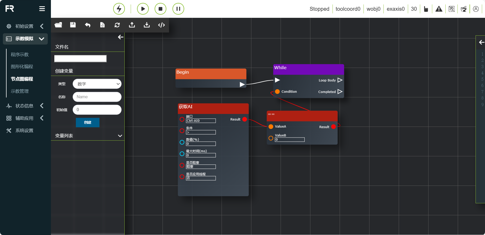

.. centered:: 图表 6.2.30 “获取AI”指令节点界面

虚拟IO命令节点
++++++++++++++++

点击“设置模拟外部DI”/“设置模拟外部AI”指令节点,进入节点图编辑界面

该指令虚拟的IO控制指令，可以实现设置模拟外部DI和AI状态，获取模拟DI和AI状态。

1.“设置模拟外部DI”指令节点,参数: 

- 端口：Vir-Ctrl-DI0 ~ Vir-Ctrl-DI15(SetVirtualDI,[0~15]), Vir-End-DI0 ~ Vir-End-DI1(SetVirtualToolDI,[1~2])
- 状态：false/true
  
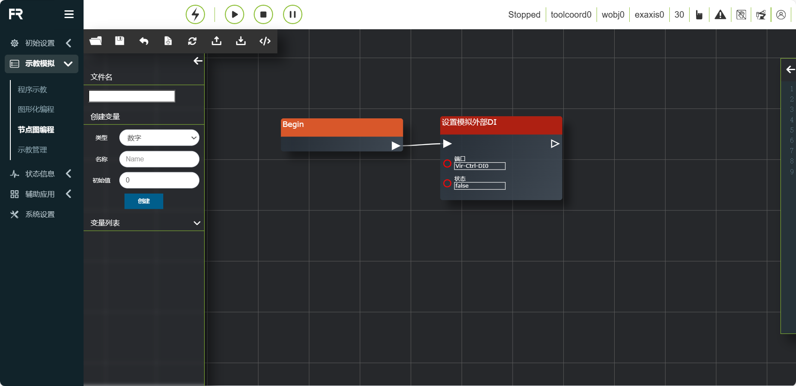

.. centered:: 图表 6.2.31 “设置模拟外部DI”指令节点界面
   
2.“设置模拟外部AI”指令节点,参数: 

- 端口：Vir-Ctrl-AI0 ~ Vir-Ctrl-AI0(SetVirtualAI,[0~1]), Vir-End-AI0(SetVirtualToolAI,[0])
- 数值(v/ma)：0 ~ 20

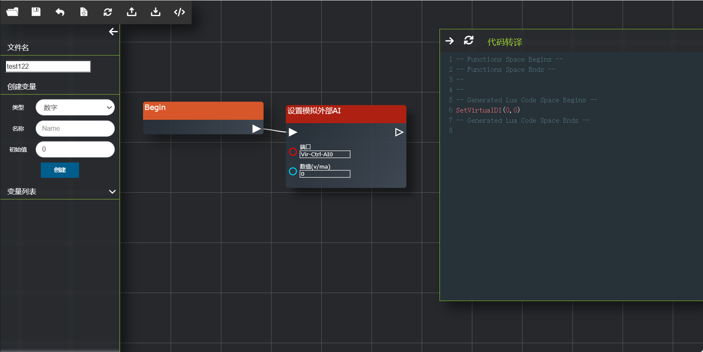

.. centered:: 图表 6.2.32 “设置模拟外部AI”指令节点界面

扩展IO命令节点
++++++++++++++++

点击“获取模拟外部DI”/“获取模拟外部AI”指令节点,进入节点图编辑界面

Aux-IO是机器人与PLC通讯控制外部扩展IO的指令功能，需要机器人与PLC建立UDP通讯。

1.“获取模拟外部DI”指令节点,参数: 

- 端口：Vir-Ctrl-DI0 ~ Vir-Ctrl-DI15(GetVirtualDI,[0~15]), Vir-End-DI0 ~ Vir-End-DI1(GetVirtualToolDI,[1~2])
  
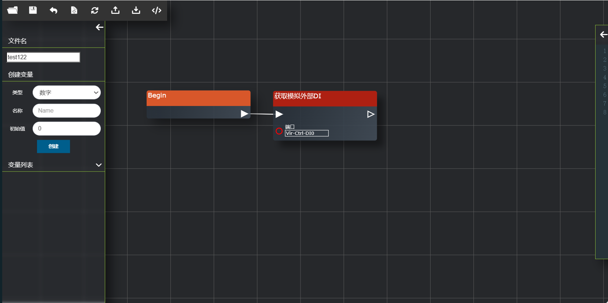

.. centered:: 图表 6.2.33 “获取模拟外部DI”指令节点界面
   
2.“设置模拟外部AI”指令节点,参数: 

- 端口：Vir-Ctrl-AI0 ~ Vir-Ctrl-AI0(GetVirtualAI,[0~1]), Vir-End-AI0(GetVirtualToolAI,[0])

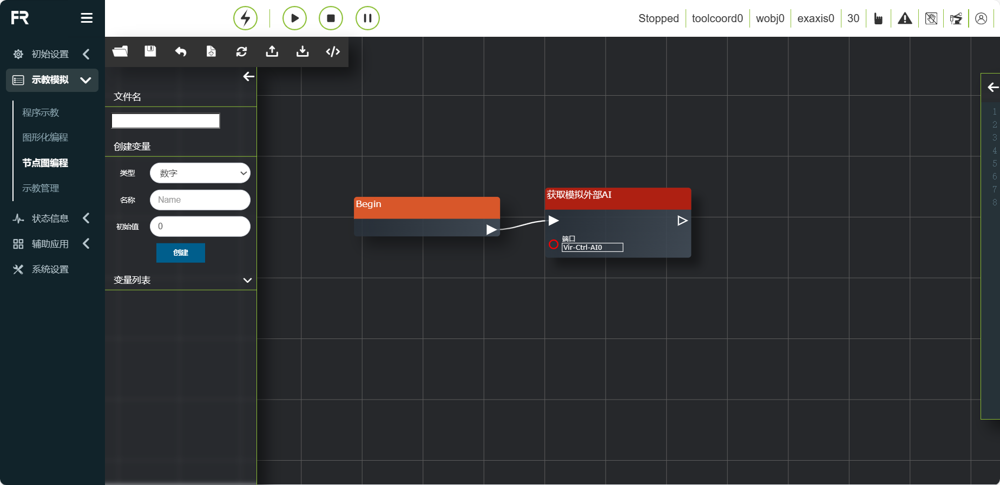

.. centered:: 图表 6.2.34 “设置模拟外部AI”指令节点界面

3.“配置UDP通信”指令节点,参数: 

- ip：ip地址
- 端口：端口号
- 通信周期(ms)：0 ~ 10000

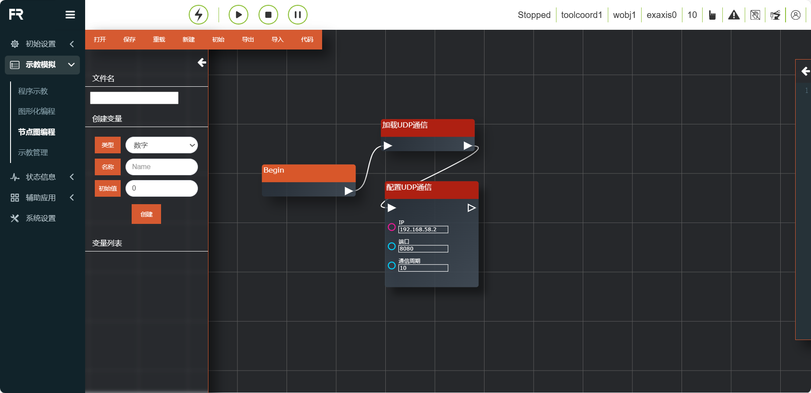

.. centered:: 图表 6.2.35 “配置UDP通信”指令节点界面

运动DO命令
++++++++++++++++

点击“运动DO”指令节点,进入节点图编辑界面

该指令实现直线运动过程中，根据设定的间隔，连续输出DO信号功能。

“运动DO”指令节点,参数: 

- 端口：Ctrl-DO0 ~ Ctrl-DO0(MoveDOStart,[0~15]), End-DO1(MoveDOStart,[0~1])
- 设定间隔(mm): 0 ~ 500
- 输出脉冲占空比(%): 0 ~ 99
  
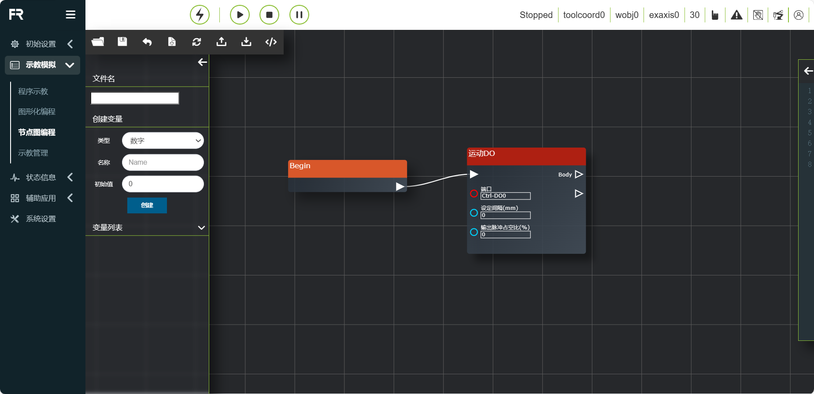

.. centered:: 图表 6.2.36 “运动DO”指令节点界面

坐标系命令
++++++++++++++++

点击“设置工具坐标系”/“设置工件坐标系”相关指令节点,进入节点图编辑界面

在该指令中，分为“设置工具坐标系”和“设置工件坐标系”两部分功能。

选择工具坐标系名称，点击“应用”添加该指令到程序中，当程序运行该语句，会设定机器人的工具坐标系。

1.“设置工具坐标系”指令节点,参数: 

- 工具坐标系名称：toolcoord1 ~ toolcoord14(SetToolList,[0~14]), etoolcoord0 ~ etoolcoord14(SetExToolList, [0~14])
  
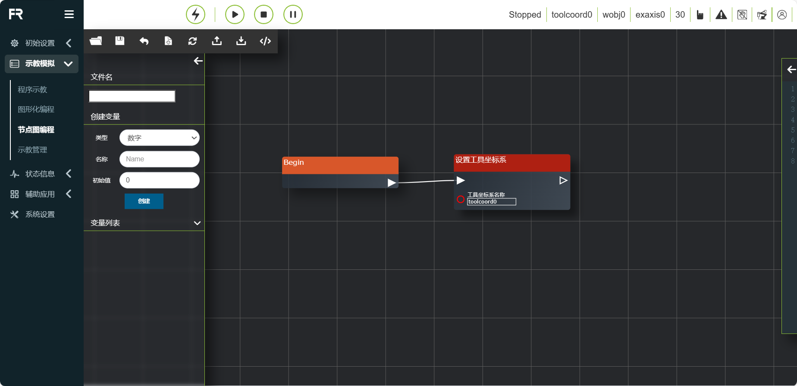

.. centered:: 图表 6.2.37 “设置工具坐标系”指令节点界面

2.“设置工件坐标系”指令节点,参数: 

- 工件坐标系名称：wobjcoord1 ~ wobjcoord14
  
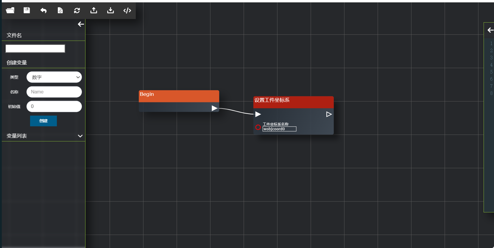

.. centered:: 图表 6.2.38 “设置工件坐标系”指令节点界面

“模式切换”命令
++++++++++++++++

点击“模式切换”指令节点，进入节点图编程界面

该指令可切换机器人到手动模式，通常在一个程序结尾处添加，以便用户在程序运行结束后，使机器人自动切换到手动模式，拖动机器人。

“模式切换”指令节点,参数: 

- 模式切换：手动模式

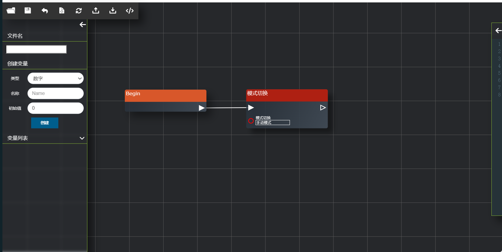

.. centered:: 图表 6.2.39 “模式切换”指令节点界面

“碰撞等级”命令
++++++++++++++++

点击“碰撞等级”指令节点，进入节点图编程界面

该指令碰撞等级设置，通过该指令可以在程序运行中实时调节各轴碰撞等级，更灵活的部署应用场景。

“碰撞等级”指令节点,参数: 

- 标准等级：标准等级/自定义百分比
- joint1-joint6(N): 0 ~ 100，碰撞阈值，数组型

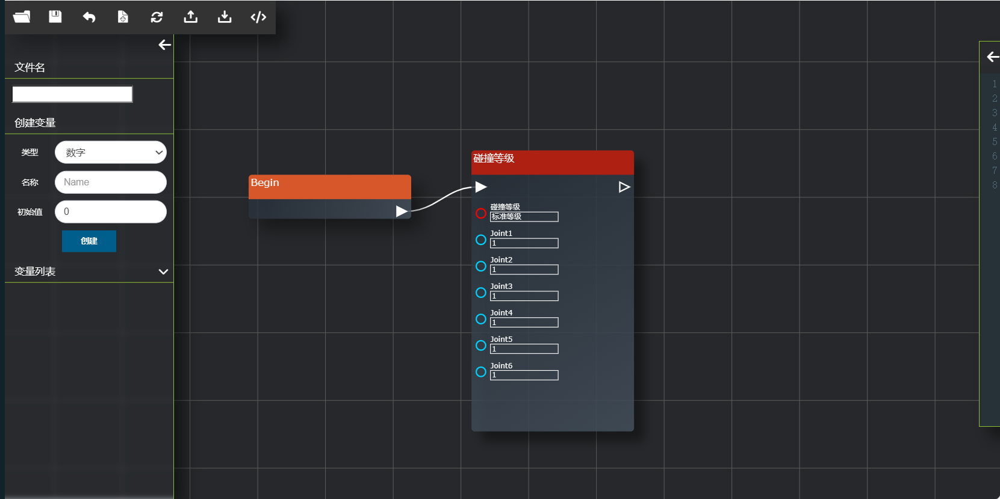

.. centered:: 图表 6.2.40 “碰撞等级”指令节点界面

“加速度”命令
++++++++++++++++

点击“加速度”指令节点，进入节点图编程界面

“加速度”命令是实现机器人加速度可单独设置功能，通过调节运动指令加速度缩放因子，可以增加或减小加减速时间，实现机器人动作节拍时间可调。

“加速度”指令节点,参数: 

- 加速度百分比(%)：0 ~ 100

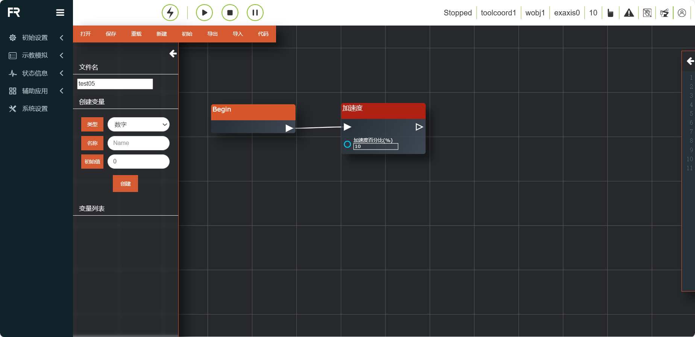

.. centered:: 图表 6.2.41 “加速度”指令节点界面
   
“外设”指令界面
~~~~~~~~~~~~~~~

夹爪指令
+++++++++++++++++

该指令分为“夹爪运动”、“夹爪激活”和“夹爪复位”。

指令中，显示完成配置并且已被激活的夹爪编号，对夹爪开闭、开闭速度和开闭力矩的设置，数值为百分比，是否阻塞功能选项，选择阻塞即夹爪运动需等待上一条运动指令执行完才执行，选择非阻塞即夹爪运动与上一条运动指令并行。

“夹爪运动”节点,参数: 

- 夹爪编号：已被激活的夹爪编号
- 夹爪位置：0~100
- 开闭速度：0~100
- 开闭力矩：0~100
- 最大时间(ms)：0~30000
- 是否阻塞：false/true

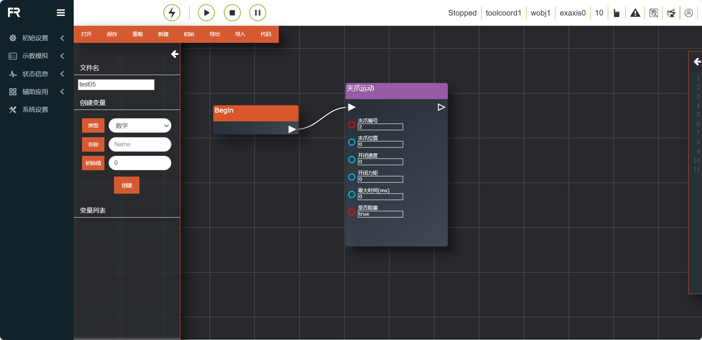

.. centered:: 图表 6.2.42 “夹爪运动”节点界面

夹爪复位指令，显示已经配置的夹爪编号，可以添加夹爪复位指令到程序中。

“夹爪复位”节点,参数: 

- 夹爪编号：已被激活的夹爪编号

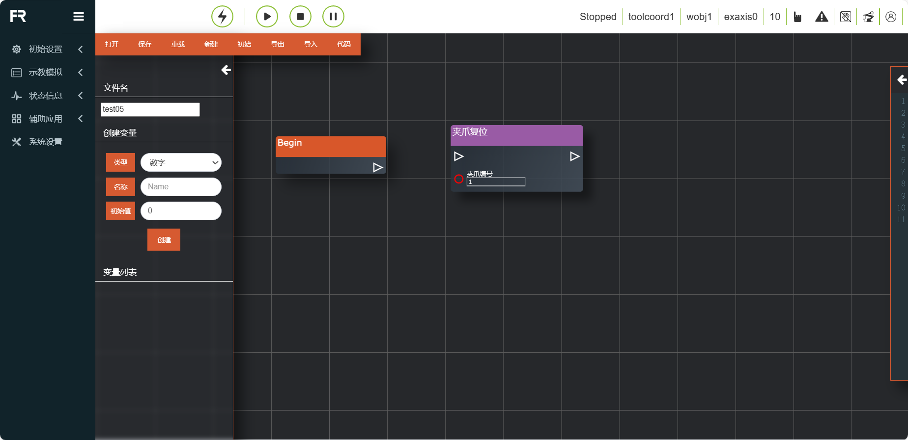

.. centered:: 图表 6.2.43 “夹爪复位”节点界面

夹爪激活指令，显示已经配置的夹爪编号，可以添加夹爪激活指令到程序中。

“夹爪激活”节点,参数: 

- 夹爪编号：已被激活的夹爪编号

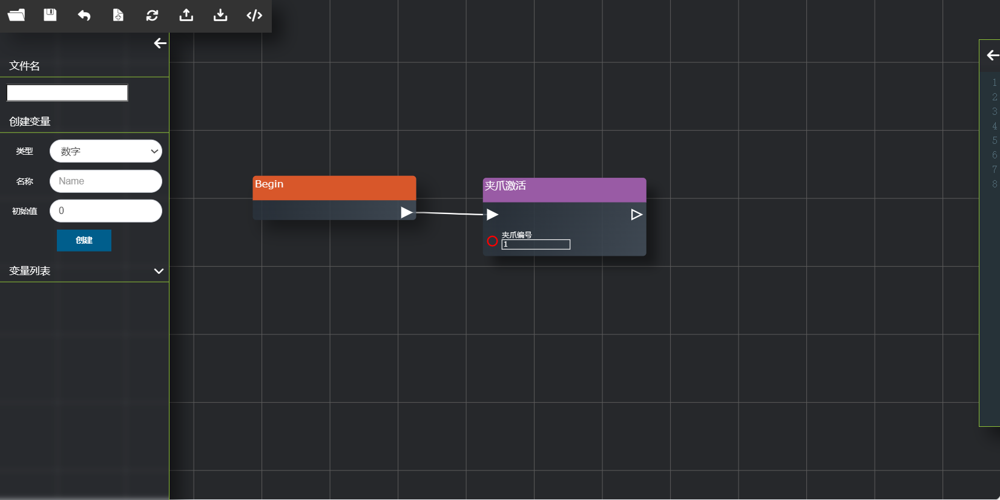

.. centered:: 图表 6.2.44 “夹爪激活”节点界面

喷枪指令
+++++++++++++++++

该指令为喷涂相关指令，控制喷枪“开始喷涂”、“停止喷涂”、“开始清枪”和“停止清枪”。在编辑该程序相关节点时，需确认已经配置好喷枪外设，否则无法保存。详见机器人外设章节。

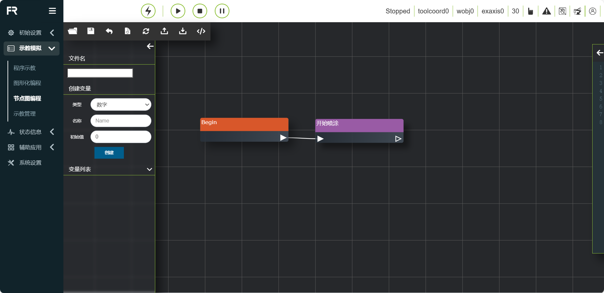

.. centered:: 图表 6.2.45 “开始喷涂”指令节点界面

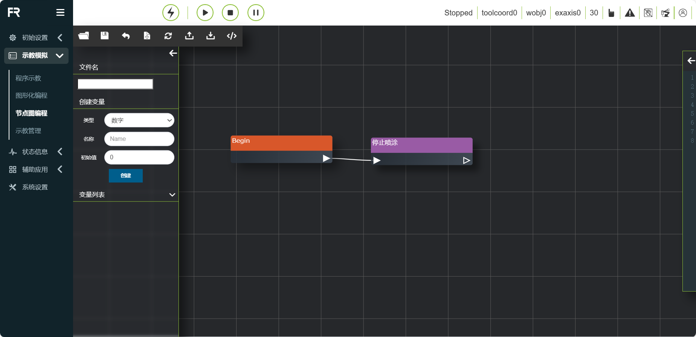

.. centered:: 图表 6.2.46 “停止喷涂”指令节点界面

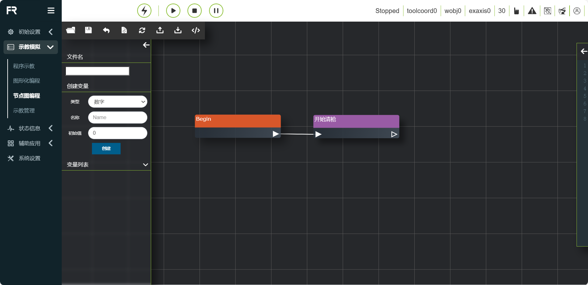

.. centered:: 图表 6.2.47 “开始清枪”指令节点界面

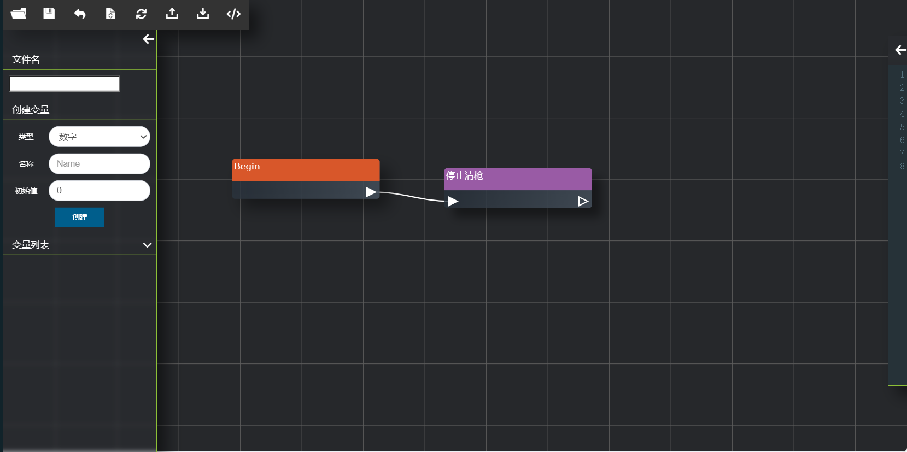

.. centered:: 图表 6.2.48 “停止清枪”指令节点界面

扩展轴指令（控制器+PLC）
++++++++++++++++++++++++++++++++++

该指令针对使用外部轴的场景，与PTP指令组合使用，可将空间上一点X轴方向上的移动分解到外部轴运动。选择外部轴编号，运动方式选同步，选择需要到达的点。

分为UDP通信加载/配置、异步运动、同步PTP/LIN运动、同步ARC运动、回零指令和使能指令。

“UDP通信配置”指令节点,输入IP地址、端口号和通信周期；

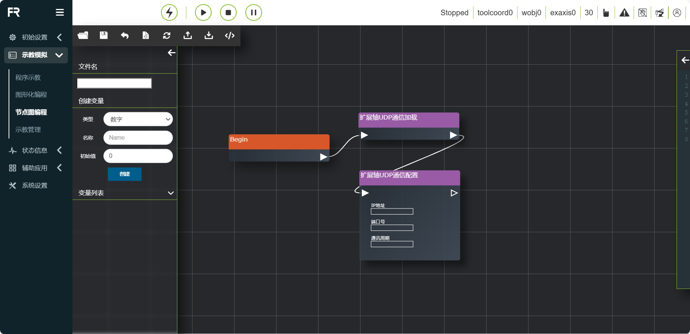

.. centered:: 图表 6.2.49 “UDP通信配置”指令节点界面

“异步运动”指令节点,参数：

- 点名称：示教点位
- 调试速度(%)：0~100

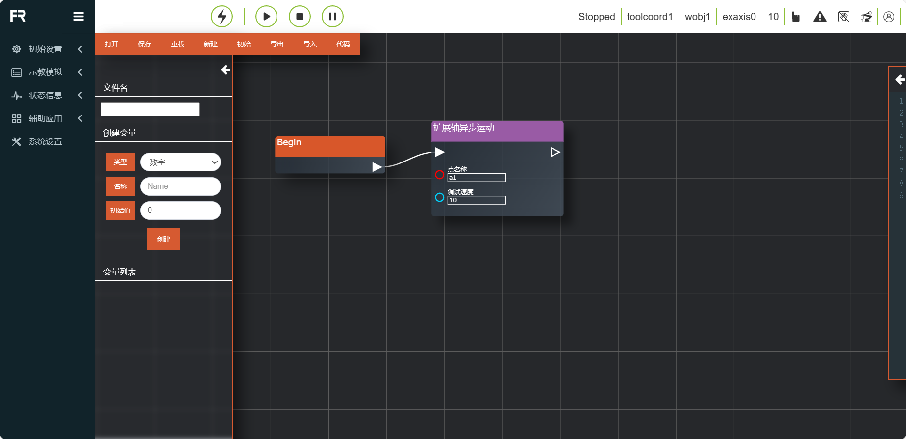

.. centered:: 图表 6.2.50 “异步运动”指令节点界面

“同步PTP/LIN运动”指令节点,参数：

- 运动选择：PTP/LIN
- 点名称：示教点位
- 调试速度(%)：0~100

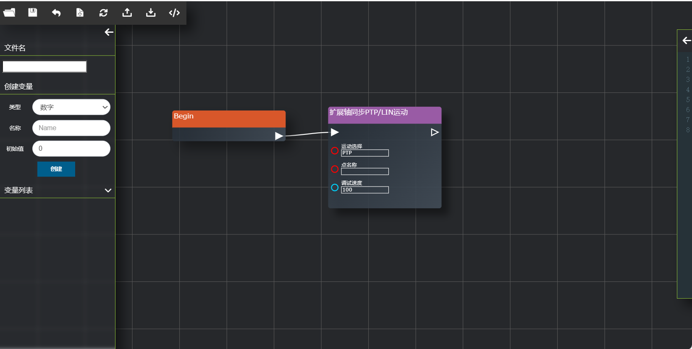

.. centered:: 图表 6.2.51 “同步PTP/LIN运动”指令节点界面

“同步ARC运动”指令节点,默认运动方式为ARC,参数：

- 点名称：示教点位
- 调试速度(%)：0~100

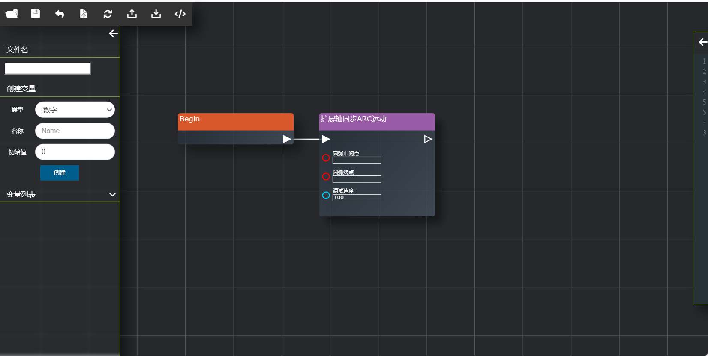

.. centered:: 图表 6.2.52 “同步ARC运动”指令节点界面

“回零”指令节点,,参数：

- 扩展轴编号：1~4
- 回零方式：当前位置回零/负限位回零/正限位回零
- 寻零速度：0~2000，默认位5
- 零点箍位速度：0~2000，默认为1

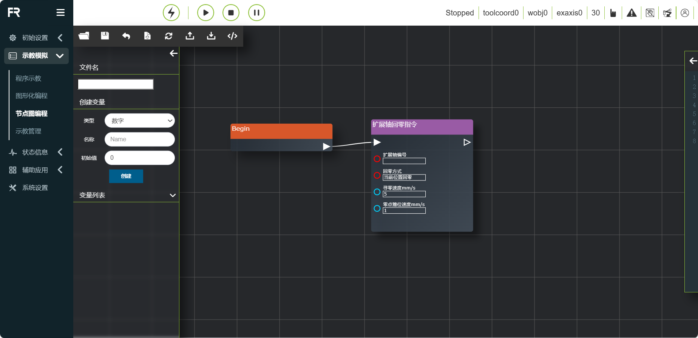

.. centered:: 图表 6.2.53 “回零”指令节点界面

“使能”指令节点,,参数：

- 扩展轴编号：1~4

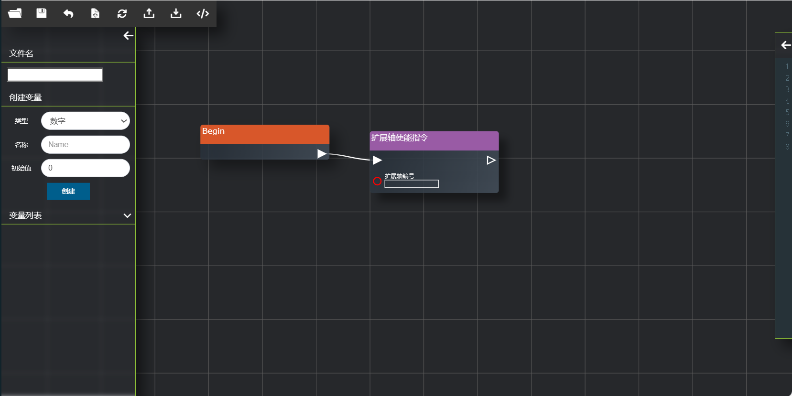

.. centered:: 图表 6.2.54 “使能”指令节点界面

扩展轴指令（控制器+伺服驱动器）
++++++++++++++++++++++++++++++++++

该指令可对扩展轴参数进行配置。根据不同的控制模式设置不同的参数。已配置好的扩展轴，可对其零点设定。

分为伺服ID、控制模式、伺服使能和伺服回零；控制模式中又分为位置模式和速度模式，这两个节点需要结合控制模式使用，否则单独添加无法生效。

“伺服ID”指令节点,,参数：

- 伺服ID：1~15

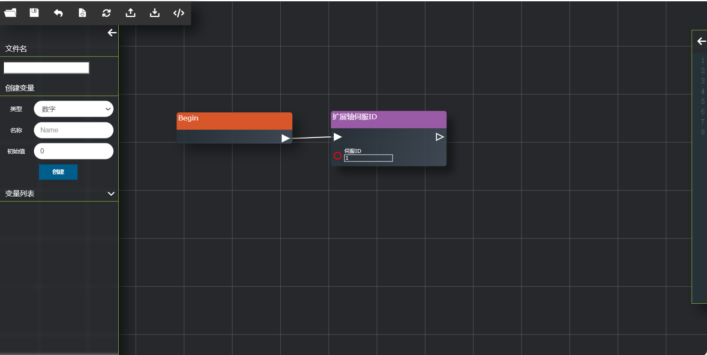

.. centered:: 图表 6.2.55 “伺服ID”指令节点界面

“控制模式”指令节点,,参数：

- 伺服ID：1~15
- 控制模式：位置模式/速度模式

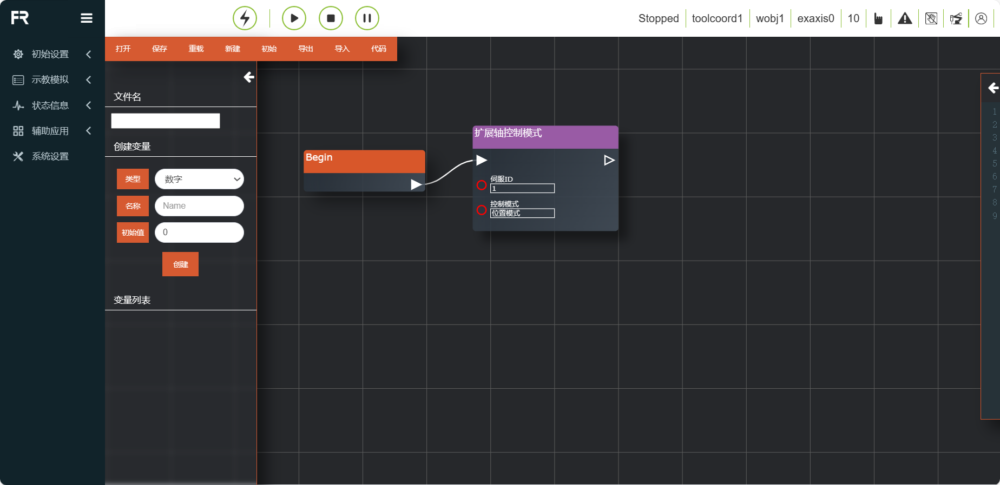

.. centered:: 图表 6.2.56 “控制模式”指令节点界面

“伺服使能”指令节点,,参数：

- 伺服ID：1~15
- 伺服使能：伺服使能/去除使能

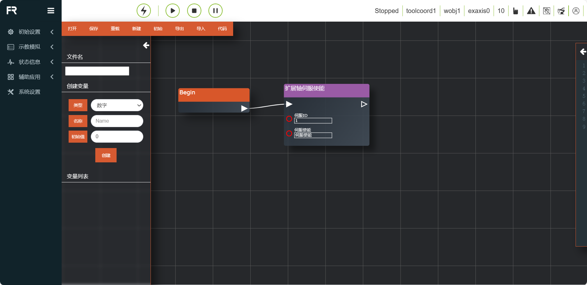

.. centered:: 图表 6.2.57 “伺服使能”指令节点界面

“伺服回零”指令节点,,参数：

- 伺服ID：1~15
- 回零方式：当前位置回零/负限位回零/正限位回零
- 寻零速度：0~2000，默认位5
- 零点箍位速度：0~2000，默认为1

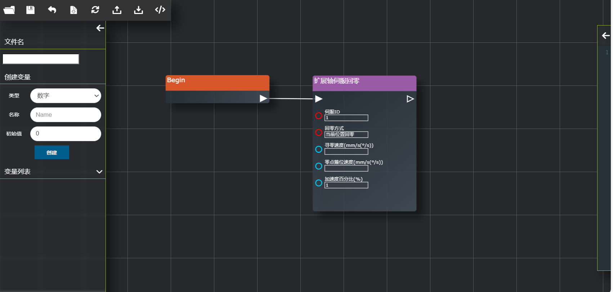

.. centered:: 图表 6.2.58 “伺服回零”指令节点界面

“位置模式”指令节点,参数：

- 伺服ID：1~15
- 目标位置：无限制
- 寻零速度：无限制

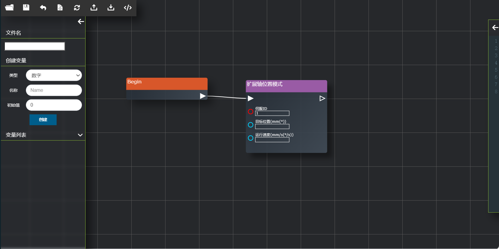

.. centered:: 图表 6.2.59 “位置模式”指令节点界面

“速度模式”指令节点,参数：

- 伺服ID：1~15
- 目标速度：无限制

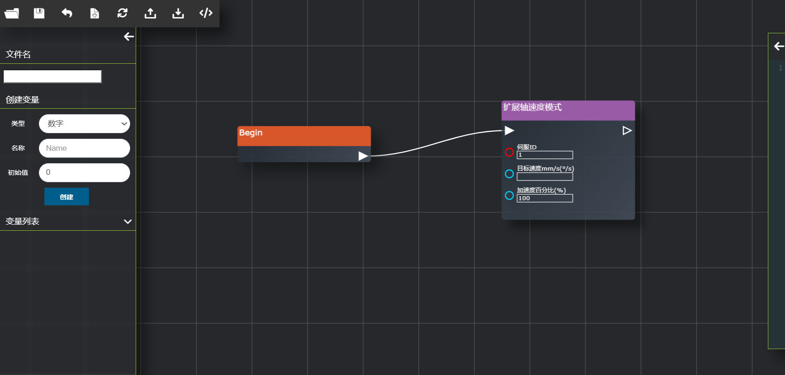

.. centered:: 图表 6.2.60 “速度模式”指令节点界面

传送带指令
++++++++++++++++++++++++++++++++++

该指令包含IO实时检测，位置实时检测，跟踪开启和跟踪关闭四条命令。详见机器人外设章节

“IO实时检测”指令节点,参数：

- 最大等待时间：0~10000

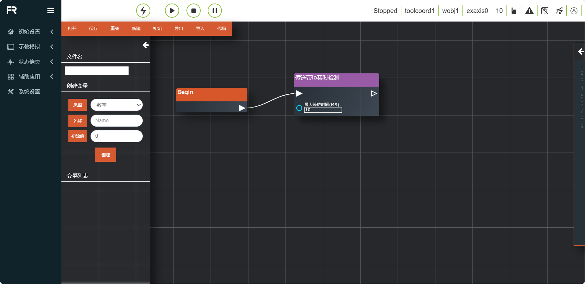

.. centered:: 图表 6.2.61 “IO实时检测”指令节点界面

“位置实时检测”指令节点,参数：

- 工作模式：跟踪抓取/跟踪运动/TPD跟踪

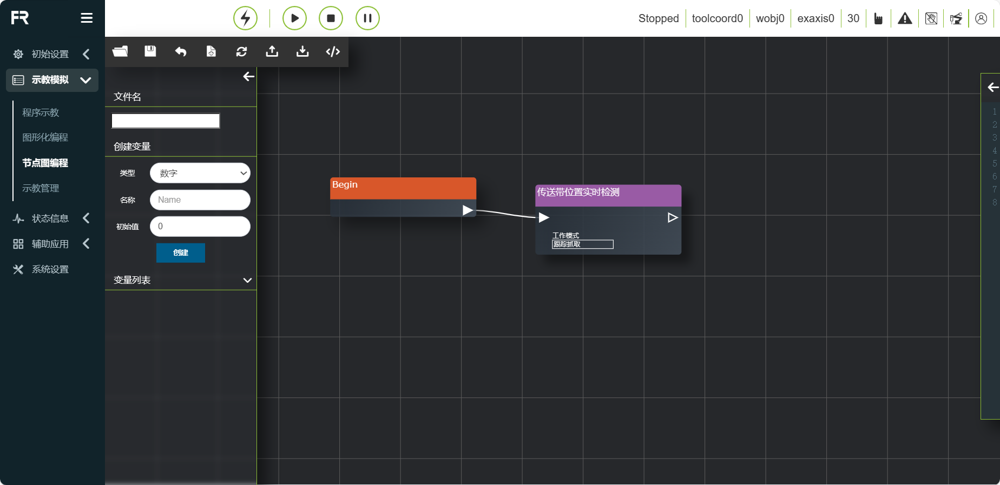

.. centered:: 图表 6.2.62 “位置实时检测”指令节点界面

“跟踪开启”指令节点,参数：

- 工作模式：跟踪抓取/跟踪运动/TPD跟踪

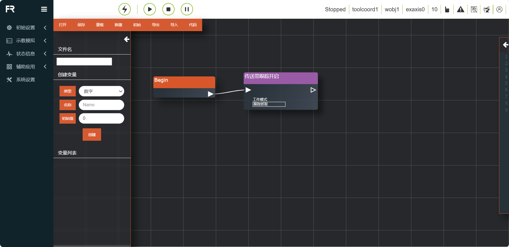

.. centered:: 图表 6.2.63 “跟踪开启”指令节点界面

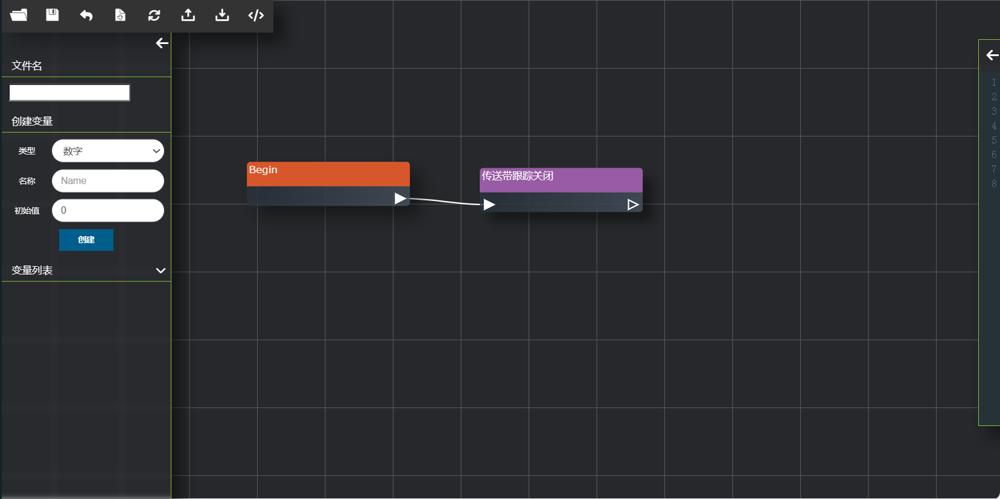

.. centered:: 图表 6.2.64 “跟踪关闭”指令节点界面

打磨指令
++++++++++++++++++++++++++++++++++

该指令用于打磨场景的使用，使用时需要先卸载驱动再加载驱动，然后设置打磨设备使能。进而设置打磨设备的转速、接触力、伸出距离和控制模式，同时可以对打磨设备错误清除和设备力传感器清零。

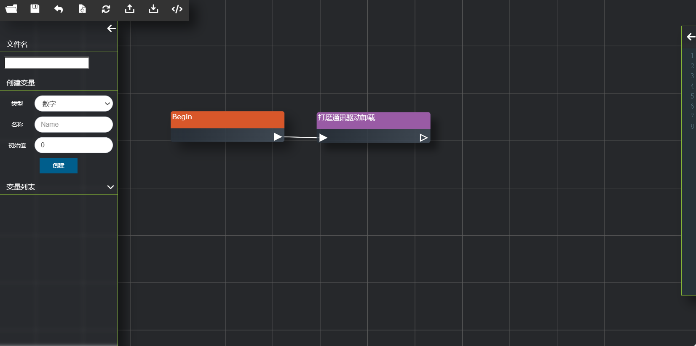

.. centered:: 图表 6.2.65 “通讯驱动卸载”指令节点界面

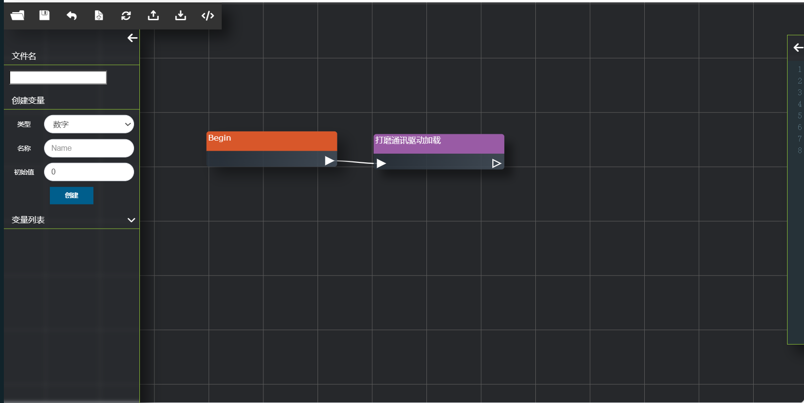

.. centered:: 图表 6.2.66 “通讯驱动加载”指令节点界面

“设备使能”指令节点,参数：

- 设备使能：上使能/下使能

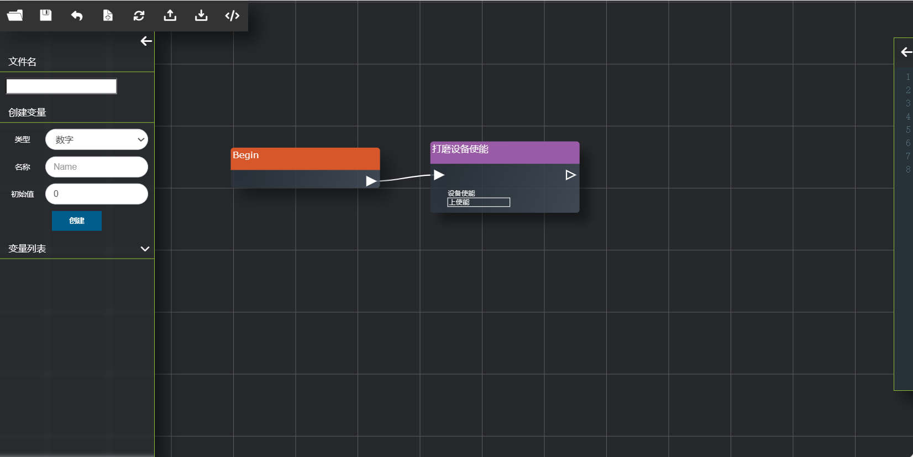

.. centered:: 图表 6.2.67 “设备使能”指令节点界面

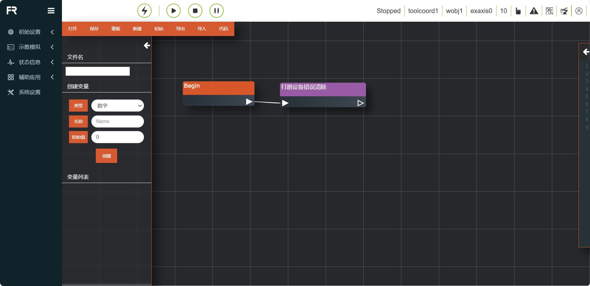

.. centered:: 图表 6.2.68 “设备错误清除”指令节点界面

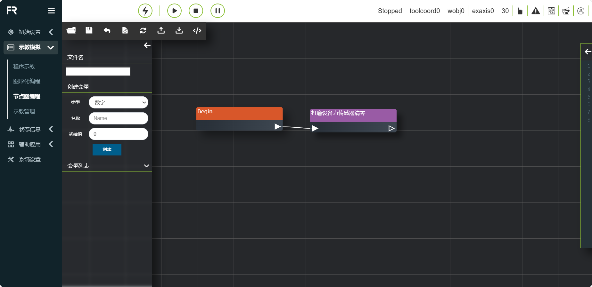

.. centered:: 图表 6.2.69 “设备力传感器清零”指令节点界面

“转速”指令节点,参数：

- 转速：0~5500

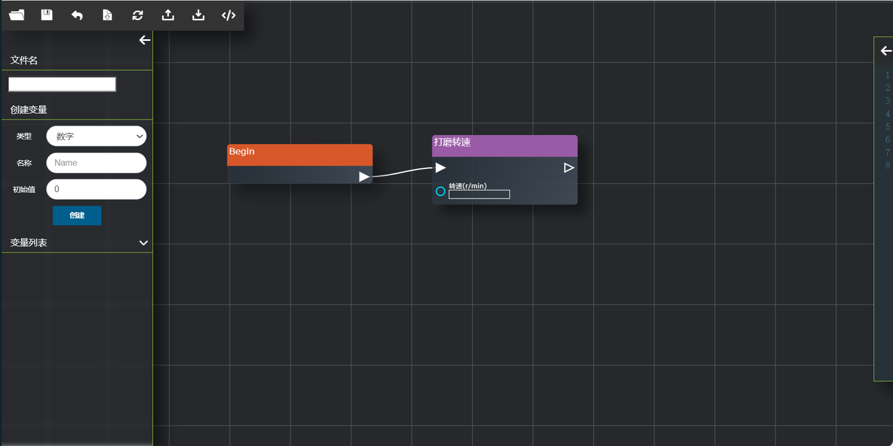

.. centered:: 图表 6.2.70 “转速”指令节点界面

“接触力”指令节点,参数：

- 接触力：0~200

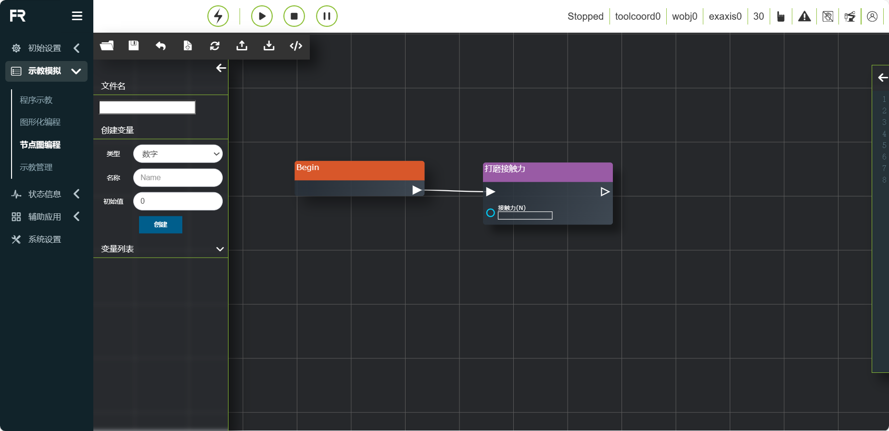

.. centered:: 图表 6.2.71 “接触力”指令节点界面

“伸出距离”指令节点,参数：

- 伸出距离：0~12

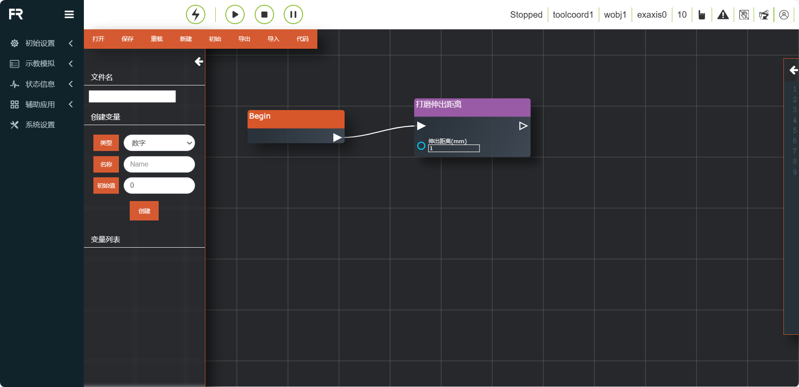

.. centered:: 图表 6.2.72 “伸出距离”指令节点界面

“控制模式”指令节点,参数：

- 控制模式：回零模式/位置模式/力矩模式

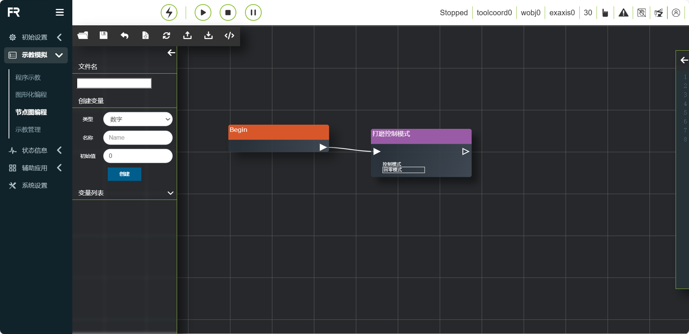

.. centered:: 图表 6.2.73 “控制模式”指令节点界面

“焊接”指令界面 
~~~~~~~~~~~~~~~

焊接指令
++++++++++

点击“焊接相关指令节点，进入节点图编程界面

该指令主要用于焊机外设，在添加该指令前请确认在用户外设中焊机配置是否完成，详见机器人外设章节。

1.“焊机电压”指令节点,参数：

- 焊机电压：最小值为0

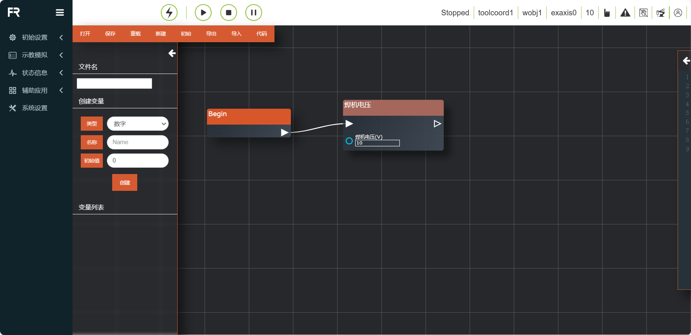

.. centered:: 图表 6.2.74 “焊机电压”指令节点界面

2.“焊机电流”指令节点,参数：

- 焊机电流：最小值为0

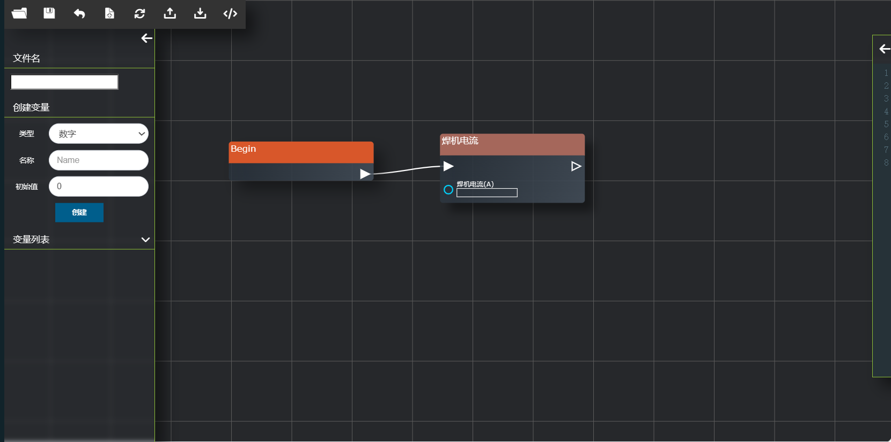

.. centered:: 图表 6.2.75 “焊机电流”指令节点界面

3.“收弧/起弧”指令节点,参数：

- I/O类型：控制器IO/扩展IO
- 焊接工艺编号： 0 ~ 7
- 最大等待时间(ms): 0 ~ 10000

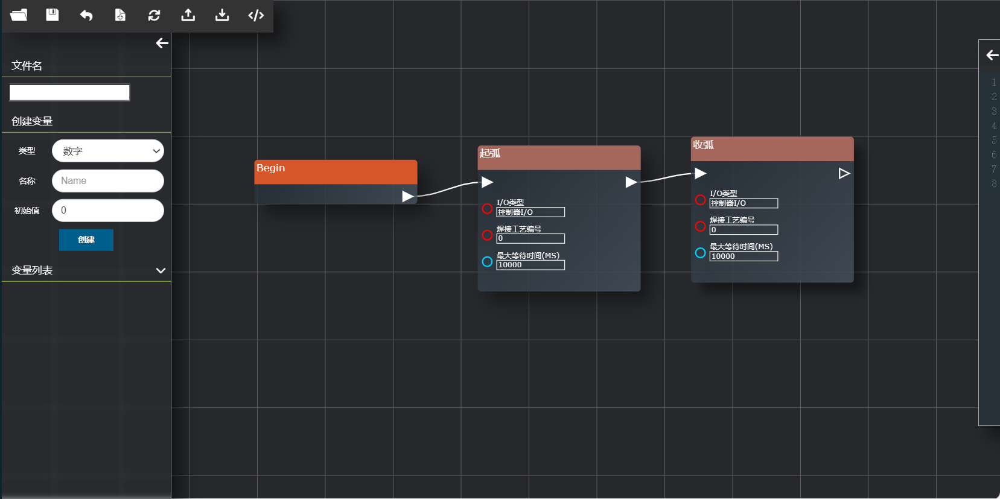

.. centered:: 图表 6.2.76 “收弧/起弧”指令节点界面

4.“送气/关气”指令节点,参数：

- I/O类型：控制器IO/扩展IO

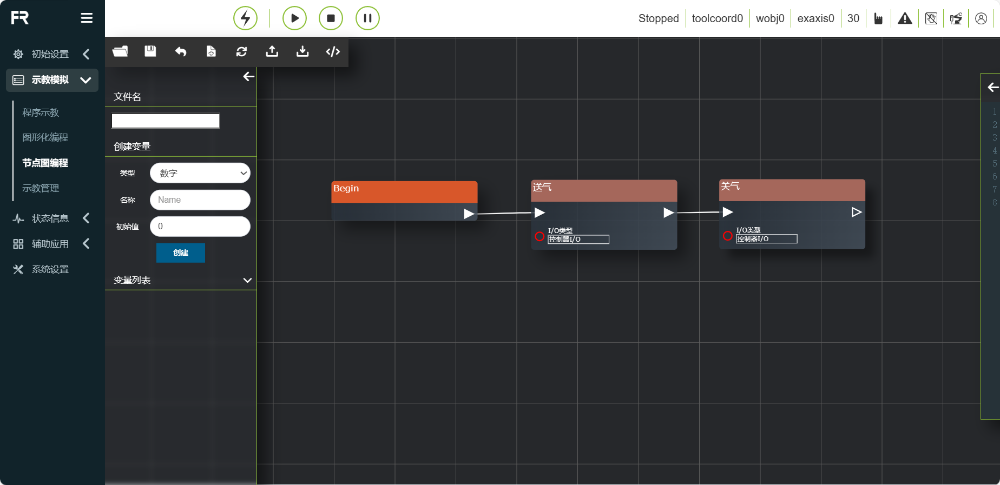

.. centered:: 图表 6.2.77 “送气/关气”指令节点界面

5.“正向送丝/停止正向送丝”指令节点,参数：

- I/O类型：控制器IO/扩展IO

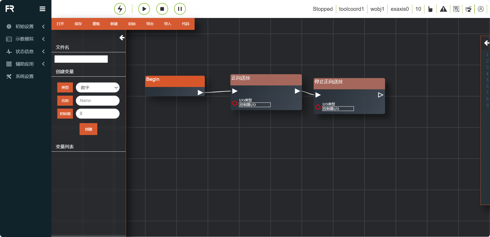

.. centered:: 图表 6.2.78 “正向送丝/停止正向送丝”指令节点界面

5.“反向送丝/停止反向送丝”指令节点,参数：

- I/O类型：控制器IO/扩展IO

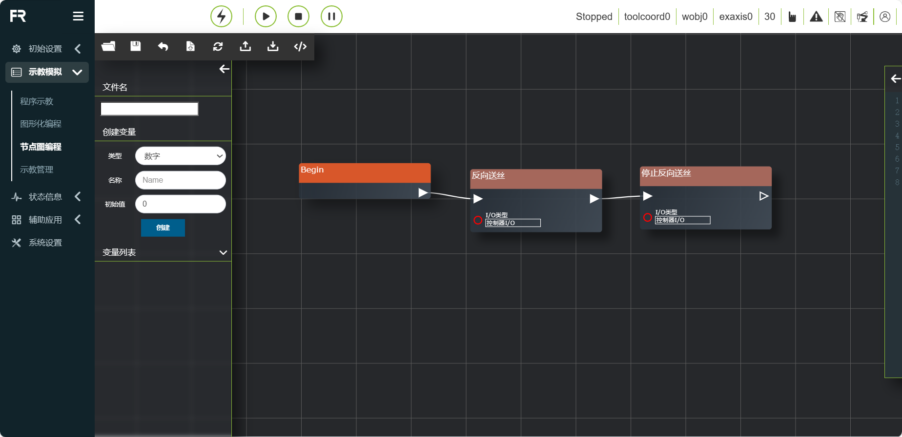

.. centered:: 图表 6.2.79 “反向送丝/停止反向送丝”指令节点界面

段焊指令
++++++++++

该指令为焊接专用指令，主要用于一段焊，一段不焊的循环间断焊接场景。在起点与终点之间，使用该指令，选择起点和终点，设置调试速度，设置起弧的DO端口，执行长度，非执行长度，根据实际应用场景设置功能模式，摆动选择和取整规则即可实现段焊功能。

“段焊”指令节点,参数：

- 起始点：示教点位
- 终点：示教点位
- 调试速度(%)：0~100，默认为100
- 起弧do端口：Ctrl-DO0~7，Ctrl-CO0~7
- 执行长度：0~1000
- 非执行长度：0~1000
- 功能模式：0~100，默认为100
- 摆动选择：执行段不摆动/执行段摆动
- 取整规则：不取整/循环取整/单段取整

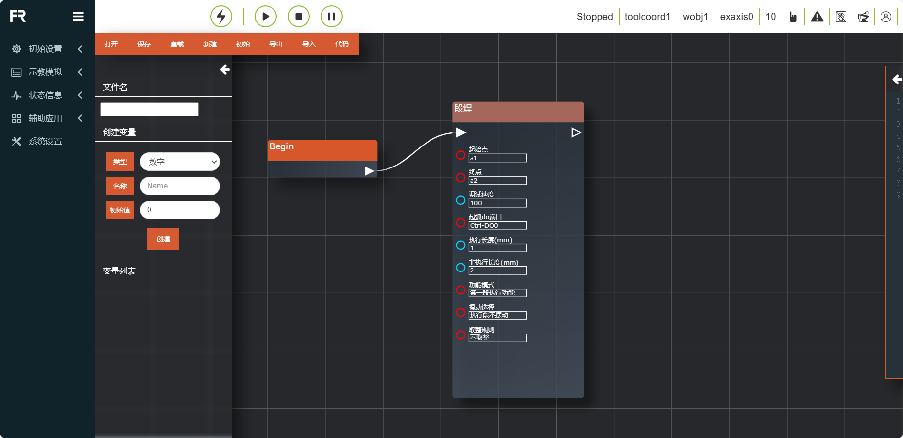

.. centered:: 图表 6.2.80 “段焊”指令节点界面

激光跟踪指令
++++++++++++++

点击“激光跟踪”指令节点，进入节点图编程界面

该指令包含激光命令、跟踪命令和寻位命令三部分，在添加该指令前，请确认用户外设中激光跟踪传感器是否已经配置成功。详见机器人外设章节。

1.“打开/关闭传感器”指令节点，参数

- 选择焊缝类型：0 ~ 49
  
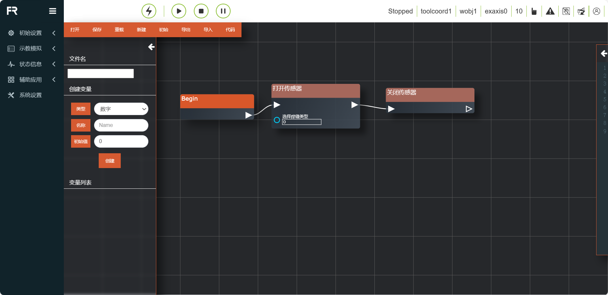

.. centered:: 图表 6.2.81 “打开/关闭传感器”指令节点界面

2.“加载/卸载传感器”指令节点，参数

- 功能选择：睿牛RRT-SV2-BP/创想CXZK-RBTA4L
  
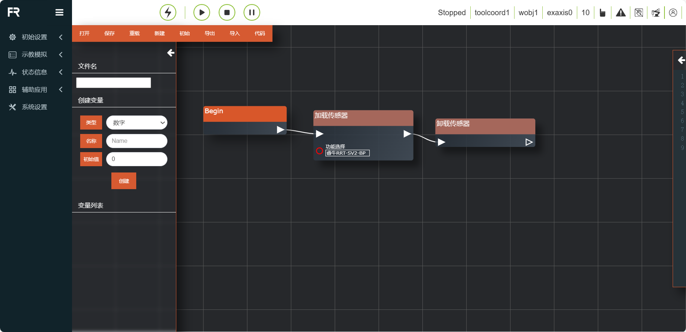

.. centered:: 图表 6.2.82 “加载/卸载传感器”指令节点界面

3.“开始/停止跟踪”指令节点，参数

- 坐标系名称：自定义配置坐标系
  
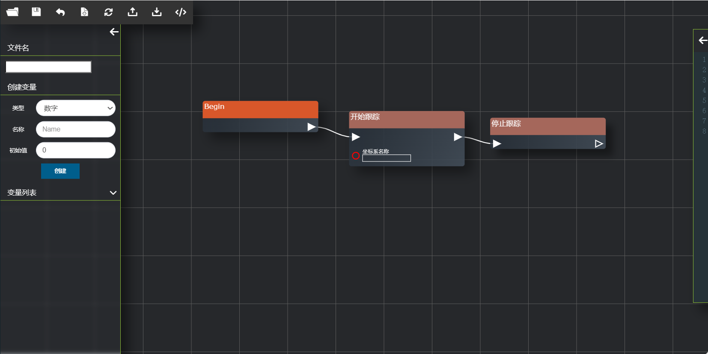

.. centered:: 图表 6.2.83 “开始/停止跟踪”指令节点界面

4.“数据记录”指令节点，参数

- 功能选择：停止记录/实时跟踪/开始记录/轨迹复现
- 等待时间(ms)： 0 ~ 10000
  
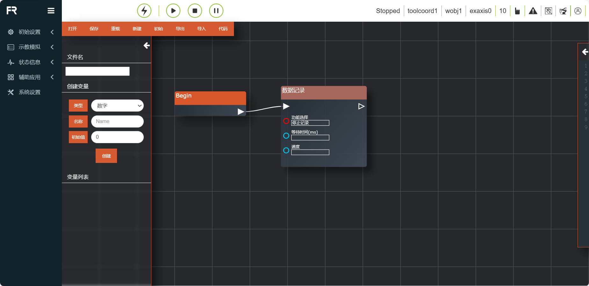

.. centered:: 图表 6.2.84 “数据记录”指令节点界面

5.“激光跟踪复现”指令节点，参数
  
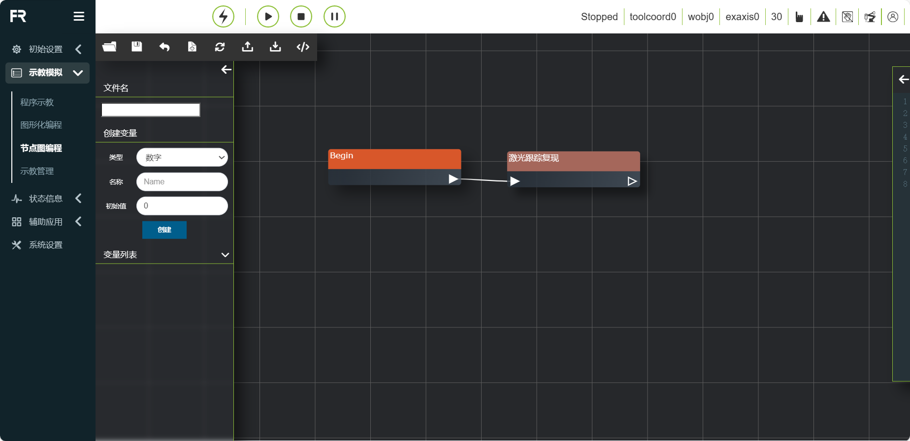

.. centered:: 图表 6.2.85 “激光跟踪复现”指令节点界面

6.“传感器取点运动”指令节点，参数

- 坐标系名称：自定义配置坐标系
- 运动方式： PTP/Lin
- 调试速度(%)： 0 ~ 100
  
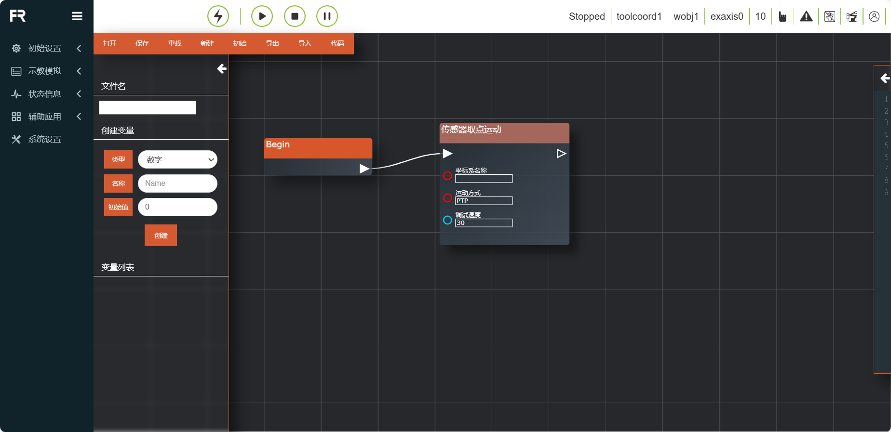

.. centered:: 图表 6.2.86 “传感器取点运动”指令节点界面

7.“寻位开始/结束”指令节点，参数

- 坐标系名称：自定义配置坐标系
- 方向： +x/-x/+y/-y/+z/-z/指定方向
- 方向点：未选择“指定方向”时，参数失效
- 速度(%): 0 ~ 100
- 长度(mm): 0 ~ 1000
- 最大寻位时间(ms): 0 ~ 10000
  
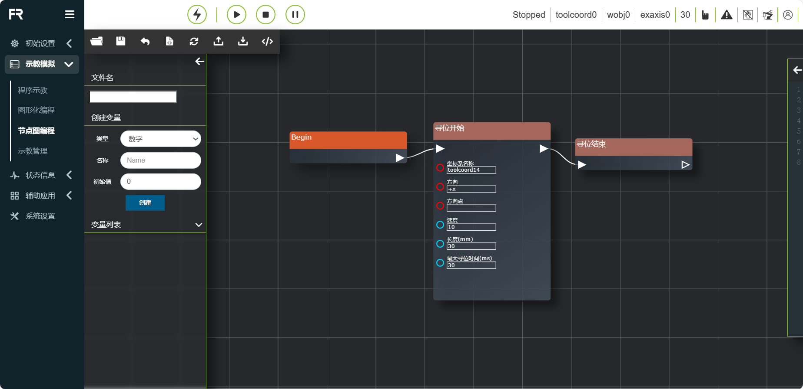

.. centered:: 图表 6.2.87 “寻位开始/结束”指令节点界面

激光记录指令
++++++++++++++++++++++++++++++++++

该指令实现激光跟踪记录起点、终点取出功能，使机器人可以自动运动到起点位置，适用于从工件外部开始运动并进行激光跟踪记录的场合，同时上位机可获取记录数据中起点、终点的信息，用于后续运动。

实现激光跟踪复现速度可调功能，使机器人可以用一个很快的速度进行记录，然后按照正常焊接速度进行复现，可以提高作业效率。

“焊缝数据记录”指令节点,参数：

- 功能选择：停止记录/实时跟踪/开始记录/轨迹复现
- 等待时间(ms)：0~10000，默认为10
- 速度(%)：0~100，默认为30，选择轨迹复现时，该参数生效

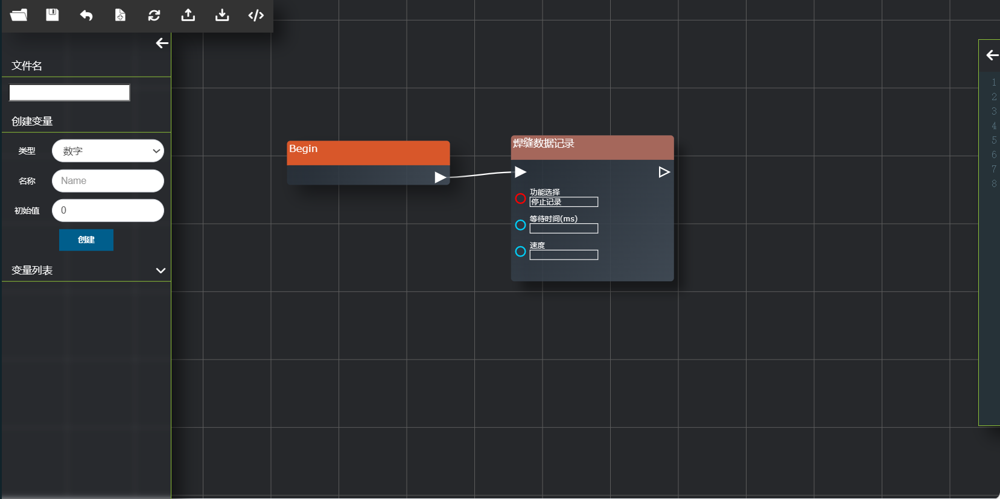

.. centered:: 图表 6.2.88 “焊缝数据记录”指令节点界面

“获取焊缝起点/终点”指令节点,参数：

- 运动方式：PTP/LIN
- 速度(%)：0~100，默认为30

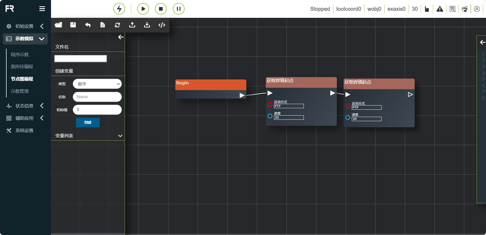

.. centered:: 图表 6.2.89 “获取焊缝起点/终点”指令节点界面

焊丝寻位指令
++++++++++++++++++

该指令一般应用于焊接场景中，需要焊机与机器人IO和运动指令相结合使用。分为寻位开始、寻位结束、寻位点设置、计算偏移量和接触点数据写入。

“焊丝寻位开始/结束”指令节点,参数：

- 基准位置：不更新/更新
- 寻位速度：0~100
- 寻位距离：0~1000
- 自动返回标志：不自动返回/自动返回
- 自动返回速度：0~100
- 自动返回距离：0~1000
- 寻位方式：示教点寻位/带偏移量寻位

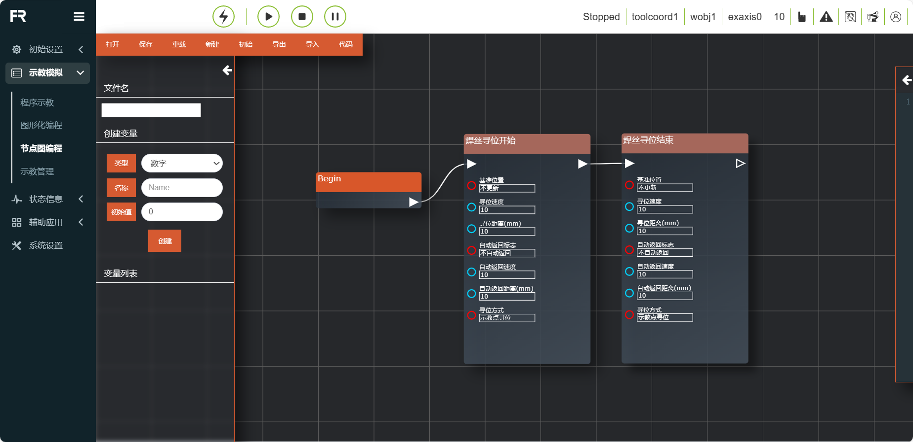

.. centered:: 图表 6.2.90 “焊丝寻位开始/结束”指令节点界面

寻位点设置根据焊缝类型和计算方法添加点位。

- 当类型为角焊缝，计算方法为1D（xyz中的一个）时，点位添加从a点、b点中选择；
- 当类型为角焊缝，计算方法为2D（xyz中的两个）时，点位添加从a点、b点、e点、f点中选择；
- 当类型为角焊缝，计算方法为3D（xyz）时，点位添加从a点、b点、c点、d点、e点、f点中选择；
- 当类型为角焊缝，计算方法为2D+（xyz中的两个，rxryrz中的一个）时，点位添加从a点、b点、c点、d点、e点、f点中选择；
- 当类型为内外径，计算方法为2D2D（xyz中的两个）时，点位添加从a点、b点中选择；
- 当类型为点，计算方法为3D（xyz）时，点位添加从a点、b点、c点、d点、e点、f点中选择；
- 当类型为相机，计算方法为3D+（xyzrxryrz）时，点位添加从a点、b点中选择；
- 当类型为面，计算方法为3D+（xyzrxryrz）时，点位添加从a点、b点中选择；

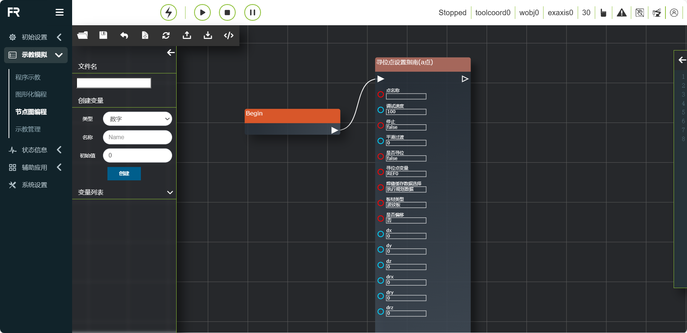

.. centered:: 图表 6.2.91 “寻位点设置”指令节点界面

计算偏移量根据焊缝类型和计算方法设置基准点和接触点。

- 当类型为角焊缝，计算方法为1D（xyz中的一个）时，设置基准点1、接触点1；
- 当类型为角焊缝，计算方法为2D（xyz中的两个）时，设置基准点1、基准点2、接触点1、接触点2；
- 当类型为角焊缝，计算方法为3D（xyz）时，设置基准点1、基准点2、基准点3、接触点1、接触点2、接触点3；
- 当类型为角焊缝，计算方法为2D+（xyz中的两个，rxryrz中的一个）时，设置基准点1、基准点2、基准点3、接触点1、接触点2、接触点3；
- 当类型为内外径，计算方法为2D2D（xyz中的两个）时，设置基准点1、基准点2、基准点3、接触点1、接触点2、接触点3；
- 当类型为点，计算方法为3D（xyz）时，设置接触点1、接触点2；
- 当类型为相机，计算方法为3D+（xyzrxryrz）时，设置接触点1、接触点2；
- 当类型为面，计算方法为3D+（xyzrxryrz）时，设置接触点1、接触点2、接触点3、接触点4、接触点5、接触点6；

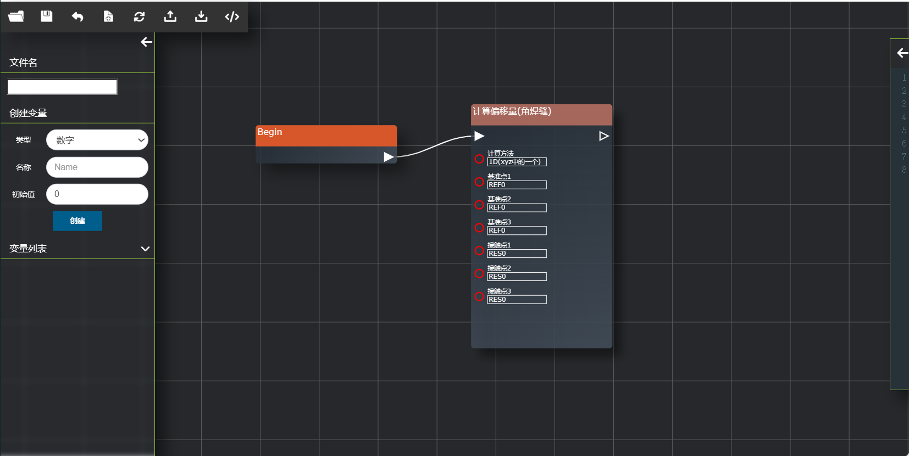

.. centered:: 图表 6.2.92 “计算偏移量”指令节点界面

“接触点数据写入”指令节点,参数：

- 接触点名称: RES0~99
- 接触点名称：数据格式为{0,0,0,0,0,0};

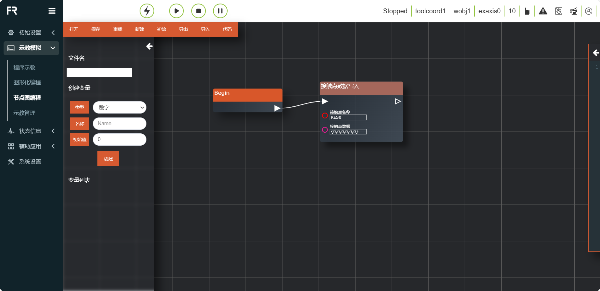

.. centered:: 图表 6.2.93 “接触点数据写入”指令节点界面

电弧跟踪指令
++++++++++++++++++

点击“电弧跟踪”指令节点，进入节点图编程界面

该指令实现机器人焊缝跟踪利用焊缝的偏差检测进行补偿轨迹，可以使用电弧传感器来检测焊缝偏差。

“电弧跟踪开启/关闭”指令节点,参数：

- 电弧跟踪滞后时间(ms): 参考值 50
- 偏差补偿: 关闭/开启
- 调节系数: 0 ~ 300
- 补偿时间(cyc): 0 ~ 300
- 每次最大补偿量(mm): 0 ~ 300
- 总计最大补偿量(mm): 0 ~ 300
- 上下坐标系选择: 摆动
- 上下基准电流设定方式: 反馈/常数
- 上下基准电流(A): 0 ~ 300

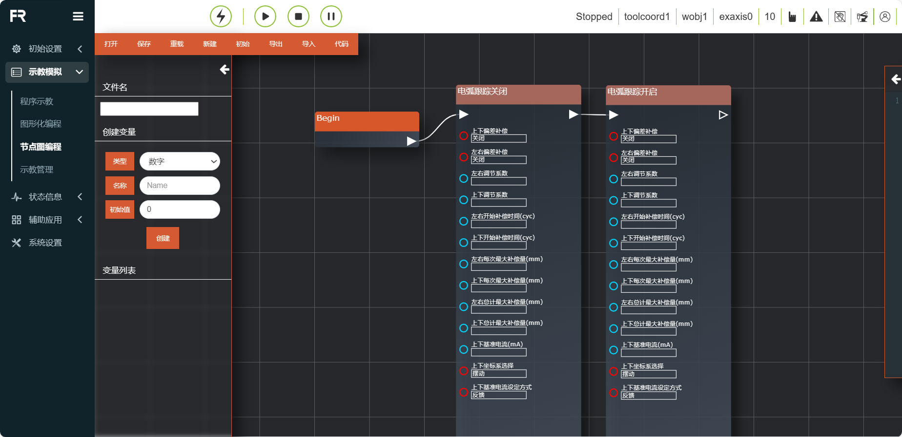

.. centered:: 图表 6.2.94 “电弧跟踪开启/关闭”指令节点界面

姿态调整指令
++++++++++++++++++

点击“姿态调整”相关指令节点，进入节点图编程界面

该指令针对焊接跟踪自适应调整焊枪姿态场景，需要先示教PosA、PosB、PosC三个点位，否则无法添加节点。

记录好三个对应的姿态点后，根据机器人实际运动方向，添加姿态自适应调整指令。详见机器人外设章节。

“开启姿态调整”指令节点,参数：

- 板材类型： 波纹板/瓦楞板/围栏板/波纹甲壳钢
- 运动方向：从左至右/从右至左
- 姿态调整时间(ms): 0 ~ 1000
- 第一段长度(mm):
- 拐点类型：由上往下/由下往上
- 第二段长度(mm):
- 第三段长度(mm):
- 第四段长度(mm):
- 第五段长度(mm):

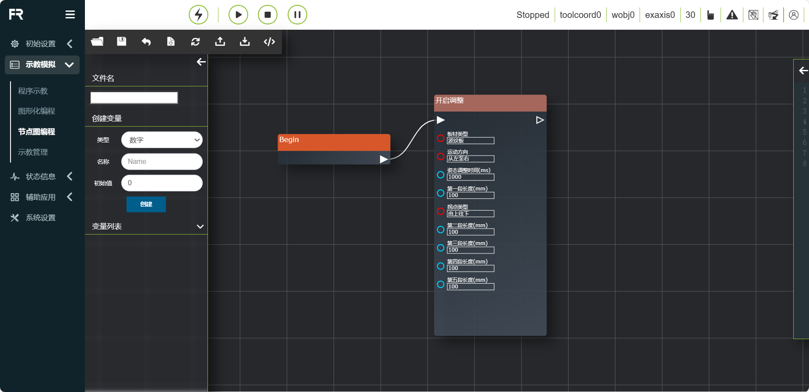

.. centered:: 图表 6.2.95 “开启姿态调整”指令节点界面

“关闭姿态调整”指令节点,参数：

- 板材类型： 波纹板/瓦楞板/围栏板/波纹甲壳钢

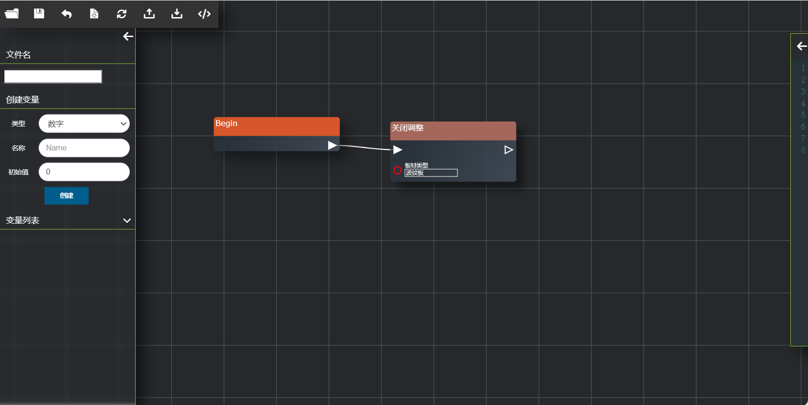

.. centered:: 图表 6.2.96 “关闭姿态调整”指令节点界面

“力控”指令界面 
~~~~~~~~~~~~~~~

“力控”命令
++++++++++++++++

点击“力控”指令相关指令节点，进入节点图编程界面

该指令包含FT_Guard(碰撞检测)，FT_Control(恒力控制)，FT_Compliance(柔顺控制)，FT_Spiral(螺旋插入)，FT_Rot(旋转插入)，FT_Lin(直线插入)，FT_FindSurface(表面定位) ，FT_CalCenter(中心定位)，FT_Click(点按力探测)九个指令，详见机器人外设章节。

1.“开启/关闭碰撞检测”指令节点,参数: 

- 坐标系名称：自定义配置的坐标系
- Fx-Tx真值：true/false
- Fx-Tx当前值：根据实际情况输入
- Fx-Tx最大阈值：根据实际情况输入
- Fx-Tx最小阈值：根据实际情况输入

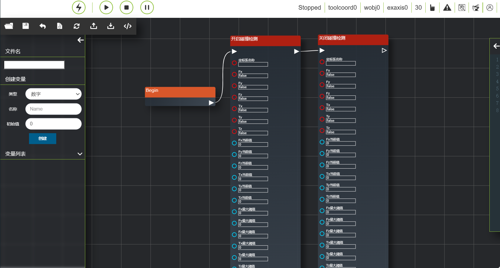

.. centered:: 图表 6.2.97 “开启/关闭碰撞检测”指令节点界面

2.“开启/关闭控制”指令节点,参数: 

- 坐标系名称：自定义配置的坐标系
- Fx-Tx真值：true/false
- Fx-Tx当前值：根据实际情况调整
- F_P_gain - F_D_gain：根据实际情况调整，不能为0
- 自适应启停状态：停止/开启
- ILC控制启停状态：停止/训练/实操
- 最大调整距离(mm): 0 ~ 1000
- 最大调整角度(°): 0 ~ 1000

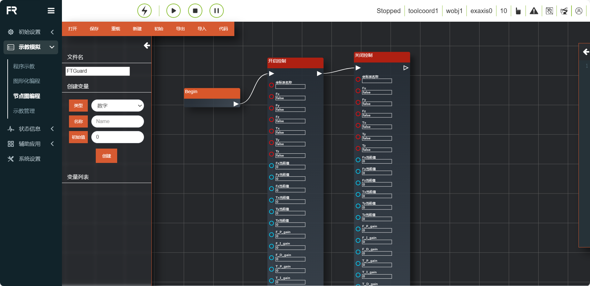

.. centered:: 图表 6.2.98 “开启/关闭控制”指令节点界面

3.“开启/关闭柔顺控制”指令节点,参数: 

- 下发位置调节系数: 0 ~ 1
- 柔顺开启力阈值(N): 0 ~ 100

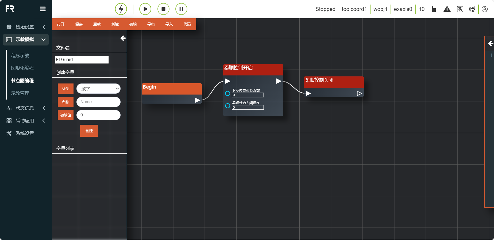

.. centered:: 图表 6.2.99 “开启/关闭柔顺控制”指令节点界面

4.“螺旋插入”指令节点,参数: 

- 坐标系名称：工具坐标系/基坐标
- 每圈半径进给量(mm)：0 ~ 100,参考值：0.7
- 力或力矩阈值(N/Nm)：0 ~ 100,参考值：50
- 最大探索时间(ms)：0 ~ 60000, 参考值：60000
- 线速度最大值(mm/s): 0 ~ 100，参考值：5

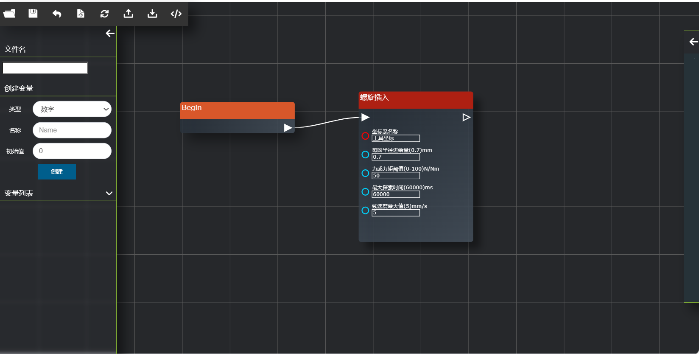

.. centered:: 图表 6.2.100 “螺旋插入”指令节点界面

5.“旋转插入”指令节点,参数: 

- 坐标系名称：工具坐标系/基坐标
- 旋转角速度(°/s)：0 ~ 100,参考值：0.7
- 触发力或终止力矩(N/Nm)：0 ~ 100,参考值：50
- 最大旋转角度(°)：0 ~ 100,参考值：5
- 力的方向：方向z/方向mz
- 最大旋转角加速度(°/s^2)：0 ~ 100
- 插入方向: 正/负

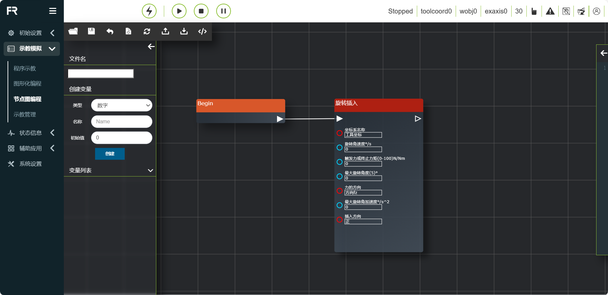

.. centered:: 图表 6.2.101 “旋转插入”指令节点界面

6.“直线插入”指令节点,参数: 

- 坐标系名称：工具坐标系/基坐标
- 动作终止力阈值(N)：0 ~ 100
- 直线速度(mm/s)：0 ~ 100,参考值：1
- 直线加速度(°/s^2)：0 ~ 100
- 最大插入距离(mm)：0 ~ 100
- 插入方向: 正/负

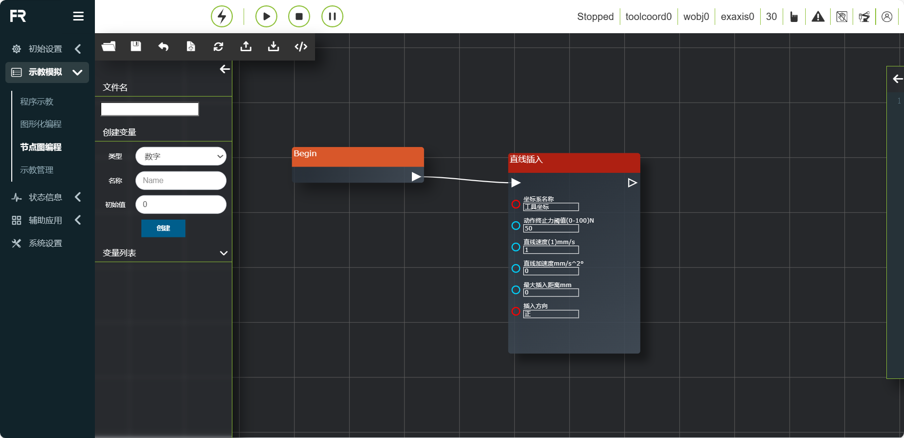

.. centered:: 图表 6.2.102 “直线插入”指令节点界面

7.“表面定位”指令节点,参数: 

- 坐标系名称：工具坐标系/基坐标
- 移动方向：正/负
- 移动轴：X/Y/Z
- 探索直线速度(mm/s)：0 ~ 100
- 探索加速度(mm/s^2)：0 ~ 100
- 最大探索距离(mm)：0 ~ 100
- 动作终止力阈值(N)：0 ~ 100

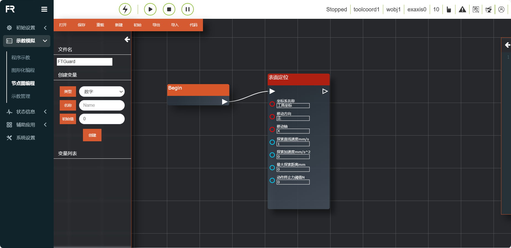

.. centered:: 图表 6.2.103 “表面定位”指令节点界面

8.“中间平面开始/结束计算”指令节点

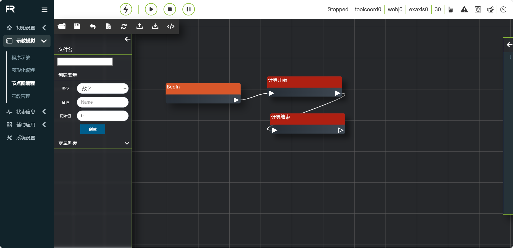

.. centered:: 图表 6.2.104 “中间平面开始/结束计算”指令节点界面
   
9.“点按力探测”指令节点,参数: 

- 动作终止力阈值(N)：0 ~ 100
- 直线速度(mm/s)：0 ~ 100
- 直线加速度(mm/s^2)：0 ~ 100
- 最大插入距离(mm)：0 ~ 100

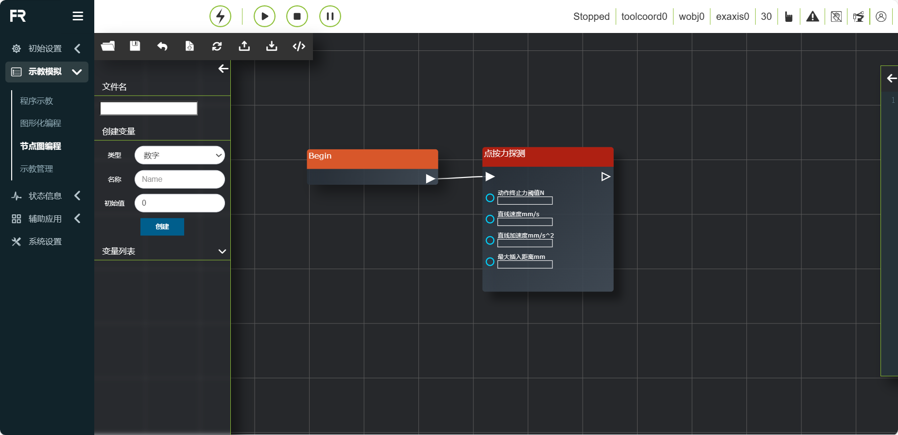

.. centered:: 图表 6.2.105 “点按力探测”指令节点界面

扭矩记录命令
++++++++++++++++

点击“扭矩记录”相关指令节点,进入节点图编程界面

该指令为扭矩记录指令，包含“扭矩记录开始/“扭矩记录停止”和“扭矩记录复位”三种指令。

实现扭矩实时记录碰撞检测功能。

点击“扭矩记录启动”按钮，持续记录运动指令运行过程中的碰撞情况，记录的实时扭矩作为碰撞检测判断的理论值，以减少误报错概率。

当超出设定阈值范围时，记录碰撞检测持续时间。

点击“扭矩记录停止”按钮，停止记录。点击“扭矩记录复位”，状态恢复默认状态。

1.“扭矩记录开始”指令节点,参数: 

- 平滑选择：不平滑(原始数据)/平滑(平滑后数据)
- 关节负阈值(Nm)：-100 ~ 0
- 关节正阈值(Nm)：0 ~ 100
- 关节持续检测碰撞时间(ms)：0 ~ 1000

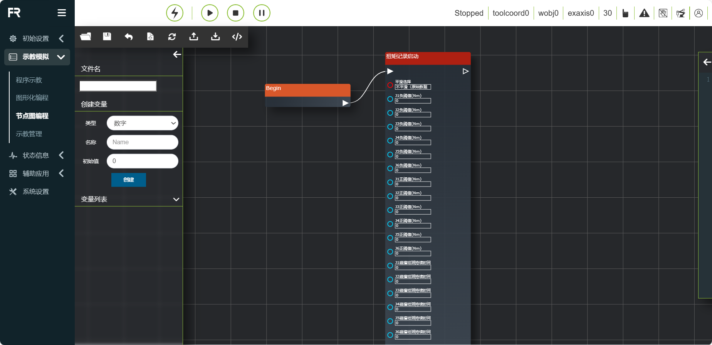

.. centered:: 图表 6.2.106 “扭矩记录开始”指令节点界面

2.“扭矩记录结束”指令节点

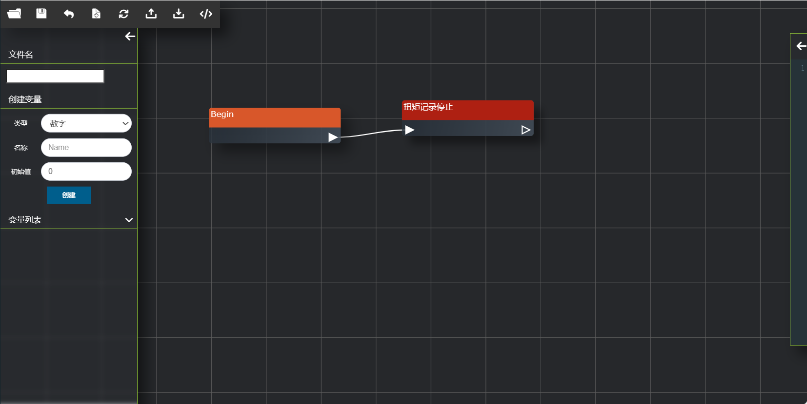

.. centered:: 图表 6.2.107 “扭矩记录结束”指令节点界面

3.“扭矩记录复位”指令节点

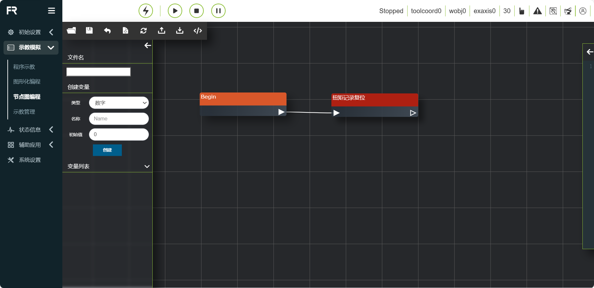

.. centered:: 图表 6.2.108 “扭矩记录复位”指令节点界面

Modbus命令
++++++++++++++++

点击“Mobus”相关指令节点,进入节点图编程界面

该指令功能为基于ModbusTCP协议的总线功能，用户可以通过相关指令控制机器人与ModbusTCP client或server通讯（主站与从站通讯），对线圈，离散量，寄存器进行读写操作。关于ModbusTCP更多操作功能，前请联系我们咨询。

1.“创建/关闭主站”指令节点,创建/关闭 modbus-tcp 通信，机器人作为主站（客户端）,参数: 

- 从站ip: ip地址
- 从站端口：根据实际情况输入，默认为 502；
- 从站id: 0 ~ 4

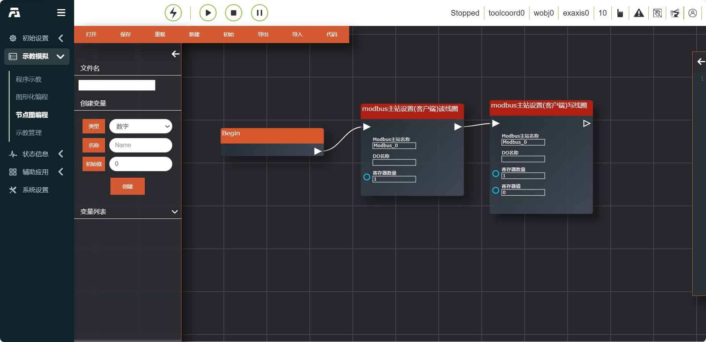

.. centered:: 图表 6.2.109 “创建/关闭主站”指令节点界面

2.主站线圈设置,参数: 

- 从站id: 0 ~ 4
- 寄存器地址：根据实际情况输入
- 寄存器数量：整数型
- 寄存器值：根据寄存器数量来定，可输入多个数值。例如数量为3，值为{1,0,1}

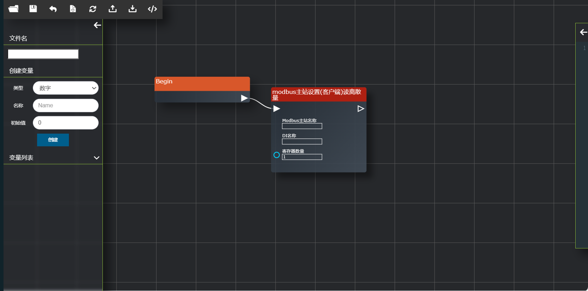

.. centered:: 图表 6.2.110 主站“读/写线圈”指令节点界面

3.主站离散量设置,参数: 

- 从站id: 0 ~ 4
- 寄存器地址：根据实际情况输入
- 寄存器数量：整数型
- 类型：U16/U32/F32/F64，-16 位无符号整数（占 1 个寄存器）,“U32”-32 位无符号整数（占 2 个寄存器）,“F32”-32 位单精度浮点数（占 2 个寄存器）,“F64”-64 位双精度浮点数（占 4 个寄存器）

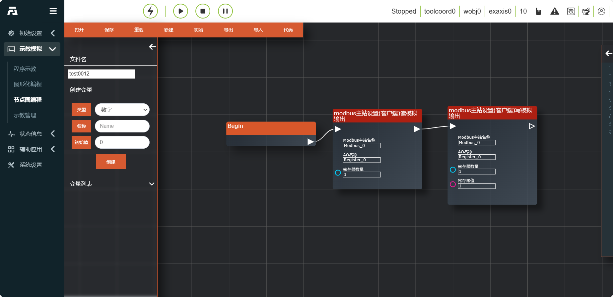

.. centered:: 图表 6.2.111 主站“读离散量”指令节点界面

4.主站输入寄存器设置,参数: 

- 从站id: 0 ~ 4
- 寄存器地址：根据实际情况输入
- 类型：U16/U32/F32/F64，-16 位无符号整数（占 1 个寄存器）,“U32”-32 位无符号整数（占 2 个寄存器）,“F32”-32 位单精度浮点数（占 2 个寄存器）,“F64”-64 位双精度浮点数（占 4 个寄存器）

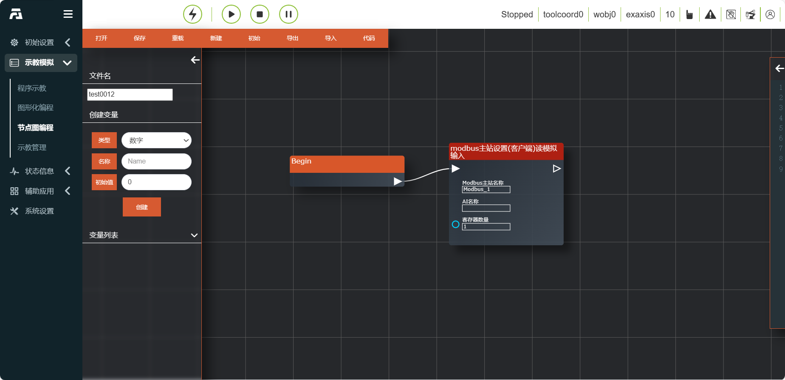

.. centered:: 图表 6.2.112 主站“读输入寄存器”指令节点界面

5.主站保持寄存器设置,参数: 

- 从站id: 0 ~ 4
- 寄存器地址：根据实际情况输入
- 寄存器数量：整数型
- 寄存器值：根据寄存器数量来定，可输入多个数值。例如数量为3，值为{1,0,1}
- 类型：U16/U32/F32/F64，-16 位无符号整数（占 1 个寄存器）,“U32”-32 位无符号整数（占 2 个寄存器）,“F32”-32 位单精度浮点数（占 2 个寄存器）,“F64”-64 位双精度浮点数（占 4 个寄存器）

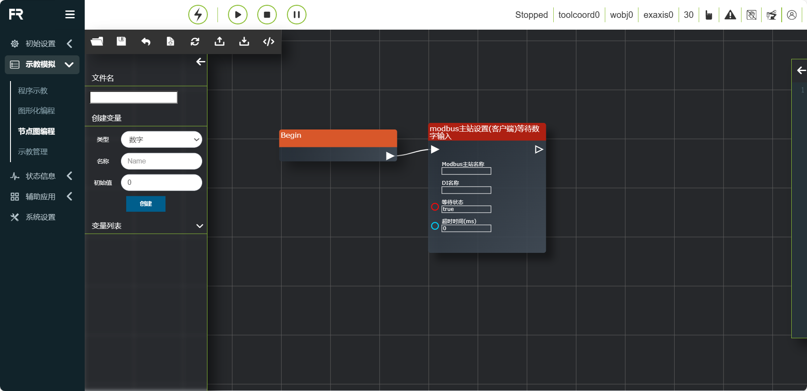

.. centered:: 图表 6.2.113 主站“读/写保持寄存器”指令节点界面

6.从站线圈设置,参数: 

- 从站id: 0 ~ 4
- 寄存器地址：根据实际情况输入
- 寄存器数量：整数型

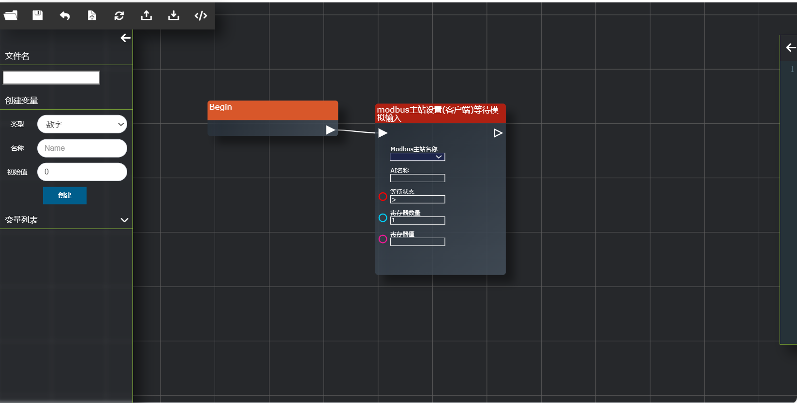

.. centered:: 图表 6.2.114 从站“读/写线圈”指令节点界面

7.从站离散量设置,参数: 

- 从站id: 0 ~ 4
- 寄存器地址：根据实际情况输入
- 寄存器数量：整数型
- 寄存器值：根据寄存器数量来定，可输入多个数值。例如数量为3，值为{1,0,1}

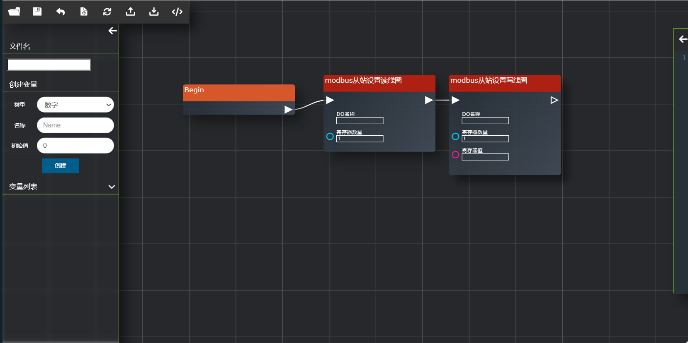

.. centered:: 图表 6.2.115 从站“读/写离散量”指令节点界面

8.从站输入寄存器设置,参数: 

- 从站id: 0 ~ 4
- 寄存器地址：根据实际情况输入
- 寄存器数量：整数型
- 寄存器值：根据寄存器数量来定，可输入多个数值。例如数量为3，值为{1,0,1}
- 类型：U16/U32/F32/F64，-16 位无符号整数（占 1 个寄存器）,“U32”-32 位无符号整数（占 2 个寄存器）,“F32”-32 位单精度浮点数（占 2 个寄存器）,“F64”-64 位双精度浮点数（占 4 个寄存器）

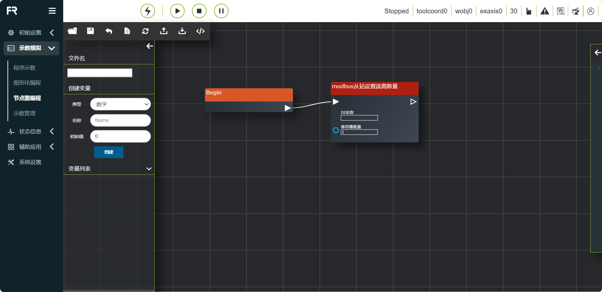

.. centered:: 图表 6.2.116 从站“读/写输入寄存器”指令节点界面

9.从站保持寄存器设置,参数: 

- 从站id: 0 ~ 4
- 寄存器地址：根据实际情况输入
- 寄存器数量：整数型
- 寄存器值：根据寄存器数量来定，可输入多个数值。例如数量为3，值为{1,0,1}
- 类型：U16/U32/F32/F64，-16 位无符号整数（占 1 个寄存器）,“U32”-32 位无符号整数（占 2 个寄存器）,“F32”-32 位单精度浮点数（占 2 个寄存器）,“F64”-64 位双精度浮点数（占 4 个寄存器）

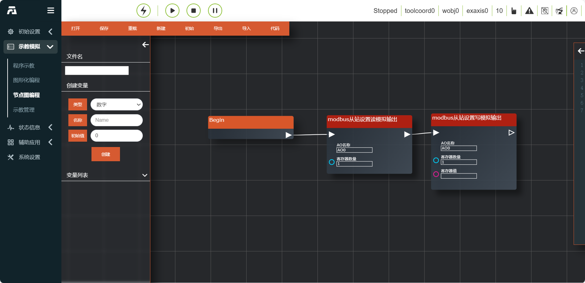

.. centered:: 图表 6.2.117 从站“读/写保持寄存器”指令节点界面

10.读寄存器指令,参数: 

- 功能码：0x01-线圈/0x02-离散量/0x03-保持寄存器/0x04-输入寄存器
- 寄存器、线圈、离散量地址：根据实际情况输入
- 寄存器、线圈、离散量数量：0 ~ 255
- 地址：根据实际情况输入
- 是否应用线程：否/是

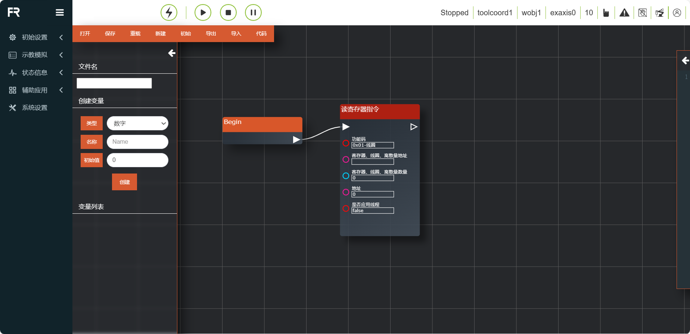

.. centered:: 图表 6.2.118 “读寄存器指令”节点界面

11.读寄存器数据指令,参数: 

- 寄存器、线圈、离散量数量：0 ~ 255
- 是否应用线程：否/是
  
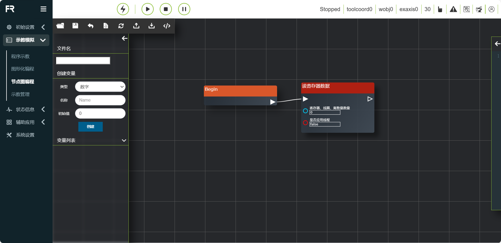

.. centered:: 图表 6.2.119 “读寄存器数据指令”节点界面

12.写寄存器指令,参数: 

- 功能码：0x01-线圈/0x02-离散量/0x03-保持寄存器/0x04-输入寄存器
- 寄存器、线圈地址：根据实际情况输入
- 寄存器、线圈数量：0 ~ 255
- 字节数组：根据实际情况输入
- 地址：根据实际情况输入
- 是否应用线程：否/是
  
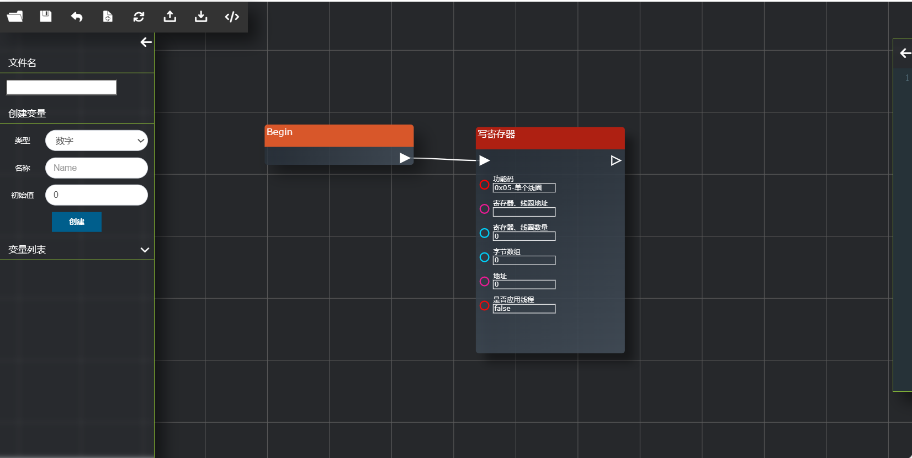

.. centered:: 图表 6.2.120 “写寄存器指令”节点界面

应用场景使用示例
---------------------

例如给机器人末端装上尖端，拖动到托盘孔位附近位置，想要进行力传感器螺旋、旋转和直线插入操作。

- 首先，右击鼠标键，选择"Begin"、"开始/结束控制"、"螺旋插入"、"旋转插入"、"直线插入"指令节点；
- 依次按如下位置连接，并配置相关参数。

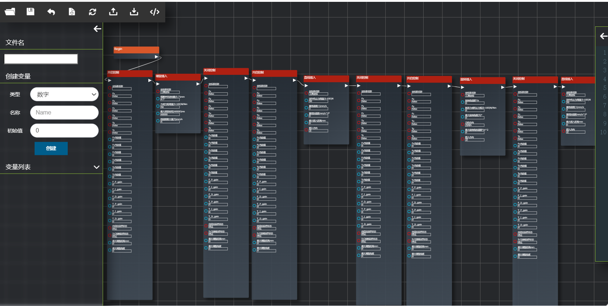

.. centered:: 图表 6.3.1 “力控”指令节点应用配置界面

- 输入文件名，若未输入正确参数，则保存失败，提示指令节点参数配置错误。

  .. image:: node_editor_software/123.png
   :width: 6in
   :align: center

.. centered:: 图表 6.3.2 指令节点参数配置错误界面
  
- 点击运行后，机器人会以螺旋形加直线的运动进行探索。当探索到正确孔位位置后，以直线加旋转插入运动，直至正确插入孔位。

