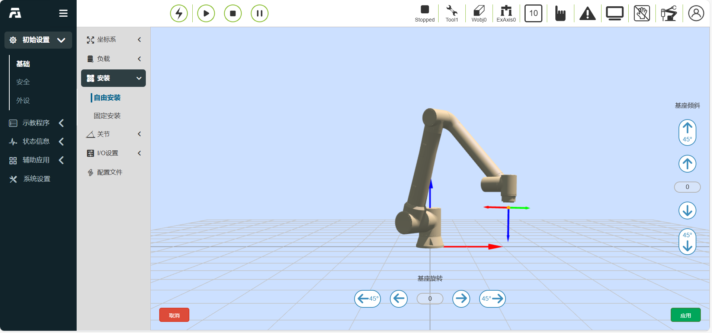

机器人参数设置
===================

设置安装方式
--------------------

机器人默认安装方式为水平安装，当机器人安装方式更改时，需及时在此页面设置机器人的实际安装方式，以保证机器人正常工作。

用户点击机器人三维虚拟展示区域中的“固定安装”选项卡，进入机器人固定安装方式设置页面，选择“正装”、“倒装”或者“侧装”，点击点击“应用”按钮完成机器人安装方式设置。

.. image:: teaching_pendant_software/025.png
   :width: 6in
   :align: center

.. centered:: 图表 3.1-1 固定安装

考虑到更加灵活丰富的机器人部署场景，我们提供了自由安装功能，用户点击机器人三维虚拟展示区域中的“360度自由安装”选项卡，进入机器人自由安装方式设置页面。手动调整“基座倾斜”和“基座旋转”角度，三维模型会对应展示安装效果。修改后点击“应用”按钮即可完成机器人安装方式设置。

   
.. centered:: 图表 3.1-2 360度自由安装

.. important::
    机器人安装完成后，必须正确设置机器人的安装方式，否则会影响机器人的拖动功能以及碰撞检测功能使用。

设置末端负载
--------------------

在“初始设置”中的“机器人设置”的菜单栏下，点击“末端负载”进入末端负载页面 。

.. image:: teaching_pendant_software/044.png
   :width: 3in
   :align: center

.. centered:: 图表 3.2-1 负载设定示意图

用户可以根据所使用工具的参数设定对应参数，负载重量为0~5kg，质心坐标的范围为0~1000，如3.4-18所示。

.. important:: 
    机器人末端安装负载后，必须正确设置末端负载重量以及质心坐标，否则会影响机器人的拖动功能以及碰撞检测功能使用。

设置工具坐标
--------------------

在“初始设置”中的“机器人设置”的菜单栏下，点击“工具坐标”进入工具坐标页面 。工具坐标可实现工具坐标的修改、清空与应用。工具坐标系的下拉列表中共有15个编号，选择对应的坐标系（坐标系名称可自定义）后会在下方显示对应坐标值，工具类型以及安装位置（仅在传感器类型工具下显示），选择某一坐标系后点击“应用”按钮，当前使用的工具坐标系变为所选择的坐标，如图表3.4-1所示。

点击“修改”可根据提示对该编号的工具坐标系进行重新设置。工具标定方法分为四点法和六点法，四点法只标定工具TCP，即工具中心点的位置，其姿态默认与末端姿态一致，六点法则在四点法的基础上增加了两点，用于标定工具的姿态。

.. image:: teaching_pendant_software/027.png
   :width: 3in
   :align: center
   
.. centered:: 图表 3.1-1 设置工具坐标

.. image:: teaching_pendant_software/028.png
   :width: 3in
   :align: center

.. centered:: 图表 3.1-2 设置工具坐标

.. important:: 
    1.末端安装工具后，必须要进行工具坐标系的标定及应用，否则会导致机器人执行运动指令时工具中心点的位置和姿态不符合预期值。

    2.工具坐标系一般使用toolcoord1~toolcoord14,应用toolcoord0代表工具TCP的位置中心在末端法兰中心，在进行工具坐标系标定时，首先需将工具坐标系应用至toolcoord0，然后选择其他工具坐标系进行标定及应用。
