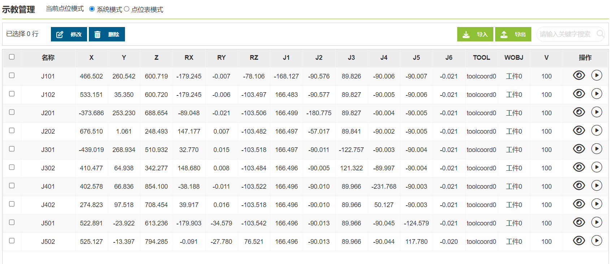
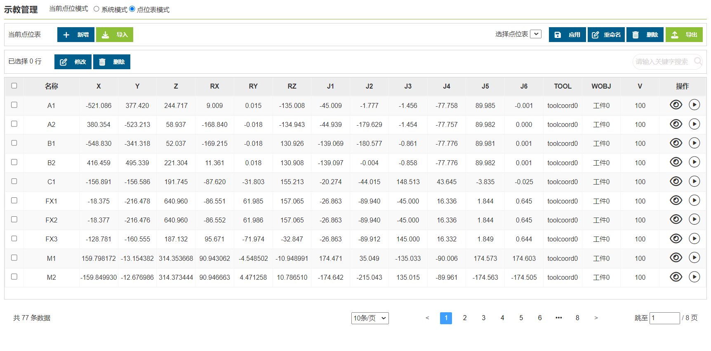
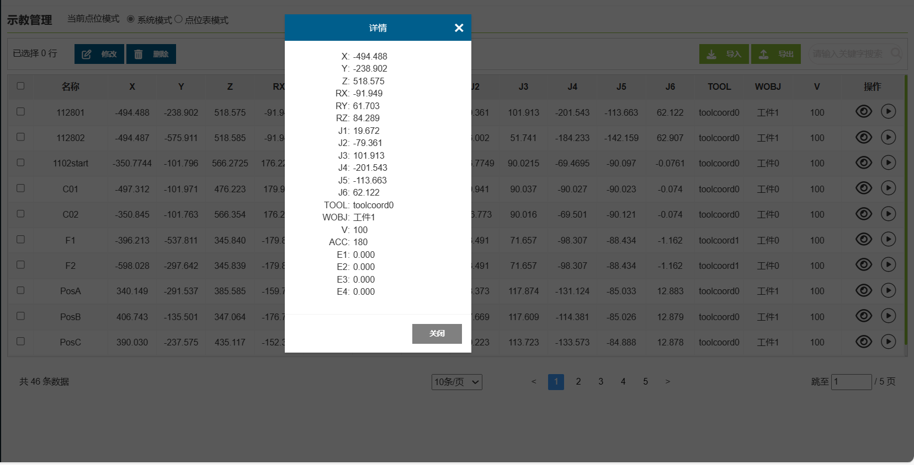

示教点
===============

.. toctree:: 
   :maxdepth: 6

示教管理
~~~~~~~~~~~~

点击“示教管理”可显示所有保存的示教点信息，在该界面中可对示教点文件导入和导出，选中一个示教点后点击“删除”按钮即可将该点信息删除，示教点x，y，z，rx，ry，rz和v数值可进行修改，输入修改值，勾选左侧勾选兰，点击上方修改即可修改示教点信息。此外，用户可以通过名称搜索示教点。

.. important:: 
   示教点x，y，z，rx，ry，rz的修改值不应超过机器人的工作范围。

示教管理分为“系统模式”和“点位表模式”两种模式，实现调用机械手程序时，可以通过调用不同的点位表来实现不同的检测方案，完成配方的需求。后续每增加一款设备或者产品，可以通过上位机把点位表数据包下载到机器人，机器人新建的点位表数据包也可以上传给上位机。

**系统模式**：支持“修改、删除、导入、导出”示教点位内容。

.. centered:: 图表 9.19-1 示教管理界面-系统模式

**点位表模式**：支持“新增、应用、重命名、删除、导入、导出”点位表，“修改和删除”点位表内点位内容。

.. centered:: 图表 9.19-2 示教管理界面-点位表模式

**详情**：点击“详情”按钮，查看示教点的详情。

.. centered:: 图表 9.19-3 示教点详情

**运行**：点击“开始运行”按钮，进行局部示教点的单点运行，将机器人移动到该点的位置。

.. centered:: 图表 9.19-4 运行示教点