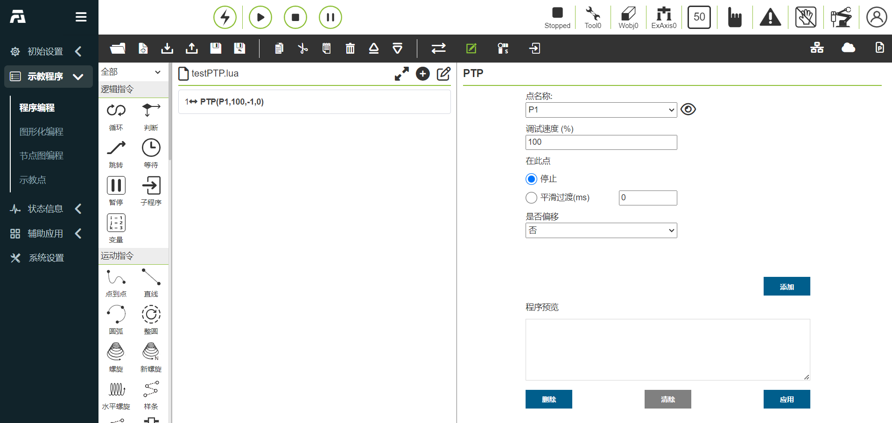
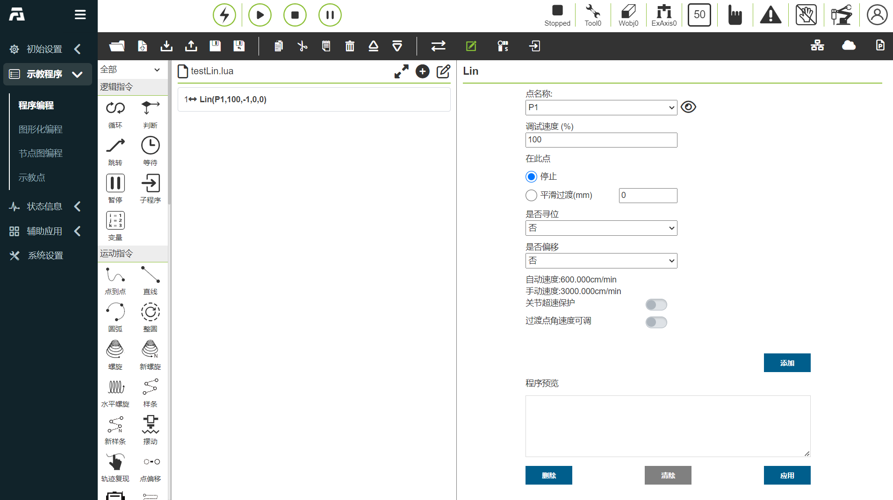

机器人快速编程
===================

简单运动指令介绍
--------------------

**PTP命令**：点击“点到点”图标进入PTP命令编辑界面

可以选择需要到达的点，平滑过渡时间设置可以实现该点到下一点的运动是连续的，是否偏移设置，可以选择基于基坐标系偏移和基于工具坐标偏移，并弹出x,y,z,rx,ry,rz偏移量设置，PTP具体路径为运动控制器自动规划的最优路径，点击“添加”、“应用”后可保存该条指令。

.. centered:: 图表 5.1‑1 PTP命令界面

**Lin命令**：点击“直线”图标进入Lin命令编辑界面

该指令功能与“PTP”指令相似，但该指令所到达点的路径为直线

.. centered:: 图表 5.1‑2 Lin命令界面

对程序文件进行操作
--------------------

使用程序树顶部的工具栏修改程序树。

.. note:: 
   .. image:: coding/006.png
      :width: 1.5in
      :height: 0.75in
      :align: left

   名称：**打开**
   
   作用：打开用户程序文件

.. note:: 
   .. image:: coding/007.png
      :width: 1.5in
      :height: 0.75in
      :align: left

   名称：**新建**
   
   作用：选择模板新建程序文件
   
.. note:: 
   .. image:: coding/008.png
      :width: 1.5in
      :height: 0.75in
      :align: left

   名称：**导入**
   
   作用：导入文件到用户程序文件夹中

.. note:: 
   .. image:: coding/009.png
      :width: 1.5in
      :height: 0.75in
      :align: left

   名称：**导出**
   
   作用：导出用户程序文件到本地点。

.. note:: 
   .. image:: coding/010.png
      :width: 1.5in
      :height: 0.75in
      :align: left

   名称：**保存**
   
   作用：保存文件编辑内容

.. note:: 
   .. image:: coding/011.png
      :width: 1.5in
      :height: 0.75in
      :align: left

   名称：**另存为**
   
   作用：给文件重命名存放到用户程序或模板程序文件夹中。

.. note:: 
   .. image:: coding/012.png
      :width: 1.5in
      :height: 0.75in
      :align: left

   名称：**复制**
   
   作用：复制一个节点，并允许将其用于其他操作（例如：将其粘贴到程序树的其他位置）。

.. note:: 
   .. image:: coding/013.png
      :width: 1.5in
      :height: 0.75in
      :align: left

   名称：**粘贴**
   
   作用：允许您粘贴之前剪切或复制的节点。

.. note:: 
   .. image:: coding/014.png
      :width: 1.5in
      :height: 0.75in
      :align: left

   名称：**剪切**
   
   作用：剪切一个节点，并允许将其用于其他操作（例如：将其粘贴到程序树的其他位置）。

.. note:: 
   .. image:: coding/015.png
      :width: 1.5in
      :height: 0.75in
      :align: left

   名称：**删除**
   
   作用：从程序树中删除一个节点。

.. note:: 
   .. image:: coding/016.png
      :width: 1.5in
      :height: 0.75in
      :align: left

   名称：**上移**
   
   作用：向上移动该节点。

.. note:: 
   .. image:: coding/017.png
      :width: 1.5in
      :height: 0.75in
      :align: left

   名称：**下移**
   
   作用：向下移动该节点。

.. note:: 
   .. image:: coding/018.png
      :width: 1.5in
      :height: 0.75in
      :align: left

   名称：**切换编辑模式**
   
   作用：程序树模式和lua编辑模式互相切换。

编写运行一个程序
--------------------

左侧主要是程序命令的添加，点击各关键字上方图标进入右侧程序命令添加的详细界面，程序命令添加到文件中的操作主要分为两种：

- 1、打开相关指令点击应用按键即可将该指令添加到程序中；
- 2、先点击“添加”按键，此时命令并未保存到程序文件中，需要再点击“应用”方可将命令保存到文件中。

第二种方式多出现在同类型指令多条下发的情况，我们对该类型命令增加添加按键和显示已添加指令内容功能，点击添加按键可添加一条指令，已添加指令显示所有已添加的指令，点击“应用”即可将添加的指令保存到右侧已打开的文件中。

点击开始按钮，运行程序；点击停止按钮，停止程序运行；点击暂停/恢复按钮，暂停/恢复程序；程序运行时，当前执行的程序节点灰色高亮显示。

在手动模式下，点击节点右侧第一个图标可以使机器人单独执行该指令，第二个图标为编辑该节点内容。

.. image:: coding/001.png
   :width: 6in
   :align: center

.. centered:: 图表 5.3‑1 程序树界面
