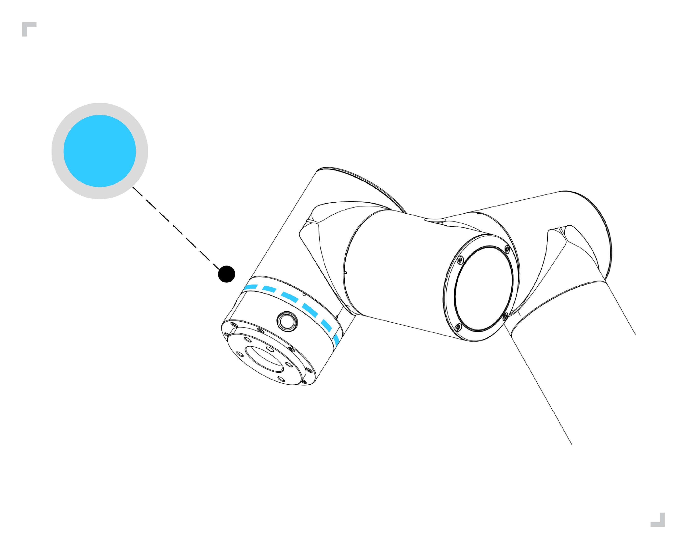
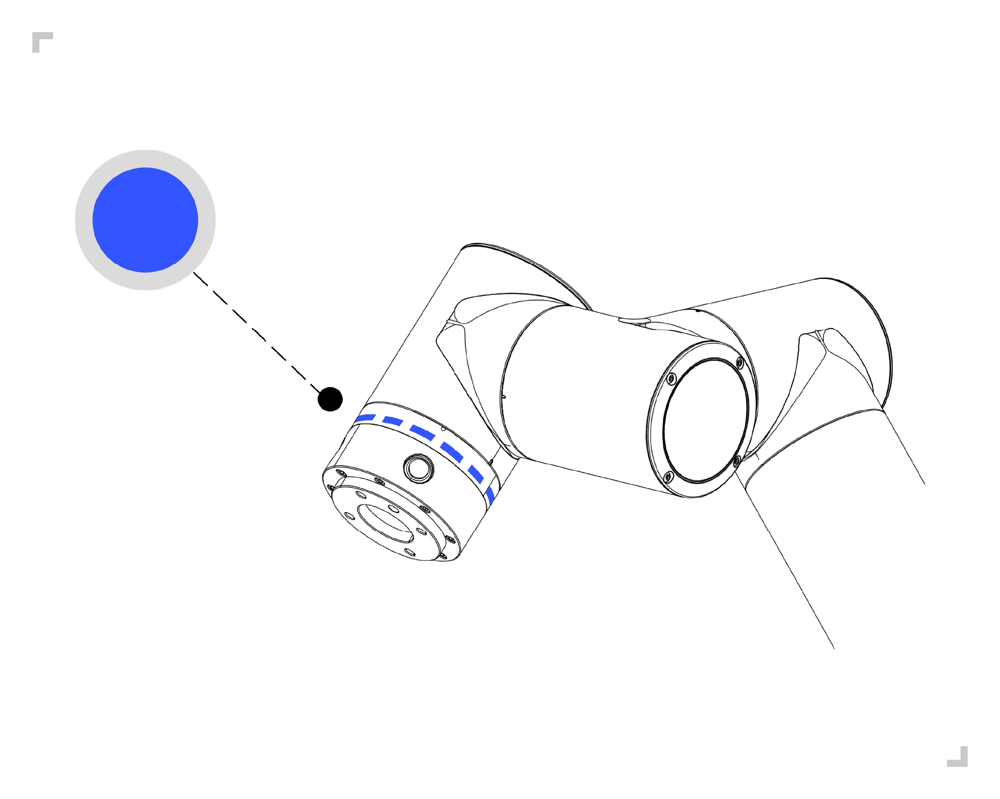
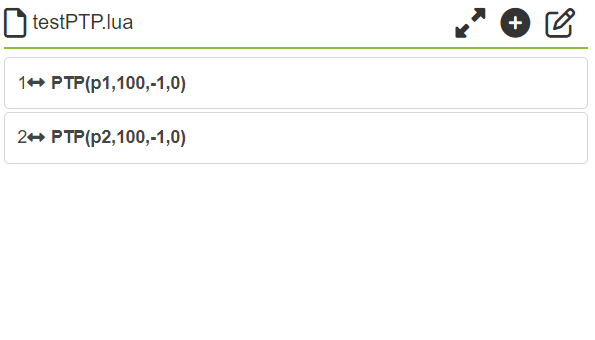
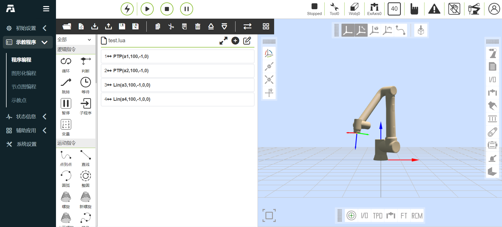

快速启动机器人
===================

.. toctree:: 
   :maxdepth: 5

安装机器人手臂和控制箱
----------------------------

根据 2.硬件安装 中的 2.5 和 2.6 安装连接机器人手臂和控制箱。

-  开箱取出机器人手臂，使用4颗强度不低于8.8级强度的M8螺栓安装机器人手臂。将机器人手臂安装在一个坚固且防震的表面，若用铝板固定，铝板厚度不小于16mm，若用铁板固定，铁板厚度不小于8mm；

-  将控制箱放置在其支脚上；

-  将机器人手臂本体重载线缆连接到控制箱重载接口；

-  将按钮盒航空插头插到控制箱示教器接口，若配备有触摸屏版示教器，还需要使用一根两端都为Type-c接口的数据线，分别插入按钮盒与示教器的Type-c接口；

-  确保控制箱电源按钮关闭情况下（按钮打到0）将220V电源线接到电源插口；

-  插上电源控制箱插头。

.. warning:: 
   如果机器人没有安全地放置在坚固的表面上，机器人有可能会倾倒并造成伤害。

示教器启动控制机器人
---------------------------

控制箱连接机器人手臂、示教盒和任何周边设备的物理电气输入/输出端。必须打开控制箱才能给机器人手臂通电。

-  按下控制箱的电源按钮开启控制箱；

-  启动机器人后，此时机器人为手动模式且未使能，若需要在手动模式下操作机器人，需要按压示教器上三位使能开关OFF（放开）⇒ ON ⇒ OFF（按压），当开关处于 ON 状态时，拖动或控制机器人运动。

-  若无需在手动模式操作机器人，可用示教器上钥匙开关旋转按钮切换机器人工作模式：自动、手动、自定义；

-  当切换机器人手动状态时，应检查安全空间内外是否存在异常并谨慎操作机器运行；

-  当切换机器人自动状态时，应检查安全措施并恢复到正常状态下并谨慎操作机器运行；

-  当无法正常打开示教器时，请查看设备连接是否正常。

按钮盒控制机器人运动
----------------------

参照 2.硬件安装 的 2.7.3.末端LED定义 来控制机器人

未搭配示教器
~~~~~~~~~~~~~~~

-  **Step1**：打开机器人控制箱电源开关，启动机器人，等待末端LED长显绿色后，方可操作机器人如图表2.3-1。

.. figure:: quick_start_robot/001.png
   :align: center
   :width: 4in

.. centered:: 图表 2.3-1 末端LED绿色示意图

-  **Step2**：长按按钮盒“按键2”，进入未搭配示教器模式，末端LED青蓝色闪烁三下，如图表2.3-2。

.. centered:: 图表 2.3-2 末端LED青蓝色示意图

-  **Step3**：长按按钮盒“按键1”切换机器人到拖动模式，此时末端LED为白青色，如图表2.3-3。移动机器人至任意位置，长按“按键1”退出拖动模式，短按按钮盒“按键2”记录P1点，末端LED紫色闪烁三下，如图表2.3-4。

-  **Step4**：移动机器人，短按按钮盒“按键2”记录P2点，末端LED紫色闪烁三下，如图表2.3-4。

.. figure:: quick_start_robot/003.png
   :align: center
   :width: 4in

.. centered:: 图表 2.3-3 末端LED白青色示意图

.. figure:: quick_start_robot/004.png
   :align: center
   :width: 4in

.. centered:: 图表 2.3-4 末端LED紫色示意图

-  **Step5**：长按按钮盒“按键1”退出拖动模式，此时为手动模式，末端LED为绿色，如图表2.3-5。短按“按键1”切换机器人到自动模式，此时末端LED为蓝色，如图表2.3-6。

-  **Step6**：短按按钮盒“按键3”运行该程序，末端LED蓝色闪烁两下，如图表2.3-6。

.. figure:: quick_start_robot/005.png
   :align: center
   :width: 4in

.. centered:: 图表 2.3-5 末端LED绿色示意图

.. centered:: 图表 2.3-6 末端LED蓝色示意图

-  **Step7**：短按按钮盒“按键3”停止运行该程序，末端LED红色闪烁三下，如图表2.3-7。

.. figure:: quick_start_robot/007.png
   :align: center
   :width: 4in

.. centered:: 图表 2.3-7 末端LED红色示意图

搭配示教器
~~~~~~~~~~~~~~

-  **Step1**：启动机器人，等待末端LED绿色停止闪烁，方可操作机器人。

-  **Step2**：打开示教器进入到程序编辑界面。

-  **Step3**：选择空白模板新建一个程序文件。

-  **Step4**：短按按钮盒按键1切换机器人到手动模式，此时末端LED为绿色。

-  **Step5**：长按按钮盒按键1切换机器人到拖动模式，此时末端LED为白青色，移动机器人至任意位置，短按按钮盒按键2记录P1点，末端LED紫色闪烁三下，手动添加“PTP:P1”指令到程序文件中。

.. figure:: quick_start_robot/008.png
   :align: center
   :width: 4in
   :class: figure-border

.. centered:: 图表 2.3-8 记录并添加点P1

-  **Step6**：移动机器人，短按按钮盒按键2记录P2点，末端LED紫色闪烁三下，手动添加“PTP：P2”指令到程序中。

.. centered:: 图表 2.3-9 记录并添加点P2  

-  **Step7**：保存程序文件内容。

-  **Step8**：长按按钮盒按键1退出拖动模式，此时为手动模式，末端LED为绿色，短按按钮盒按键1切换机器人到自动模式，此时末端LED为蓝色。

-  **Step9**：短按按钮盒按键3运行该程序，末端LED蓝色闪烁两下。

示教器控制机器人运动
------------------------

点击示教器左侧一级菜单中的“示教模拟”按钮，点击其子菜单“程序示教”进入程序示教界面，该界面中主要实现机器人示教程序的编写以及修改。

点击“新建”图标按钮后，用户命名该文件，并选择一个模板作为该新建文件的内容，点击新建即可创建成功并打开该程序文件。

   
.. centered:: 图表 2.4-1 示教程序运行示意图

.. warning:: 
   您的头和躯干不能位于机器人可接触到的范围（工作区）。请不要将您的手指放在机器人可抓住的地方。

.. important:: 
   - 不要让机器人移到自身或其他物体中，因为这会对机器人造成损害。
   - 这只是一个快速启动指南，教您如何轻松地使用FR协作机器人。该指南的前提是环境安全无害，用户谨慎小心。请不要将速度或者加速度上调至默认值之上。在使机器人进入操作之前，始终进行风险评估。
