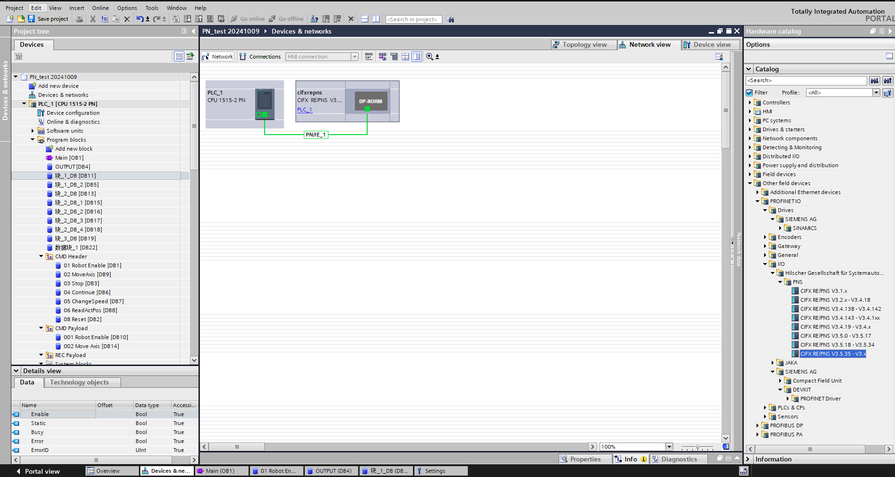
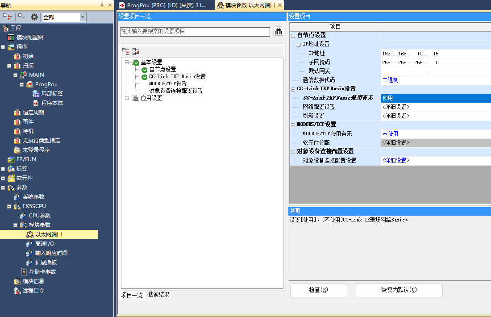
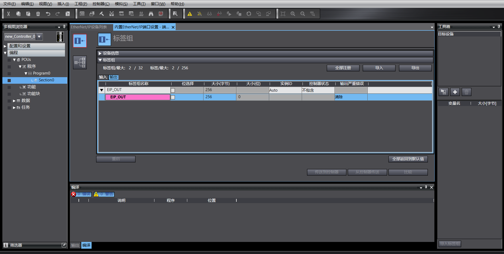
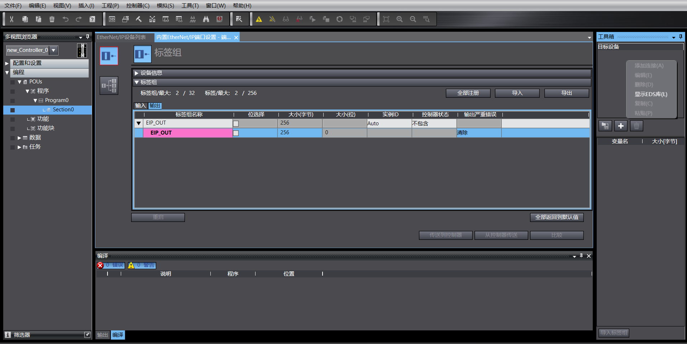
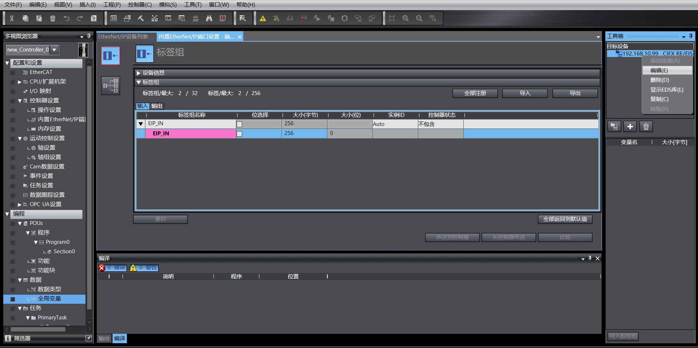
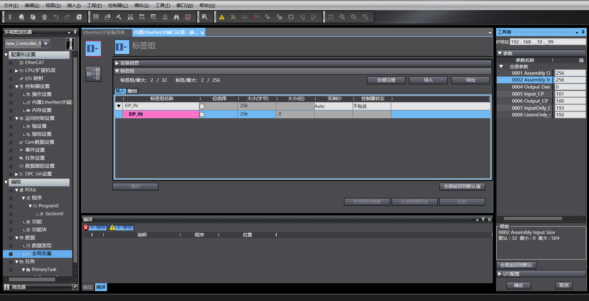
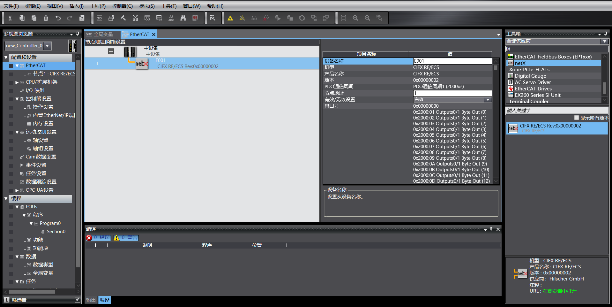
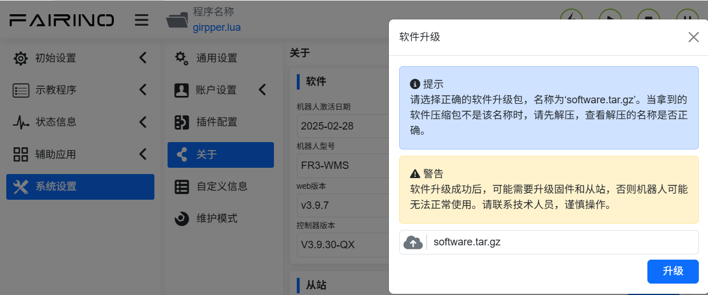

机器人远程模式
=============================================================

.. toctree:: 
   :maxdepth: 6
   
概述
-------------------------

为了便于PLC通过不同的工业总线协议（CC-Link、Profinet、Ethernet/IP和EtherCAT）对机器人进行运动控制，在集成式mini控制箱上增加FRH-PCIeN-EC/EIP/CC/PN-RJ-V10板卡、FRJ-PCIeN-EIP/CC/PN-RJ-V10板卡模块，实现功能如下：

1) CC-Link slave 协议支持；
2) Profinet slave 协议支持；
3) Ethernet/IP slave 协议支持；
4) EtherCAT slave 协议支持（FRJ-PCIeN-EIP/CC/PN-RJ-V10板卡不支持）。

环境配置
--------------------------------------------

板卡安装
~~~~~~~~~~~~~~~~~~~~~~~~~~~~~~~~~~~~~~~~~~~~~

(1) 查验物料：FRH-PCIeN 板卡、FRJ-PCIeN 板卡、配套钣金件外形参照如下所示。

.. image:: remote_mode/001.png
   :width: 4in
   :align: center

.. centered:: 图表 18.2-1 安装钣金（正面）

.. image:: remote_mode/002.png
   :width: 4in
   :align: center

.. centered:: 图表 18.2-2 安装钣金（背面）

.. image:: remote_mode/003.png
   :width: 4in
   :align: center

.. centered:: 图表 18.2-3 FRH-PCIeN-EC/EIP/CC/PN-RJ-V10板卡

.. image:: remote_mode/004.png
   :width: 4in
   :align: center

.. centered:: 图表 18.2-4 FRJ-PCIeN-EIP/CC/PN-RJ-V10板卡

(2) 将板卡安装到集成式mini控制箱，如图所示。

.. image:: remote_mode/005.png
   :width: 4in
   :align: center

.. centered:: 图表 18.2-5 钣金安装示意图

.. image:: remote_mode/006.png
   :width: 4in
   :align: center

.. centered:: 图表 18.2-6 FRH-PCIeN核心主板安装示意图

.. image:: remote_mode/007.png
   :width: 4in
   :align: center

.. centered:: 图表 18.2-7 FRH-PCIeN网口（RJ45）扩展卡安装示意图

.. image:: remote_mode/008.png
   :width: 4in
   :align: center

.. centered:: 图表 18.2-8 FRJ-PCIeN核心主板安装示意图

.. image:: remote_mode/009.png
   :width: 4in
   :align: center

.. centered:: 图表 18.2-9 FRJ-PCIeN网口（RJ45）扩展卡安装示意图

.. note:: 注：所有螺钉均需拧紧。

(3) 机器人控制箱和PLC接线如下图所示。

.. image:: remote_mode/010.png
   :width: 4in
   :align: center

.. centered:: 图表 18.2-10 控制箱&三菱PLC接线图    

.. image:: remote_mode/011.png
   :width: 4in
   :align: center

.. centered:: 图表 18.2-11 控制箱&西门子PLC接线图

.. image:: remote_mode/012.png
   :width: 4in
   :align: center

.. centered:: 图表 18.2-12 控制箱&欧姆龙PLC接线图

.. image:: remote_mode/013.png
   :width: 4in
   :align: center

.. centered:: 图表 18.2-13 控制箱&欧姆龙PLC接线图

.. note:: 
    1：机器人控制箱（板卡网口）；
    2：交换机；
    3：笔记本PC；
    4：三菱PLC（CC-Link IEF Basic网口）；
    5：西门子PLC（Profinet网口）；
    6：欧姆龙PLC（Ethernet/IP网口）；
    7：欧姆龙PLC（EtherCAT网口）；

当协议切换为EtherCAT总线时，板卡的网口需要区分为EtherCAT_IN和EtherCAT_OUT，此时，欧姆龙PLC的EtherCAT网口需要与板卡的EtherCAT_IN网口通过一根网线直连。

PLC环境搭建
~~~~~~~~~~~~~~~~~~~~~~~~~~~~~~~~~~~~~~~~~~~~~~~~~~

实现各协议从站指令所搭建的测试环境如下表所示，其中包括各协议中所使用PLC的型号，固件版本及测试软件。

.. centered:: 表 2-1 测试环境

.. list-table:: 
   :widths: 20 40 40
   :header-rows: 1
   :align: center

   * - 协议
     - Profinet
     - CC-link
  
   * - 品牌
     - 西门子
     - 三菱
  
   * - 型号
     - CPU 1515-2 PN
     - FX5S-30TR/DS
  
   * - 固件
     - 6ES75152AM020AB0
     - 30MR/ES V1.3
  
   * - 软件
     - TIA Portal V17
     - GXWorks3V1.097B
  
   * - 板卡IP地址
     - “192.168.0.2”
     - “192.168.0.113”
  
   * - PLC IP地址
     - IP无需同网段
     - “192.168.0.15”(IP同网段)
		
.. list-table:: 
   :widths: 20 40 40
   :header-rows: 1
   :align: center

   * - 协议
     - Ethernet/IP
     - EtherCAT

   * - 品牌
     - 欧姆龙
     - 欧姆龙

   * - 型号
     - NX102-1100
     - NX102-1100

   * - 固件
     - V1.3
     - V1.3

   * - 软件
     - SysmacStudioV1.50
     - SysmacStudioV1.50

   * - 板卡IP地址
     - “192.168.0.112”
     - “192.168.0.2”

   * - PLC IP地址
     - “192.168.0.88”(IP同网段)
     - “192.168.0.88” (IP同网段)
		
西门子Profinet
+++++++++++++++++++++++++++++++++++++++++++++++++++++++++++++

(1) GSD文件（XML文件）导入

打开西门子编程软件TIA Portal V17，新建PLC工程，选择“设备与网络”，右侧“硬件目录”选择双击6ES7 515-2AM02-0AB0添加PLC模块。

.. image:: remote_mode/014.png
   :width: 6in
   :align: center

在 TIA PORTAL 软件中菜单栏选择“选项”->“管理通用站描述文件(GSD)”可安装或删除已经安装完成的 GSD 文件。

.. image:: remote_mode/015.png
   :width: 6in
   :align: center

安装 GSD 文件，如上选择“管理通用站描述文件(GSD)”，出现“管理通用站描述文件”窗口。

从“源路径”选择要安装 GSD 文件的文件夹，从所显示 GSD 文件的列表中选择要安装的一个或者多个文件，单击“安装”按钮。如下图所示。

.. image:: remote_mode/016.png
   :width: 6in
   :align: center

安装成功后，可在硬件目录下，其它现场设备找到安装的 GSD 文件的设备，如下图所示。

分配IO：目录寻找模块拖动Input与Output。

.. image:: remote_mode/018.png
   :width: 6in
   :align: center

下载程序到设备：左侧项目树双击进入“设备和网络”，右击“PLC_1”模块，下拉菜单选择“下载到设备”，单机“硬件和软件（仅更改）”：

.. image:: remote_mode/019.png
   :width: 6in
   :align: center

搜索并下载设备：弹窗后如下图配置PG/PC接口类型，点击开始搜索，选择需要下载程序的设备，点击下载：

.. image:: remote_mode/020.png
   :width: 6in
   :align: center

.. image:: remote_mode/021.png
   :width: 6in
   :align: center

三菱CC-link
++++++++++++++++++++++++++++++++++++++++++++++++++++

(1) 导入配置文件
打开GxWorks3,选择“工具”→“配置文件管理”→“登录”，出现弹窗后选择对应的通讯文件，点击登录，完成配置文件导入。

.. image:: remote_mode/022.png
   :width: 6in
   :align: center

.. image:: remote_mode/023.png
   :width: 6in
   :align: center

.. image:: remote_mode/024.png
   :width: 6in
   :align: center

(2) CC-Link IEF Basic设置

建立PLC工程，开启使用CC-link：左侧导航菜单栏选择“以太网端口”，设置PLC ip地址，保证与赫优讯板卡地址同网段。点击“CC-link IEF Basic使用有无”，选择 “使用”。

CC-Link 网络配置设置：同样在CC-Link IEF Basic设置，选择“网络配置设置”，模块选择赫优讯CIFX Digital I/O模块。拖拽到视图左下方，完成硬件配置。

.. image:: remote_mode/026.png
   :width: 6in
   :align: center

CC-Link 刷新设置：同样在CC-Link IEF Basic设置，点击刷新设置，自定义传输设置：256字节接收，256字节发送。

.. image:: remote_mode/027.png
   :width: 6in
   :align: center

(3) 程序下载

打开测试程序后，点击“在线”→“写入至可编程控制器”进入下载界面

.. image:: remote_mode/028.png
   :width: 6in
   :align: center

打开下载界面后，点击左上方“参数+程序”，再点击右下角“执行”进行下载，等待下载完成。

.. image:: remote_mode/029.png
   :width: 6in
   :align: center

欧姆龙Ethernet/IP
++++++++++++++++++++++++++++++++++++++++++++++++++++++++

(1) 新建PLC工程（本次案例以型号：NX102-1100，1.47欧姆龙PLC为例）：

.. image:: remote_mode/030.png
   :width: 6in
   :align: center

新建全局变量：

.. image:: remote_mode/031.png
   :width: 6in
   :align: center

(2) EDS文件导入

点击“工具”→“EtherNet/IP连接设置”：

.. image:: remote_mode/032.png
   :width: 6in
   :align: center

进入要连接PLC的设置：

.. image:: remote_mode/033.png
   :width: 6in
   :align: center

在标签组空白处右键创建新标签组：

.. image:: remote_mode/034.png
   :width: 6in
   :align: center

右键新建的标签组，创建标签,输入赫输出一样，长度均为256个字节：

.. image:: remote_mode/035.png
   :width: 6in
   :align: center

进入连接设置，右键工具箱空白处，右键显示EDS库：

安装EDS文件：

.. image:: remote_mode/038.png
   :width: 6in
   :align: center

点击“工具箱”“+”，添加目标设备，填写目标设备IP地址：

.. image:: remote_mode/039.png
   :width: 6in
   :align: center

右下角点击“添加”，添加成功后显示目标设备：

.. image:: remote_mode/040.png
   :width: 6in
   :align: center

(3) EtherNet/IP 参数设置

右键添加的目标设备，点击“编辑”：

当前设备数据映射长度为256个字节，将0001和0002改为256，确定：

双击目标设备，填写输入和输出，选择起始变量：

.. image:: remote_mode/043.png
   :width: 6in
   :align: center

(4) 程序下载

打开测试程序，将PLC IP地址修改为与板卡同网段，下载程序后运行。

欧姆龙EtherCAT
+++++++++++++++++++++++++++++++++++++++++++++++++

(1) 新建PLC工程（本次案例以型号：NX102-1100，1.47欧姆龙PLC为例）：

.. image:: remote_mode/044.png
   :width: 6in
   :align: center

新建全局变量：

.. image:: remote_mode/045.png
   :width: 6in
   :align: center

(2) XML文件导入

双击“EtherCAT”后进入主站设置界面，右键选择“显示ESI库”

.. image:: remote_mode/046.png
   :width: 6in
   :align: center

.. image:: remote_mode/047.png
   :width: 6in
   :align: center

在右侧工具箱选中添加的目标设备，双击添加从站：

(3) EtherCAT从站设置

将从站“分布式时钟有效”设置为“启动DC”：

.. image:: remote_mode/049.png
   :width: 6in
   :align: center

(4) I/O映射

双击“I/O映射”，进行变量与地址绑定：

.. image:: remote_mode/050.png
   :width: 6in
   :align: center

(5) 程序下载

打开测试程序，将PLC IP地址修改为与板卡同网段，下载程序后运行。

机器人远程模式相关操作说明
----------------------------------------------------------------------------

(1) 浏览器IP输入192.168.58.2，账号为admin，密码为123，点击“登录”，进入机器人控制箱Web界面。

.. image:: remote_mode/051.png
   :width: 6in
   :align: center

.. centered:: 图表 18.2-14 控制箱Web界面

(2) 点击“系统设置”->“关于”->软件升级界面，点击“升级”按钮，上传待升级的软件包，点击“升级”开始升级，升级完成重启控制箱即可。

.. centered:: 图表 18.2-15 软件升级

(3) 点击右上角扩展按钮，打开菜单栏，点击本地模式，即可切换到远程模式。

.. image:: remote_mode/053.png
   :width: 4in
   :align: center

.. centered:: 图表 18.2-16 切换远程模式

(4) 选择控制器从站协议，以及是否需要自启动功能，点击“设置”按钮。

.. image:: remote_mode/054.png
   :width: 6in
   :align: center

.. centered:: 图表 18.2-17 配置通讯协议

.. note:: 切换不同的协议，需要先点击“卸载”按钮，再进行其他协议的配置。   

附录
-------------------

指令列表
~~~~~~~~~~~~~~~~~~~~~~~~~~~

.. list-table:: 
   :widths: 20 80
   :header-rows: 1
   :align: center

   * - 命令码
     - 指令描述

   * - 0x1000
     - 机器人使能

   * - 0x1001
     - 重置所有错误

   * - 0x1002
     - 机器人停止运动

   * - 0x1003
     - 读取实际位置

   * - 0x1004
     - 设置机器人速度

   * - 0x1005
     - 机器人继续运动

   * - 0x1006
     - 机器人暂停运动

   * - 0x1007
     - 根据joint位置计算出笛卡尔位置

   * - 0x1008
     - 根据笛卡尔位置计算出joint位置

   * - 0x2000
     - 写工具信息

   * - 0x2001
     - 读工具信息

   * - 0x2002
     - 写工件信息

   * - 0x2003
     - 读工件信息

   * - 0x2004
     - 写负载信息

   * - 0x2005
     - 读负载信息

   * - 0x2006
     - 写reference dynamic信息

   * - 0x2007
     - 读reference dynamic信息

   * - 0x2008
     - 写default dynamic信息

   * - 0x2009
     - 读default dynamic信息

   * - 0x2010
     - 写软限位信息

   * - 0x2011
     - 读软限位信息

   * - 0x3000
     - MoveAxes（基于关节角度）

   * - 0x3001
     - MoveLinear

   * - 0x3002
     - MoveDirect（基于笛卡尔坐标系）

   * - 0x3003
     - jog运动

   * - 0x3004
     - jog停止