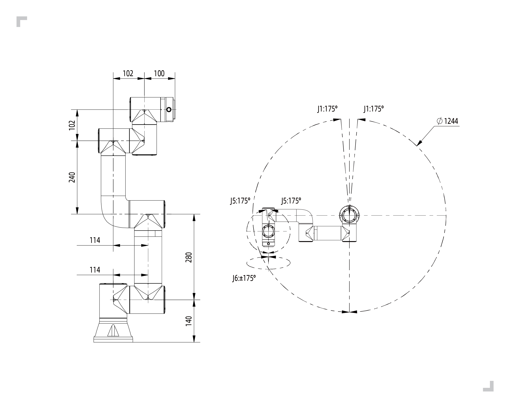
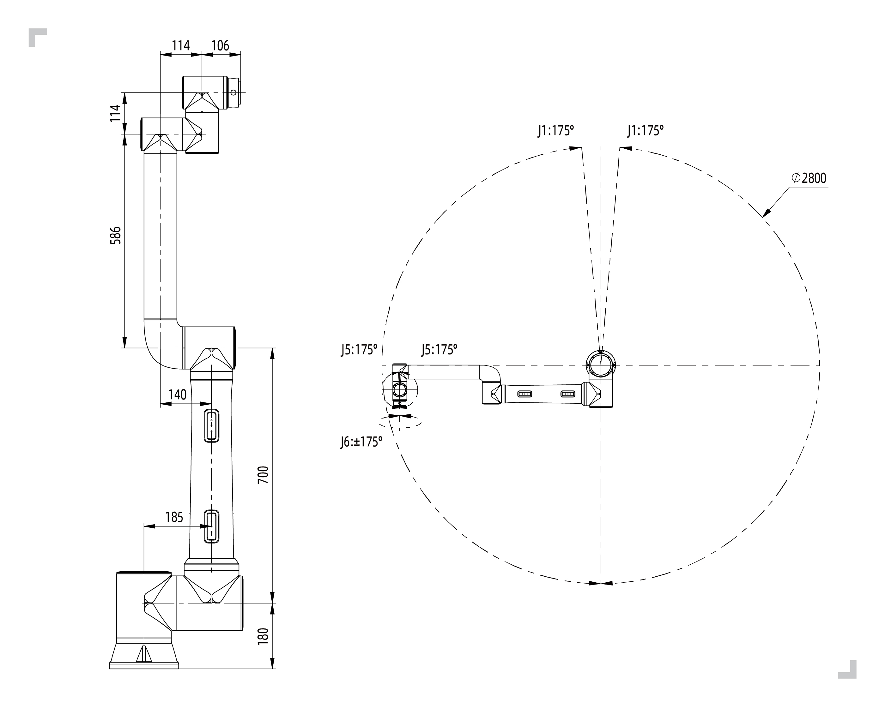
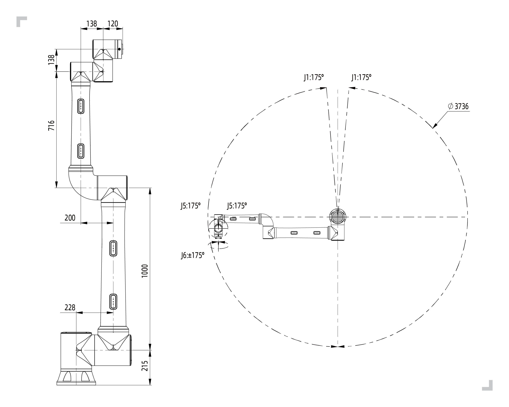
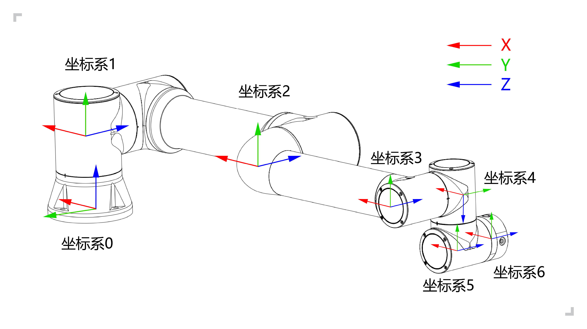

机器人简介
===================

.. toctree:: 
	:maxdepth: 5

基本参数
-----------

.. centered:: 表格 1.1-1 机器人基本参数

.. figure:: installation/017.png
	:align: center
	:width: 8in

.. important::
  FR系列机器人在做姿态或坐标系变换时齐次变换矩阵计算的角度旋转顺序为浮动坐标系的“ZYX”。

运动范围
----------

机械臂安装空间：

机器人本体安装需要3m×3m×2m（长×宽×高）的空间，以满足机器人最大臂展下的运动；若用户自行增加末端负载，请确保安装空间留有最少500mm间隙。

.. note:: 
	高度空间受安装底座高度的影响，此处2m是指高出安装基准面的距离

控制柜安装空间：

1.控制箱应放在易于操作，防止水淹触电，距离地面0.6m-1.5m。

2.柜体必须远离热源。

3.控制箱重载线一侧应满足150mm以内无遮挡，其余侧满足100mm以内无遮挡，便于散热和取放。

.. centered:: 图表 1.1-1 FR3型号协作机器人运动范围

.. figure:: installation/019.png
	:align: center
	:width: 6in
	:class: figure-border

.. centered:: 图表 1.1-2 FR5型号协作机器人运动范围

.. centered:: 图表 1.1-3 FR10型号协作机器人运动范围

.. figure:: installation/021.png
	:align: center
	:width: 6in
	:class: figure-border

.. centered:: 图表 1.1-4 FR16型号协作机器人运动范围

.. centered:: 图表 1.1-5 FR20型号协作机器人运动范围

.. centered:: 图表 1.1-6 FR30型号协作机器人运动范围

机器人坐标系
---------------

.. centered:: 图表 1.1-7 机器人DH参数坐标系

.. figure:: installation/024.png
	:align: center
	:width: 6in
	:class: figure-border

.. centered:: 图表 1.1-8 机器人末端法兰坐标系

机器人DH参数
--------------

DH参数用于计算 FR 系列协作机器人的运动学和动力学。

.. figure:: installation/063.png
	:align: center
	:width: 6in
	:class: figure-border

.. centered:: 图表 1.1-9 FR系列协作机器人DH参数

FR系列协作机器人DH参数展示如下：

.. centered:: 表格 1.1-2 FR3 协作机器人DH参数表

.. list-table::
   :widths: 70 50 50 50 50 70 50 120
   :header-rows: 0
   :align: center
   :class: no-padding sheet-center

   * - **运动学**
     - **theta[rad]**
     - **a[m]**
     - **d[m]**
     - **alpha[rad]**
     - **动力学**
     - **Mass[kg]**
     - **Center of Mass[m]**

   * - Joint1
     - 0
     - 0
     - 140
     - π/2
     - Link1
     - 1.98
     - [-0.05, -15.92, 2.26]

   * - Joint2
     - 0
     - -280
     - 0
     - 0
     - Link2
     - 3.4445
     - [139.49, 0, 99.54]

   * - Joint3
     - 0
     - -240
     - 0
     - 0
     - Link3
     - 1.437
     - [58.99, 0.08, 12.99]

   * - Joint4
     - 0
     - 0
     - 102
     - π/2
     - Link4
     - 0.871
     - [0.05, -2.33, 14.67]

   * - Joint5
     - 0
     - 0
     - 102
     - -π/2
     - Link5
     - 0.805
     - [-0.05, 2.33, 14.67]

   * - Joint6
     - 0
     - 0
     - 100
     - 0
     - Link6
     - 0.261
     - [-0.05, -1.11, -20.05]

.. centered:: 表格 1.1-3 FR5 协作机器人DH参数表

.. list-table::
   :widths: 70 50 50 50 50 70 50 120
   :header-rows: 0
   :align: center
   :class: no-padding sheet-center

   * - **运动学**
     - **theta[rad]**
     - **a[m]**
     - **d[m]**
     - **alpha[rad]**
     - **动力学**
     - **Mass[kg]**
     - **Center of Mass[m]**

   * - Joint1
     - 0
     - 0
     - 152
     - π/2
     - Link1
     - 4.64
     - [-0.19, -18.28, 2.26]

   * - Joint2
     - 0
     - -425
     - 0
     - 0
     - Link2
     - 10.08
     - [212.47, 0, 121.2]

   * - Joint3
     - 0
     - -395
     - 0
     - 0
     - Link3
     - 2.71
     - [122.62, 0.17, 12.59]

   * - Joint4
     - 0
     - 0
     - 102
     - π/2
     - Link4
     - 1.56
     - [0.05, -2.33, 14.68]

   * - Joint5
     - 0
     - 0
     - 102
     - -π/2
     - Link5
     - 1.56
     - [-0.05, 2.33, 14.68]

   * - Joint6
     - 0
     - 0
     - 100
     - 0
     - Link6
     - 0.36
     - [0.93, 0.81, -20.05]

.. centered:: 表格 1.1-4 FR10 协作机器人DH参数表

.. list-table::
   :widths: 70 50 50 50 50 70 50 120
   :header-rows: 0
   :align: center
   :class: no-padding sheet-center

   * - **运动学**
     - **theta[rad]**
     - **a[m]**
     - **d[m]**
     - **alpha[rad]**
     - **动力学**
     - **Mass[kg]**
     - **Center of Mass[m]**

   * - Joint1
     - 0
     - 0
     - 180
     - π/2
     - Link1
     - 11.97
     - [-0.10, -26.12, 4.04]

   * - Joint2
     - 0
     - -700
     - 0
     - 0
     - Link2
     - 19.59
     - [480.27, 0.01, 164.68]

   * - Joint3
     - 0
     - -586
     - 0
     - 0
     - Link3
     - 3.7
     - [211.22, 0.11, 54.21]

   * - Joint4
     - 0
     - 0
     - 159
     - π/2
     - Link4
     - 1.69
     - [0.12, -3, 12.18]

   * - Joint5
     - 0
     - 0
     - 114
     - -π/2
     - Link5
     - 1.69
     - [-0.12, 3, 12.18]

   * - Joint6
     - 0
     - 0
     - 106
     - 0
     - Link6
     - 0.35
     - [1.24, 0.85, -20.34]

.. centered:: 表格 1.1-5 FR16 协作机器人DH参数表

.. list-table::
   :widths: 70 50 50 50 50 70 50 120
   :header-rows: 0
   :align: center
   :class: no-padding sheet-center

   * - **运动学**
     - **theta[rad]**
     - **a[m]**
     - **d[m]**
     - **alpha[rad]**
     - **动力学**
     - **Mass[kg]**
     - **Center of Mass[m]**

   * - Joint1
     - 0
     - 0
     - 180
     - π/2
     - Link1
     - 11.97
     - [-0.10, -26.12, 4.04]

   * - Joint2
     - 0
     - -520
     - 0
     - 0
     - Link2
     - 18.18
     - [364.4, 0.01, 163.09]

   * - Joint3
     - 0
     - -400
     - 0
     - 0
     - Link3
     - 3.22
     - [135.03, 0.12, 55.58]

   * - Joint4
     - 0
     - 0
     - 159
     - π/2
     - Link4
     - 1.69
     - [0.12, -3, 12.18]

   * - Joint5
     - 0
     - 0
     - 114
     - -π/2
     - Link5
     - 1.69
     - [-0.12, 3, 12.18]

   * - Joint6
     - 0
     - 0
     - 106
     - 0
     - Link6
     - 0.35
     - [1.24, 0.85, -20.34]

.. centered:: 表格 1.1-6 FR20 协作机器人DH参数表

.. list-table::
   :widths: 70 50 50 50 50 70 50 120
   :header-rows: 0
   :align: center
   :class: no-padding sheet-center

   * - **运动学**
     - **theta[rad]**
     - **a[m]**
     - **d[m]**
     - **alpha[rad]**
     - **动力学**
     - **Mass[kg]**
     - **Center of Mass[m]**

   * - Joint1
     - 0
     - 0
     - 215
     - π/2
     - Link1
     - 20.79
     - [-0.19, -36.57, 5.68]

   * - Joint2
     - 0
     - -1000
     - 0
     - 0
     - Link2
     - 42.84
     - [605.25, 0.06, 202.94]

   * - Joint3
     - 0
     - -716
     - 0
     - 0
     - Link3
     - 9.88
     - [262.84, 0.22, 43.08]

   * - Joint4
     - 0
     - 0
     - 166
     - π/2
     - Link4
     - 4.64
     - [0.23, -2.28, 18.42]

   * - Joint5
     - 0
     - 0
     - 138
     - -π/2
     - Link5
     - 4.64
     - [-0.23, 2.28, 18.42]

   * - Joint6
     - 0
     - 0
     - 120
     - 0
     - Link6
     - 0.6
     - [-2.11, -1.96, -20.38]

.. centered:: 表格 1.1-7 FR30 协作机器人DH参数表

.. list-table::
   :widths: 70 50 50 50 50 70 50 120
   :header-rows: 0
   :align: center
   :class: no-padding sheet-center

   * - **运动学**
     - **theta[rad]**
     - **a[m]**
     - **d[m]**
     - **alpha[rad]**
     - **动力学**
     - **Mass[kg]**
     - **Center of Mass[m]**

   * - Joint1
     - 0
     - 0
     - 215
     - π/2
     - Link1
     - 20.64
     - [-0.22, -37.39, 5.59]

   * - Joint2
     - 0
     - -700
     - 0
     - 0
     - Link2
     - 36.37
     - [440.73, 0.05, 198.7]

   * - Joint3
     - 0
     - -536
     - 0
     - 0
     - Link3
     - 8.41
     - [185.64, 0.25, 45.82]

   * - Joint4
     - 0
     - 0
     - 166
     - π/2
     - Link4
     - 4.64
     - [0.23, -2.29, 18.60]

   * - Joint5
     - 0
     - 0
     - 138
     - -π/2
     - Link5
     - 4.64
     - [-0.23, 2.29, 18.60]

   * - Joint6
     - 0
     - 0
     - 120
     - 0
     - Link6
     - 0.6
     - [-2.11, -1.96, -20.38]

DH参数表
---------------------------------
        :download:`法奥协作机器人 - DH参数表 <../_static/_doc/法奥协作机器人 - DH参数表.zip>`