机器人外设
=============

.. toctree:: 
  :maxdepth: 5

夹爪外设配置
-------------------

夹爪程序示教步骤
~~~~~~~~~~~~~~~~~~~

**Step1**：在用户外设配置界面中选择“末端外设配置”按钮，设备类型选择“夹爪设备”，夹爪的配置信息分为夹爪厂商、夹爪类型、软件版本和挂载位置，用户可根据具体的生产需求来配置相应的夹爪信息。若用户需要更改配置，可先选择相应的夹爪编号，点击“清除”按钮，来清除相应的按钮，并重新根据需求配置；

.. figure:: robot_peripherals/001.png
   :align: center
   :width: 3in

.. centered:: 图表 5.1‑1 夹爪配置

.. important:: 
	点击清除配置前，相应的夹爪应处于未激活状态。

**Step2**：夹爪配置完成后，用户可在页面下方的夹爪信息表中查看相应的夹爪信息，若发现配置错误，可点击“清除”按钮，重新配置夹爪；

.. figure:: robot_peripherals/002.png
   :align: center
   :width: 3in

.. centered:: 图表 5.1‑2 夹爪配置信息

**Step3**：选择配置完成的夹爪，点击“复位”按钮，页面弹出命令发送成功后，再点击“激活”按钮，可查看夹爪信息表中的激活状态，来判断是否激活成功；

.. important::
	激活夹爪时，夹爪不可有夹持物

**Step4**：程序示教命令界面中选择“Gripper”命令。在夹爪命令界面中，用户可以选择想要控制的夹爪编号（已经完成配置并且被激活的夹爪），设置相应的开闭状态、开闭速度、开闭力矩已经等待夹爪动作的最大时间。完成设置后点击添加应用即可。此外还可以添加夹爪激活和复位指令，以便于在运行程序时去激活/复位夹爪。

.. figure:: robot_peripherals/003.png
   :align: center
   :width: 3in

.. centered:: 图表 5.1‑3 夹爪指令编辑

夹爪程序示教
~~~~~~~~~~~~~~~

.. list-table:: 
   :widths: 15 40 100
   :header-rows: 1

   * - 序号
     - 指令格式
     - 注释
   * - 1
     - PTP(template2,100,-1,0)
     - #等待夹取点
   * - 2
     - PTP(template1,100,-1,0)
     - #夹取点
   * - 3
     - MoveGripper(1,255,255,0,1000,0)
     - #夹爪闭合
   * - 4
     - PTP(template2,100,-1,0)
     - /
   * - 5
     - PTP(template3,100,-1,0)
     - #等待放件点
   * - 6
     - PTP(template3,100,-1,0)
     - #放件点
   * - 7
     - MoveGripper(1,0,255,0,1000,0)
     - #夹爪开启

喷枪外设配置
-------------

喷枪外设配置步骤
~~~~~~~~~~~~~~~~~~

**Step1**：在用户外设配置界面中选择“喷枪配置”按钮，用户可以通过喷涂功能一键配置按键，对喷涂所需DO进行快速配置（默认配置DO10为喷涂启停，DO11为喷涂清枪）。 用户也可以根据自己的需求在“IO配置”界面，自定义配置DO；

.. important:: 
	使用喷涂功能之前，需要先建立相应的工具坐标系，并在程序示教时应用建立好的工具坐标系。

**Step2**：配置完成后，点击“开始喷涂”、“停止喷涂”、“开始清枪”和“停止清枪”四个按钮，进行喷枪调试；

.. figure:: robot_peripherals/005.png
   :align: center
   :width: 3in

.. centered:: 图表 5.2‑1 喷枪配置

**Step3**：在程序示教命令界面选择“spray”命令。根据具体的程序示教需求，在相应的地方添加应用“开始喷涂”、“停止喷涂”、“开始清枪”和“停止清枪”四个指令。

.. figure:: robot_peripherals/006.png
   :align: center
   :width: 3in

.. centered:: 图表 5.2‑2 喷枪指令编辑

喷涂程序示教
~~~~~~~~~~~~~~

.. list-table:: 
   :widths: 15 40 100
   :header-rows: 1

   * - 序号
     - 指令格式
     - 注释
   * - 1
     - Lin(template1,100,-1,0,0)
     - #开始喷涂点
   * - 2
     - SprayStart()
     - #开始喷涂
   * - 3
     - Lin(template2,100,-1,0,0)
     - #喷涂路径
   * - 4
     - Lin(template3,100,-1,0,0)
     - #停止喷涂点
   * - 5
     - SprayStop()
     - #停止喷涂
   * - 6
     - Lin(template4,100,-1,0,0)
     - #清枪点
   * - 7
     - PowerCleanStart()
     - #开始清枪
   * - 8
     - WaitTime(5000)
     - #清枪时间 ms
   * - 9
     - PowerCleanStop()
     - #停止清枪

焊机外设配置
-------------

焊机外设配置步骤
~~~~~~~~~~~~~~~~~~

**Step1**：在用户外设配置界面中选择“焊机配置”按钮，用户可以通过选择IO类型，选择“控制器I/O”配置焊机IO按键，对焊机所需DI和DO进行快速配置。默认配置如下：

.. list-table:: 
   :widths: 15 40
   :header-rows: 1
   :align: center

   * - IO信号
     - 功能

   * - DI12
     - 起弧成功信号

   * - DO9
     - 送气信号

   * - DO10
     - 起弧信号

   * - DO11
     - 点动送丝

   * - DO12
     - 反向送丝

   * - DO13
     - JOB选择1

   * - DO14
     - JOB选择2

   * - DO15
     - JOB选择3

用户也可以根据自己的需求在“IO配置”界面，自定义配置；或者选择“扩展I/O”后，配置扩展IO。

扩展配置IO：

- DI的“焊机准备”、“起弧成功”、“焊机中断恢复”和“焊机中断退出”；
- DO的“焊机起弧”、“气体检测”、“正向送丝”和“反向送丝”；

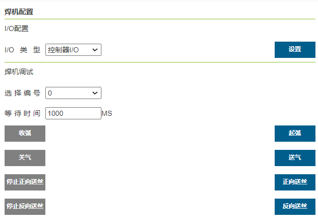

.. centered:: 图表 5.3‑1 IO配置（控制器IO）

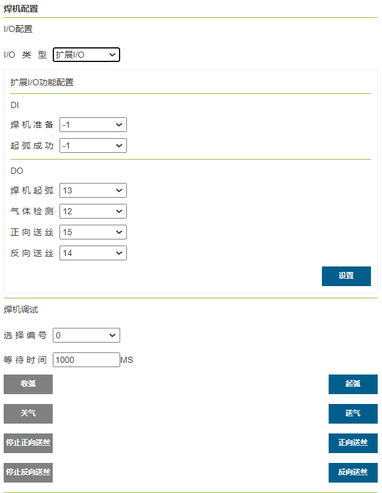

.. centered:: 图表 5.3‑2 IO配置（扩展IO）

.. important:: 
	使用焊机功能之前，需要先建立相应的工具坐标系，并在程序示教时应用建立好的工具坐标系。焊机功能通常与激光跟踪传感器配合使用。

**Step2**：配置完成后，选择编号，设定等待时间，点击“收弧”、“起弧”、“送气”、“关气”、“正向送丝”和“反向送丝”六个按钮，进行焊机调试；

.. centered:: 图表 5.3‑3 焊机配置

**Step3**：在程序示教命令界面选择“Weld”命令。根据具体的程序示教需求，在相应的地方添加应用“起弧”、“收弧”、“关气”、“送气”、“停止正向送丝”、“正向送丝”、“停止反向送丝”和“反向送丝”指令。

.. figure:: robot_peripherals/009.png
   :align: center
   :width: 3in

.. centered:: 图表 5.3‑4 焊机指令编辑

焊机程序示教
~~~~~~~~~~~~~~~

.. list-table::
   :widths: 15 40 100
   :header-rows: 0
   :align: center

   * - **序号**
     - **指令格式**
     - **注释**

   * - 1
     - ARCEnd(0,0,10000)
     - 收弧

   * - 2
     - ARCStart(0,0,10000)
     - 起弧

   * - 3
     - SetAspirated(0,0)
     - 关气

   * - 4
     - SetAspirated(0,1)
     - 送气

   * - 5
     - SetForwardWireFeed(0,0)
     - 停止正向送丝

   * - 6
     - SetForwardWireFeed(0,1)
     - 正向送丝

   * - 7
     - SetReverseWireFeed(0,0)
     - 停止反向送丝

   * - 8
     - SetReverseWireFeed(0,1)
     - 反向送丝

电弧中断参数配置
~~~~~~~~~~~~~~~~~
电弧中断参数配置，可获取和设置电弧中断检测使能和确认时长。

焊接中断再恢复参数配置，可获取和设置焊接中断再重连使能、焊道重叠距离、从当前位置返回再起弧点速度和运行方式。

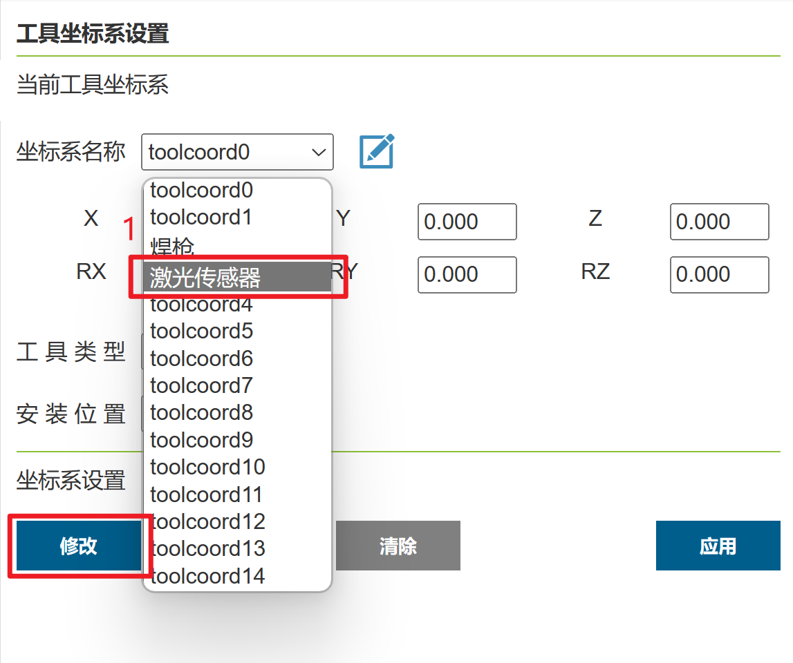

.. centered:: 图表 5.3‑5 电弧中断参数配置

当发生焊接中断，警告提示当前焊接已中断，可进行“退出中断”和“中断恢复”操作。

传感器外设配置
---------------
法奥协作机器人与激光传感器配合使用，通过传感器识别焊缝等特征位置以达到简化编程、提高生产效率的目的。协作机器人可适配睿牛、创想和全视三种厂商的激光传感器，使用不同传感器时只需要加载对应的通信协议即可。

硬件接线
~~~~~~~~~~~~~
使用激光传感器前需要将激光传感器安装于合适位置，将激光传感器的网线直接连接或通过交换机连接到机器人控制箱的任一RJ45接口。

传感器配置
~~~~~~~~~~~~~

请确保您的激光传感器和焊枪已经固定安装于机器人末端，激光传感器已经与机器人控制箱通过网线连接，并且激光传感器与机器人控制箱的IP地址处于同一网段，打开机器人和传感器电源，图1为睿牛激光传感器安装。

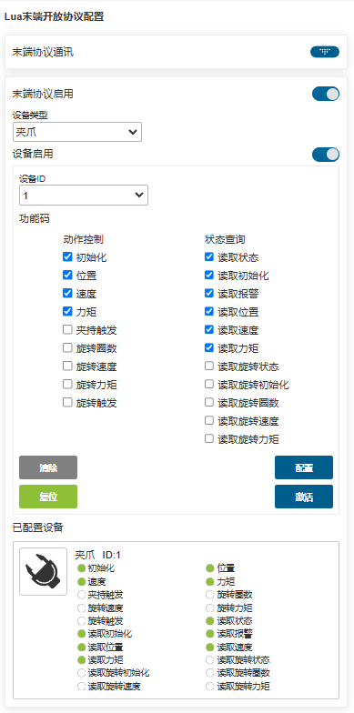

.. centered:: 图表 5.4‑1 激光传感器安装

如图2，打开机器人WebApp，依次点击“初始设置”、“用户外设配置”、“传感器跟踪”，在通信配置栏中输入传感器的IP地址、端口号，点击“配置”按钮，采样周期默认为25，坐标系选择“激光平面坐标系”，根据您的传感器型号选择对应的通信协议，点击“加载”按钮。

.. figure:: robot_peripherals/012.png
   :align: center
   :width: 6in

.. centered:: 图表 5.4‑2 激光传感器配置

如图3，在“传感器跟踪”页面中找到“跟踪传感器测试”栏，依次点击“打开传感器”和“关闭传感器”，观察传感器的激光是否打开或关闭，若激光正常打开或关闭则表示机器人与传感器已经正常建立通信，否则请检查IP地址和端口号等参数是否正确，以及传感器与机器人网络连接是否正确。

.. figure:: robot_peripherals/013.png
   :align: center
   :width: 6in

.. centered:: 图表 5.4‑3 激光传感器通讯测试

传感器标定
~~~~~~~~~~~~
在使用激光传感器前需要先对激光传感器进行标定，标定精度直接影响激光传感器的跟踪精度。激光传感器的标定方法有五点法、六点法和八点法，以焊接应用场景下最常用的五点法为例，其标定原理为先通过工具（焊枪）指向一个固定标定点（如图4），再通过激光传感器从四个不同的姿态照射并识别到该点。

.. note::
  该标定点必须可以被激光传感器准确识别到，否则无法精确标定。 

进而计算出传感器坐标位姿，下面详细介绍其标定过程：

.. figure:: robot_peripherals/014.png
   :align: center
   :width: 6in

.. centered:: 图表 5.4‑4 激光传感器标定点

**step1**：打开机器人WebApp，依次点击“初始设置”、“机器人设置”、“工具坐标”，选择一个未使用的工具坐标系，点击修改其名称为“焊枪”，工具类型为“工具”，安装位置为“末端”，如图5、6。

.. figure:: robot_peripherals/015.png
   :align: center
   :width: 6in

.. centered:: 图表 5.4‑5 设置“焊枪坐标系”

.. figure:: robot_peripherals/016.png
   :align: center
   :width: 6in

.. centered:: 图表 5.4‑6 设置“焊枪”坐标系

如图7，再次选择一个未使用的坐标系，将其名称修改为“激光传感器”，选择工具类型为“传感器”，安装位置为“末端”。

.. figure:: robot_peripherals/017.png
   :align: center
   :width: 6in

.. centered:: 图表 5.4‑7 设置“激光传感器”坐标系

**step2**：用六点法对焊枪的工具坐标系进行标定：选则“焊枪”坐标系，点击修改按钮（图8、9），使用六点法进行焊枪工具坐标系的标定（具体标定方法参照法奥文档，本文不做赘述）。

.. figure:: robot_peripherals/018.png
   :align: center
   :width: 6in

.. centered:: 图表 5.4‑8 “焊枪”坐标系标定1

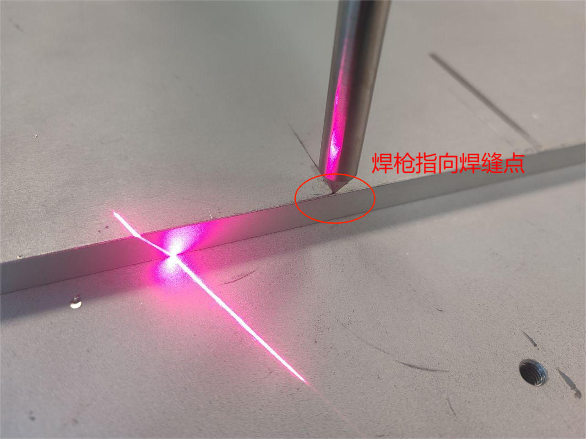

.. centered:: 图表 5.4‑9 “焊枪”坐标系标定2

**step3**：如图10，在“工具坐标系设置”中选择0号坐标系(基座标系)，默认名称为“toolcoord0”，点击“应用”，将当前的坐标系切换为基座标系。

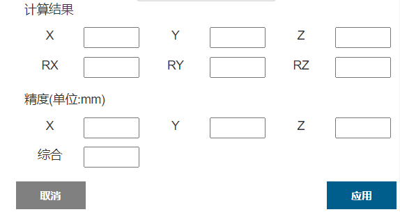

.. centered:: 图表 5.4‑10 传感器标定步骤1

**step4**：如图11，再次选择之前设置的“激光传感器”坐标系(不点击“应用”)，点击“修改”按钮，选择工具类型为“传感器”，传感器固定在“机器人末端”，修改向导选择“五点法”。

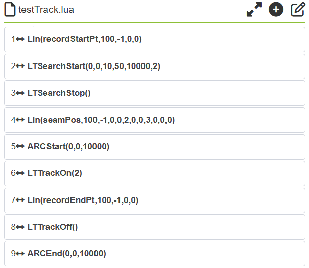

.. centered:: 图表 5.4‑11 传感器标定步骤2

**step5**：拖动机器人使焊枪尖端对准标定点（如图12），选择“焊枪”坐标系，点击“应用”，点击“设置点1”，如图13。

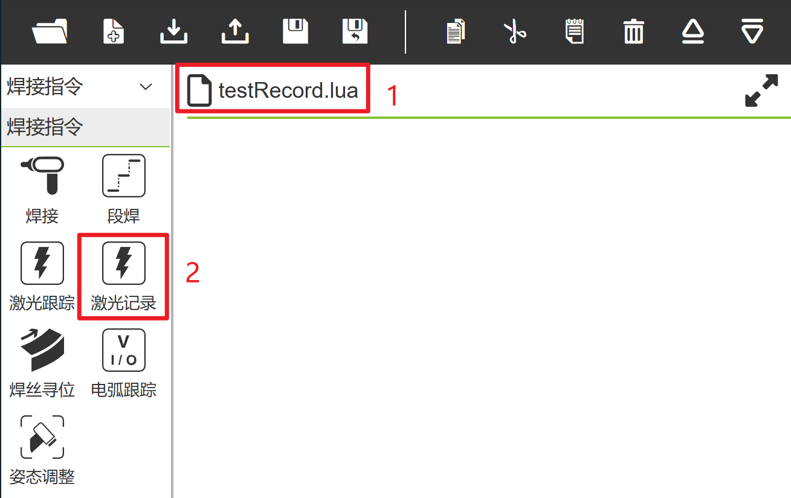

.. centered:: 图表 5.4‑12 传感器标定步骤3

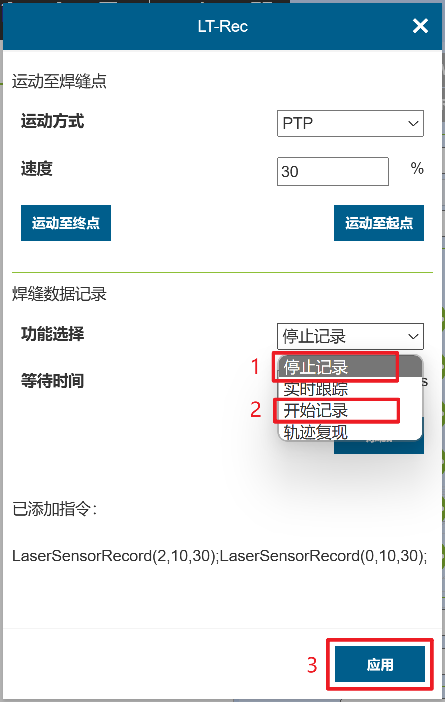

.. centered:: 图表 5.4‑13 传感器标定步骤4

**step6**：再次选择0号坐标系（“toolcoord0”），点击应用（图14）；然后选择“传感器”坐标系（不点击“应用”），点击“修改”（图15），即可继续进行标定。

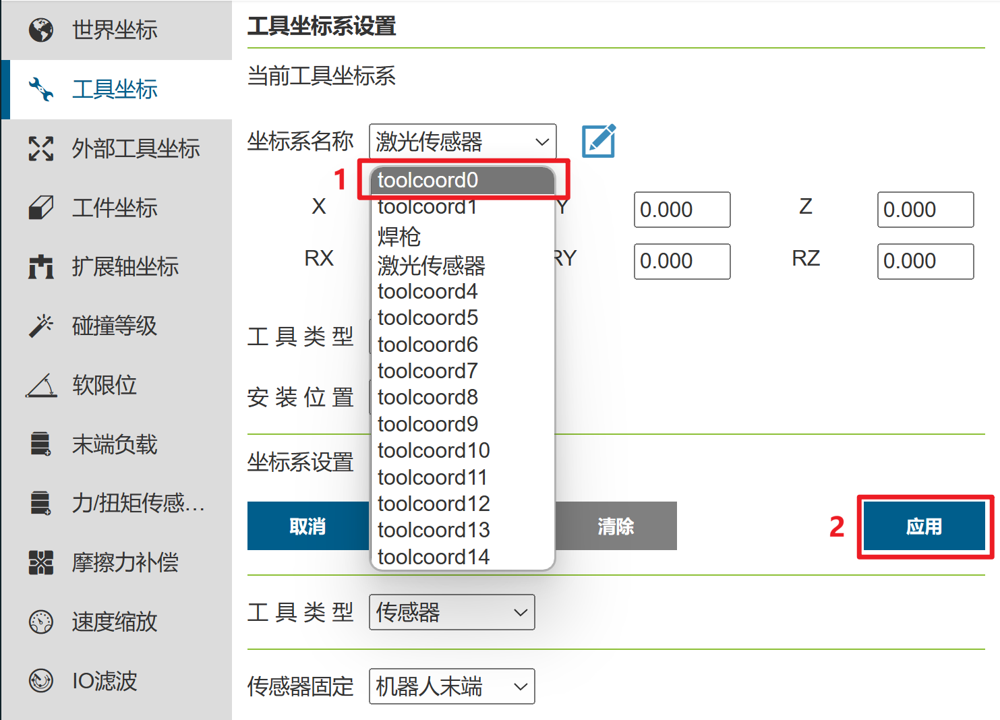

.. centered:: 图表 5.4‑14 传感器标定步骤5

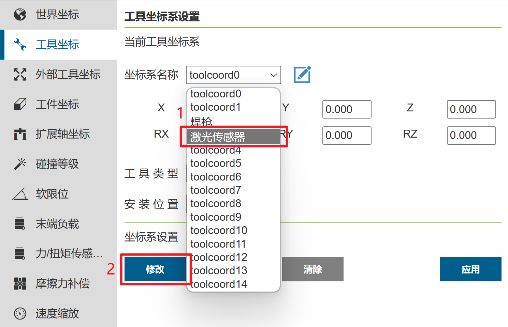

.. centered:: 图表 5.4‑15 传感器标定步骤6

**step7**：移动激光传感器位置，使激光刚好扫描到标定点(图16)，点击“设置点2”；此时左侧的传感器输出值对应序号位置会显示当前的传感器数据（图18），若数据正常则表示当前标定点成功，否则需要重新标定。

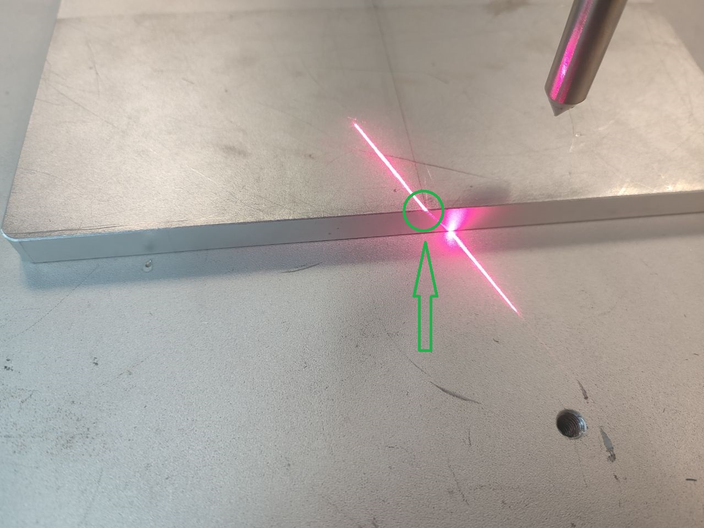

.. centered:: 图表 5.4‑16 传感器标定步骤7

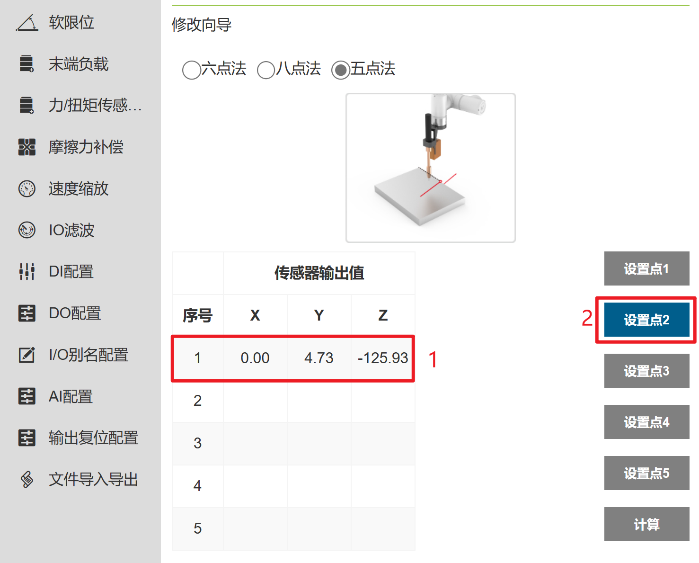

.. centered:: 图表 5.4‑17 传感器标定步骤8

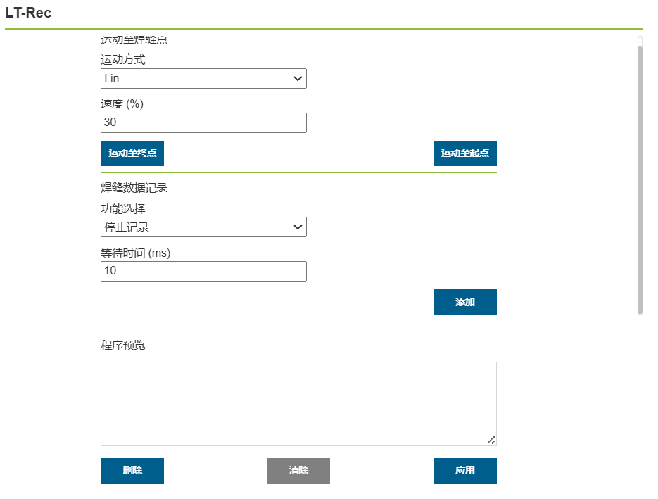

.. centered:: 图表 5.4‑18 传感器标定步骤9

**step8**：依次使激光再从三个不同的姿态照射标定点，并分别点击“设置点3”、“设置点4”和“设置点5”，最后在确保每个点的数据都正常的情况下，点击“计算”按钮（图19）。

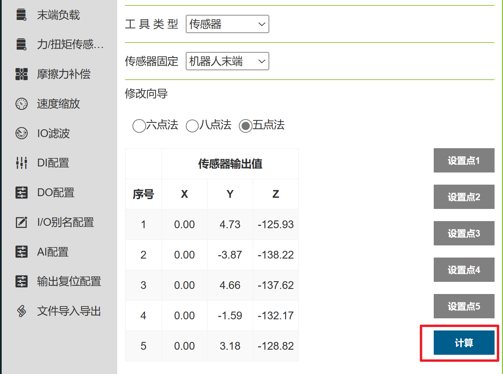

.. centered:: 图表 5.4‑19 传感器标定步骤10

**step9**：此时WebApp上显示传感器的标定结果和标定精度，点击“应用”按钮（图20），即完成了激光传感器的标定。若标定精度过差，则可以选择点击“取消”按钮，并重新进行标定。

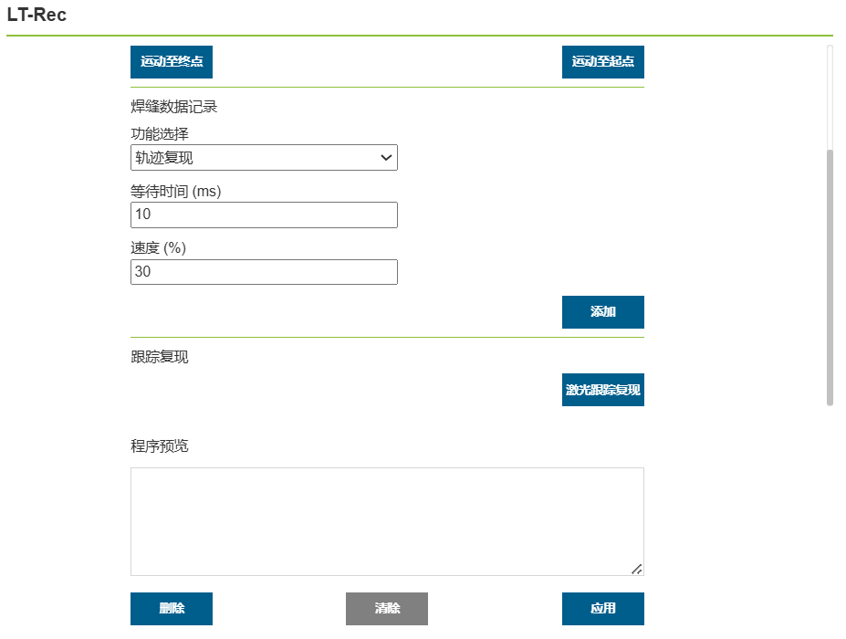

.. centered:: 图表 5.4‑20 传感器标定精度

激光传感器应用
~~~~~~~~~~~~~~~~
使用激光传感器前，先将“焊枪”工具坐标系应用到当前工具坐标系（图21）。

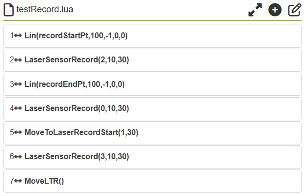

.. centered:: 图表 5.4‑21 应用焊枪坐标系

激光传感器示教点
++++++++++++++++++
如图22，拖动机器人使激光传感器光线指向想要示教的焊缝点。如图23，在WebApp选择传感器为“激光传感器”，输入传感器点名称为“laserPt”，点击“添加”按钮。新建用户程序“testLaser.lua”，创建运动指令PTP，目标点选择“laserPt”，单步执行该指令，此时焊枪将运动到之前激光传感器的指向点（图24）。

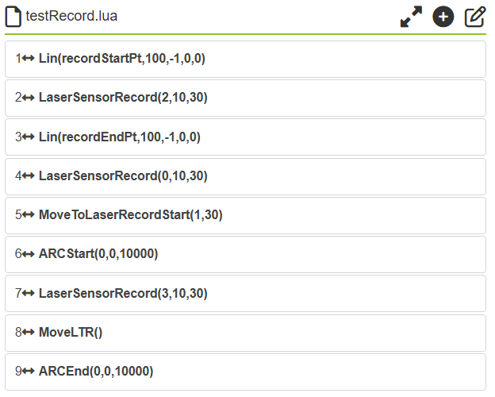

.. centered:: 图表 5.4‑22 激光传感焊缝点

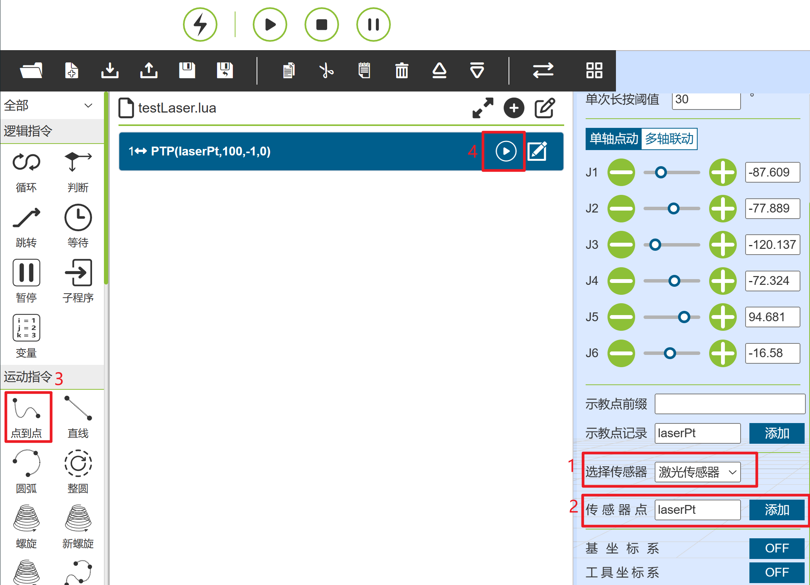

.. centered:: 图表 5.4‑23 示教传感器点

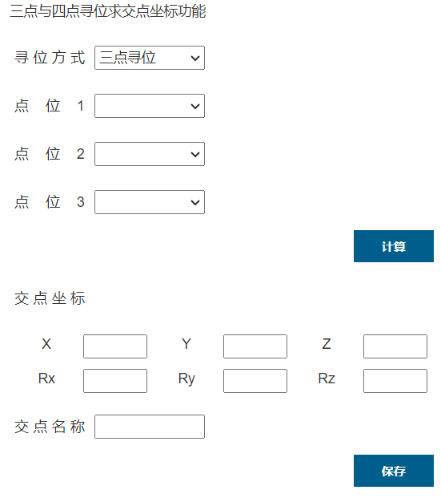

.. centered:: 图表 5.4‑24 焊枪指向焊缝点

激光寻位 + 跟踪
++++++++++++++++
协作机器人与激光传感器配合完成激光寻位+激光跟踪功能共需要一下几步：

(1) 机器人运动到焊缝外部的某一点；

(2) 开始激光寻位，且机器人携带激光传感器向焊缝位置移动；

(3) 激光传感器识别到焊缝，机器人带动焊枪运动到焊缝识别点；

(4) 激光跟踪开始，同时机器人向焊缝终点运动，激光传感器在运动过程中实时记录位置；

(5) 焊枪沿激光传感器记录的位置进行运动，实现跟踪效果。

在寻位跟踪调试前，请先确保传感器已经正确安装、“焊枪”工具坐标系已经正确标定，激光传感器也已经正确标定完成。如图25，假设图中绿色直线为待焊焊缝，使机器人实现自动寻找焊接起点A点，并自动焊接至B点，需要进行如下指令编写：

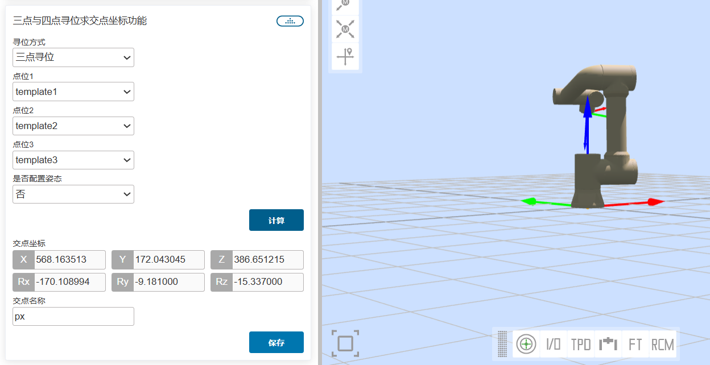

.. centered:: 图表 5.4‑25 传感器安装

编写寻位指令
*************

如图26，新建用户程序“laserTrack.lua”，选择“焊接指令”。

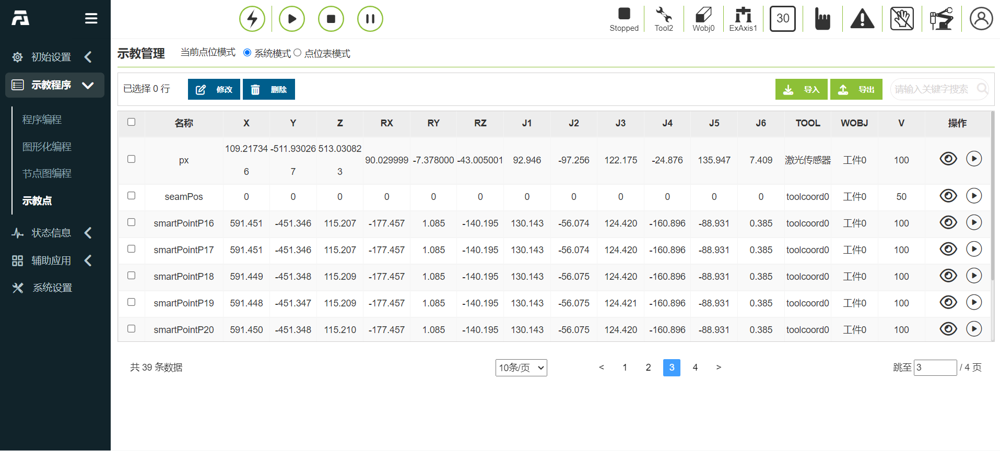

.. centered:: 图表 5.4‑26 添加寻位指令

如图27，点击“激光跟踪”，弹出激光跟踪指令添加页面。

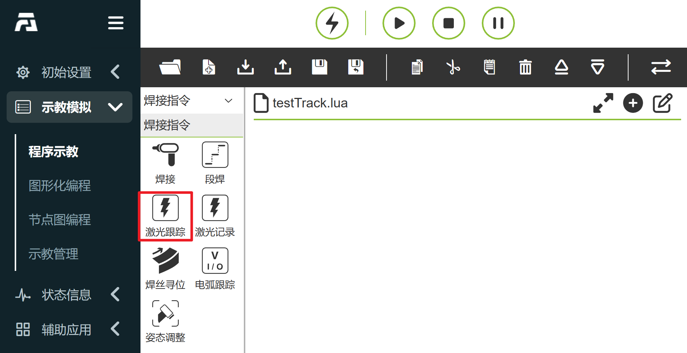

.. centered:: 图表 5.4‑27 激光跟踪指令

如图28，找到“寻位命令”，选择坐标系名称为“激光传感器”，方向选择“+x”表示机器人携带激光传感器从当前位置沿“焊枪”坐标系的“+x”方向边运动边搜寻焊缝，“速度”为激光传感器寻位的移动速度，长度为激光传感器的最大寻位长度，当机器人寻位距离超出该长度仍未寻找到焊缝时机器人将报错，最大寻位时间与长度类似，超出该时间仍未找到焊缝时机器人报错。请您根据实际场景正确输入上述相关参数。依次点击“寻位开始”和“寻位结束”指令，并点击“应用”按钮。

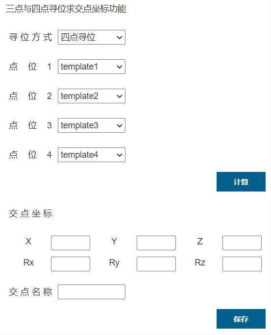

.. centered:: 图表 5.4‑28 添加寻位指令

此时“laserTrack.lua”中将增加对应的激光寻位开始和结束的指令（图29）。

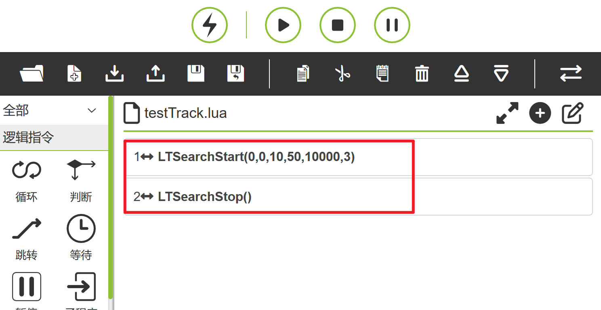

.. centered:: 图表 5.4‑29 寻位程序

编写运动到寻位点指令
*********************
添加点到点运动LIN指令，如图，目标点为“seamPos”即激光传感器寻位点。

.. note:: “seamPos点为机器人系统内部专用于激光传感器寻位的点位名称，不需要示教该点，激光传感器寻位后会自动将寻位点信息存入“seamPos点中”。

寻位点可以设置偏移，偏移类型可选择“基座标系偏移”、“工具坐标系偏移”和“激光原始数据偏移”（图30）。

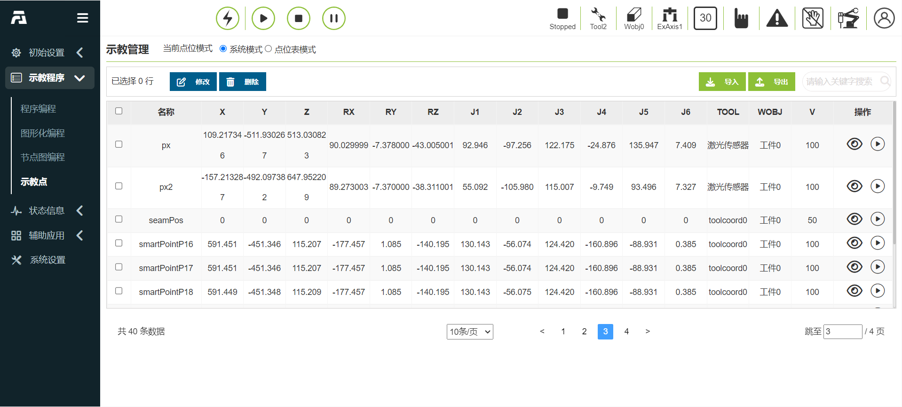

.. centered:: 图表 5.4‑30 寻位偏移选项

如图31，当启用寻位偏移功能时，可设置偏移参数，“dx”表示沿所选坐标系x方向的偏移距离，“drx”表示沿所选坐标系x轴旋转的角度。点击“添加”按钮，点击“应用”按钮。

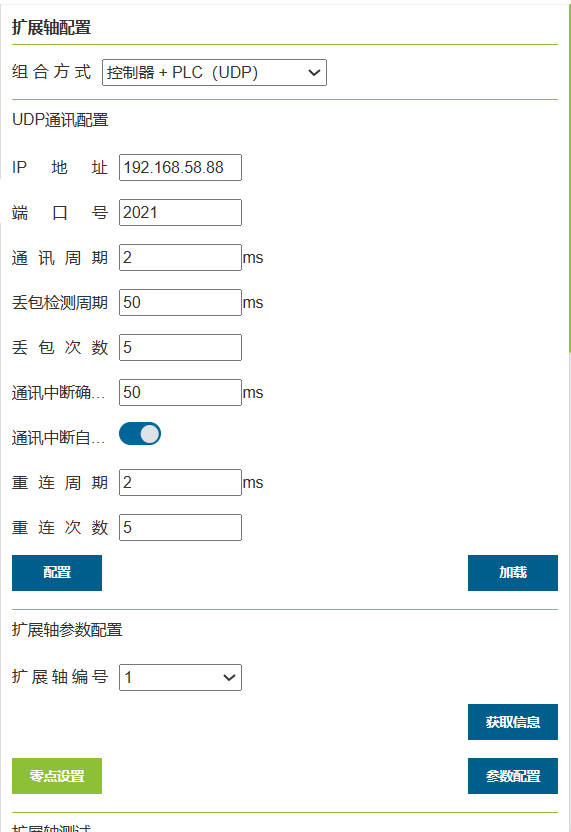

.. centered:: 图表 5.4‑31 寻位偏移参数设置

此时“testTrack.lua”中将增加运动到寻位点的指令，如图32。

.. centered:: 图表 5.4‑32 寻位偏移程序

编写激光跟踪指令
******************
再次打开“激光跟踪”指令添加页面，如图33。

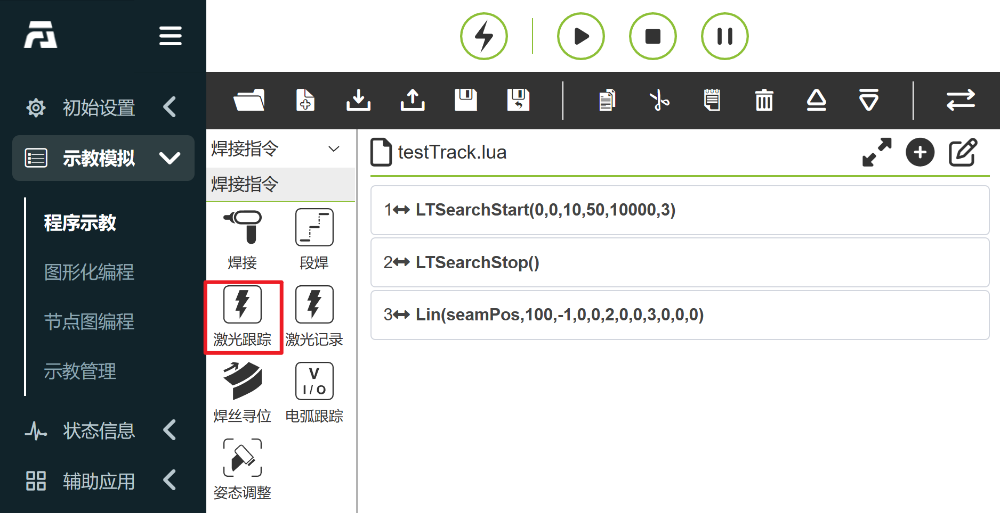

.. centered:: 图表 5.4‑33 激光跟踪

如图34，在“激光跟踪”指令添加页面中依次点击“开始跟踪”和“停止跟踪”按钮，最后点击页面最下面的“应用”按钮。

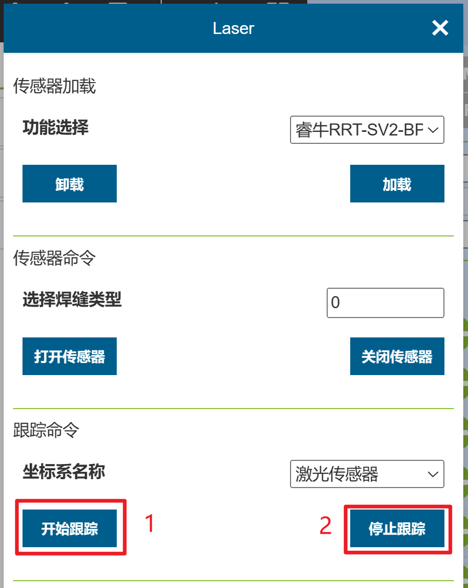

.. centered:: 图表 5.4‑34 激光跟踪开始与停止

此时的用户程序“testTrack.lua”如图35：

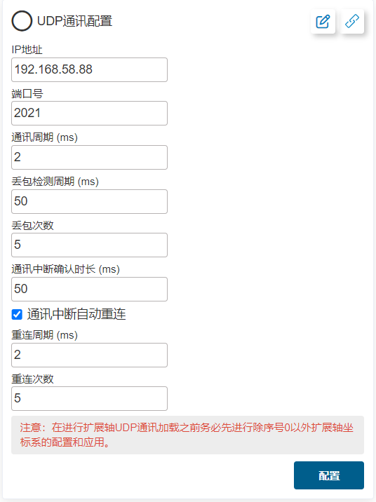

.. centered:: 图表 5.4‑35 激光跟踪程序

编写寻位开始点和跟踪终点指令
*****************************
在激光寻位开始前，需要先指定一个寻位起始点，机器人先运动到寻位起始点，然后再沿一定的方向和速度进行寻位，如图36，在激光传感器光线靠近焊缝起点A点附近示教寻位开始点“seamStartPt”，注意匹配寻位起始点与寻位方向，保证机器人能在设定的距离和最大寻位时间内找到焊缝位置。

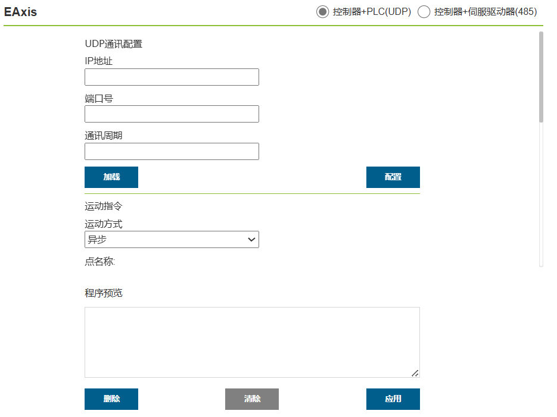

.. centered:: 图表 5.4‑36 寻位起点

如图37，在焊缝末端示教跟踪终止点“trackEndPt”。

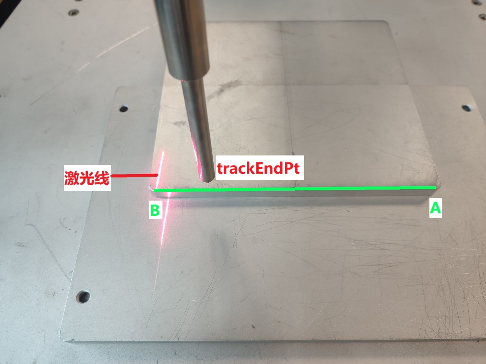

.. centered:: 图表 5.4‑37 寻位终点

将上述两个点添加到“testTrack.lua”用户程序中，最终的用户程序如下（图38）：

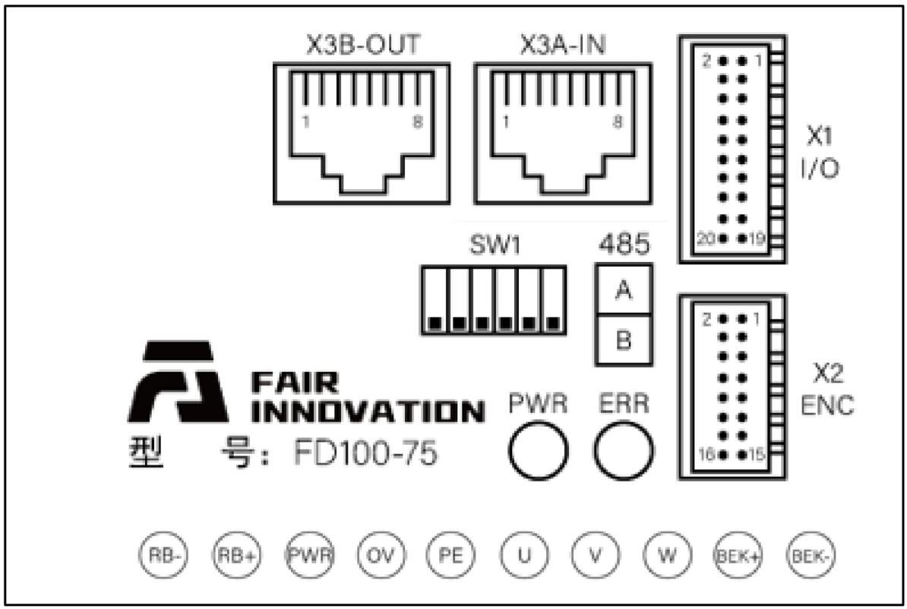

.. centered:: 图表 5.4‑38 寻位跟踪程序

编写焊接相关指令
*****************
最后，在焊接寻位点“seampos”和“trackEndPt”之间加上焊接指令，最终的程序如下（图39）：

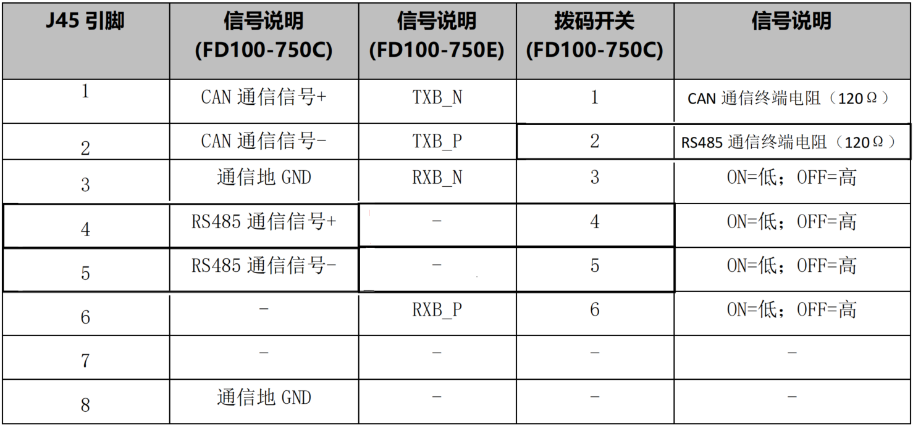

.. centered:: 图表 5.4‑39 寻位跟踪焊接程序

执行上述程序，机器人将携带激光传感器从寻位起点开始寻位运动，寻找到焊缝后，机器人立即运动到焊缝起点，并执行起弧操作，起弧成功后，机器人向焊缝终点运动并在运动过程中跟踪焊缝轨迹，机器人运动到焊缝终点后即停止焊接。

激光轨迹记录 + 轨迹复现
++++++++++++++++++++++++

激光轨迹记录+轨迹复现的工作流程为：

(1) 机器人携带激光传感器沿焊缝运动一段轨迹，激光传感器在运动的过程中实时记录焊缝位置轨迹数据；

(2) 轨迹记录完成后，机器人运动至轨迹记录的起始点；

(3) 机器人沿激光传感记录的轨迹进行轨迹复现运动。

机器人轨迹记录指令编写
************************
新建用户程序“testRecord.lua”，点击“激光记录”打开激光记录指令添加页面，找到“焊缝数据记录”，如图40，选择“开始记录”，点击“添加”按钮，选择停止记录，再次点击“添加”按钮；最后点击“应用”按钮（图41）。

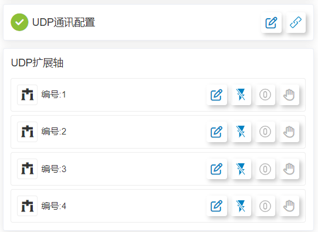

.. centered:: 图表 5.4‑40 激光记录

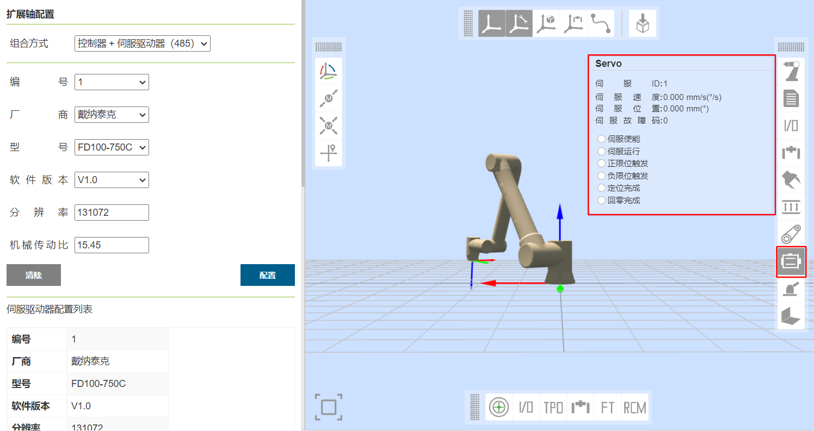

.. centered:: 图表 5.4‑41 开始记录与停止记录

此时页面上出现轨迹记录开始和停止指令（图42）。

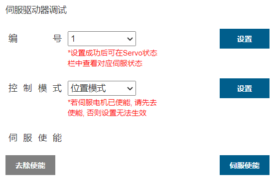

.. centered:: 图表 5.4‑42 轨迹记录程序

如图43，假设图中绿色线段AB为焊缝，分别使激光照射到焊缝起始点A和焊缝中断B，并示教轨迹记录的起点“recordStartPt”和终点“recordEndPt”。

.. centered:: 图表 5.4‑43 轨迹记录起点和终点

在“testRecord.lua”中添加两条直线(LIN)运动指令，分别为运动到轨迹记录起点“recordStartPt”和终点“recordEndPt”，并调整指令位置，使机器人进行如下操作：先运动到“recordStartPt”点，开始轨迹记录，机器人运动到“recordEndPt”点，停止轨迹记录（图44）。

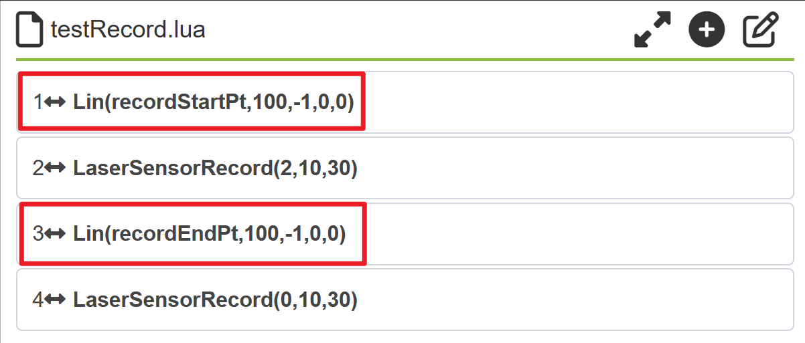

.. centered:: 图表 5.4‑44 轨迹记录程序

机器人运动到轨迹记录起点指令编写
*********************************
如图45，点击“激光记录”打开激光记录指令添加页面，找到“运动至焊缝点”栏，选择运动方式为PTP，输入一定的运动速度，点击“运动至起点”，点击“应用”按钮。

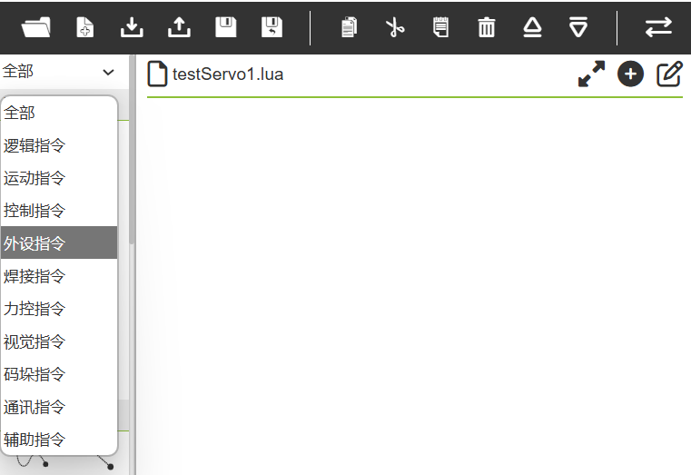

.. centered:: 图表 5.4‑45 运动至轨迹起点

此时“testRecord.lua”用户程序如下（图46）：

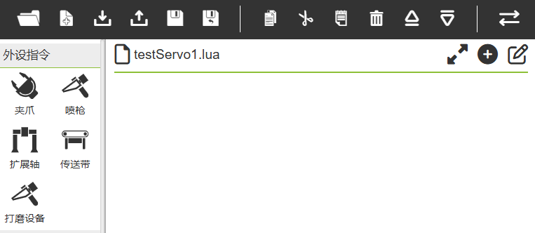

.. centered:: 图表 5.4‑46 运动至轨迹起点程序

激光传感器轨迹复现指令编写
****************************
点击“激光记录”打开激光记录指令添加页面，找到“焊缝数据记录”，如图，选择“轨迹复现”，点击“添加”按钮，点击“激光跟踪复现”按钮，最后点击“应用”按钮（图47）。

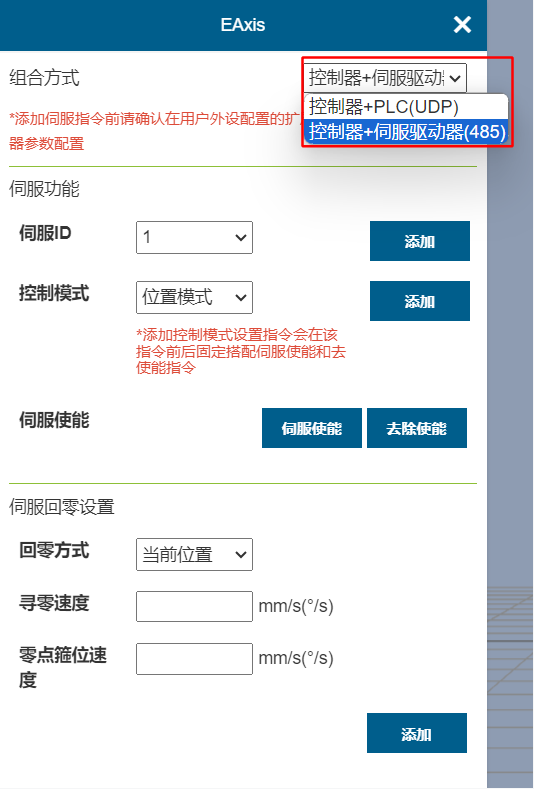

.. centered:: 图表 5.4‑47 轨迹复现

添加完成后的程序如下（图48）：

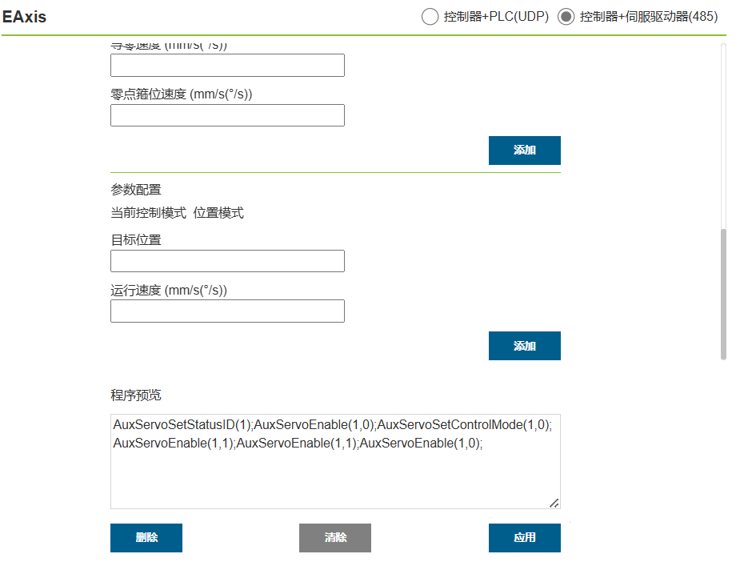

.. centered:: 图表 5.4‑48 轨迹复现程序

焊接相关指令编写
********************
最后在轨迹复现开始前和结束后加上焊接开始和焊接结束指令（图49）：

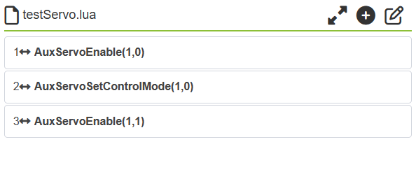

.. centered:: 图表 5.4‑49 轨迹记录复现焊接程序

执行上述程序，机器人将携带激光传感器先沿焊缝轨迹运动，并记录整个轨迹，然后机器人运动到轨迹记录的起点，机器人起弧并沿激光传感器记录的轨迹开始焊接，当机器人轨迹复现完成后，焊接电弧熄灭，完成焊接。

寻位三点与四点求交点坐标
~~~~~~~~~~~~~~~~~~~~~~~~~~~~
当角焊缝位置不方便直接示教时，协作机器人可以通过手动示教或寻位角焊缝两边板材平面位置的方式，计算得到两平面上采集点的交点来生成角焊缝所在位置。

对于直角焊缝，可以选用三点寻位求交点坐标方法；对于非直角焊缝，则采用四点寻位求交点坐标方法。

三点求交点坐标
++++++++++++++++++

**Step1**：采集三个平面接触点并保存为示教点；

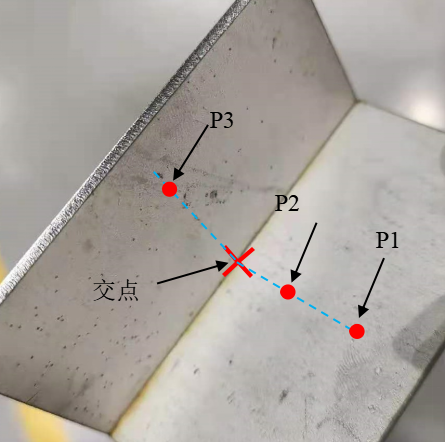

.. centered:: 图表 5.4‑50 选取三个寻位点

采集的接触点包含三个点，其中两点位于同一平面，另一点位于垂直平面。

.. note:: 生成交点的姿态与P3点一致。

**Step2**：点击初始设置->用户外设配置->传感器跟踪，进入三点与四点求交点坐标功能模块；

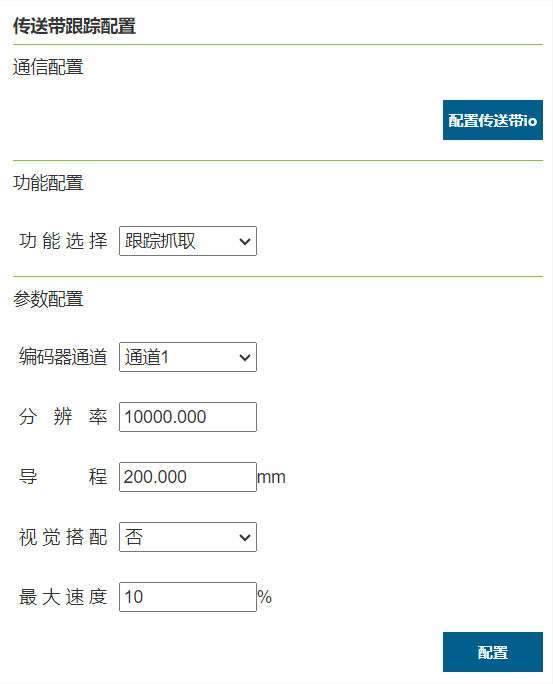

.. centered:: 图表 5.4‑51 选择求交点坐标的寻位点

**Step3**：下拉框选择三点寻位，依次选择采集的三个接触点，点击计算，查看3D模型中生成交点的显示是否有误，将交点命名并保存；

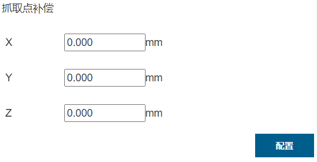

.. centered:: 图表 5.4‑52 计算交点坐标并保存

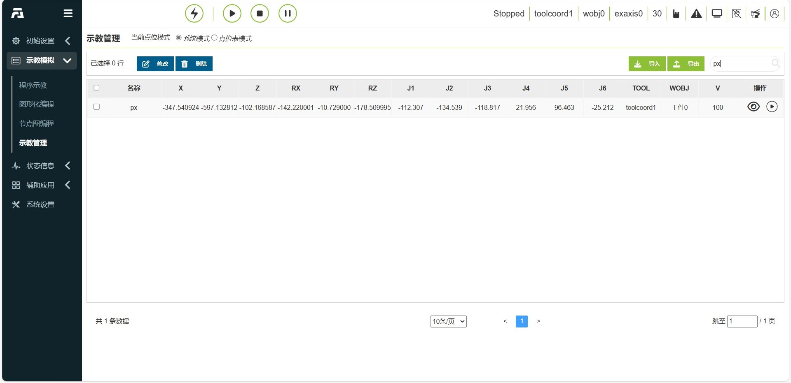

.. centered:: 图表 5.4‑53 将交点坐标保存成示教点

四点求交点坐标
++++++++++++++++++
**Step1**：集四个平面接触点并保存为示教点；

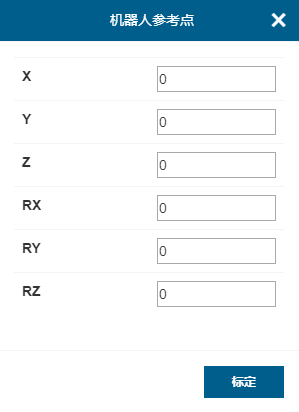

.. centered:: 图表 5.4‑54 选取四个寻位点

采集的接触点包含四个点，其中前两点位于同一平面，后两点位于垂直平面。

.. note:: 生成交点的姿态与P4点一致。

**Step2**：点击初始设置->用户外设配置->传感器跟踪，进入三点与四点求交点坐标功能模块；

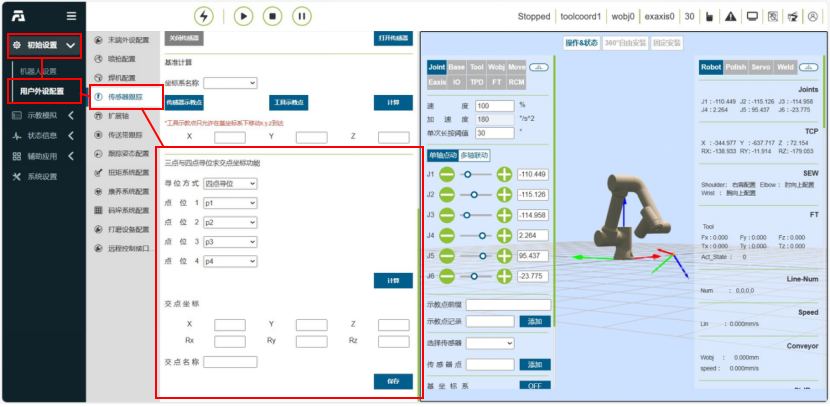

.. centered:: 图表 5.4‑55 选择求交点坐标的寻位点

**Step3**：下拉框选择四点寻位，依次选择采集的四个接触点，点击计算，查看3D模型中生成交点的显示是否有误，将交点命名并保存；

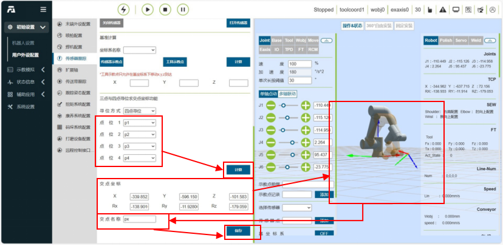

.. centered:: 图表 5.4‑56 计算交点坐标并保存

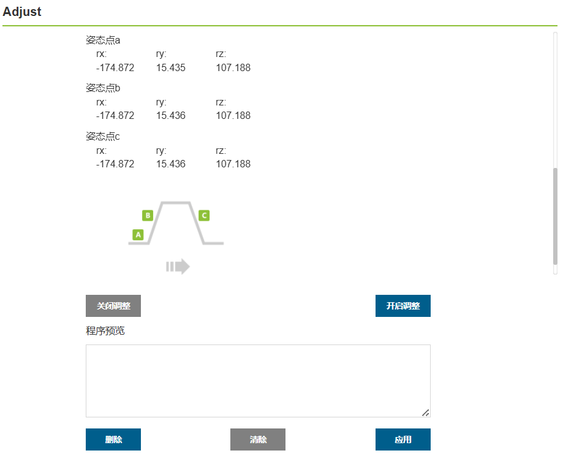

.. centered:: 图表 5.4‑57 将交点坐标保存成示教点

扩展轴外设配置
----------------

在用户外设配置界面中选择“扩展轴”按钮，进入扩展轴界面，选择组合方式进行对应的扩展轴外设配置。组合方式分为：控制器+PLC（UDP）和控制器+伺服驱动器（485）。

控制器+PLC（UDP）
~~~~~~~~~~~~~~~~~~~~

配置步骤
++++++++++++++++

**Step1**：首先对扩展轴UDP通信进行配置。设置IP地址、端口号、通信周期、丢包检测周期、丢包次数等参数，其中重连周期和重连次数需在通讯中断自动重连开关开启后才可配置。

- IP地址：自定义ip地址
- 端口号：根据实际情况定义
- 通讯周期：根据实际情况定义，单位ms
- 丢包检测通讯周期：10 ~ 1000 ms
- 丢包次数：1 ~ 100
- 通讯中断确认时长：0 ~ 500 ms
- 通讯中断自动重连：开/关
- 重连周期：1 ~ 1000 ms
- 重连次数：1 ~ 100

.. figure:: robot_peripherals/021.png
   :align: center
   :width: 3in

.. centered:: 图表 5.5‑1 扩展轴通信配置

.. important:: 
  1. 设置通讯断开确认时长后，当通讯异常超出该时长时才确认通讯断开并报错 
  2. UDP通讯断开后，触发UDP断开报错(可复位)，可点击清除警告信息按钮，UDP通讯再次建立。

**Step2**：选择扩展轴编号1，点击“参数配置”按键进入右侧界面。设置轴类型，轴方向，运行速度，加速度，正方向限位，反方向限位，导程，编码器分辨率，起点偏置，厂家，型号和模式，点击配置即可配置完成。

.. figure:: robot_peripherals/019.png
   :align: center
   :width: 3in

.. centered:: 图表 5.5-2 扩展轴参数配置
	
.. important:: 
	使用扩展轴功能之前，需要先建立相应的扩展轴标系，并在程序示教时应用建立好的工具坐标系。扩展轴功能主要与焊机功能和激光跟踪传感器功能配合使用。

**Step3**：使点击“零点设置”按键进入零点设置弹窗，如右侧图片所示。设定回零方式，寻零速度，零点箍位速度和轴方向，点击“设置”按键，扩展轴开始回零，回零状态会显示在轴方向下方空白处，当出现“回零已完成”提示表明扩展轴零点设置成功。

.. figure:: robot_peripherals/020.png
   :align: center
   :width: 3in

.. centered:: 图表 5.5‑3 扩展轴零点设置

**Step4**：选择已经配置好参数的扩展轴编号，点击“伺服使能”后，设置运行速度，加速度和单次运行最大距离，可以进行正向转动和反向转动测试扩展轴。

.. figure:: robot_peripherals/021.png
   :align: center
   :width: 3in

.. centered:: 图表 5.5‑4 扩展轴测试

**Step5**：扩展轴通常于激光传感器配合使用，此时激光传感器通常采用外部安装方式，传感器参考点配置需要采用三点法标定，而不是之前使用的六点法标定。将工具中心对准右侧横截面底部中间点（靠近相机那一侧）设定点1，将工具中心点对准另一截面即左侧横截面底部中间点，设定点2，将工具中心点移至传感器右侧横截面上边缘中间点，设定点3，计算并保存，点击应用完成三点法标定。

.. figure:: robot_peripherals/022.png
   :align: center
   :width: 3in

.. centered:: 图表 5.5‑5 传感器三点法标定

**Step6**：在程序示教命令界面选择“EAxis”命令。根据具体的程序示教需求，在相应的地方添加指令。

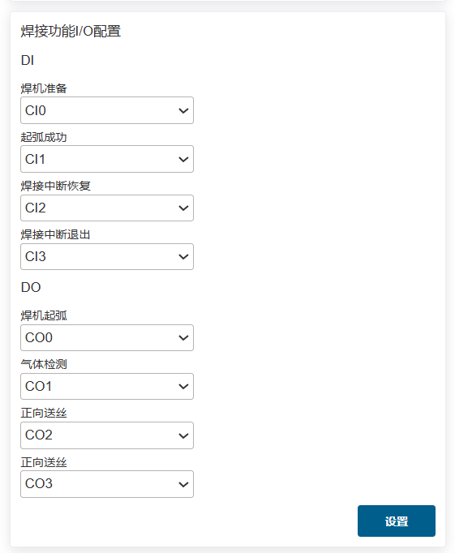

.. centered:: 图表 5.5‑6 扩展轴指令编辑

扩展轴配合激光跟踪焊接示教程序
+++++++++++++++++++++++++++++++

.. list-table::
   :widths: 50 80 80
   :header-rows: 0
   :align: center

   * - **序号**
     - **指令格式**
     - **注释**

   * - 1
     - EXT_AXIS_PTP(1,1laserstart)
     - #外部轴运动激光传感器起始点

   * - 2
     - PTP(laserstart,10,-1,0)
     - #机器人运动激光传感器起始点

   * - 3
     - LTSearchStart(3,20,10,10000)
     - #开始寻位

   * - 4
     - LTSearchStop()
     - #停止寻位

   * - 5
     - EXT_AXIS_PTP(1,1,seamPos)
     - #外部轴运动焊缝起点

   * - 6
     - Lin(seamPos,20,-1,00,0)
     - #机器人运动焊缝起点

   * - 7
     - LTTrackOn()
     - #激光跟踪

   * - 8
     - ARCStart(0,10000)
     - #焊机起弧

   * - 9
     - EXT_AXIS_PTP(1,1,laserend)
     - #外部轴运动焊缝终点

   * - 10
     - Lin( laserend,10,-1,0,0)
     - #机器人运动焊缝终点

   * - 11
     - ARCEnd(0,10000)
     - #焊机收弧

   * - 12
     - LTTrackOff
     - #激光跟踪关闭

控制器+伺服驱动器（485）
~~~~~~~~~~~~~~~~~~~~~~~~~~

硬件接线
++++++++++

图5.5‑7为法奥机器人mini控制箱电气接口示意图，使用RS485通信控制伺服扩展轴前，请先将伺服驱动器的RS485通信接口与机器人控制箱上的RS485通信接口建立连接。

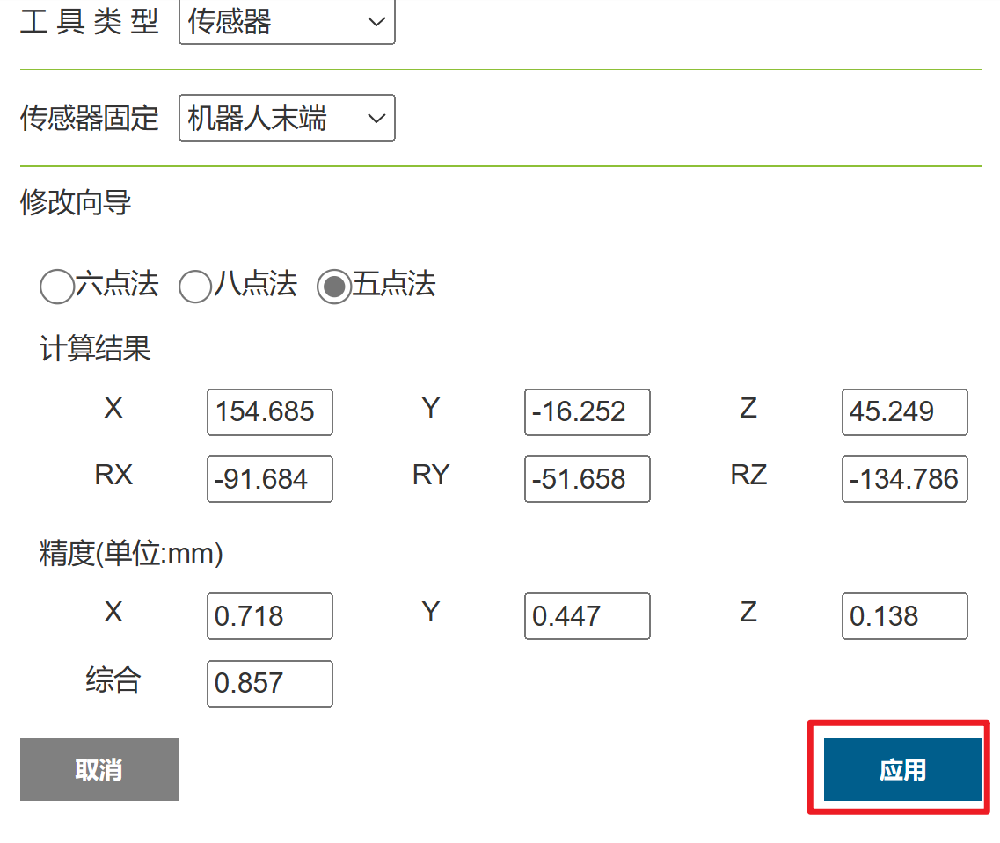

.. centered:: 图表 5.5‑7 法奥机器人mini控制箱电气接口示意图

以戴纳泰克伺服驱动器FD100-750C型号为例，图5.5‑8为改驱动器面板端子示意图，图5.5‑9为FD100-750C的X3A-IN端子定义，当机器人配置与FD100-750C伺服扩展轴通信时，需要将控制箱上的485-A0端子、485-B0端子分别与驱动器X3A-IN端子的4号和5号引脚连接。

.. note:: 
  您可以在伺服驱动器面板上看到一个“485”标志的插线端子，该端子暂未开放用户使用，请勿将您的RS485通信线缆连接到此端子上。

同时，若连接多个伺服驱动器，且该驱动器为链路的最后一个，需要将面板上的RS485通信中断电阻拨码开关（2号拨码）打开。

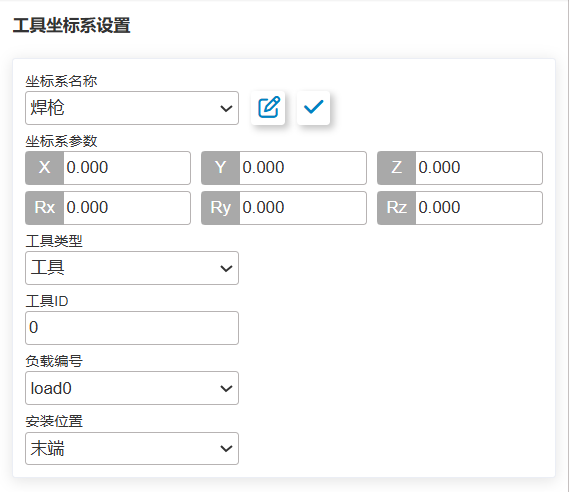

.. centered:: 图表 5.5‑8 FD100-750C驱动器面板

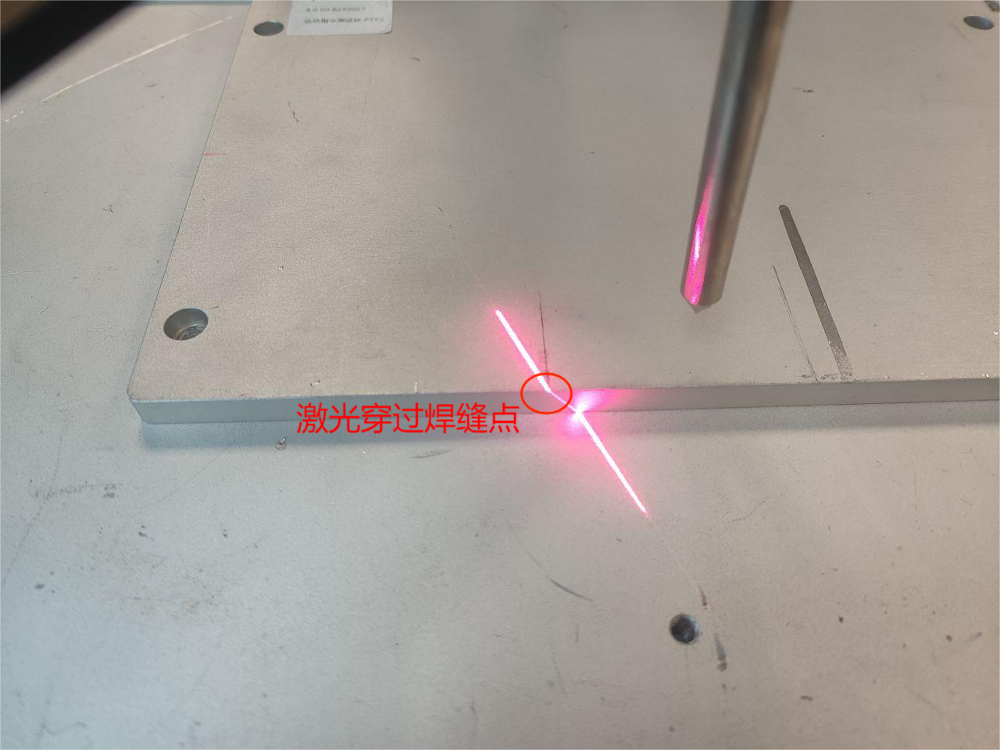

.. centered:: 图表 5.5‑9 FD100-750C的X3A-IN端子定义

通信配置
+++++++++++

**Step1**：确保您的RS485通信线缆正确连接且机器人和伺服扩展轴都正常上电后，打开机器人WebApp，如图5.5‑10所示，依次点击“初始设置”、“用户外设配置”、“扩展轴”，打开“扩展轴配置”页面。

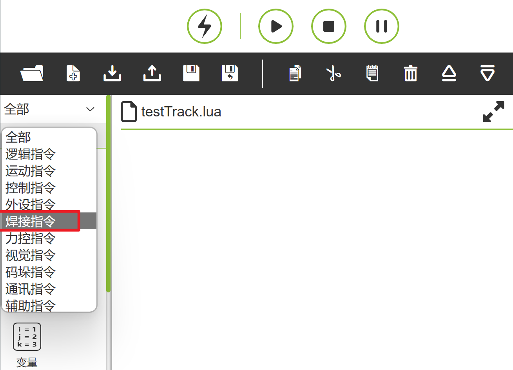

.. centered:: 图表 5.5‑10 RS485扩展轴配置

**Step2**：在“扩展轴配置”页面中，选择组合方式为“控制器 + 伺服驱动器”，编号为“1”。

.. note:: 
  当连接多个伺服时，此编号用于区分不同的伺服，后面我们会多次提到该编号。

厂商为“戴纳泰克”，选择相应的伺服驱动器型号，此处型号为“FD00-750C”，软件版本为V1.0，填写伺服驱动器对应的分辨率，此处为131072，根据您的机构模型填写机械传动比，此处为15.45。点击“配置”按钮。

**Step3**：至此我们已经完成机器人与伺服驱动器的485通讯配置，您可以在WebApp中右侧的“伺服状态栏”中查看伺服的实时状态信息（图5.5‑11）。

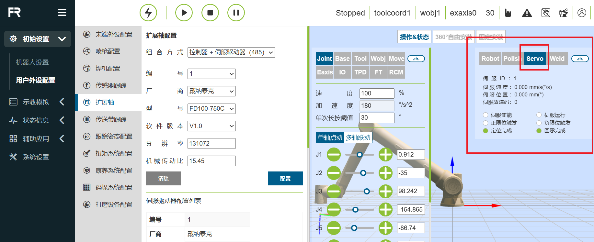

.. centered:: 图表 5.5‑11 伺服状态栏

现在您可以对扩展轴设备进行一定的运动测试，请在确保安全的前提下跟着本手册做如下测试操作。

伺服控制模式与使能
*******************************

如图5.5‑12，在“伺服驱动器调试”栏中，选择对应的伺服编号，点击右侧“配置”按钮；选择控制模式为“位置模式”，点击右侧“配置”按钮。

.. note:: 
  切换控制模式后，需要先将伺服去除使能，再将伺服使能，伺服的控制模式切换才会生效。

**位置模式**：您可以输入一定的运动速度和目标位置参数，伺服将以设置的速度运动到目标位置，运动到目标位置后，伺服将停止运动。

**速度模式**：您可以输入一定的目标速度，伺服将按照您设置的目标速度一直运动，直至您将目标速度设置为0或将伺服电机下使能。

- 点击“伺服使能”按钮。在WebApp右侧“伺服状态栏”中可观察到“伺服使能”状态灯亮起，表示伺服驱动器已经使能。

- 点击“伺服驱动器调试”栏中的“去除使能”按钮，“伺服状态栏”中“伺服使能”状态灯熄灭，伺服使能关闭。

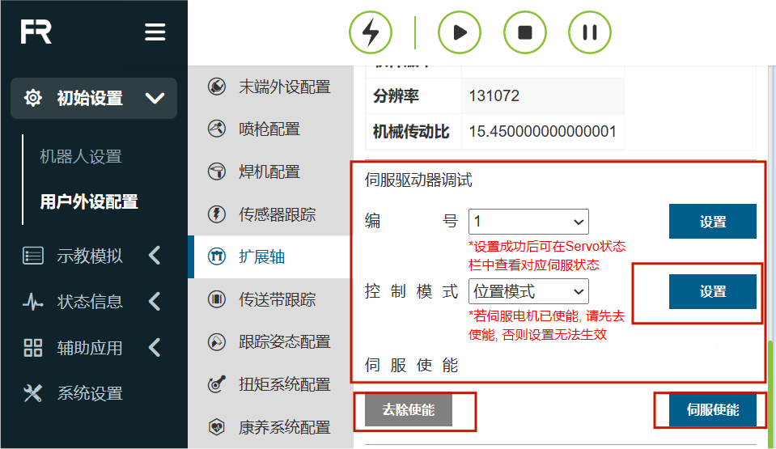

.. centered:: 图表 5.5‑12 伺服驱动器调试页面

伺服回零
*******************************

如图5.5‑13，选择回零模式为“当前位置回零”，回零速度为5mm/s，零点箍位速度为1mm/s。

点击“设置”按钮，即完成了伺服当前位置回零操作，在“伺服状态栏”中，可观察到当前的“伺服位置”为0。

.. important:: 
  请您完全阅读本手册后，再将回零模式选择为“负限位回零”或“正限位回零”进行回零测试。

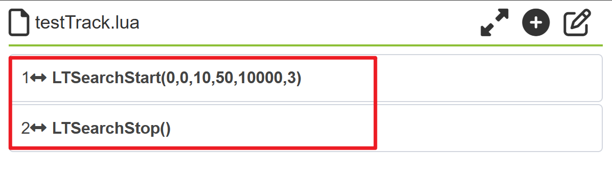

.. centered:: 图表 5.5‑13 伺服回零调试

伺服运动
*******************************

在实际控制伺服电机运动前，请先了解伺服电机的“位置模式”和“速度模式”，再次提醒您：

**位置模式**：您可以输入一定的运动速度和目标位置参数，伺服将以设置的速度运动到目标位置，运动到目标位置后，伺服将停止运动。

**速度模式**：您可以输入一定的目标速度，伺服将按照您设置的目标速度一直运动，直至您将目标速度设置为0或将伺服电机下使能。

如图5.5‑14所示，当切换扩展轴的控制模式时，“当前控制模式”显示会自动切换。

.. note:: 
  切换控制模式后，需要先将伺服去除使能，再将伺服使能，伺服的控制模式切换才会生效。

若目前您的伺服未处于“位置模式”，请将您的伺服切换至位置模式。输入“目标位置”为50mm，运行速度为5mm/s，在确认安全的条件下，点击“设置”按钮，此时伺服电机将按照您设置的参数运动，您可以在“伺服状态栏”中实时观察伺服的位置和速度等。

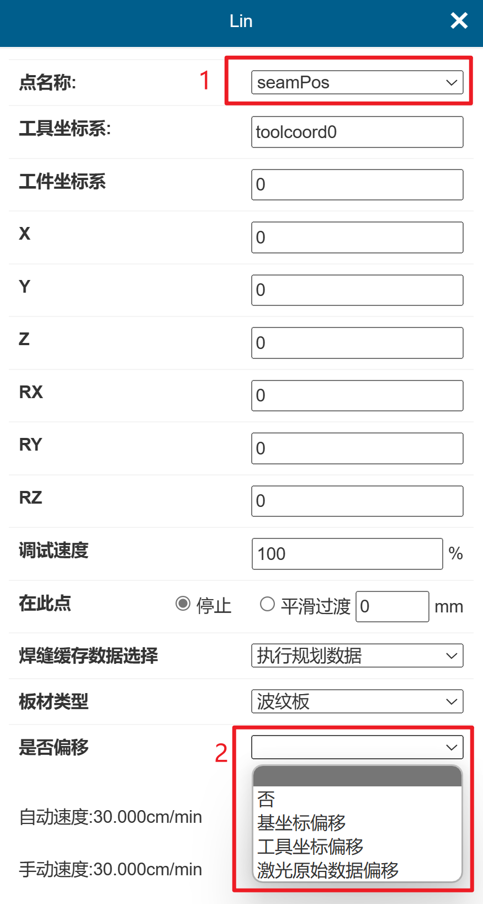

.. centered:: 图表 5.5‑14 伺服运动调试（位置模式）

将伺服的控制模式改为“速度模式”，点击“去除使能”，再点击“伺服使能”，此时伺服切换为速度模式。

.. note:: 
  当伺服电机运动后，只能通过将目标速度设置为0使伺服电机停止。

输入目标速度为5mm/s，点击“设置”按钮，伺服电机将以5mm/s的速度保持运动，同样您可以在“伺服状态栏”中实时观察伺服的位置和速度等。

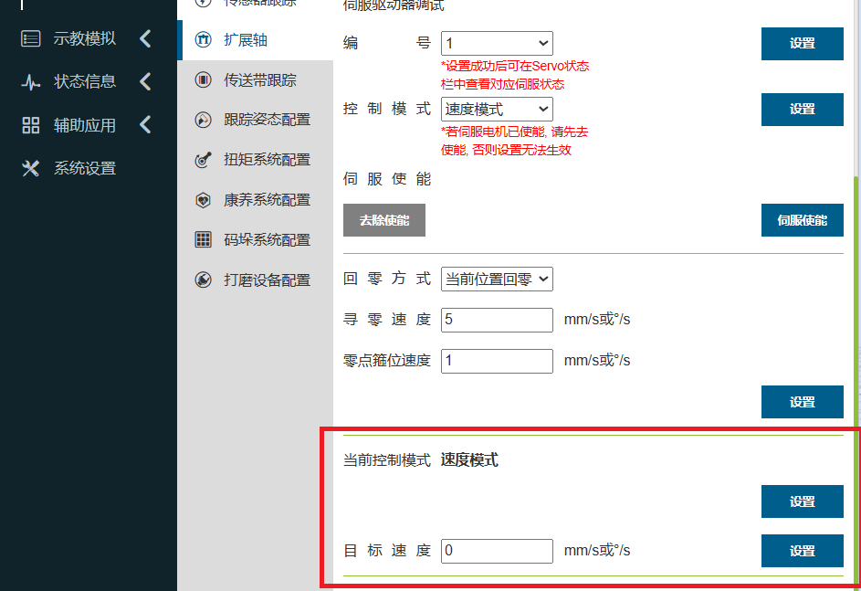

.. centered:: 图表 5.5‑15 伺服运动调试（速度模式）

扩展轴编程
++++++++++++

**Step1**：新建一个用户程序“testServo.lua”，如图5.5‑16，选择“外设指令”。

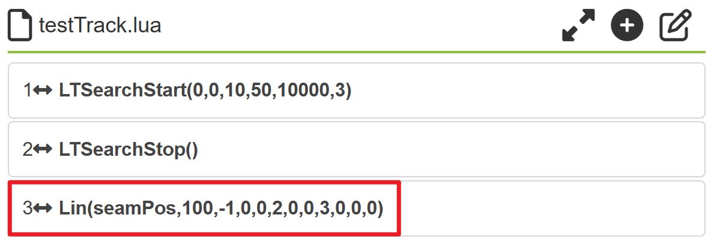

.. centered:: 图表 5.5‑16 打开外设指令

**Step2**：如图5.5‑17，点击“扩展轴”，打开添加扩展轴指令界面。

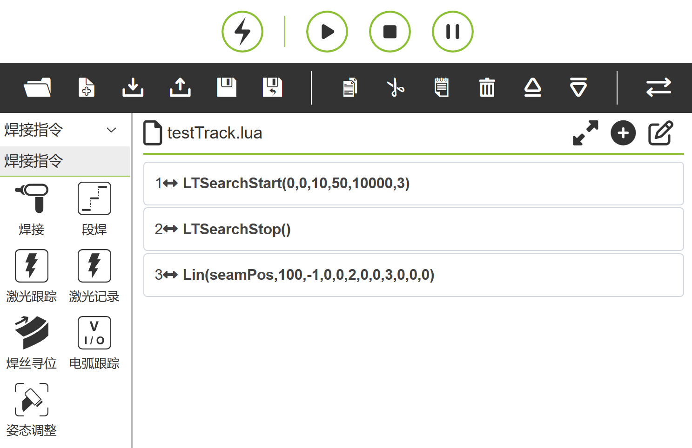

.. centered:: 图表 5.5‑17 打开添加扩展轴指令页面

**Step3**：如图5.5‑18，在添加扩展轴指令页面中选择组合方式为“控制器 + 伺服驱动器(485)”，将控制模式设为“位置模式”，点击右侧的“添加”按钮。

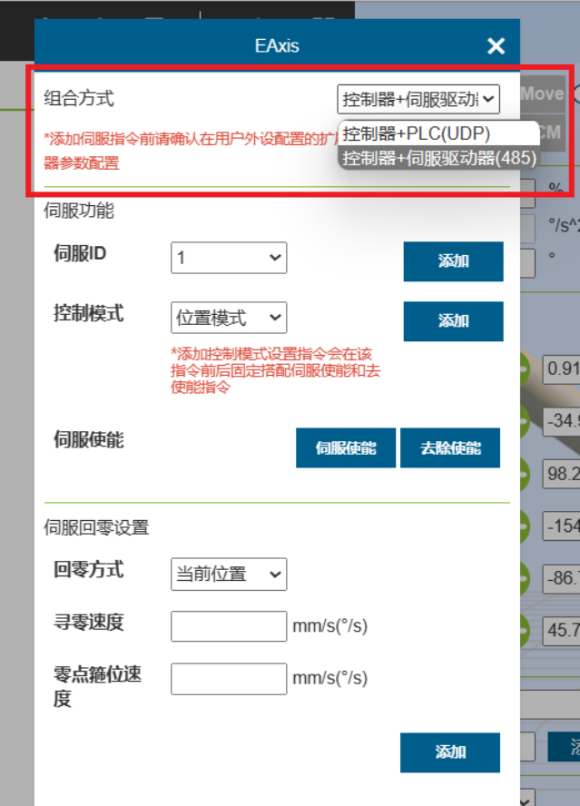

.. centered:: 图表 5.5‑18 设置扩展轴的控制模式

**Step4**：如图5.5‑19，将添加扩展轴指令界面翻到底部，点击“应用”按钮，并关闭添加扩展轴指令界面。

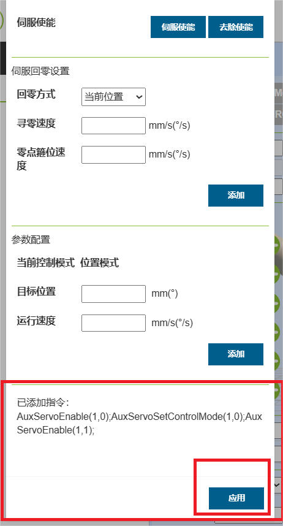

.. centered:: 图表 5.5‑19 应用扩展轴指令

**Step5**：如图5.5‑20，此时“testServo.lua”程序中即出现一组切换伺服控制模式的指令，您可以将机器人切换到自动模式，并执行该程序。

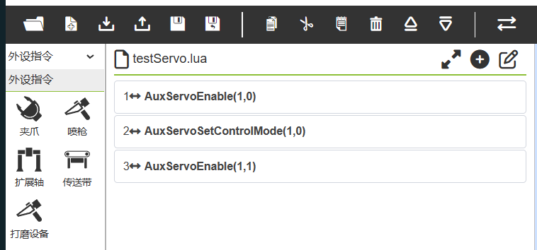

.. centered:: 图表 5.5‑20 设置伺服控制模式程序

**Step6**：如何通过用户程序控制伺服运动？同样打开添加扩展轴指令界面，如图5.5‑21，找到参数配置栏，以位置模式为例，输入目标位置和运行速度，点击“添加”按钮；将添加扩展轴指令界面翻到底部，点击“应用”按钮，并关闭添加扩展轴指令界面。

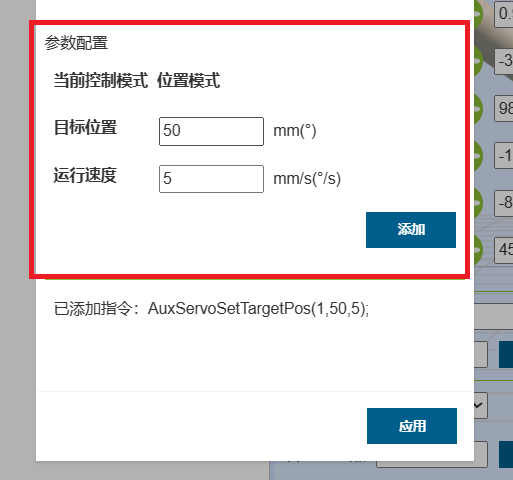

.. centered:: 图表 5.5‑21 增加位置模式运动指令

**Step7**：如图5.5‑22所示，“testServo.lua”程序中已增加伺服运动指令：

“AuxServoSetTargetPos(1,50,5)”，指令函数中的三个参数含义分别为：

- 1：伺服编号为1。

- 50：目标位置。

- 5：目标速度。

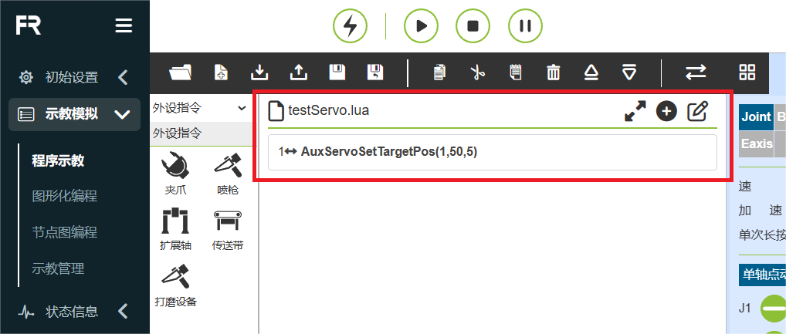

.. centered:: 图表 5.5‑22 位置模式伺服运动程序

**Step8**：将机器人切换到自动模式，运行该程序，此时您的伺服将以5mm/s的速度运动到50mm的位置。

至此，我们已经完成RS485控制伺服扩展轴的初步配置和测试，您可以根据实际情况编写机器人运动与伺服运动组合的程序。

扩展轴与机械人协同运动程序示例
*******************************

.. list-table::
   :widths: 50 80 80
   :header-rows: 0
   :align: center

   * - **序号**
     - **指令格式**
     - **注释**

   * - 1
     - AuxServoSetTargetPos(1,50,5)
     - #扩展轴运动到复位点

   * - 2
     - if(GetDI(8,0) == 1) then
     - #如果CI0输入有效

   * - 3
     - AuxServoSetTargetPos(1,50,5)
     - #扩展轴运动到50mm

   * - 4
     - PTP(testptp1,100,-1,0)
     - #机器人运动到testptp1点

   * - 5
     - elseif(GetDI(9,0) == 1) then
     - #如果CI1输入有效

   * - 6
     - AuxServoSetTargetPos(1,150,5)
     - #扩展轴运动到150mm

   * - 7
     - PTP(testptp2,100,-1,0)
     - #机器人运动到testptp2点

   * - 8
     - else
     - #若CI0和CI1输入均无效

   * - 9
     - AuxServoSetTargetPos(1,300,5)
     - #扩展轴运动到300mm

   * - 10
     - PTP(testptp3,100,-1,0)
     - #机器人运动到testptp3点

   * - 11
     - end
     - #结束

总结
+++++++++

综上所述，配置协作机器人与伺服扩展轴RS485通讯有以下注意要点：

1. 正确连接协作机器人与伺服驱动器的RS485通信线缆；

2. 正确选择伺服扩展轴的控制模式；

3. 切换控制模式后，必须先去除使能，再伺服使能，控制模式切换才能生效。

传送带跟踪配置
-----------------

传送带跟踪配置步骤
~~~~~~~~~~~~~~~~~~~~~

**Step1**：在用户外设配置界面中选择“传送带跟踪”按钮，进入传送带跟踪配置界面，点击“配置传送带IO”按键快速配置传送带功能所需IO，之后根据实际使用功能情况配置对应的参数，此处以无视觉跟踪抓取功能为例，需要配置传送带编码器通道，分辨率，导程，视觉搭配选择否，点击配置。

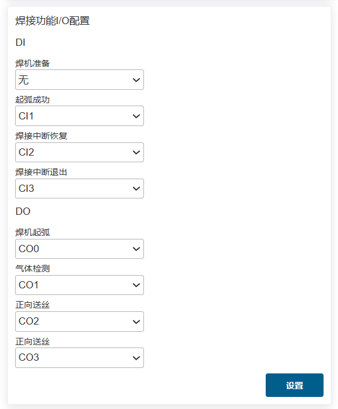

.. centered:: 图表 5.6‑1 传送带配置

**Step2**：接下来设置抓取点补偿值，为X,Y,Z三个方向上的补偿距离，可在调试过程中根据实际情况设置。

.. figure:: robot_peripherals/026.png
   :align: center
   :width: 3in

.. centered:: 图表 5.6‑2 传送带抓取点补偿配置

**Step3**：开启传送带，将标定的物体移动到定义的A点位置，停止传送带。移动机器人，将机器人末端的标定杆尖点与所标定的物体尖点对齐，点击起始点A按键，跳出对话框，显示当前编码器值和机器人位姿，点击标定完成起始点A标定。

.. centered:: 图表 5.6‑3 起始点A配置

**Step4**：点击参考点按键，进入参考点标定，记录参考点时记录机器人抓取时的高度和姿态，每次跟踪时都会以记录参考点的高度和姿态区跟踪抓取，可以和AB点不在一个高度，点击标定完成参考点标定。

.. figure:: robot_peripherals/028.png
   :align: center
   :width: 3in

.. centered:: 图表 5.6‑4 参考点配置

**Step5**：开启传送带，将标定的物体移动到定义的B点位置，停止传送带。移动机器人，将机器人末端的标定杆尖点与所标定的物体尖点对齐，点击终点B按键，弹出对话框，显示当前编码器值和机器人位姿，点击标定完成终点B标定。

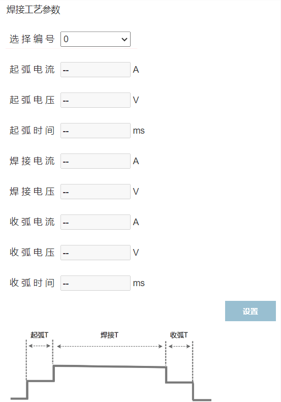

.. centered:: 图表 5.6‑5 终点B配置

传送带跟踪示教程序
~~~~~~~~~~~~~~~~~~~~~~~

.. list-table::
   :widths: 50 80 80
   :header-rows: 0
   :align: center

   * - **序号**
     - **指令格式**
     - **注释**

   * - 1
     - PTP(conveyorstart,30,-1,0)
     - #机器人抓取起点

   * - 2
     - While(1) do
     - #循环抓取

   * - 3
     - ConveyorlODetect(10000)
     - #Io实时检测物体

   * - 4
     - ConveyorGetTrackData(1)
     - #物体位置获取

   * - 5
     - ConveyorTrackStart(1)
     - #传送带跟踪开始

   * - 6
     - Lin(cvrCatchPoint,10,-1,0,0)
     - #机器人到达抓取点

   * - 7
     - MoveGripper(1,255,255,0,10000)
     - #夹爪抓取物体

   * - 8
     - Lin(cvrRaisePoint,10,-1,0,0)
     - #机器人提起

   * - 9
     - ConveyorTrackEnd()
     - #传送带跟踪结束

   * - 10
     - PTP(conveyorraise,30,-1,0)
     - #机器人到达等待点

   * - 11
     - PTP(conveyorend,30,-1,0)
     - #机器人到达放置点

   * - 12
     - MoveGripper(1,0,255,0,10000)
     - #夹爪松开

   * - 13
     - PTP(conveyorstart,50,-1,0)
     - #机器人再次回到抓取起点,等待下次抓取

   * - 14
     - end
     - #结束

姿态自适应配置
----------------

姿态自适应配置步骤
~~~~~~~~~~~~~~~~~~~~~~

**Step1**：在用户外设配置界面中选择“跟踪姿态配置”按钮，进入姿态调整配置界面，选择板材类型和机器人实际工作运动方向，调整机器人姿态，分别设置姿态点A，姿态点B和姿态点C，通常A为平面姿态点，B为上升沿姿态点，C为下降沿姿态点。

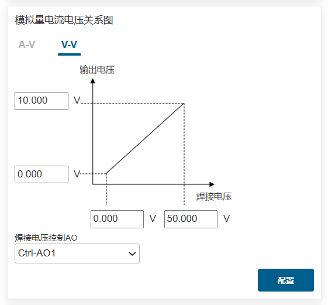

.. centered:: 图表 5.7‑1 姿态调整配置

.. important:: 
	A姿态和B姿态，A姿态和C姿态之间的姿态变化在满足应用需求下姿态变化越小越好。姿态自适应功能为辅助应用功能，通常配合焊缝跟踪使用。

**Step2**：在程序示教命令界面选择“Adjust”命令。根据具体的程序示教需求，在相应的地方添加指令。

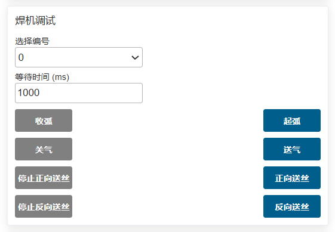

.. centered:: 图表 5.7‑2 姿态调整指令编辑

姿态自适应配合扩展轴和激光跟踪焊接示教程序
~~~~~~~~~~~~~~~~~~~~~~~~~~~~~~~~~~~~~~~~~~~~

.. list-table::
   :widths: 50 80 80
   :header-rows: 0
   :align: center

   * - **序号**
     - **指令格式**
     - **注释**

   * - 1
     - EXT_AXIS_PTP(1,1laserstart)
     - #外部轴运动激光传感器起始点

   * - 2
     - PTP(laserstart,10,-1,0)
     - #机器人运动激光传感器起始点

   * - 3
     - LTSearchStart(3,20,10,10000)
     - #开始寻位

   * - 4
     - LTSearchStop()
     - #停止寻位

   * - 5
     - EXT_AXIS_PTP(1,1,seamPos)
     - #外部轴运动焊缝起点

   * - 6
     - Lin(seamPos,20,-1,00,0)
     - #机器人运动焊缝起点

   * - 7
     - LTTrackOn()
     - #激光跟踪

   * - 8
     - ARCStart(0,10000)
     - #焊机起弧

   * - 9
     - PostureAdjustOn(0,PosA,PosC,PosB,1000)
     - #姿态自适应调整开启

   * - 10
     - EXT_AXIS_PTP(1,1,laserend)
     - #外部轴运动焊缝终点

   * - 11
     - Lin( laserend,10,-1,0,0)
     - #机器人运动焊缝终点

   * - 12
     - ARCEnd(0,10000)
     - #焊机收弧

   * - 13
     - PostureAdjustOff(0)
     - #姿态自适应调整关闭

   * - 14
     - LTTrackOff
     - #激光跟踪关闭

力/扭矩传感器外设配置
-------------------------

力/扭矩传感器配置步骤
~~~~~~~~~~~~~~~~~~~~~~~~~~~

**Step1**：在用户外设配置界面中选择“末端外设配置”按钮，设备类型选择“力传感器设备”，力传感器配置信息分为厂商、类型、软件版本和挂载位置，用户可根据具体的生产需求来配置相应的力传感器信息。若用户需要更改配置，可先选择相应的编号，点击“清除”按钮，来清除相应的信息，并重新根据需求配置；

.. figure:: robot_peripherals/034.png
   :align: center
   :width: 3in

.. centered:: 图表 5.8‑1 力/矩传感器配置

.. important:: 
	点击清除配置前，相应的传感器应处于未激活状态。

**Step2**：力传感器配置完成后，用户可在页面下方的信息表中查看相应的力传感器信息，若发现配置错误，可点击“清除”按钮，重新配置。

.. figure:: robot_peripherals/035.png
   :align: center
   :width: 3in

.. centered:: 图表 5.8‑2 力/矩传感器配置信息

**Step3**：选择配置完成的力传感器编号，点击“复位”按钮，页面弹出命令发送成功后，再点击“激活”按钮，可查看力传感器信息表中的激活状态，来判断是否激活成功；此外，力传感器会有初始值，用户根据使用需求选择“零点矫正”和“去除零点”。力传感器零点矫正需要确保力传感器水平垂直向下，且机器人未配置负载。

**Step4**：力传感器配置完成后，需要配置传感器类型工具坐标系，可根据传感器与末端工具中心的距离直接输入传感器工具坐标系值并应用。

力/扭矩传感器负载辨识
~~~~~~~~~~~~~~~~~~~~~~~~

在机器人配置界面中选择“力/扭矩传感器负载”进行配置。

特定姿态辨识：清除末端负载数据，配置好力传感器后，建立传感器坐标系，将机器人末端姿态调整为垂直向下，进行“零点矫正”后安装末端负载。首先选择对应传感器工具坐标系，调整机器人，使得传感器及工具垂直向下，记录数据，计算质量。接着，调整机器人3个不同姿态，分别记录三组数据，计算出质心，确认无误后点击应用。

**动态辨识**：清除末端负载数据，配置好力传感器后，建立传感器坐标系，将机器人末端姿态调整为垂直向下，进行“零点矫正”后安装末端负载。点击“辨识开启”，拖动机器人进行运动，接着点击“辨识关闭”，即可自动将负载结果应用到机器人中。

**自动校零**：传感器记录初始位置后，可自动校零。

.. figure:: robot_peripherals/036.png
   :align: center
   :width: 3in

.. centered:: 图表 5.8‑3 力/扭矩传感器负载辨识

力/扭矩传感器辅助拖动
~~~~~~~~~~~~~~~~~~~~~~~

配置好传感器后，可以搭配传感器对拖动机器人进行更好的辅助。第一次使用时可以按照右侧图片的数据进行配置，应用完成后，此时无需进入拖动模式，直接对末端力传感器进行拖拽，即可控制机器人在固定姿态进行移动。（如下图中的数据为参考标准）

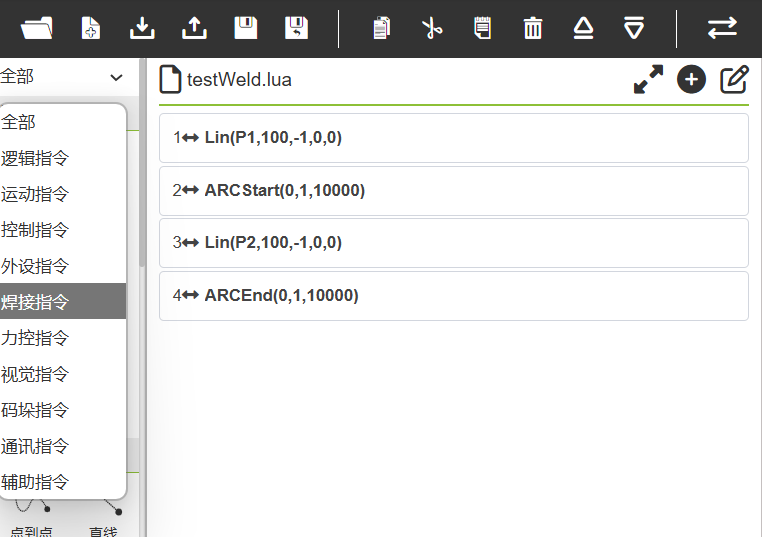

.. centered:: 图表 5.8‑4 力/扭矩传感器拖动锁定

**自适应选择**：在需要装配时开启，开启后拖动变重；

**惯性参数**：调节拖动过程中的手感，最小值为0，需在技术人员指导下谨慎操作。

**阻尼参数**：

-  平动方向：建议设置参数在[100-200]之间；

-  转动方向：建议设置参数在[3-10]之间，其中RZ方向设置范围在[0.1-5]；

-  效果：借助传感器拖动时，增大阻尼会导致拖动困难，减小阻尼会导致拖动机器人过于轻松（建议不要太小）；

-  阻尼参数整体范围：平动XYZ：[100-1000]；转动RX、RY：[3-50],RZ:[2-10]；

-  最大拖动力为50，最大拖动速度为180。

**刚度参数**：均设为0；

**拖动力阈值**：平动XYZ为[5-10]；转动RX、RY、RZ为[0.5-5]；

.. important:: 
   通过加大平动方向XYZ或转动方向RX、RY、RZ的力阈值来实现锁定的方式。

力/扭矩传感器碰撞检测
~~~~~~~~~~~~~~~~~~~~~~~~~

指令说明：“FT_Guard”指令为碰撞检测指令。选择对应的传感器坐标系，勾选生效的力矩方向检测，设置当前值，碰撞最大阈值和碰撞最小阈值三项，碰撞检测条件正常范围为（当前值-最小阈值，当前值+最大阈值），将“开启”和“关闭”指令加入到程序中在。

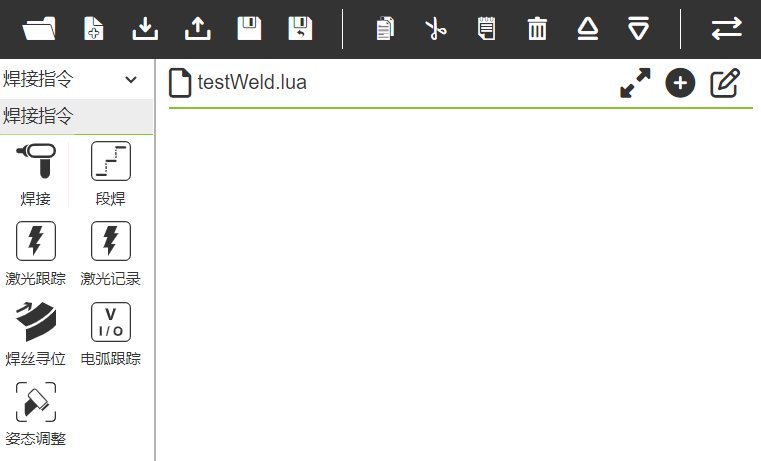

.. centered:: 图表 5.8‑5 FT_Guard指令编辑

程序示例：

.. list-table::
   :widths: 50 80 80
   :header-rows: 0
   :align: center

   * - **序号**
     - **指令格式**
     - **注释**

   * - 1
     - FT_Guard(1,1,1,1,1,0,0,0,5,0,0,0,0,0,10,0,0,0,0,0,5,0,0,0,0,0)
     - #力/矩碰撞检测开启

   * - 2
     - PTP(template1,100,-1,0)
     - #运动指令

   * - 3
     - FT_Guard(0,1,1,1,1,0,0,0,5,0,0,0,0,0,10,0,0,0,0,0,5,0,0,0,0,0)
     - #力/矩碰撞检测关闭

力/扭矩传感器力控运动
~~~~~~~~~~~~~~~~~~~~~~~~

指令说明：“FT_Control”指令为力控运动指令，可以使机器人在设定力的附近运动，常用于打磨场景中。选择对应的传感器坐标系，勾选生效的力矩方向检测，设置检测阈值，以及各个方向上PID比例系数(一般设置p为0.001)，设置最大调整距离（对应X,Y,Z）和最大调整角度（对应RX,RY,RZ），将“开启”和“关闭”指令加入到程序中在。

.. figure:: robot_peripherals/040.png
   :align: center
   :width: 3in

.. centered:: 图表 5.8‑6 FT_Control指令编辑

程序示例：

.. list-table::
   :widths: 50 80 80
   :header-rows: 0
   :align: center

   * - **序号**
     - **指令格式**
     - **注释**

   * - 1
     - FT_Control(1,11,1,0,1,0,0,0,10,0,5,0,0,0,0.001,0,0,0,0,0,0,0,0,10,5)
     - #力/矩运动控制开启

   * - 2
     - Lin(template3,100,-1,0,0)
     - #运动指令

   * - 3
     - FT_Control(0,11,1,0,1,0,0,0,10,0,5,0,0,0,0.001,0,0,0,0,0,0,0,10,5)
     - #力/矩运动控制关闭

力/扭矩传感器螺旋插入
~~~~~~~~~~~~~~~~~~~~~~~~~~

指令说明：“FT_Spiral”指令为螺旋线探索插入，一般用于圆柱轴的轴孔装配动作。在运行动作之前，需要将机器人末端拖动至孔位的大致位置，根据当前场景，设定指令的参数，添加到程序中，运行后，机器人会以螺旋形的运动进行探索。

.. figure:: robot_peripherals/042.png
   :align: center
   :width: 3in

.. centered:: 图表 5.8‑7 FT_Spiral指令编辑

程序示例：

.. list-table::
   :widths: 50 80 80
   :header-rows: 0
   :align: center

   * - **序号**
     - **指令格式**
     - **注释**

   * - 1
     - FT_Control(1,10,0,0,1,0,0,0,0,0,5,0,0,0,0.0005,0,0,0,0,0,0,10,0)
     - #力/矩运动控制开启

   * - 2
     - FT_SpiralSearch(0,0.7,0,60000,5)
     - #螺旋插入

   * - 3
     - FT_Control(0,10,0,0,1,0,0,0,0,0,5,0,0,0,0.0005,0,0,0,0,0,0,10,0)
     - #力/矩运动控制关闭

力/扭矩传感器旋转插入
~~~~~~~~~~~~~~~~~~~~~~~~~

指令说明：“FT_Rot”指令为旋转探索插入，一般用于承接螺旋线插入动作，用于键轴的轴孔装配。在运行动作之前，需要将机器人末端移动至螺旋线探索找到的孔位或者完全对齐的示教孔位，根据当前场景，设定指令的参数，添加到程序中，运行后，机器人会以缓慢的旋转进行探索。

.. figure:: robot_peripherals/044.png
   :align: center
   :width: 3in

.. centered:: 图表 5.8‑8 FT_Rot指令编辑

程序示例：

.. list-table::
   :widths: 50 80 80
   :header-rows: 0
   :align: center

   * - **序号**
     - **指令格式**
     - **注释**

   * - 1
     - FT_Control(1,10,0,0,1,0,0,0,0,0,5,0,0,0,0.0005,0,0,0,0,0,0,10,0)
     - #力/矩运动控制开启

   * - 2
     - FT_RotInsertion(0,3,0,5,1,0,1)
     - #旋转插入

   * - 3
     - FT_Control(0,10,0,0,1,0,0,0,0,0,5,0,0,0,0.0005,0,0,0,0,0,0,10,0)
     - #力/矩运动控制关闭

力/扭矩传感器直线插入
~~~~~~~~~~~~~~~~~~~~~~~~~

指令说明：“FT_Lin”指令为旋转探索插入，一般用于承接螺旋线插入动作或旋转插入动作，用于键轴的轴孔装配。在运行动作之前，需要将机器人末端移动至螺旋线探索找到的孔位，旋转插入动作结束的位置或者完全对齐的示教孔位，根据当前场景，设定指令的参数，添加到程序中，运行后，机器人会以设定的方向进行直线运动。

.. figure:: robot_peripherals/046.png
   :align: center
   :width: 3in

.. centered:: 图表 5.8‑9 FT_Lin指令编辑

程序示例：

.. list-table::
   :widths: 50 80 80
   :header-rows: 0
   :align: center

   * - **序号**
     - **指令格式**
     - **注释**

   * - 1
     - FT_Control(1,10,0,0,1,0,0,0,0,0,5,0,0,0,0.0005,0,0,0,0,0,0,10,0)
     - #力/矩运动控制开启

   * - 2
     - FT LinInsertion(0,50,1,0,100,1)
     - #直线插入

   * - 3
     - FT_Control(0,10,0,0,1,0,0,0,0,0,5,0,0,0,0.0005,0,0,0,0,0,0,10,0)
     - #力/矩运动控制关闭

力/扭矩传感器表面定位
~~~~~~~~~~~~~~~~~~~~~~~~~~~

指令说明：“FT_FindSurface”指令为表面定位，一般用于寻找物体表面。根据当前场景，设置对应坐标系，移动方向、移动轴、探索直线速度、探索直线加速度、最大探索距离、动作终止力阈值等参数，添加到程序中，运行程序，动作开始执行，机器人末端开始缓慢向表面所在方向移动。

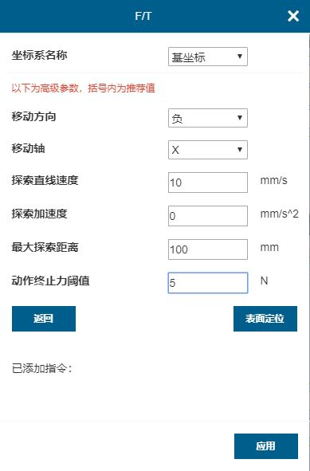

.. centered:: 图表 5.8‑10 FT_FindSurface指令编辑

程序示例：

.. list-table::
   :widths: 50 80 80
   :header-rows: 0
   :align: center

   * - **序号**
     - **指令格式**
     - **注释**

   * - 1
     - PTP(1,30,-1,0)
     - #初始位置

   * - 2
     - FT FindSurface(0,1,3,1,0,100,5)
     - #平面定位

力/扭矩传感器中心定位
~~~~~~~~~~~~~~~~~~~~~~~

指令说明：“FT_CalCenter”指令为中心定位，一般用于寻找两表面的中间平面表面。根据当前场景，设置对应坐标系，移动方向、移动轴、探索直线速度、探索直线加速度、最大探索距离、动作终止力阈值等参数，分别寻找A平面和B平面，添加到程序中，运行程序，动作开始执行，机器人缓慢向表面A所在方向移动，定位到A面后，机器人缓慢向表面B所在方向移动，定位到B面后，即可算出中心平面位置。

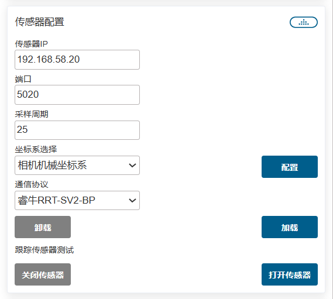

.. centered:: 图表 5.8‑11 FT_CalCenter指令编辑

程序示例：

.. list-table::
   :widths: 20 40 50
   :header-rows: 0
   :align: center

   * - **序号**
     - **指令格式**
     - **注释**

   * - 1
     - PTP(1,30,-1,0)
     - #初始位置

   * - 2
     - FT_CalCenterStart()
     - #表面定位开始

   * - 3
     - FT_Control(1,10,0,0,1,0,0,0,0,0,-10,0,0,0,0.00001,0,0,0,0,0,0,100,0)
     - #力/矩运动控制开启

   * - 4
     - FT_FindSurface(1,2,2,10,0,200,5)
     - #定位平面A

   * - 5
     - FT_Control(0,10,0,0,1,0,0,0,0,0,-10,0,0,0,0.00001,0,0,0,0,0,0,100,0)
     - #力/矩运动控制关闭

   * - 6
     - PTP(1,30,-1,0)
     - #初始位置

   * - 7
     - FT_Control(1,10,0,0,1,0,0,0,0,0,-10,0,0,0,0.00001,0,0,0,0,0,0,100,0)
     - #力/矩运动控制开启
     
   * - 8
     - FT FindSurface(1,1,2,20,0,200,5)
     - #定位平面B

   * - 9
     - FT_Control(0,10,0,0,1,0,0,0,0,0,10,0,0,0,0.00001,0,0,0,0,0,0,100,0)
     - #力/矩运动控制关闭

   * - 10
     - pos={}
     - #定义数组pos

   * - 11
     - pos = FT_CalCenterEnd()
     - #获取定位中心笛卡尔位姿

   * - 12
     - MoveCart(pos,GetActualTCPNum(),GetActualWObjNum(),30,10,100,-1,0)
     - #运动至定位的中心位置

力/扭矩传感器点按力探测
~~~~~~~~~~~~~~~~~~~~~~~~~~~

指令说明：“FT_Click”指令为点按力探测，点按力探测用于探测一个点按力，通常和表面定位动作配合使用。设置好参数后，添加到程序中，运行程序，末端开始沿工具坐标系Z方向向目标移动，当Z正方向上的力达到点按力数值，则点按力探测完成。

.. figure:: robot_peripherals/052.png
   :align: center
   :width: 3in

.. centered:: 图表 5.8‑12 FT_Click指令编辑

程序示例：

.. list-table::
   :widths: 20 40 50
   :header-rows: 0
   :align: center

   * - **序号**
     - **指令格式**
     - **注释**

   * - 1
     - PTP(1,30,-1,0)
     - #初始位置

   * - 2
     - FT_Click(0,5,5,0,100,0)
     - #点按力探测

扩展IO设备外设配置
------------------------

扩展IO设备配置步骤
~~~~~~~~~~~~~~~~~~~~~~~~~~~

**Step1**：在用户外设配置界面中选择“末端外设配置”按钮，设备类型选择“扩展IO设备”，扩展IO设备配置信息分为厂商、类型、软件版本和挂载位置，用户可根据具体的生产需求来配置相应的设备信息。若用户需要更改配置，可先选择相应的编号，点击“清除”按钮，来清除相应的信息，并重新根据需求配置；

.. figure:: robot_peripherals/054.png
   :align: center
   :width: 3in

.. centered:: 图表 5.9‑1 扩展IO设备配置

.. important:: 
	点击清除配置前，相应的设备应处于未激活状态。

**Step2**：扩展IO设备配置完成后，用户可在辅助应用中点击“Smart Tool”功能菜单，进入此功能配置页面，用户可以对末端手柄上的各个按键功能进行自定义，包括（新建程序，保持程序，PTP，Lin，ARC，摆焊开始，摆焊结束，IO端口）。

.. figure:: robot_peripherals/055.png
   :align: center
   :width: 3in

.. centered:: 图表 5.9‑2 扩展IO设备功能配置

码垛系统配置
---------------

码垛系统配置步骤
~~~~~~~~~~~~~~~~~~~~~~

**Step1**：在用户外设配置界面中选择“码垛系统配置”按钮，第一次使用，需要首先进行配方创建，点击“配方创建”，输入配方名称，点击“创建”，创建成功后点击“开始配置”进入码垛配置页面。

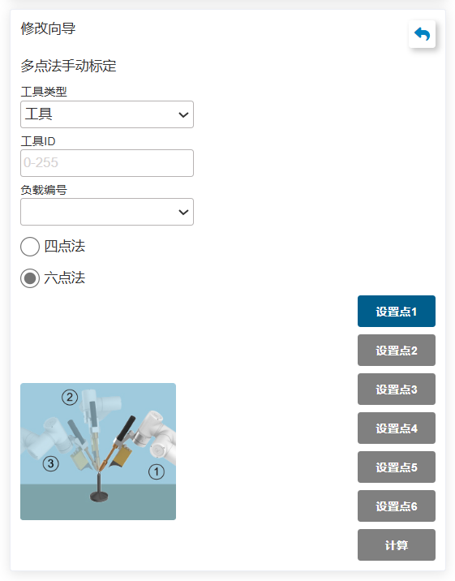

.. centered:: 图表 5.10‑1 码垛配方配置

**Step2**：在工件配置栏中点击“配置”进入工件配置弹窗，设置工件的“长度”，“宽度”，“高度”以及工件的抓取点，点击“确认配置”完成工件信息设置。

.. figure:: robot_peripherals/057.png
   :align: center
   :width: 3in

.. centered:: 图表 5.10‑2 码垛工件配置

**Step3**：在托盘配置栏中点击“配置”进入托盘配置弹窗，设置托盘“前边”，“侧边”和“高度”，接着设置工位和工位过渡点，点击“确认配置”完成托盘信息设置。

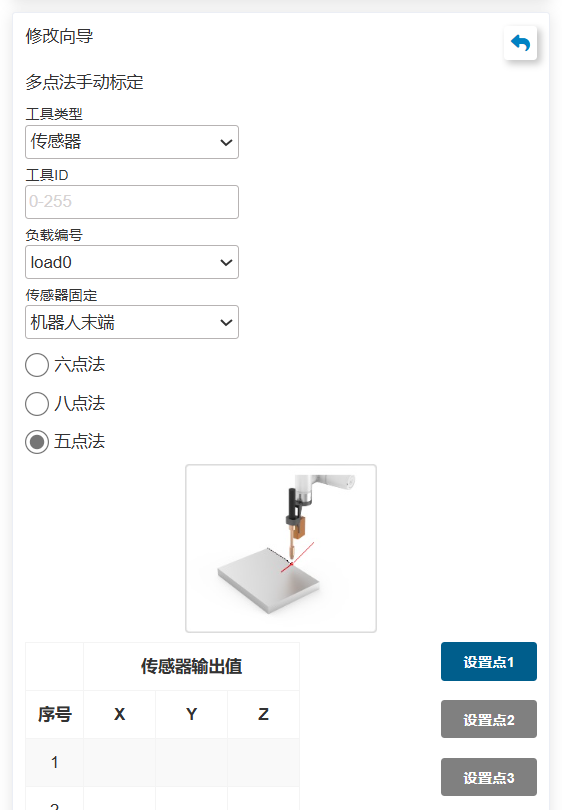

.. centered:: 图表 5.10‑3 码垛托盘配置

**Step4**：在码垛设备尺寸配置栏中点击“配置”进入码垛设备尺寸配置配置弹窗，设置设备“X”、“Y”、“Z”和“Angle”，点击“确认配置”完成码垛设备尺寸配置信息设置。

.. important:: 
   X、Y、Z为做托盘右上角或者右托盘左上角点相对于机器人基坐标系坐标值的绝对值，Angle为机器人安装时的旋转角度，推荐安装时为0。

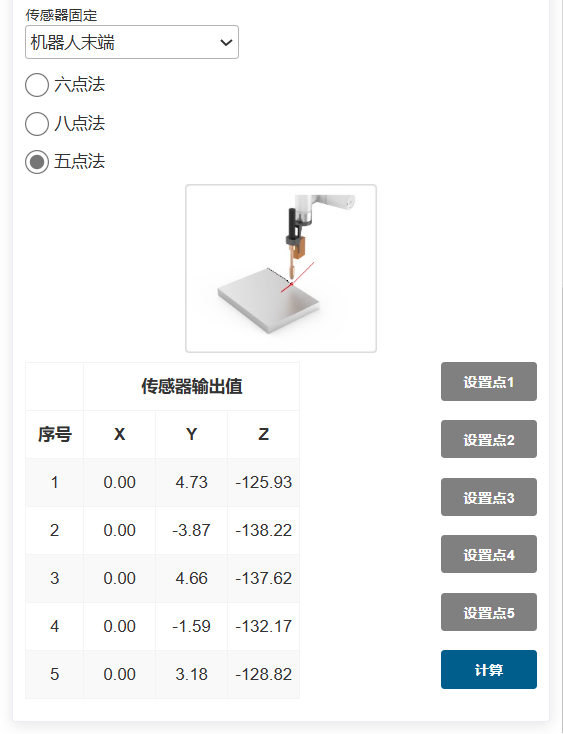

.. centered:: 图表 5.10‑4 码垛设备尺寸配置

**Step5**：在模式配置栏中点击“配置”进入模式配置弹窗。

   **模式B开启/关闭**：开启：可以切换模式A/B，配置码垛每层模式的B模式；关闭：不可切换模式B，不可配置码垛每层模式的B模式；

   **模式A/B切换**：选择模式A：添加工件为模式A，工件序号为A1，A2...，不可调整工件透明度；选择模式B：添加工件为模式B，工件序号为B1，B2...，此时可以开启/关闭“显示模式A配置”显示模式A工件；

   **显示模式A开启/关闭**：开启：调整模式B工件透明度来查看A/B模式配置效果是否合理，此时只能对模式B工件进行选中、添加、批量添加、删除和删除全部的操作；关闭：无法设置模式B工件透明度；

.. important:: 
   配置工件时，工件之间有碰撞时工件背景颜色变红，此时以上操作无法进行。如需操作，请配置工件为无碰撞。

配置工件时，先设置工件间隔，右侧框框为模拟工件在右托盘的放置方式，可以单个添加也可以批量添加。接着设置码垛层数和各层的模式，点击“确认配置”完成模式信息设置。

.. important:: 
   码垛方向：以右托盘为例，右下角为最远处，从右下角竖向或者横向摆放一排工件，再向上一排横向或竖向摆放工件，以此类推（Web页面已标注码垛方向，请注意查看）。
   
   左托盘依据右托盘模式镜像放置工件。

.. figure:: robot_peripherals/059.png
   :align: center
   :width: 6in

.. centered:: 图表 5.10‑5 码垛模式A配置

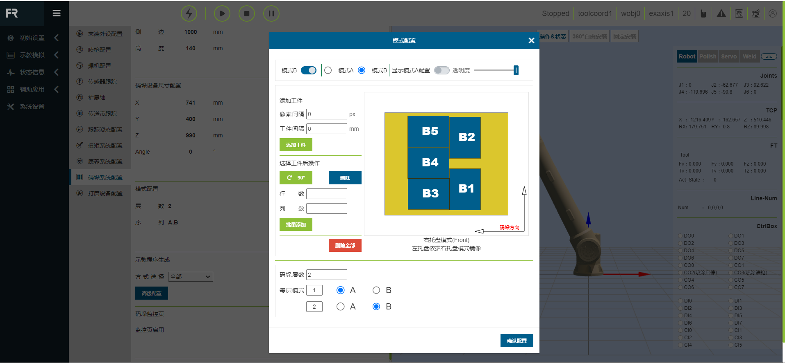

.. centered:: 图表 5.10‑6 码垛模式B配置

**Step6**：在示教程序生成栏点击“高级配置”进入高级配置弹窗，此时配置“取料抬升高度”、“第一次偏移距离”、“第二次偏移距离”和“吸料等待时间”。

   **取料抬升高度**：用户自定义取料成功后，从抓取点取料成功后抬升的高度；

   **第一/二次偏移距离**：用户自定义配置机器人倾斜堆放至目标点的偏移距离；
   
   **吸料等待时间**：用户自定义配置吸料等待时间，监控吸料后负压到位信号，未到位时重复吸取动作；

   **平滑过渡**：开启平滑过渡按钮，可进行码垛/拆垛PTP平滑时间和LIN平滑半径相关参数配置。
   
   - PTP平滑时间：无平滑过渡时间/等级1(200ms)/等级2(400ms)/等级3(600ms)/等级4(800ms)/等级5(1000ms)
   - LIN平滑半径：无平滑过渡半径/等级1(200mm)/等级2(400mm)/等级3(600mm)/等级4(800mm)/等级5(1000mm)

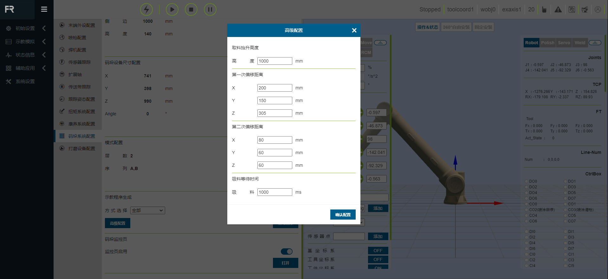

.. centered:: 图表 5.10‑7 码垛高级配置

**Step7**：在示教程序生成栏选择“方式选择”，点击“生成程序”，打开“码垛监控页”，在此页面可以对“生成信息”，“报警信息”和“码垛程序”显示和查看。

.. figure:: robot_peripherals/060.png
   :align: center
   :width: 6in

.. centered:: 图表 5.10‑8 码垛系统监控

**Step8**：码垛运行程序中途报错后，程序停止，用户首先清除报错后，再次选择码垛程序运行，此时会弹出“上次程序中断”弹出框，点击“接续”按钮接续运行，点击“重新开始”按钮重新开始运行程序。

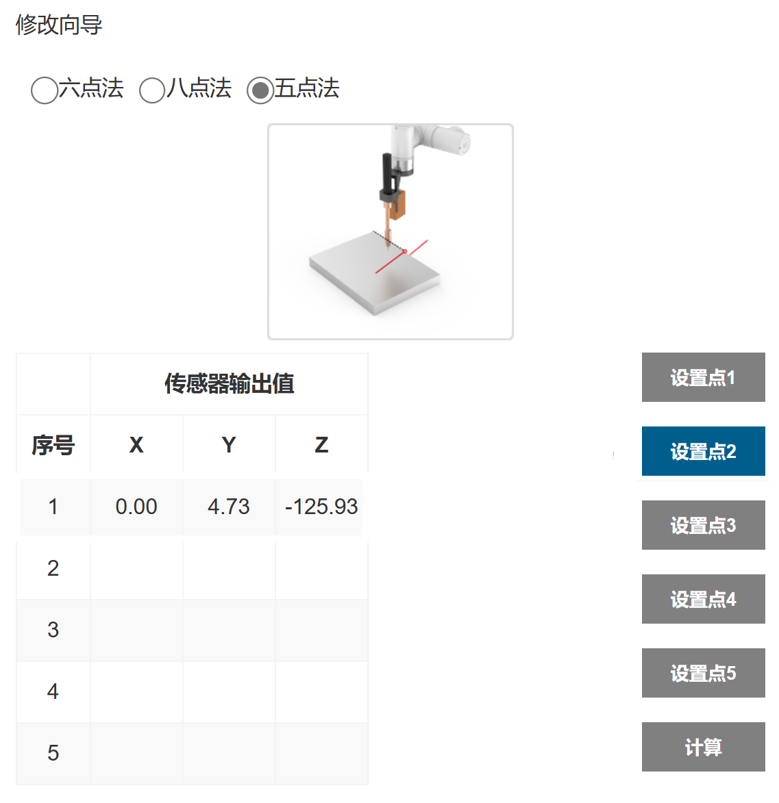

.. centered:: 图表 5.10‑9 码垛程序接续

打磨设备配置
---------------

打磨设备配置步骤
~~~~~~~~~~~~~~~~~~~~~~

**Step1**: 进入打磨设备配置页面，配置通讯信息，需要配置IP地址、端口、采样周期和通信协议。配置成功后，下次操作可自动显示。

**Step2**：完成通信配置后，可建立通信，通过加载/卸载打磨设备。

**Step3**：设备功能。可进行设备使能、错误清除和力传感器清零等操作。

**Step4**：参数配置。可设置打磨设备的转速、接触力、伸出距离和控制模式。设置成功后，可在右侧"Polish"状态反馈栏显示相应数据和状态。

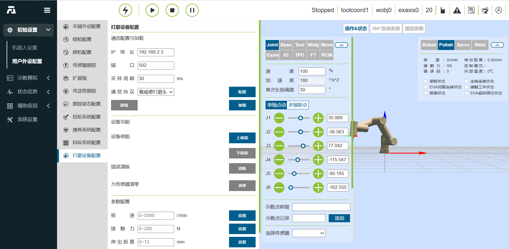

.. centered:: 图表 5.11-1 打磨状态配置页面

基于力传感器的虚拟墙配置
-------------------------------------------------

基于力传感器的虚拟墙功能，可以通过人为设置虚拟墙，用于限制机器人的工作空间，避免直接发生碰撞接触。

力传感器的安装配置
~~~~~~~~~~~~~~~~~~~~~~
**Step1**：以“坤维”传感器为例，安装时需要力传感器的坐标系方向与末端法兰坐标系保持一致，如图1所示（图1中，红色为末端法兰坐标系X+方向，绿色为末端法兰坐标系Y+方向，蓝色为末端法兰坐标系Z+方向）；

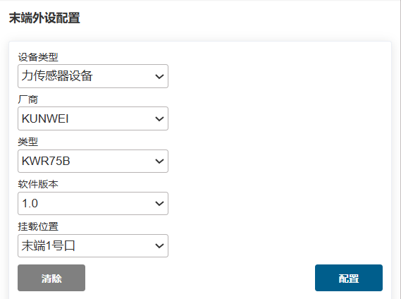

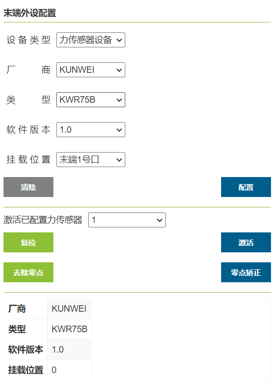

.. centered:: 图表 5.12-1 力传感器安装

**Step2**：在“初始设置”中的“用户外设配置”的菜单栏下，点击“末端外设配置”进入末端外设配置界面；

设备类型选择“力传感器设备”，力传感器配置信息分为厂商、类型、软件版本和挂载位置，用户可根据具体的生产需求来配置相应的力传感器信息。若用户需要更改配置，可先选择相应的编号，点击“清除”按钮，来清除相应的信息，并重新根据需求配置；具体操作如图2所示。

**Step3**：选择配置完成的力传感器编号，点击“复位”按钮，页面弹出命令发送成功后，再点击“激活”按钮，可查看力传感器信息表中的激活状态，来判断是否激活成功；此外，力传感器会有初始值，用户根据使用需求选择“零点矫正”和“去除零点”。力传感器零点矫正需要确保力传感器水平垂直向下，且机器人未配置负载。

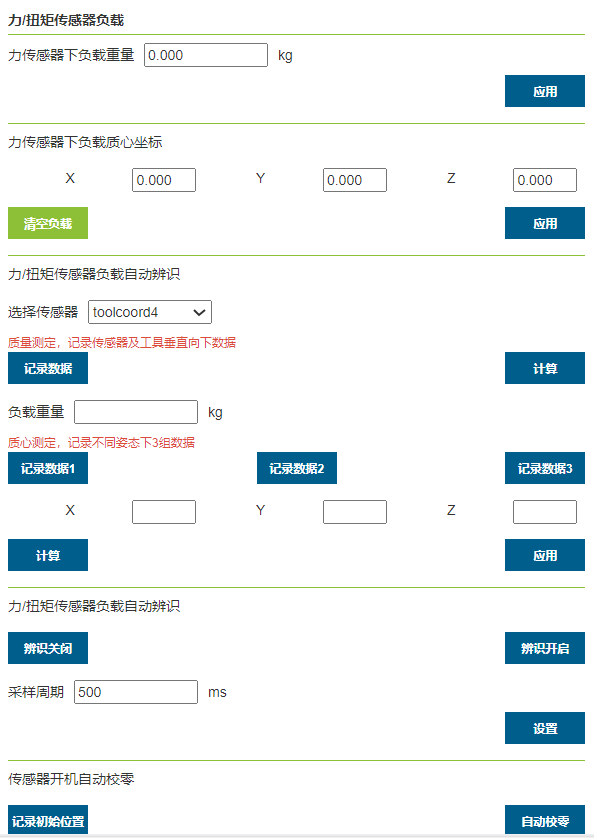

.. centered:: 图表 5.12-2 力传感器配置

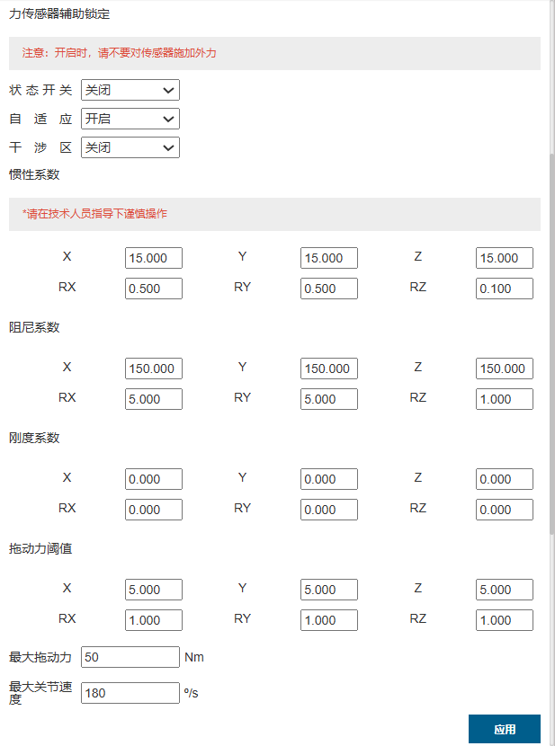

.. centered:: 图表 5.12-3 力传感器激活

虚拟墙配置
~~~~~~~~~~~~~~~~~~~~~~
借助力传感器进行辅助拖动，需要在力传感器下安装拖动把手，并配置工具坐标系，具体操作如图4所示。此时，检测干涉区的方式以设置的工具坐标系位置为参考，不设置时以末端法兰为参考。

**Step1**：在“辅助应用”中的“机器人本体”的菜单栏下，点击“干涉区配置”进入干涉区配置功能界面；

**Step2**：需要对干涉方式和进入干涉区操作进行配置；干涉方式选择“立方体干涉”，进入干涉区拖动配置为“不限制拖动”，进入干涉区运动配置均可；

**Step3**：根据需求，可以对参数配置进行修改。检测方法分为“指令位置”和“反馈位置”两种，干涉区模式分为“范围内干涉”和“范围外干涉”两种，参考坐标系选择为“基坐标”，根据实际使用选择设置。详细操作见图5所示；

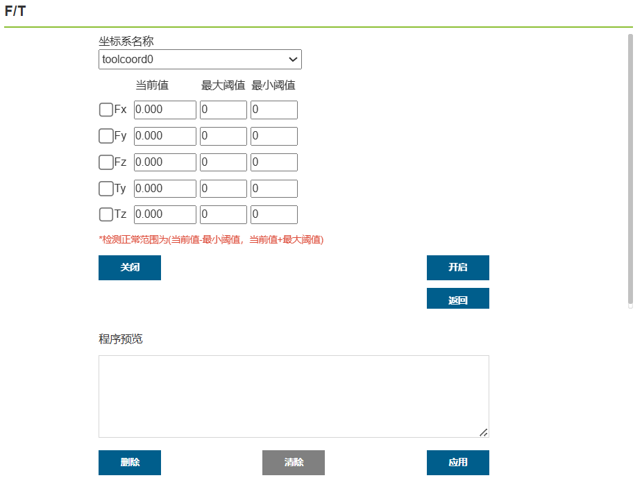

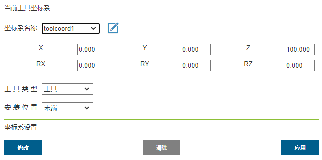

.. centered:: 图表 5.12-4 安装拖动把手并设置工具坐标系

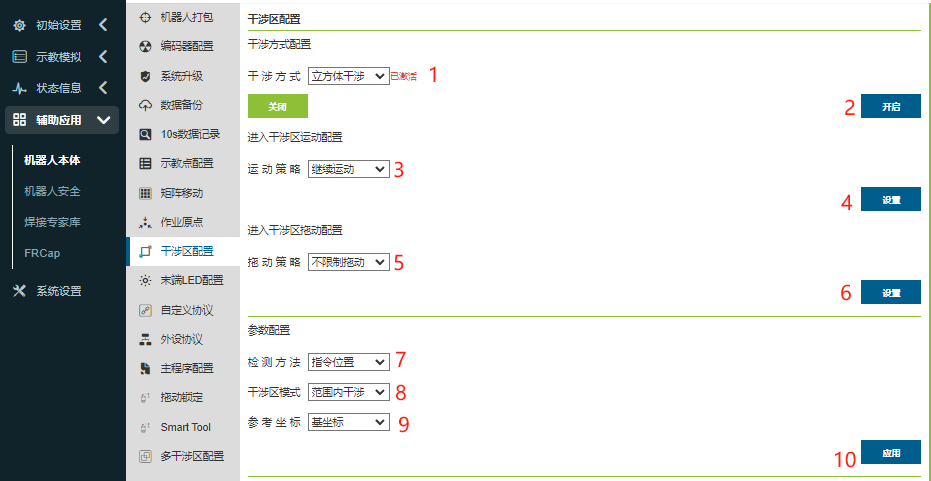

.. centered:: 图表 5.12-4 虚拟墙参数配置

**Step4**：参数配置下的干涉区模式分为“范围内干涉”和“范围外干涉”两种；

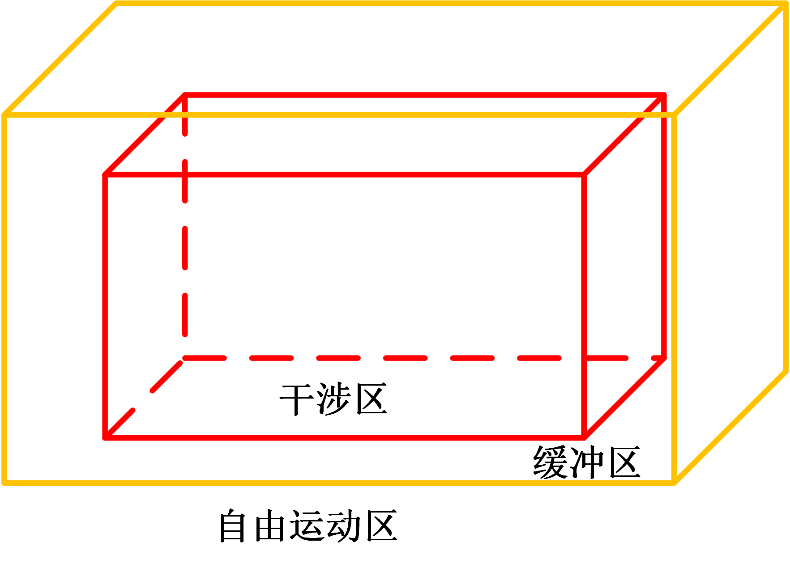

.. centered:: 图表 5.12-5 范围内干涉

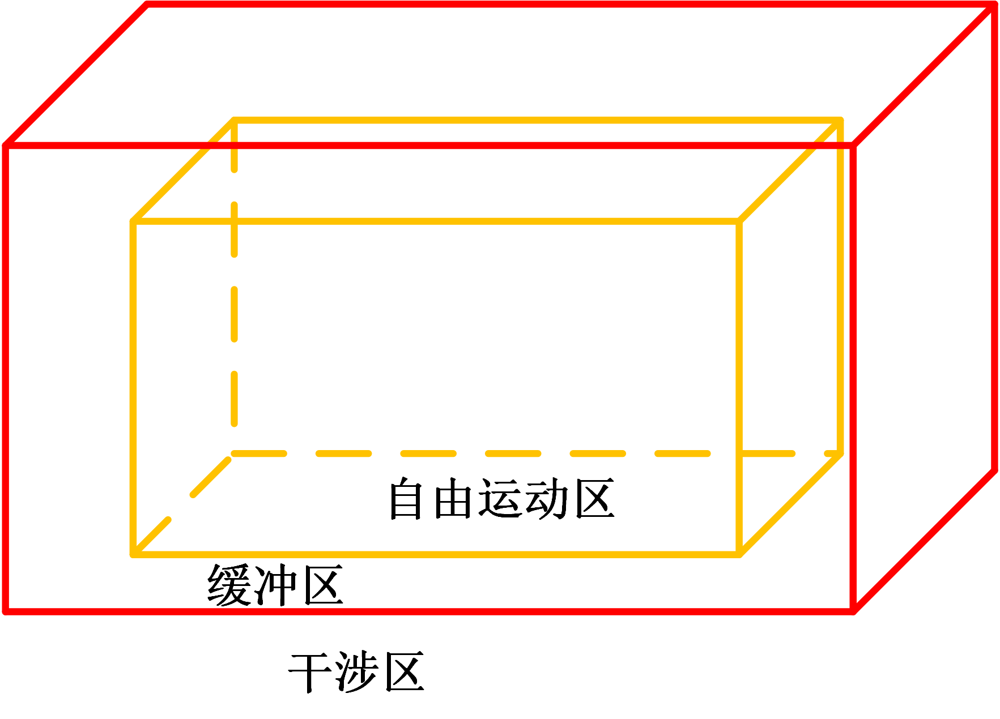

.. centered:: 图表 5.12-6 范围外干涉

**Step5**：建立干涉区，具体操作如图7和图8所示；建议在选择“范围外干涉”时，将干涉区域设置尽可能大。

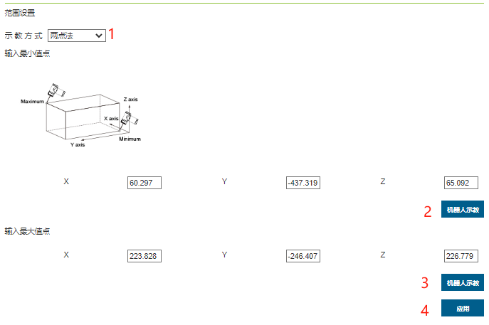

.. centered:: 图表 5.12-7 两点法建立干涉区

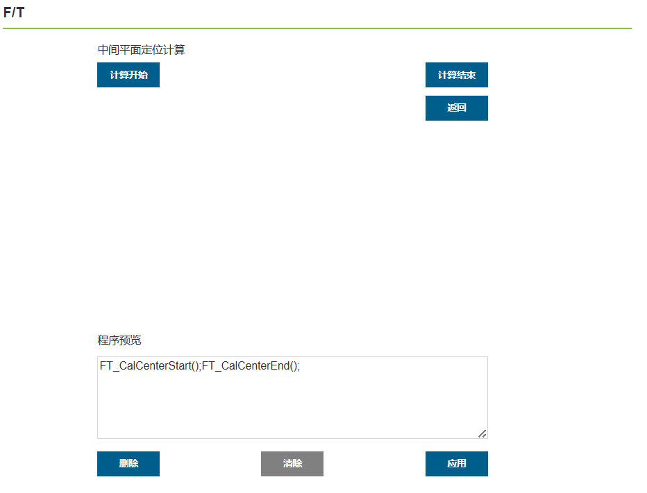

.. centered:: 图表 5.12-8 中心点+边长法建立干涉区

力传感器辅助拖动
~~~~~~~~~~~~~~~~~~~~~~
**Step1**：在“辅助应用”中的“机器人本体”的菜单栏下，点击“拖动锁定”进入力传感器辅助锁定功能界面；

**Step2**：按照如图9所示的参数进行设置，即可实现基于力传感器的虚拟墙功能。具体效果为：靠近虚拟墙，阻力变大；远离虚拟墙，基于力传感器辅助拖动功能正常。

.. centered:: 图表 5.12-9 力传感器辅助拖动的参数设置

参数的具体作用：

**自适应选择**：在需要装配时开启，开启后拖动变重；

**惯性参数**：调节拖动过程中的手感，最小值为0，需在技术人员指导下谨慎操作。

**阻尼参数**：

-  平动方向：建议设置参数在[100-200]之间；

-  转动方向：建议设置参数在[3-10]之间，其中RZ方向设置范围在[0.1-5]；

-  效果：借助传感器拖动时，增大阻尼会导致拖动困难，减小阻尼会导致拖动机器人过于轻松（建议不要太小）；

-  阻尼参数整体范围：平动XYZ：[100-1000]；转动RX、RY：[3-50],RZ:[2-10]；

-  最大拖动力为50，最大拖动速度为180。

**刚度参数**：均设为0；

**拖动力阈值**：平动XYZ为[5-10]；转动RX、RY、RZ为[0.5-5]；

**最大拖动力**：50；

**最大拖动速度**：180；