机器人外设
=============

.. toctree:: 
  :maxdepth: 5

夹爪外设配置
-------------------

夹爪程序示教步骤
~~~~~~~~~~~~~~~~~~~

**Step1**：在用户外设配置界面中选择“末端外设配置”按钮，设备类型选择“夹爪设备”，夹爪的配置信息分为夹爪厂商、夹爪类型、软件版本和挂载位置，用户可根据具体的生产需求来配置相应的夹爪信息。若用户需要更改配置，可先选择相应的夹爪编号，点击“清除”按钮，来清除相应的按钮，并重新根据需求配置；

.. centered:: 图表 4.1‑1 夹爪配置

.. important:: 
	点击清除配置前，相应的夹爪应处于未激活状态。

**Step2**：夹爪配置完成后，用户可在页面下方的夹爪信息表中查看相应的夹爪信息，若发现配置错误，可点击“清除”按钮，重新配置夹爪；

.. centered:: 图表 4.1‑2 夹爪配置信息

**Step3**：选择配置完成的夹爪，点击“复位”按钮，页面弹出命令发送成功后，再点击“激活”按钮，可查看夹爪信息表中的激活状态，来判断是否激活成功；

.. important::
	激活夹爪时，夹爪不可有夹持物

**Step4**：程序示教命令界面中选择“Gripper”命令。在夹爪命令界面中，用户可以选择想要控制的夹爪编号（已经完成配置并且被激活的夹爪），设置相应的开闭状态、开闭速度、开闭力矩已经等待夹爪动作的最大时间。完成设置后点击添加应用即可。此外还可以添加夹爪激活和复位指令，以便于在运行程序时去激活/复位夹爪。

.. figure:: robot_peripherals/003.png
   :align: center
   :width: 3in

.. centered:: 图表 4.1‑3 夹爪指令编辑

夹爪程序示教
~~~~~~~~~~~~~~~

喷枪外设配置
-------------

喷枪外设配置步骤
~~~~~~~~~~~~~~~~~~

**Step1**：在用户外设配置界面中选择“喷枪配置”按钮，用户可以通过喷涂功能一键配置按键，对喷涂所需DO进行快速配置（默认配置DO10为喷涂启停，DO11为喷涂清枪）。 用户也可以根据自己的需求在“IO配置”界面，自定义配置DO；

.. important:: 
	使用喷涂功能之前，需要先建立相应的工具坐标系，并在程序示教时应用建立好的工具坐标系。

**Step2**：配置完成后，点击“开始喷涂”、“停止喷涂”、“开始清枪”和“停止清枪”四个按钮，进行喷枪调试；

.. figure:: robot_peripherals/005.png
   :align: center
   :width: 3in

.. centered:: 图表 4.2‑1 喷枪配置

**Step3**：在程序示教命令界面选择“spray”命令。根据具体的程序示教需求，在相应的地方添加应用“开始喷涂”、“停止喷涂”、“开始清枪”和“停止清枪”四个指令。

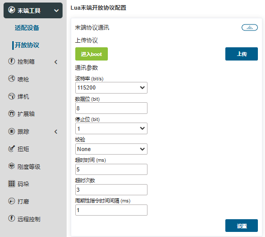

.. centered:: 图表 4.2‑2 喷枪指令编辑

喷涂程序示教
~~~~~~~~~~~~~~

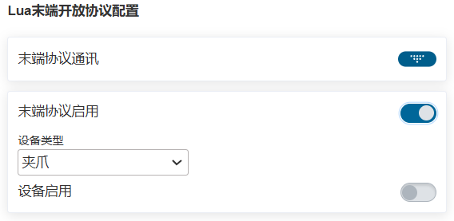

焊机外设配置
-------------

焊机外设配置步骤
~~~~~~~~~~~~~~~~~~

**Step1**：在用户外设配置界面中选择“焊机配置”按钮，用户可以通过配置焊机IO按键，对焊机所需DI和DO进行快速配置（默认配置DI12 起弧成功信号，DO9 送气信号，DO10 起弧信号，DO11 点动送丝，DO12 反向送丝，DO13 JOB选择1，DO14 JOB选择2，DO15 JOB选择3）。 用户也可以根据自己的需求在“IO配置”界面，自定义配置；

.. important:: 
	使用焊机功能之前，需要先建立相应的工具坐标系，并在程序示教时应用建立好的工具坐标系。焊机功能通常与激光跟踪传感器配合使用。

**Step2**：配置完成后，选择编号，设定等待时间，点击“收弧”、“起弧”、“送气”、“关气”、“正向送丝”和“反向送丝”六个按钮，进行焊机调试；

.. figure:: robot_peripherals/008.png
   :align: center
   :width: 3in

.. centered:: 图表 4.3‑1 焊机配置

**Step3**：在程序示教命令界面选择“Weld”命令。根据具体的程序示教需求，在相应的地方添加应用“起弧”和“收弧”指令。

.. centered:: 图表 4.3‑2 焊机指令编辑

焊机程序示教
~~~~~~~~~~~~~~~

传感器外设配置
---------------

传感器外设配置步骤
~~~~~~~~~~~~~~~~~~~~

**Step1**：在用户外设配置界面中选择“传感器配置”按钮，本小节以机器人末端为例说明，用户首先对最大差值进行设置，传感器扫描偏差点数最大差值建议默认设置为4，数据处理根据实际使用场景选择原始数据或者YZ数据。控制器IP默认为192.168.57.2，传感器IP配置为同一网段即可，端口为5020，采样周期建议值25，通信协议目前适配为睿牛通信协议，加载对应协议即可。加载完成后，可通过“打开传感器”和“关闭传感器”按键测试传感器。

.. figure:: robot_peripherals/011.png
   :align: center
   :width: 3in

.. centered:: 图表 4.4‑1 激光跟踪传感器IP配置

.. important:: 
	使用传感器功能之前，需要先建立相应的工具坐标系，并在程序示教时应用建立好的工具坐标系。焊机功能通常与传感器配合使用。

**Step2**：标定传感器参考点。

在工具坐标系设置功能中，我们标定传感器类型工具，使用六点法配置传感器坐标系。在机器人工作空间中选择一个固定的点，将传感器中心点从三个不同的角度移至所选点上，分别设置点1，2，3。将传感器中心点垂直移至所选点正上方，记录点4。将传感器中心点由固定点移至传感器坐标系的X轴方向上一点，设置点5。回到固定点，垂直向上移动，将传感器中心点由固定点移至传感器坐标系的Z轴方向上一点，设置为点6。点击计算，得到传感器工具的位姿，点击应用，即可完成。

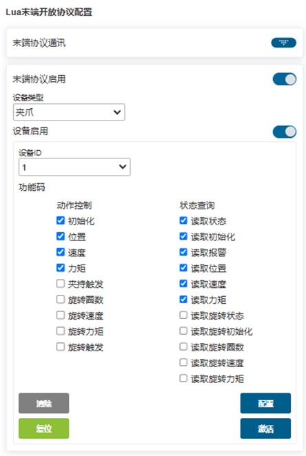

.. centered:: 图表 4.4‑2 参考点配置-六点法

**八点法**：在工具坐标系设置功能中，我们标定传感器类型工具，使用八点法配置传感器坐标系，选择八点法，移动传感器激光线使其与标定板上的标定线重合，尽量使得传感器与标定线保持较近距离且识别到标定点，记录点1，移动-y/+y方向20mm左右,调整机器人使激光识别到标定点，记录点2，移动-x/+x方向20mm左右，调整机器人使激光识别到标定点，记录点3，移动-y/+y方向20mm左右，调整机器人使激光识别到标定点，记录点4，移动-rx方向5mm左右，调整机器人使激光识别到标定点，记录点5。移动-ry方向5mm左右，调整机器人使激光识别到标定点，记录点6，移动-rz方向5mm左右，调整机器人使传感器识别到标定点，记录点7，移动-rz方向5mm左右，调整机器人使激光识别到标定点，记录点8。点击计算，得到传感器位姿，点击应用，即可完成。

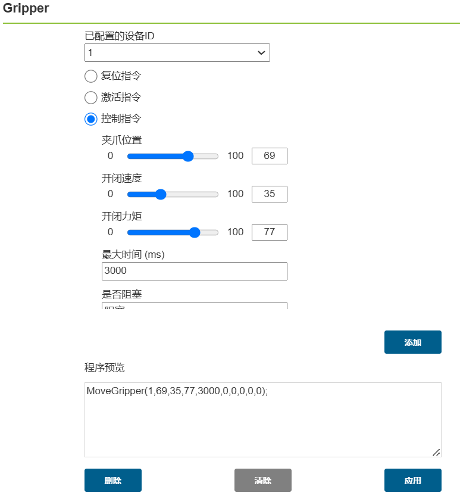

.. centered:: 图表 4.4‑3 参考点配置-八点法

**五点法**：在工具坐标系设置功能中，我们标定传感器类型工具，使用五点法配置传感器坐标系，首先确定一个固定点，将工具末端对准该点，记录点1，接着调整机器人姿态，使得激光识别到记录的固定点，分别记录点2至点5，注意姿态变化需要尽可能大。点击计算，得到传感器位姿，点击应用，即可完成。

.. figure:: robot_peripherals/014.png
   :align: center
   :width: 3in

.. centered:: 图表 4.4‑4 参考点配置-五点法

激光传感器跟踪功能
~~~~~~~~~~~~~~~~~~~

指令说明：在程序示教命令界面选择“Laser”命令。里面集成了激光的相关指令，根据具体的程序示教需求，在相应的地方添加指令，参考下方的程序示例。

.. centered:: 图表 4.4‑5 激光跟踪指令编辑

程序示例：

激光传感器轨迹复现功能
~~~~~~~~~~~~~~~~~~~~~~~~~~~

指令说明：在程序示教命令界面选择“LT-Rec”命令。该指令主要用于激光识别路径起点终点获取以及轨迹复现，根据具体的程序示教需求，在相应的地方添加指令，参考下方的程序示例。

.. centered:: 图表 4.4‑6 轨迹复现指令编辑

程序示例：

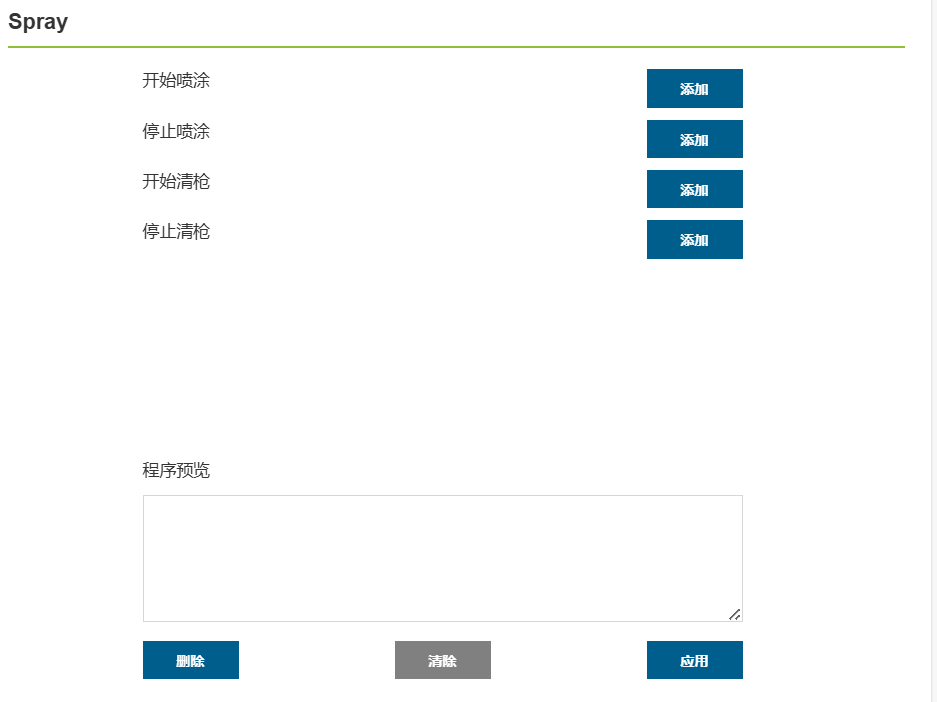

扩展轴外设配置
----------------

扩展轴外设配置步骤
~~~~~~~~~~~~~~~~~~~~~~~~

**Step1**：在用户外设配置界面中选择“扩展轴”按钮，进入扩展轴界面，选择扩展轴编号1，点击“参数配置”按键进入右侧界面。设置轴类型，轴方向，运行速度，加速度，正方向限位，反方向限位，导程，编码器分辨率，起点偏置，厂家，型号和模式，点击配置即可配置完成。

.. figure:: robot_peripherals/019.png
   :align: center
   :width: 3in

.. centered:: 图表 4.5-1 扩展轴参数配置
	
.. important:: 
	使用扩展轴功能之前，需要先建立相应的扩展轴标系，并在程序示教时应用建立好的工具坐标系。扩展轴功能主要与焊机功能和激光跟踪传感器功能配合使用。

**Step2**：使点击“零点设置”按键进入零点设置弹窗，如右侧图片所示。设定回零方式，寻零速度，零点箍位速度和轴方向，点击“设置”按键，扩展轴开始回零，回零状态会显示在轴方向下方空白处，当出现“回零已完成”提示表明扩展轴零点设置成功。

.. figure:: robot_peripherals/020.png
   :align: center
   :width: 3in

.. centered:: 图表 4.5‑2 扩展轴零点设置

**Step3**：选择已经配置好参数的扩展轴编号，点击“伺服使能”后，设置运行速度，加速度和单次运行最大距离，可以进行正向转动和反向转动测试扩展轴。

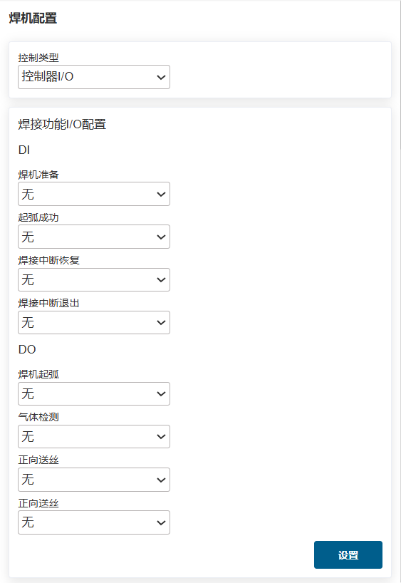

.. centered:: 图表 4.5‑3 扩展轴测试

**Step4**：扩展轴通常于激光传感器配合使用，此时激光传感器通常采用外部安装方式，传感器参考点配置需要采用三点法标定，而不是之前使用的六点法标定。将工具中心对准右侧横截面底部中间点（靠近相机那一侧）设定点1，将工具中心点对准另一截面即左侧横截面底部中间点，设定点2，将工具中心点移至传感器右侧横截面上边缘中间点，设定点3，计算并保存，点击应用完成三点法标定。

.. centered:: 图表 4.5‑4 传感器三点法标定

**Step5**：在程序示教命令界面选择“EAxis”命令。根据具体的程序示教需求，在相应的地方添加指令。

.. figure:: robot_peripherals/023.png
   :align: center
   :width: 3in

.. centered:: 图表 4.5‑5 扩展轴指令编辑

扩展轴配合激光跟踪焊接示教程序
~~~~~~~~~~~~~~~~~~~~~~~~~~~~~~~~

传送带跟踪配置
-----------------

传送带跟踪配置步骤
~~~~~~~~~~~~~~~~~~~~~

**Step1**：在用户外设配置界面中选择“传送带跟踪”按钮，进入传送带跟踪配置界面，点击“配置传送带IO”按键快速配置传送带功能所需IO，之后根据实际使用功能情况配置对应的参数，此处以无视觉跟踪抓取功能为例，需要配置传送带编码器通道，分辨率，导程，视觉搭配选择否，点击配置。

.. figure:: robot_peripherals/025.png
   :align: center
   :width: 3in

.. centered:: 图表 4.6‑1 传送带配置

**Step2**：接下来设置抓取点补偿值，为X,Y,Z三个方向上的补偿距离，可在调试过程中根据实际情况设置。

.. centered:: 图表 4.6‑2 传送带抓取点补偿配置

**Step3**：开启传送带，将标定的物体移动到定义的A点位置，停止传送带。移动机器人，将机器人末端的标定杆尖点与所标定的物体尖点对齐，点击起始点A按键，跳出对话框，显示当前编码器值和机器人位姿，点击标定完成起始点A标定。

.. figure:: robot_peripherals/027.png
   :align: center
   :width: 3in

.. centered:: 图表 4.6‑3 起始点A配置

**Step4**：点击参考点按键，进入参考点标定，记录参考点时记录机器人抓取时的高度和姿态，每次跟踪时都会以记录参考点的高度和姿态区跟踪抓取，可以和AB点不在一个高度，点击标定完成参考点标定。

.. centered:: 图表 4.6‑4 参考点配置

**Step5**：开启传送带，将标定的物体移动到定义的B点位置，停止传送带。移动机器人，将机器人末端的标定杆尖点与所标定的物体尖点对齐，点击终点B按键，弹出对话框，显示当前编码器值和机器人位姿，点击标定完成终点B标定。

.. figure:: robot_peripherals/029.png
   :align: center
   :width: 3in

.. centered:: 图表 4.6‑5 终点B配置

传送带跟踪示教程序
~~~~~~~~~~~~~~~~~~~~~~~

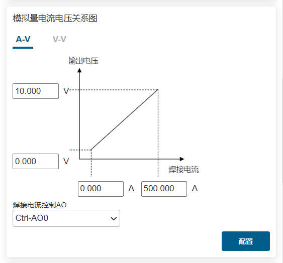

姿态自适应配置
----------------

姿态自适应配置步骤
~~~~~~~~~~~~~~~~~~~~~~

**Step1**：在用户外设配置界面中选择“跟踪姿态配置”按钮，进入姿态调整配置界面，选择板材类型和机器人实际工作运动方向，调整机器人姿态，分别设置姿态点A，姿态点B和姿态点C，通常A为平面姿态点，B为上升沿姿态点，C为下降沿姿态点。

.. figure:: robot_peripherals/031.png
   :align: center
   :width: 3in

.. centered:: 图表 4.7‑1 姿态调整配置

.. important:: 
	A姿态和B姿态，A姿态和C姿态之间的姿态变化在满足应用需求下姿态变化越小越好。姿态自适应功能为辅助应用功能，通常配合焊缝跟踪使用。

**Step2**：在程序示教命令界面选择“Adjust”命令。根据具体的程序示教需求，在相应的地方添加指令。

.. figure:: robot_peripherals/032.png
   :align: center
   :width: 3in

.. centered:: 图表 4.7‑2 姿态调整指令编辑

姿态自适应配合扩展轴和激光跟踪焊接示教程序
~~~~~~~~~~~~~~~~~~~~~~~~~~~~~~~~~~~~~~~~~~~~

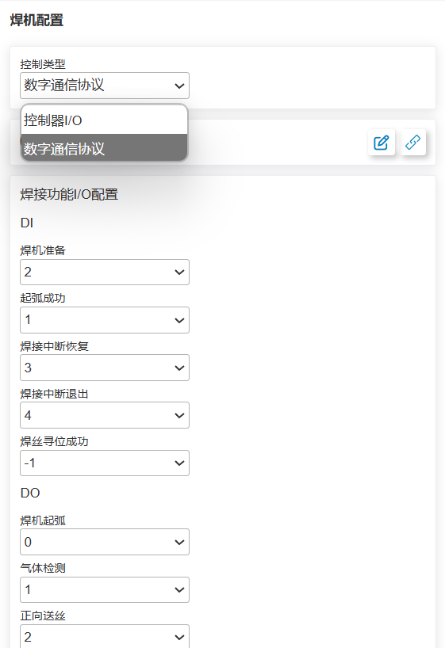

力/扭矩传感器外设配置
-------------------------

力/扭矩传感器配置步骤
~~~~~~~~~~~~~~~~~~~~~~~~~~~

**Step1**：在用户外设配置界面中选择“末端外设配置”按钮，设备类型选择“力传感器设备”，力传感器配置信息分为厂商、类型、软件版本和挂载位置，用户可根据具体的生产需求来配置相应的力传感器信息。若用户需要更改配置，可先选择相应的编号，点击“清除”按钮，来清除相应的信息，并重新根据需求配置；

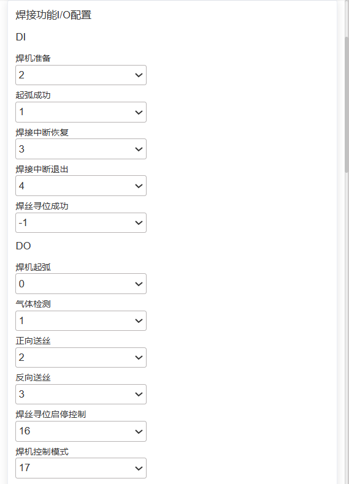

.. centered:: 图表 4.8‑1 力/矩传感器配置

.. important:: 
	点击清除配置前，相应的传感器应处于未激活状态。

**Step2**：力传感器配置完成后，用户可在页面下方的信息表中查看相应的力传感器信息，若发现配置错误，可点击“清除”按钮，重新配置。

.. centered:: 图表 4.8‑2 力/矩传感器配置信息

**Step3**：选择配置完成的力传感器编号，点击“复位”按钮，页面弹出命令发送成功后，再点击“激活”按钮，可查看力传感器信息表中的激活状态，来判断是否激活成功；此外，力传感器会有初始值，用户根据使用需求选择“零点矫正”和“去除零点”。力传感器零点矫正需要确保力传感器水平垂直向下，且机器人未配置负载。

**Step4**：力传感器配置完成后，需要配置传感器类型工具坐标系，可根据传感器与末端工具中心的距离直接输入传感器工具坐标系值并应用。

力/扭矩传感器负载辨识
~~~~~~~~~~~~~~~~~~~~~~~~

特定姿态辨识：清除末端负载数据，配置好力传感器后，建立传感器坐标系，将机器人末端姿态调整为垂直向下，进行“零点矫正”后安装末端负载。首先选择对应传感器工具坐标系，调整机器人，使得传感器及工具垂直向下，记录数据，计算质量。接着，调整机器人3个不同姿态，分别记录三组数据，计算出质心，确认无误后点击应用。

**动态辨识**：清除末端负载数据，配置好力传感器后，建立传感器坐标系，将机器人末端姿态调整为垂直向下，进行“零点矫正”后安装末端负载。点击“辨识开启”，拖动机器人进行运动，接着点击“辨识关闭”，即可自动将负载结果应用到机器人中。

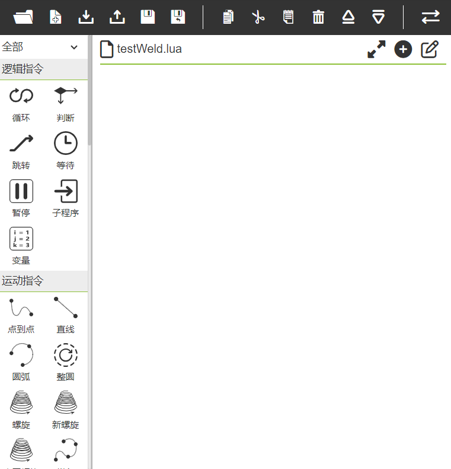

.. centered:: 图表 4.8‑4 力/扭矩传感器负载辨识

力/扭矩传感器辅助拖动
~~~~~~~~~~~~~~~~~~~~~~~

配置好传感器后，可以搭配传感器对拖动机器人进行更好的辅助。第一次使用时可以按照右侧图片的数据进行配置，应用完成后，此时无需进入拖动模式，直接对末端力传感器进行拖拽，即可控制机器人在固定姿态进行移动。

.. figure:: robot_peripherals/037.png
   :align: center
   :width: 3in

.. centered:: 图表 4.8‑4 力/扭矩传感器拖动锁定

力/扭矩传感器碰撞检测
~~~~~~~~~~~~~~~~~~~~~~~~~

指令说明：“FT_Guard”指令为碰撞检测指令。选择对应的传感器坐标系，勾选生效的力矩方向检测，设置当前值，碰撞最大阈值和碰撞最小阈值三项，碰撞检测条件正常范围为（当前值-最小阈值，当前值+最大阈值），将“开启”和“关闭”指令加入到程序中在。

.. figure:: robot_peripherals/038.png
   :align: center
   :width: 3in

.. centered:: 图表 4.8‑5 FT_Guard指令编辑

程序示例：

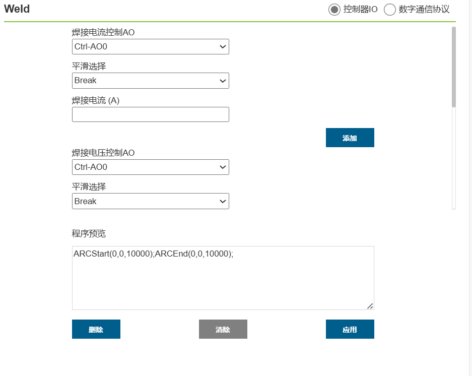

力/扭矩传感器力控运动
~~~~~~~~~~~~~~~~~~~~~~~~

指令说明：“FT_Control”指令为力控运动指令，可以使机器人在设定力的附近运动，常用于打磨场景中。选择对应的传感器坐标系，勾选生效的力矩方向检测，设置检测阈值，以及各个方向上PID比例系数(一般设置p为0.001)，设置最大调整距离（对应X,Y,Z）和最大调整角度（对应RX,RY,RZ），将“开启”和“关闭”指令加入到程序中在。

.. figure:: robot_peripherals/040.png
   :align: center
   :width: 3in

.. centered:: 图表 4.8‑6 FT_Control指令编辑

程序示例：

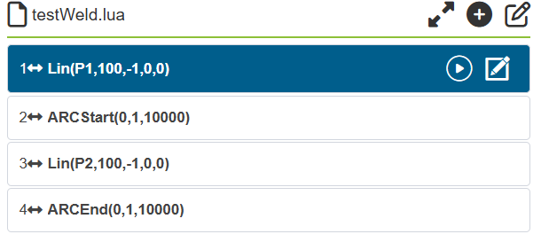

力/扭矩传感器螺旋插入
~~~~~~~~~~~~~~~~~~~~~~~~~~

指令说明：“FT_Spiral”指令为螺旋线探索插入，一般用于圆柱轴的轴孔装配动作。在运行动作之前，需要将机器人末端拖动至孔位的大致位置，根据当前场景，设定指令的参数，添加到程序中，运行后，机器人会以螺旋形的运动进行探索。

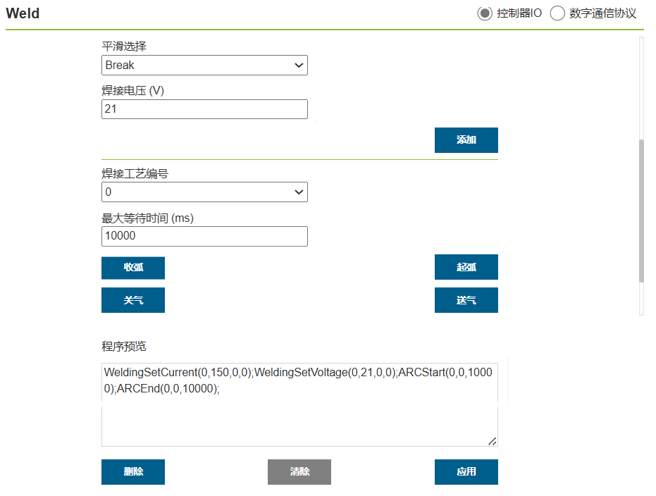

.. centered:: 图表 4.8‑7 FT_Spiral指令编辑

程序示例：

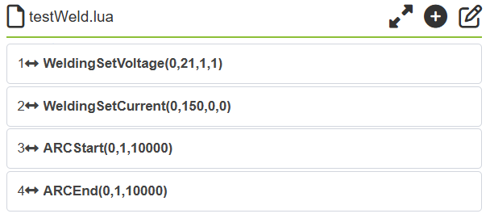

力/扭矩传感器旋转插入
~~~~~~~~~~~~~~~~~~~~~~~~~

指令说明：“FT_Rot”指令为旋转探索插入，一般用于承接螺旋线插入动作，用于键轴的轴孔装配。在运行动作之前，需要将机器人末端移动至螺旋线探索找到的孔位或者完全对齐的示教孔位，根据当前场景，设定指令的参数，添加到程序中，运行后，机器人会以缓慢的旋转进行探索。

.. figure:: robot_peripherals/044.png
   :align: center
   :width: 3in

.. centered:: 图表 4.8‑8 FT_Rot指令编辑

程序示例：

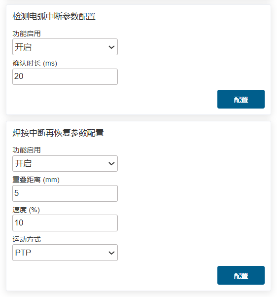

力/扭矩传感器直线插入
~~~~~~~~~~~~~~~~~~~~~~~~~

指令说明：“FT_Lin”指令为旋转探索插入，一般用于承接螺旋线插入动作或旋转插入动作，用于键轴的轴孔装配。在运行动作之前，需要将机器人末端移动至螺旋线探索找到的孔位，旋转插入动作结束的位置或者完全对齐的示教孔位，根据当前场景，设定指令的参数，添加到程序中，运行后，机器人会以设定的方向进行直线运动。

.. centered:: 图表 4.8‑9 FT_Lin指令编辑

程序示例：

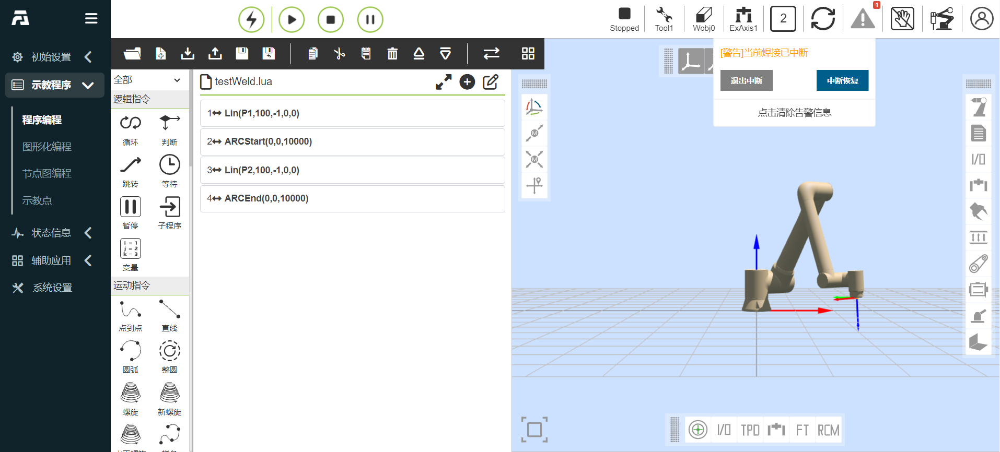

力/扭矩传感器表面定位
~~~~~~~~~~~~~~~~~~~~~~~~~~~

指令说明：“FT_FindSurface”指令为表面定位，一般用于寻找物体表面。根据当前场景，设置对应坐标系，移动方向、移动轴、探索直线速度、探索直线加速度、最大探索距离、动作终止力阈值等参数，添加到程序中，运行程序，动作开始执行，机器人末端开始缓慢向表面所在方向移动。

.. figure:: robot_peripherals/048.png
   :align: center
   :width: 3in

.. centered:: 图表 4.8‑10 FT_FindSurface指令编辑

程序示例：

.. figure:: robot_peripherals/049.png
   :align: center
   :width: 6in

力/扭矩传感器中心定位
~~~~~~~~~~~~~~~~~~~~~~~

指令说明：“FT_CalCenter”指令为中心定位，一般用于寻找两表面的中间平面表面。根据当前场景，设置对应坐标系，移动方向、移动轴、探索直线速度、探索直线加速度、最大探索距离、动作终止力阈值等参数，分别寻找A平面和B平面，添加到程序中，运行程序，动作开始执行，机器人缓慢向表面A所在方向移动，定位到A面后，机器人缓慢向表面B所在方向移动，定位到B面后，即可算出中心平面位置。

.. figure:: robot_peripherals/050.png
   :align: center
   :width: 3in

.. centered:: 图表 4.8‑11 FT_CalCenter指令编辑

程序示例：

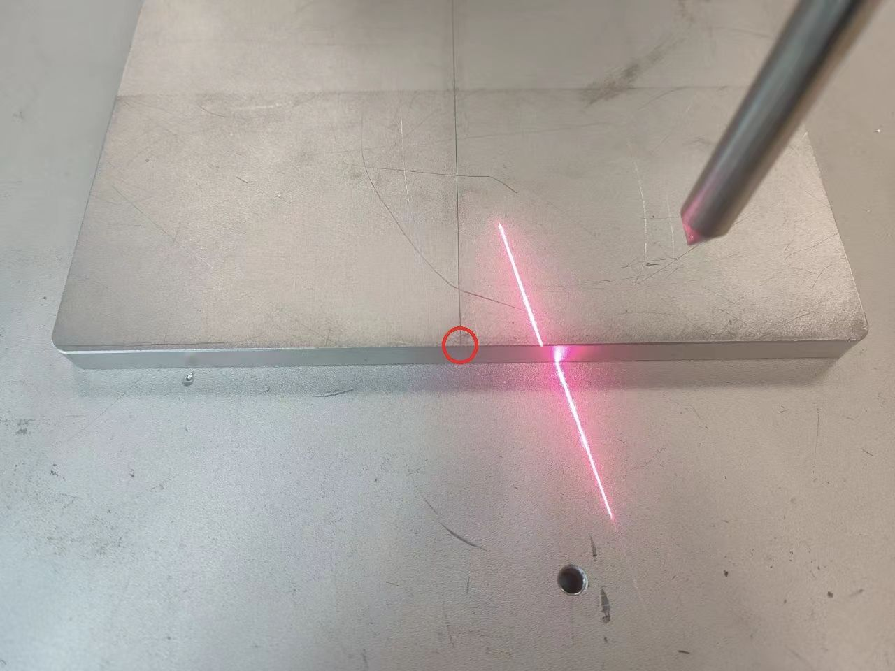

力/扭矩传感器点按力探测
~~~~~~~~~~~~~~~~~~~~~~~~~~~

指令说明：“FT_Click”指令为点按力探测，点按力探测用于探测一个点按力，通常和表面定位动作配合使用。设置好参数后，添加到程序中，运行程序，末端开始沿工具坐标系Z方向向目标移动，当Z正方向上的力达到点按力数值，则点按力探测完成。

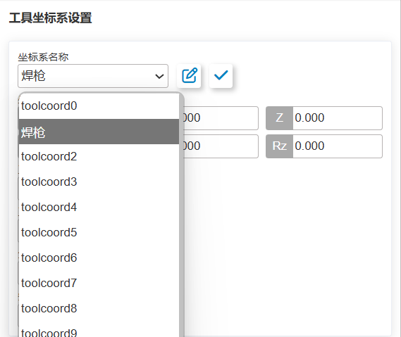

.. centered:: 图表 4.8‑12 FT_Click指令编辑

程序示例：

.. figure:: robot_peripherals/053.png
   :align: center
   :width: 6in

扩展IO设备外设配置
------------------------

扩展IO设备配置步骤
~~~~~~~~~~~~~~~~~~~~~~~~~~~

**Step1**：在用户外设配置界面中选择“末端外设配置”按钮，设备类型选择“扩展IO设备”，扩展IO设备配置信息分为厂商、类型、软件版本和挂载位置，用户可根据具体的生产需求来配置相应的设备信息。若用户需要更改配置，可先选择相应的编号，点击“清除”按钮，来清除相应的信息，并重新根据需求配置；

.. centered:: 图表 4.9‑1 扩展IO设备配置

.. important:: 
	点击清除配置前，相应的设备应处于未激活状态。

**Step2**：扩展IO设备配置完成后，用户可在辅助应用中点击“Smart Tool”功能菜单，进入此功能配置页面，用户可以对末端手柄上的各个按键功能进行自定义，包括（新建程序，保持程序，PTP，Lin，ARC，摆焊开始，摆焊结束，IO端口）。

.. figure:: robot_peripherals/055.png
   :align: center
   :width: 3in

.. centered:: 图表 4.9‑2 扩展IO设备功能配置

码垛系统配置
---------------

码垛系统配置步骤
~~~~~~~~~~~~~~~~~~~~~~

**Step1**：在用户外设配置界面中选择“码垛系统配置”按钮，第一次使用，需要首先进行配方创建，点击“配方创建”，输入配方名称，点击“创建”，创建成功后点击“开始配置”进入码垛配置页面。

.. figure:: robot_peripherals/056.png
   :align: center
   :width: 6in

.. centered:: 图表 4.10‑1 码垛配方配置

**Step2**：在工件配置栏中点击“配置”进入工件配置弹窗，设置工件的“长度”，“宽度”，“高度”以及工件的抓取点，点击“确认配置”完成工件信息设置。

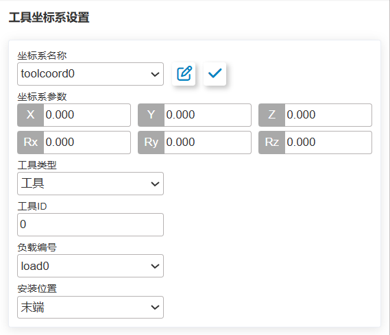

.. centered:: 图表 4.10‑2 码垛工件配置

**Step3**：在托盘配置栏中点击“配置”进入托盘配置弹窗，设置托盘“前边”，“侧边”和“高度”，接着设置工位和工位过渡点，点击“确认配置”完成托盘信息设置。

.. figure:: robot_peripherals/058.png
   :align: center
   :width: 3in

.. centered:: 图表 4.10‑3 码垛托盘配置

**Step4**：在模式配置栏中点击“配置”进入模式配置弹窗，设置工件间隔，右侧框框为模拟工件放置方式，可以单个添加也可以批量添加。接着设置码垛层数和各层的模式，点击“确认配置”完成模式信息设置。

.. figure:: robot_peripherals/059.png
   :align: center
   :width: 3in

.. centered:: 图表 4.10‑4 码垛模式配置

**Step4**：点击“生成程序”，打开“码垛监控页”，在此页面可以对“生成信息”，“报警信息”和“码垛程序”显示和查看。

.. centered:: 图表 4.10‑5 码垛系统监控
