安全
===============

.. toctree:: 
   :maxdepth: 6

背景
------------------------------------------------
工业机器人作为工业智能制造发展中的关键执行单元，其安全性能已上升为设备全生命周期管理中的核心要素。当前，业内普遍要求安全功能相关参数具备固化的不可篡改性，并建立完整、可追溯的校验机制，以满足严苛的安全合规审计需求。
欧洲地区系统集成商及终端用户在实际项目验收中，进一步对安全配置的透明化与可验证性提出了明确要求。具体而言，安全功能调试完成后，系统应能够自动生成一份包含完整性校验和（Checksum）的安全配置报告，且该校验和须在设备Web管理界面中实时同步呈现。这一机制旨在确保任何对安全参数的修改均可被有效识别与记录，从而为设备的安全状态评估、现场验收及后续运维提供可信赖的依据。
有鉴于此，本设备在安全架构设计上，不仅遵循相关国际安全标准，同时内建了安全配置导出与校验和实时显示功能，以协助操作人员与安全管理人员便捷、可靠地完成配置确认及合规性证明工作。

安全配置校验和
------------------------------------------------

打开web页面，安全校验和位于网页右上角，由8位16进制表示。安全校验和具有唯一性，当安全配置参数发生变更时，安全校验和随之更改。

.. centered:: 图表 7.1-1 安全配置校验和显示

点击安全校验和，即可显示当前安全校验和所代表的安全配置参数集合。

.. image:: safety/002.png
   :width: 6in
   :align: center

.. centered:: 图表 7.1-2 安全配置参数

安全配置参数支持导出PDF报告，点击下载即可预览PDF报告，同时支持导出。点击保存按钮，即可下载PDF报告。

.. image:: safety/003.png
   :width: 6in
   :align: center

.. centered:: 图表 7.1-3 安全配置报告PDF预览

安全配置参数管理
------------------------------------------------

当前机器人所有相关安全配置参数统一放于web页面“初始设置”-“安全”页面中进行维护。安全配置参数修改需要先输入“安全配置密码”进行校验，校验成功后方可进行安全参数配置修改。

.. image:: safety/004.png
   :width: 4in
   :align: center

.. centered:: 图表 7.2-1 安全配置密码校验

修改安全配置参数后，点击“应用”，需要二次确认修改的安全配置参数，点击“确认”即可应用参数。参数应用成功后安全配置校验和会随之更新。

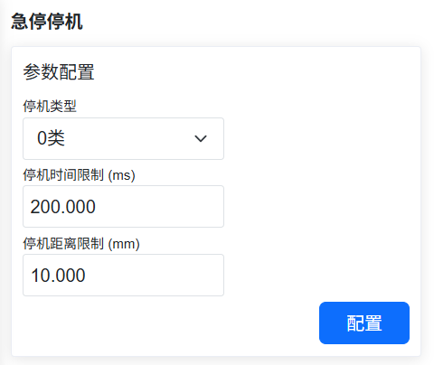

.. centered:: 图表 7.2-2 安全配置参数二次确认

安全配置密码管理
------------------------------------------------

安全配置密码可在“系统设置”-“维护模式”-“安全参数配置”中进行修改，原始密码为12345678，修改密码需要进行旧密码验证，新旧密码不可相同，密码位数最低1位，最高8位，区分大小写字母及符号。

.. centered:: 图表 7.3-1 安全配置密码管理

如忘记旧密码，请与法奥市场相关技术人员联系。

安全配置参数
--------------------------------------------------------------------------------------------------

机器人安全参数
~~~~~~~~~~~~~~~~~~~~~~~~~~~~~~~~~~~~~~~~~~~~~~~~~~~~~~~~~~~~~~~~~~~~~~~

机器人速度
++++++++++++++++++++++++++++++++++++++++++++++++++++++++++++++

点击菜单栏“初始设置”->“安全”，点击“机器人速度”子菜单进入配置界面。

机器人速度用于限制机器人的最大线速度，线加速度以及关节角加速度。

.. centered:: 图表 7.4-1 机器人速度
 
停止减速规划
++++++++++++++++++++++++++++++++++++++++++++++++++++++++++++++

点击菜单栏“初始设置”->“安全”，点击“停止减速规划”子菜单进入配置界面。

- 自由停机：进入停止时各轴的角速度按所设停机减速度百分比乘以关节最大加速度进行减速停止；
- 同步停机：进入停止时TCP位姿速度按所设停机减速度百分比乘以位姿最大加速度进行减速停止；

停机减速度为加速度的百分比。

.. centered:: 图表 7.4-2 机器人停止减速规划

安全停止
++++++++++++++++++++++++++++++++++++++++++++++++++++++++++++++

点击菜单栏“初始设置”->“安全”，点击“安全停止”进入配置界面，设置安全停止模式和安全停止策略参数功能。

当安全停止的触发方式设置为“双通道”时，必须双通道保证清除状态并在操作界面人为清除警告后机器人才可复位。此外，在策略配置中增加缩减模式选项，当用户选择该策略时，机器人将进入缩减模式运动。

**Step1**：点击“初始设置”—>“安全”—>“安全停止”按钮，触发方式可选为“默认”和“双通道”两种模式，二者不同之处在于：“默认”模式在触发并恢复后自动清除界面报错，“双通道”模式在触发并恢复后需手动清除界面报错。“安全停止策略”可选择“停止”、“暂停”、“一级缩减模式”和“二级缩减模式”等类型，详细说明如下：当选为“停止”时，机器人将停止当前运动；当选为“暂停”时，机器人将暂停当前运动，恢复并清除报错后，将恢复暂停；当选为“一级缩减模式”时，机器人将进入一级缩减模式运动；当选为“二级缩减模式”时，机器人将进入二级缩减模式运动。

.. image:: safety/009.png
   :width: 6in
   :align: center

.. centered:: 图表 7.4-3 机器人停止减速规划

**Step2**：因当触发方式选为“默认”时，在触发恢复后，可自动清除界面报错，当触发方式选为“双通道”时的操作：在触发恢复后，需手动点击右上角的“清除”操作，机器人才可复位。

安全速度
++++++++++++++++++++++++++++++++++++++++++++++++++++++++++++++

点击菜单栏“初始设置”->“安全”，点击“安全速度”进入配置界面，设置安全速度。TCP手动速度范围1-1500mm/s。

机器人安全速度功能是在人机协作或动态环境中，通过主动限制机器人的运行速度，将动能与冲击力控制在安全阈值内，从而在意外接触时防止人员受伤，并有效保护设备与工件免受碰撞损害。

**Step1**：点击“初始设置”-“安全”-“安全速度”按钮，进行安全速度参数的设置：主要包含“功能启用”、“限制速度”、“超速后模式”三部分。

其中，功能启用中可选择“不启用”、“手动模式启用”和“所有模式启用”三种类型；

限制速度中进行限制速度的设置，机器人的线速度达到该限制速度时，将根据“超速后模式”的设定参数进行处理。“超速后模式”可选择“停止报警”、“自动限速”和“停止报警后去使能”三种模式，自动限速仅可在“手动模式启用”中使用。

设置完成所需参数后，无需多余操作，将按照设定参数对机器人的运动进行处理，参数设置如图所示。

.. image:: safety/010.png
   :width: 4in
   :align: center

.. centered:: 图表 7.4-4 安全速度参数设置

急停停机
++++++++++++++++++++++++++++++++++++++++++++++++++++++++++++++

点击菜单栏“初始设置”->“安全”，点击“急停停机”进入配置界面。

急停停机类型0、1a、1b、2可设置、停机时间限值可设置、停止距离限值可设置。

通过控制器送控制箱板，急停停机类型0控制箱板直接断电；

- 急停停机类型1a为减速停机后，切断本体电源；
- 急停停机类型1b为减速停机后，不切断本体电源，本体去使能；
- 急停停机类型为2表示拍下急停，机器人减速停止并且保持使能，松开急停后，机器人应可以正常运行。

.. image:: safety/011.png
   :width: 4in
   :align: center

.. centered:: 图表 7.4-5 急停停机设置

保护性停机
++++++++++++++++++++++++++++++++++++++++++++++++++++++++++++++

点击菜单栏“初始设置”->“安全”，点击“保护性停机”子菜单进入配置界面。

保护性停机类型0、1、2，保护性停机类型0控制箱板直接断电，保护性停机类型1控制箱板先通知控制器控制机器人停住然后控制器反馈控制箱板断电，保护性停机类型2控制箱板通知控制器控制机器人停住。

.. image:: safety/012.png
   :width: 4in
   :align: center

.. centered:: 图表 7.4-6 保护性停机配置

开机自动使能
++++++++++++++++++++++++++++++++++++++++++++++++++++++++++++++

点击菜单栏“初始设置”->“安全”，点击“机器人使能”子菜单进入配置界面。可选择机器人开机自动使能和不使能。

.. centered:: 图表 7.4-7 开机自动使能

工具方向限制（仅在LA系统下使用）
++++++++++++++++++++++++++++++++++++++++++++++++++++++++++++++

点击菜单栏“初始设置”->“安全”，点击“工具方向限制”子菜单进入配置界面。

工具方向限制是作用于机器人工具末端笛卡尔空间的用来限制机器人末端姿态运动范围的保护性功能，包括了功能启用设置，基准工具方向设定，最大偏移角设置。最大偏移角定义了工具末端笛卡尔坐标系Z轴与基准工具方向的最大夹角限制角度值，通常可理解为圆锥形空间。

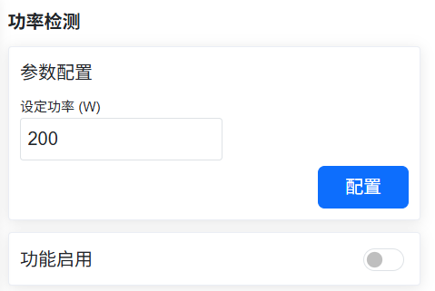

.. centered:: 图表 7.4-8 工具方向限制

机器人限值（仅在LA系统下使用）
++++++++++++++++++++++++++++++++++++++++++++++++++++++++++++++

点击菜单栏“初始设置”->“安全”，点击“机器人限值”子菜单进入配置界面。

机器人限值包括动量和功率，其中动量限值用于限制机器人最大动量，功率限值用于限制机器人做的机械功。

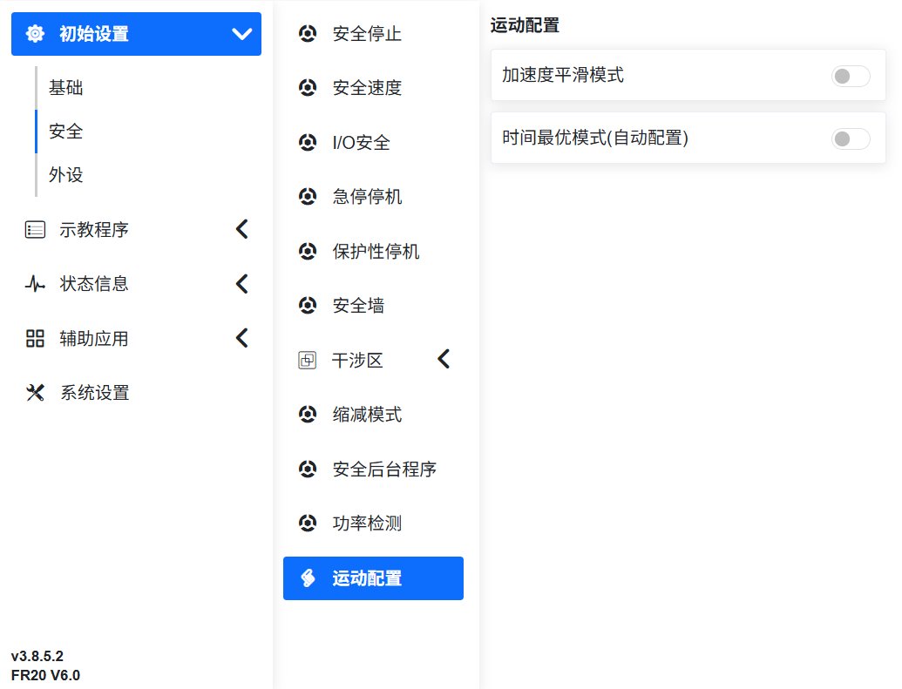

.. centered:: 图表 7.4-9 机器人限值

关节
~~~~~~~~~~~~~~~~~~~~~~~~~~~~~~~~~~~~~~~~~~~~~

关节软限位
++++++++++++++++++++++++++++++++++++++++++++++++++++++++++++++

在“初始设置”->“安全”->“关节”的菜单栏下，点击“关节软限位”进入软限位界面。

机器人行程内可能存在其它设备，限位角度可对机器人进行软限位，使机器人运动不超过某个坐标值，防止机器人碰撞。触发软限位机器人停止为机器人自动触发，无停止距离。

管理员可使用默认值也可输入角度值。输入角度值，可分别对机器人关节正负角度进行限位，当输入值超出2.1-基本参数中的机器人基本参数表格所列出的机器人关节软限位角度值，会将限位角度调整为所能设定最大值。当机器人报出关节指令超限时，需要进入拖动模式，将机器人关节拖动至限位角度之内。

关节软限位保护功能是一种通过实时监测机械臂关节运动状态，动态限制操作者在拖动示教过程中超出设置软限位范围的主动防护机制。该功能使得软限位在拖动示教下同样存在意义，从而提升人机协作安全性。

- **Step1**：登录web界面，依次点击“初始设置”->“安全”->“关节”->“关节软限位”，进入机器人软限位设置模块。
- **Step2**：基于机器人实际的工作范围，合理设置各关节软限位。此时，需要检查当前机器人各关节的角位置是否在预设软限位范围内，若是则可点击“应用”下发预设软限位；若不是，则需将各关节移动至预设范围内，否则当点击“应用”时将提示超限，见下图所示。此时，可朝进入软限位范围方向单轴点动或拖动超限关节，从而清除错误。
- **Step3**：当软限位范围设置成功后，“关节软限位保护”选择开启，可开启该功能，具体见下图所示。此时，拖动模式下，所设软限位将起到限制作用，同时，在拖动至软限位附近时，将感受到阻力。
- **Step4**：若需关闭关节软限位保护功能，可通过点击“关节软限位保护”关闭实现。

.. image:: safety/016.png
   :width: 4in
   :align: center

.. centered:: 图表 7.4-10 关节软限位

碰撞等级
++++++++++++++++++++++++++++++++++++++++++++++++++++++++++++++

在“初始设置”->“安全”->“关节”的菜单栏下，点击“碰撞等级”进入碰撞等级界面。
碰撞等级分为一到十级，一到三级检测比较灵敏，机器人需要在推荐速度下运行。同时可以选择自定义百分比设置，100%即对应十级。如下图所示：

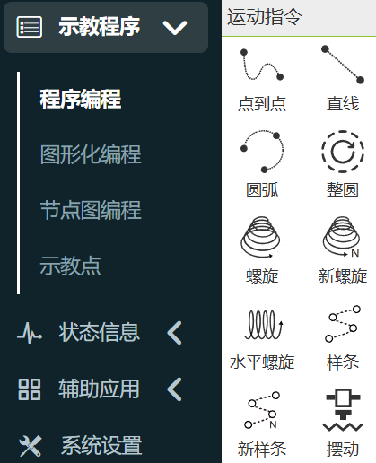

.. centered:: 图表 7.4-11 碰撞等级示意图

碰撞策略为“碰撞停止”、“碰撞暂停”和“继续运动”。为了避免碰撞后机器人与物体产生挤压力，增加策略“重力矩模式”、“振荡响应模式”和“碰撞回弹模式”。三种策略在触发时，均会从自动模式或手动模式，切换至拖动模式，之后再切换至手动模式。其中重力矩模式会根据碰撞力大小及方向远离碰撞点；振荡响应模式会在远离碰撞点后，回到碰撞位置；碰撞回弹模式会根据设置的参数，加速远离碰撞点。

在“碰撞策略”一栏中， 点击下拉框选择“碰撞回弹模式”，依次设置安全时间1000ms，安全距离150mm，安全速度150mm/s，各关节安全系数为5，具体界面如下图所示。

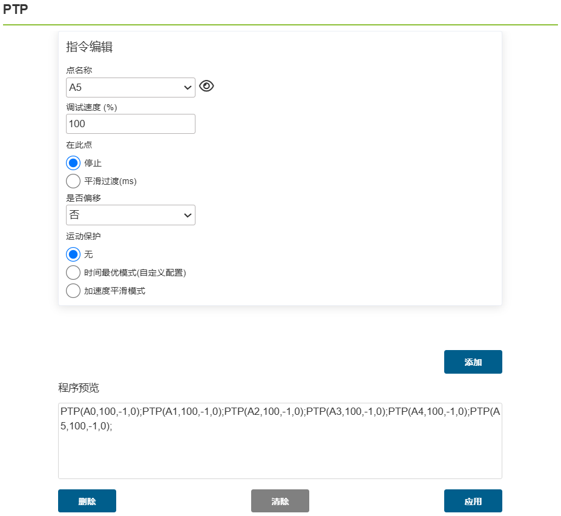

.. centered:: 图表 7.4-12 碰撞策略之碰撞回弹模式

各项参数的含义：

- 安全时间：表示从自动模式切换至拖动模式后，在拖动模式下的持续时间，范围是[1000-2000]ms；
- 安全距离：表示碰撞后机器人远离碰撞点的位置，范围是[150-200]mm；
- 安全速度：表示碰撞后机器人远离碰撞点的最大TCP速度，超出速度限制后，会约束反弹力，范围是[50-250]mm/s；
- 安全系数：表示反弹力的衰减速度，系数越小，衰减越快，反弹速度越快，反之越慢；范围是[1-10]，无量纲。
- 在机器人进入拖动模式之前，需要进行力矩检测。该功能的作用是防止由于操作者设置了错误的负载参数或选择了错误的安装方式，导致机器人进入拖动模式后出现上抬或下坠等异常现象。若检测到关节力矩超出允许范围，控制器会立即报错，并禁止机器人进入拖动模式。

启用直线齿条导轨碰撞检测功能步骤如下：

- Step1：确保导轨及机器人安装方式均为正装。在开启直线齿条导轨碰撞检测功能前，需要检查安装方式是否为正装。具体地，先确保导轨和机器人安装方式为正装，然后，依次点击“初始设置”→“基础”→“安装”，进入自由安装页面，若“基座旋转”和“基座倾斜”均为0则软件设置为正装，否则须将其改为0，若不为0界面将提示错误。
- Step2：启用直线齿条导轨碰撞检测功能并设置参数。依次点击“初始设置”→“安全”→“关节”→“碰撞等级”，进入碰撞等级设置页面。点击“直线齿条导轨碰撞检测”功能滑块后，设置齿轮半径及滑块质量，其中齿轮半径可由导程和减速比计算得到，滑块质量不包括机器人及其携带的末端负载。导轨等级共11个选项，其中Level1最易触发碰撞，Level10则最难。控制器刚上电，未执行适配程序前，碰撞等级先设置为“关闭”。

.. image:: safety/019.png
   :width: 4in
   :align: center

.. centered:: 图表 7.4-13 直线齿条导轨碰撞检测功能

- Step3：执行“Rail_Adaptation_Program.lua”程序，从而适配当前导轨。控制器重启后，均需执行“Rail_Adaptation_Program.lua”程序（目的是防止机器人类型等因素发生变更时影响导轨动态特性）。在执行程序前，需确保导轨碰撞等级为“关闭”，自动模式下，以界面速度100%运行lua程序，待程序执行一个循环后适配完成，可停止运行。

.. image:: safety/020.png
   :width: 4in
   :align: center

.. centered:: 图表 7.4-14 执行“Rail_Adaptation_Program.lua”程序，从而适配当前导轨

- Step4：合理设置导轨碰撞等级并执行任务。用户可根据电机驱动器性能及任务运行速度合理设置导轨碰撞等级。若导轨与机器人为异步运行，当碰撞机器人或导轨时可触发“8轴碰撞故障，可复位”，此时，导轨停止运行，具体见图2-9所示。若导轨与机器人为同步运行时，碰撞机器人可触发报警，并使得导轨停止运行，机器人则按设置碰撞策略进行反应。

缩减模式
++++++++++++++++++++++++++++++++++++++++++++++++++++++++++++++

点击菜单栏“初始设置”->“安全”，点击“缩减模式”子菜单进入配置界面，选择“一级/二级模式”配置关节速度和末端TCP速度。

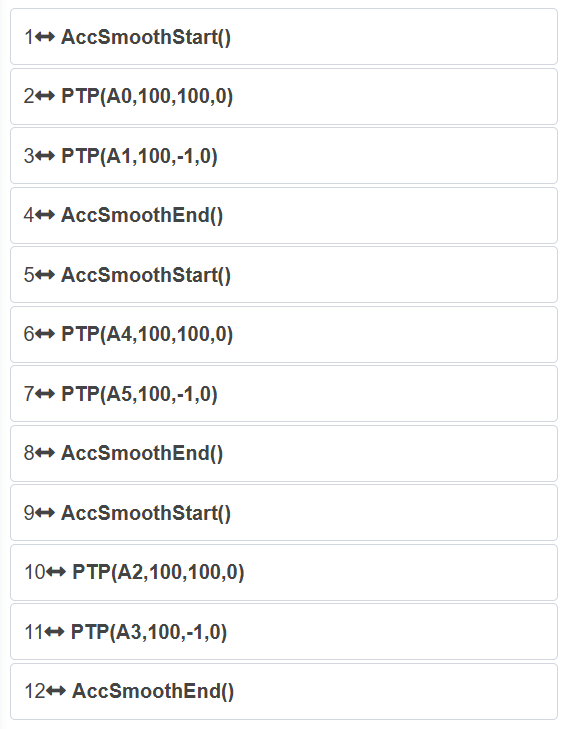

.. centered:: 图表 7.4-15 缩减模式

I/O
~~~~~~~~~~~~~~~~~~~~~~~~~~~~~~~~~~~~~~~~~~~~~~~~~~~
点击菜单栏“初始设置”->“安全”，点击“I/O”子菜单进入配置界面。

HMI提供对16路数字量输入和16路数字量输出的安全状态进行设置，可设置为有效或无效状态，当控制器判断到处于安全状态时，16路数字量输入和16路数字量输出被设置成安全状态。

.. image:: safety/022.png
   :width: 6in
   :align: center

.. centered:: 图表 7.4-16 I/O安全状态配置

在LA系统下：

“I/O安全”中提供DIO安全功能，安全功能为双路DI或者DO，当检测到安全DI信号或安全状态标志触发时，输出DO。

.. image:: safety/023.png
   :width: 6in
   :align: center

.. centered:: 图表 7.4-17 I/O安全功能配置

硬件
~~~~~~~~~~~~~~~~~~~~~~~~~~~~~~~~~~~~~~~~~~~~~~~~~~~

ServoJT功率检测（仅在QX系统下使用）
+++++++++++++++++++++++++++++++++++++++++++++++++++++++++++++++++++++++++++++++++++++++++++++++++++++++
点击菜单栏“初始设置”->“安全”，点击“功率检测”子菜单进入配置界面。

当直接作用于机器人的电流环（仅有指令servoJT），用于限制机器人做的功。检测到机器人速度和力矩的积分超过限值，即进行功率保护。

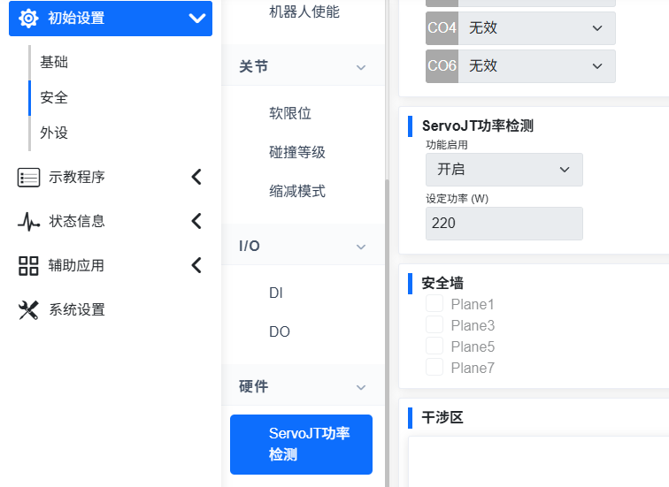

.. centered:: 图表 7.4-18 ServoJT功率检测

平面
~~~~~~~~~~~~~~~~~~~~~~~~~~~~~~~~~~~~~~~~~~~

安全墙
+++++++++++++++++++++++++++++++++++++++++++++++++++++++++++++++++++++++++++++++++++++++++++++++++++++++

点击菜单栏“初始设置”->“安全”，点击“安全墙配置”子菜单进入配置界面。

- 安全墙配置：点击启用按钮，可启用的相应的安全墙。当安全墙未配置安全范围时，会提示报错。点击右上角配置按钮，选择想要设定的安全墙，自动带出安全距离(可不设置，默认为0)，再点击“设置”按钮，设置成功。
- 安全墙参考点配置：选择安全墙后，可设置四个参考点。前三个点为平面参考点，用来确认设置的安全墙的平面。第四个点为安全范围参考点，用来确认设置的安全墙的安全范围。

若参考点设置成功，则亮绿灯。反之，则亮黄灯。直到参考点设置成功后转为绿灯。当四个参考点都设置成功后，可计算其安全范围，计算成功后安全范围参数点状态恢复默认。

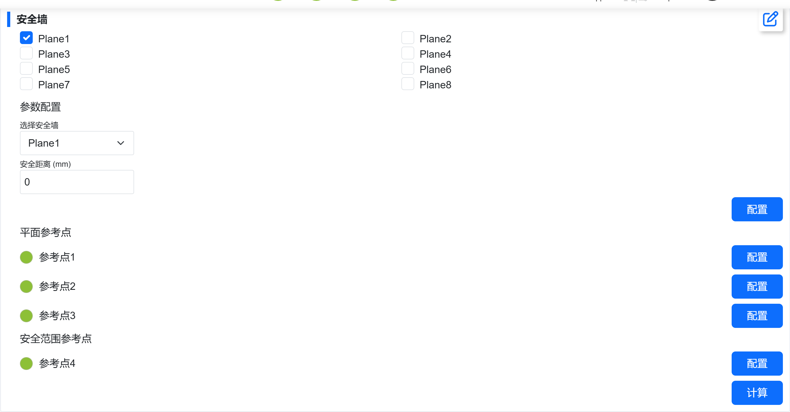

.. centered:: 图表 7.4-19 安全范围参考点设置

- 应用效果：启用配置成功的安全墙。拖动机器人，若机器人末端TCP处在设定安全范围内，则系统正常。若处在设定安全范围之外，则提示报错。

.. centered:: 图表 7.4-20 安全范围设置成功后效果图

干涉区
+++++++++++++++++++++++++++++++++++++++++++++++++++++++++++++++++++++++++++++++++++++++++++++++++++++++

在“初始设置”->“安全”->“干涉区”的菜单栏下，点击“单个”子菜单项进入干涉区配置功能界面。

我们需要对干涉方式和进入干涉区操作进行配置，干涉方式分为“轴干涉”和“立方体干涉”。

.. centered:: 图表 7.4-21 干涉区方式

点击干涉区图标，通过开关控制是否开启，点击右上角配置按钮进行参数配置。

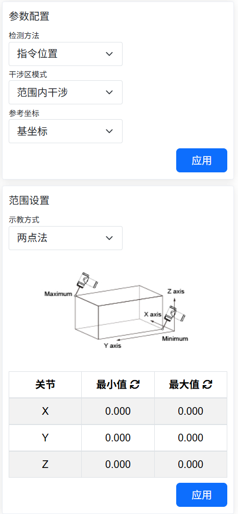

.. centered:: 图表 7.4-22 干涉区配置

首先进行干涉区运动配置“继续运动”或者“停止”。接下来设置进入干涉区拖动配置，用户可以根据需求设置拖动模式下进入干涉区后策略，不限制拖动，阻抗回调和切换回手动模式。

选择轴干涉，需要对轴干涉的参数进行配置，检测方法分为“指令位置”和“反馈位置”两种，干涉区模式分为“范围内干涉”和“范围外干涉”两种，接下来设置每个关节的范围以及各个关节范围是否使能，可以输入数值，也可以通过“最小值”和“最大值”后的“刷新图标”将当前机器人的位置记录到当中，最后点击配置即可。

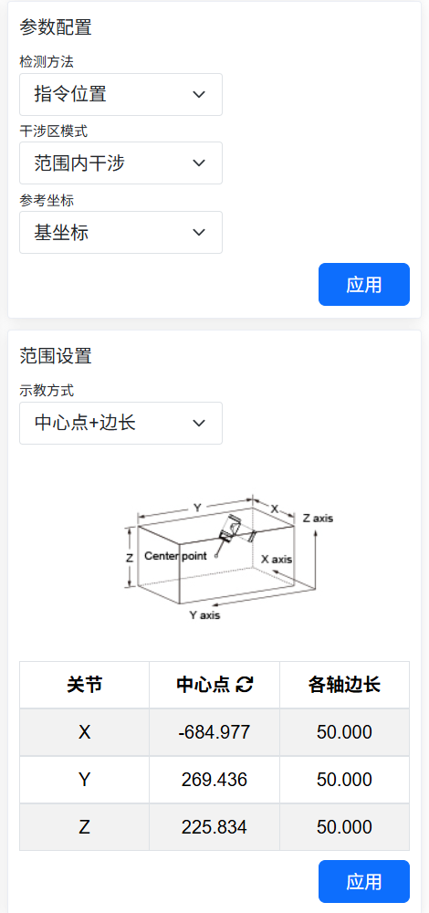

.. centered:: 图表 7.4-23 轴干涉配置

选择立方体干涉，需要对立方体干涉的参数进行配置，检测方法分为“指令位置”和“反馈位置”两种，干涉区模式分为“范围内干涉”和“范围外干涉”两种，参考坐标系分为“基坐标”和“工件坐标”，根据实际使用选择设置。接下来设进行范围设置，范围设置分为两种方法，首先看第一种方法“两点法”，即立方体的两个对角的顶点组成，我们可以通过输入或者机器人示教记录位置。最后点击应用即可。

.. image:: safety/030.png
   :width: 6in
   :align: center

.. centered:: 图表 7.4-24 立方体干涉配置

接下来看第二种方法“中心点+边长”，即立方体的中心位置点和立方体的边长构成干涉区，我们可以通过输入或者机器人示教记录位置。最后点击应用即可。

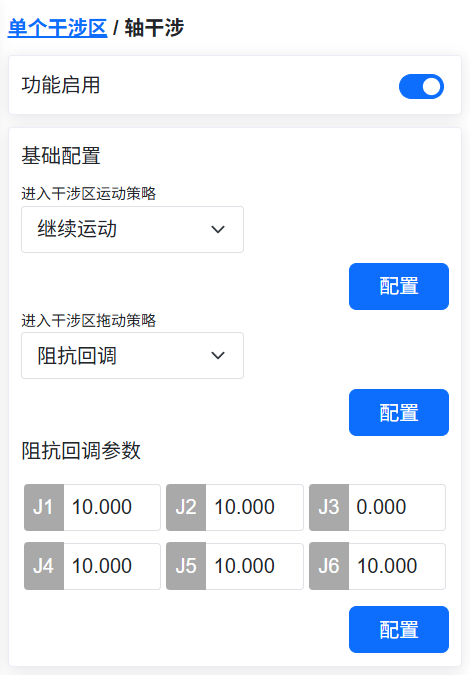

.. centered:: 图表 7.4-25 立方体干涉配置

附：夹爪等待阻塞指令
~~~~~~~~~~~~~~~~~~~~~~~~~~~~~~~~~~~~~~~~~~~~~~~~~~~~~~~~~~~~~~~~~~~~~~~~~~~~~

点击“示教程序”-“外设指令”-“夹爪”，新增等待夹爪运动到位指令，可阻塞夹紧动作结束后获取夹爪实际物理位置。

.. image:: safety/032.png
   :width: 4in
   :align: center

.. centered:: 图表 7.4-26 夹爪运动到位等待指令
 
- 夹爪状态：运动未完成，运动完成未检测到物体，运动完成检测到物体；
- 超时时间：单位ms，-1代表永远等待。
- 超时策略：可选择报错停止或继续运行。
- 夹爪类型：可选择平行夹爪或旋转夹爪。

.. note:: 
   注意：等待夹爪运动完成指令仅自定义协议适用；已适配设备暂不支持。

   也可直接使用GetGripperMotionDone()进行判断，输入参数夹爪类型，0平行夹爪，1旋转夹爪，返回值为夹爪错误和夹爪状态。其中夹爪错误为0无错误，其他存在错误，夹爪状态为0运动未完成，1运动完成未检测到物体，2运动完成检测到物体。等待夹爪运动完成和获取夹爪位置等指令示例程序如下：

.. image:: safety/033.png
   :width: 6in
   :align: center

.. centered:: 图表 7.4-27 夹爪运动示例程序

