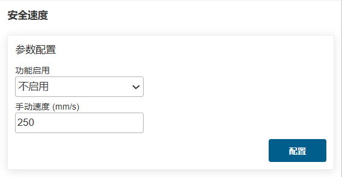
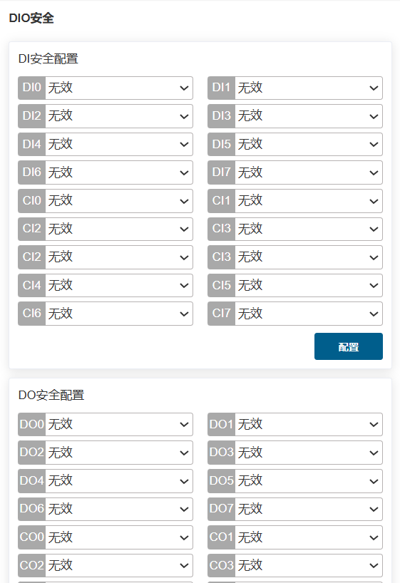
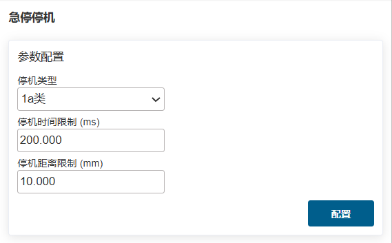
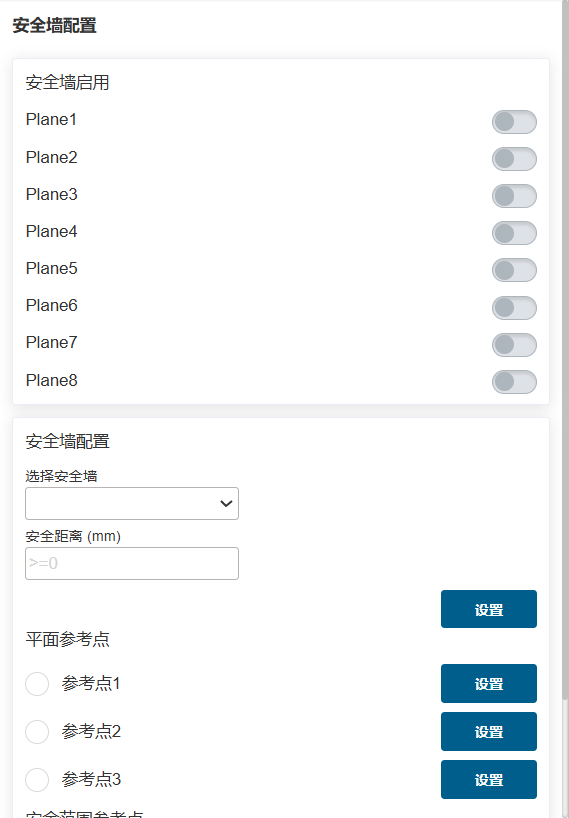
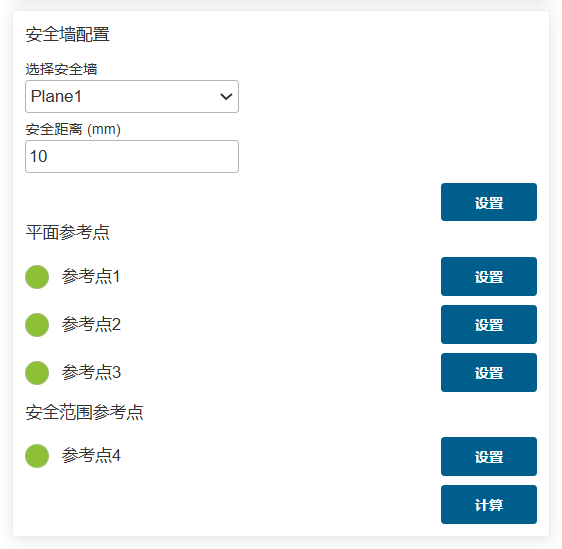
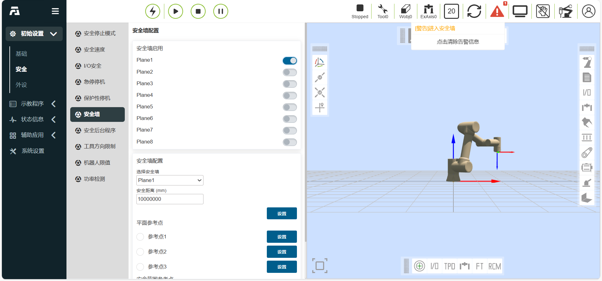
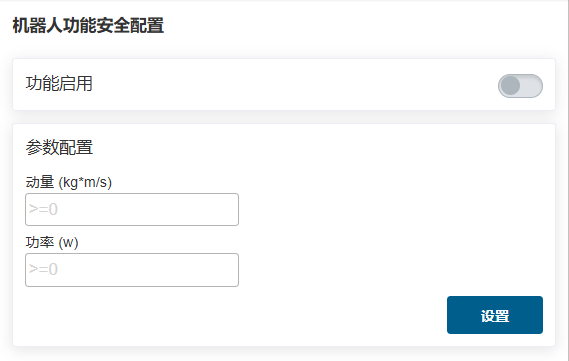

安全设置
===============

.. toctree:: 
   :maxdepth: 6

安全停止模式
----------------

点击菜单栏“初始设置——安全”，点击“安全停止模式”子菜单进入配置界面，设置安全停止模式参数功能。

.. centered:: 图表 7.1-1 安全停止模式配置

安全速度
----------------

点击菜单栏“初始设置——安全”，点击“安全速度”子菜单进入配置界面，设置安全速度。

.. note:: TCP手动速度小于250mm/s。

.. centered:: 图表 7.2-1 安全手动速度配置

I/O安全
----------------

点击菜单栏“初始设置——安全”，点击“I/O安全”子菜单进入配置界面。

HMI提供对16路数字量输入和16路数字量输出的安全状态进行设置，可设置为有效或无效状态，当控制器判断到处于安全状态时，16路数字量输入和16路数字量输出被设置成安全状态。

.. centered:: 图表 7.3-1 I/O安全状态配置

在Linux系统下：
    “I/O安全”中提供DIO安全功能，安全功能为双路DI或者DO，当检测到安全DI信号或安全状态标志触发时，输出DO。

.. centered:: 图表 7.3-2 I/O安全功能配置

急停停机
----------------

点击菜单栏“初始设置——安全”，点击“急停停机”子菜单进入配置界面。

急停停机类型0、1a、1b、2可设置、停机时间限值可设置、停止距离限值可设置。

- 通过控制器送控制箱板，急停停机类型0控制箱板直接断电；
  
- 急停停机类型1a为减速停机后，切断本体电源；
  
- 急停停机类型1b为减速停机后，不切断本体电源，本体去使能；

.. centered:: 图表 7.4-1 急停停机配置

保护性停机
----------------

点击菜单栏“初始设置——安全”，点击“保护性停机”子菜单进入配置界面。

保护性停机类型0、1、2，保护性停机类型0控制箱板直接断电，保护性停机类型1控制箱板先通知控制器控制机器人停住然后控制器反馈控制箱板断电，保护性停机类型2控制箱板通知控制器控制机器人停住。

.. centered:: 图表 7.5-1 保护性停机配置

.. important::
    安全数据状态标志和控制箱载板故障反馈通过Web端与控制器状态反馈中获取，当出现标志位为1时在WebAPP报警状态中提示安全数据状态异常。控制箱载板故障获取后的依据报错代码在WebAPP报警状态中展示具体报错信息。

.. centered:: 图表 7.5-2 WebAPP报警状态

安全墙配置
---------------

点击菜单栏“初始设置——安全”，点击“安全墙配置”子菜单进入配置界面。

-  **安全墙配置**：点击启用按钮，可启用的相应的安全墙。当安全墙未配置安全范围时，会提示报错。点击下拉框，选择想要设定的安全墙，自动带出安全距离(可不设置，默认为0)，再点击“设置”按钮，设置成功。
  

.. centered:: 图表 7.6-1 安全墙配置

-  **安全墙参考点配置**：选择安全墙后，可设置四个参考点。前三个点为平面参考点，用来确认设置的安全墙的平面。第四个点为安全范围参考点，用来确认设置的安全墙的安全范围。

.. important::
   若参考点设置成功，则亮绿灯。反之，则亮黄灯。直到参考点设置成功后转为绿灯。当四个参考点都设置成功后，可计算其安全范围，计算成功后安全范围参数点状态恢复默认。

.. centered:: 图表 7.6-2 安全范围参考点设置

-  应用效果：启用配置成功的安全墙。拖动机器人，若机器人末端TCP处在设定安全范围内，则系统正常。若处在设定安全范围之外，则提示报错。

.. centered:: 图表 7.6-3 安全范围设置成功后效果图

安全后台程序
---------------

点击菜单栏“初始设置——安全”，点击“安全后台程序”子菜单进入配置界面。

用户点击“功能启用”按钮打开或者关闭安全后台程序的设置。选择"意外情况 "和"后台程序"，点击“设置”按钮配置意外情况处理逻辑的参数。

启用安全后台程序并设置意外情况场景和后台程序，当用户开始运行程序，发生的意外情况场景与设置的意外情况匹配时，机器人会执行相对应的后台程序，起到安全防护的作用。

.. centered:: 图表 7.7-1 安全后台程序

工具方向限制（仅在Linux系统下使用）
---------------------------------------------

点击菜单栏“初始设置——安全”，点击“工具方向限制”子菜单进入配置界面。

工具方向限制是作用于机器人工具末端笛卡尔空间的用来限制机器人末端姿态运动范围的保护性功能，包括了功能启用设置，基准工具方向设定，最大偏移角设置。最大偏移角定义了工具末端笛卡尔坐标系Z轴与基准工具方向的最大夹角限制角度值，通常可理解为圆锥形空间。

.. centered:: 图表 7.8-1 工具方向限制

机器人限值（仅在Linux系统下使用）
---------------------------------------------

点击菜单栏“初始设置——安全”，点击“机器人限值”子菜单进入配置界面。

机器人限值包括动量和功率，其中动量限值用于限制机器人最大动量，功率限值用于限制机器人做的机械功。

.. centered:: 图表 7.9-1 机器人限值

功率检测（仅在QNX系统下使用）
---------------------------------------------

点击菜单栏“初始设置——安全”，点击“功率检测”子菜单进入配置界面。

当直接作用于机器人的电流环（仅有指令servoJT），用于限制机器人做的功。检测到机器人速度和力矩的积分超过限值，即进行功率保护。

.. centered:: 图表 7.10-1 功率检测
