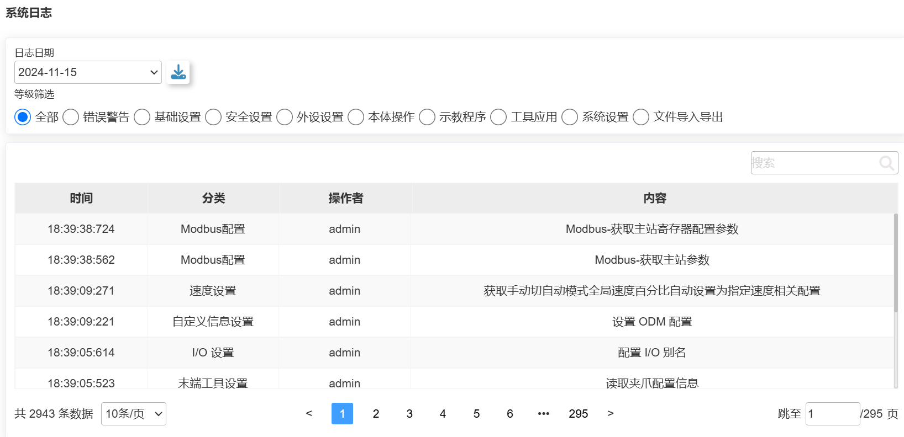
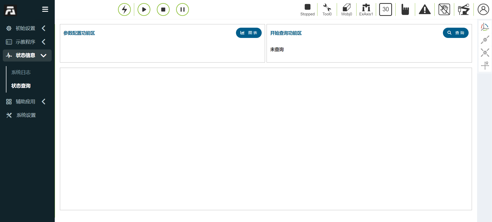
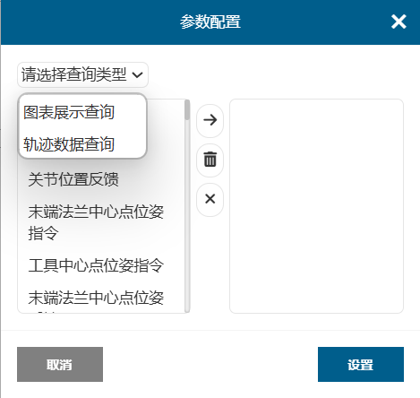

状态信息
===============

.. toctree:: 
   :maxdepth: 6

系统日志
----------

点击左侧菜单栏“状态信息”中“系统日志”按钮，进入日志显示界面。日志中记录着示教器的一些重要操作记录，如登录者、示教点增减等，点击进入后默认显示当天的日志记录，若要查询以前的记录，则在“日期选择”中选择目标日期，下方会实时显示当天日志记录，日志记录份数设置详见系统设置中。用户日志信息过多时，用户可以
根据类型去查找相关日志信息。

.. centered:: 图表 13.1‑1 系统日志界面

状态查询
----------

点击左侧菜单栏“状态信息”中“状态查询”菜单进入状态查询界面，如下图所示：

.. centered:: 图表 13.2‑1 状态查询

状态查询操作步骤：

**Step1**：点击“图表”按钮弹出图表设置弹出框如下图所示，查询类型选择图表展示查询，在图表设置中选择所需查询的参数以及参数放入的图表，点击“右移”按钮即可将参数配置到图表中。点击“设置”则下发设置图表指令。目前只能支持一张表格中最多包含四个待查参数并且最多设置一张图表；

.. centered:: 图表13.2‑1 图表设置

**Step2**：触发功能暂时不需要设置，点击“查询”按钮即可查询数据。
