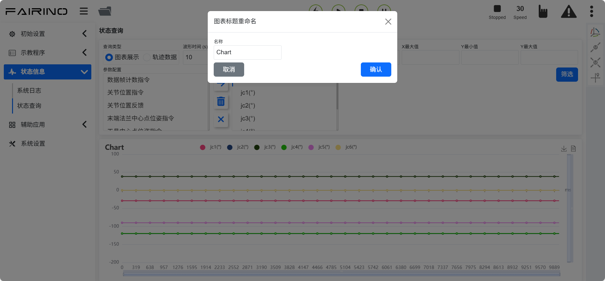

状态信息
===============

.. toctree:: 
   :maxdepth: 6

系统日志
----------

首次进入“状态信息一一系统日志”界面，默认展示当天全部类型的日志数据。

对日志数据进行等级区分，目前分为:全部、错误警告、基础设置、安全设置、外设设置、本体操作、示教程序、工具应用、系统设置和文件导入导出。

在数据表格右上角有搜索输入框,用户根据搜索需求，输入筛选内容进行筛选。界面如下:

.. image:: status/001.png
   :width: 6in
   :align: center

.. centered:: 图表 13.1‑1 系统日志界面

状态查询
----------

点击左侧菜单栏“状态信息”中“状态查询”菜单进入状态查询界面，查询类型分为“图表展示”和“轨迹数据”。如下图所示：

.. image:: status/002.png
   :width: 6in
   :align: center

.. centered:: 图表 13.2‑1 状态查询

.. note:: 
   .. image:: status/006.png
      :width: 0.75in
      :height: 0.75in
      :align: left

   名称：**查询按钮**
   
   作用：点击下发查询图表/轨迹数据的指令，代表未查询状态

.. note:: 
   .. image:: status/007.png
      :width: 0.75in
      :height: 0.75in
      :align: left

   名称：**右移按钮**
   
   作用：点击将左侧选中项添加到右侧的子项中

.. note:: 
   .. image:: status/008.png
      :width: 0.75in
      :height: 0.75in
      :align: left

   名称：**删除按钮**
   
   作用：点击删除右侧选中的子项

.. note:: 
   .. image:: status/009.png
      :width: 0.75in
      :height: 0.75in
      :align: left

   名称：**清空按钮**
   
   作用：点击清空右侧的所有子项

状态查询操作步骤：

**Step1**：点击查询类型单选按钮，在参数配置中左侧选择所需查询的参数，点击“右移”按钮即可将参数配置到右侧列表中。

.. important:: 
   目前参数配置只能支持添加最多四个待查参数。

.. image:: status/003.png
   :width: 6in
   :align: center

.. centered:: 图表13.2‑1 参数配置

**Step2**：点击“查询”按钮即可查询数据。

选择图表展示后，点击查询按钮，下方会根据参数配置实时显示折线图。如下图所示：

.. centered:: 图表13.2‑2 图表展示

选择轨迹数据后，查询过程中无折线图，点击停止查询按钮成功停止查询后，显示下载按钮。如下图所示：

.. image:: status/005.png
   :width: 6in
   :align: center

.. centered:: 图表13.2‑3 轨迹数据

.. important:: 
   查询过程中，切换进入其它界面需要确认是否停止查询。
