系统设置
===============

.. toctree:: 
   :maxdepth: 6

通用设置
-----------------

点击左侧菜单栏“系统设置”，点击二级菜单栏“通用设置”，进入通用设置界面。通用设置可以根据当前电脑时间更新机器人系统时间，以便记录日志内容时间准确。

网络设置可以设置控制器IP，子网掩码，默认网关，DNS服务器和示教器IP(使用我们的FR-HMI示教器情况下该IP有效，在使用FR-HMI示教器情况下需要配置示教器启用状态为启用)，方便客户使用场景。

- 系统目前自带有中文（汉语）、英语（English）、法语（français）、韩语（한국어）和日语（日本語）五种语言

- 语言包名称必须为：[语言代码].json，例如：es.json，其中语言代码为ISO 639-1标准
  
- 以下为语言对照表

.. list-table::
   :widths: 70 70 70 70
   :header-rows: 0
   :align: center

   * - **语言**
     - **当地语言名称**
     - **语言代码（ISO 639-1）**
     - **是否系统自带**

   * - 中文
     - 中文（汉语）
     - zh
     - 是

   * - 英语
     - English
     - en
     - 是

   * - 法语
     - français
     - fr
     - 是
   
   * - 日语
     - 日本語
     - ja 
     - 是

   * - 韩语
     - 한국어
     - ko
     - 是

用户可以对日志保留数进行设置和系统配置文件的导入导出，日志保留数最大为30，系统配置文件记录着该设置数值。

系统恢复下恢复出厂设置可以清除用户数据，使机器人恢复到出厂配置。

从站日志生成和控制器日志导出功能为下载控制器一些重要的状态或报错的记录文件，方便排查机器人问题。

网络设置
~~~~~~~~~~~~

.. centered:: 图表 15.1‑1 网络设置示意图

-  **设置网卡**：输入需要通信的网卡IP、子网掩码（与IP联动，自动填写）、默认网关、DNS服务器。网卡0网口出厂默认IP：192.168.57.2，网卡1网口出厂默认IP：192.168.58.2。

-  **示教器启用**：控制是否启用示教器。默认示教器关闭，无法使用示教器操作设备。点击滑动开关按钮，则启用示教器操作设备。
  
-  **访问IP**：选择WebAPP和WebRecovery关联的网卡，示教器启用时，WebAPP默认选择网卡1，网卡0不可选。
  
-  **设置网络**：点击“设置网络”按钮，提示正在配置中。配置完成后，需要重启设备。

账户设置
---------------

点击二级菜单栏账户设置，进入账户设置界面。账户管理功能仅限管理员可使用。功能分以下三个模块：

用户管理
~~~~~~~~~~~~

用户管理页面，用来保存用户信息，可以添加用户的工号、职能等。用户可通过输入用户列表中已有的用户名和密码进行登录操作。

.. centered:: 图表 15.2‑1 用户管理

-  **新增用户**：点击“新增”按钮，输入工号、姓名、密码并选择职能。

.. important::
   工号最大为10位整数型，工号和密码都有唯一性校验，且密码通过盲文显示。用户新增成功后，可以输入姓名和密码进行重新登录。
  
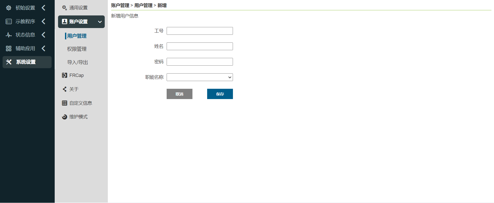

.. centered:: 图表 15.2‑2 新增管理
  
-  **编辑用户**：当存在用户列表时，点击右侧“编辑”按钮，工号和姓名无法修改，可修改密码和职能，密码同样需要唯一性校验。
  
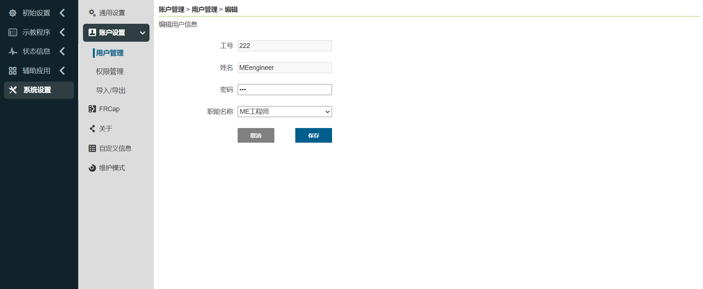

.. centered:: 图表 15.2‑3 编辑用户

-  **删除用户**：删除方法分为单条删除和批量删除。
  
  1. 点击列表右侧单条“删除”按钮，提示“请再次点击删除按钮以确认删除”，再次点击该列表删除成功。

  2. 点击左侧复选框，选择需要删除的用户，再点击列表上方批量“删除”按钮两次后删除。

.. important::
   初始用户111以及当前登录用户无法删除。

.. centered:: 图表 15.2‑4 删除用户

权限管理
~~~~~~~~~~~~

.. important:: 
   默认的职能数据（职能代号为1-6）不可以删除，不可修改职能代号，可以修改职能名称和职能描述以及设置职能的权限。

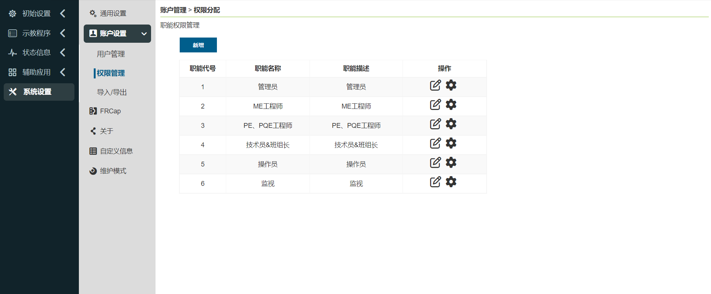

.. centered:: 图表 15.2‑5 权限管理

默认六个职能，管理员无功能限制，操作员和监视员少部分功能可以使用，ME工程师、PE&PQE工程师和技术员&班组长部分功能限制，管理员无功能限制，具体默认权限如下表所示：

.. important:: 
   默认权限可修改

.. centered:: 表格 15.2‑1 权限详情

-  **新增职能**：点击“新增”按钮，输入职能代号、职能名称和职能描述，点击"保存"按钮，成功后返回列表页面。其中职能代号只能为大于0的整数并且不能和已经存在的职能代号相同，输入项全部为必填。

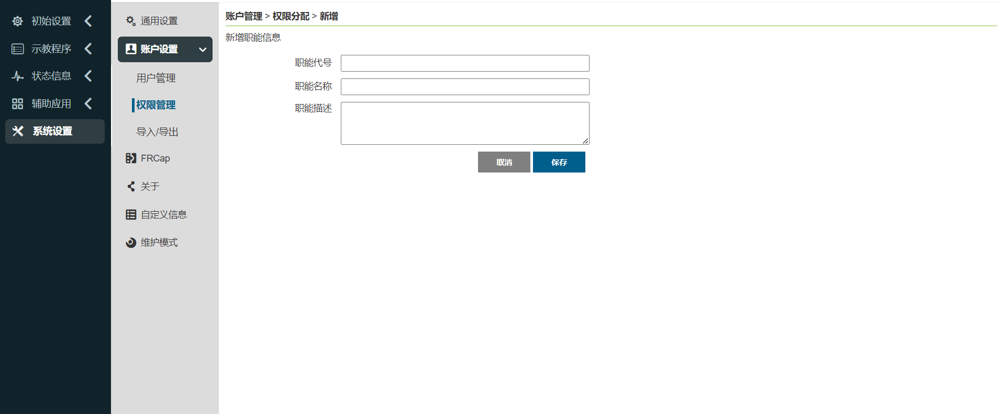

.. centered:: 图表 15.2‑6 新增职能

-  **编辑职能名称和描述**：点击表格操作栏中的“编辑”图标，可以修改当前职能的职能名称和职能描述，修改完成后点击下方"保存"按钮确认修改。

.. centered:: 图表 15.2‑7 编辑职能

-  **设置职能权限**：点击表格操作栏中的“设置”图标，可以设置当前职能的权限，设置完成后点击下方"保存"按钮确实设置。

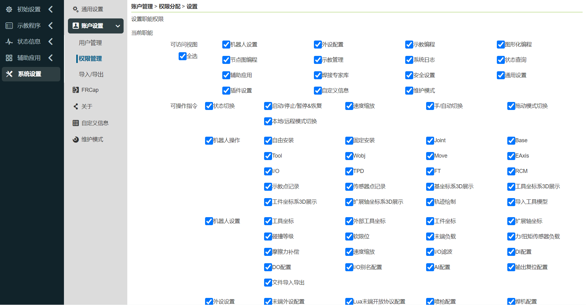

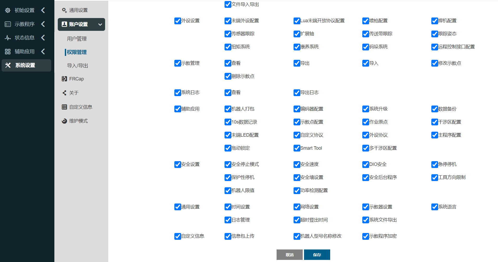

.. centered:: 图表 15.2‑8 设置职能权限

-  **删除职能**：点击表格操作栏中的“删除”图标，首先会校验当前职能是否有用户使用，没有用户使用则可以删除当前职能，反之不可以删除。

.. centered:: 图表 15.2‑9 删除职能

导入/导出
~~~~~~~~~~~~

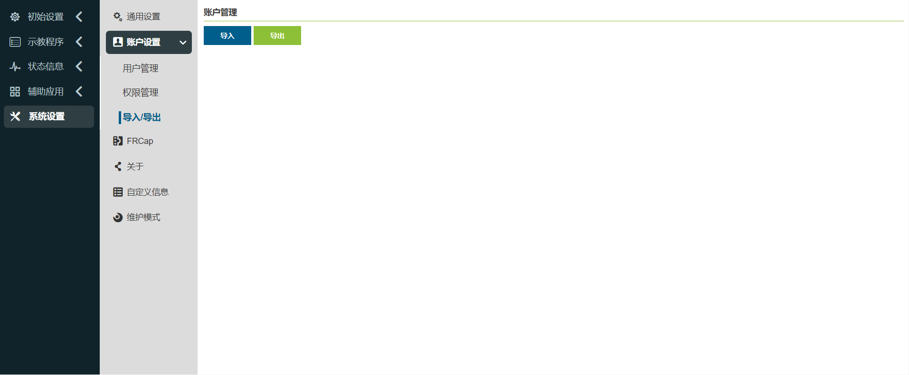

.. centered:: 图表 15.2‑10 账户设置导入/导出

-  **导入**：点击“导入”按钮，可以批量导入用户管理和权限管理的数据。

-  **导出**：点击“导出”按钮，可以批量导出用户管理和权限管理的数据。

关于
--------------

点击二级菜单栏关于，进入关于界面。该页面展示了机器人的型号和序列号，机器人运行使用的Web版本和控制箱版本，硬件版本和固件版本。

.. image:: system/014.png
   :width: 6in
   :align: center

.. centered:: 图表 15.3‑1 关于示意图

自定义信息
---------------

点击二级菜单栏自定义信息，进入自定义信息界面。自定义信息功能仅限管理员可使用。该页面可以上传用户信息包、自定义机器人型号和设置示教程序加密状态等操作。

.. centered:: 图表 15.4‑1 自定义信息示意图

参数范围配置
~~~~~~~~~~~~~~~~

参数范围配置，只有管理员可进行参数范围的调节，其他权限成员的参数只可在管理员设定的参数范围之内设定。

参数设定方式分为两种：滑块拖动和手动输入。

.. important::
   参数范围最大值必须大于最小值。参数范围配置成功3秒后，自动跳转到登录页，需重新登陆。

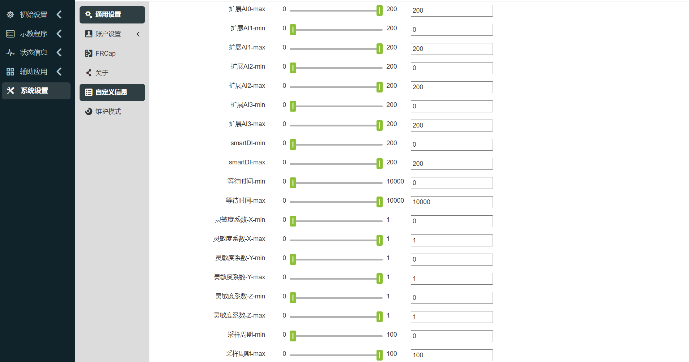

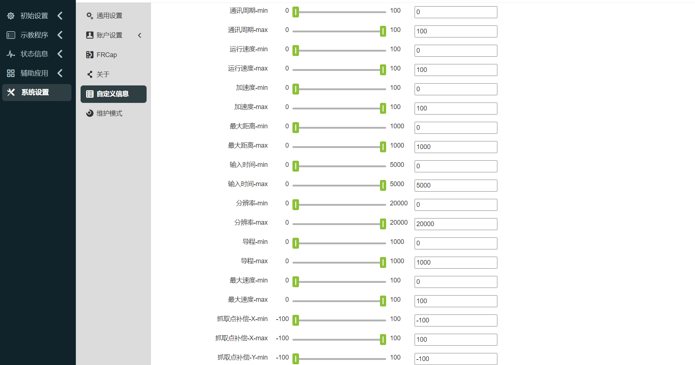

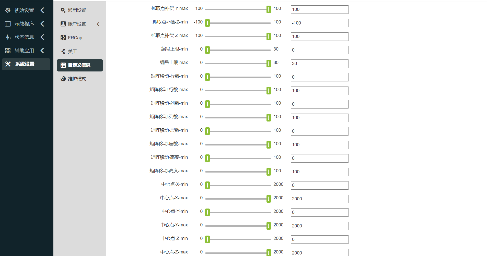

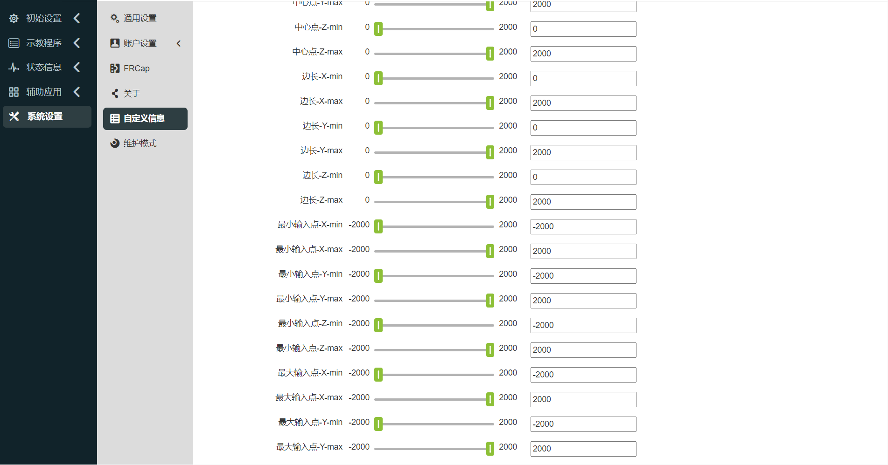

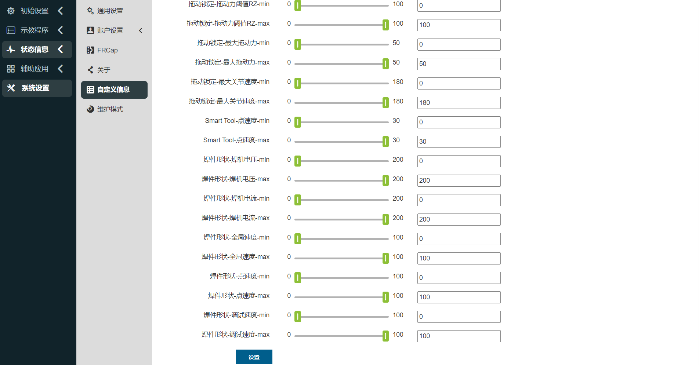

.. centered:: 图表 15.4‑2 参数范围配置示意图

WEB界面上锁
~~~~~~~~~~~~~~~~

1. 锁屏设置

在“自定义信息”中查看web界面锁屏设置，设置该功能是否开启。选择开启该功能时，选择使用期限，如果未选择则提示“使用期限不能为空”。

.. note:: 如果己开启锁屏功能，无法进行二次设置，同时无法更新系统时间。

选择使用期限后，点击“配置”按钮。

.. centered:: 图表 15.4‑3 WEB界面锁屏关闭设置

.. centered:: 图表 15.4‑4 WEB界面锁屏开启设置

2. 到期提示

当web界面锁屏功能开启时，登录界面后有如下提示：

1)设备到期前 5天，开机登录成功，弹窗提示使用期限剩余天数，复位可消除。

.. centered:: 图表 15.4‑5 开机提示

2)如设备持续工作中，设备到期前 5天，在零点时自动弹窗提示使用期限剩余天数，复位可消除。

.. centered:: 图表 15.4‑6 持续工作提示

3. 解锁登录

当web界面锁屏功能开启时，设备到期后，首次登录webApp直接进入锁屏界面。设备持续工作时，零点获取锁屏数据后自动登出，进入锁屏界面。此时输入解锁码后解锁进入登录界面，输入登录信息进行登录。

.. note:: 集成商操作生成加密的解锁码。
 

.. centered:: 图表 15.4‑7 锁屏界面  

机器人型号配置
-----------------

.. important:: 如果您需要修改机器人型号，请与我们技术工程师取得联系并在指导下进行。

登录协作机器人控制台Web后，在“系统设置”->“维护模式”->“控制器兼容”配置项中选择对应型号修改，机器人型号参考下方表格。

机器人型号表如下：

.. list-table::
   :widths: 70 70
   :header-rows: 0
   :align: center

   * - **数值**
     - **型号（主型号-主版本号-次版本号）**

   * - 0
     - 未配置

   * - 1
     - FR3-V1-000(V5.0)

   * - 2
     - FR3-V1-001(V6.0)

   * - ...
     - 预留

   * - 101
     - FR5-V1-000

   * - 102
     - FR5-V1-001(V5.0)

   * - 103
     - FR5-V1-002(V6.0)
     
   * - ...
     - 预留
   
   * - 201
     - FR10-V1-000(V5.0)

   * - 202
     - FR10-V1-001(V6.0)
     
   * - ...
     - 预留
   
   * - 301
     - FR16-V1-000(V5.0)

   * - 302
     - FR16-V1-001(V6.0)
     
   * - ...
     - 预留
   
   * - 401
     - FR20-V1-000(V5.0)

   * - 402
     - FR20-V1-001(V6.0)
     
   * - ...
     - 预留

   * - 501
     - ART3-V1-000
     
   * - ...
     - 预留

   * - 601
     - ART5-V1-000
     
   * - ...
     - 预留

   * - 802
     - FRCustom(8)-V1-001(FR5WM)
     
   * - ...
     - 预留

   * - 901
     - FRCustom(9)-V1-001(FR3MT)

   * - 902
     - FRCustom(9)-V1-001(FR10YD)
     
   * - ...
     - 预留

   * - 1001
     - FR30-V1-001(V6.0)
     
   * - ...
     - 预留

.. note:: 其中，主版本号预留10个（1-10），次版本号预留10个（1-10）。