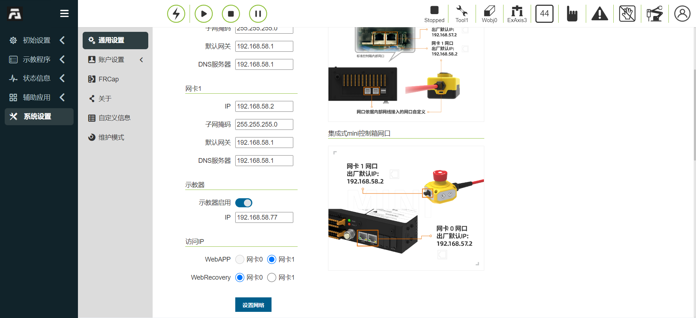

示教器
===============

.. toctree:: 
   :maxdepth: 6

示教器启用
-------------------

1. 控制箱连接示教器，并启动。

2. 登录账号admin，密码123。进入页面，点击系统设置-通用设置，确认示教器为启用状态。

.. centered:: 图表 16.1‑1 示教器启用状态

示教器多语言设置
--------------------

1. 在登录界面（或首次激活界面均可设置），在右上角进行语言选择。

.. image:: teach_pendant/002.png
   :width: 6in
   :align: center

.. centered:: 图表 16.2‑1 激活界面设置语言

.. image:: teach_pendant/003.png
   :width: 6in
   :align: center

.. centered:: 图表 16.2‑2 登录界面设置语言

2. 以登录界面设置多语言为例，选择语言。出现以下提示（对应不同语言）即为设置成功，重启控制箱完成语言设置。

.. image:: teach_pendant/004.png
   :width: 6in
   :align: center

.. centered:: 图表 16.2‑3 设置中文

.. centered:: 图表 16.2‑4 设置英文

输入法切换
++++++++++++++++++++++++++++

默认输入法为英文输入法。

1. 打开右下角软键盘，点击输入框，例如点击用户名输入框。

2. 切换中文拼音输入法。

点击两次CTRL键，按键状态变红色，点击空格进行选择输入法，以下为中文输入法。

.. image:: teach_pendant/006.png
   :width: 6in
   :align: center

.. centered:: 图表 16.2‑5 中文拼音输入法

3. 切换英文输入法

点击两次CTRL键，按键状态变红色，点击空格进行选择输入法，以下为英文输入法。

.. centered:: 图表 16.2‑6 英文输入法

登录成功后，系统会加载模型等数据，加载完毕后进入初始页面。