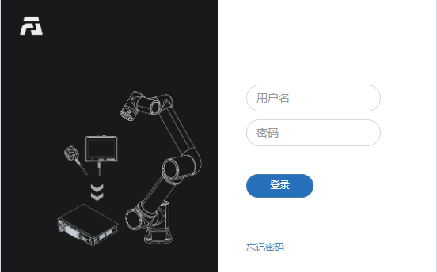
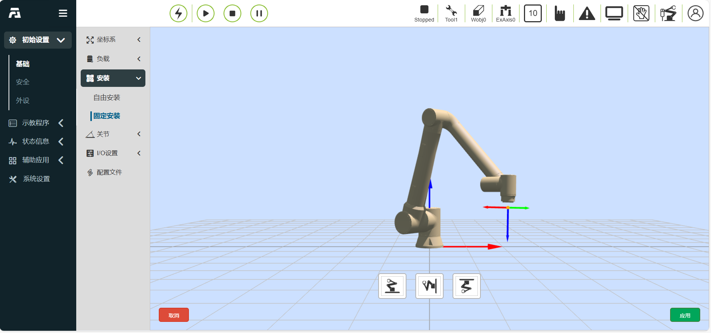
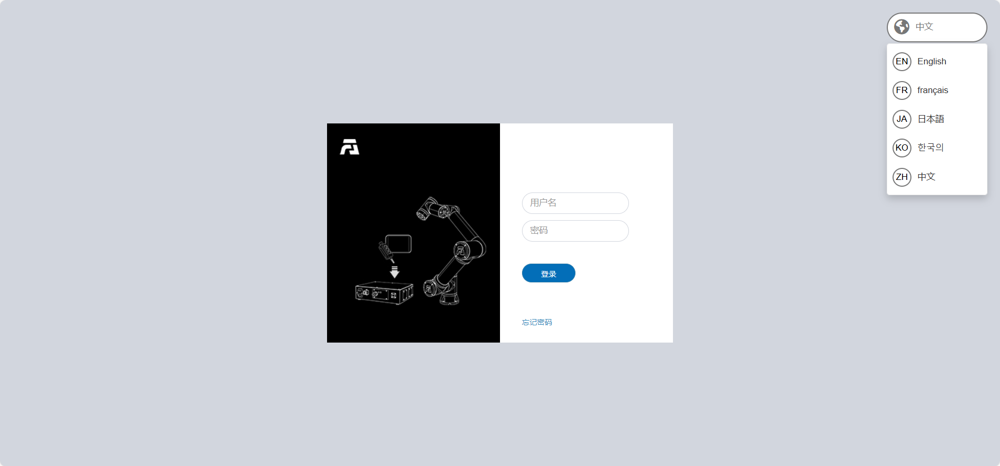

示教器软件基础功能
=========================

.. toctree:: 
   :maxdepth: 6

基础信息
-----------

系统简介
~~~~~~~~~~~

示教器软件是针对机器人开发的配套软件，运行于示教器操作系统中，其主要功能和技术特点如下：

-  能够对机器人进行示教程序的编写；
-  能够实时显示机器人位置坐标，三维模拟实体机器人，并能控制机器人运动；
-  能够实现对机器人的单轴点动以及各轴联动操作；
-  能够查看控制IO状态；
-  用户可以修改密码、查看系统信息等。

机器人首次激活
~~~~~~~~~~~~~~~

1. 开启控制箱并将网线连接PC。

2. PC打开浏览器访问目标网址192.168.58.2，机器人首次开机即进入激活页面。

.. figure:: teaching_pendant_software/334.png
   :width: 4in
   :align: center

.. centered:: 图表 5.1‑1 激活界面

3. 正确输入设备箱的SN码，输入完毕后点击“激活”按钮。
   
4. 系统将验证您的SN码。如果输入正确，将自动完成激活过程。

.. centered:: 图表 5.1‑2 激活成功界面

5. 激活成功，请手动重启控制箱。
   
6. 再次开机访问目标网址192.168.58.2即进入登录页面。

.. centered:: 图表 5.1‑3 登录界面

启动软件
~~~~~~~~~~~

1. 控制箱上电；
2. 示教器打开浏览器访问目标网址192.168.58.2；
3. 输入用户名和密码点击登录即可登录系统。

用户登录及权限更新
~~~~~~~~~~~~~~~~~~~~

.. centered:: 表格 5.1-1 初始用户

.. list-table::
   :widths: 70 70 70 70
   :header-rows: 0
   :align: center

   * - **工号**
     - **初始用户名**
     - **密码**
     - **职能代号**

   * - 111
     - admin
     - 123
     - 1

   * - 222
     - MEenginer
     - 222
     - 2

   * - 333
     - PEenginer
     - 333
     - 3
   
   * - 444
     - programmer
     - 444
     - 4
   
   * - 555
     - operator
     - 555
     - 5

   * - 666
     - monitor
     - 666
     - 6

用户（用户管理参考\ `4.10.2.1 用户管理 <#id128>`__\ ）默认分为六个等级，管理员无功能限制，操作员和监视员少部分功能可以使用，ME工程师、PE&PQE工程师和技术员&班组长部分功能限制，管理员无功能限制，具体默认职能代号权限参考\ `4.10.2.2 权限管理 <#id129>`__\ 。

登录界面如下图所示：

.. centered:: 图表 5.1‑4 登录界面

登录成功后，系统会加载模型等数据，加载完毕后进入初始页面。

系统初始界面
------------------

登录成功后系统进入“初始界面”，主要包含：

- 1、法奥LOGO；
- 2、菜单栏缩放按钮；
- 3、菜单栏；
- 4、机器人控制区
- 5、机器人状态区；
- 6、三维模拟机器人——三维场景操作；
- 7、三维模拟机器人——机器人本体操作；
- 8、机器人配套功能；
- 9、机器人各类状态。

如下图系统初始界面示意图所示：

.. image:: teaching_pendant_software/002.png
   :align: center
   :width: 6in

.. centered:: 图表 5.2‑1 系统初始界面示意图

控制区
~~~~~~~~~

.. note:: 
   .. image:: teaching_pendant_software/003.png
      :width: 0.75in
      :height: 0.75in
      :align: left

   名称：**使能按钮**
   
   作用：使能机器人

.. note:: 
   .. image:: teaching_pendant_software/004.png
      :width: 0.75in
      :height: 0.75in
      :align: left

   名称：**开始按钮**
   
   作用：上传并开始运行示教程序

.. note:: 
   .. image:: teaching_pendant_software/005.png
      :width: 0.75in
      :height: 0.75in
      :align: left

   名称：**停止按钮**
   
   作用：停止当前示教程序运行

.. note:: 
   .. image:: teaching_pendant_software/006.png
      :width: 0.75in
      :height: 0.75in
      :align: left

   名称：**暂停/恢复按钮**
   
   作用：暂停和恢复当前示教程序
   
.. important::
   暂停指令在程序的末尾，无法进行判断

状态栏
~~~~~~~~~~~~

.. note:: 
   .. image:: teaching_pendant_software/007.png
      :width: 0.75in
      :height: 0.75in
      :align: left

   名称：**机器人状态**
   
   作用：Stopped-停止，Running-运行，Pause-暂停，Drag-拖动

.. note:: 
   .. image:: teaching_pendant_software/008.png
      :width: 0.75in
      :height: 0.75in
      :align: left

   名称：**工具坐标系编号**
   
   作用：展示当前应用的工具坐标系编号

.. note:: 
   .. image:: teaching_pendant_software/449.png
      :width: 0.75in
      :height: 0.75in
      :align: left

   名称：**工件坐标系编号**
   
   作用：展示当前应用的工件坐标系编号
   
.. note:: 
   .. image:: teaching_pendant_software/450.png
      :width: 0.75in
      :height: 0.75in
      :align: left

   名称：**扩展轴坐标系编号**
   
   作用：展示当前应用的扩展轴坐标系编号
   
.. note:: 
   .. image:: teaching_pendant_software/009.png
      :width: 0.75in
      :height: 0.75in
      :align: left

   名称：**运行速度百分比**
   
   作用：机器人当前模式运行时速度

.. note:: 
   .. image:: teaching_pendant_software/010.png
      :width: 0.75in
      :height: 0.75in
      :align: left

   名称：**机器人运行正常状态**
   
   作用：当前机器人正常运行

.. note:: 
   .. image:: teaching_pendant_software/011.png
      :width: 0.75in
      :height: 0.75in
      :align: left

   名称：**机器人运行错误状态**
   
   作用：当前机器人运行有错误

.. note:: 
   .. image:: teaching_pendant_software/012.png
      :width: 0.75in
      :height: 0.75in
      :align: left

   名称：**自动模式**
   
   作用：机器人自动运行模式，开启手动切自动模式全局速度调整并指定速度时，全局速度会自动调整为指定速度

.. note:: 
   .. image:: teaching_pendant_software/013.png
      :width: 0.75in
      :height: 0.75in
      :align: left

   名称：**示教模式**
   
   作用：机器人示教运行模式

.. note:: 
   .. image:: teaching_pendant_software/014.png
      :width: 0.75in
      :height: 0.75in
      :align: left

   名称：**机器人拖动状态**
   
   作用：当前机器人可拖动

.. note:: 
   .. image:: teaching_pendant_software/015.png
      :width: 0.75in
      :height: 0.75in
      :align: left

   名称：**机器人拖动状态**
   
   作用：当前机器人不可拖动

.. note:: 
   .. image:: teaching_pendant_software/017.png
      :width: 0.75in
      :height: 0.75in
      :align: left

   名称：**连接状态**
   
   作用：机器人已连接

.. note:: 
   .. image:: teaching_pendant_software/016.png
      :width: 0.75in
      :height: 0.75in
      :align: left

   名称：**未连接状态**
   
   作用：机器人未连接

.. note:: 
   .. image:: teaching_pendant_software/018.png
      :width: 0.75in
      :height: 0.75in
      :align: left

   名称：**账户信息**
   
   作用：显示用户名和权限及登出用户

菜单栏
~~~~~~~~~~~~

菜单栏如下表格：

.. centered:: 表格 5.2‑1 示教器菜单分栏

+----------+------------+
|   一级   |    二级    |
+==========+============+
| 初始设置 | 基础       |
+          +------------+
|          | 安全       |
+          +------------+
|          | 外设       |
+----------+------------+
| 示教程序 | 程序编程   |
+          +------------+
|          | 图形化编程 |
+          +------------+
|          | 节点图编程 |
+          +------------+
|          | 示教点     |
+----------+------------+
| 状态信息 | 系统日志   |
+          +------------+
|          | 状态查询   |
+----------+------------+
| 辅助应用 | 工具应用   |
+          +------------+
|          | 焊接专家库 |
+----------+------------+
| 系统设置 | /          |
+----------+------------+

三维模拟机器人
----------------

三维虚拟轨迹和导入工具模型
~~~~~~~~~~~~~~~~~~~~~~~~~~~

.. note:: 
   .. image:: teaching_pendant_software/020.png
      :width: 0.75in
      :height: 0.75in
      :align: left

   名称：**轨迹绘制**
   
   说明：点击按钮，打开轨迹绘制功能。运行示教程序时，机器人三维模型会描绘机器人运动的轨迹路线。

.. note:: 
   .. image:: teaching_pendant_software/451.png
      :width: 0.75in
      :height: 0.75in
      :align: left

   名称：**导入工具模型**
   
   说明：点击按钮，弹出导入工具模型模态窗，上传文件导入成功后即可在机器人末端进行工具模型展示，目前支持的工具模型文件格式有STL和DAE。

机器人坐标系系统三维可视化展示
~~~~~~~~~~~~~~~~~~~~~~~~~~~~~~~

在WebAPP机器人三维虚拟区域中创建各类三维虚拟坐标系，以基坐标系展示为例，如下图所示。其中X轴红色，Y轴绿色，Z轴蓝色。

.. note:: 
   .. image:: teaching_pendant_software/021.png
      :width: 0.75in
      :height: 0.75in
      :align: left

   名称：**基坐标系**
   
   说明：基坐标系WebAPP中系统机器人三维虚拟区域中进行默认开启展示，固定标记在机器人基座底部中心。三维虚拟基坐标系可进行手动关闭展示。

.. note:: 
   .. image:: teaching_pendant_software/022.png
      :width: 0.75in
      :height: 0.75in
      :align: left

   名称：**工具坐标系**
   
   说明：工具坐标系默认开启展示，可手动关闭。在WebAPP启动并且用户登录成功后，获取当前应用的工具坐标系名称和对应参数数据，初始化当前工具坐标系。

.. important::
   使用的过程中应用其他工具坐标系时，当应用工具坐标系指令成功后，先将机器人三维虚拟区域中已有的工具坐标系清除，再将新应用的工具坐标系参数数据传入三维坐标系生成API进行工具坐标系生成，生成后完成在机器人三维虚拟区域中进行对应展示。

.. note:: 
   .. image:: teaching_pendant_software/023.png
      :width: 0.75in
      :height: 0.75in
      :align: left

   名称：**工件坐标系**
   
   说明：工件坐标系默认关闭，可以进行手动开启展示。流程与工具坐标系一致。

.. note:: 
   .. image:: teaching_pendant_software/024.png
      :width: 0.75in
      :height: 0.75in
      :align: left

   名称：**外部轴坐标系**
   
   说明：外部轴坐标系默认关闭，可以进行手动开启展示。流程与工具坐标系一致。

机器人安装方式设置和展示
~~~~~~~~~~~~~~~~~~~~~~~~~~~

机器人默认安装方式为水平安装，当机器人安装方式更改时，需及时在“初始设置——基础——安装”菜单下设置机器人的实际安装方式，以保证机器人正常工作。

用户点击“初始设置——基础——安装”菜单下的“固定安装”选项，进入机器人固定安装方式设置页面，选择“正装”、“倒装”或者“侧装”，点击“应用”按钮完成机器人安装方式设置。

.. centered:: 图表 5.3‑1 固定安装

考虑到更加灵活丰富的机器人部署场景，我们提供了自由安装功能，用户点击“初始设置——基础——安装”菜单下的中的“自由安装”选项卡，进入机器人自由安装方式设置页面。手动调整“基座倾斜”和“基座旋转”角度，三维模型会对应展示安装效果。修改后点击“应用”按钮即可完成机器人安装方式设置。

.. image:: teaching_pendant_software/026.png
   :width: 6in
   :align: center
   
.. centered:: 图表 5.3‑2 360度自由安装

.. important:: 
   机器人安装完成后，必须正确设置机器人的安装方式，否则会影响机器人的拖动功能以及碰撞检测功能使用。

机器人操作
------------

示教点记录
~~~~~~~~~~~~~~

手动示教控制区主要是在示教模式中对考坐标系进行设定，并实时显示机器人各轴角度与坐标值，并可对示教点进行命名保存。

保存示教点时，该示教点的坐标系为当前机器人应用的坐标系。在该操作区上方可以对示教点速度，加速度设置，设置数值为机器人标准速度百分比，若设置100，即标准速度的百分之百（标准速度请翻阅\ `表1.1-1 机器人基本参数 <robot_brief_introduction.html#id2>`__\）。

传感器示教点，选择已经标定的传感器类型工具，输入点名称，点击添加，保存的点的位置为传感器识别到点的位置。

.. image:: teaching_pendant_software/059.png
   :width: 3in
   :align: center

.. centered:: 图表 4.6‑1 手动操作区示意图

.. important:: 
   第一次使用时，请设置30这样较小的速度值，熟悉机器人运动，以免发生意外情况。

Joint运动
~~~~~~~~~~~

Joint运作下，中间的6个滑块条分别表示对应轴的角度，joint运动分单轴点动和多轴联动

**单轴点动**：用户可通过操作左右两边圆形按钮来控制机器人运动，如图表3.6-2。在手动模式和关节坐标系下，对机器人某一关节进行转动操作。当机器人超出运动范围（软限位）而停止时，可以利用单轴点动进行手动操作，将机器人移出超限位置。单轴点动在进行粗略定位和较大幅度移动时，会比其他操作模式更快捷方便。

设置“长按运动阈值”（长按按钮时，机器人运行的最大距离，输入值得范围0~300）参数，长按圆形按钮控制机器人运行，若在机器人运行中松开按钮，机器人会立即停止运动，若一直按住不松开按钮，机器人会运行长按运动阈值所设置的值后停止运动。

**多轴联动**：用户可操作中间六个滑块来调整机器人相应的目标位置，如图表3.6-3，可通过观察三维虚拟机器人来确定目标位置，若调整的位置不符合自己的预期，点击“还原”按钮，使得三维虚拟机器人回到初始的位置。当用户确定目标位置后，可点击“应用”按钮，实体机器人便会进行相应的运动。

.. image:: teaching_pendant_software/060.png
   :width: 3in
   :align: center

.. centered:: 图表 4.6‑2 单轴点动和多轴联动示意图

.. important:: 
   多轴联动中，第5个关节j5的设置值不能小于0.01度，若期望值小于0.01度，则可以先设置为0.011度，然后通过单轴点动微调第5个关节j5。

Base点动
~~~~~~~~~~

在基坐标系下，可以操作左右两边圆形按钮控制机器人，在X，Y，Z轴上直线移动或绕着RX，RY，RZ旋转，中间的6个滑块条分别表示在对应坐标轴上的位置与运动范围，如图表3.6-3。Base点动的功能与Joint运动中单轴点动的功能相似。

.. image:: teaching_pendant_software/061.png
   :width: 3in
   :align: center

.. centered:: 图表 4.6‑3 Base点动示意图

.. important:: 
   可随时释放该按钮，使机器人停止运动。在必要情况下，按急停按钮使机器人停止。

Tool点动
~~~~~~~~~~

选择工具坐标系，可以操作左右两边圆形按钮控制机器人，在X，Y，Z轴上直线移动或绕着RX，RY，RZ旋转，中间的6个滑块条分别表示在对应坐标轴上的位置与运动范围，如图表3.6-4。Tool点动的功能与Joint运动中单轴点动的功能相似。

.. image:: teaching_pendant_software/062.png
   :width: 3in
   :align: center

.. centered:: 图表 4.6‑4 Tool点动示意图

Wobj点动
~~~~~~~~~~

选择工件点动，可以操作左右两边圆形按钮控制机器人，在工件坐标系下，沿着X，Y，Z轴上直线移动或绕着RX，RY，RZ旋转，中间的6个滑块条分别表示在对应坐标轴上的位置与运动范围，如图表3.6-5。Wobj点动的功能与Joint运动中单轴点动的功能相似。

.. centered:: 图表 4.6‑5 Wobj点动示意图

Move移动
~~~~~~~~~~

选择Move移动，可以直接输入笛卡尔坐标值，点击“计算关节位置”，关节位置显示为计算后结果，确认无危险，可以点击“移至该点”控制机器人运动至输入的笛卡尔位姿。

.. image:: teaching_pendant_software/064.png
   :width: 3in
   :align: center

.. centered:: 图表 4.6‑6 Move移动示意图

.. important:: 
   当出现给定位姿无法到达时，首先检查笛卡尔空间位姿是否超过机器人工作范围，然后检查当前位姿到目标位姿过程中是否存在奇异位姿，若存在奇异位置则调整下当前姿态或过程中插入一个新的位姿以避开奇异位姿。

Eaxis移动
~~~~~~~~~~~~

选择Eaxis移动，该功能为扩展轴的点动功能，需要在配置好扩展轴的前提下，使用该点动功能控制扩展轴，详见“第四章机-器人外设-扩展轴外设配置”。

.. centered:: 图表 4.6‑7 Eaxis移动示意图

TPD（示教编程）
~~~~~~~~~~~~~~~~~

示教编程（TPD）功能操作步骤如下：

- **Step1记录初始位置**：进入三维模型左侧操作区，记录机器人当前位置。在编辑框内设定好点的名称，点击“保存”按钮，若保存成功，则提示“保存点成功”；

- **Step2配置轨迹记录参数**：点击TPD进入“TPD”功能项配置轨迹记录参数，设定好轨迹文件的名称、位姿类型以及采样周期，配置DI和DO，可以在记录TPD轨迹的过程中，通过触发DI来记录对应需要输出的DO，如图表3.6-8；

.. image:: teaching_pendant_software/066.png
   :width: 3in
   :align: center

.. centered:: 图表 4.6‑8 TPD轨迹记录

- **Step3检查机器人模式**：检查机器人模式是否处于手动模式下，若不处于则切换至手动模式，在手动模式下可通过两种方式切换到托动示教模式，一种是长按末端按钮，一种是界面拖动模式切换按键，在TPD记录是推荐从界面切换机器人进入托动示教模式。如图表3.6-9所示；

.. image:: teaching_pendant_software/067.png
   :width: 3in
   :align: center

.. centered:: 图表 4.6‑9 机器人模式

.. important:: 
   从界面切入拖动模式时，先确认末端工具负载以及质心是否设置正确、摩檫力补偿系数是否设置合理，然后通过长按末端按钮确认拖动是否正常，确认无误后从界面切入拖动模式。

- **Step4开始记录**：点击“开始记录”按钮开始轨迹记录，拖动机器人进行动作示教。此外，末端DI配置中有“TPD记录启动/停止”功能配置项，通过配置此功能，用户可以通过外部信号触发“开始记录”轨迹功能，需要注意的是，通过外部信号开始记录轨迹，首先得在页面先进行TPD轨迹的信息配置。

- **Step5停止记录**：动作示教完成后，点击“停止记录”按钮，停止轨迹记录，然后通过拖动示教切换按键使机器人退出拖动示教模式。示教器接收到“停止轨迹记录成功”即表示轨迹记录成功。同步骤4，在配置“TPD记录启动/停止”功能后，可以通过外部信号触发停止记录。

- **Step6示教编程**：点击新建，选择空白模板，点击进入PTP功能编程项，选择刚保存的初始位置点，点击“添加”按钮，应用完成后，在程序文件中会显示一条PTP指令；然后点击进入TPD功能编程项，选择刚刚记录的轨迹，设定是否平滑以及速度缩放比例，点击“添加”按钮，应用完成后，在程序文件中会显示一条MoveTPD指令，如图表3.6-10所示；

.. image:: teaching_pendant_software/068.png
   :width: 6in
   :align: center

.. centered:: 图表 4.6‑10 TPD编程

- **Step7轨迹复现**：示教程序编辑完成后，切换至自动运行模式，点击界面上方”开始运行”图标开始运行程序，机器人开始复现示教的动作。

- **Step8轨迹编辑**：TPD轨迹编辑区可对轨迹可视化展示和编辑裁切，以达到TPD轨迹预分析和精简。选择对应轨迹获取点，那么用户记录的轨迹点会展示在机器人三维空间内，其次用户可以拖动“Start”和“End”滚动条对轨迹的起点和终点进行模拟复现和剪辑。

TPD文件删除与异常处理：

- **轨迹文件删除**：点击进入TPD功能项，选择需要删除的轨迹文件，点击”删除轨迹”按钮，若删除成功，则会收到删除成功提示。

- **异常处理：**

  +  **指令点数超限**：一条轨迹最多可记录2万个点数，当超过2万个点时，控制器不再记录超过的点数，并向示教器发出“指令点数超限”告警提示，此时需点击停止记录；

  +  **TPD指令间隔过大**：若示教器报错TPD指令间隔过大，则应检查机器人是否回到了记录前的初始位置，若机器人回到了初始位置依然报错TPD指令间隔过大，则删除当前轨迹重新记录一条新的轨迹；

  +  TPD操作过程中若出现其他异常情况，则应通过示教器或急停按钮立即停止机器人操作，检查原因。

.. important:: 
   TPD功能操作过程中应严格按照示教器上相应的提示进行操作。

状态信息
----------

系统日志
~~~~~~~~~~~

点击左侧菜单栏“状态信息”中“系统日志”按钮，进入日志显示界面。日志中记录着示教器的一些重要操作记录，如登录者、示教点增减等，点击进入后默认显示当天的日志记录，若要查询以前的记录，则在“日期选择”中选择目标日期，下方会实时显示当天日志记录，日志记录份数设置详见系统设置中。用户日志信息过多时，用户可以
根据类型去查找相关日志信息。

.. image:: teaching_pendant_software/141.png
   :width: 6in
   :align: center

.. centered:: 图表 4.8‑1 系统日志界面

状态查询
~~~~~~~~~~~~~

点击左侧菜单栏“状态信息”中“状态查询”菜单进入状态查询界面，如图表 4.8‑2状态查询。

.. image:: teaching_pendant_software/142.png
   :width: 6in
   :align: center

.. centered:: 图表 4.8‑2 状态查询

状态查询操作步骤：

**Step1**：点击“图表”按钮弹出图表设置弹出框如图表3.8‑3图表设置所示，查询类型选择图表展示查询，在图表设置中选择所需查询的参数以及参数放入的图表，点击“右移”按钮即可将参数配置到图表中。点击“设置”则下发设置图表指令。目前只能支持一张表格中最多包含四个待查参数并且最多设置一张图表；

.. centered:: 图表 4.8‑3图表设置

**Step2**：触发功能暂时不需要设置，点击“查询”按钮即可查询数据。

辅助应用
----------

.. 机器人校正
.. ~~~~~~~~~~~~

.. 在“辅助应用”中的“机器人本体”的菜单栏下，点击“机器人校正”，进入机器人校正界面，此功能主要是对机器人进行零点位置校正。点击“去使能”按钮，拖动机器人各轴，移动到机器人到机械上的零点位置，点击“零点设定”按钮，设定机器人零点。

.. .. image:: teaching_pendant_software/144.png
..    :width: 3in
..    :align: center

.. .. centered:: 图表 4.9‑1 机器人校正示意图

.. **零点设定**：机器人出厂时会预设一个初始姿态，在该姿态下各个关节的角度为0。零点设定时机器人各关节运动到特定位置时所对应的机器人姿态。零点是机器人坐标系的基准，没有零点，机器人就无法判断自身的位置，所以为了获得尽可能高的绝对定位精度，就需要对机器人进行零点标定。

.. 一般在以下情况下，需要对机器人进行零点标定：

.. -  更换机器人机械系统零部件后；

.. -  与工件或者环境发生剧烈碰撞后；

.. -  建立坐标系等操作与实际位置相差较大时；

.. -  整个系统重新安装后；

.. -  编码器电池更换之后；

.. -  长途运输搬运机器人之后。

..    在机器人出厂时零点会设置好，如需再次设定零点，请联系我们提供技术支持。

机器人打包
~~~~~~~~~~~
在“辅助应用”中的“机器人本体”的菜单栏下，点击“机器人打包”按钮，进入机器人一键打包界面。

.. important:: 
   在操作打包功能之前，请先确认机器人周围环境和状态，防止发生碰撞。
   
   若出厂，则出厂前先进去系统设置-通用设置，进行恢复出厂设置。

**Step1**：在移至打包点前先将机器人移至零点

**Step2**：点击“移至零点”按钮，确认机器人机械零点正确，各关节如图中橙色圆圈位置缺口对齐。

**Step3**：点击“移至打包点”按钮，机器人按照包装工艺各轴角度运行至打包点。

.. image:: teaching_pendant_software/220.png
   :width: 3in
   :align: center

.. centered:: 图表 4.9‑1 机器人一键打包

系统升级
~~~~~~~~~~~

在“辅助应用”中的“机器人本体”的菜单栏下，点击“系统升级”按钮，进入系统升级界面。系统升级分为软件升级、驱动器升级和系统关机。

**软件升级**：在软件升级下点击“上传文件”，选择U盘中的software.tar.gz升级包，点击上传升级包，升级按钮旁显示“上传中…上传百分比”。
待后台文件下载完成，界面显示“上传完成，正在升级中”，进行文件MD5和版本号检测，通过后，解密解压升级文件，并提示"升级成功，请重新启动控制箱！"，如果其中检测，解压或发生其他错误，升级按钮旁显示“升级失败”。

.. centered:: 图表 4.9‑2 系统升级

.. important:: 
   软件升级包名为确定的software.tar.gz，如果升级包名与之不一致，那么会出现升级失败，修改为确定的升级包名称即可。
 
**固件升级**：机器人进入BOOT模式后，上传升级压缩包，选择需要升级的从站（控制箱从站，本体驱动器从站1~6，末端从站），进行升级操作，并显示升级状态。

.. image:: teaching_pendant_software/146.png
   :width: 3in
   :align: center

.. centered:: 图表 4.9‑3 固件升级

**从站配置文件升级**：机器人去使能后，上传升级文件，选择需要升级的从站（控制箱从站，本体驱动器从站1~6，末端从站），进行升级操作，并显示升级状态。

.. centered:: 图表 4.9‑4 从站配置文件升级

数据备份
~~~~~~~~~~

在“辅助应用”中的“机器人本体”的菜单栏下，点击 “数据备份”进入数据备份界面，如3.9-5所示。

备份包数据中包含工具坐标系数据，系统配置文件，示教点数据，用户程序，模板程序和用户配置文件，当用户需要将本机器人相关数据移到另一台机器人上使用时，可通过此功能快速实现。

.. image:: teaching_pendant_software/148.png
   :width: 3in
   :align: center

.. centered:: 图表 4.9‑5数据备份界面

10s数据记录
~~~~~~~~~~~~~~

在“辅助应用”中的“机器人本体”的菜单栏下，点击“10s数据记录”进入10s数据记录功能界面。

首先选择记录类型，分为默认参数记录和自选参数记录，默认参数记录为系统自动设置记录的数据，自选参数记录用户可自行选择需要记录的参数数据，参数个数最多为15个。选定参数列表后，选择记录参数，点击“右移”按钮即可将参数配置到参数列表中。点击“开始记录”机器人开始记录数据，点击“停止记录”机器人停止记录数，点击“下载数据”可下载最后10s的数据。

.. image:: teaching_pendant_software/149.png
   :width: 3in
   :align: center

.. centered:: 图表 4.9‑6 10s数据记录

示教点配置
~~~~~~~~~~~~~

在“辅助应用”中的“机器人本体”的菜单栏下，点击“示教点配置”进入示教点配置功能界面。

用户在使用按钮盒或其它IO信号记录示教点功能前，首先对示教点名称前缀，编号上限和示教方法进行配置，名称前缀支持自定义前缀和以当前程序名作为前缀两种模式。例如，自定义名称前缀“P”，编号上限“3”，示教方法“机器人示教”，记录机器人当前末端（工具）点依次为：P1、P2、P3，再次记录将覆盖之前记录点。

.. centered:: 图表 4.9‑7 示教点配置

矩阵移动
~~~~~~~~~~~~

在“辅助应用”中的“机器人本体”的菜单栏下，点击“矩阵移动”进入矩阵移动配置功能界面。

此功能通过设定三点坐标及行列层和层高等数值，来控制机器手规则移动，适用于常见的码垛应用。第一步选择机器人运动方式，“PTP”或者“Line”，第二步设定机器人运动路径，“头到尾走法”或“弓字形走法”，第三步设定堆叠方式，“堆垛”或“卸垛”。

.. image:: teaching_pendant_software/151.png
   :width: 3in
   :align: center

.. centered:: 图表 4.9‑8 矩阵移动

第四步根据路径示教三个点，第一点为第一排起点，整个运动过程手臂姿态由该点决定，第二点为第一排终点，第三点为最后一排终点。第五步设点行数和列数，第六步设定层数和每一层高度，最后一步，命名该矩阵运动程序文件，一个矩阵移动程序生成成功。

.. image:: teaching_pendant_software/152.png
   :width: 3in
   :align: center

.. centered:: 图表 4.9‑9 矩阵移动

作业原点
~~~~~~~~~~

在“辅助应用”中的“机器人本体”的菜单栏下，点击“作业原点”进入作业原点配置功能界面。

该页面显示作业原点的名称和关节位置信息，作业原点命名为固定名pHome，点击“设置”以当前机器人位姿作为作业原点，点击“移至该点”机器人会运动到作业原点。此外DI配置中增加移动至作业原点可配置选项，DO配置中增加到达作业原点可配置选项。

.. centered:: 图表 4.9‑10 作业原点

干涉区配置
~~~~~~~~~~~~~

在“辅助应用”中的“机器人本体”的菜单栏下，点击“干涉区配置”进入干涉区配置功能界面。

首先我们需要对干涉方式和进入干涉区操作进行配置，干涉方式分为“轴干涉”和“立方体干涉”，当开启后，会显示激活标志。首先进行进入干涉区运动配置“继续运动”或者“停止”。

.. image:: teaching_pendant_software/154.png
   :width: 3in
   :align: center

.. centered:: 图表 4.9‑11 干涉区配置

接下来设置进入干涉区拖动配置，用户可以根据需求设置拖动模式下进入干涉区后策略，不限制拖动，阻抗回调和切换回手动模式。

.. image:: teaching_pendant_software/155.png
   :width: 3in
   :align: center

.. centered:: 图表 4.9‑12 干涉区拖动配置

选择轴干涉，需要对轴干涉的参数进行配置，检测方法分为“指令位置”和“反馈位置”两种，干涉区模式分为“范围内干涉”和“范围外干涉”两种，接下来设置每个关节的范围以及各个关节范围是否使能，可以输入数值，也可以通过“机器人示教”按钮将当前机器人的位置记录到当中，最后点击应用即可。

.. image:: teaching_pendant_software/156.png
   :width: 3in
   :align: center

.. centered:: 图表 4.9‑13 轴干涉配置

选择立方体干涉，需要对立方体干涉的参数进行配置，检测方法分为“指令位置”和“反馈位置”两种，干涉区模式分为“范围内干涉”和“范围外干涉”两种，参考坐标系分为“基坐标”和“工件坐标”，根据实际使用选择设置。接下来设进行范围设置，范围设置分为两种方法，首先看第一种方法“两点法”，即立方体的两个对角的顶点组成，我们可以通过输入或者机器人示教记录位置。最后点击应用即可。

.. image:: teaching_pendant_software/157.png
   :width: 3in
   :align: center

.. centered:: 图表 4.9‑14 立方体干涉配置

接下来看第二种方法“中心点+边长”，即立方体的中心位置点和立方体的边长构成干涉区，我们可以通过输入或者机器人示教记录位置。最后点击应用即可。

.. image:: teaching_pendant_software/158.png
   :width: 3in
   :align: center

.. centered:: 图表 4.9‑15 立方体干涉配置

末端LED配置
~~~~~~~~~~~~~

在“辅助应用”中的“机器人本体”的菜单栏下，点击“末端LED配置”进入末端LED颜色配置功能界面。

可配置LED颜色为绿色，蓝色和白青色，用户可以根据需求对自动模式，手动模式和拖动模式的LED颜色进行配置，不同模式不可配置同一种颜色。

.. image:: teaching_pendant_software/159.png
   :width: 3in
   :align: center

.. centered:: 图表 4.9‑16 末端LED配置

外设协议
~~~~~~~~~~

在“辅助应用”中的“机器人本体”的菜单栏下，点击“外设协议”进入外设协议配置功能界面。

该页面是对外设协议的配置页面，用户可以根据当前使用的外设进行协议配置。

.. image:: teaching_pendant_software/160.png
   :width: 3in
   :align: center

.. centered:: 图表 4.9‑17 外设协议配置

在程序示教中增加基于Modbus-rtu通讯的读写寄存器lua接口， 输入寄存器地址0x1000寄存器数量为50个，共100字节数据内容；保持寄存器地址0x2000，寄存器数量为50个，共100字节数据内容。

::

   ModbusRegRead（fun_code，reg_add，reg_num）：读寄存器；

   fun_code： 功能码，0x03-保持寄存器，0x04-输入寄存器

   reg_add： 寄存器地址

   reg_num： 寄存器数量

::

   ModbusRegWrite（fun_code，reg_add，reg_num，reg_value）：写寄存器；

   fun_code 功能码，0x06-单个寄存器，0x10-多个寄存器

   reg_add： 寄存器地址

   reg_num： 寄存器数量

   reg_value： 字节数组

::

   ModbusRegGetData（reg_num）：获取寄存器数据；

   reg_num： 寄存器数量

   返回值说明：

   reg_value: 数组变量

程序示例截图：

.. image:: teaching_pendant_software/161.png
   :width: 6in
   :align: center

.. centered:: 图表 4.9‑18 Modbus-rtu通讯lua程序示例

主程序配置
~~~~~~~~~~~~

在“辅助应用”中的“机器人本体”的菜单栏下，点击“主程序配置”进入主程序配置功能界面。

配置主程序可以与DI配置主程序启动配合使用，配置的主程序需要先试运行以确保安全，在机器人设置中配置对应DI为启动主程序信号功能后，用户可以控制该DI信号实现运行主程序。

.. image:: teaching_pendant_software/162.png
   :width: 3in
   :align: center

.. centered:: 图表 4.9‑19 主程序配置

拖动锁定
~~~~~~~~~~

在“辅助应用”中的“机器人本体”的菜单栏下，点击“拖动锁定”进入拖动示教锁定配置功能界面。

针对拖动示教增加了锁定自由度功能，当拖动示教功能开关设置为使能状态时，各自由度参数在用户拖动机器人时生效。例如，当参数设置为X:10，Y:0，Z:10，RX:10，RY:10，RZ:10时，在拖动模式下拖拽机器人，可以限制机器人只移动Y方向，假如需要在拖动时保持机器人姿态不变，只移动X，Y，Z方向，可以将X，Y，Z设置为0，RX，RY，RZ设置为10。

.. image:: teaching_pendant_software/163.png
   :width: 3in
   :align: center

.. centered:: 图表 4.9‑20 拖动示教锁定配置

Smart Tool
~~~~~~~~~~~~

在“辅助应用”中的“机器人本体”的菜单栏下，点击“Smart Tool”进入Smart Tool配置功能界面。

依次配置A-E键位和IO键。Smart Tool配置完成后，任务管理器内部维护每个按钮对应的功能，当检测到某按钮被按下时，自动执行该按钮对应功能项。

A-E键位功能：

-  **运动指令**：选择PTP、LIN、ARC运动指令时，需要输入对应点速度。配置成功后，示教程序新增一条相关运动指令。配置ARC运动指令时，需先配置PTP/LIN指令。
  
-  **DO输出**：选择“DO输出”时，显示下拉框可选择输出DO0⁓DO7选项。

.. image:: teaching_pendant_software/229.png
   :width: 3in
   :align: center

.. centered:: 图表 4.9‑21 Smart Tool配置（A-E键位）

IO键位功能：

-  **IO信号配置**：下拉框可选择DO0⁓DO7选项、CO0⁓CO7选项、End-DO0、End-DO1和扩展IO（Aux-DO0⁓Aux-DO127）；

-  **组合指令**：选择“IO信号”后，特定条件下显示“焊机选择”和“点速度”配置项，生成不同程序指令。

.. important::
   -  当IO信号配置为DO0~DO7或CO0~CO7（未配置"起弧"）时，程序添加SetDO；此时隐藏“焊接选择”和“点速度”。
   -  当IO信号配置为End-DO0、End-DO1时，程序添加SetToolDO；此时隐藏“焊接选择”和“点速度”。
   -  当IO信号配置为扩展IO（未配置"焊机起弧"）时，程序添加SetAuxDO；此时隐藏“焊接选择”和“点速度”。
   -  当IO信号配置为CO0~CO7（配置"起弧"）时，"焊机选择"为"无"时，程序添加SetDO；此时隐藏“焊接选择”和“点速度”。
   -  当IO信号配置项为扩展IO（配置""焊机起弧"）时，"焊机选择"为"无"时，程序添加SetAuxDO；此时隐藏“焊接选择”和“点速度”。
   -  当IO信号配置为CO0~CO7（配置"起弧"）或扩展IO（配置"焊机起弧"）时，"焊机选择"为"焊接"时，首次按下程序添加ARCStart，第二次程序添加ARCEnd，第三次程序添加ArcStart,第四次程序添加ARCStart,交替往复以上操作；此时隐藏“焊接选择”和“点速度”。
   -  当IO信号配置为CO0~CO7（配置"起弧"）或扩展IO（配置"焊机起弧"）时，"焊机选择"为"LIN+焊接"时，首次按下程序添加LIN和ARCStart，第二次程序添加LIN和ARCEnd，第三次程序添加LIN和ARCStart,第四次程序添加LIN和ARCEnd,交替往复以上操作；此时显示“焊接选择”和“点速度”。
   -  当IO信号配置为CO0~CO7（配置"起弧"）或扩展IO（配置"焊机起弧"）时，"焊机选择"为"LIN+焊接+摆动"时，首次按下程序添加LIN、ARCStart和WeaveStart，第二次程序添加LIN、ARCEnd和WeaveEnd，第三次程序添加LIN、ARCStart和WeaveStart,第四次程序添加LIN、ARCEnd和WeaveEnd,交替往复以上操作；此时隐藏“焊接选择”和“点速度”。

  
.. image:: teaching_pendant_software/272.png
   :width: 6in
   :align: center

.. centered:: 图表 4.9‑22 Smart Tool配置（IO键位）

焊接专家库
~~~~~~~~~~~~~~~

点击“辅助应用”中的“焊接专家库”的菜单栏，进入焊接专家库功能界面。焊接专家库分为焊件形状，零件设计，夹具结构和配置四部分功能。

点击“焊件形状”下的“直焊”，进入直焊指导界面。在各项机器人基础设置配置完成的基础上，我们可以通过几个简单的步骤快速生成焊接示教程序。主要包含以下五个步骤，由于功能间存在互斥，所以实际生成一个焊接示教程序的步骤少于五步。

步骤一，是否使用扩展轴，如果使用扩展轴需要配置好扩展轴相关坐标系以及使能扩展轴。

.. image:: teaching_pendant_software/164.png
   :width: 3in
   :align: center

.. centered:: 图表 4.9‑23 扩展轴配置

步骤二，标定起点，起点安全点，终点，终点安全点。若第一步选择了扩展轴，会加载扩展轴移动功能，配合相关点的标定。

.. image:: teaching_pendant_software/165.png
   :width: 3in
   :align: center

.. centered:: 图表 4.9‑24 标定相关点

步骤三，选择是否需要激光，如果是的话，需要编辑激光寻位指令的参数。

.. image:: teaching_pendant_software/166.png
   :width: 3in
   :align: center

.. centered:: 图表 4.9‑25 激光寻位配置

步骤四，选择是否需要摆焊，如果需要摆焊，需要编辑摆焊相关参数。

.. image:: teaching_pendant_software/167.png
   :width: 3in
   :align: center

.. centered:: 图表 4.9‑26 摆焊配置

步骤五，给程序命名，并在程序示教界面中自动打开该程序。

.. centered:: 图表 4.9‑27 保存程序

点击“焊件形状”下的“圆弧焊”，进入圆弧焊指导界面。在各项机器人基础设置配置完成的基础上，我们可以通过两个简单的步骤快速生成焊接示教程序。主要包含以下两个步骤。

步骤一，标定起点，起点安全点，圆弧过渡点，终点和终点安全点。

.. image:: teaching_pendant_software/169.png
   :width: 3in
   :align: center

.. centered:: 图表 4.9‑28 标定点

步骤二，给程序命名，并在程序示教界面中自动打开该程序。

.. image:: teaching_pendant_software/170.png
   :width: 3in
   :align: center

.. centered:: 图表 4.9‑29 保存程序

点击“焊件形状”下的“多层多道焊”，进入多层多道焊指导界面。在各项机器人基础设置配置完成的基础上，我们可以通过四个简单的步骤快速生成焊接示教程序。主要包含以下五个步骤。

步骤一，根据提示设置第一组点，即焊接点，X+点，Z+点以及安全点。

.. image:: teaching_pendant_software/171.png
   :width: 3in
   :align: center

.. centered:: 图表 4.9‑30 第一组点设置

步骤二，第二组点设置，可以设置路径点的类型，支持直线和圆弧路径，包括焊接点，X+点和Z+点。

.. image:: teaching_pendant_software/172.png
   :width: 3in
   :align: center

.. centered:: 图表 4.9‑31 第二组点设置

步骤三，所有组点设置完成后，点击“完成”进入各个焊道偏移量设置功能页面，依次设置所需焊道的偏移量，界面如下图所示。

.. image:: teaching_pendant_software/173.png
   :width: 6in
   :align: center

.. centered:: 图表 4.9‑32 焊道偏移量设置

步骤四，当所需设置焊道参数都设置完成后，点击“完成”跳转到程序生成页面，输入文件名，即可生成该多层多道焊程序，之后用户可在程序示教中打开该程序，进行调试，界面如下图所示。

.. image:: teaching_pendant_software/174.png
   :width: 6in
   :align: center

.. centered:: 图表 4.9‑33 保存程序

安全速度设置
~~~~~~~~~~~~~~~~

在“机器人设置”中的“DI配置”下，点击不同的DI下拉框，可以配置缩减模式（一级、二级、三级）

一级和二级缩减模式可以配置关节速度和末端TCP速度，三级缩减模式是停止可以不用配置速度。

.. image:: teaching_pendant_software/200.png
   :width: 6in
   :align: center

.. image:: teaching_pendant_software/201.png
   :width: 6in
   :align: center

.. centered:: 图表 4.9‑34 缩减模式配置

.. 力传感器辅助拖动功能设置
.. ~~~~~~~~~~~~~~~~~~~~~~~~~

.. 在“机器人设置”中的“DI配置”下，点击不同的DI下拉框，可以配置辅助拖动开启、辅助关闭和辅助拖动开启/关闭

.. - 控制箱DI功能配置力传感器拖动功能，可直接通过控制箱DI输入进行力传感器拖动。
.. - 机器人末端DI功能配置力传感器拖动功能,可通过末端DI输入进行力传感器拖动
.. - 机器人拖动模式下TPD轨迹记录基础上增加力传感器辅助拖动模式得TPD轨迹记录，实现更柔顺得TPD轨迹拖动。

.. .. image:: teaching_pendant_software/271.png
..    :width: 6in
..    :align: center

.. .. centered:: 图表 4.9‑35 力传感器辅助拖动功能设置

.. .. important:: 当检测到力传感器拖动开启状态时，机器人切换至力传感器拖动状态；当检测到力传感器拖动关闭DI状态时，关闭力传感器拖动状态；

安全墙配置
~~~~~~~~~~~~~~~~

在“辅助应用”中的“安全性设置”的菜单栏下，点击“安全墙配置”进入安全墙配置功能界面。

-  **安全墙配置**：点击启用按钮，可启用的相应的安全墙。当安全墙未配置安全范围时，会提示报错。点击下拉框，选择想要设定的安全墙，自动带出安全距离(可不设置，默认为0)，再点击“设置”按钮，设置成功。
  
.. image:: teaching_pendant_software/190.png
   :width: 6in
   :align: center

.. centered:: 图表 4.9‑35 安全墙配置

-  **安全墙参考点配置**：选择安全墙后，可设置四个参考点。前三个点为平面参考点，用来确认设置的安全墙的平面。第四个点为安全范围参考点，用来确认设置的安全墙的安全范围。

.. important::
   若参考点设置成功，则亮绿灯。反之，则亮黄灯。直到参考点设置成功后转为绿灯。当四个参考点都设置成功后，可计算其安全范围，计算成功后安全范围参数点状态恢复默认。

.. image:: teaching_pendant_software/191.png
   :width: 6in
   :align: center

.. centered:: 图表 4.9‑36 安全范围参考点设置

-  应用效果：启用配置成功的安全墙。拖动机器人，若机器人末端TCP处在设定安全范围内，则系统正常。若处在设定安全范围之外，则提示报错。

.. image:: teaching_pendant_software/192.png
   :width: 6in
   :align: center

.. centered:: 图表 4.9‑37 安全范围设置成功后效果图

安全后台程序
~~~~~~~~~~~~~~~~

在“辅助应用”中的“安全性设置”的菜单栏下，点击“安全后台程序”进入安全后台程序功能界面。

用户点击“功能启用”按钮打开或者关闭安全后台程序的设置。选择"意外情况 "和"后台程序"，点击“设置”按钮配置意外情况处理逻辑的参数。

启用安全后台程序并设置意外情况场景和后台程序，当用户开始运行程序，发生的意外情况场景与设置的意外情况匹配时，机器人会执行相对应的后台程序，起到安全防护的作用。

.. image:: teaching_pendant_software/241.png
   :width: 6in
   :align: center

.. centered:: 图表 4.9‑38 安全后台程序

SmartTool+力传感器组合
~~~~~~~~~~~~~~~~~~~~~~~~~~~
在“用户外设配置”界面中选择“末端外设配置”，设备类型选择“扩展IO设备”，扩展IO设备配置信息分为厂商、类型、软件版本和挂载位置。不同厂商对应不同的类型，当前厂商为NSR和FR。

用户可根据具体的生产需求来配置相应的设备信息，配置成功后展示设备信息表格。若用户需要更改配置，可先选择相应的编号，点击“清除”按钮，来清除相应的信息，并重新根据需求配置设备信息。

.. important:: 点击清除配置前，相应的设备应处于未激活状态。

.. image:: teaching_pendant_software/315.png
   :width: 6in
   :align: center

.. centered:: 图表 4.9‑39 NSR界面

.. image:: teaching_pendant_software/316.png
   :width: 6in
   :align: center

.. centered:: 图表 4.9‑40 FR界面

NSR
++++++
NSR对应的类型为：SmartTool

1. 硬件安装

1)将SmartTool 手柄拆开，取出中间的工装，安装在机器人末端。

.. image:: teaching_pendant_software/317.png
   :width: 3in
   :align: center

.. centered:: 图表 4.9‑41 安装SmartTool 手柄中间的工装

2)工装安装完成后，将SmartTool手柄拼接好，拼接成功后将连接线与机器人末端连接。

.. image:: teaching_pendant_software/318.png
   :width: 3in
   :align: center

.. centered:: 图表 4.9‑42 SmartTool 手柄安装成功

2. 设备信息配置

.. important:: 请确保您的SmartTool手柄已经固定安装于机器人末端并正确连接机器人末端。

1)在辅助应用中点击Smart Tool功能菜单，进入此功能配置页面，根据需求对末端手柄上的各个按键功能进行自定义，包括（新建程序、保持程序、PTP、Lin、ARC、摆焊开始、摆焊结束和IO端口）；

.. image:: teaching_pendant_software/319.png
   :width: 6in
   :align: center

.. centered:: 图表 4.9‑43 SmartTool手柄按键功能配置界面

2)SmartTool手柄按键功能配置完成后，在扩展IO设备配置厂商为“NSR”，选择“类型”、“软件版本”和“挂在位置”信息，点击“配置”按钮；

.. image:: teaching_pendant_software/320.png
   :width: 6in
   :align: center

.. centered:: 图表 4.9‑44 NSR设备信息配置界面

3)配置设备信息成功后，查看表格数据。

3. 应用

设备信息配置成功后，打开“示教模拟——程序示教”界面，新建“testSmartTool.lua”程序。根据需求按下SmartTool手柄按键（按键功能配置示例：A键——PTP、B键——LIN、C键——ARC、D键——新建程序、E键——保存程序、IO键——CO0），此时机器人接收反馈，对程序进行相应的操作。示教程序如下图：

.. image:: teaching_pendant_software/321.png
   :width: 6in
   :align: center

.. centered:: 图表 4.9‑45 按下A键的testSmartTool.lua程序

.. image:: teaching_pendant_software/322.png
   :width: 6in
   :align: center

.. centered:: 图表 4.9‑46 按下B键的testSmartTool.lua程序

.. image:: teaching_pendant_software/323.png
   :width: 6in
   :align: center

.. image:: teaching_pendant_software/324.png
   :width: 6in
   :align: center

.. centered:: 图表 4.9‑47 按下C键的testSmartTool.lua程序

.. image:: teaching_pendant_software/325.png
   :width: 6in
   :align: center

.. centered:: 图表 4.9‑48 按下D键的testSmartTool.lua程序

.. image:: teaching_pendant_software/326.png
   :width: 6in
   :align: center

.. centered:: 图表 4.9‑49 按下E键的testSmartTool.lua程序

.. image:: teaching_pendant_software/327.png
   :width: 6in
   :align: center

.. centered:: 图表 4.9‑50 按下IO键的testSmartTool.lua程序

FR
+++++
FR对应的类型为“SmartTool ”与力传感器组合使用，协作机器人可适配鑫精诚、NSR和港智创信的三种力传感器，使用不同传感器时只需要加载对应的通信协议即可，具体如下：

- SmartTool + XJC-6F-D82（鑫精诚）。
- SmartTool + NSR-FT Sensor A（NSR）。
- SmartTool + GZCX-6F-75A（港智创信）。

1. 硬件安装
1)将SmartTool手柄安装于机器人末端并正确连接机器人末端（详细安装参考NSR的硬件安装）。

2)SmartTool手柄安装完毕后，将力传感器（以港智创信为例）安装于SmartTool手柄末端，并将连接线与SmartTool手柄连接。

.. image:: teaching_pendant_software/328.png
   :width: 3in
   :align: center

.. centered:: 图表 4.9‑51 港智创信力传感器安装于SmartTool手柄末端

2. 设备配置

.. important:: 请确保您的SmartTool手柄已经固定安装于机器人末端并正确连接机器人末端以及力传感器已经固定安装于SmartTool手柄末端并正确连接SmartTool手柄。

1)配置SmartTool手柄（参考NSR的SmartTool按键功能配置）。

2)SmartTool手柄按键功能配置完成后，在扩展IO设备配置厂商为“FR”，选择“类型”、“软件版本”和“挂在位置”信息，点击“配置”按钮；

.. image:: teaching_pendant_software/329.png
   :width: 6in
   :align: center

.. centered:: 图表 4.9‑52 FR设备信息配置界面

3)配置设备信息成功后，选择已配置的力传感器，点击“激活”按钮激活力传感器，激活成功后点击“零点矫正”按钮进行力传感器的清零，查看表格数据；

.. image:: teaching_pendant_software/330.png
   :width: 6in
   :align: center

.. centered:: 图表 4.9‑53 力传感器校零

4)根据当前末端安装，在“末端负载”界面配置负载数据，在“工具坐标”界面配置工具坐标的数据、工具类型和安装位置。

.. image:: teaching_pendant_software/331.png
   :width: 6in
   :align: center

.. centered:: 图表 4.9‑54 “末端负载”配置

.. image:: teaching_pendant_software/332.png
   :width: 6in
   :align: center

.. centered:: 图表 4.9‑55 “工具坐标”配置

3. 应用

设备信息配置成功后，可以独立实现SmartTool按键功能和力传感器的功能，例如：测量力的大小及受力方向和基于力传感器的辅助拖动锁定。

.. image:: teaching_pendant_software/333.png
   :width: 6in
   :align: center

.. centered:: 图表 4.9‑56 测量力的大小及受力方向

机器人安全
++++++++++++++++++  

1)在辅助应用 -> 机器人安全 -> 安全停止页面，设置安全停止模式参数功能。

.. image:: teaching_pendant_software/424.png
   :width: 6in
   :align: center

.. centered:: 图表 4.9‑57 安全停止模式配置

2)在辅助应用 -> 机器人安全 -> 安全速度页面，设置安全速度。

.. note:: TCP手动速度小于250mm/s。

.. image:: teaching_pendant_software/425.png
   :width: 6in
   :align: center

.. centered:: 图表 4.9‑58 安全手动速度配置

3)数字量输入DI0-DI15和数字量输出DO0-DO15有效状态设置16路数字量输入和16路数字量输出的有效电平配置，配置包括高电平有效和低电平有效。

.. image:: teaching_pendant_software/426.png
   :width: 4in
   :align: center

.. centered:: 图表 4.9‑59 DI配置

.. image:: teaching_pendant_software/427.png
   :width: 4in
   :align: center

.. centered:: 图表 4.9‑60 DO配置

4)HMI提供对16路数字量输入和16路数字量输出的安全状态进行设置，可设置为有效或无效状态，当控制器判断到处于安全状态时，16路数字量输入和16路数字量输出被设置成安全状态。

其中配置页面在辅助应用中的“机器人安全”->“DIO安全”，页面如下：

.. image:: teaching_pendant_software/428.png
   :width: 4in
   :align: center

.. centered:: 图表 4.9‑61 DIO安全状态配置

1. 在“DIO安全”中提供DIO安全功能，安全功能为双路DI或者DO，当检测到安全DI信号或安全状态标志触发时，输出DO。

.. image:: teaching_pendant_software/429.png
   :width: 4in
   :align: center

.. centered:: 图表 4.9‑62 DIO安全功能配置

2. 急停停机类型0、1a、1b、2可设置、停机时间限值可设置、停止距离限值可设置。

- 通过控制器送控制箱板，急停停机类型0控制箱板直接断电；
  
- 急停停机类型1a为减速停机后，切断本体电源；
  
- 急停停机类型1b为减速停机后，不切断本体电源，本体去使能；

.. image:: teaching_pendant_software/430.png
   :width: 6in
   :align: center

.. centered:: 图表 4.9‑63 急停停机配置

3. 保护性停机类型0、1、2，保护性停机类型0控制箱板直接断电，保护性停机类型1控制箱板先通知控制器控制机器人停住然后控制器反馈控制箱板断电，保护性停机类型2控制箱板通知控制器控制机器人停住。

.. image:: teaching_pendant_software/431.png
   :width: 6in
   :align: center

.. centered:: 图表 4.9‑64 保护性停机配置

4. 安全数据状态标志和控制箱载板故障反馈通过Web端与控制器状态反馈中获取，当出现标志位为1时在WebAPP报警状态中提示安全数据状态异常。控制箱载板故障获取后的依据报错代码在WebAPP报警状态中展示具体报错信息。

.. image:: teaching_pendant_software/432.png
   :width: 6in
   :align: center

.. centered:: 图表 4.9‑65 WebAPP报警状态

系统设置
-----------------

通用设置
~~~~~~~~~~~~~

点击左侧菜单栏“系统设置”，点击二级菜单栏“通用设置”，进入通用设置界面。通用设置可以根据当前电脑时间更新机器人系统时间，以便记录日志内容时间准确。

网络设置可以设置控制器IP，子网掩码，默认网关，DNS服务器和示教器IP(使用我们的FR-HMI示教器情况下该IP有效，在使用FR-HMI示教器情况下需要配置示教器启用状态为启用)，方便客户使用场景。

- 系统目前自带有中文（汉语）、英语（English）、法语（français）和日语（日本語）四种语言
- 以下为语言对照表，其中非系统自带语言支持下载语言包翻译后导入系统
- 导入的语言包名称必须为：[语言代码].json，例如：es.json，其中语言代码为ISO 639-1标准

.. list-table::
   :widths: 70 70 70 70
   :header-rows: 0
   :align: center

   * - **语言**
     - **当地语言名称**
     - **语言代码（ISO 639-1）**
     - **是否系统自带**

   * - 中文
     - 中文（汉语）
     - zh
     - 是

   * - 英语
     - English
     - en
     - 是

   * - 法语
     - français
     - fr
     - 是
   
   * - 日语
     - 日本語
     - ja 
     - 是
   
   * - 西班牙语
     - Español
     - es
     - 否

   * - 俄语
     - Pу́сский 
     - ru
     - 否

   * - 阿拉伯语
     - اَلْعَرَبِيَّةُ
     - ar 
     - 否

   * - 德语
     - Deutsch
     - de
     - 否

   * - 葡萄牙语
     - Deutsch
     - pt
     - 否

   * - 印度语
     - हिन्दी 
     - hi
     - 否

   * - 意大利语
     - Italiano
     - it
     - 否

   * - 孟加拉语
     - বাংলা
     - bn
     - 否

   * - 韩语
     - 한국어
     - ko
     - 否

   * - 土耳其语
     - Türkçe
     - tr
     - 否

用户可以对日志保留数进行设置和系统配置文件的导入导出，日志保留数最大为30，系统配置文件记录着该设置数值。

系统恢复下恢复出厂设置可以清除用户数据，使机器人恢复到出厂配置。

从站日志生成和控制器日志导出功能为下载控制器一些重要的状态或报错的记录文件，方便排查机器人问题。

网络设置
+++++++++

.. image:: teaching_pendant_software/185.png
   :width: 6in
   :align: center

.. centered:: 图表 4.10‑1 网络设置示意图

-  **设置网卡**：输入需要通信的网卡IP、子网掩码（与IP联动，自动填写）、默认网关、DNS服务器。网卡0网口出厂默认IP：192.168.57.2，网卡1网口出厂默认IP：192.168.58.2。

-  **示教器启用**：控制是否启用示教器。默认示教器关闭，无法使用示教器操作设备。点击滑动开关按钮，则启用示教器操作设备。
  
-  **访问IP**：选择WebAPP和WebRecovery关联的网卡，示教器启用时，WebAPP默认选择网卡1，网卡0不可选。
  
-  **设置网络**：点击“设置网络”按钮，提示正在配置中。配置完成后，需要重启设备。

账户设置
~~~~~~~~~~

点击二级菜单栏账户设置，进入账户设置界面。账户管理功能仅限管理员可使用。功能分以下三个模块：

用户管理
++++++++++++++++

用户管理页面，用来保存用户信息，可以添加用户的工号、职能等。用户可通过输入用户列表中已有的用户名和密码进行登录操作。

.. image:: teaching_pendant_software/186.png
   :width: 6in
   :align: center

.. centered:: 图表 4.10‑2 用户管理

-  **新增用户**：点击“新增”按钮，输入工号、姓名、密码并选择职能。

.. important::
   工号最大为10位整数型，工号和密码都有唯一性校验，且密码通过盲文显示。用户新增成功后，可以输入姓名和密码进行重新登录。
  
.. image:: teaching_pendant_software/187.png
   :width: 6in
   :align: center

.. centered:: 图表 4.10‑3 新增管理
  
-  **编辑用户**：当存在用户列表时，点击右侧“编辑”按钮，工号和姓名无法修改，可修改密码和职能，密码同样需要唯一性校验。
  
.. image:: teaching_pendant_software/188.png
   :width: 6in
   :align: center

.. centered:: 图表 4.10‑4 编辑用户

-  **删除用户**：删除方法分为单条删除和批量删除。
  
  1.点击列表右侧单条“删除”按钮，提示“请再次点击删除按钮以确认删除”，再次点击该列表删除成功。

  2.点击左侧复选框，选择需要删除的用户，再点击列表上方批量“删除”按钮两次后删除。

.. important::
   初始用户111以及当前登录用户无法删除。

.. image:: teaching_pendant_software/189.png
   :width: 6in
   :align: center

.. centered:: 图表 4.10‑5 删除用户

权限管理
++++++++++++++++
.. important:: 
   默认的职能数据（职能代号为1-6）不可以删除，不可修改职能代号，可以修改职能名称和职能描述以及设置职能的权限。

.. image:: teaching_pendant_software/239.png
   :width: 6in
   :align: center

.. centered:: 图表 4.10‑6 权限管理

默认六个职能，管理员无功能限制，操作员和监视员少部分功能可以使用，ME工程师、PE&PQE工程师和技术员&班组长部分功能限制，管理员无功能限制，具体默认权限如下表所示：

.. important:: 
   默认权限可修改

.. centered:: 图表 4.10‑2 权限详情

.. image:: teaching_pendant_software/238.png
   :width: 6in
   :align: center

-  **新增职能**：点击“新增”按钮，输入职能代号、职能名称和职能描述，点击"保存"按钮，成功后返回列表页面。其中职能代号只能为大于0的整数并且不能和已经存在的职能代号相同，输入项全部为必填。

.. image:: teaching_pendant_software/235.png
   :width: 6in
   :align: center

.. centered:: 图表 4.10‑7 新增职能

-  **编辑职能名称和描述**：点击表格操作栏中的“编辑”图标，可以修改当前职能的职能名称和职能描述，修改完成后点击下方"保存"按钮确认修改。

.. image:: teaching_pendant_software/244.png
   :width: 6in
   :align: center

.. centered:: 图表 4.10‑8 编辑职能

-  **设置职能权限**：点击表格操作栏中的“设置”图标，可以设置当前职能的权限，设置完成后点击下方"保存"按钮确实设置。

.. image:: teaching_pendant_software/267.png
   :width: 6in
   :align: center

.. image:: teaching_pendant_software/268.png
   :width: 6in
   :align: center

.. centered:: 图表 4.10‑9 设置职能权限

-  **删除职能**：点击表格操作栏中的“删除”图标，首先会校验当前职能是否有用户使用，没有用户使用则可以删除当前职能，反之不可以删除。

.. image:: teaching_pendant_software/242.png
   :width: 6in
   :align: center

.. centered:: 图表 4.10‑10 删除职能

导入/导出
++++++++++++++++

.. image:: teaching_pendant_software/251.png
   :width: 6in
   :align: center

.. centered:: 图表 4.10‑11 账户设置导入/导出

-  **导入**：点击“导入”按钮，可以批量导入用户管理和权限管理的数据。

-  **导出**：点击“导出”按钮，可以批量导出用户管理和权限管理的数据。

关于
~~~~~~

点击二级菜单栏关于，进入关于界面。该页面展示了机器人的型号和序列号，机器人运行使用的Web版本和控制箱版本，硬件版本和固件版本。

.. image:: teaching_pendant_software/178.png
   :width: 6in
   :align: center

.. centered:: 图表 4.10‑12 关于示意图

自定义信息
~~~~~~~~~~~

点击二级菜单栏自定义信息，进入自定义信息界面。自定义信息功能仅限管理员可使用。该页面可以上传用户信息包、自定义机器人型号和设置示教程序加密状态。

.. image:: teaching_pendant_software/240.png
   :width: 6in
   :align: center

.. centered:: 图表 4.10‑13 自定义信息示意图

参数范围配置
++++++++++++++++

参数范围配置，只有管理员可进行参数范围的调节，其他权限成员的参数只可在管理员设定的参数范围之内设定。

参数设定方式分为两种：滑块拖动和手动输入。

.. important::
   参数范围最大值必须大于最小值。参数范围配置成功3秒后，自动跳转到登录页，需重新登陆。

.. image:: teaching_pendant_software/193.png
   :width: 6in
   :align: center

.. image:: teaching_pendant_software/194.png
   :width: 6in
   :align: center

.. centered:: 图表 4.10‑14 参数范围配置示意图

WEB界面上锁
++++++++++++++++

1. 锁屏设置

在“自定义信息”中查看web界面锁屏设置，设置该功能是否开启。选择开启该功能时，选择使用期限，如果未选择则提示“使用期限不能为空”。

.. note:: 如果己开启锁屏功能，无法进行二次设置，同时无法更新系统时间。

选择使用期限后，点击“配置”按钮。

.. image:: teaching_pendant_software/310.png
   :width: 6in
   :align: center

.. centered:: 图表 4.10‑15 WEB界面锁屏关闭设置

.. image:: teaching_pendant_software/311.png
   :width: 6in
   :align: center

.. centered:: 图表 4.10‑16 WEB界面锁屏开启设置

2. 到期提示

当web界面锁屏功能开启时，登录界面后有如下提示：

1)设备到期前 5天，开机登录成功，弹窗提示使用期限剩余天数，复位可消除。

.. image:: teaching_pendant_software/312.png
   :width: 6in
   :align: center

.. centered:: 图表 4.10‑17 开机提示

2)如设备持续工作中，设备到期前 5天，在零点时自动弹窗提示使用期限剩余天数，复位可消除。

.. image:: teaching_pendant_software/313.png
   :width: 6in
   :align: center

.. centered:: 图表 4.10‑18 持续工作提示

3. 解锁登录

当web界面锁屏功能开启时，设备到期后，首次登录webApp直接进入锁屏界面。设备持续工作时，零点获取锁屏数据后自动登出，进入锁屏界面。此时输入解锁码后解锁进入登录界面，输入登录信息进行登录。

.. note:: 集成商操作生成加密的解锁码。
 
.. image:: teaching_pendant_software/314.png
   :width: 6in
   :align: center

.. centered:: 图表 4.10‑19 锁屏界面  

机器人型号配置
-----------------

.. important:: 如果您需要修改机器人型号，请与我们技术工程师取得联系并在指导下进行。

登录协作机器人控制台Web后，在“系统设置”->“维护模式”->“控制器兼容”配置项中选择对应型号修改，机器人型号参考下方表格。

机器人型号表如下：

.. list-table::
   :widths: 70 70
   :header-rows: 0
   :align: center

   * - **数值**
     - **型号（主型号-主版本号-次版本号）**

   * - 0
     - 未配置

   * - 1
     - FR3-V1-000(V5.0)

   * - 2
     - FR3-V1-001(V6.0)

   * - ...
     - 预留

   * - 101
     - FR5-V1-000

   * - 102
     - FR5-V1-001(V5.0)

   * - 103
     - FR5-V1-002(V6.0)
     
   * - ...
     - 预留
   
   * - 201
     - FR10-V1-000(V5.0)

   * - 202
     - FR10-V1-001(V6.0)
     
   * - ...
     - 预留
   
   * - 301
     - FR16-V1-000(V5.0)

   * - 302
     - FR16-V1-001(V6.0)
     
   * - ...
     - 预留
   
   * - 401
     - FR20-V1-000(V5.0)

   * - 402
     - FR20-V1-001(V6.0)
     
   * - ...
     - 预留

   * - 501
     - ART3-V1-000
     
   * - ...
     - 预留

   * - 601
     - ART5-V1-000
     
   * - ...
     - 预留

   * - 802
     - FRCustom(8)-V1-001(FR5WM)
     
   * - ...
     - 预留

   * - 901
     - FRCustom(9)-V1-001(FR3MT)

   * - 902
     - FRCustom(9)-V1-001(FR10YD)
     
   * - ...
     - 预留

   * - 1001
     - FR30-V1-001(V6.0)
     
   * - ...
     - 预留

.. note:: 其中，主版本号预留10个（1-10），次版本号预留10个（1-10）。