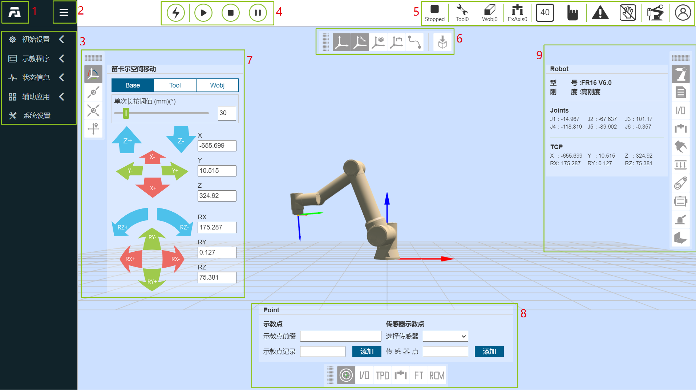
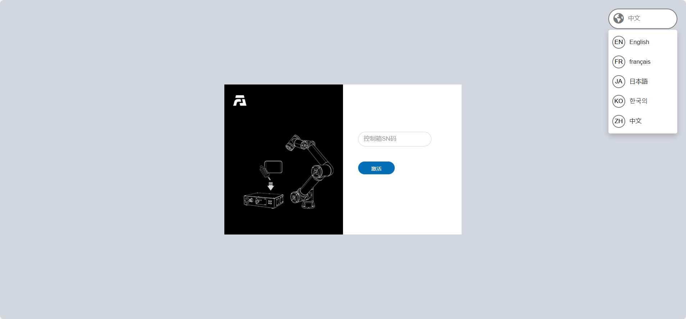
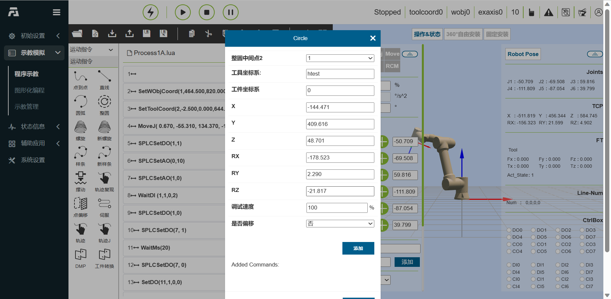
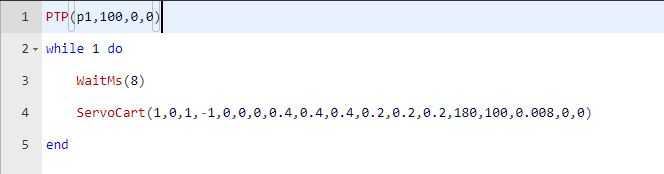
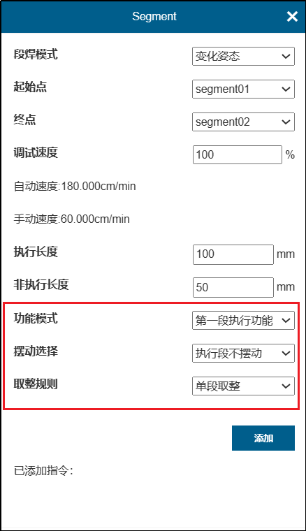
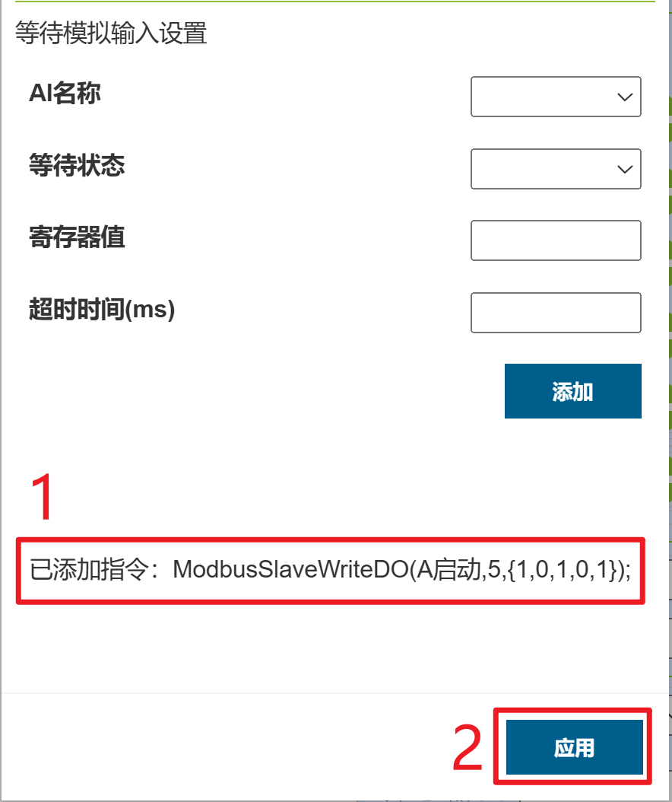

示教器软件基础功能
=========================

.. toctree:: 
   :maxdepth: 6

基础信息
-----------

系统简介
~~~~~~~~~~~

示教器软件是针对机器人开发的配套软件，运行于示教器操作系统中，其主要功能和技术特点如下：

-  能够对机器人进行示教程序的编写；
-  能够实时显示机器人位置坐标，三维模拟实体机器人，并能控制机器人运动；
-  能够实现对机器人的单轴点动以及各轴联动操作；
-  能够查看控制IO状态；
-  用户可以修改密码、查看系统信息等。

机器人首次激活
~~~~~~~~~~~~~~~

1. 开启控制箱并将网线连接PC。

2. PC打开浏览器访问目标网址192.168.58.2，机器人首次开机即进入激活页面。

.. figure:: teaching_pendant_software/334.png
   :width: 4in
   :align: center

.. centered:: 图表 5.1‑1 激活界面

3. 正确输入设备箱的SN码，输入完毕后点击“激活”按钮。
   
4. 系统将验证您的SN码。如果输入正确，将自动完成激活过程。

.. figure:: teaching_pendant_software/335.png
   :width: 4in
   :align: center

.. centered:: 图表 5.1‑2 激活成功界面

5. 激活成功，请手动重启控制箱。
   
6. 再次开机访问目标网址192.168.58.2即进入登录页面。

.. figure:: teaching_pendant_software/001.png
   :width: 6in
   :align: center

.. centered:: 图表 5.1‑3 登录界面

启动软件
~~~~~~~~~~~

1. 控制箱上电；
2. 示教器打开浏览器访问目标网址192.168.58.2；
3. 输入用户名和密码点击登录即可登录系统。

用户登录及权限更新
~~~~~~~~~~~~~~~~~~~~

.. centered:: 表格 5.1-1 初始用户

.. list-table::
   :widths: 70 70 70 70
   :header-rows: 0
   :align: center

   * - **工号**
     - **初始用户名**
     - **密码**
     - **职能代号**

   * - 111
     - admin
     - 123
     - 1

   * - 222
     - MEenginer
     - 222
     - 2

   * - 333
     - PEenginer
     - 333
     - 3
   
   * - 444
     - programmer
     - 444
     - 4
   
   * - 555
     - operator
     - 555
     - 5

   * - 666
     - monitor
     - 666
     - 6

用户（用户管理参考\ `4.10.2.1 用户管理 <#id128>`__\ ）默认分为六个等级，管理员无功能限制，操作员和监视员少部分功能可以使用，ME工程师、PE&PQE工程师和技术员&班组长部分功能限制，管理员无功能限制，具体默认职能代号权限参考\ `4.10.2.2 权限管理 <#id129>`__\ 。

登录界面如下图所示：

.. figure:: teaching_pendant_software/001.png
   :width: 6in
   :align: center

.. centered:: 图表 5.1‑4 登录界面

登录成功后，系统会加载模型等数据，加载完毕后进入初始页面。

系统初始界面
------------------

登录成功后系统进入“初始界面”，主要包含：

- 1、法奥LOGO；
- 2、菜单栏缩放按钮；
- 3、菜单栏；
- 4、机器人控制区
- 5、机器人状态区；
- 6、三维模拟机器人——三维场景操作；
- 7、三维模拟机器人——机器人本体操作；
- 8、机器人配套功能；
- 9、机器人各类状态。

如下图系统初始界面示意图所示：

.. centered:: 图表 5.2‑1 系统初始界面示意图

控制区
~~~~~~~~~

.. note:: 
   .. image:: teaching_pendant_software/003.png
      :width: 0.75in
      :height: 0.75in
      :align: left

   名称：**使能按钮**
   
   作用：使能机器人

.. note:: 
   .. image:: teaching_pendant_software/004.png
      :width: 0.75in
      :height: 0.75in
      :align: left

   名称：**开始按钮**
   
   作用：上传并开始运行示教程序

.. note:: 
   .. image:: teaching_pendant_software/005.png
      :width: 0.75in
      :height: 0.75in
      :align: left

   名称：**停止按钮**
   
   作用：停止当前示教程序运行

.. note:: 
   .. image:: teaching_pendant_software/006.png
      :width: 0.75in
      :height: 0.75in
      :align: left

   名称：**暂停/恢复按钮**
   
   作用：暂停和恢复当前示教程序
   
.. important::
   暂停指令在程序的末尾，无法进行判断

状态栏
~~~~~~~~~~~~

.. note:: 
   .. image:: teaching_pendant_software/007.png
      :width: 0.75in
      :height: 0.75in
      :align: left

   名称：**机器人状态**
   
   作用：Stopped-停止，Running-运行，Pause-暂停，Drag-拖动

.. note:: 
   .. image:: teaching_pendant_software/008.png
      :width: 0.75in
      :height: 0.75in
      :align: left

   名称：**工具坐标系编号**
   
   作用：展示当前应用的工具坐标系编号

.. note:: 
   .. image:: teaching_pendant_software/449.png
      :width: 0.75in
      :height: 0.75in
      :align: left

   名称：**工件坐标系编号**
   
   作用：展示当前应用的工件坐标系编号
   
.. note:: 
   .. image:: teaching_pendant_software/450.png
      :width: 0.75in
      :height: 0.75in
      :align: left

   名称：**扩展轴坐标系编号**
   
   作用：展示当前应用的扩展轴坐标系编号
   
.. note:: 
   .. image:: teaching_pendant_software/009.png
      :width: 0.75in
      :height: 0.75in
      :align: left

   名称：**运行速度百分比**
   
   作用：机器人当前模式运行时速度

.. note:: 
   .. image:: teaching_pendant_software/010.png
      :width: 0.75in
      :height: 0.75in
      :align: left

   名称：**机器人运行正常状态**
   
   作用：当前机器人正常运行

.. note:: 
   .. image:: teaching_pendant_software/011.png
      :width: 0.75in
      :height: 0.75in
      :align: left

   名称：**机器人运行错误状态**
   
   作用：当前机器人运行有错误

.. note:: 
   .. image:: teaching_pendant_software/012.png
      :width: 0.75in
      :height: 0.75in
      :align: left

   名称：**自动模式**
   
   作用：机器人自动运行模式，开启手动切自动模式全局速度调整并指定速度时，全局速度会自动调整为指定速度

.. note:: 
   .. image:: teaching_pendant_software/013.png
      :width: 0.75in
      :height: 0.75in
      :align: left

   名称：**示教模式**
   
   作用：机器人示教运行模式

.. note:: 
   .. image:: teaching_pendant_software/014.png
      :width: 0.75in
      :height: 0.75in
      :align: left

   名称：**机器人拖动状态**
   
   作用：当前机器人可拖动

.. note:: 
   .. image:: teaching_pendant_software/015.png
      :width: 0.75in
      :height: 0.75in
      :align: left

   名称：**机器人拖动状态**
   
   作用：当前机器人不可拖动

.. note:: 
   .. image:: teaching_pendant_software/017.png
      :width: 0.75in
      :height: 0.75in
      :align: left

   名称：**连接状态**
   
   作用：机器人已连接

.. note:: 
   .. image:: teaching_pendant_software/016.png
      :width: 0.75in
      :height: 0.75in
      :align: left

   名称：**未连接状态**
   
   作用：机器人未连接

.. note:: 
   .. image:: teaching_pendant_software/018.png
      :width: 0.75in
      :height: 0.75in
      :align: left

   名称：**账户信息**
   
   作用：显示用户名和权限及登出用户

菜单栏
~~~~~~~~~~~~

菜单栏如下表格：

.. centered:: 表格 5.2‑1 示教器菜单分栏

+----------+------------+
|   一级   |    二级    |
+==========+============+
| 初始设置 | 基础       |
+          +------------+
|          | 安全       |
+          +------------+
|          | 外设       |
+----------+------------+
| 示教程序 | 程序编程   |
+          +------------+
|          | 图形化编程 |
+          +------------+
|          | 节点图编程 |
+          +------------+
|          | 示教点     |
+----------+------------+
| 状态信息 | 系统日志   |
+          +------------+
|          | 状态查询   |
+----------+------------+
| 辅助应用 | 工具应用   |
+          +------------+
|          | 焊接专家库 |
+----------+------------+
| 系统设置 | /          |
+----------+------------+

三维模拟机器人
----------------

三维虚拟轨迹和导入工具模型
~~~~~~~~~~~~~~~~~~~~~~~~~~~

.. note:: 
   .. image:: teaching_pendant_software/020.png
      :width: 0.75in
      :height: 0.75in
      :align: left

   名称：**轨迹绘制**
   
   说明：点击按钮，打开轨迹绘制功能。运行示教程序时，机器人三维模型会描绘机器人运动的轨迹路线。

.. note:: 
   .. image:: teaching_pendant_software/451.png
      :width: 0.75in
      :height: 0.75in
      :align: left

   名称：**导入工具模型**
   
   说明：点击按钮，弹出导入工具模型模态窗，上传文件导入成功后即可在机器人末端进行工具模型展示，目前支持的工具模型文件格式有STL和DAE。

机器人坐标系系统三维可视化展示
~~~~~~~~~~~~~~~~~~~~~~~~~~~~~~~

在WebAPP机器人三维虚拟区域中创建各类三维虚拟坐标系，以基坐标系展示为例，如下图所示。其中X轴红色，Y轴绿色，Z轴蓝色。

.. note:: 
   .. image:: teaching_pendant_software/021.png
      :width: 0.75in
      :height: 0.75in
      :align: left

   名称：**基坐标系**
   
   说明：基坐标系WebAPP中系统机器人三维虚拟区域中进行默认开启展示，固定标记在机器人基座底部中心。三维虚拟基坐标系可进行手动关闭展示。

.. note:: 
   .. image:: teaching_pendant_software/022.png
      :width: 0.75in
      :height: 0.75in
      :align: left

   名称：**工具坐标系**
   
   说明：工具坐标系默认开启展示，可手动关闭。在WebAPP启动并且用户登录成功后，获取当前应用的工具坐标系名称和对应参数数据，初始化当前工具坐标系。

.. important::
   使用的过程中应用其他工具坐标系时，当应用工具坐标系指令成功后，先将机器人三维虚拟区域中已有的工具坐标系清除，再将新应用的工具坐标系参数数据传入三维坐标系生成API进行工具坐标系生成，生成后完成在机器人三维虚拟区域中进行对应展示。

.. note:: 
   .. image:: teaching_pendant_software/023.png
      :width: 0.75in
      :height: 0.75in
      :align: left

   名称：**工件坐标系**
   
   说明：工件坐标系默认关闭，可以进行手动开启展示。流程与工具坐标系一致。

.. note:: 
   .. image:: teaching_pendant_software/024.png
      :width: 0.75in
      :height: 0.75in
      :align: left

   名称：**外部轴坐标系**
   
   说明：外部轴坐标系默认关闭，可以进行手动开启展示。流程与工具坐标系一致。

机器人安装方式设置和展示
~~~~~~~~~~~~~~~~~~~~~~~~~~~

机器人默认安装方式为水平安装，当机器人安装方式更改时，需及时在“初始设置——基础——安装”菜单下设置机器人的实际安装方式，以保证机器人正常工作。

用户点击“初始设置——基础——安装”菜单下的“固定安装”选项，进入机器人固定安装方式设置页面，选择“正装”、“倒装”或者“侧装”，点击“应用”按钮完成机器人安装方式设置。

.. image:: teaching_pendant_software/025.png
   :width: 6in
   :align: center

.. centered:: 图表 5.3‑1 固定安装

考虑到更加灵活丰富的机器人部署场景，我们提供了自由安装功能，用户点击“初始设置——基础——安装”菜单下的中的“自由安装”选项卡，进入机器人自由安装方式设置页面。手动调整“基座倾斜”和“基座旋转”角度，三维模型会对应展示安装效果。修改后点击“应用”按钮即可完成机器人安装方式设置。

.. image:: teaching_pendant_software/026.png
   :width: 6in
   :align: center
   
.. centered:: 图表 5.3‑2 360度自由安装

.. important:: 
   机器人安装完成后，必须正确设置机器人的安装方式，否则会影响机器人的拖动功能以及碰撞检测功能使用。

机器人操作
------------

示教点记录
~~~~~~~~~~~~~~

手动示教控制区主要是在示教模式中对考坐标系进行设定，并实时显示机器人各轴角度与坐标值，并可对示教点进行命名保存。

保存示教点时，该示教点的坐标系为当前机器人应用的坐标系。在该操作区上方可以对示教点速度，加速度设置，设置数值为机器人标准速度百分比，若设置100，即标准速度的百分之百（标准速度请翻阅\ `表1.1-1 机器人基本参数 <robot_brief_introduction.html#id2>`__\）。

传感器示教点，选择已经标定的传感器类型工具，输入点名称，点击添加，保存的点的位置为传感器识别到点的位置。

.. image:: teaching_pendant_software/059.png
   :width: 3in
   :align: center

.. centered:: 图表 4.6‑1 手动操作区示意图

.. important:: 
   第一次使用时，请设置30这样较小的速度值，熟悉机器人运动，以免发生意外情况。

Joint运动
~~~~~~~~~~~

Joint运作下，中间的6个滑块条分别表示对应轴的角度，joint运动分单轴点动和多轴联动

**单轴点动**：用户可通过操作左右两边圆形按钮来控制机器人运动，如图表3.6-2。在手动模式和关节坐标系下，对机器人某一关节进行转动操作。当机器人超出运动范围（软限位）而停止时，可以利用单轴点动进行手动操作，将机器人移出超限位置。单轴点动在进行粗略定位和较大幅度移动时，会比其他操作模式更快捷方便。

设置“长按运动阈值”（长按按钮时，机器人运行的最大距离，输入值得范围0~300）参数，长按圆形按钮控制机器人运行，若在机器人运行中松开按钮，机器人会立即停止运动，若一直按住不松开按钮，机器人会运行长按运动阈值所设置的值后停止运动。

**多轴联动**：用户可操作中间六个滑块来调整机器人相应的目标位置，如图表3.6-3，可通过观察三维虚拟机器人来确定目标位置，若调整的位置不符合自己的预期，点击“还原”按钮，使得三维虚拟机器人回到初始的位置。当用户确定目标位置后，可点击“应用”按钮，实体机器人便会进行相应的运动。

.. image:: teaching_pendant_software/060.png
   :width: 3in
   :align: center

.. centered:: 图表 4.6‑2 单轴点动和多轴联动示意图

.. important:: 
   多轴联动中，第5个关节j5的设置值不能小于0.01度，若期望值小于0.01度，则可以先设置为0.011度，然后通过单轴点动微调第5个关节j5。

Base点动
~~~~~~~~~~

在基坐标系下，可以操作左右两边圆形按钮控制机器人，在X，Y，Z轴上直线移动或绕着RX，RY，RZ旋转，中间的6个滑块条分别表示在对应坐标轴上的位置与运动范围，如图表3.6-3。Base点动的功能与Joint运动中单轴点动的功能相似。

.. image:: teaching_pendant_software/061.png
   :width: 3in
   :align: center

.. centered:: 图表 4.6‑3 Base点动示意图

.. important:: 
   可随时释放该按钮，使机器人停止运动。在必要情况下，按急停按钮使机器人停止。

Tool点动
~~~~~~~~~~

选择工具坐标系，可以操作左右两边圆形按钮控制机器人，在X，Y，Z轴上直线移动或绕着RX，RY，RZ旋转，中间的6个滑块条分别表示在对应坐标轴上的位置与运动范围，如图表3.6-4。Tool点动的功能与Joint运动中单轴点动的功能相似。

.. centered:: 图表 4.6‑4 Tool点动示意图

Wobj点动
~~~~~~~~~~

选择工件点动，可以操作左右两边圆形按钮控制机器人，在工件坐标系下，沿着X，Y，Z轴上直线移动或绕着RX，RY，RZ旋转，中间的6个滑块条分别表示在对应坐标轴上的位置与运动范围，如图表3.6-5。Wobj点动的功能与Joint运动中单轴点动的功能相似。

.. image:: teaching_pendant_software/063.png
   :width: 3in
   :align: center

.. centered:: 图表 4.6‑5 Wobj点动示意图

Move移动
~~~~~~~~~~

选择Move移动，可以直接输入笛卡尔坐标值，点击“计算关节位置”，关节位置显示为计算后结果，确认无危险，可以点击“移至该点”控制机器人运动至输入的笛卡尔位姿。

.. centered:: 图表 4.6‑6 Move移动示意图

.. important:: 
   当出现给定位姿无法到达时，首先检查笛卡尔空间位姿是否超过机器人工作范围，然后检查当前位姿到目标位姿过程中是否存在奇异位姿，若存在奇异位置则调整下当前姿态或过程中插入一个新的位姿以避开奇异位姿。

Eaxis移动
~~~~~~~~~~~~

选择Eaxis移动，该功能为扩展轴的点动功能，需要在配置好扩展轴的前提下，使用该点动功能控制扩展轴，详见“第四章机-器人外设-扩展轴外设配置”。

.. image:: teaching_pendant_software/065.png
   :width: 3in
   :align: center

.. centered:: 图表 4.6‑7 Eaxis移动示意图

TPD（示教编程）
~~~~~~~~~~~~~~~~~

示教编程（TPD）功能操作步骤如下：

- **Step1记录初始位置**：进入三维模型左侧操作区，记录机器人当前位置。在编辑框内设定好点的名称，点击“保存”按钮，若保存成功，则提示“保存点成功”；

- **Step2配置轨迹记录参数**：点击TPD进入“TPD”功能项配置轨迹记录参数，设定好轨迹文件的名称、位姿类型以及采样周期，配置DI和DO，可以在记录TPD轨迹的过程中，通过触发DI来记录对应需要输出的DO，如图表3.6-8；

.. image:: teaching_pendant_software/066.png
   :width: 3in
   :align: center

.. centered:: 图表 4.6‑8 TPD轨迹记录

- **Step3检查机器人模式**：检查机器人模式是否处于手动模式下，若不处于则切换至手动模式，在手动模式下可通过两种方式切换到托动示教模式，一种是长按末端按钮，一种是界面拖动模式切换按键，在TPD记录是推荐从界面切换机器人进入托动示教模式。如图表3.6-9所示；

.. image:: teaching_pendant_software/067.png
   :width: 3in
   :align: center

.. centered:: 图表 4.6‑9 机器人模式

.. important:: 
   从界面切入拖动模式时，先确认末端工具负载以及质心是否设置正确、摩檫力补偿系数是否设置合理，然后通过长按末端按钮确认拖动是否正常，确认无误后从界面切入拖动模式。

- **Step4开始记录**：点击“开始记录”按钮开始轨迹记录，拖动机器人进行动作示教。此外，末端DI配置中有“TPD记录启动/停止”功能配置项，通过配置此功能，用户可以通过外部信号触发“开始记录”轨迹功能，需要注意的是，通过外部信号开始记录轨迹，首先得在页面先进行TPD轨迹的信息配置。

- **Step5停止记录**：动作示教完成后，点击“停止记录”按钮，停止轨迹记录，然后通过拖动示教切换按键使机器人退出拖动示教模式。示教器接收到“停止轨迹记录成功”即表示轨迹记录成功。同步骤4，在配置“TPD记录启动/停止”功能后，可以通过外部信号触发停止记录。

- **Step6示教编程**：点击新建，选择空白模板，点击进入PTP功能编程项，选择刚保存的初始位置点，点击“添加”按钮，应用完成后，在程序文件中会显示一条PTP指令；然后点击进入TPD功能编程项，选择刚刚记录的轨迹，设定是否平滑以及速度缩放比例，点击“添加”按钮，应用完成后，在程序文件中会显示一条MoveTPD指令，如图表3.6-10所示；

.. image:: teaching_pendant_software/068.png
   :width: 6in
   :align: center

.. centered:: 图表 4.6‑10 TPD编程

- **Step7轨迹复现**：示教程序编辑完成后，切换至自动运行模式，点击界面上方”开始运行”图标开始运行程序，机器人开始复现示教的动作。

- **Step8轨迹编辑**：TPD轨迹编辑区可对轨迹可视化展示和编辑裁切，以达到TPD轨迹预分析和精简。选择对应轨迹获取点，那么用户记录的轨迹点会展示在机器人三维空间内，其次用户可以拖动“Start”和“End”滚动条对轨迹的起点和终点进行模拟复现和剪辑。

TPD文件删除与异常处理：

- **轨迹文件删除**：点击进入TPD功能项，选择需要删除的轨迹文件，点击”删除轨迹”按钮，若删除成功，则会收到删除成功提示。

- **异常处理：**

  +  **指令点数超限**：一条轨迹最多可记录2万个点数，当超过2万个点时，控制器不再记录超过的点数，并向示教器发出“指令点数超限”告警提示，此时需点击停止记录；

  +  **TPD指令间隔过大**：若示教器报错TPD指令间隔过大，则应检查机器人是否回到了记录前的初始位置，若机器人回到了初始位置依然报错TPD指令间隔过大，则删除当前轨迹重新记录一条新的轨迹；

  +  TPD操作过程中若出现其他异常情况，则应通过示教器或急停按钮立即停止机器人操作，检查原因。

.. important:: 
   TPD功能操作过程中应严格按照示教器上相应的提示进行操作。

示教模拟
----------

简介
~~~~~~~

点击左侧命令可以向程序树添加程序节点。程序运行时，当前执行的程序节点绿色高亮显示。在手动模式下，点击节点右侧第一个图标可以使机器人单独执行该指令，第二个图标为编辑该节点内容

.. image:: teaching_pendant_software/069.png
   :width: 6in
   :align: center

.. centered:: 图表 4.7‑1 程序树界面

点击“⇄”切换模式，可以将示教程序文本变为编辑状态，编辑状态下可以展开和收起编辑区域。

.. image:: teaching_pendant_software/245.png
   :width: 6in
   :align: center

.. image:: teaching_pendant_software/246.png
   :width: 6in
   :align: center

.. centered:: 图表 4.7‑2 示教程序编辑状态

点击“当前程序右侧内容弹出/隐藏”按钮，可以展开或隐藏局部示教点位和当前程序备份内容。右侧内容展开后，点击“局部示教点位”和“当前程序备份”图标展示相对应的内容。

.. image:: teaching_pendant_software/260.png
   :width: 6in
   :align: center

.. image:: teaching_pendant_software/261.png
   :width: 6in
   :align: center

.. centered:: 图表 4.7‑3 当前程序右侧内容

工具栏
~~~~~~~~~~

使用程序树底部的工具栏修改程序树。

.. note:: 
   .. image:: teaching_pendant_software/070.png
      :width: 1.5in
      :height: 0.75in
      :align: left

   名称：**打开**
   
   作用：打开用户程序文件

.. note:: 
   .. image:: teaching_pendant_software/071.png
      :width: 1.5in
      :height: 0.75in
      :align: left

   名称：**新建**
   
   作用：选择模板新建程序文件
   
.. note:: 
   .. image:: teaching_pendant_software/072.png
      :width: 1.5in
      :height: 0.75in
      :align: left

   名称：**导入**
   
   作用：导入文件到用户程序文件夹中

.. note:: 
   .. image:: teaching_pendant_software/073.png
      :width: 1.5in
      :height: 0.75in
      :align: left

   名称：**导出**
   
   作用：导出用户程序文件到本地点。

.. note:: 
   .. image:: teaching_pendant_software/074.png
      :width: 1.5in
      :height: 0.75in
      :align: left

   名称：**保存**
   
   作用：保存文件编辑内容

.. note:: 
   .. image:: teaching_pendant_software/075.png
      :width: 1.5in
      :height: 0.75in
      :align: left

   名称：**另存为**
   
   作用：给文件重命名存放到用户程序或模板程序文件夹中。

.. note:: 
   .. image:: teaching_pendant_software/076.png
      :width: 1.5in
      :height: 0.75in
      :align: left

   名称：**复制**
   
   作用：复制一个节点，并允许将其用于其他操作（例如：将其粘贴到程序树的其他位置）。

.. note:: 
   .. image:: teaching_pendant_software/077.png
      :width: 1.5in
      :height: 0.75in
      :align: left

   名称：**粘贴**
   
   作用：允许您粘贴之前剪切或复制的节点。

.. note:: 
   .. image:: teaching_pendant_software/078.png
      :width: 1.5in
      :height: 0.75in
      :align: left

   名称：**剪切**
   
   作用：剪切一个节点，并允许将其用于其他操作（例如：将其粘贴到程序树的其他位置）。

.. note:: 
   .. image:: teaching_pendant_software/079.png
      :width: 1.5in
      :height: 0.75in
      :align: left

   名称：**删除**
   
   作用：从程序树中删除一个节点。

.. note:: 
   .. image:: teaching_pendant_software/080.png
      :width: 1.5in
      :height: 0.75in
      :align: left

   名称：**上移**
   
   作用：向上移动该节点。

.. note:: 
   .. image:: teaching_pendant_software/081.png
      :width: 1.5in
      :height: 0.75in
      :align: left

   名称：**下移**
   
   作用：向下移动该节点。

.. note:: 
   .. image:: teaching_pendant_software/082.png
      :width: 1.5in
      :height: 0.75in
      :align: left

   名称：**切换编辑模式**
   
   作用：程序树模式和lua编辑模式互相切换。

程序命令
~~~~~~~~~~~

左侧主要是程序命令的添加，点击各关键字上方图标进入详细界面，程序命令添加到文件中的操作主要分为两种，一种方式打开相关指令点击应用按键即可将该指令添加到程序中，另一种方式为先点击“添加”按键，此时命令并未保存到程序文件中，需要再点击“应用”方可将命令保存到文件中。第二种方式多出现在同类型指令多条下发的
情况，我们对该类型命令增加添加按键和显示已添加指令内容功能，点击添加按键可添加一条指令，已添加指令显示所有已添加的指令，点击“应用”即可将添加的指令保存到右侧已打开的文件中。

逻辑指令界面
~~~~~~~~~~~~~

.. image:: teaching_pendant_software/202.png
   :width: 6in
   :align: center

.. centered:: 图表 4.7‑4 逻辑指令界面

循环命令
++++++++++++++++

点击“循环”图标进入While命令编辑界面

在While后方的输入框中输入等待条件，在do后方的输入框中输入循环期间的动作指令，点击保存即可。（为方便操作，可任意输入do内容，在程序中编辑其他指令插入代替）

.. image:: teaching_pendant_software/101.png
   :width: 6in
   :align: center

.. centered:: 图表 4.7‑4-1 While指令界面

判断命令
++++++++++++++++

点击“判断”按钮进入if…else命令编辑界面

在右侧输入框中输入语句，编辑完毕后点击“添加”、“应用”即可。（该指令需要一定编程基础，如需帮助，请联系我们）

.. image:: teaching_pendant_software/102.png
   :width: 6in
   :align: center

.. centered:: 图表 4.7‑4-2 if…else指令界面

跳转命令
++++++++++++++++

点击“跳转”按钮进入Goto命令编辑界面

Goto指令为跳转指令，在右侧输入框中输入语句，编辑完毕后点击“添加”、“应用”即可。（该指令需要一定编程基础，如需帮助，请联系我们）

.. image:: teaching_pendant_software/103.png
   :width: 6in
   :align: center

.. centered:: 图表 4.7‑4-3 Goto指令界面

等待命令
++++++++++++++++

点击“等待”图标进入Wait命令编辑界面

该指令为延时指令，分为“WaitMs”、“WaitDI”和“WaitAI”三部分。

“WaitTime”指令延时等待时间单位为毫秒，输入需要等待的毫秒数，点击“添加”、“应用”即可。

.. image:: teaching_pendant_software/104.png
   :width: 6in
   :align: center

.. centered:: 图表 4.7‑4-4 WaitTime指令界面

“WaitDI”指令，即单DI等待，选择需要等待的IO端口号、等待状态、等待最大时间和等待超时处理方式，点击“添加”、“应用”即可。

.. image:: teaching_pendant_software/105.png
   :width: 6in
   :align: center

.. centered:: 图表 4.7‑4-5 WaitDI指令界面

“WaitMultiDI”指令，即多DI等待，首先选择多DI成立条件，其次勾选需要等待的DI端口和状态，最后设置等待最大时间和等待超时处理方式，点击“添加”、“应用”即可。

.. image:: teaching_pendant_software/106.png
   :width: 6in
   :align: center

.. centered:: 图表 4.7‑4-6 WaitMultiDI指令界面

“WaitAI”指令，选择需要等待的模拟量、数值、等待的最大时间以及等待超时处理方式，点击“添加”、“应用”即可。

.. image:: teaching_pendant_software/107.png
   :width: 6in
   :align: center

.. centered:: 图表 4.7‑4-7 WaitAI指令界面

暂停命令
++++++++++++++++

点击“暂停”图标进入Pause命令编辑界面

该指令为暂停指令，在程序中插入该指令，当程序执行到该指令时，机器人会处于暂停状态，若想继续运行，点击控制区“暂停/恢复”按键即可。

.. image:: teaching_pendant_software/108.png
   :width: 6in
   :align: center

.. centered:: 图表 4.7‑4-8 Pause指令界面

子程序命令
++++++++++++++++

点击“子程序”图标进入Dofile命令编辑界面

Dofile指令调用的是控制器内部程序，使用Dofile指令需要保存被调用的子程序，而主程序若未改变可不用再次保存。Dofile指令支持二级调用，需要注意两个参数设置，一是该调用处于第几层，二是该调用的ID编号，ID编号原则上同一程序不能出现相同ID。

.. image:: teaching_pendant_software/109.png
   :width: 6in
   :align: center

.. centered:: 图表 4.7‑4-9 Dofile指令界面

变量命令
++++++++++++++++

点击“变量”图标进入Var命令编辑界面

该指令为变量系统指令，分为Lua变量定义，变量查询和Sys变量重命名，获取值，设置值两部分，Lua变量定义可以声明一个变量并赋予初始值，与while，if-else等指令配合使用，Lua变量查询指令可以实时查询输入的变量名称的值，显示在状态栏。Sys变量个数是固定的，可以对其重命名，获取变量值以及设置变量值，该变量保存的值不随系统关机而清零。

.. image:: teaching_pendant_software/100.png
   :width: 6in
   :align: center

.. centered:: 图表 4.7‑4-10 Var指令界面

.. important:: 变量命名必须以字母或者下划线开头，不能以数字或其他特殊字符开头。

运动指令界面
~~~~~~~~~~~~~

.. image:: teaching_pendant_software/203.png
   :width: 6in
   :align: center

.. centered:: 图表 4.7‑5 运动指令界面

点到点命令
++++++++++++++++

点击“点到点”图标进入PTP命令编辑界面。

可以选择需要到达的点，平滑过渡时间设置可以实现该点到下一点的运动是连续的，是否偏移设置，可以选择基于基坐标系偏移和基于工具坐标偏移，并弹出x，y，z，rx，ry，rz偏移量设置，PTP具体路径为运动控制器自动规划的最优路径，点击“添加”、“应用”后可保存该条指令。

.. image:: teaching_pendant_software/083.png
   :width: 6in
   :align: center

.. centered:: 图表 4.7‑5-1 PTP指令界面

直线命令
++++++++++++++++

点击“直线”图标进入Lin命令编辑界面。

该指令功能与“PTP”指令相似，但该指令所到达点的路径为直线。

.. image:: teaching_pendant_software/084.png
   :width: 6in
   :align: center

.. centered:: 图表 4.7‑5-2 Lin指令界面

.. important:: 当选择点名称为“seamPos”时，直线命令应用于焊接场景中使用激光传感器。由于焊接使用中的运行累计误差，故增加“是否偏移”和“偏移量”。

   **是否偏移**：否、基坐标系偏移、工具坐标系偏移、激光原始数据偏移；

   **偏移量**：∆x、∆y、∆z、∆rx、∆ry、∆rz，范围：-300~300；

   .. image:: teaching_pendant_software/277.png
      :width: 6in
      :align: center

   .. centered:: 图表 4.7‑5-2-1 Lin指令界面（焊接场景）

LIN指令关节超速处理功能
***************************

使用笛卡尔空间直线运动指令LIN时，约束的规划条件是线速度，但是实际运行时受到工作空间的影响，在满足线速度要求时关节角速度可能已经超过限制。本功能实现了可选处理策略以应对LIN运动中关节超速的情况。

**Step1**：点击直线运动指令按钮；

.. image:: teaching_pendant_software/436.png
   :width: 6in
   :align: center

.. centered:: 图表 4.7‑5-3-1 点击直线运动指令按钮

**Step2**：选择直线运动指令目标路点；

.. centered:: 图表 4.7‑5-3-2 选择直线运动目标路点

**Step3**：打开关节超速保护开关；

.. centered:: 图表 4.7‑5-3-3 打开关节超速保护开关按钮

**Step4**：选择关节超速处理策略(选择超速报错或自适应降速，其他均为默认策略无保护)；

.. centered:: 图表 4.7‑5-3-4 关节超速处理策略

**Step5**：
   设置处理策略及处理策略参数，点击添加按钮即可添加lua指令；

   自适应降速策略下，减速阈值为线速度减少值相对设定线速度的百分比，当减速值超过设定阈值时，机器人会报错停止。

.. centered:: 图表 4.7‑5-3-5 关节超速处理策略选择与设置

**Step6**：添加的lua指令，形式如图所示；

.. centered:: 图表 4.7‑5-3-6 lua指令

**超速保护开始**：JointOverSpeedProtectStart（a，b）；
   a：策略号（参照下拉框顺序）

   b：阈值百分比（0~100，仅自适应降速时起效）

**超速保护结束**：JointOverSpeedProtectEnd（）；

圆弧命令
++++++++++++++++

点击“圆弧”图标进入Arc命令编辑界面。

“Arc”指令为圆弧运动，包含两个点，第一点为圆弧中间过渡点，第二点为终点，过渡点和终点都可以对是否偏移进行设置，可以选择基于基坐标系偏移和基于工具坐标偏移，并弹出x，y，z，rx，ry，rz偏移量设置，终点可以设置平滑过渡半径，实现运动连续效果。

.. image:: teaching_pendant_software/085.png
   :width: 6in
   :align: center

.. image:: teaching_pendant_software/086.png
   :width: 6in
   :align: center

.. centered:: 图表 4.7‑5-4 Arc指令界面

整圆命令
++++++++++++++++

点击“整圆”图标进入Circle命令编辑界面。

协作机器人通过添加整圆指令可以进行整圆轨迹运动，在添加整圆指令前需要先示教出整圆轨迹上的3个路径点，假设整圆轨迹上三个路径点分别为“P1”、“P2”、“P3”，其中“P1”为整圆轨迹起点，“P2”和“P3”分别为整圆轨迹中间点1和中间点2，分别移动机器人至上述三个点，并添加示教点位名称分别为“P1”、“P2”、“P3”。

.. image:: teaching_pendant_software/087.png
   :width: 3in
   :align: center

.. centered:: 图表 4.7‑5-5 整圆轨迹

.. image:: teaching_pendant_software/279.png
   :width: 3in
   :align: center

.. image:: teaching_pendant_software/280.png
   :width: 3in
   :align: center

.. centered:: 图表 4.7‑5-6 示教“P1”、“P2”、“P3”点

整圆指令添加
**************

**Step1**：新建用户程序“testCircle.lua”，点击“整圆”按钮，打开整圆指令添加页面。

.. image:: teaching_pendant_software/281.png
   :width: 6in
   :align: center

.. centered:: 图表 4.7‑5-7 添加整圆指令按钮

**Step2**：在整圆指令添加页面中选择“整圆中间点1”为“P2”点，点击“下一页”。

.. image:: teaching_pendant_software/282.png
   :width: 3in
   :align: center

.. centered:: 图表 4.7‑5-8 整圆中间点1

**Step3**：选择“整圆中间点2”为“P3”点，依次点击“添加”按钮和“应用”按钮。

.. image:: teaching_pendant_software/283.png
   :width: 3in
   :align: center

.. centered:: 图表 4.7‑5-9 整圆中间点2

**Step4**：此时“testCircle.lua”已经增加整圆运动指令。

.. image:: teaching_pendant_software/284.png
   :width: 6in
   :align: center

.. centered:: 图表 4.7‑5-10 整圆运动指令添加

上述整圆运动指令仅定义了整圆的两个路径点，还需要定义整圆运动的起点才能使机器人按照预定的整圆轨迹运动。添加直线运动指令，直线运动目标点为整圆轨迹起点“P1”点，且调整指令位置使机器人先运动到整圆起点“P1”，再执行路径中间点为“P2”和“P3”的整圆轨迹运动。

.. image:: teaching_pendant_software/285.png
   :width: 6in
   :align: center

.. centered:: 图表 4.7‑5-11 添加整圆运动起点

将机器人切换到自动模式，在确保安全的前提下启动该程序，机器人即按整圆轨迹进行运动。

整圆轨迹偏移
**************

协作机器人的整圆运动支持对整圆轨迹中间点1和整圆轨迹中间点2的位置进行偏移，偏移类型包括以下两种类型;

**整圆两个轨迹中间点相同偏移量**：整圆轨迹中间点1（“P2”点）和整圆轨迹中间点2（“P3”点）采用相同的偏移量∆(dx, dy, dz, drx, dry, drz)进行偏移。

**整圆两个轨迹中间点不同偏移量**：整圆轨迹中间点1（“P2”点）和整圆轨迹中间点2（“P3”点）分别采用两个不同的偏移量∆1(dx1, dy1, dz1, drx1, dry1, drz1)和∆2(dx2, dy2, dz2, drx2, dry2, drz2)进行偏移。

下面分别演示“相同偏移量”和“不同偏移量”的用法。

1. 相同偏移量

所示，打开整圆指令添加页面，“偏移类型”选择“相同偏移量”，同样选择整圆中间点1为“P2”点，点击“下一页”按钮。

.. image:: teaching_pendant_software/286.png
   :width: 3in
   :align: center

.. centered:: 图表 4.7‑5-12 整圆相同偏移量

整圆中间点2选择“P3”，“是否偏移”选择“基座标偏移”。

.. note:: 您可以根据实际的工作情况选择“工具坐标偏移”。

输入偏移量dx为10mm，依次点击页面下方的“添加”按钮和“应用”按钮。

.. centered:: 图表 4.7‑5-13 设置偏移量

此时一条整圆两个中间点“P2”和“P3”均沿基座标系的X轴方向偏移10mm的整圆指令已经添加到“testCircle.lua”程序中；当然在整圆运动指令前还需要添加一条直线运动指令使机器人运动到整圆的起点。

.. image:: teaching_pendant_software/288.png
   :width: 6in
   :align: center

.. centered:: 图表 4.7‑5-14 整圆相同偏移量程序

将机器人切换至自动模式，在保证安全的情况下启动该程序，机器人的实际运动轨迹中穿过“P1”、“P2”和“P3”的圆，其中“P2”为原“P2”点沿X方向偏移10mm后的点，其中“P3”为原“P3”点沿X方向偏移10mm后的点。

.. image:: teaching_pendant_software/289.png
   :width: 3in
   :align: center

.. centered:: 图表 4.7‑5-15 相同偏移量X10mm轨迹

2. 不同偏移量

打开整圆指令添加页面，“偏移类型”选择“不同偏移量”，同样选择整圆中间点1为“P2”点，“是否偏移”选择为“基座标偏移”。

.. note:: 您可以根据实际的工作情况选择“工具坐标偏移”。

输入偏移量dy为10mm，点击“下一页”按钮。

.. image:: teaching_pendant_software/290.png
   :width: 3in
   :align: center

.. centered:: 图表 4.7‑5-16 不同偏移量

整圆中间点选择“P3”，“是否偏移”选择“基座标偏移”。

.. note:: 您可以根据实际的工作情况选择“工具坐标偏移”。

输入偏移量dx为10mm，依次点击页面下方的“添加”按钮和“应用”按钮。

.. image:: teaching_pendant_software/291.png
   :width: 3in
   :align: center

.. centered:: 图表 4.7‑5-17 不同偏移量设置中间点2偏移

此时一条整圆中间点“P2”沿基座标系Y方向偏移10mm和“P3”沿基座标系的X轴方向偏移10mm的整圆指令已经添加到“testCircle.lua”程序中；当然在整圆运动指令前还需要添加一条直线运动指令使机器人运动到整圆的起点。    

.. image:: teaching_pendant_software/292.png
   :width: 6in
   :align: center

.. centered:: 图表 4.7‑5-18 整圆两点不同偏移量程序

将机器人切换至自动模式，在保证安全的情况下启动该程序，机器人的实际运动轨迹中穿过“P1”、“P2’”和“P3’”的圆，其中“P2’”为原“P2”点沿Y方向偏移10mm后的点，其中“P3’”为原“P3”点沿X方向偏移10mm后的点。

.. image:: teaching_pendant_software/293.png
   :width: 3in
   :align: center

.. centered:: 图表 4.7‑5-19 整圆两轨迹点分别偏移轨迹

螺旋命令
++++++++++++++++

点击“螺旋”图标进入Spiral命令编辑界面

“Spiral”指令为螺旋线运动，包含三个点，该三个点组成一个圆，在第三点设置页面，包含螺旋圈数，姿态修正角，半径增量和转轴方向增量这几个参数设置，螺旋圈数即该螺旋线的运动圈数，姿态修正角修正的是螺旋线结束时的姿态与螺旋线第一点的姿态，半径增量即每一圈半径的增量，转轴方向增量即螺旋轴方向的增量。设置
是否偏移，该偏移量生效于整个螺旋线的轨迹。

.. image:: teaching_pendant_software/089.png
   :width: 6in
   :align: center

.. centered:: 图表 4.7‑5-20 Spiral指令界面

新螺旋命令
++++++++++++++++

点击“新螺旋”图标进入N-Spiral命令令编辑界面

“N-Spiral”指令为优化版螺旋线运动，该指令只需要一个点加各参数的配置实现螺旋线运动。机器人以当前位置作为起点，用户设置调试速度，是否偏移，螺旋圈数，螺旋倾角，初始半径，半径增量，转轴方向增量和旋转方向这几个参数，螺旋圈数即该螺旋线的运动圈数，螺旋倾角即工具Z轴与水平方向的夹角，姿态修正角修正的是螺旋线结束时的姿态与螺旋线第一点的姿态，初始半径即第一圈半径大小，半径增量即每一圈半径的增量，转轴方向增量即螺旋轴方向的增量，旋转方向即顺时针和逆时针。

.. image:: teaching_pendant_software/090.png
   :width: 6in
   :align: center

.. centered:: 图表 4.7‑5-21 N-Spiral指令界面

水平螺旋命令
++++++++++++++++

点击“水平螺旋”图标进入H-Spiral命令令编辑界面

“H-Spiral”指令为水平空间螺旋线运动，该指令设置于单段运动（直线）指令之后。

   - 螺旋半径: 0~100mm
   - 螺旋角速度: 0~2rev/s
   - 旋转方向: 螺旋顺/逆时针
   - 螺旋倾角: 0~40°

.. image:: teaching_pendant_software/250.png
   :width: 6in
   :align: center

.. centered:: 图表 4.7‑5-22 H-Spiral指令界面

样条命令
++++++++++++++++

点击“样条”图标进入Spline命令编辑界面

该指令分为样条组起始，样条段和样条组结束三部分，样条组开始是样条运动的起始标志，样条段包含SPL、SLIN和SCIRC段，点击对应图标进入指令添加界面，样条组结束是样条运动的结束标志。

.. image:: teaching_pendant_software/091.png
   :width: 6in
   :align: center

.. centered:: 图表 4.7‑5-23 Spline指令界面

新样条命令
++++++++++++++++

点击“新样条”图标进入N-Spline命令编辑界面

该指令为Spline指令算法优化指令，后续会替代现有的Spline指令。

该指令分为多点轨迹起始，多点轨迹段和多点轨迹结束三部分，多点轨迹开始是多点轨迹运动的起始标志，多点轨迹段即设置各个轨迹点，

点击图标进入点位添加界面，多点轨迹结束是多点轨迹运动的结束标志，在此可以设置控制模式和调试速度

- 控制模式：圆弧过渡点/给定路径点
- 全局平均衔接时间：整数型，大于10，默认值为2000

.. image:: teaching_pendant_software/092.png
   :width: 6in
   :align: center

.. centered:: 图表 4.7‑5-24 N-Spline指令界面

摆动命令
++++++++++++++++

点击“摆动”图标进入Weave命令编辑界面。“Weave”指令包含两部分：

- 选择配置好参数的摆焊编号，点击“开始摆焊”和“停止摆焊”并应用可将相关指令添加到程序中。

.. image:: teaching_pendant_software/110.png
   :width: 6in
   :align: center

.. centered:: 图表 4.7‑5-25 Weave指令界面

- 点击“配置与测试”，可以根据使用场景选择摆动类型，对摆焊的参数进行配置，配置完成后可通过开始摆焊测试和停止摆焊测试按键测试该摆焊轨迹。目前摆动类型有：

   - 三角波摆动（LIN/ARC）
   - 垂直L型三角波摆动（LIN/ARC）
   - 圆形摆动-顺时针（LIN）
   - 圆形摆动-逆时针（LIN）
   - 正弦波摆动（LIN/ARC）
   - 垂直L型正弦波摆动（LIN/ARC）
   - 立焊三角摆动

.. image:: teaching_pendant_software/111.png
   :width: 6in
   :align: center

.. centered:: 图表 4.7‑5-26 Weave配置与测试指令界面

斜锯齿摆动功能
*********************

使用斜锯齿摆动功能能使机器人工具末端在笛卡尔空间内形成倾斜锯齿状摆动轨迹。斜锯齿摆动叠加于直线规划，倾斜量受方位角参数控制，在指定的摆焊平面上摆焊的方位角的倾斜度（单位deg）；

值为正时，左端点向前进方向倾斜，为负时，右端点向前进方向倾斜；若为90deg或-90deg时，可以沿着前进方向进行摆动。

.. image:: teaching_pendant_software/442.png
   :width: 4in
   :align: center

.. centered:: 图表 4.7‑5-26-1 摆动方位角影响

**Step1**：编辑设置基本直线运动。

.. image:: teaching_pendant_software/443.png
   :width: 4in
   :align: center

.. centered:: 图表 4.7‑5-26-2 基本直线运动lua程序示例

**Step2**：点击添加摆动指令。

.. centered:: 图表 4.7‑5-26-3 点击添加摆动指令

**Step3**：摆动指令参数配置页面点击“配置”按钮，“摆动类型”下拉框选择“三角波摆动”或“正弦波摆动”，输入相应“摆动方向方位角”，点击“应用”。

.. centered:: 图表 4.7‑5-26-4 摆动参数配置

**Step4**：点击“开始摆动”按钮，将摆动指令添加到直线运动上方；点击“结束摆动”按钮，将摆动指令添加到直线运动下方。

.. image:: teaching_pendant_software/446.png
   :width: 4in
   :align: center

.. centered:: 图表 4.7‑5-26-5 添加摆动指令后lua程序

**Step5**：点击“开始运行”，机器人末端轨迹如图所示。

.. image:: teaching_pendant_software/447.png
   :width: 3in
   :align: center

.. image:: teaching_pendant_software/448.png
   :width: 3in
   :align: center

.. centered:: 图表 4.7‑5-26-6 锯齿摆动（左） 斜锯齿摆动（右）

轨迹复现命令
++++++++++++++++

点击“轨迹复现”按钮进入TPD命令编辑界面

在该指令中，用户首先需要有记录好的轨迹。

关于轨迹记录：在准备记录轨迹之前，先保存下轨迹的起始点。在机器人处于拖动模式下，输入文件名，选择周期（假设数值为x，即每隔x毫秒记录一个点，推荐4毫秒记录一个点），点开始记录，用户可以根据需求拖动机器人进行指定运动，记录完成后，点击停止记录，即可保存之前机器人的运动轨迹。当一条运动无法完全记录，会提
示记录点数超限提示，用户需要将运动分几次进行记录。

进行程序编程时，首先用PTP指令到达对应轨迹起始点，然后在TPD轨迹复现指令中选择轨迹，选择是否平滑，设置调试速度，依次点击“添加”、“应用”，即可插入程序。轨迹加载指令主要用于预先读取轨迹文件，提取成轨迹指令，更好的应用于传送带跟踪场景。

.. note:: 
   关于TPD详细操作可见示教编程（TPD）功能操作说明模块。

.. image:: teaching_pendant_software/097.png
   :width: 6in
   :align: center

.. centered:: 图表 4.7‑5-27 TPD指令界面

点偏移命令
++++++++++++++++

点击“点偏移”图标进入Offset命令编辑界面

该指令为整体偏移指令，输入各个偏移量，将开启指令和关闭指令添加到程序中，在开始和关闭中间的运动指令会基于基坐标（或工件坐标）进行偏移。

.. image:: teaching_pendant_software/123.png
   :width: 6in
   :align: center

.. centered:: 图表 4.7‑5-28 Offset指令界面

伺服命令
++++++++++++++++

点击“伺服”图标进入ServoCart命令编辑界面

ServoCart伺服控制（笛卡尔空间运动）指令，该指令可以通过绝对位姿控制或基于当前位姿偏移来控制机器人运动。

.. image:: teaching_pendant_software/128.png
   :width: 6in
   :align: center

.. centered:: 图表 4.7‑5-29 ServoCart指令界面

绝对位姿控制程序实例：

.. image:: teaching_pendant_software/129.png
   :width: 6in
   :align: center

此例中，x，y，z，rx，ry，rz（笛卡尔位置）是获取的机器人当前位置，此外，用户可以通过读取轨迹数据文件，socket通讯发送轨迹数据等方式，控制机器人运动。

基于当前位姿偏移（基坐标偏移）控制程序实例：

轨迹命令
++++++++++++++++

点击“轨迹”图标进入Trajctory命令编辑界面

.. image:: teaching_pendant_software/212.png
   :width: 6in
   :align: center

.. centered:: 图表 4.7‑5-30 Trajctory指令界面

轨迹J命令
++++++++++++++++

点击“轨迹J”图标进入TrajctoryJ命令编辑界面

Trajctory指令和TrajctoryJ指令适用于相机直接给定轨迹的通用接口，满足在已有固定格式的离散的轨迹点文件时，可导入系统使得机器人按照导入文件的轨迹进行运动。

1.轨迹文件导入功能：选择本地计算机文件导入机器人控制系统

2.轨迹预加载：选择已导入的轨迹文件通过指令加载

3.轨迹运动：通过预加载的轨迹文件和选择的调试速度组合指令下发机器人运动

4.打印轨迹点编号：在机器人运行轨迹的过程中打印轨迹点编号，以便查看当前运动的进度

.. image:: teaching_pendant_software/213.png
   :width: 6in
   :align: center

.. centered:: 图表 4.7‑5-31 TrajctoryJ指令界面

DMP命令
++++++++++++++++

点击“DMP”图标进入DMP命令编辑界面

DMP是一种轨迹模仿学习的方法，需要事先规划参考轨迹。在命令编辑界面 ，选择示教点作为新的起点，点击“添加”、“应用”后可保存该指令。DMP具体路径为以新的起点模仿参考轨迹的新轨迹。

.. image:: teaching_pendant_software/214.png
   :width: 6in
   :align: center

.. centered:: 图表 4.7‑5-32 DMP指令界面

工件转换命令
++++++++++++++++

点击“工件转换”图标进入WPTrsf命令编辑界面

选择所要进行自动转换的工件坐标系，点击“添加”、“应用”后可保存该指令，该指令实现在执行内部的PTP、LIN指令时，工件坐标系下点位自动转换。使用示例区域展示并提示了指令的正确使用方式组合，具体指令在添加后可依据实际场景自行调整组合。

.. image:: teaching_pendant_software/215.png
   :width: 6in
   :align: center

.. centered:: 图表 4.7‑5-33 WPTrsf指令界面

控制指令界面
~~~~~~~~~~~~~

.. image:: teaching_pendant_software/204.png
   :width: 6in
   :align: center

.. centered:: 图表 4.7‑6 控制指令界面

数字IO命令
++++++++++++++++

点击“数字IO”图标进入IO命令编辑界面

“IO”指令分为设置IO（SetDO/SPLCSetDO）和获取IO（GetDI/SPLCGetDI）两部分。

“SetDO/SPLCSetDO”该指令可设定指定的输出DO状态，包括16路控制箱数字输出和2路工具数字输出，状态选项“False”为闭，“True”为开，是否阻塞选项选择“阻塞”表示运动停止后设置DO状态，选择“非阻塞”选项表示在上一条运动过程中设置DO状态。平滑轨迹选项选择“Break”表示在平滑过渡半径结束后设置DO状态，选择“Serious”表示在平滑过渡半径运动过程中设置DO状态。当该指令是添加在辅助线程中，是否应用线程需要选择是，其他地方使用该指令选择否。点击“添加”、“应用”即可。

.. image:: teaching_pendant_software/093.png
   :width: 6in
   :align: center

.. centered:: 图表 4.7‑6-1 SetDO指令界面

在“GetDI/SPLCGetDI”指令中，选择想要获取端口号的数值，是否阻塞选项选择“阻塞”表示运动停止后获取DI状态，选择“非阻塞”选项表示在上一条运动过程中获取DI状态。当该指令是添加在辅助线程中，是否应用线程需要选择是，其他地方使用该指令选择否。选择完毕后点击“添加”、“应用”按钮即可。

.. image:: teaching_pendant_software/094.png
   :width: 6in
   :align: center

.. centered:: 图表 4.7‑6-2 GetDI指令界面

模拟AI命令
++++++++++++++++

点击“模拟AI”图标进入AI命令编辑界面

在该指令中，分为设置模拟输出（SetAO/SPLCSetAO）和获取模拟输入（GetAI/SPLCGetAI）两部分功能。

“SetAO/SPLCSetAO”选择需要设置的模拟输出，输入需要设置的值，范围为0-10，是否阻塞选项选择“阻塞”表示运动停止后设置AO状态，选择“非阻塞”选项表示在上一条运动过程中设置AO状态。当该指令是添加在辅助线程中，是否应用线程需要选择是，其他地方使用该指令选择否。点击“添加”、“应用”即可。

.. image:: teaching_pendant_software/095.png
   :width: 6in
   :align: center

.. centered:: 图表 4.7‑6-3 SetAO指令界面

“GetAI/SPLCGetAI”选择需要获取的模拟输入，是否阻塞选项选择“阻塞”表示运动停止后获取AI状态，选择“非阻塞”选项表示在上一条运动过程中获取AI状态。当该指令是添加在辅助线程中，是否应用线程需要选择是，其他地方使用该指令选择否。点击“添加”、“应用”即可。

.. image:: teaching_pendant_software/096.png
   :width: 6in
   :align: center

.. centered:: 图表 4.7‑6-4 GetAI指令界面

虚拟IO命令
++++++++++++++++

点击“虚拟IO”图标进入Vir-IO命令编辑界面

该指令虚拟的IO控制指令，可以实现设置模拟外部DI和AI状态，获取模拟DI和AI状态。

.. image:: teaching_pendant_software/126.png
   :width: 6in
   :align: center

.. centered:: 图表 4.7‑6-5 Vir-IO指令界面

扩展IO命令
++++++++++++++++

点击“扩展IO”图标进入Aux-IO命令编辑界面

Aux-IO是机器人与PLC通讯控制外部扩展IO的指令功能，需要机器人与PLC建立UDP通讯，在原有的16路输入输出基础上，可以扩展128路输入输出，该指令用法与前文所讲的通用IO用法类似。使用此功能，有一定技术难度，前请联系我们咨询。

.. image:: teaching_pendant_software/139.png
   :width: 6in
   :align: center

.. centered:: 图表 4.7‑6-6 Aux-IO指令界面

运动DO命令
++++++++++++++++

点击“运动DO”图标进入MoveDO命令编辑界面

该指令分为连续输出模式和单次输出模式。

- 连续输出模式：实现直线运动过程中，根据设定的间隔，连续输出DO信号功能。

.. image:: teaching_pendant_software/195.png
   :width: 6in
   :align: center

.. centered:: 图表 4.7‑6-7 MoveDO指令连续输出界面

- 单次输出模式：可进行匀速段输出和自由配置两种选择。运动开始后输出置位时间，运动结束前输出复位时间，范围[0, 1000]。

.. image:: teaching_pendant_software/276.png
   :width: 6in
   :align: center

.. centered:: 图表 4.7‑6-8 MoveDO指令单次输出界面

运动AO命令
++++++++++++++++

点击“运动AO”图标进入MoveAO命令编辑界面。

1. 概述

该指令配合运动指令使用时，可实现在运动过程中，根据实时TCP速度按比例输出AO信号。

2. 运动AO指令说明

运动AO指令位于示教模拟-程序示教指令编辑区域中，图标为控制指令-运动AO。

.. image:: teaching_pendant_software/336.png
   :width: 3in
   :align: center

.. centered:: 图表 4.7‑6-9 运动AO指令

.. image:: teaching_pendant_software/337.png
   :width: 3in
   :align: center

.. centered:: 图表 4.7‑6-10 运动AO指令明细

- AO编号：下拉列表选择，Ctrl-AO0对应控制箱AO0，Ctrl-AO1对应控制箱AO1，End-AO0对应末端AO0。
  
- 最大TCP速度：机器人最大TCP速度值；作用：与实时TCP速度形成比例。
  
- 最大TCP速度AO百分比：机器人最大TCP速度值对应的AO百分比；作用：设置AO输出的上限值。
  
- 死区补偿值AO百分比：当比例阀存在死区时，可设置该参数以保证AO输出；作用：设置AO输出的下限值。

.. important:: 
   计算公式：输出AO百分比=实时TCP速度/设置最大TCP速度*设置最大TCP速度AO百分比。

   该指令配套的运动指令如下：PTP/LIN/ARC/CIRCLE/SPLINE/NSPLINE/SERVOJ。

坐标系命令
++++++++++++++++

点击“坐标系”图标进入ToolList命令编辑界面

选择工具坐标系名称，点击“应用”添加该指令到程序中，当程序运行该语句，会设定机器人的工具坐标系。

.. image:: teaching_pendant_software/098.png
   :width: 6in
   :align: center

.. centered:: 图表 4.7‑6-11 ToolList指令界面

模式切换命令
++++++++++++++++

点击“模式切换”图标进入Mode命令编辑界面

该指令可切换机器人到手动模式，通常在一个程序结尾处添加，以便用户在程序运行结束后，使机器人自动切换到手动模式，拖动机器人。

.. image:: teaching_pendant_software/099.png
   :width: 6in
   :align: center

.. centered:: 图表 4.7‑6-12 Mode指令界面

碰撞等级命令
++++++++++++++++

点击“碰撞等级”图标进入Collision命令编辑界面

该指令碰撞等级设置，通过该指令可以在程序运行中实时调节各轴碰撞等级，更灵活的部署应用场景。

.. image:: teaching_pendant_software/135.png
   :width: 6in
   :align: center

.. centered:: 图表 4.7‑6-13 Collision指令界面

加速度命令
++++++++++++++++

点击“加速度”图标进入Acc命令编辑界面

Acc指令是实现机器人加速度可单独设置功能，通过调节运动指令加速度缩放因子，可以增加或减小加减速时间，实现机器人动作节拍时间可调。

.. image:: teaching_pendant_software/137.png
   :width: 6in
   :align: center

.. centered:: 图表 4.7‑6-14 Acc指令界面

外设指令界面 
~~~~~~~~~~~~~

.. image:: teaching_pendant_software/205.png
   :width: 6in
   :align: center

.. centered:: 图表 4.7‑7 外设指令界面  

夹爪命令
++++++++++++++++

点击“夹爪”图标进入Gripper命令编辑界面

在该指令中，分为夹爪运动控制指令和夹爪激活/复位指令，夹爪控制指令中，显示完成配置并且已被激活的夹爪编号，用户可以通过编辑框编辑，或者滑动条滑动至所需的值来完成对夹爪开闭、开闭速度和开闭力矩的设置，数值为百分比，是否阻塞功能选项，选择阻塞即夹爪运动需等待上一条运动指令执行完才执行，选择非阻塞即夹爪运动与上一条运动指令并行。点击“添加”、“应用”按钮，即可将设置的值保存至示教文件中。夹爪复位/激活指令，显示已经配置的夹爪编号，可以添加复位/激活指令到程序中。

.. image:: teaching_pendant_software/114.png
   :width: 6in
   :align: center

.. centered:: 图表 4.7‑7-1 Gripper指令界面

喷枪命令
++++++++++++++++

点击“喷枪”图标进入Spray命令编辑界面

该指令为喷涂相关指令，控制喷枪“开始喷涂”、“停止喷涂”、“开始清枪”和“停止轻枪”。在编辑该程序命令时，需确认已经配置好喷枪外设，详见机器人外设章节。

.. image:: teaching_pendant_software/115.png
   :width: 6in
   :align: center

.. centered:: 图表 4.7‑7-2 Spray指令界面

外部轴命令
++++++++++++++++

点击“外部轴”图标进入EAxis命令编辑界面，选择组合模式：控制器+伺服驱动器(485)/控制器+PLC(UDP)

选择控制器+PLC(UDP)，该指令针对使用外部轴的场景，与PTP指令组合使用，可将空间上一点X轴方向上的移动分解到外部轴运动。选择外部轴编号，运动方式选同步，选择需要到达的点，点击“添加”、“应用”后可保存该条指令。

.. image:: teaching_pendant_software/116.png
   :width: 6in
   :align: center

.. centered:: 图表 4.7‑7-3 EAxis指令界面

选择控制器+伺服驱动器(485)，该指令可对扩展轴参数进行配置。根据不同的控制模式设置不同的参数。已配置好的扩展轴，可对其零点设定。

.. image:: teaching_pendant_software/218.png
   :width: 6in
   :align: center

.. centered:: 图表 4.7‑7-4 扩展轴指令界面

传送带命令
++++++++++++++++

点击“传送带”图标进入Convey命令编辑界面

该指令包含位置实时检测，IO实时检测，跟踪开启和跟踪关闭四条命令。详见机器人外设章节。

.. image:: teaching_pendant_software/119.png
   :width: 6in
   :align: center

.. centered:: 图表 4.7‑7-5 Conveyor指令界面

打磨设备命令
++++++++++++++++

点击“打磨设备”图标进入Polish命令编辑界面

该指令可设置打磨设备的转速、接触力、伸出距离和控制模式。

.. image:: teaching_pendant_software/219.png
   :width: 6in
   :align: center

.. centered:: 图表 4.7‑7-6 Polish命令界面

焊接指令界面
~~~~~~~~~~~~~

.. image:: teaching_pendant_software/206.png
   :width: 6in
   :align: center

.. centered:: 图表 4.7‑8 焊接指令界面  

焊接命令
++++++++++++++++

点击“焊接”图标进入Weld命令编辑界面

该指令主要用于焊机外设，在添加该指令前请确认在用户外设中焊机配置是否完成，详见机器人外设章节。

**Step1**：“A-V”配置和“V-V”配置，通过配置焊接电流、电压与控制器模拟量之间的对应关系，控制器计算得到对应模拟量电压，并输出到对应的模拟量输出口。

- 输出电压范围：0~10V
- 焊接电压范围： 0~700V 
- 焊接电流范围： 0~1000A

.. important:: 配置输出AO、焊接电流、焊接电压时，需要选择I/O类型。若选择控制器I/O，则需选择对应得输出AO。

.. image:: teaching_pendant_software/117.png
   :width: 6in
   :align: center

.. centered:: 图表 4.7-8-1 Weld指令界面

段焊命令
++++++++++++++++

点击“段焊”图标进入Segment命令编辑界面

协作机器人通过添加段焊指令可以进行段焊操作，在添加段焊指令前需要先选择段焊模式，并示教起始点和终点。段焊模式分为不变化姿态和变化姿态，机器人根据所选段焊模式，来考虑焊接轨迹过程中是否变化姿态。

示教起始点位“segment01”和终点“segment02”，确认焊接轨迹起始点和终点位置，如下图。

.. image:: teaching_pendant_software/112.png
   :width: 3in
   :align: center

.. centered:: 图表 4.7-8-2-1 起始点位“segment01”

.. centered:: 图表 4.7-8-2-2 终点“segment02”

段焊指令添加
**************
**Step1**：新建用户程序“testSegment1.lua”，点击“段焊”按钮，打开段焊指令添加页面。

.. image:: teaching_pendant_software/295.png
   :width: 6in
   :align: center

.. centered:: 图表 4.7-8-2-3添加段焊指令按钮

**Step2**：在段焊指令添加页面中选择“起始点”为“segment01”，选择“终点”为“segment02”。

.. image:: teaching_pendant_software/296.png
   :width: 3in
   :align: center

.. centered:: 图表 4.7-8-2-4 段焊起始点、终点

**Step3**：配置调试速度、执行长度、非执行长度、功能模式、摆动选择和取整规则，依次点击“添加”按钮和“应用”按钮。

**Step4**：此时“testSegment1.lua”已经增加段焊运动指令。

.. image:: teaching_pendant_software/297.png
   :width: 6in
   :align: center

.. centered:: 图表 4.7-8-2-5 段焊运动指令添加

段焊运动轨迹姿态变化
**********************
协作机器人的段焊运动可选择段焊模式，模式类型包括以下两种类型;

**不变化姿态**：机器人在焊接轨迹过程中始终保持焊接轨迹起始点姿态运行。

**变化姿态**：机器人在焊接轨迹过程中，计算每一段轨迹的笛卡尔位姿和关节位置，在段焊运行过程中变化姿态。

下面分别演示“不变化姿态”和“变化姿态”的用法。

1. 不变化姿态
   
打开段焊指令添加页面，“段焊模式”选择“不变化姿态”，同样选择起始点”为“segment01”，“终点”为“segment02”，执行长度设置100，非执行长度设置成50，并选择其他相关配置后保存程序。

.. centered:: 图表 4.7-8-2-6 不变化姿态段焊模式

2. 变化姿态
   
打开段焊指令添加页面，“段焊模式”选择“变化姿态”，同样选择起始点”为“segment01”，“终点”为“segment02”，执行长度设置100，非执行长度设置成50，并选择其他相关配置后保存程序。

.. centered:: 图表 4.7-8-2-7 变化姿态段焊模式

3. 段焊运行类型

运行程序，机器人段焊运行情况分为如下几种：

1) 若功能模式选择第一段执行功能，摆动选择执行段摆动，取整规则不取整。则机器人100mm执行摆动运动，50mm执行直线运动交替进行，到终点时停止；

.. centered:: 图表 4.7-8-2-8 第一段执行摆动功能不取整

2) 若功能模式选择第一段不执行功能，摆动选择不执行段摆动，取整规则不取整。则机器人50mm执行摆动运动，100mm执行直线运动交替进行，到终点时停止；

.. centered:: 图表 4.7-8-2-9 第一段不执行摆动功能不取整

3) 若功能模式选择第一段执行功能，摆动选择执行段摆动，取整规则取整。则机器人100mm执行摆动运动，50mm执行直线运动交替进行，最后一段整体循环结束后，如果剩余距离小于150mm，则停止摆动；

.. centered:: 图表 4.7-8-2-10 第一段执行摆动功能循环取整

4) 若功能模式选择第一段执行功能，摆动选择不执行段摆动，取整规则取整。则机器人50mm执行摆动运动，100mm执行直线运动交替进行，最后一段整体循环结束后，如果剩余距离小于150mm，则停止摆动；

.. centered:: 图表 4.7-8-2-11 第一段不执行摆动功能循环取整

5) 若功能模式选择第一段执行功能，摆动选择执行段摆动，取整规则单段取整。则机器人100mm执行摆动运动，50mm执行直线运动交替进行，最后一段循环结束后，如果下一段是100mm执行摆动规划且剩余距离小于100mm，则停止摆动；如果下一段是50mm执行直线运动规划且剩余距离小于50mm，则运动停止；

.. centered:: 图表 4.7-8-2-12 第一段执行摆动功能单段取整

6) 若功能模式选择第一段执行功能，摆动选择不执行段摆动，取整规则单段取整。则机器人50mm执行摆动运动，100mm执行直线运动交替进行，最后一段循环结束后，如果下一段是50mm执行摆动规划且剩余距离小于50mm，则停止摆动；如果下一段是100mm执行直线运动规划且剩余距离小于100mm，则运动停止。

.. centered:: 图表 4.7-8-2-13 第一段不执行摆动功能单段取整

4. 姿态对比
   
配置不同段焊模式时，机器人焊接轨迹运行中的姿态也会不同，运行过程中姿态对比如下：

.. image:: teaching_pendant_software/306.png
   :width: 3in
   :align: center

.. centered:: 图表 4.7-8-2-14 焊接轨迹初始姿态

.. image:: teaching_pendant_software/307.png
   :width: 3in
   :align: center

.. centered:: 图表 4.7-8-2-15 运行过程中不变化姿态

.. image:: teaching_pendant_software/308.png
   :width: 3in
   :align: center

.. centered:: 图表 4.7-8-2-16 运行过程中变化姿态

段焊实际场景
**************
在实际测试环境中，机器人需要安装焊枪等配置，根据创建的段焊指令，在焊接板上进行焊接操作，实际场景图如下：

.. centered:: 图表 4.7-8-2-17 段焊实际场景

激光跟踪命令
++++++++++++++++

点击“激光跟踪”图标进入Laser命令编辑界面

该指令包含激光命令、跟踪命令和寻位命令三部分，在添加该指令前，请确认用户外设中激光跟踪传感器是否已经配置成功。详见机器人外设章节。

传感器加载模块中，根据功能选择显示相应“传感器命令”界面后，进行传感器命令配置：

**睿牛/创想**：输入焊缝类型，范围：0~49整数

.. image:: teaching_pendant_software/118.png
   :width: 6in
   :align: center

.. centered:: 图表 4.7-8-3-1 Laser指令界面(焊缝类型)

**全视**：输入任务号，范围：0~255整数

.. image:: teaching_pendant_software/278.png
   :width: 6in
   :align: center

.. centered:: 图表 4.7-8-3-2 Laser指令界面(任务号)

激光记录命令
++++++++++++++++

点击“激光记录”图标进入LT-Rec命令编辑界面

该指令实现激光跟踪记录起点、终点取出功能，使机器人可以自动运动到起点位置，适用于从工件外部开始运动并进行激光跟踪记录的场合，同时上位机可获取记录数据中起点、终点的信息，用于后续运动。

实现激光跟踪复现速度可调功能，使机器人可以用一个很快的速度进行记录，然后按照正常焊接速度进行复现，可以提高作业效率。

.. image:: teaching_pendant_software/216.png
   :width: 6in
   :align: center

.. centered:: 图表 4.7-8-4 LT-Rec指令界面

焊丝寻位命令
++++++++++++++++

点击“焊丝寻位”图标进入W-Search命令编辑界面

该指令为焊丝寻位指令，包含寻位开始，寻位结束和计算偏移量三个指令，该指令一般应用于焊接场景中，需要焊机与机器人IO和运动指令相结合使用。

.. image:: teaching_pendant_software/124.png
   :width: 6in
   :align: center

.. centered:: 图表 4.7-8-5 W-Search指令界面

在编写程序中，通常先设置寻位开始指令，之后添加两条LIN指令，确定寻位的方向，寻位成功后，获取计算出来的偏移量，将该偏移量通过整体偏移指令，生效到真正的焊接运动指令中，程序示例如下。

.. image:: teaching_pendant_software/125.png
   :width: 6in
   :align: center

.. centered:: 图表 4.7-8-6 W-Search示例（1D）

电弧跟踪命令
++++++++++++++++

点击“电弧跟踪”图标进入Weld-Trc命令编辑界面

该指令实现机器人焊缝跟踪利用焊缝的偏差检测进行补偿轨迹，可以使用电弧传感器来检测焊缝偏差。

**Step1**：上下补偿基准电流设定方式：反馈，设置上下基准电流开始计数和上下基准电流计数

.. image:: teaching_pendant_software/217.png
   :width: 6in
   :align: center

.. centered:: 图表 4.7-8-7-1 Weld-Trc指令界面-反馈

**Step2**：上下补偿基准电流设定方式：常数，设置上下基准电流

.. image:: teaching_pendant_software/226.png
   :width: 6in
   :align: center

.. centered:: 图表 4.7-8-7-2 Weld-Trc指令界面-常数

**Step3**：左右补偿参数交互页面

.. image:: teaching_pendant_software/227.png
   :width: 6in
   :align: center

.. centered:: 图表 4.7-8-7-3 Weld-Trc指令界面-左右补偿参数

电弧跟踪功能操作
++++++++++++++++

焊机当前已测试可适配焊机型号型号与设定
****************************************

.. centered:: 表格 5.1-2 当前已测试可适配焊机型号

.. list-table::
   :widths: 70
   :header-rows: 0
   :align: center

   * - **当前已测试可适配焊机型号**

   * - 麦格米特ArtsenII CM350焊机
  
.. centered:: 表格 5.1-3 焊机功能设定

.. list-table::
   :widths: 100 100
   :header-rows: 0
   :align: center

   * - **功能号**
     - **设定参数**

   * - F18
     - 20

   * - F19
     - 56

PLC型号与设定
************************
.. centered:: 表格 5.1-4 PLC型号与设定

.. list-table::
   :widths: 70
   :header-rows: 0
   :align: center

   * - **当前已测试可适配PLC型号**

   * - 汇川Easy521
  
.. centered:: 表格 5.1-5 PLC关键设定

.. list-table::
   :widths: 70 70
   :header-rows: 0
   :align: center

   * - **设定项**
     - **设定内容**

   * - 通信协议
     - CANOPEN

   * - 反馈电流采样源
     - 焊机CANOPEN反馈数据

   * - 同步周期
     - 2ms

:download:`附件：PLC程序 <../_static/_doc/麦格米特焊机plc.zip>`

电弧跟踪功能
*********************

**1）设定电流电压与功能跟踪性能关系简介**

设定焊接电流电压与反馈焊接电流信号，如下图:

.. image:: teaching_pendant_software/273.png
   :width: 6in
   :align: center

.. centered:: 图表 4.7-8-7-4  短路过渡->半射流过渡->射流过渡

.. note:: 电流与电压设定值越高，反馈焊接电流的毛刺幅值越小，焊接过程更稳定，焊缝跟踪更准确。

**2）功能界面参数简介**

.. centered:: 表格 5.1-6 电弧跟踪上下补偿模块

.. list-table::
   :widths: 70 70 70
   :header-rows: 0
   :align: center

   * - **参数名称**
     - **含义**
     - **参数说明**

   * - 电弧跟踪滞后时间
     - 反馈电流滞后的时间
     - 默认0ms，请勿调整

   * - 上下偏差补偿
     - 上下补偿开关
     - 可选择“开启”或“关闭”

   * - 上下调节系数
     - 电流与补偿距离的关系系数（调节灵敏度）
     - 焊接趋于短路过渡状态，电流信噪比逐渐变低，建议调低灵敏度

   * - 上下开始补偿时间
     - 最快开始上下补偿的周期
     - 与摆动频率相关，起弧后3~4s电流趋于稳定时开启较好。若摆动频率为1Hz，参数可为4；若频率2Hz，参数可为8，以此类推

   * - 上下每次最大补偿量
     - 每个上下补偿周期的最大补偿量
     - 根据焊接场景设定，摆动频率越快补偿量越小

   * - 上下总计最大补偿量
     - 单次完整焊接过程最大累积补偿量
     - 根据焊接场景设定，焊缝偏差越大设定相应越大

   * - 上下坐标系选择
     - 补偿值所补偿在的坐标系
     - 若存在焊接摆动可选“摆动”，否则选择“工具”或“机座”

   * - 上下基准电流设定方式
     - 基准电流获得方式选择
     - 可选择“反馈”通过读取反馈电流获得；或“常数”通过直接填写电流值获得

   * - 上下基准电流采样开始计数
     - 延迟开始采集基准电流的周期数
     - 与摆动频率相关，起弧后3~4s电流趋于稳定时开启较好。若摆动频率为1Hz，参数可为4；若频率2Hz，参数可为8，以此类推

   * - 上下基准电流采样计数
     - 基准电流反馈模式，采集基准电流的统计周期
     - 默认1cyc

   * - 上下基准电流
     - 基准电流常数模式，基准电流数值
     - 可手动填写以达到预期的补偿高度

.. centered:: 表格 5.1-7 电弧跟踪左右补偿模块

.. list-table::
   :widths: 70 70 70
   :header-rows: 0
   :align: center

   * - **参数名称**
     - **含义**
     - **参数说明**

   * - 电弧跟踪滞后时间
     - 反馈电流滞后的时间
     - 默认0ms，请勿调整

   * - 左右偏差补偿
     - 左右补偿开关
     - 可选择“开启”或“关闭”

   * - 左右调节系数
     - 电流与补偿距离的关系系数（调节灵敏度）
     - 焊接趋于短路过渡状态，电流信噪比逐渐变低，建议调低灵敏度

   * - 左右开始补偿时间
     - 最快开始左右补偿的周期
     - 与摆动频率相关，起弧后3~4s电流趋于稳定时开启较好。若摆动频率为1Hz，参数可为4；若频率2Hz，参数可为8，以此类推

   * - 左右每次最大补偿量
     - 每个左右补偿周期的最大补偿量
     - 根据焊接场景设定，摆动频率越快补偿量越小

   * - 左右总计最大补偿量
     - 单次完整焊接过程最大累积补偿量
     - 根据焊接场景设定，焊缝偏差越大设定相应越大

**3）适用范围**

.. centered:: 表格 5.1-8 上下补偿开启左右补偿关闭

.. list-table::
   :widths: 70 70
   :header-rows: 0
   :align: center

   * - **关键参数**
     - **参数范围**

   * - 摆动频率Hz
     - 0(不使用焊接摆动)，0.5 到 2(使用焊接摆动)

   * - 摆动幅度mm
     - 0(不使用焊接摆动)，3 到 7(使用焊接摆动)

   * - 设定电压V
     - >17

   * - 设定电流A
     - >160
  
.. centered:: 表格 5.1-9 上下补偿关闭左右补偿开启

.. list-table::
   :widths: 70 70
   :header-rows: 0
   :align: center

   * - **关键参数**
     - **参数范围**

   * - 摆动频率Hz
     - 0.5 到 2

   * - 摆动幅度mm
     - 3 到 7

   * - 设定电压V
     - >17

   * - 设定电流A
     - >160
  
.. centered:: 表格 5.1-10 上下、左右补偿均开启

.. list-table::
   :widths: 70 70
   :header-rows: 0
   :align: center

   * - **关键参数**
     - **参数范围**

   * - 摆动频率Hz
     - 0.5 到 2

   * - 摆动幅度mm
     - 3 到 7

   * - 设定电压V
     - >19

   * - 设定电流A
     - >210

**4）注意事项**

1) 左右补偿电弧跟踪功能只可适配直线轨迹搭配对称的三角波或正弦波摆动情况。
2) 使用补偿功能焊接起始位置一定需要准确处于焊缝上方（焊枪轴线处于角焊缝中心），焊枪距离焊缝不可过近，否则有撞焊枪的风险。

.. centered:: 图表 4.7-8-7-5 焊枪处于焊缝上方

3) 设定轨迹与焊缝的偏差越大，每次最大补偿量与总计最大补偿量相应越大。
4) 设定轨迹与焊缝的终止点偏差不应大于100mm/m，偏差过大可能会导致焊丝甚至焊枪撞工件，使焊接位置偏离预设轨迹(摆动不到位)，导致电弧跟踪功能无法正常起效。
5) 程序开始WeaveStart摆动指令前需先加入ARCStart起弧判断指令。
6) 关于电弧跟踪补偿坐标系与调节系数正负号关系：

.. centered:: 图表 4.7-8-7-6 焊接场景

当焊接上下补偿方向与所选定的任意坐标系Z轴正方向一致时，调节系数为正值。

案例：如图4.7-8-7-6，若上下补偿坐标系选定“基座”或“工具”，当工件处于所示位置，不补偿时焊枪逐渐向上远离工件表面，需要向下补偿（基座坐标系-Z方向），则上下补偿系数符号应为负号。

.. important:: 
   注意选择“摆动”坐标系时，摆动坐标系Z轴与工具坐标系Z轴为反向状态，若以上述案例情况，补偿系数符合应为正。
   
   焊接左右补偿调节系数无需更改，默认为正值。

7) 若选择较小设定电流电压进行焊接时，电弧跟踪上下左右调节系数应相应减小，以减小反馈电流毛刺导致的不稳定补偿。

姿态调整命令
++++++++++++++++

点击“姿态调整”图标进入Adjust命令编辑界面

该指令针对焊接跟踪自适应调整焊枪姿态场景，记录好三个对应的姿态点后，根据机器人实际运动方向，添加姿态自适应调整指令。详见机器人外设章节。

.. image:: teaching_pendant_software/113.png
   :width: 6in
   :align: center

.. centered:: 图表 4.7-8-8 Adjust指令界面

力控指令界面 
~~~~~~~~~~~~~

.. image:: teaching_pendant_software/207.png
   :width: 6in
   :align: center

.. centered:: 图表 4.7‑9 力控指令界面 

力控集命令
++++++++++++++++

点击“力控集”图标进入F/T命令编辑界面

该指令包含FT_Guard(碰撞检测)，FT_Control(恒力控制)，FT_Spiral(螺旋插入)，FT_Rot(旋转插入)，FT_Lin(直线插入)，FT_FindSurface(表面定位) ，FT_CalCenter(中心定位)七个指令，详见机器人外设章节。

.. image:: teaching_pendant_software/120.png
   :width: 6in
   :align: center

.. centered:: 图表 4.7-9-1 F/T指令界面

扭矩记录命令
++++++++++++++++

点击“扭矩记录”图标进入Torque命令编辑界面

该指令为扭矩记录指令，实现扭矩实时记录碰撞检测功能。点击“扭矩记录启动”按钮，持续记录运动指令运行过程中的碰撞情况，记录的实时扭矩作为碰撞检测判断的理论值，以减少误报错概率。当超出设定阈值范围时，记录碰撞检测持续时间。点击“扭矩记录停止”按钮，停止记录。点击“扭矩记录复位”，状态恢复默认状态。

.. image:: teaching_pendant_software/138.png
   :width: 6in
   :align: center 

.. centered:: 图表 4.7-9-2 Torque指令界面

视觉指令界面
~~~~~~~~~~~~~

.. image:: teaching_pendant_software/208.png
   :width: 6in
   :align: center

.. centered:: 图表 4.7‑10 视觉指令界面 

3D视觉命令
++++++++++++++++

点击“3D视觉”图标进入3D命令编辑界面

该指令为3D视觉程序实例生成指令，用户可以根据生成的程序进行参考，与其他视觉设备进行通讯工作，包含相机标定和相机抓取两个程序案例参考。

.. image:: teaching_pendant_software/121.png
   :width: 6in
   :align: center

.. centered:: 图表 4.7‑10-1 3D指令界面

码垛指令界面
~~~~~~~~~~~~~

.. image:: teaching_pendant_software/209.png
   :width: 6in
   :align: center

.. centered:: 图表 4.7‑11 码垛指令界面 

矩阵移动命令
++++++++++++++++

点击“矩阵移动”图标进入Pallet命令编辑界面

该指令为码垛程序生成指令，与3.9.6节矩阵移动功能是一致的，详细说明参考那一章节。

.. image:: teaching_pendant_software/122.png
   :width: 6in
   :align: center

.. centered:: 图表 4.7-11-1 Pallet指令界面

通讯指令界面
~~~~~~~~~~~~~

.. image:: teaching_pendant_software/210.png
   :width: 6in
   :align: center

.. centered:: 图表 4.7‑12 通讯指令界面

Modbus命令
++++++++++++++++

点击“Mobus”图标进入Modbus命令编辑界面

该指令功能为基于ModbusTCP协议的总线功能，用户可以通过相关指令控制机器人与ModbusTCP client或server通讯（主站与从站通讯），对线圈，离散量，寄存器进行读写操作。

.. image:: teaching_pendant_software/131.png
   :width: 6in
   :align: center

.. centered:: 图表 4.7‑12-1 modbus指令主站界面

.. image:: teaching_pendant_software/132.png
   :width: 6in
   :align: center

.. centered:: 图表 4.7‑12-2 modbus指令从站界面

关于ModbusTCP更多操作功能，请联系我们咨询。

Xmlrpc命令
++++++++++++++++

点击“Xmlroc”图标进入Xmlrpc命令编辑界面

XML-RPC是一种通过sockets使用xml在程序之间传输数据的远程过程调用方法。通过这种方法，机器人控制器可以在远端的程序/服务调用功能函数（可带参数）并获取返回的结构性数据。机器人控制器负责处理编写XML-RPC客户端消息以及处理数据类型与XML之间转换的所有细节。

.. image:: teaching_pendant_software/136.png
   :width: 6in
   :align: center

.. centered:: 图表 4.7-12-3 Xmlrpc指令界面

.. important:: 
  1) 控制器作为客户端连接远端自定义端口；

  2) 控制器作为客户端调用远端功能函数；

  3) 支持调用远端不同功能函数；

  4) 支持字符串数组参数传入与字符数组结果返回，数组元素个数可自定义；

  支持double型数组参数传入与double型数组结果返回，数组元素个数个数可自定义；

::

   XmlrpcClientCall(serverUrl，methodName，tableType，param)

   serverUrl 服务端url，例如："http://192.168.58.29:50000/RPC2"

   methodName 调用函数名，“example.add”

   tableType 1-double型数组，2-string型数组

   param 调用函数参数

::

   XmlrpcClientCall(error， result)

   error 0-无错误，1-错误

   result 若参数传入为double型数组，则result为double型数组，

   若参数传入为string型数组，则result为string型数组

辅助指令界面
~~~~~~~~~~~~~

.. image:: teaching_pendant_software/211.png
   :width: 6in
   :align: center

.. centered:: 图表 4.7‑13 辅助指令界面

辅助线程命令
++++++++++++++++

点击“辅助线程”图标进入Thread命令编辑界面

Thread命令为辅助线程功能，用户可以定义一个辅助线程与主线程同时运行，辅助线程主要与外部设备进行数据交互，支持socket通信，机器人DI状态获取，机器人DO状态设置，机器人状态信息获取，与主线程数据交互，主线程通过辅助线程获取的数据用于控制机器人运动逻辑的判断，用户程序示例截图：

.. image:: teaching_pendant_software/127.png
   :width: 6in
   :align: center

.. centered:: 图表 4.7‑13-1 Thread程序示例

调用函数命令
++++++++++++++++

点击“调用函数”图标进入Function命令编辑界面

该指令为调用函数接口功能，将机器人接口函数提供给客户选择，并提示客户该函数所需要的参数，方便客户编写脚本指令，更多函数陆续添加中。

.. image:: teaching_pendant_software/134.png
   :width: 6in
   :align: center

.. centered:: 图表 4.7‑13-2 Function指令界面

点位表命令
++++++++++++++++

点击“点位表”图标进入PT-Mode命令编辑界面。

该指令主要用于系统模式和点位表模式之间的模式切换，通过切换点位表来应用不同点位表内的示教点位。详情见\ `示教管理页面 <teaching_pendant_software.html#id105>`__\

.. image:: teaching_pendant_software/232.png
   :width: 6in
   :align: center

.. centered:: 图表 4.7‑13-3 点位表指令界面

示教程序未保存验证
~~~~~~~~~~~~~~~~~~~

在程序示教页面，打开/新建程序后，若示教程序发生改动未保存程序。

若点击“打开”、“新建”、“导出”、“重命名”等相关文件操作，则触发“是否保存此程序”弹出框，提示“当前程序已发生改变，是否保存此程序的更改？”，如下图。

.. image:: teaching_pendant_software/221.png
   :width: 6in
   :align: center

.. centered:: 图表 4.7‑14 当前页面程序未保存验证

**Step1**：点击“不保存”按钮，程序恢复未修改之前数据，并继续执行之前的相关文件操作。

**Step2**：点击“保存”按钮，未保存的lua程序保存成功，并继续执行之前的相关文件操作。

若离开程序示教页面，切换到其他页面时，同样触发“是否保存此程序”提示，且仍然停留在当前示教程序页面，如下图。

.. image:: teaching_pendant_software/222.png
   :width: 6in
   :align: center

.. centered:: 图表 4.7‑15 切换页面程序未保存验证

**Step1**：点击“不保存”按钮，跳转到之前选择的页面。

**Step2**：点击“保存”按钮，未保存的lua程序保存成功，并跳转到之前选择的页面。

示教程序加密
~~~~~~~~~~~~~~

示教程序分为加密和不加密的状态。加密级别分为一级加密和二级加密，其中一级加密保护程度最高，二级次之。
所有示教程序在“系统设置--自定义信息”中以表格形式进行程序加密信息展示与设置。表格右侧配有加密级别说明。

.. image:: teaching_pendant_software/259.png
   :width: 6in
   :align: center

.. centered:: 图表 4.7‑16 示教程序加密

当程序为一级加密状态时，打开该程序后：
操作栏中对应的“导出”、“保存”、“另存为”、“复制”、“剪切”、“粘贴”、“删除”、“上移”、“下移”和“编辑模式切换”等按钮图标都会变灰，点击图标无效并会提示当前程序处于加密状态。
程序“重命名”图标将会隐藏。
添加指令栏和程序编辑区域都会不可见且提示已处于一级加密锁定。

.. image:: teaching_pendant_software/247.png
   :width: 6in
   :align: center

.. centered:: 图表 4.7‑17 程序一级加密界面

当程序为二级加密时，在“程序示教”页面打开该程序后：
操作栏中对应的“保存”、“复制”、“剪切”、“粘贴”、“删除”、“上移”和“下移”等按钮图标都会变灰。点击图标无效并会提示当前程序处于加密状态。
程序“重命名”图标将会隐藏。
添加指令栏不可见且提示已处于二级加密锁定。
程序编辑区域可正常浏览阅读程序。

.. image:: teaching_pendant_software/248.png
   :width: 6in
   :align: center

.. centered:: 图表 4.7‑18 程序二级加密界面

一级加密和二级加密都可以使用“导出”功能，在导入时会进行验证操作，如果存在同名程序为加密文件，则会中断导入操作并提示不可导入覆盖加密程序。

.. image:: teaching_pendant_software/252.png
   :width: 6in
   :align: center

.. centered:: 图表 4.7‑19 程序导入

局部示教点位
~~~~~~~~~~~~~~

局部示教点位和当前示教程序绑定。添加程序命令时，只能应用于当前示教程序，不可用于其它示教程序。

**新增**：点击程序文件名最右侧的“新增局部示教点”图标，进行局部示教点的添加。(局部示教点位详情记录请翻阅机器人操作中的示教点记录)

.. image:: teaching_pendant_software/236.png
   :width: 6in
   :align: center

.. centered:: 图表 4.7‑20 新增局部示教点

**删除**：点击表格序号栏选择需要删除的局部示教点后，点击局部示教点位标题右上角的“删除”图标，进行局部示教点的删除。

.. image:: teaching_pendant_software/243.png
   :width: 6in
   :align: center

.. centered:: 图表 4.7‑21 删除局部示教点

**运行**：点击局部示教点位表格数据操作栏中的“开始运行”图标，进行局部示教点的单点运行，将机器人移动到该点的位置。

.. image:: teaching_pendant_software/266.png
   :width: 6in
   :align: center

.. centered:: 图表 4.7‑22 运行局部示教点

**详情**：点击局部示教点位表格数据操作栏中的“详情”图标，查看局部示教点的详情。

.. image:: teaching_pendant_software/255.png
   :width: 6in
   :align: center

.. centered:: 图表 4.7‑23 局部示教点详情

当前程序备份
~~~~~~~~~~~~~~

用户修改示教程序点击保存后，触发当前程序的“备份”功能(备份时间为1年)，将当前程序的初始内容进行保存展示在右侧，方便用户对比修改的内容。
用户选择日期可以查看对应的程序备份内容，点击右上角“删除”图标可以删除当前程序备份内容。当前程序备份的内容只可查看，不可修改。

.. image:: teaching_pendant_software/258.png
   :width: 6in
   :align: center

.. centered:: 图表 4.7‑24 当前程序备份

Modbus TCP通信
~~~~~~~~~~~~~~~~~
ModbusTCP是工业生产中常用的通信协议，法奥协作机器人提供ModbusTCP主站和ModbusTCP从站两种方式与您的设备进行通信。

协作机器人最多支持8个ModbusTCP主站同时与外部设备进行通信，每个主站最多支持128个寄存器；协作机器人ModbusTCP从站具有128个线圈、128个离散输入、64个保持寄存器和64 个输入寄存器(保持寄存器和输入寄存器数据类型包含无符号、有符号和浮点型三种类型)，同时协作机器人部分ModbusTCP从站输入寄存器地址专用于反馈当前机器人的关节位置、运动速度等信息，部分线圈寄存器地址专用于控制机器人启动程序、停止程序、设置控制箱DO等功能。

机器人ModbusTCP从站仅支持与一个主站建立连接，机器人可同时作为主站和从站与不同的设备通信。下面是详细使用方法。
 
ModbusTCP主站
+++++++++++++++++

在使用协作机器人做ModbusTCP主站与您的设备进行通信前，请先检查您的设备与机器人的网络连接，并确认网络接口在同一网段。

使用机器人ModbusTCP主站有以下几个步骤：①添加主站；②添加寄存器；③通信测试；④编写用户程序；⑤执行用户程序；

添加ModbusTCP主站
********************
打开WebApp，依次点击“示教模拟”、“程序示教”，新建用户程序“testModbusMaster.lua”。

.. image:: teaching_pendant_software/233.png
   :width: 6in
   :align: center

.. centered:: 图表 4.7‑25-1 创建ModbusTCP主站用户程序

依次点击“当前程序右侧内容弹出/隐藏”按钮。

.. image:: teaching_pendant_software/234.png
   :width: 6in
   :align: center

.. centered:: 图表 4.7‑25-2 当前程序右侧内容弹出

点击“ModbusTCP设置”按钮，打开ModbusTCP功能配置页面。

.. image:: teaching_pendant_software/338.png
   :width: 6in
   :align: center

.. centered:: 图表 4.7‑25-3 打开ModbusTCP设置

依次点击“主站设置”、“添加Modbus主站”，即完成添加一个ModbusTCP主站。

.. image:: teaching_pendant_software/339.png
   :width: 6in
   :align: center

.. centered:: 图表 4.7‑25-4 添加“ModbusTCP主站”

根据您的设备情况依次输入“名称”、“从站ip”、“端口号”、“从站号”和“通信周期”，上述参数的具体含义如下：

**名称**：机器人ModbusTCP主站名称，机器人最大支持创建8个主站与相应从站建立连接，不同主站可设置唯一的名称进行区分，如“PLC”、“相机”、“数据采集卡”、“FRRobot1”等；

**从站ip**：机器人ModbusTCP主站要连接的从站IP地址；

.. note:: 要先通过网线连接机器人与从站设备，并保证机器人与从站设备的IP地址在同一网段。

**端口号**：要连接的ModbusTCP从站端口号；

**从站号**：要连接的ModbusTCP从站号；

**通信周期**：机器人ModbusTCP主站查询从站状态的周期(ms)，该周期仅影响“ModbusTCP设置”页面查看从站寄存器数据的更新速度，而不影响用户lua程序中读取或写入ModbusTCP从站寄存器数值的速度。

.. image:: teaching_pendant_software/340.png
   :width: 6in
   :align: center

.. centered:: 图表 4.7‑25-5 设置ModbusTCP主站参数

正确输入上述参数后，机器人ModbusTCP主站自动与配置的从站建立连接，连接成功后，页面上的“连接状态”指示灯亮起。

.. note:: 
   若您已经确认对ModbusTCP主站的相关参数进行了正确的配置，但机器人与您的设备没有成功连接，请检查以下配置：
   
   ①机器人与从站设备的物理网络连接；

   ②机器人示教器和控制箱两个网络物理端口的IP地址不同，请确认是否连接到正确的网络端口；

   ③请确认机器人网络端口与从站设备的网络端口是否在同一网段，如机器人的IP地址为192.168.58.2，则从站设备的IP地址必须为192.168.58.0~192.168.58.255，且不能与机器人IP地址相同；
   
   ④检查从站设备的端口号与设置的端口号是否相同。若连接状态指示灯处于闪烁状态，则表示该主站中的寄存器地址有误，请检查寄存器类型和地址是否正确。

.. image:: teaching_pendant_software/341.png
   :width: 6in
   :align: center

.. centered:: 图表 4.7‑25-6 ModbusTCP主站连接状态

至此我们已经完成一个机器人ModbusTCP主站的创建，若您再次点击“添加Modbus主站”，即可再次创建一个新的ModbusTCP主站，机器人最多支持8个主站同时与外部设备通信，双击Modbus主站右上角的“删除”按钮，即可删除该Modbus主站。

.. image:: teaching_pendant_software/342.png
   :width: 6in
   :align: center

.. centered:: 图表 4.7‑25-7 再次添加ModbusTCP主站

ModbusTCP主站添加寄存器
***************************
点击“添加主站寄存器”按钮即可为该主站添加一个寄存器。

.. centered:: 图表 4.7‑25-8 添加ModbusTCP主站寄存器

依次选择主站寄存器类型、输入地址编号和名称，各参数意义如下：

**类型**：寄存器类型，DI-离散输入；DO-线圈；AI无符号-无符号型输入寄存器(0-65535)；AI有符号-有符号型输入寄存器(-32768-32767)；AI浮点型-浮点数型输入寄存器(浮点型寄存器数据长度32位，占用两个有符号或无符号型寄存器)；AO无符号-无符号型保持寄存器(0-65535)；AI有符号-有符号型保持寄存器(-32768-32767)；AI浮点型-浮点数型保持寄存器(浮点型寄存器数据长度32位，占用两个有符号或无符号型寄存器)，其中AI、AO中的浮点型寄存器为大端显示;

**地址编号**：要读取或写入的ModbusTCP从站寄存器地址；

**名称**：寄存器的别名，机器人ModbusTCP主站最多可设置128个不同的寄存器，每个寄存器可根据实际意义设置不同的名称进行区分，如“开始”，“伺服到位”、“液位”等。

.. centered:: 图表 4.7‑25-9 设置ModbusTCP主站寄存器参数

再次点击“添加主站寄存器”按钮即可再添加一个主站寄存器，双击寄存器右侧的“删除”按钮，即可删除该寄存器，如下图为每种类型都添加了一个寄存器。

.. note:: 若添加主站寄存后，主站连接状态指示灯闪烁，则表示该主站寄存器地址无法读取，请检查该寄存器类型和地址是否正确。

.. centered:: 图表 4.7‑25-10 添加多个主站寄存器

ModbusTCP主站通信测试
***********************
在通信测试前，请先检查ModbusTCP主站“连接状态”指示灯是否处于常亮状态，若指示灯常亮则表示当前连接已成功。

机器人Modbus主站寄存器有“地址值”数值框用于显示当前寄存器的值，其中DI(离散输入)和AI(输入寄存器)类型的寄存器为只读类型，对应的地址值为灰色不可编辑数值框。

当从站相应地址的数值改变时，机器人主站对应寄存器地址值同步显示当前的数值，而DO(线圈)和AO(保持寄存器)为可读可写寄存器，因此它的地址为白色可编辑数值框，既可以读取ModbusTCP从站相应寄存器的数值，也可以在机器人Modbus主站设置页面修改该寄存器数值。

.. centered:: 图表 4.7‑25-11 Modbus主站地址值

1. 主站DI、AI类型寄存器数值监控

在外部ModbusTCP从站设备上将DI(离散输入)寄存器的255号地址值设为1，将AI(输入寄存器)的257号地址值改为123，258号寄存器地址值改为-123，259号寄存器地址值改为123.3。此时机器人Modbus主站设置页面对应寄存器的地址值将进行相应的显示。

.. note:: 
   由于设置地址259的寄存器为浮点型寄存器，因此它实际占用了259和260两个16位寄存器来存储一个浮点数，因此您不能再单独设置一个寄存器来操作AI的260号寄存器，否则会产生数值错误。

.. centered:: 图表 4.7‑25-12 Modbus主站显示DI、AI寄存器数值

2. 主站DO、AO类型寄存器数值写入
在机器人Modbus主站设置页面中将名称为“开始”的DO(线圈)类型寄存器的255号地址值输入框中输入1，名称为“目标位置A”、“目标位置B”和“目标位置C”的AO(保持寄存器)的260、261、262号寄存器地址值输入框中分别输入65535、-32768和128.78，此时Modbus从站的相应寄存器地址已被写入相应的数值。

.. centered:: 图表 4.7‑25-13 Modbus主站写入DO、AO寄存器

3. 主站DO、AO类型寄存器数值监控
在ModbusTCP从站中更改DO(线圈)、AO(保持寄存器)的值，ModbusTCP主站设置页面的寄存器地址值不会立即更新显示，需要点击主站配置右上角的“刷新”按钮，此时页面上DO、AO寄存器地址值才会更新。

.. centered:: 图表 4.7‑25-14 刷新ModbusTCP主站DO、AO地址值

编写ModbusTCP主站程序
++++++++++++++++++++++++++

依次点击“全部”、“通讯指令”，打开通讯指令添加页面。

.. image:: teaching_pendant_software/350.png
   :width: 6in
   :align: center

.. centered:: 图表 4.7‑25-15 打开通讯指令添加页面

点击“Modbus”。

.. image:: teaching_pendant_software/351.png
   :width: 6in
   :align: center

.. centered:: 图表 4.7‑25-16 选择Modbus

点击“Modbus_TCP”。

.. image:: teaching_pendant_software/352.png
   :width: 6in
   :align: center

.. centered:: 图表 4.7‑25-17 选择Modbus_TCP
   
选择“主站(客户端)”，打开ModbusTCP主站指令添加页面。

.. image:: teaching_pendant_software/353.png
   :width: 6in
   :align: center

.. centered:: 图表 4.7‑25-18 选择主站(客户端)

.. centered:: 图表 4.7‑25-19 ModbusTCP主站指令添加

1. 写单个数字输出DO(线圈)

选择“Modbus主站名称”为之前在Modbus主站设置页面添加的主站“PLC”，DO名称为“开始”，寄存器数量为1，寄存器值为1，点击“写数字输出”按钮。最后翻至该页面最底端，点击“应用”按钮。

.. centered:: 图表 4.7‑25-20 添加写单个数字输出

.. image:: teaching_pendant_software/356.png
   :width: 3in
   :align: center

.. centered:: 图表 4.7‑25-21 应用写单个数字输出指令

此时机器人程序“testModbusMaster.lua”中已经添加一条机器人Modbus主站写单个数字输出的指令，将机器人切换到自动模式，点击启动按钮，机器人将主站“PLC”对应的线圈寄存器“启动”的地址值写为1。

.. image:: teaching_pendant_software/357.png
   :width: 6in
   :align: center

.. centered:: 图表 4.7‑25-22 写单个线圈LUA程序

2. 写多个数字输出DO(线圈)
打开ModbusTCP主站指令添加页面，选择“Modbus主站名称”为之前在Modbus主站设置页面添加的主站“PLC”，DO名称为“开始”，寄存器数量为5，寄存器值为1,0,1,0,1，其中寄存器值的个数要与设置的寄存器数量对应，且多个寄存器值之间用英文逗号隔开，点击“写数字输出”按钮。最后翻至该页面最底端，点击“应用”按钮。

.. centered:: 图表 4.7‑25-23 配置写多个数字输出
   
.. image:: teaching_pendant_software/359.png
   :width: 3in
   :align: center

.. centered:: 图表 4.7‑25-24 应用写多个数字输出

此时机器人程序“testModbusMaster.lua”中已经添加一条机器人Modbus主站写多个数字输出的指令，将机器人切换到自动模式，点击启动按钮，机器人将主站“PLC”对应的线圈寄存器“启动”及其后面4个线圈的值分别写为1、0、1、0、1。
   
.. image:: teaching_pendant_software/360.png
   :width: 6in
   :align: center

.. centered:: 图表 4.7‑25-25 写多个线圈LUA程序

3. 读单个数字输出DO(线圈)
   
打开ModbusTCP主站指令添加页面，选择“Modbus主站名称”为之前在Modbus主站设置页面添加的主站“PLC”，DO名称为“开始”，寄存器数量为1，寄存器值不需要填写，点击“读数字输出”。最后翻至该页面最底端，点击“应用”按钮。
   

.. centered:: 图表 4.7‑25-26 配置读单个数字输出
      
.. image:: teaching_pendant_software/362.png
   :width: 3in
   :align: center

.. centered:: 图表 4.7‑25-27 应用读单个数字输出

此时机器人程序“testModbusMaster.lua”中已经添加一条机器人Modbus主站读单个数字输出的指令。
      
.. image:: teaching_pendant_software/363.png
   :width: 6in
   :align: center

.. centered:: 图表 4.7‑25-28 读单个线圈程序

通常读Modbus寄存器后将读到的数值存入变量里，因此需要定义一个变量用于存储读取的数值。点击“切换模式”按钮，将机器人lua程序切换至可编辑状态，在“ModbusMasterReadDO”指令前编写填加返回值变量“startValue”，执行程序后读到的数值将存在“startValue”里。
      
.. image:: teaching_pendant_software/364.png
   :width: 6in
   :align: center

.. centered:: 图表 4.7‑25-29 读单个数字输出存入变量

线圈类型的寄存器值只有0和1两种数值，在机器人程序中可以通过判断寄存器数值不同来进行不同的操作。点击“切换模式”按钮将机器人示教程序切换至不可编辑模式，添加两个关节运动指令分别运动到两个不同的点位“P1”和“P2”。
      
.. image:: teaching_pendant_software/365.png
   :width: 6in
   :align: center

.. centered:: 图表 4.7‑25-30 添加不同点位的运动指令

再次将程序切换至可编辑模式，并编写线圈值“startValue”的判断条件，当“startValue”值为1时，机器人运动到“P1”点，否则机器人运动到“P2”点。
      
.. image:: teaching_pendant_software/366.png
   :width: 6in
   :align: center

.. centered:: 图表 4.7‑25-31 根据线圈值不同运动到不同的点位

最后再将机器人程序切换至不可编辑模式，将机器人切换到自动模式，在确认安全的前提下启动运行程序。由于该程序的前两行都将名称为“开始”线圈DO值设为1，因此执行程序后机器人将运动到“P1”点。
      
.. image:: teaching_pendant_software/367.png
   :width: 6in
   :align: center

.. centered:: 图表 4.7‑25-32 读取单个线圈寄存器数值并运动

4. 读多个数字DO(线圈)
打开ModbusTCP主站指令添加页面，选择“Modbus主站名称”为之前在Modbus主站设置页面添加的主站“PLC”，DO名称为“开始”，寄存器数量为6，寄存器值不需要填写，点击“读数字输出”。最后翻至该页面最底端，点击“应用”按钮。
      

.. centered:: 图表 4.7‑25-33 配置读多个数字输出
         
.. image:: teaching_pendant_software/369.png
   :width: 3in
   :align: center

.. centered:: 图表 4.7‑25-34 应用读多个数字输出

此时机器人程序“testModbusMaster.lua”中已经添加一条机器人Modbus主站读多个数字输出的指令。
         
.. image:: teaching_pendant_software/370.png
   :width: 6in
   :align: center

.. centered:: 图表 4.7‑25-35 读多个数字输出程序

点击“切换模式”按钮，将机器人lua程序切换至可编辑状态，由于读取的数量为6个，因此需要在“ModbusMasterReadDO”指令前编写填加6个返回值变“value1,value2,value3,value4,value5,valu e6”，执行程序后读到的6个寄存器数值将分别存在上述6个变量里，同样您可以判断“value1”~“value6”的值使机器人进行不同的动作。
         
.. image:: teaching_pendant_software/371.png
   :width: 6in
   :align: center

.. centered:: 图表 4.7‑25-36 读多个数字输出存入变量

5. 读数字输入DI(离散输入)
打开ModbusTCP主站指令添加页面，选择“Modbus主站名称”为之前在Modbus主站设置页面添加的主站“PLC”，DI名称为“伺服到位”，寄存器数量为2，点击“读数字输入”。最后翻至该页面最底端，点击“应用”按钮。
         

.. centered:: 图表 4.7‑25-37 配置读数字输入
            
.. image:: teaching_pendant_software/373.png
   :width: 3in
   :align: center

.. centered:: 图表 4.7‑25-38 应用读数字输入

此时机器人程序“testModbusMaster.lua”中已经添加一条机器人Modbus主站读数字输入的指令。
            
.. image:: teaching_pendant_software/374.png
   :width: 6in
   :align: center

.. centered:: 图表 4.7‑25-39 读数字输入程序指令

点击“切换模式”按钮，将机器人lua程序切换至可编辑状态，在“ModbusMasterReadDO”指令前编写返回值变量“state1,state2”，执行程序后读到的两个数字输入数值将分别存在变量“state1”和“state2”里，您可以通过判断变量数值进而控制机器人做不同的操作。
            
.. image:: teaching_pendant_software/375.png
   :width: 6in
   :align: center

.. centered:: 图表 4.7‑25-40 读数字输入存入变量

6. 模拟输入AI(输入寄存器)和模拟输出AO(保持寄存器)的读写操作
模拟输入AI(输入寄存器)、模拟输出AO(保持寄存器)的读写操作与数字输入DI(离散输入)、数字输出DO(线圈)的操作基本一致，区别在于后者的数据范围仅限于0或1，而前者的数据范围更大，因此具体的操作可参考数字输入和数字输出程序的编写，在此仅展示模拟输入AI的读操作和模拟输出AO的读写操作程序示例。
            
.. image:: teaching_pendant_software/376.png
   :width: 6in
   :align: center

.. centered:: 图表 4.7‑25-41 读模拟输入AI
            
.. image:: teaching_pendant_software/377.png
   :width: 6in
   :align: center

.. centered:: 图表 4.7‑25-42 读写模拟输出AO

7. 等待数字输入
打开ModbusTCP主站指令添加页面，找到“等待数字输入设置”即等待DI离散输入设置，选择DI名称为配置的“伺服到位”寄存器，等待状态为“True”，超时时间为5000ms。点击“添加”按钮，最后点击“应用”按钮。
            

.. centered:: 图表 4.7‑25-43 添加等待DI输入指令

此时机器人程序“testModbusMaster.lua”中已经添加一条机器人Modbus主站等待数字输入DI的指令，启动程序后，机器人会一直等待“PLC”主站的“伺服到位”寄存器值变为true，也就是数值1，由于设置的超时时间为5s，因此当机器人等待5s后“伺服到位”信号仍为0时，机器人程序将会报超时错误，程序也自动停止运行。
            
.. image:: teaching_pendant_software/379.png
   :width: 6in
   :align: center

.. centered:: 图表 4.7‑25-44 等待数字输入DI程序

8. 等待模拟输入
打开ModbusTCP主站指令添加页面，找到“等待模拟输入设置”即等待AI输入寄存器设置，选择AI名称为配置的“液位”寄存器，等待状态为“>”，寄存器值为255，超时时间为5000ms。点击“添加”按钮，最后点击“应用”按钮。
            
.. image:: teaching_pendant_software/380.png
   :width: 3in
   :align: center

.. centered:: 图表 4.7‑25-45 添加等待模拟输入

此时机器人程序“testModbusMaster.lua”中已经添加一条机器人Modbus主站等待AI输入寄存器值的指令，启动程序后，机器人会一直等待“PLC”主站的“液位”寄存器数值大于255，由于设置的超时时间为5s，因此当机器人等待5s后“液位”信号仍不大于255时，机器人程序将会报超时错误，程序也自动停止运行。
            
.. image:: teaching_pendant_software/381.png
   :width: 6in
   :align: center

.. centered:: 图表 4.7‑25-46 等待AI输入寄存器程序

ModbusTCP从站
++++++++++++++++++

机器人ModbusTCP从站提供通用数字输入(线圈)，通用数字输出(离散输入)，通用模拟输入(保持寄存器)和通用模拟输出(输入寄存器)四种类型的寄存器，其中通用数字输入和模拟输入主要用于机器人读取外部ModbusTCP主站数据从而控制机器人操作，而通用数字输出和模拟输出主要用于机器人向外部ModbusTCP主站设备发送数据信号，由外部主站设备读取相关寄存器数值进而控制其设备运行。除上述通用输入输出外，机器人还提供部分“功能数字输入(线圈)”用于外部主站设备控制机器人启动程序、停止程序等操作，提供部分输入寄存器用于显示当前机器人的状态信息，包括机器人当前笛卡尔位置、机器人当前运行状态等(具体定义请查看附件一：ModbusTCP从站地址映射表)。机器人ModbusTCP从站使用过程主要包括：①参数配置；②通讯测试；③程序编写。

ModbusTCP从站通讯参数配置
*******************************

打开WebApp，依次点击“示教模拟”、“程序示教”，新建用户程序“testModbusSlave.lua”。
            

.. centered:: 图表 4.7‑25-47 创建ModbusTCP从站用户程序

依次点击“当前程序右侧内容弹出/隐藏”按钮。
            

.. centered:: 图表 4.7‑25-48 当前程序右侧内容弹出

点击“ModbusTCP设置”按钮，打开ModbusTCP功能配置页面。
            
.. image:: teaching_pendant_software/384.png
   :width: 6in
   :align: center

.. centered:: 图表 4.7‑25-49 打开ModbusTCP设置

依次点击“从站设置”，输入机器人从站的IP，端口号和从站号，其中“IP”为机器人从站ip地址，法奥协作机器人具有示教器和控制箱两个网络端口，两个端口的IP地址不同，根据外部设备连接机器人从站的网络端口输入正确的IP地址（推荐您使用控制箱上的网络端口），更改机器人ModbusTCP从站IP地址、端口号或从站号后需要重新启动机器人使其生效。
            

.. centered:: 图表 4.7‑25-50 ModbusTCP从站设置

ModbusTCP从站参数设置完成并重启机器人后，外部主站设备即可通过设置的参数与机器人从站建立连接，连接成功后，机器人从站设置页面“连接状态”指示灯会亮起。
            

.. centered:: 图表 4.7‑25-51 从站连接状态指示灯

ModbusTCP从站通讯测试
*****************************

1. 通用数字输入(线圈)

机器人ModbusTCP从站提供128个线圈寄存器，它们的寄存器地址为100~127。

.. note:: 具体定义请查看附件一：ModbusTCP从站地址映射表。

机器人ModbusTCP从站的通用寄存器均可设置别名，修改机器人从站线圈寄存器DI0的名称为“A到位”，DI1的名称为“B到位”，根据地址映射表，“A到位”和“B到位”的Modbus线圈地址分别为100和101，在外部ModbusTCP主站设备上将机器人从站线圈寄存器地址100和101都置1，此时机器人ModbusTCP从站监控页面上两寄存器指示灯亮起。
            

.. centered:: 图表 4.7‑25-52 ModbusTCP从站线圈状态监控

2. 通用数字输出(离散输入)

机器人ModbusTCP从站提供128个离散输入寄存器，它们的寄存器地址为100~127。

.. note:: 具体定义请查看附件一：ModbusTCP从站地址映射表。

同样机器人ModbusTCP从站的离散输入寄存器也可以设置别名，点击“通用数字输出(离散输入)”修改机器人从站离散输入寄存器DO0的名称为“A启动”，DO1的名称为“B启动”，根据地址映射表，“A启动”和“B启动”的Modbus离散输入地址分别为100和101，点击“A启动”对应离散输入指示灯，该指示灯亮起，相应寄存器地址100的数值变为1，从外部ModbusTCP主站设备上可读到该寄存器数值。

.. centered:: 图表 4.7‑25-53 ModbusTCP从站离散输入控制

1. 模拟输入(保持寄存器)

机器人提供无符号、有符号和浮点型三种类型的保持寄存器共64个，AI0~AI63的地址为100~195

.. note:: text
   具体定义请查看附件一：ModbusTCP从站地址映射表，其中无符号类型寄存器数据范围为0~65535，有符号型寄存器数据范围为-32768~32767，浮点型寄存器为大端显示。
   
   更改AI0和AI1的名称分别为“电压”和“电流”，从ModbusTCP从站地址映射表中查出两寄存器的地址分别为100和101，因此当连接的主站设备修改保持寄存器100和101寄存器地址值时，机器人ModbusTCP从站监控页面“电压”和“电流”寄存器地址值相应同步更新显示，机器人的模拟输入主要用于机器人读取外部主站设备数值信号。

.. centered:: 图表 4.7‑25-54 ModbusTCP从站模拟输入监控

4. 模拟输出(输入寄存器)

机器人提供无符号、有符号和浮点型三种类型的输入寄存器共64个，AO0~AO63的地址为100~195
   
.. note:: text
   具体定义请查看附件一：ModbusTCP从站地址映射表，其中无符号类型寄存器数据范围为0~65535，有符号型寄存器数据范围为-32768~32767，浮点型寄存器为大端显示。
   
   更改AO0和AO1的名称分别为“目标位置A”和“目标位置B”，输入量寄存器数值分别为2000和1500，从ModbusTCP从站地址映射表中查出两寄存器的地址分别为100和101，因此当连接的主站设备读取输入寄存器100和101寄存器地址值时，即可得到所设置的数值，机器人从站模拟输出主要用于机器人向外部主站设备传递数值信号。

.. centered:: 图表 4.7‑25-55 Modbus从站修改模拟输入

ModbusTCP从站程序编写
**************************

依次点击“全部”、“通讯指令”，打开通讯指令添加页面。

.. image:: teaching_pendant_software/391.png
   :width: 6in
   :align: center

.. centered:: 图表 4.7‑25-56 打开通讯指令添加页面

点击“Modbus”。

.. image:: teaching_pendant_software/392.png
   :width: 6in
   :align: center

.. centered:: 图表 4.7‑25-57 选择Modbus

点击“Modbus_TCP”。

.. image:: teaching_pendant_software/393.png
   :width: 6in
   :align: center

.. centered:: 图表 4.7‑25-58 选择Modbus_TCP

选择“从站”，打开ModbusTCP从站指令添加页面。

.. image:: teaching_pendant_software/394.png
   :width: 6in
   :align: center

.. centered:: 图表 4.7‑25-59 选择从站

.. image:: teaching_pendant_software/395.png
   :width: 3in
   :align: center

.. centered:: 图表 4.7‑25-60 ModbusTCP从站指令添加

1. 写单个数字输出DO(离散输入)

选择DO名称为“A启动”，寄存器数量为1，寄存器值为0，点击“写单个数字输出”。最后翻至该页面最底端，点击“应用”按钮。

.. centered:: 图表 4.7‑25-61 添加写单个数字输出指令
   
.. image:: teaching_pendant_software/397.png
   :width: 3in
   :align: center

.. centered:: 图表 4.7‑25-62 应用写单个数字输出指令

此时机器人程序“testModbusSlave.lua”中已经添加一条机器人Modbus从站写单个数字输出的指令，将机器人切换到自动模式，点击启动按钮，机器人将名称为“A启动”对应的数字输出的地址值写为0。
   

.. centered:: 图表 4.7‑25-63 写单个数字输出LUA程序

2. 写多个数字输出DO(离散输入)

打开ModbusTCP从站指令添加页面，找到“数字输出设置”，选择DO名称为“A启动”，寄存器数量为5，寄存器值为1,0,1,0,1，其中寄存器值的个数要与设置的寄存器数量对应，且多个寄存器值之间用英文逗号隔开，点击“写数字输出”。最后翻至该页面最底端，点击“应用”按钮。
   

.. centered:: 图表 4.7‑25-64 配置写多个数字输出
      

.. centered:: 图表 4.7‑25-65 应用写多个数字输出

此时机器人程序“testModbusSlave.lua”中已经添加一条机器人Modbus从站写多个数字输出的指令，将机器人切换到自动模式，点击启动按钮，机器人将从站“A启动”其后面4个离散输入寄存器的值分别写为1、0、1、0、1。
      
.. image:: teaching_pendant_software/401.png
   :width: 6in
   :align: center

.. centered:: 图表 4.7‑25-66 写多个数字输出LUA程序

3. 读单个数字输出DO(离散输入)

打开ModbusTCP主站指令添加页面，找到“数字输出设置”，DO名称为“A启动”，寄存器数量为1，寄存器值不需要填写，点击“读数字输出”。最后翻至该页面最底端，点击“应用”按钮。
      

.. centered:: 图表 4.7‑25-67 配置读单个数字输出
         

.. centered:: 图表 4.7‑25-68 应用读单个数字输出

此时机器人程序“testModbusSlave.lua”中已经添加一条机器人Modbus从站读单个数字输出的指令。
         

.. centered:: 图表 4.7‑25-69 读单个数字输出程序

通常读Modbus寄存器后将读到的数值存入变量里，因此需要定义一个变量用于存储读取的数值。点击“切换模式”按钮，将机器人lua程序切换至可编辑状态，在“ModbusSlaveReadDO”指令前编写填加返回值变量“AStartValue”，执行程序后读到的数值将存在“AStartValue”里。
         

.. centered:: 图表 4.7‑25-70 读单个数字输出存入变量

线圈类型的寄存器值只有0和1两种数值，在机器人程序中可以通过判断寄存器数值不同来进行不同的操作。点击“切换模式”按钮将机器人示教程序切换至不可编辑模式，添加两个关节运动指令分别运动到两个不同的点位“P1”和“P2”。
         

.. centered:: 图表 4.7‑25-71 添加不同点位的运动指令

再次将程序切换至可编辑模式，并编写数字输出值“AStartValue”的判断条件，当“AStartValue”值为1时，机器人运动到“P1”点，否则机器人运动到“P2”点。
         

.. centered:: 图表 4.7‑25-72 根据数字输出值不同运动到不同的点位

最后再将机器人程序切换至不可编辑模式，将机器人切换到自动模式，在确认安全的前提下启动运行程序。由于该程序的第二行将名称为“A启动”数字输出DO值设为1，因此执行程序后机器人将运动到“P1”点。
         

.. centered:: 图表 4.7‑25-73 读取单个线圈寄存器数值并运动

4. 读多个数字输出DO(离散输入)

打开ModbusTCP主站指令添加页面，找到“数字输出设置”，选择DO名称为“A启动”，寄存器数量为2，寄存器值不需要填写，点击“读数字输出”。最后翻至该页面最底端，点击“应用”按钮。
         

.. centered:: 图表 4.7‑25-74 配置读多个数字输出
            

.. centered:: 图表 4.7‑25-75 应用读多个数字输出

此时机器人程序“testModbusSlave.lua”中已经添加一条机器人Modbus从站读多个数字输出的指令。
            

.. centered:: 图表 4.7‑25-76 读多个数字输出程序

点击“切换模式”按钮，将机器人lua程序切换至可编辑状态，由于读取的数量为2个，因此需要在“ModbusSlaveReadDO”指令前编写填加2个返回值变“value1,value2”，执行程序后读到的2个数字输出寄存器数值将分别存在上述2个变量里，同样您可以判断“value1”、“value6”的值使机器人进行不同的动作。
            

.. centered:: 图表 4.7‑25-77 读多个数字输出存入变量

5. 读数字输入DI(线圈)

打开ModbusTCP从站指令添加页面，找到“数字输入设置”，选择DI名称为“A到位”，寄存器数量为2，点击“读数字输入”。最后翻至该页面最底端，点击“应用”按钮。
            

.. centered:: 图表 4.7‑25-78 配置读数字输入
               

.. centered:: 图表 4.7‑25-79 应用读数字输入

此时机器人程序“testModbusSlave.lua”中已经添加一条机器人Modbus从站读数字输入的指令。
               

.. centered:: 图表 4.7‑25-80 读数字输入程序指令

点击“切换模式”按钮，将机器人lua程序切换至可编辑状态，在“ModbusSlaveReadDI”指令前编写返回值变量“AState,BState”，执行程序后读到的两个数字输入数值将分别存在变量“AState”和“BState”里，您可以通过判断变量数值进而控制机器人做不同的操作。
              
.. image:: teaching_pendant_software/416.png
   :width: 6in
   :align: center

.. centered:: 图表 4.7‑25-81 读数字输入程序

6. 模拟输出AO(输入寄存器)和模拟输入AI(保持寄存器)的读写操作

模拟输出(输入寄存器)、模拟输入(保持寄存器)的读写操作与数字输出(离散输入)、数字输入(线圈)的操作基本一致，区别在于后者的数据范围仅限于0或1，而前者的数据范围更大，因此具体的操作可参考数字输出和数字输入程序的编写，在此仅展示模拟输入的读操作和模拟输出的读写操作程序示例。
              

.. centered:: 图表 4.7‑25-82 读模拟输入
              
.. image:: teaching_pendant_software/418.png
   :width: 6in
   :align: center

.. centered:: 图表 4.7‑25-83 读写模拟输出

7. 等待数字输入

打开ModbusTCP从站指令添加页面，找到“等待数字输入设置”，选择DI名称为配置的“A到位”寄存器，等待状态为“True”，超时时间为5000ms。点击“添加”按钮，最后点击“应用”按钮。
              
.. image:: teaching_pendant_software/419.png
   :width: 3in
   :align: center

.. centered:: 图表 4.7‑25-84 添加等待数字输入指令

此时机器人程序“testModbusSlave.lua”中已经添加一条机器人Modbus从站等待数字输入的指令，启动程序后，机器人会一直等待从站的“A到位”线圈寄存器值变为true，也就是数值1，由于设置的超时时间为5s，因此当机器人等待5s后“A到位”信号仍为0时，机器人程序将会报超时错误，程序也自动停止运行。
              

.. centered:: 图表 4.7‑25-85 等待数字输入程序

8. 等待模拟输入

打开ModbusTCP从站指令添加页面，找到“等待模拟输入设置”选择AI名称为配置的“电压”寄存器，等待状态为“>”，寄存器值为255，超时时间为5000ms。点击“添加”按钮，最后点击“应用”按钮。

.. centered:: 图表 4.7‑25-86 添加等待模拟输入指令

此时机器人程序“testModbusSlave.lua”中已经添加一条机器人Modbus从站等待模拟输入值的指令，启动程序后，机器人会一直等待从站的“电压”寄存器数值大于255，由于设置的超时时间为5s，因此当机器人等待5s后“电压”信号仍不大于255时，机器人程序将会报超时错误，程序也自动停止运行。
              

.. centered:: 图表 4.7‑25-87 等待模拟输入寄存器程序

ModbusTCP从站机器人状态反馈与控制
***********************************

协作机器人ModbusTCP从站输入寄存器地址310~473用于反馈机器人实时状态(具体地址定义见附件一：ModbusTCP从站地址映射表)，您只需要用主站设备读取对应寄存器的数值即可获取对应的机器人实时状态数据。

协作机器人ModbusTCP从站线圈寄存器地址300~599用于主站设备对机器人进行控制(具体地址定义见附件一：ModbusTCP从站地址映射表)，以线圈地址502为例，该地址功能表示“启动程序”。

当机器人处于自动模式下，主站设备将地址502的值从0置1时，机器人自动开始运行当前配置的程序；再以线圈地址300为例，它用于控制机器人控制箱DO0的输出，当外部主站将线圈地址300从0置1时，控制箱DO0自动输出有效，同样外部主站将线圈地址300从1置0时，控制箱DO0输出无效。在ModbusTCP从站设置页面点击“功能数字输入(线圈)”，即可监控当前所有的功能数字输入情况。
              

.. centered:: 图表 4.7‑25-88 机器人从站功能数字输入

附件一：Modbus从站地址映射表

.. list-table::
   :widths: 10 20 25 15 15 10 10
   :header-rows: 0
   :align: center

   * - **地址**
     - **类型**
     - **名称**
     - **数据类型**
     - **功能码**
     - **读/写**
     - **备注**

   * - 100
     - 
     - DI0
     -  
     -  
     -   
     -   

   * - 101
     - 
     - DI1
     -  
     -  
     -   
     -  

   * - 102
     - 通用数字输入(线圈)
     - DI2
     - BOOL 
     - 0x02 
     -   
     - 读写 
  
   * - 103
     - 
     - DI3
     -  
     -   
     -  
     -  
  
   * - ...
     - 
     - ...
     -  
     -   
     -  
     -  
  
   * - 227
     - 
     - DI127
     -  
     -   
     -  
     -  
  
   * - 
     - 
     -   
     - 
     -  
     -  
     -  

   * - 100
     - 
     - DO0
     -   
     -  
     -  
     -  

   * - 101
     - 
     - DO1
     -   
     -  
     -  
     -  

   * - 102
     - 通用数字输出(离散)
     - DO2
     - BOOL 
     - 0x01、0x05、0x15 
     - 只读 
     -   
  
   * - 103
     - 
     - DO3
     -  
     -  
     -   
     -  
  
   * - ...
     - 
     - ...
     -  
     -  
     -   
     -  
  
   * - 227
     - 
     - DO127
     -  
     -  
     -   
     -  
  
   * - 
     - 
     - 
     -   
     -  
     -  
     -  

   * - 100
     - 
     - AI0
     -  
     -   
     -  
     -  

   * - 101
     - 
     - AI1
     -   
     -  
     -  
     -  

   * - 102
     - 
     - AI2
     - UINT16
     - 
     -   
     -  
  
   * - ...
     - 
     - ...
     -  
     -   
     -  
     -  
  
   * - 115
     - 
     - AI15
     -  
     -  
     -   
     -  
  
   * - 116
     - 
     - AI16
     -  
     -   
     -  
     -  
  
   * - 117
     - 
     - AI17
     -  
     -   
     -  
     -  
  
   * - 118
     - 模拟输入(保持寄存器)
     - AI18
     - INT16 
     - 0x04 
     - 只读 
     -   
  
   * - ...
     - 
     - ...
     -   
     -  
     -  
     -
  
   * - 131
     - 
     - AI31
     -   
     -  
     -  
     -
  
   * - 132
     - 
     - AI32
     -   
     -  
     -  
     -
  
   * - 133
     - 
     - AI33
     - FLOAT32(大端显示) 
     -   
     -  
     -
  
   * - ...
     - 
     - ...
     -   
     -  
     -  
     -
  
   * - 194
     - 
     - AI63
     -  
     -   
     -  
     -
  
   * - 195
     - 
     - 
     -  
     -   
     -  
     -
  
   * - 
     - 
     - 
     -   
     -  
     -  
     -  

   * - 100
     - 
     - AO0
     -  
     -   
     -  
     -  

   * - 101
     - 
     - AO1
     -  
     -  
     -   
     -  

   * - 102
     - 
     - AO2
     - UINT16
     - 
     -   
     -  
  
   * - ...
     - 
     - ...
     -  
     -  
     -   
     -  
  
   * - 115
     - 
     - AO15
     -  
     -  
     -   
     -  
  
   * - 116
     - 
     - AO16
     -  
     -  
     -   
     -  
  
   * - 117
     - 
     - AO17
     -  
     -   
     -  
     -  
  
   * - 118
     - 模拟输出(输入寄存器)
     - AO18
     - INT16 
     - 0x03、0x06、0x16
     - 读写 
     -   
  
   * - ...
     - 
     - ...
     -  
     -  
     -   
     -
  
   * - 131
     - 
     - AO31
     -  
     -  
     -   
     -
  
   * - 132
     - 
     - AO32
     -  
     -   
     -  
     -
  
   * - 133
     - 
     - AO33
     - FLOAT32(大端显示) 
     -  
     -   
     -
  
   * - ...
     - 
     - ...
     -  
     -  
     -   
     -
  
   * - 194
     - 
     - AO63
     -  
     -  
     -   
     -
  
   * - 195
     - 
     - 
     -  
     -   
     -  
     -
       
   * - 
     - 
     - 
     -  
     -  
     -   
     -
       
   * - 机器人状态反馈 
     - 
     - 
     - 
     -  
     -   
     -
       
   * - 310 
     - 
     - 使能状态 0-未使能，1-使能
     -  
     -   
     -  
     -
       
   * - 311 
     - 
     - 机器人模式，1-手动模式，0-自动模式
     -  
     -   
     -  
     -
       
   * - 312 
     - 
     - 机器人运行状态 1-停止，2-运行，3-暂停，4-拖动
     -  
     -   
     -  
     -
       
   * - 313 
     - 机器人状态(输入寄存器)
     - 工具号
     -  
     -   
     -  
     -
       
   * - 314 
     - 
     - 工件号
     -  
     -   
     -  
     -
       
   * - 315 
     - 
     - 急停状态 0-未急停，1-急停
     -  
     -   
     -  
     -
     
   * - 316 
     - 
     - 超软限位故障
     -  
     -  
     -   
     -

   * - 317
     - 
     - 主故障码
     -  
     -   
     -  
     -

   * - 318
     - 
     - 子故障码
     -  
     -   
     -  
     -

   * - 319
     - 
     - 碰撞检测，1-碰撞，0-无碰撞
     -  
     -   
     -  
     -

   * - 320
     - 
     - 运动到位信号
     -  
     -   
     -  
     -

   * - 321
     - 
     - 安全停止信号SI0
     -  
     -  
     -   
     -

   * - 322
     - 
     - 安全停止信号SI1
     -  
     -  
     -
     -

   * - 330
     - 
     - TCP速度
     -  
     -  
     -   
     -

   * - 340
     - 
     - 关节1位置
     -  
     -  
     -   
     -

   * - 342
     - 
     - 关节2位置
     -  
     -  
     -   
     -

   * - 344
     - 
     - 关节3位置
     -  
     -   
     -  
     -

   * - 346
     - 
     - 关节4位置
     -   
     -  
     -  
     -

   * - 348
     - 
     - 关节5位置
     -  
     -  
     -   
     -

   * - 350
     - 
     - 关节6位置
     -   
     -  
     -  
     -

   * - 352
     - 
     - 关节1速度
     -   
     -  
     -  
     -

   * - 354
     - 
     - 关节2速度
     -  
     -   
     -  
     -

   * - 356
     - 
     - 关节3速度
     -  
     -  
     -   
     -

   * - 358
     - 
     - 关节4速度
     -  
     -  
     -   
     -

   * - 360
     - 
     - 关节5速度
     -  
     -   
     -  
     -

   * - 362
     - 
     - 关节6速度
     -  
     -   
     -  
     -

   * - 364
     - 
     - 关节1电流
     - FLOAT32(大端显示) 
     -   
     -  
     -

   * - 366
     - 
     - 关节2电流
     -  
     -   
     -  
     -

   * - 368
     - 
     - 关节3电流
     -  
     -   
     -  
     -

   * - 370
     - 
     - 关节4电流
     -  
     -   
     -  
     -

   * - 372
     - 
     - 关节5电流
     -  
     -  
     -   
     -

   * - 374
     - 
     - 关节6电流
     -  
     -   
     -  
     -

   * - 376
     - 
     - 关节1扭矩
     -  
     -   
     -  
     -

   * - 378
     - 
     - 关节2扭矩
     -  
     -   
     -  
     -

   * - 380
     - 
     - 关节3扭矩
     -  
     -  
     -   
     -

   * - 382
     - 
     - 关节4扭矩
     -  
     -   
     -  
     -

   * - 384
     - 
     - 关节5扭矩
     -  
     -  
     -   
     -

   * - 386
     - 
     - 关节6扭矩
     -  
     -   
     -  
     -

   * - 388
     - 
     - TCP位置X
     -  
     -  
     -   
     -

   * - 390
     - 
     - TCP位置Y
     -  
     -  
     -   
     -

   * - 392
     - 
     - TCP位置Z
     -  
     -   
     -  
     -

   * - 394
     - 
     - TCP位置RX
     -  
     -   
     -  
     -

   * - 396
     - 
     - TCP位置RY
     -  
     -   
     -  
     -

   * - 398
     - 
     - TCP位置RZ
     -   
     -  
     -  
     -

   * - 400
     - 
     - TCP速度X
     -  
     -  
     -   
     -

   * - 402
     - 
     - TCP速度Y
     -  
     -   
     -  
     -

   * - 404
     - 
     - TCP速度Z
     -  
     -   
     -  
     -

   * - 406
     - 
     - TCP速度RX
     -  
     -   
     -  
     -

   * - 408
     - 
     - TCP速度RY
     -  
     -   
     -  
     -

   * - 410
     - 
     - TCP速度RZ
     -  
     -   
     -  
     -

   * - 430
     - 
     - 控制箱模拟量输入AI0
     -  
     -  
     -   
     -

   * - 432
     - 
     - 控制箱模拟量输入AI1
     -  
     -  
     -   
     -

   * - 438
     - 
     - 工具模拟量输入AI0
     -  
     -  
     -   
     -

   * - 450
     - 
     - 控制箱模拟量输出AO0
     -  
     -  
     -   
     -

   * - 452
     - 
     - 控制箱模拟量输出AO1
     -  
     -   
     -  
     -

   * - 458
     - 
     - 工具模拟量输出AO0
     -  
     -   
     -  
     -

   * - 470
     - 
     - 控制箱数字输入Bit0-Bit7对应DI0-DI7，Bit8-Bit15对应CI0-CI7
     - UINT16 
     -   
     -  
     -

   * - 471
     - 
     - 工具端数字输入 Bit0-Bit15对应DI0-DI15
     -  
     -   
     -  
     -

   * - 472
     - 
     - 控制箱数字输出Bit0-Bit7对应DO0-DO7，Bit8-Bit15对应CO0-CO7
     -  
     -   
     -  
     -

   * - 473
     - 
     - 工具端数字输出 Bit0-Bit15对应DO0-DO15
     -  
     -  
     -   
     -

机器人控制表格如下：

.. list-table::
   :widths: 10 20 25 15 15 10 10
   :header-rows: 0
   :align: center
   
   * - **地址**
     - **类型**
     - **名称**
     - **数据类型**
     - **功能码**
     - **读/写**
     - **备注**

   * - 300
     - 数字输入(线圈)
     - 控制箱DO0
     - BOOL 
     - 0x02 
     - 读写
     - 

   * - 301
     - 
     - 控制箱DO1
     -  
     -  
     - 
     - 

   * - 302
     - 
     - 控制箱DO2
     -  
     -  
     - 
     - 

   * - 303
     - 
     - 控制箱DO3
     -  
     -  
     - 
     - 

   * - 304
     - 
     - 控制箱DO4
     -  
     - 
     -  
     - 

   * - 305
     - 
     - 控制箱DO5
     -  
     -  
     - 
     - 

   * - 306
     - 
     - 控制箱DO6
     -  
     - 
     -  
     - 

   * - 307
     - 
     - 控制箱DO7
     -  
     -  
     - 
     - 

   * - 308
     - 
     - 控制箱CO0
     -  
     - 
     -  
     - 

   * - 309
     - 
     - 控制箱CO1
     - 
     -  
     -  
     - 

   * - 310
     - 
     - 控制箱CO2
     -  
     - 
     -  
     - 

   * - 311
     - 
     - 控制箱CO3
     -  
     - 
     -  
     - 

   * - 312
     - 
     - 控制箱CO4
     - 
     -  
     -  
     - 

   * - 313
     - 
     - 控制箱CO5
     -  
     - 
     -  
     - 

   * - 314
     - 
     - 控制箱CO6
     -  
     - 
     -  
     - 

   * - 315
     - 
     - 控制箱CO7
     -  
     - 
     -  
     - 

   * - 316
     - 
     - 工具DO0
     -  
     - 
     -  
     - 

   * - 317
     - 
     - 工具DO1
     -  
     -  
     - 
     - 

   * - 318 - 499
     - 
     - 预留
     - 
     -  
     -  
     - 

   * - 500
     - 
     - 暂停
     - 
     -  
     -  
     - 

   * - 501
     - 
     - 恢复
     -  
     - 
     -  
     - 

   * - 502
     - 
     - 启动
     - 
     -  
     -  
     - 

   * - 503
     - 
     - 停止
     -  
     - 
     -  
     - 

   * - 504
     - 
     - 移至作业原点
     -  
     - 
     -  
     - 

   * - 505
     - 
     - 手自动切换
     - 
     -  
     -  
     - 

   * - 506
     - 
     - 启动主程序
     -  
     - 
     -  
     - 

   * - 507
     - 
     - 一级缩减模式
     -  
     - 
     -  
     - 

   * - 508
     - 
     - 二级缩减模式
     - 
     -  
     -  
     - 

   * - 509
     - 
     - 三级缩减模式(停止)
     - 
     -  
     -  
     - 

   * - 510
     - 
     - 清除所有故障
     - 
     -  
     -  
     - 

   * - 511 - 599
     - 
     - 预留
     -  
     - 
     -  
     - 

示教管理
~~~~~~~~~~~~

点击“示教管理”可显示所有保存的示教点信息，在该界面中可对示教点文件导入和导出，选中一个示教点后点击“删除”按钮即可将该点信息删除，示教点x，y，z，rx，ry，rz和v数值可进行修改，输入修改值，勾选左侧勾选兰，点击上方修改即可修改示教点信息。此外，用户可以通过名称搜索示教点。

.. important:: 
   示教点x，y，z，rx，ry，rz的修改值不应超过机器人的工作范围。

示教管理分为“系统模式”和“点位表模式”两种模式，实现调用机械手程序时，可以通过调用不同的点位表来实现不同的检测方案，完成配方的需求。后续每增加一款设备或者产品，可以通过上位机把点位表数据包下载到机器人，机器人新建的点位表数据包也可以上传给上位机。

**系统模式**：支持“修改、删除、导入、导出”示教点位内容。

.. image:: teaching_pendant_software/140.png
   :width: 6in
   :align: center

.. centered:: 图表 4.7‑38-1 示教管理界面-系统模式

**点位表模式**：支持“新增、应用、重命名、删除、导入、导出”点位表，“修改和删除”点位表内点位内容。

.. image:: teaching_pendant_software/228.png
   :width: 6in
   :align: center

.. centered:: 图表 4.7‑38-2 示教管理界面-点位表模式

**详情**：点击“详情”按钮，查看示教点的详情。

.. image:: teaching_pendant_software/230.png
   :width: 6in
   :align: center

.. centered:: 图表 4.7‑39 示教点详情

**运行**：点击“开始运行”按钮，进行局部示教点的单点运行，将机器人移动到该点的位置。

.. image:: teaching_pendant_software/231.png
   :width: 6in
   :align: center

.. centered:: 图表 4.7‑40 运行示教点

状态信息
----------

系统日志
~~~~~~~~~~~

点击左侧菜单栏“状态信息”中“系统日志”按钮，进入日志显示界面。日志中记录着示教器的一些重要操作记录，如登录者、示教点增减等，点击进入后默认显示当天的日志记录，若要查询以前的记录，则在“日期选择”中选择目标日期，下方会实时显示当天日志记录，日志记录份数设置详见系统设置中。用户日志信息过多时，用户可以
根据类型去查找相关日志信息。

.. image:: teaching_pendant_software/141.png
   :width: 6in
   :align: center

.. centered:: 图表 4.8‑1 系统日志界面

状态查询
~~~~~~~~~~~~~

点击左侧菜单栏“状态信息”中“状态查询”菜单进入状态查询界面，如图表 4.8‑2状态查询。

.. image:: teaching_pendant_software/142.png
   :width: 6in
   :align: center

.. centered:: 图表 4.8‑2 状态查询

状态查询操作步骤：

**Step1**：点击“图表”按钮弹出图表设置弹出框如图表3.8‑3图表设置所示，查询类型选择图表展示查询，在图表设置中选择所需查询的参数以及参数放入的图表，点击“右移”按钮即可将参数配置到图表中。点击“设置”则下发设置图表指令。目前只能支持一张表格中最多包含四个待查参数并且最多设置一张图表；

.. image:: teaching_pendant_software/143.png
   :width: 3in
   :align: center

.. centered:: 图表 4.8‑3图表设置

**Step2**：触发功能暂时不需要设置，点击“查询”按钮即可查询数据。

辅助应用
----------

.. 机器人校正
.. ~~~~~~~~~~~~

.. 在“辅助应用”中的“机器人本体”的菜单栏下，点击“机器人校正”，进入机器人校正界面，此功能主要是对机器人进行零点位置校正。点击“去使能”按钮，拖动机器人各轴，移动到机器人到机械上的零点位置，点击“零点设定”按钮，设定机器人零点。

.. .. image:: teaching_pendant_software/144.png
..    :width: 3in
..    :align: center

.. .. centered:: 图表 4.9‑1 机器人校正示意图

.. **零点设定**：机器人出厂时会预设一个初始姿态，在该姿态下各个关节的角度为0。零点设定时机器人各关节运动到特定位置时所对应的机器人姿态。零点是机器人坐标系的基准，没有零点，机器人就无法判断自身的位置，所以为了获得尽可能高的绝对定位精度，就需要对机器人进行零点标定。

.. 一般在以下情况下，需要对机器人进行零点标定：

.. -  更换机器人机械系统零部件后；

.. -  与工件或者环境发生剧烈碰撞后；

.. -  建立坐标系等操作与实际位置相差较大时；

.. -  整个系统重新安装后；

.. -  编码器电池更换之后；

.. -  长途运输搬运机器人之后。

..    在机器人出厂时零点会设置好，如需再次设定零点，请联系我们提供技术支持。

机器人打包
~~~~~~~~~~~
在“辅助应用”中的“机器人本体”的菜单栏下，点击“机器人打包”按钮，进入机器人一键打包界面。

.. important:: 
   在操作打包功能之前，请先确认机器人周围环境和状态，防止发生碰撞。
   
   若出厂，则出厂前先进去系统设置-通用设置，进行恢复出厂设置。

**Step1**：在移至打包点前先将机器人移至零点

**Step2**：点击“移至零点”按钮，确认机器人机械零点正确，各关节如图中橙色圆圈位置缺口对齐。

**Step3**：点击“移至打包点”按钮，机器人按照包装工艺各轴角度运行至打包点。

.. image:: teaching_pendant_software/220.png
   :width: 3in
   :align: center

.. centered:: 图表 4.9‑1 机器人一键打包

系统升级
~~~~~~~~~~~

在“辅助应用”中的“机器人本体”的菜单栏下，点击“系统升级”按钮，进入系统升级界面。系统升级分为软件升级、驱动器升级和系统关机。

**软件升级**：在软件升级下点击“上传文件”，选择U盘中的software.tar.gz升级包，点击上传升级包，升级按钮旁显示“上传中…上传百分比”。
待后台文件下载完成，界面显示“上传完成，正在升级中”，进行文件MD5和版本号检测，通过后，解密解压升级文件，并提示"升级成功，请重新启动控制箱！"，如果其中检测，解压或发生其他错误，升级按钮旁显示“升级失败”。

.. image:: teaching_pendant_software/145.png
   :width: 3in
   :align: center

.. centered:: 图表 4.9‑2 系统升级

.. important:: 
   软件升级包名为确定的software.tar.gz，如果升级包名与之不一致，那么会出现升级失败，修改为确定的升级包名称即可。
 
**固件升级**：机器人进入BOOT模式后，上传升级压缩包，选择需要升级的从站（控制箱从站，本体驱动器从站1~6，末端从站），进行升级操作，并显示升级状态。

.. centered:: 图表 4.9‑3 固件升级

**从站配置文件升级**：机器人去使能后，上传升级文件，选择需要升级的从站（控制箱从站，本体驱动器从站1~6，末端从站），进行升级操作，并显示升级状态。

.. image:: teaching_pendant_software/147.png
   :width: 3in
   :align: center

.. centered:: 图表 4.9‑4 从站配置文件升级

数据备份
~~~~~~~~~~

在“辅助应用”中的“机器人本体”的菜单栏下，点击 “数据备份”进入数据备份界面，如3.9-5所示。

备份包数据中包含工具坐标系数据，系统配置文件，示教点数据，用户程序，模板程序和用户配置文件，当用户需要将本机器人相关数据移到另一台机器人上使用时，可通过此功能快速实现。

.. centered:: 图表 4.9‑5数据备份界面

10s数据记录
~~~~~~~~~~~~~~

在“辅助应用”中的“机器人本体”的菜单栏下，点击“10s数据记录”进入10s数据记录功能界面。

首先选择记录类型，分为默认参数记录和自选参数记录，默认参数记录为系统自动设置记录的数据，自选参数记录用户可自行选择需要记录的参数数据，参数个数最多为15个。选定参数列表后，选择记录参数，点击“右移”按钮即可将参数配置到参数列表中。点击“开始记录”机器人开始记录数据，点击“停止记录”机器人停止记录数，点击“下载数据”可下载最后10s的数据。

.. image:: teaching_pendant_software/149.png
   :width: 3in
   :align: center

.. centered:: 图表 4.9‑6 10s数据记录

示教点配置
~~~~~~~~~~~~~

在“辅助应用”中的“机器人本体”的菜单栏下，点击“示教点配置”进入示教点配置功能界面。

用户在使用按钮盒或其它IO信号记录示教点功能前，首先对示教点名称前缀，编号上限和示教方法进行配置，名称前缀支持自定义前缀和以当前程序名作为前缀两种模式。例如，自定义名称前缀“P”，编号上限“3”，示教方法“机器人示教”，记录机器人当前末端（工具）点依次为：P1、P2、P3，再次记录将覆盖之前记录点。

.. image:: teaching_pendant_software/150.png
   :width: 3in
   :align: center

.. centered:: 图表 4.9‑7 示教点配置

矩阵移动
~~~~~~~~~~~~

在“辅助应用”中的“机器人本体”的菜单栏下，点击“矩阵移动”进入矩阵移动配置功能界面。

此功能通过设定三点坐标及行列层和层高等数值，来控制机器手规则移动，适用于常见的码垛应用。第一步选择机器人运动方式，“PTP”或者“Line”，第二步设定机器人运动路径，“头到尾走法”或“弓字形走法”，第三步设定堆叠方式，“堆垛”或“卸垛”。

.. image:: teaching_pendant_software/151.png
   :width: 3in
   :align: center

.. centered:: 图表 4.9‑8 矩阵移动

第四步根据路径示教三个点，第一点为第一排起点，整个运动过程手臂姿态由该点决定，第二点为第一排终点，第三点为最后一排终点。第五步设点行数和列数，第六步设定层数和每一层高度，最后一步，命名该矩阵运动程序文件，一个矩阵移动程序生成成功。

.. image:: teaching_pendant_software/152.png
   :width: 3in
   :align: center

.. centered:: 图表 4.9‑9 矩阵移动

作业原点
~~~~~~~~~~

在“辅助应用”中的“机器人本体”的菜单栏下，点击“作业原点”进入作业原点配置功能界面。

该页面显示作业原点的名称和关节位置信息，作业原点命名为固定名pHome，点击“设置”以当前机器人位姿作为作业原点，点击“移至该点”机器人会运动到作业原点。此外DI配置中增加移动至作业原点可配置选项，DO配置中增加到达作业原点可配置选项。

.. image:: teaching_pendant_software/153.png
   :width: 3in
   :align: center

.. centered:: 图表 4.9‑10 作业原点

干涉区配置
~~~~~~~~~~~~~

在“辅助应用”中的“机器人本体”的菜单栏下，点击“干涉区配置”进入干涉区配置功能界面。

首先我们需要对干涉方式和进入干涉区操作进行配置，干涉方式分为“轴干涉”和“立方体干涉”，当开启后，会显示激活标志。首先进行进入干涉区运动配置“继续运动”或者“停止”。

.. image:: teaching_pendant_software/154.png
   :width: 3in
   :align: center

.. centered:: 图表 4.9‑11 干涉区配置

接下来设置进入干涉区拖动配置，用户可以根据需求设置拖动模式下进入干涉区后策略，不限制拖动，阻抗回调和切换回手动模式。

.. centered:: 图表 4.9‑12 干涉区拖动配置

选择轴干涉，需要对轴干涉的参数进行配置，检测方法分为“指令位置”和“反馈位置”两种，干涉区模式分为“范围内干涉”和“范围外干涉”两种，接下来设置每个关节的范围以及各个关节范围是否使能，可以输入数值，也可以通过“机器人示教”按钮将当前机器人的位置记录到当中，最后点击应用即可。

.. image:: teaching_pendant_software/156.png
   :width: 3in
   :align: center

.. centered:: 图表 4.9‑13 轴干涉配置

选择立方体干涉，需要对立方体干涉的参数进行配置，检测方法分为“指令位置”和“反馈位置”两种，干涉区模式分为“范围内干涉”和“范围外干涉”两种，参考坐标系分为“基坐标”和“工件坐标”，根据实际使用选择设置。接下来设进行范围设置，范围设置分为两种方法，首先看第一种方法“两点法”，即立方体的两个对角的顶点组成，我们可以通过输入或者机器人示教记录位置。最后点击应用即可。

.. image:: teaching_pendant_software/157.png
   :width: 3in
   :align: center

.. centered:: 图表 4.9‑14 立方体干涉配置

接下来看第二种方法“中心点+边长”，即立方体的中心位置点和立方体的边长构成干涉区，我们可以通过输入或者机器人示教记录位置。最后点击应用即可。

.. image:: teaching_pendant_software/158.png
   :width: 3in
   :align: center

.. centered:: 图表 4.9‑15 立方体干涉配置

末端LED配置
~~~~~~~~~~~~~

在“辅助应用”中的“机器人本体”的菜单栏下，点击“末端LED配置”进入末端LED颜色配置功能界面。

可配置LED颜色为绿色，蓝色和白青色，用户可以根据需求对自动模式，手动模式和拖动模式的LED颜色进行配置，不同模式不可配置同一种颜色。

.. image:: teaching_pendant_software/159.png
   :width: 3in
   :align: center

.. centered:: 图表 4.9‑16 末端LED配置

外设协议
~~~~~~~~~~

在“辅助应用”中的“机器人本体”的菜单栏下，点击“外设协议”进入外设协议配置功能界面。

该页面是对外设协议的配置页面，用户可以根据当前使用的外设进行协议配置。

.. image:: teaching_pendant_software/160.png
   :width: 3in
   :align: center

.. centered:: 图表 4.9‑17 外设协议配置

在程序示教中增加基于Modbus-rtu通讯的读写寄存器lua接口， 输入寄存器地址0x1000寄存器数量为50个，共100字节数据内容；保持寄存器地址0x2000，寄存器数量为50个，共100字节数据内容。

::

   ModbusRegRead（fun_code，reg_add，reg_num）：读寄存器；

   fun_code： 功能码，0x03-保持寄存器，0x04-输入寄存器

   reg_add： 寄存器地址

   reg_num： 寄存器数量

::

   ModbusRegWrite（fun_code，reg_add，reg_num，reg_value）：写寄存器；

   fun_code 功能码，0x06-单个寄存器，0x10-多个寄存器

   reg_add： 寄存器地址

   reg_num： 寄存器数量

   reg_value： 字节数组

::

   ModbusRegGetData（reg_num）：获取寄存器数据；

   reg_num： 寄存器数量

   返回值说明：

   reg_value: 数组变量

程序示例截图：

.. image:: teaching_pendant_software/161.png
   :width: 6in
   :align: center

.. centered:: 图表 4.9‑18 Modbus-rtu通讯lua程序示例

主程序配置
~~~~~~~~~~~~

在“辅助应用”中的“机器人本体”的菜单栏下，点击“主程序配置”进入主程序配置功能界面。

配置主程序可以与DI配置主程序启动配合使用，配置的主程序需要先试运行以确保安全，在机器人设置中配置对应DI为启动主程序信号功能后，用户可以控制该DI信号实现运行主程序。

.. image:: teaching_pendant_software/162.png
   :width: 3in
   :align: center

.. centered:: 图表 4.9‑19 主程序配置

拖动锁定
~~~~~~~~~~

在“辅助应用”中的“机器人本体”的菜单栏下，点击“拖动锁定”进入拖动示教锁定配置功能界面。

针对拖动示教增加了锁定自由度功能，当拖动示教功能开关设置为使能状态时，各自由度参数在用户拖动机器人时生效。例如，当参数设置为X:10，Y:0，Z:10，RX:10，RY:10，RZ:10时，在拖动模式下拖拽机器人，可以限制机器人只移动Y方向，假如需要在拖动时保持机器人姿态不变，只移动X，Y，Z方向，可以将X，Y，Z设置为0，RX，RY，RZ设置为10。

.. image:: teaching_pendant_software/163.png
   :width: 3in
   :align: center

.. centered:: 图表 4.9‑20 拖动示教锁定配置

Smart Tool
~~~~~~~~~~~~

在“辅助应用”中的“机器人本体”的菜单栏下，点击“Smart Tool”进入Smart Tool配置功能界面。

依次配置A-E键位和IO键。Smart Tool配置完成后，任务管理器内部维护每个按钮对应的功能，当检测到某按钮被按下时，自动执行该按钮对应功能项。

A-E键位功能：

-  **运动指令**：选择PTP、LIN、ARC运动指令时，需要输入对应点速度。配置成功后，示教程序新增一条相关运动指令。配置ARC运动指令时，需先配置PTP/LIN指令。
  
-  **DO输出**：选择“DO输出”时，显示下拉框可选择输出DO0⁓DO7选项。

.. image:: teaching_pendant_software/229.png
   :width: 3in
   :align: center

.. centered:: 图表 4.9‑21 Smart Tool配置（A-E键位）

IO键位功能：

-  **IO信号配置**：下拉框可选择DO0⁓DO7选项、CO0⁓CO7选项、End-DO0、End-DO1和扩展IO（Aux-DO0⁓Aux-DO127）；

-  **组合指令**：选择“IO信号”后，特定条件下显示“焊机选择”和“点速度”配置项，生成不同程序指令。

.. important::
   -  当IO信号配置为DO0~DO7或CO0~CO7（未配置"起弧"）时，程序添加SetDO；此时隐藏“焊接选择”和“点速度”。
   -  当IO信号配置为End-DO0、End-DO1时，程序添加SetToolDO；此时隐藏“焊接选择”和“点速度”。
   -  当IO信号配置为扩展IO（未配置"焊机起弧"）时，程序添加SetAuxDO；此时隐藏“焊接选择”和“点速度”。
   -  当IO信号配置为CO0~CO7（配置"起弧"）时，"焊机选择"为"无"时，程序添加SetDO；此时隐藏“焊接选择”和“点速度”。
   -  当IO信号配置项为扩展IO（配置""焊机起弧"）时，"焊机选择"为"无"时，程序添加SetAuxDO；此时隐藏“焊接选择”和“点速度”。
   -  当IO信号配置为CO0~CO7（配置"起弧"）或扩展IO（配置"焊机起弧"）时，"焊机选择"为"焊接"时，首次按下程序添加ARCStart，第二次程序添加ARCEnd，第三次程序添加ArcStart,第四次程序添加ARCStart,交替往复以上操作；此时隐藏“焊接选择”和“点速度”。
   -  当IO信号配置为CO0~CO7（配置"起弧"）或扩展IO（配置"焊机起弧"）时，"焊机选择"为"LIN+焊接"时，首次按下程序添加LIN和ARCStart，第二次程序添加LIN和ARCEnd，第三次程序添加LIN和ARCStart,第四次程序添加LIN和ARCEnd,交替往复以上操作；此时显示“焊接选择”和“点速度”。
   -  当IO信号配置为CO0~CO7（配置"起弧"）或扩展IO（配置"焊机起弧"）时，"焊机选择"为"LIN+焊接+摆动"时，首次按下程序添加LIN、ARCStart和WeaveStart，第二次程序添加LIN、ARCEnd和WeaveEnd，第三次程序添加LIN、ARCStart和WeaveStart,第四次程序添加LIN、ARCEnd和WeaveEnd,交替往复以上操作；此时隐藏“焊接选择”和“点速度”。

  
.. image:: teaching_pendant_software/272.png
   :width: 6in
   :align: center

.. centered:: 图表 4.9‑22 Smart Tool配置（IO键位）

焊接专家库
~~~~~~~~~~~~~~~

点击“辅助应用”中的“焊接专家库”的菜单栏，进入焊接专家库功能界面。焊接专家库分为焊件形状，零件设计，夹具结构和配置四部分功能。

点击“焊件形状”下的“直焊”，进入直焊指导界面。在各项机器人基础设置配置完成的基础上，我们可以通过几个简单的步骤快速生成焊接示教程序。主要包含以下五个步骤，由于功能间存在互斥，所以实际生成一个焊接示教程序的步骤少于五步。

步骤一，是否使用扩展轴，如果使用扩展轴需要配置好扩展轴相关坐标系以及使能扩展轴。

.. image:: teaching_pendant_software/164.png
   :width: 3in
   :align: center

.. centered:: 图表 4.9‑23 扩展轴配置

步骤二，标定起点，起点安全点，终点，终点安全点。若第一步选择了扩展轴，会加载扩展轴移动功能，配合相关点的标定。

.. centered:: 图表 4.9‑24 标定相关点

步骤三，选择是否需要激光，如果是的话，需要编辑激光寻位指令的参数。

.. image:: teaching_pendant_software/166.png
   :width: 3in
   :align: center

.. centered:: 图表 4.9‑25 激光寻位配置

步骤四，选择是否需要摆焊，如果需要摆焊，需要编辑摆焊相关参数。

.. image:: teaching_pendant_software/167.png
   :width: 3in
   :align: center

.. centered:: 图表 4.9‑26 摆焊配置

步骤五，给程序命名，并在程序示教界面中自动打开该程序。

.. image:: teaching_pendant_software/168.png
   :width: 3in
   :align: center

.. centered:: 图表 4.9‑27 保存程序

点击“焊件形状”下的“圆弧焊”，进入圆弧焊指导界面。在各项机器人基础设置配置完成的基础上，我们可以通过两个简单的步骤快速生成焊接示教程序。主要包含以下两个步骤。

步骤一，标定起点，起点安全点，圆弧过渡点，终点和终点安全点。

.. image:: teaching_pendant_software/169.png
   :width: 3in
   :align: center

.. centered:: 图表 4.9‑28 标定点

步骤二，给程序命名，并在程序示教界面中自动打开该程序。

.. image:: teaching_pendant_software/170.png
   :width: 3in
   :align: center

.. centered:: 图表 4.9‑29 保存程序

点击“焊件形状”下的“多层多道焊”，进入多层多道焊指导界面。在各项机器人基础设置配置完成的基础上，我们可以通过四个简单的步骤快速生成焊接示教程序。主要包含以下五个步骤。

步骤一，根据提示设置第一组点，即焊接点，X+点，Z+点以及安全点。

.. image:: teaching_pendant_software/171.png
   :width: 3in
   :align: center

.. centered:: 图表 4.9‑30 第一组点设置

步骤二，第二组点设置，可以设置路径点的类型，支持直线和圆弧路径，包括焊接点，X+点和Z+点。

.. centered:: 图表 4.9‑31 第二组点设置

步骤三，所有组点设置完成后，点击“完成”进入各个焊道偏移量设置功能页面，依次设置所需焊道的偏移量，界面如下图所示。

.. image:: teaching_pendant_software/173.png
   :width: 6in
   :align: center

.. centered:: 图表 4.9‑32 焊道偏移量设置

步骤四，当所需设置焊道参数都设置完成后，点击“完成”跳转到程序生成页面，输入文件名，即可生成该多层多道焊程序，之后用户可在程序示教中打开该程序，进行调试，界面如下图所示。

.. image:: teaching_pendant_software/174.png
   :width: 6in
   :align: center

.. centered:: 图表 4.9‑33 保存程序

安全速度设置
~~~~~~~~~~~~~~~~

在“机器人设置”中的“DI配置”下，点击不同的DI下拉框，可以配置缩减模式（一级、二级、三级）

一级和二级缩减模式可以配置关节速度和末端TCP速度，三级缩减模式是停止可以不用配置速度。

.. image:: teaching_pendant_software/200.png
   :width: 6in
   :align: center

.. image:: teaching_pendant_software/201.png
   :width: 6in
   :align: center

.. centered:: 图表 4.9‑34 缩减模式配置

.. 力传感器辅助拖动功能设置
.. ~~~~~~~~~~~~~~~~~~~~~~~~~

.. 在“机器人设置”中的“DI配置”下，点击不同的DI下拉框，可以配置辅助拖动开启、辅助关闭和辅助拖动开启/关闭

.. - 控制箱DI功能配置力传感器拖动功能，可直接通过控制箱DI输入进行力传感器拖动。
.. - 机器人末端DI功能配置力传感器拖动功能,可通过末端DI输入进行力传感器拖动
.. - 机器人拖动模式下TPD轨迹记录基础上增加力传感器辅助拖动模式得TPD轨迹记录，实现更柔顺得TPD轨迹拖动。

.. .. image:: teaching_pendant_software/271.png
..    :width: 6in
..    :align: center

.. .. centered:: 图表 4.9‑35 力传感器辅助拖动功能设置

.. .. important:: 当检测到力传感器拖动开启状态时，机器人切换至力传感器拖动状态；当检测到力传感器拖动关闭DI状态时，关闭力传感器拖动状态；

安全墙配置
~~~~~~~~~~~~~~~~

在“辅助应用”中的“安全性设置”的菜单栏下，点击“安全墙配置”进入安全墙配置功能界面。

-  **安全墙配置**：点击启用按钮，可启用的相应的安全墙。当安全墙未配置安全范围时，会提示报错。点击下拉框，选择想要设定的安全墙，自动带出安全距离(可不设置，默认为0)，再点击“设置”按钮，设置成功。
  
.. image:: teaching_pendant_software/190.png
   :width: 6in
   :align: center

.. centered:: 图表 4.9‑35 安全墙配置

-  **安全墙参考点配置**：选择安全墙后，可设置四个参考点。前三个点为平面参考点，用来确认设置的安全墙的平面。第四个点为安全范围参考点，用来确认设置的安全墙的安全范围。

.. important::
   若参考点设置成功，则亮绿灯。反之，则亮黄灯。直到参考点设置成功后转为绿灯。当四个参考点都设置成功后，可计算其安全范围，计算成功后安全范围参数点状态恢复默认。

.. image:: teaching_pendant_software/191.png
   :width: 6in
   :align: center

.. centered:: 图表 4.9‑36 安全范围参考点设置

-  应用效果：启用配置成功的安全墙。拖动机器人，若机器人末端TCP处在设定安全范围内，则系统正常。若处在设定安全范围之外，则提示报错。

.. image:: teaching_pendant_software/192.png
   :width: 6in
   :align: center

.. centered:: 图表 4.9‑37 安全范围设置成功后效果图

安全后台程序
~~~~~~~~~~~~~~~~

在“辅助应用”中的“安全性设置”的菜单栏下，点击“安全后台程序”进入安全后台程序功能界面。

用户点击“功能启用”按钮打开或者关闭安全后台程序的设置。选择"意外情况 "和"后台程序"，点击“设置”按钮配置意外情况处理逻辑的参数。

启用安全后台程序并设置意外情况场景和后台程序，当用户开始运行程序，发生的意外情况场景与设置的意外情况匹配时，机器人会执行相对应的后台程序，起到安全防护的作用。

.. image:: teaching_pendant_software/241.png
   :width: 6in
   :align: center

.. centered:: 图表 4.9‑38 安全后台程序

SmartTool+力传感器组合
~~~~~~~~~~~~~~~~~~~~~~~~~~~
在“用户外设配置”界面中选择“末端外设配置”，设备类型选择“扩展IO设备”，扩展IO设备配置信息分为厂商、类型、软件版本和挂载位置。不同厂商对应不同的类型，当前厂商为NSR和FR。

用户可根据具体的生产需求来配置相应的设备信息，配置成功后展示设备信息表格。若用户需要更改配置，可先选择相应的编号，点击“清除”按钮，来清除相应的信息，并重新根据需求配置设备信息。

.. important:: 点击清除配置前，相应的设备应处于未激活状态。

.. image:: teaching_pendant_software/315.png
   :width: 6in
   :align: center

.. centered:: 图表 4.9‑39 NSR界面

.. image:: teaching_pendant_software/316.png
   :width: 6in
   :align: center

.. centered:: 图表 4.9‑40 FR界面

NSR
++++++
NSR对应的类型为：SmartTool

1. 硬件安装

1)将SmartTool 手柄拆开，取出中间的工装，安装在机器人末端。

.. image:: teaching_pendant_software/317.png
   :width: 3in
   :align: center

.. centered:: 图表 4.9‑41 安装SmartTool 手柄中间的工装

2)工装安装完成后，将SmartTool手柄拼接好，拼接成功后将连接线与机器人末端连接。

.. image:: teaching_pendant_software/318.png
   :width: 3in
   :align: center

.. centered:: 图表 4.9‑42 SmartTool 手柄安装成功

2. 设备信息配置

.. important:: 请确保您的SmartTool手柄已经固定安装于机器人末端并正确连接机器人末端。

1)在辅助应用中点击Smart Tool功能菜单，进入此功能配置页面，根据需求对末端手柄上的各个按键功能进行自定义，包括（新建程序、保持程序、PTP、Lin、ARC、摆焊开始、摆焊结束和IO端口）；

.. image:: teaching_pendant_software/319.png
   :width: 6in
   :align: center

.. centered:: 图表 4.9‑43 SmartTool手柄按键功能配置界面

2)SmartTool手柄按键功能配置完成后，在扩展IO设备配置厂商为“NSR”，选择“类型”、“软件版本”和“挂在位置”信息，点击“配置”按钮；

.. image:: teaching_pendant_software/320.png
   :width: 6in
   :align: center

.. centered:: 图表 4.9‑44 NSR设备信息配置界面

3)配置设备信息成功后，查看表格数据。

3. 应用

设备信息配置成功后，打开“示教模拟——程序示教”界面，新建“testSmartTool.lua”程序。根据需求按下SmartTool手柄按键（按键功能配置示例：A键——PTP、B键——LIN、C键——ARC、D键——新建程序、E键——保存程序、IO键——CO0），此时机器人接收反馈，对程序进行相应的操作。示教程序如下图：

.. image:: teaching_pendant_software/321.png
   :width: 6in
   :align: center

.. centered:: 图表 4.9‑45 按下A键的testSmartTool.lua程序

.. image:: teaching_pendant_software/322.png
   :width: 6in
   :align: center

.. centered:: 图表 4.9‑46 按下B键的testSmartTool.lua程序

.. image:: teaching_pendant_software/323.png
   :width: 6in
   :align: center

.. image:: teaching_pendant_software/324.png
   :width: 6in
   :align: center

.. centered:: 图表 4.9‑47 按下C键的testSmartTool.lua程序

.. image:: teaching_pendant_software/325.png
   :width: 6in
   :align: center

.. centered:: 图表 4.9‑48 按下D键的testSmartTool.lua程序

.. image:: teaching_pendant_software/326.png
   :width: 6in
   :align: center

.. centered:: 图表 4.9‑49 按下E键的testSmartTool.lua程序

.. image:: teaching_pendant_software/327.png
   :width: 6in
   :align: center

.. centered:: 图表 4.9‑50 按下IO键的testSmartTool.lua程序

FR
+++++
FR对应的类型为“SmartTool ”与力传感器组合使用，协作机器人可适配鑫精诚、NSR和港智创信的三种力传感器，使用不同传感器时只需要加载对应的通信协议即可，具体如下：

- SmartTool + XJC-6F-D82（鑫精诚）。
- SmartTool + NSR-FT Sensor A（NSR）。
- SmartTool + GZCX-6F-75A（港智创信）。

1. 硬件安装
1)将SmartTool手柄安装于机器人末端并正确连接机器人末端（详细安装参考NSR的硬件安装）。

2)SmartTool手柄安装完毕后，将力传感器（以港智创信为例）安装于SmartTool手柄末端，并将连接线与SmartTool手柄连接。

.. image:: teaching_pendant_software/328.png
   :width: 3in
   :align: center

.. centered:: 图表 4.9‑51 港智创信力传感器安装于SmartTool手柄末端

2. 设备配置

.. important:: 请确保您的SmartTool手柄已经固定安装于机器人末端并正确连接机器人末端以及力传感器已经固定安装于SmartTool手柄末端并正确连接SmartTool手柄。

1)配置SmartTool手柄（参考NSR的SmartTool按键功能配置）。

2)SmartTool手柄按键功能配置完成后，在扩展IO设备配置厂商为“FR”，选择“类型”、“软件版本”和“挂在位置”信息，点击“配置”按钮；

.. image:: teaching_pendant_software/329.png
   :width: 6in
   :align: center

.. centered:: 图表 4.9‑52 FR设备信息配置界面

3)配置设备信息成功后，选择已配置的力传感器，点击“激活”按钮激活力传感器，激活成功后点击“零点矫正”按钮进行力传感器的清零，查看表格数据；

.. image:: teaching_pendant_software/330.png
   :width: 6in
   :align: center

.. centered:: 图表 4.9‑53 力传感器校零

4)根据当前末端安装，在“末端负载”界面配置负载数据，在“工具坐标”界面配置工具坐标的数据、工具类型和安装位置。

.. image:: teaching_pendant_software/331.png
   :width: 6in
   :align: center

.. centered:: 图表 4.9‑54 “末端负载”配置

.. image:: teaching_pendant_software/332.png
   :width: 6in
   :align: center

.. centered:: 图表 4.9‑55 “工具坐标”配置

3. 应用

设备信息配置成功后，可以独立实现SmartTool按键功能和力传感器的功能，例如：测量力的大小及受力方向和基于力传感器的辅助拖动锁定。

.. image:: teaching_pendant_software/333.png
   :width: 6in
   :align: center

.. centered:: 图表 4.9‑56 测量力的大小及受力方向

机器人安全
++++++++++++++++++  

1)在辅助应用 -> 机器人安全 -> 安全停止页面，设置安全停止模式参数功能。

.. image:: teaching_pendant_software/424.png
   :width: 6in
   :align: center

.. centered:: 图表 4.9‑57 安全停止模式配置

2)在辅助应用 -> 机器人安全 -> 安全速度页面，设置安全速度。

.. note:: TCP手动速度小于250mm/s。

.. image:: teaching_pendant_software/425.png
   :width: 6in
   :align: center

.. centered:: 图表 4.9‑58 安全手动速度配置

3)数字量输入DI0-DI15和数字量输出DO0-DO15有效状态设置16路数字量输入和16路数字量输出的有效电平配置，配置包括高电平有效和低电平有效。

.. image:: teaching_pendant_software/426.png
   :width: 4in
   :align: center

.. centered:: 图表 4.9‑59 DI配置

.. image:: teaching_pendant_software/427.png
   :width: 4in
   :align: center

.. centered:: 图表 4.9‑60 DO配置

4)HMI提供对16路数字量输入和16路数字量输出的安全状态进行设置，可设置为有效或无效状态，当控制器判断到处于安全状态时，16路数字量输入和16路数字量输出被设置成安全状态。

其中配置页面在辅助应用中的“机器人安全”->“DIO安全”，页面如下：

.. image:: teaching_pendant_software/428.png
   :width: 4in
   :align: center

.. centered:: 图表 4.9‑61 DIO安全状态配置

1. 在“DIO安全”中提供DIO安全功能，安全功能为双路DI或者DO，当检测到安全DI信号或安全状态标志触发时，输出DO。

.. image:: teaching_pendant_software/429.png
   :width: 4in
   :align: center

.. centered:: 图表 4.9‑62 DIO安全功能配置

2. 急停停机类型0、1a、1b、2可设置、停机时间限值可设置、停止距离限值可设置。

- 通过控制器送控制箱板，急停停机类型0控制箱板直接断电；
  
- 急停停机类型1a为减速停机后，切断本体电源；
  
- 急停停机类型1b为减速停机后，不切断本体电源，本体去使能；

.. image:: teaching_pendant_software/430.png
   :width: 6in
   :align: center

.. centered:: 图表 4.9‑63 急停停机配置

3. 保护性停机类型0、1、2，保护性停机类型0控制箱板直接断电，保护性停机类型1控制箱板先通知控制器控制机器人停住然后控制器反馈控制箱板断电，保护性停机类型2控制箱板通知控制器控制机器人停住。

.. image:: teaching_pendant_software/431.png
   :width: 6in
   :align: center

.. centered:: 图表 4.9‑64 保护性停机配置

4. 安全数据状态标志和控制箱载板故障反馈通过Web端与控制器状态反馈中获取，当出现标志位为1时在WebAPP报警状态中提示安全数据状态异常。控制箱载板故障获取后的依据报错代码在WebAPP报警状态中展示具体报错信息。

.. image:: teaching_pendant_software/432.png
   :width: 6in
   :align: center

.. centered:: 图表 4.9‑65 WebAPP报警状态

系统设置
-----------------

通用设置
~~~~~~~~~~~~~

点击左侧菜单栏“系统设置”，点击二级菜单栏“通用设置”，进入通用设置界面。通用设置可以根据当前电脑时间更新机器人系统时间，以便记录日志内容时间准确。

网络设置可以设置控制器IP，子网掩码，默认网关，DNS服务器和示教器IP(使用我们的FR-HMI示教器情况下该IP有效，在使用FR-HMI示教器情况下需要配置示教器启用状态为启用)，方便客户使用场景。

- 系统目前自带有中文（汉语）、英语（English）、法语（français）和日语（日本語）四种语言
- 以下为语言对照表，其中非系统自带语言支持下载语言包翻译后导入系统
- 导入的语言包名称必须为：[语言代码].json，例如：es.json，其中语言代码为ISO 639-1标准

.. list-table::
   :widths: 70 70 70 70
   :header-rows: 0
   :align: center

   * - **语言**
     - **当地语言名称**
     - **语言代码（ISO 639-1）**
     - **是否系统自带**

   * - 中文
     - 中文（汉语）
     - zh
     - 是

   * - 英语
     - English
     - en
     - 是

   * - 法语
     - français
     - fr
     - 是
   
   * - 日语
     - 日本語
     - ja 
     - 是
   
   * - 西班牙语
     - Español
     - es
     - 否

   * - 俄语
     - Pу́сский 
     - ru
     - 否

   * - 阿拉伯语
     - اَلْعَرَبِيَّةُ
     - ar 
     - 否

   * - 德语
     - Deutsch
     - de
     - 否

   * - 葡萄牙语
     - Deutsch
     - pt
     - 否

   * - 印度语
     - हिन्दी 
     - hi
     - 否

   * - 意大利语
     - Italiano
     - it
     - 否

   * - 孟加拉语
     - বাংলা
     - bn
     - 否

   * - 韩语
     - 한국어
     - ko
     - 否

   * - 土耳其语
     - Türkçe
     - tr
     - 否

用户可以对日志保留数进行设置和系统配置文件的导入导出，日志保留数最大为30，系统配置文件记录着该设置数值。

系统恢复下恢复出厂设置可以清除用户数据，使机器人恢复到出厂配置。

从站日志生成和控制器日志导出功能为下载控制器一些重要的状态或报错的记录文件，方便排查机器人问题。

网络设置
+++++++++

.. image:: teaching_pendant_software/185.png
   :width: 6in
   :align: center

.. centered:: 图表 4.10‑1 网络设置示意图

-  **设置网卡**：输入需要通信的网卡IP、子网掩码（与IP联动，自动填写）、默认网关、DNS服务器。网卡0网口出厂默认IP：192.168.57.2，网卡1网口出厂默认IP：192.168.58.2。

-  **示教器启用**：控制是否启用示教器。默认示教器关闭，无法使用示教器操作设备。点击滑动开关按钮，则启用示教器操作设备。
  
-  **访问IP**：选择WebAPP和WebRecovery关联的网卡，示教器启用时，WebAPP默认选择网卡1，网卡0不可选。
  
-  **设置网络**：点击“设置网络”按钮，提示正在配置中。配置完成后，需要重启设备。

账户设置
~~~~~~~~~~

点击二级菜单栏账户设置，进入账户设置界面。账户管理功能仅限管理员可使用。功能分以下三个模块：

用户管理
++++++++++++++++

用户管理页面，用来保存用户信息，可以添加用户的工号、职能等。用户可通过输入用户列表中已有的用户名和密码进行登录操作。

.. image:: teaching_pendant_software/186.png
   :width: 6in
   :align: center

.. centered:: 图表 4.10‑2 用户管理

-  **新增用户**：点击“新增”按钮，输入工号、姓名、密码并选择职能。

.. important::
   工号最大为10位整数型，工号和密码都有唯一性校验，且密码通过盲文显示。用户新增成功后，可以输入姓名和密码进行重新登录。
  
.. image:: teaching_pendant_software/187.png
   :width: 6in
   :align: center

.. centered:: 图表 4.10‑3 新增管理
  
-  **编辑用户**：当存在用户列表时，点击右侧“编辑”按钮，工号和姓名无法修改，可修改密码和职能，密码同样需要唯一性校验。
  
.. image:: teaching_pendant_software/188.png
   :width: 6in
   :align: center

.. centered:: 图表 4.10‑4 编辑用户

-  **删除用户**：删除方法分为单条删除和批量删除。
  
  1.点击列表右侧单条“删除”按钮，提示“请再次点击删除按钮以确认删除”，再次点击该列表删除成功。

  2.点击左侧复选框，选择需要删除的用户，再点击列表上方批量“删除”按钮两次后删除。

.. important::
   初始用户111以及当前登录用户无法删除。

.. image:: teaching_pendant_software/189.png
   :width: 6in
   :align: center

.. centered:: 图表 4.10‑5 删除用户

权限管理
++++++++++++++++
.. important:: 
   默认的职能数据（职能代号为1-6）不可以删除，不可修改职能代号，可以修改职能名称和职能描述以及设置职能的权限。

.. image:: teaching_pendant_software/239.png
   :width: 6in
   :align: center

.. centered:: 图表 4.10‑6 权限管理

默认六个职能，管理员无功能限制，操作员和监视员少部分功能可以使用，ME工程师、PE&PQE工程师和技术员&班组长部分功能限制，管理员无功能限制，具体默认权限如下表所示：

.. important:: 
   默认权限可修改

.. centered:: 图表 4.10‑2 权限详情

.. image:: teaching_pendant_software/238.png
   :width: 6in
   :align: center

-  **新增职能**：点击“新增”按钮，输入职能代号、职能名称和职能描述，点击"保存"按钮，成功后返回列表页面。其中职能代号只能为大于0的整数并且不能和已经存在的职能代号相同，输入项全部为必填。

.. image:: teaching_pendant_software/235.png
   :width: 6in
   :align: center

.. centered:: 图表 4.10‑7 新增职能

-  **编辑职能名称和描述**：点击表格操作栏中的“编辑”图标，可以修改当前职能的职能名称和职能描述，修改完成后点击下方"保存"按钮确认修改。

.. image:: teaching_pendant_software/244.png
   :width: 6in
   :align: center

.. centered:: 图表 4.10‑8 编辑职能

-  **设置职能权限**：点击表格操作栏中的“设置”图标，可以设置当前职能的权限，设置完成后点击下方"保存"按钮确实设置。

.. image:: teaching_pendant_software/267.png
   :width: 6in
   :align: center

.. image:: teaching_pendant_software/268.png
   :width: 6in
   :align: center

.. centered:: 图表 4.10‑9 设置职能权限

-  **删除职能**：点击表格操作栏中的“删除”图标，首先会校验当前职能是否有用户使用，没有用户使用则可以删除当前职能，反之不可以删除。

.. image:: teaching_pendant_software/242.png
   :width: 6in
   :align: center

.. centered:: 图表 4.10‑10 删除职能

导入/导出
++++++++++++++++

.. image:: teaching_pendant_software/251.png
   :width: 6in
   :align: center

.. centered:: 图表 4.10‑11 账户设置导入/导出

-  **导入**：点击“导入”按钮，可以批量导入用户管理和权限管理的数据。

-  **导出**：点击“导出”按钮，可以批量导出用户管理和权限管理的数据。

关于
~~~~~~

点击二级菜单栏关于，进入关于界面。该页面展示了机器人的型号和序列号，机器人运行使用的Web版本和控制箱版本，硬件版本和固件版本。

.. image:: teaching_pendant_software/178.png
   :width: 6in
   :align: center

.. centered:: 图表 4.10‑12 关于示意图

自定义信息
~~~~~~~~~~~

点击二级菜单栏自定义信息，进入自定义信息界面。自定义信息功能仅限管理员可使用。该页面可以上传用户信息包、自定义机器人型号和设置示教程序加密状态。

.. image:: teaching_pendant_software/240.png
   :width: 6in
   :align: center

.. centered:: 图表 4.10‑13 自定义信息示意图

参数范围配置
++++++++++++++++

参数范围配置，只有管理员可进行参数范围的调节，其他权限成员的参数只可在管理员设定的参数范围之内设定。

参数设定方式分为两种：滑块拖动和手动输入。

.. important::
   参数范围最大值必须大于最小值。参数范围配置成功3秒后，自动跳转到登录页，需重新登陆。

.. image:: teaching_pendant_software/193.png
   :width: 6in
   :align: center

.. image:: teaching_pendant_software/194.png
   :width: 6in
   :align: center

.. centered:: 图表 4.10‑14 参数范围配置示意图

WEB界面上锁
++++++++++++++++

1. 锁屏设置

在“自定义信息”中查看web界面锁屏设置，设置该功能是否开启。选择开启该功能时，选择使用期限，如果未选择则提示“使用期限不能为空”。

.. note:: 如果己开启锁屏功能，无法进行二次设置，同时无法更新系统时间。

选择使用期限后，点击“配置”按钮。

.. image:: teaching_pendant_software/310.png
   :width: 6in
   :align: center

.. centered:: 图表 4.10‑15 WEB界面锁屏关闭设置

.. image:: teaching_pendant_software/311.png
   :width: 6in
   :align: center

.. centered:: 图表 4.10‑16 WEB界面锁屏开启设置

2. 到期提示

当web界面锁屏功能开启时，登录界面后有如下提示：

1)设备到期前 5天，开机登录成功，弹窗提示使用期限剩余天数，复位可消除。

.. image:: teaching_pendant_software/312.png
   :width: 6in
   :align: center

.. centered:: 图表 4.10‑17 开机提示

2)如设备持续工作中，设备到期前 5天，在零点时自动弹窗提示使用期限剩余天数，复位可消除。

.. image:: teaching_pendant_software/313.png
   :width: 6in
   :align: center

.. centered:: 图表 4.10‑18 持续工作提示

3. 解锁登录

当web界面锁屏功能开启时，设备到期后，首次登录webApp直接进入锁屏界面。设备持续工作时，零点获取锁屏数据后自动登出，进入锁屏界面。此时输入解锁码后解锁进入登录界面，输入登录信息进行登录。

.. note:: 集成商操作生成加密的解锁码。
 
.. image:: teaching_pendant_software/314.png
   :width: 6in
   :align: center

.. centered:: 图表 4.10‑19 锁屏界面  

机器人型号配置
-----------------

.. important:: 如果您需要修改机器人型号，请与我们技术工程师取得联系并在指导下进行。

登录协作机器人控制台Web后，在“系统设置”->“维护模式”->“控制器兼容”配置项中选择对应型号修改，机器人型号参考下方表格。

机器人型号表如下：

.. list-table::
   :widths: 70 70
   :header-rows: 0
   :align: center

   * - **数值**
     - **型号（主型号-主版本号-次版本号）**

   * - 0
     - 未配置

   * - 1
     - FR3-V1-000(V5.0)

   * - 2
     - FR3-V1-001(V6.0)

   * - ...
     - 预留

   * - 101
     - FR5-V1-000

   * - 102
     - FR5-V1-001(V5.0)

   * - 103
     - FR5-V1-002(V6.0)
     
   * - ...
     - 预留
   
   * - 201
     - FR10-V1-000(V5.0)

   * - 202
     - FR10-V1-001(V6.0)
     
   * - ...
     - 预留
   
   * - 301
     - FR16-V1-000(V5.0)

   * - 302
     - FR16-V1-001(V6.0)
     
   * - ...
     - 预留
   
   * - 401
     - FR20-V1-000(V5.0)

   * - 402
     - FR20-V1-001(V6.0)
     
   * - ...
     - 预留

   * - 501
     - ART3-V1-000
     
   * - ...
     - 预留

   * - 601
     - ART5-V1-000
     
   * - ...
     - 预留

   * - 802
     - FRCustom(8)-V1-001(FR5WM)
     
   * - ...
     - 预留

   * - 901
     - FRCustom(9)-V1-001(FR3MT)

   * - 902
     - FRCustom(9)-V1-001(FR10YD)
     
   * - ...
     - 预留

   * - 1001
     - FR30-V1-001(V6.0)
     
   * - ...
     - 预留

.. note:: 其中，主版本号预留10个（1-10），次版本号预留10个（1-10）。