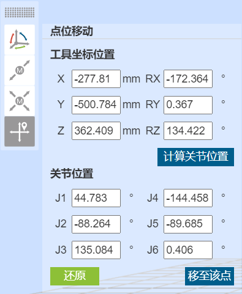
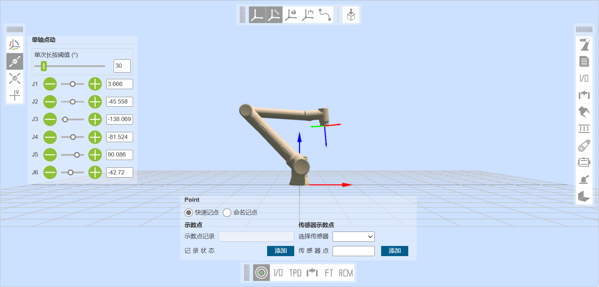
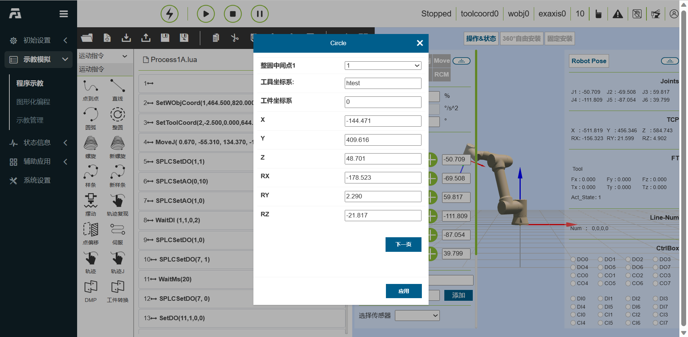
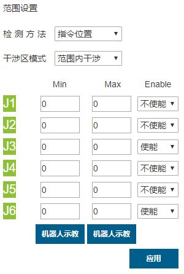

示教器软件解析
=========================

.. toctree:: 
   :maxdepth: 6

基础信息
-----------

系统简介
~~~~~~~~~~~

示教器软件是针对机器人开发的配套软件，运行于示教器操作系统中，其主要功能和技术特点如下：

-  能够对机器人进行示教程序的编写；
-  能够实时显示机器人位置坐标，三维模拟实体机器人，并能控制机器人运动；
-  能够实现对机器人的单轴点动以及各轴联动操作；
-  能够查看控制IO状态；
-  用户可以修改密码、查看系统信息等。

启动软件
~~~~~~~~~~~

1. 控制箱上电；
2. 示教器打开浏览器访问目标网址192.168.58.2；
3. 输入用户名和密码点击登录即可登录系统。

用户登录及权限管理
~~~~~~~~~~~~~~~~~~~~

-  操作员（初始用户名：operator，密码：123）
-  程序员（初始用户名：programmer，密码：123）
-  管理员（初始用户名：admin，密码：123）

用户账户主要分为三个等级，操作员少部分功能可以使用，程序员部分功能限制，管理员无功能限制。其中手动高速功能作为比较重要的安全保护功能，只有程序员和管理员可以使用，操作员没有手动高速功能，即操作员在手动模式下控制机器人运动，机器人可以达到的最高速度为250mm/s，以起到保护的作用，具体权限如下表所示。

.. figure:: teaching_pendant_software/001.png
   :width: 6in
   :align: center

.. centered:: 表格 3.1‑1 权限管理

登录界面如图表3.1‑1登录界面所示。

.. figure:: teaching_pendant_software/002.png
   :width: 6in
   :align: center

.. centered:: 图表 3.1‑1 登录界面

登录成功后，系统会加载模型等数据，加载完毕后进入初始页面。

系统初始界面
------------------

登录成功后系统进入“初始界面”，初始界面展示了示教器主要包含法奥LOGO及返回初始页面按钮、菜单栏、菜单栏缩放按钮、机器人操作区、控制区、状态区、三维模拟机器人以及位姿及IO信息区，一共八个区域。如图表3.2‑1系统初始界面示意图所示。

.. image:: teaching_pendant_software/003.png
   :align: center
   :width: 6in

.. centered:: 图表 3.2‑1 系统初始界面示意图

控制区
~~~~~~~~~

.. note:: 
   .. image:: teaching_pendant_software/004.png
      :width: 0.75in
      :height: 0.75in
      :align: left

   名称：**使能按钮**
   
   作用：使能机器人

.. note:: 
   .. image:: teaching_pendant_software/005.png
      :width: 0.75in
      :height: 0.75in
      :align: left

   名称：**开始按钮**
   
   作用：上传并开始运行示教程序

.. note:: 
   .. image:: teaching_pendant_software/006.png
      :width: 0.75in
      :height: 0.75in
      :align: left

   名称：**停止按钮**
   
   作用：停止当前示教程序运行

.. note:: 
   .. image:: teaching_pendant_software/007.png
      :width: 0.75in
      :height: 0.75in
      :align: left

   名称：**暂停/恢复按钮**
   
   作用：暂停和恢复当前示教程序

状态栏
~~~~~~~~~~~~

.. note:: 
   .. image:: teaching_pendant_software/008.png
      :width: 2.25in
      :height: 0.75in
      :align: left

   名称：**机器人状态**
   
   作用：Stopped-停止，Running-运行，Pause-暂停，Drag-拖动

.. note:: 
   .. image:: teaching_pendant_software/009.png
      :width: 2.25in
      :height: 0.75in
      :align: left

   名称：**工具坐标系编号**
   
   作用：展示当前应用的工具坐标系编号
   
.. note:: 
   .. image:: teaching_pendant_software/010.png
      :width: 2.25in
      :height: 0.75in
      :align: left

   名称：**运行速度百分比**
   
   作用：机器人当前模式运行时速度

.. note:: 
   .. image:: teaching_pendant_software/011.png
      :width: 2.25in
      :height: 0.75in
      :align: left

   名称：**机器人运行正常状态**
   
   作用：当前机器人正常运行

.. note:: 
   .. image:: teaching_pendant_software/012.png
      :width: 2.25in
      :height: 0.75in
      :align: left

   名称：**机器人运行错误状态**
   
   作用：当前机器人运行有错误

.. note:: 
   .. image:: teaching_pendant_software/013.png
      :width: 2.25in
      :height: 0.75in
      :align: left

   名称：**自动模式**
   
   作用：机器人自动运行模式

.. note:: 
   .. image:: teaching_pendant_software/014.png
      :width: 2.25in
      :height: 0.75in
      :align: left

   名称：**示教模式**
   
   作用：机器人示教运行模式

.. note:: 
   .. image:: teaching_pendant_software/015.png
      :width: 2.25in
      :height: 0.75in
      :align: left

   名称：**机器人拖动状态**
   
   作用：当前机器人可拖动

.. note:: 
   .. image:: teaching_pendant_software/016.png
      :width: 2.25in
      :height: 0.75in
      :align: left

   名称：**机器人拖动状态**
   
   作用：当前机器人不可拖动

.. note:: 
   .. image:: teaching_pendant_software/017.png
      :width: 2.25in
      :height: 0.75in
      :align: left

   名称：**连接状态**
   
   作用：机器人已连接

.. note:: 
   .. image:: teaching_pendant_software/017-1.png
      :width: 2.25in
      :height: 0.75in
      :align: left

   名称：**未连接状态**
   
   作用：机器人未连接

.. note:: 
   .. image:: teaching_pendant_software/018.png
      :width: 2.25in
      :height: 0.75in
      :align: left

   名称：**账户信息**
   
   作用：显示用户名和权限及登出用户

菜单栏
~~~~~~~~~~~~

菜单栏如表格3.2‑1示教器菜单分栏

.. image:: teaching_pendant_software/019.png
   :width: 6in
   :align: center

.. centered:: 表格 3.2‑1 示教器菜单分栏

操作区
~~~~~~~~~~

IO设置可参考 4.5 控制箱I/O 中的\ `4.5.1 I/O设置 <#id26>`__\ 。

Joint、Base等功能可参考\ `4.6 机器人操作 <#id30>`__\ 。

三维模拟机器人
----------------

三维虚拟轨迹和导入工具模型
~~~~~~~~~~~~~~~~~~~~~~~~~~~

**轨迹绘制**：运行示教程序时，打开轨迹绘制功能，机器人三维模型会描绘机器人运动的轨迹路线。

**导入工具模型**：点击“导入”按钮，导入工具模型后即可在机器人末端进行工具模型展示，目前支持的工具模型文件格式有STL和DAE。

.. image:: teaching_pendant_software/020.png
   :width: 3in
   :align: center

.. centered:: 图表 3.3‑1 虚拟轨迹绘制及工具模型导入

机器人坐标系系统三维可视化展示
~~~~~~~~~~~~~~~~~~~~~~~~~~~~~~~

在WebAPP机器人三维虚拟区域中创建各类三维虚拟坐标系，以基坐标系展示为例，如下图所示。其中X轴红色，Y轴绿色，Z轴蓝色。

**基坐标系**：基坐标系WebAPP中系统机器人三维虚拟区域中进行默认开启展示，固定标记在机器人基座底部中心。三维虚拟基坐标系可进行手动关闭展示。

.. centered:: 图表 3.3‑2 基坐标系显示关闭与打开

**工具坐标系**：工具坐标系默认开启展示,可手动关闭。在WebAPP启动并且用户登录成功后，获取当前应用的工具坐标系名称和对应参数数据，初始化当前工具坐标系。

使用的过程中应用其他工具坐标系时，当应用工具坐标系指令成功后，先将机器人三维虚拟区域中已有的工具坐标系清除，再将新应用的工具坐标系参数数据传入三维坐标系生成API进行工具坐标系生成，生成后完成在机器人三维虚拟区域中进行对应展示。

.. image:: teaching_pendant_software/022.png
   :width: 6in
   :align: center

.. centered:: 图表 3.3‑3 工具坐标系显示

**工件坐标系**：工件坐标系默认关闭，可以进行手动开启展示。流程与工具坐标系一致。

.. image:: teaching_pendant_software/023.png
   :width: 6in
   :align: center

.. centered:: 图表 3.3‑4 工件坐标系显示

**外部轴坐标系**：外部轴坐标系默认关闭，可以进行手动开启展示。流程与工具坐标系一致。

.. image:: teaching_pendant_software/024.png
   :width: 6in
   :align: center

.. centered:: 图表 3.3‑5 外部轴坐标系显示

机器人安装方式设置和展示
~~~~~~~~~~~~~~~~~~~~~~~~~~~

机器人默认安装方式为水平安装，当机器人安装方式更改时，需及时在此页面设置机器人的实际安装方式，以保证机器人正常工作。

用户点击机器人三维虚拟展示区域中的“固定安装”选项卡，进入机器人固定安装方式设置页面，选择“正装”、“倒装”或者“侧装”，点击点击“应用”按钮完成机器人安装方式设置。

.. image:: teaching_pendant_software/025.png
   :width: 6in
   :align: center

.. centered:: 图表 3.3‑6 固定安装

考虑到更加灵活丰富的机器人部署场景，我们提供了自由安装功能，用户点击机器人三维虚拟展示区域中的“360度自由安装”选项卡，进入机器人自由安装方式设置页面。手动调整“基座倾斜”和“基座旋转”角度，三维模型会对应展示安装效果。修改后点击“应用”按钮即可完成机器人安装方式设置。

.. image:: teaching_pendant_software/026.png
   :width: 6in
   :align: center
   
.. centered:: 图表 3.3‑7 360度自由安装

机器人设置
--------------

工具坐标
~~~~~~~~~~~~~~~~

在“初始设置”中的“机器人设置”的菜单栏下，点击“工具坐标”进入工具坐标界面。工具坐标可实现工具坐标的修改、清空与应用。工具坐标系的下拉列表中共有15个编号，选择对应的坐标系（坐标系名称可自定义）后会在下方显示对应坐标值，工具类型以及安装位置（仅在传感器类型工具下显示），选择某一坐标系后点击“应用”按钮，当前使用的工具坐标系变为所选择的坐标，如图表3.4-1所示。

   
.. centered:: 图表 3.4‑1 设置工具坐标

点击“修改”可根据提示对该编号的工具坐标系进行重新设置。工具标定方法分为四点法和六点法，四点法只标定工具TCP，即工具中心点的位置，其姿态默认与末端姿态一致，六点法则在四点法的基础上增加了两点，用于标定工具的姿态，这里我们以六点法为例进行讲解。

.. centered:: 图表 3.4‑2 设置工具坐标

在机器人空间选择一个固定的点，将工具以三个不同的姿态移至固定点，依次设置1-3点。如图3.4-3左上方所示。将工具垂直移至固定点设置点4，如图3.4-3右上方所示。保持该姿态不变，利用基坐标移动，在水平方向移动一段距离，设定点5，该方向即设定的工具坐标系X轴方向。回到固定点，垂直往上移动一段距离，设定点6，该方向即工具坐标系Z轴方向。点击计算按钮计算工具位姿，若需重新设置，点击取消按修改钮重新进行新建工具坐标系步骤。

.. image:: teaching_pendant_software/029.png
   :width: 6in
   :align: center

.. centered:: 图表 3.4‑3 六点法示意图

完成最后步骤后，点击“完成”可返回工具坐标界面，点击“保存”即可存储刚才建立的工具坐标系。

外部工具坐标
~~~~~~~~~~~~~~~~

在“初始设置”中的“机器人设置”的菜单栏下，点击“外部工具坐标系”进入外部工具坐标系界面。

外部工具坐标系设置界面中可实现外部工具坐标的修改、清空与应用。

外部工具坐标系的下拉列表中共有15个编号，从etoolcoord0~etoolcoord14，选择对应的坐标系后会在下方显示对应坐标值，选择某一坐标系后点击“应用”按钮，当前使用的工具坐标系变为所选择的坐标，如图3.4-4所示。

.. centered:: 图表 3.4‑4 外部工具坐标

点击“修改”可根据提示对该编号的工具坐标系进行重新设置，如图3.4-5所示。

.. image:: teaching_pendant_software/031.png
   :width: 3in
   :align: center

.. centered:: 图表 3.4‑5 六点法示意图

**1.三点法确定外部TCP**

1. **设置点1**：已测量工具的TCP移动至外部TCP，点击设置点1按钮；

2. **设置点2**：由点1沿外部TCF坐标系X轴移动一段距离，点击设置点2按钮；

3. **设置点3**：回到点1，由点1沿外部TCF坐标系Z轴移动一段距离，点击设置点3按钮；

4. **计算**：点击计算按钮得到外部TCF；

**2.六点法确定工具TCF**

1. **设置点1-4**：在机器人空间选择一个固定的点，将工具从四个不同的角度移至所选的点上，依次设置1-4点；

2. **设置点5**：回到固定的点沿工具TCF坐标系X轴移动一段距离，点击设置点5按钮；

3. **设置点6**：回到固定的点沿工具TCF坐标系Y轴移动一段距离，点击设置点6按钮；

4. **计算**：点击计算按钮得到工具TCF；

若需重新设置，点击取消按钮重新进去新建工具坐标系步骤。

完成最后步骤后，点击“完成”可返回工具坐标界面，点击“保存”即可存储刚才建立的工具坐标系。

工件坐标
~~~~~~~~~~~

在“初始设置”中的“机器人设置”的菜单栏下，点击“工件坐标”进入工件坐标界面。工件坐标可实现工件坐标的修改、清空与应用。工件坐标系的下拉列表中共有15个编号，选择对应的坐标系（wobjcoord0~
wobjcoord14），后会在下方的“坐标系坐标”中显示对应坐标值，选择某一坐标系后点击“应用”按钮，当前使用的工件坐标系变为所选择的坐标，如图表3.4-6所示。

.. centered:: 图表 3.4‑6 设置工件坐标

工件坐标系一般是基于工具基础上进行标定的，需要在已建立工具坐标系的基础上进行工件坐标系的建立。点击“修改”可根据提示对该编号的工件坐标系进行重新设置。固定好工件，选择标定方法“原点-X轴-Z轴”或“原点-X轴-XY+平面”，两种标定方法前两点的选取都是一致的，第三点有所区别，选第一种方法标定的是工件坐标系的Z方向，选第二种方法标定的是XY+平面上一点，根据图示标定即可。点击计算按钮计算工件位姿，若需重新设置，点击取消按修改钮重新进行新建工件坐标系步骤。

.. centered:: 图表 3.4‑7 三点法示意图

完成最后步骤后，点击“完成”可返回工件坐标界面，点击“保存”即可存储刚才建立的工件坐标系。

扩展轴坐标
~~~~~~~~~~~~~~

在“初始设置”中的“机器人设置”的菜单栏下，点击“扩展轴坐标系”进入扩展轴坐标系界面。扩展轴坐标系设置界面中可实现扩展轴坐标的修改、清空与应用。

扩展轴坐标系的下拉列表中共有5个编号，从eaxis0~eaxis4，选择对应的坐标系后会在下方显示对应坐标值，选择某一坐标系后点击“应用”按钮，当前使用的扩展轴坐标系变为所选择的坐标，如图3.4-8所示。

.. centered:: 图表 3.4‑8 扩展轴坐标

点击“修改”可根据提示对该编号的扩展轴标系进行重新设置，如图3.4-9所示。标定之前先清空需要标定的扩展轴坐标系，应用此扩展轴坐标系。先看第一种扩展轴方案-直线导轨的标定方法。选择扩展轴的编号，获取信息可以获取对应扩展轴的驱动器信息，我们可以根据该信息进行参数配置。配置完后设置DH参数，直线导轨方案默认为0。设置机器人相对扩展轴位置，直线导轨为扩展轴上。若不标定，点击保存即可，此时扩展轴只能异步运动。

.. centered:: 图表 3.4‑9 直线导轨配置

若需跟机器人同步运动，点击标定，进入标定界面，在扩展轴零点处，点击操作区Eaxis使能扩展轴，将机器人末端中心（应用工具坐标系下用工具末端点）以两个不同姿势对准扩展轴上固定一点，分别设定点1和点2。去除使能，将扩展轴移动一段距离，使能后，同样将机器人末端中心点对准之前固定点，设定点3。去除使能，将扩展轴移至零点，使能扩展轴。将机器人末端中心点移至固定点垂直往上空间一点，设定点4，计算坐标系并保存。

.. centered:: 图表 3.4‑10 直线导轨标定

接下来看第二种扩展轴方案-变位机的标定方法。变位机由两个扩展轴组成，选择扩展轴的编号，获取信息可以获取对应扩展轴的驱动器信息，我们可以根据该信息进行参数配置。配置完后设置DH参数，根据图示测量出变位机的DH参数，输入到输入框中。设置机器人相对扩展轴位置，变位机为扩展轴外。若不标定，点击保存即可，此时扩展轴只能异步运动。

.. image:: teaching_pendant_software/037.png
   :width: 3in
   :align: center

.. centered:: 图表 3.4‑11 变位机配置

若需跟机器人同步运动，点击标定，进入标定界面，在扩展轴零点处，点击操作区Eaxis使能扩展轴，在变位机上建立坐标系，选择一点，输入该点在该坐标系下的笛卡尔位姿，比如选择Y正向一点，测出Y为100mm，则输入如图所示数值，点击参考点，即可设定参考点。后续四个标定点都需将机器人末端中心（应用工具坐标系下用工具末端点）对准该参考点。

.. image:: teaching_pendant_software/038.png
   :width: 3in
   :align: center

.. centered:: 图表 3.4‑12 变位机参考点配置

将机器人末端中心（应用工具坐标系下用工具末端点）对准该参考点，设定点1，点击操作区Eaxis点动两个轴一小段距离，将机器人末端中心对准参考点，设定点2，继续点动两个轴，机器人末端中心对准参考点，设定点3，最后继续点动两个轴，将机器人末端中心对准参考点，设定点4，点击计算，得到坐标系结果，点击保存，应用即可。

.. image:: teaching_pendant_software/039.png
   :width: 3in
   :align: center

.. centered:: 图表 3.4‑13 变位机标定

接下来看第三种扩展轴方案-单轴变位机的标定方法。该变位机由一个旋转扩展轴组成，选择扩展轴的编号，获取信息可以获取对应扩展轴的驱动器信息，我们可以根据该信息进行参数配置。DH参数设置为0。设置机器人相对扩展轴位置，变位机为扩展轴外。若不标定，点击保存即可，此时扩展轴只能异步运动。

.. image:: teaching_pendant_software/040.png
   :width: 3in
   :align: center

.. centered:: 图表 3.4‑14 单轴变位机配置

若需跟机器人同步运动，点击标定，进入标定界面，在扩展轴零点处，点击操作区Eaxis使能扩展轴，在变位机上建立坐标系，选择一点，输入该点在该坐标系下的笛卡尔位姿，点击“参考点”，即可设定参考点。后续四个标定点都需将机器人末端中心（应用工具坐标系下用工具末端点）对准该参考点。将机器人末端中心（应用工具坐标系下用工具末端点）对准该参考点，设定点1，点击操作区Eaxis点动旋转轴一小段距离，将机器人末端中心对准参考点，设定点2，继续点动旋转轴，机器人末端中心对准参考点，设定点3，最后继续点动旋转轴，将机器人末端中心对准参考点，设定点4，点击计算，得到坐标系结果，点击保存，应用即可。

.. image:: teaching_pendant_software/041.png
   :width: 3in
   :align: center

.. centered:: 图表 3.4‑15 单轴变位机标定

碰撞等级
~~~~~~~~~~

在“初始设置”中的“机器人设置”的菜单栏下，点击“碰撞等级”进入碰撞等级界面。

碰撞等级分为一到十级，一到三级检测比较灵敏，机器人需要在推荐速度下运行。同时可以选择自定义百分比设置，100%即对应十级。碰撞策略可以设置机器人碰撞后的处理方式，分为报错停止和继续运动，用户可以根据具体使用需求来设定。如图表3.4-16。

.. image:: teaching_pendant_software/042.png
   :width: 3in
   :align: center

.. centered:: 图表 3.4‑16 碰撞等级示意图

软限位
~~~~~~~~~

在“初始设置”中的“机器人设置”的菜单栏下，点击“软限位”进入软限位界面。

机器人行程内可能存在其它设备，限位角度可对机器人进行软限位，使机器人运动不超过某个坐标值，防止机器人碰撞。触发软限位机器人停止为机器人自动触发，无停止距离。

管理员可使用默认值也可输入角度值。输入角度值，可分别对机器人关节正负角度进行限位，当输入值超出\ `表1.4-1 机器人基本参数 <installation.html#id22>`__\ 节所列出的机器人关节软限位角度值，会将限位角度调整为所能设定最大值。当机器人报出超出指令超限时，需要进入拖动模式，将机器人关节拖动至限位角度之内。界面如3.4-17所示。

.. centered:: 图表 3.4‑17 机器人限位示意图

末端负载
~~~~~~~~~~

在“初始设置”中的“机器人设置”的菜单栏下，点击“末端负载”进入末端负载界面。

用户可以根据所使用工具的参数设定对应参数，负载重量为0~5kg，质心坐标的范围为0~1000，如3.4-18所示。

.. image:: teaching_pendant_software/044.png
   :width: 3in
   :align: center

.. centered:: 图表 3.4‑18 负载设定示意图

用户对工具质量或质心不确定的情况下，可以通过负载辨识功能对工具数据测定。

在进行测定之前，确保负载已安装。点击“工具数据测定”按键，进入负载运动测试界面。

.. image:: teaching_pendant_software/045.png
   :width: 3in
   :align: center

.. centered:: 图表 3.4‑19 负载辨识关节设置

点击“负载辨识启动”进行测试，如遇紧急情况请及时停止运动。

.. image:: teaching_pendant_software/046.png
   :width: 3in
   :align: center

.. centered:: 图表 3.4‑20 负载辨识启动

运动结束后，点击“获取辨识结果”按键，获取计算出的工具数据，并显示在页面上，如需应用到负载数据中，点击应用即可

.. centered:: 图表 3.4‑21 负载辨识结果

摩擦力补偿
~~~~~~~~~~~

在“初始设置”中的“机器人设置”的菜单栏下，点击“摩擦力补偿”进入摩擦力补偿设置界面。

**摩擦力补偿系数**：摩擦力补偿所针对的使用场景仅在拖动模式下，摩擦力补偿系数可设置范围为0~1，数值越高，拖动时补偿的力就越大。摩擦力补偿系数根据安装方式的不同需要单独设置每个轴的补偿系数。

**摩擦力补偿开关**：用户可根据实际机器人及使用习惯开启或关闭摩擦力补偿。

.. image:: teaching_pendant_software/048.png
   :width: 3in
   :align: center

.. centered:: 图表 3.4-22 摩擦力补偿设置

速度缩放
~~~~~~~~~~~~~

在“初始设置”中的“机器人设置”的菜单栏下，点击“速度缩放设置”进入速度缩放设置界面。

该功能是设置手动/自动下机器人运行的速度，若当前为自动运行模式，则设置的速度为机器人自动运行速度，若当前为手动运行模式，则设置的速度为机器人手动运行速度。设置数值为机器人标准速度百分比，若设置100，即标准速度的百分之百（标准速度请翻阅\ `表格1.4-1 机器人基本参数 <installation.html#id22>`__\ ）。

.. centered:: 图表 3.4-23 速度缩放设置

速度设置成功后，相应的速度状态栏会更改为设置的数值，速度值设置的范围是0~100。

配置导入导出
~~~~~~~~~~~~~~~

在“初始设置”中的“机器人设置”的菜单栏下，点击“配置导入导出”进入配置导入导出界面。

**导入机器人配置文件**：用户导入文件名为user.config的机器人配置文件，该文件包含机器人设置功能中的各个参数。点击“选择文件”按钮，选中修改完且内容符合规范的配置文件，点击“导入”按钮，当出现导入完成的提示时，文件中的参数即被成功设置。

**导出机器人配置文件**：点击“导出”按钮，即可将机器人配置文件user.config导出到本地。

**导入控制器数据库**：用户导入文件名为fr_controller_data.db的控制器数据库文件。点击“选择文件”按钮，选中修改完且内容符合规范的数据库文件，点击“导入”按钮，当出现导入完成的提示时，文件中的参数即被成功设置。

**控制器数据库**：点击“导出”按钮，即可将机器人控制器数据库文件导出到本地。

.. centered:: 图表 3.4-24 配置导入导出

控制箱I/O
-----------

I/O设置
~~~~~~~~~~~

点击三维模型左侧操作区“IO”按钮可进入IO设置界面，如图表3.5-1所示，该界面中可实现对机器人控制箱中数字输出、模拟输出（0-10v）和末端工具数字输出、模拟输出（0-10v）进行手动控制：

.. image:: teaching_pendant_software/051.png
   :width: 3in
   :align: center

.. centered:: 图表 3.5‑1 I/O设置界面

- DO操作：选择端口号，若该DO为低电平，则右侧操作按键显示ON，点击按键即设置该DO为高电平。

- AO操作：选择端口号，右侧输入框输入值（0-100），该数值为百分比，设置100即表示设置该AO端口为10v。

I/O状态显示
~~~~~~~~~~~~~

三维模型右侧状态显示区会显示当前IO的状态，数字输入与数字输出中，若该端口电平为高，则该点显示为绿色，若为低，则显示为白色；模拟输入和模拟输出显示值为0-100，100即表示10v。

.. centered:: 图表 3.5‑2 状态显示界面

I/O滤波
~~~~~~~~~~

点击左侧菜单栏“初始设置”中“机器人设置”，点击“IO滤波”子菜单进入IO滤波时间设置界面，滤波时间设置界面包括：控制箱DI滤波时间，末端板DI滤波时间、控制箱AI0滤波时间、控制箱AI1滤波时间、末端板AI0滤波时间，如图表3.5-3所示。用户可以根据自己的需求来设定对应的参数，点击相应的设置按钮即可。

.. image:: teaching_pendant_software/053.png
   :width: 3in
   :align: center

.. centered:: 图表 3.5‑3 滤波界面

I/O配置
~~~~~~~~~

点击左侧菜单栏“初始设置”中“机器人设置”，分别点击“DI配置”和“DO配置”子菜单进入DI和DO配置界面。其中控制箱CI0-CI7和CO0-CO7可配置，末端DI0和DI1可配置。在生产中协作机器人需要连接外设时或因故障或者其它因素突然停止，需要输出DO信号，实现声光报警提示，输入可配置功能如表格3.5‑1控制箱输入可配置功能所示。

.. image:: teaching_pendant_software/054.png
   :width: 6in
   :align: center

.. centered:: 表格 3.5‑1 控制箱输入可配置功能

输出可配置功能如表3.5-2和表3.5-3所示。

.. image:: teaching_pendant_software/055.png
   :width: 6in
   :align: center

.. centered:: 表格 3.5‑2 控制箱输出可配置功能

.. centered:: 表格 3.5‑3 末端输入可配置功能

其中控制箱默认配置：CO0为1-机器人报错，CO1为2-机器人运动中。

.. image:: teaching_pendant_software/057.png
   :width: 6in
   :align: center

.. centered:: 图表 3.5‑4 控制箱DI和DO配置

末端DI默认配置：DI0拖动示教，DI1示教点记录。

.. centered:: 图表 3.5‑5 末端DI配置

配置完成后，可在对应状态下，于控制箱I/O页面中查看相应的输出DO状态。（注意：已配置DI、DO不能出现于示教编程页面）

机器人操作
------------

示教点记录
~~~~~~~~~~~~~~

手动示教控制区主要是在示教模式中对考坐标系进行设定，并实时显示机器人各轴角度与坐标值，并可对示教点进行命名保存。

保存示教点时，该示教点的坐标系为当前机器人应用的坐标系。在该操作区上方可以对示教点速度，加速度设置，设置数值为机器人标准速度百分比，若设置100，即标准速度的百分之百（标准速度请翻阅\ `表1.4-1 机器人基本参数 <installation.html#id22>`__\）。

传感器示教点，选择已经标定的传感器类型工具，输入点名称，点击添加，保存的点的位置为传感器识别到点的位置。

.. image:: teaching_pendant_software/059.png
   :width: 3in
   :align: center

.. centered:: 图表 3.6‑1 手动操作区示意图

.. important:: 
   第一次使用时，请设置30这样较小的速度值，熟悉机器人运动，以免发生意外情况。

Joint运动
~~~~~~~~~~~

Joint运作下，中间的6个滑块条分别表示对应轴的角度，joint运动分单轴点动和多轴联动

**单轴点动**：用户可通过操作左右两边圆形按钮来控制机器人运动，如图表3.6-2。在手动模式和关节坐标系下，对机器人某一关节进行转动操作。当机器人超出运动范围（软限位）而停止时，可以利用单轴点动进行手动操作，将机器人移出超限位置。单轴点动在进行粗略定位和较大幅度移动时，会比其他操作模式更快捷方便。

设置“长按运动阈值”（长按按钮时，机器人运行的最大距离，输入值得范围0~300）参数，长按圆形按钮控制机器人运行，若在机器人运行中松开按钮，机器人会立即停止运动，若一直按住不松开按钮，机器人会运行长按运动阈值所设置的值后停止运动。

**多轴联动**：用户可操作中间六个滑块来调整机器人相应的目标位置，如图表3.6-3，可通过观察三维虚拟机器人来确定目标位置，若调整的位置不符合自己的预期，点击“还原”按钮，使得三维虚拟机器人回到初始的位置。当用户确定目标位置后，可点击“应用”按钮，实体机器人便会进行相应的运动。

.. centered:: 图表 3.6‑2 单轴点动和多轴联动示意图

Base点动
~~~~~~~~~~

在基坐标系下，可以操作左右两边圆形按钮控制机器人，在X，Y，Z轴上直线移动或绕着RX，RY，RZ旋转，中间的6个滑块条分别表示在对应坐标轴上的位置与运动范围，如图表3.6-3。Base点动的功能与Joint运动中单轴点动的功能相似。

.. image:: teaching_pendant_software/061.png
   :width: 3in
   :align: center

.. centered:: 图表 3.6‑3 Base点动示意图

.. important:: 
   可随时释放该按钮，使机器人停止运动。在必要情况下，按急停按钮使机器人停止。

Tool点动
~~~~~~~~~~

选择工具坐标系，可以操作左右两边圆形按钮控制机器人，在X，Y，Z轴上直线移动或绕着RX，RY，RZ旋转，中间的6个滑块条分别表示在对应坐标轴上的位置与运动范围，如图表3.6-4。Tool点动的功能与Joint运动中单轴点动的功能相似。

.. image:: teaching_pendant_software/062.png
   :width: 3in
   :align: center

.. centered:: 图表 3.6‑4 Tool点动示意图

Wobj点动
~~~~~~~~~~

选择工件点动，可以操作左右两边圆形按钮控制机器人，在工件坐标系下，沿着X，Y，Z轴上直线移动或绕着RX，RY，RZ旋转，中间的6个滑块条分别表示在对应坐标轴上的位置与运动范围，如图表3.6-5。Wobj点动的功能与Joint运动中单轴点动的功能相似。

.. image:: teaching_pendant_software/063.png
   :width: 3in
   :align: center

.. centered:: 图表 3.6‑5 Wobj点动示意图

Move移动
~~~~~~~~~~

选择Move移动，可以直接输入笛卡尔坐标值，点击“计算关节位置”，关节位置显示为计算后结果，确认无危险，可以点击“移至该点”控制机器人运动至输入的笛卡尔位姿。

.. image:: teaching_pendant_software/064.png
   :width: 3in
   :align: center

.. centered:: 图表 3.6‑6 Move移动示意图

Eaxis移动
~~~~~~~~~~~~

选择Eaxis移动，该功能为扩展轴的点动功能，需要在配置好扩展轴的前提下，使用该点动功能控制扩展轴，详见“第四章机-器人外设-扩展轴外设配置”。

.. image:: teaching_pendant_software/065.png
   :width: 3in
   :align: center

.. centered:: 图表 3.6‑7 Eaxis移动示意图

TPD（示教编程）
~~~~~~~~~~~~~~~~~

示教编程（TPD）功能操作步骤如下：

- **Step1记录初始位置**：进入三维模型左侧操作区，记录机器人当前位置。在编辑框内设定好点的名称，点击“保存”按钮，若保存成功，则提示“保存点成功”；

- **Step2配置轨迹记录参数**：点击TPD进入“TPD”功能项配置轨迹记录参数，设定好轨迹文件的名称、位姿类型以及采样周期，配置DI和DO，可以在记录TPD轨迹的过程中，通过触发DI来记录对应需要输出的DO，如图表3.6-8；

.. image:: teaching_pendant_software/066.png
   :width: 3in
   :align: center

.. centered:: 图表 3.6‑8 TPD轨迹记录

- **Step3检查机器人模式**：检查机器人模式是否处于手动模式下，若不处于则切换至手动模式，在手动模式下可通过两种方式切换到托动示教模式，一种是长按末端按钮，一种是界面拖动模式切换按键，在TPD记录是推荐从界面切换机器人进入托动示教模式。如图表3.6-9所示；

.. image:: teaching_pendant_software/067.png
   :width: 3in
   :align: center

.. centered:: 图表 3.6‑9 机器人模式

- **Step4开始记录**：点击“开始记录”按钮开始轨迹记录，拖动机器人进行动作示教。此外，末端DI配置中有“TPD记录启动/停止”功能配置项，通过配置此功能，用户可以通过外部信号触发“开始记录”轨迹功能，需要注意的是，通过外部信号开始记录轨迹，首先得在页面先进行TPD轨迹的信息配置。

- **Step5停止记录**：动作示教完成后，点击“停止记录”按钮，停止轨迹记录，然后通过拖动示教切换按键使机器人退出拖动示教模式。示教器接收到“停止轨迹记录成功”即表示轨迹记录成功。同步骤4，在配置“TPD记录启动/停止”功能后，可以通过外部信号触发停止记录。

- **Step6示教编程**：点击新建，选择空白模板，点击进入PTP功能编程项，选择刚保存的初始位置点，点击“添加”按钮，应用完成后，在程序文件中会显示一条PTP指令；然后点击进入TPD功能编程项，选择刚刚记录的轨迹，设定是否平滑以及速度缩放比例，点击“添加”按钮，应用完成后，在程序文件中会显示一条MoveTPD指令，如图表3.6-10所示；

.. image:: teaching_pendant_software/068.png
   :width: 6in
   :align: center

.. centered:: 图表 3.6‑10 TPD编程

- **Step7轨迹复现**：示教程序编辑完成后，切换至自动运行模式，点击界面上方”开始运行”图标开始运行程序，机器人开始复现示教的动作。

- **Step8轨迹编辑**：TPD轨迹编辑区可对轨迹可视化展示和编辑裁切，以达到TPD轨迹预分析和精简。选择对应轨迹获取点，那么用户记录的轨迹点会展示在机器人三维空间内，其次用户可以拖动“Start”和“End”滚动条对轨迹的起点和终点进行模拟复现和剪辑。

TPD文件删除与异常处理：

- **轨迹文件删除**：点击进入TPD功能项，选择需要删除的轨迹文件，点击”删除轨迹”按钮，若删除成功，则会收到删除成功提示。

- **异常处理：**

  +  **指令点数超限**：一条轨迹最多可记录2万个点数，当超过2万个点时，控制器不再记录超过的点数，并向示教器发出“指令点数超限”告警提示，此时需点击停止记录；

  +  **TPD指令间隔过大**：若示教器报错TPD指令间隔过大，则应检查机器人是否回到了记录前的初始位置，若机器人回到了初始位置依然报错TPD指令间隔过大，则删除当前轨迹重新记录一条新的轨迹；

  +  TPD操作过程中若出现其他异常情况，则应通过示教器或急停按钮立即停止机器人操作，检查原因。

.. important:: 
   TPD功能操作过程中应严格按照示教器上相应的提示进行操作。

示教模拟
----------

简介
~~~~~~~

点击左侧命令可以向程序树添加程序节点。

程序运行时，当前执行的程序节点灰色高亮显示。

在手动模式下，点击节点右侧第一个图标可以使机器人单独执行该指令，第二个图标为编辑该节点内容。

.. image:: teaching_pendant_software/069.png
   :width: 6in
   :align: center

.. centered:: 图表 3.7‑1 程序树界面

工具栏
~~~~~~~~~~

使用程序树底部的工具栏修改程序树。

.. note:: 
   .. image:: teaching_pendant_software/070.png
      :width: 1.5in
      :height: 0.75in
      :align: left

   名称：**打开**
   
   作用：打开用户程序文件

.. note:: 
   .. image:: teaching_pendant_software/071.png
      :width: 1.5in
      :height: 0.75in
      :align: left

   名称：**新建**
   
   作用：选择模板新建程序文件
   
.. note:: 
   .. image:: teaching_pendant_software/072.png
      :width: 1.5in
      :height: 0.75in
      :align: left

   名称：**导入**
   
   作用：导入文件到用户程序文件夹中

.. note:: 
   .. image:: teaching_pendant_software/073.png
      :width: 1.5in
      :height: 0.75in
      :align: left

   名称：**导出**
   
   作用：导出用户程序文件到本地点。

.. note:: 
   .. image:: teaching_pendant_software/074.png
      :width: 1.5in
      :height: 0.75in
      :align: left

   名称：**保存**
   
   作用：保存文件编辑内容

.. note:: 
   .. image:: teaching_pendant_software/075.png
      :width: 1.5in
      :height: 0.75in
      :align: left

   名称：**另存为**
   
   作用：给文件重命名存放到用户程序或模板程序文件夹中。

.. note:: 
   .. image:: teaching_pendant_software/076.png
      :width: 1.5in
      :height: 0.75in
      :align: left

   名称：**复制**
   
   作用：复制一个节点，并允许将其用于其他操作（例如：将其粘贴到程序树的其他位置）。

.. note:: 
   .. image:: teaching_pendant_software/077.png
      :width: 1.5in
      :height: 0.75in
      :align: left

   名称：**粘贴**
   
   作用：允许您粘贴之前剪切或复制的节点。

.. note:: 
   .. image:: teaching_pendant_software/078.png
      :width: 1.5in
      :height: 0.75in
      :align: left

   名称：**剪切**
   
   作用：剪切一个节点，并允许将其用于其他操作（例如：将其粘贴到程序树的其他位置）。

.. note:: 
   .. image:: teaching_pendant_software/079.png
      :width: 1.5in
      :height: 0.75in
      :align: left

   名称：**删除**
   
   作用：从程序树中删除一个节点。

.. note:: 
   .. image:: teaching_pendant_software/080.png
      :width: 1.5in
      :height: 0.75in
      :align: left

   名称：**上移**
   
   作用：向上移动该节点。

.. note:: 
   .. image:: teaching_pendant_software/081.png
      :width: 1.5in
      :height: 0.75in
      :align: left

   名称：**下移**
   
   作用：向下移动该节点。

.. note:: 
   .. image:: teaching_pendant_software/082.png
      :width: 1.5in
      :height: 0.75in
      :align: left

   名称：**切换编辑模式**
   
   作用：程序树模式和lua编辑模式互相切换。

程序命令
~~~~~~~~~~~

左侧主要是程序命令的添加，点击各关键字上方图标进入详细界面，程序命令添加到文件中的操作主要分为两种，一种方式打开相关指令点击应用按键即可将该指令添加到程序中，另一种方式为先点击“添加”按键，此时命令并未保存到程序文件中，需要再点击“应用”方可将命令保存到文件中。第二种方式多出现在同类型指令多条下发的
情况，我们对该类型命令增加添加按键和显示已添加指令内容功能，点击添加按键可添加一条指令，已添加指令显示所有已添加的指令，点击“应用”即可将添加的指令保存到右侧已打开的文件中。

PTP命令
++++++++++++++++

点击“PTP”图标进入PTP命令编辑界面。

可以选择需要到达的点，平滑过渡时间设置可以实现该点到下一点的运动是连续的，是否偏移设置，可以选择基于基坐标系偏移和基于工具坐标偏移，并弹出x,y,z,rx,ry,rz偏移量设置，PTP具体路径为运动控制器自动规划的最优路径，点击“添加”、“应用”后可保存该条指令。

.. image:: teaching_pendant_software/083.png
   :width: 6in
   :align: center

.. centered:: 图表 3.7‑2 PTP指令界面

Lin命令
++++++++++++++++

点击“Lin”图标进入Lin命令编辑界面。

该指令功能与“PTP”指令相似，但该指令所到达点的路径为直线。

.. image:: teaching_pendant_software/084.png
   :width: 6in
   :align: center

.. centered:: 图表 3.7‑3 Lin指令界面

Arc命令
++++++++++++++++

点击“Arc”图标进入Arc命令编辑界面。

“Arc”指令为圆弧运动，包含两个点，第一点为圆弧中间过渡点，第二点为终点，过渡点和终点都可以对是否偏移进行设置，可以选择基于基坐标系偏移和基于工具坐标偏移，并弹出x,y,z,rx,ry,rz偏移量设置，终点可以设置平滑过渡半径，实现运动连续效果。

.. image:: teaching_pendant_software/085.png
   :width: 6in
   :align: center

.. image:: teaching_pendant_software/086.png
   :width: 6in
   :align: center

.. centered:: 图表 3.7‑4 Arc指令界面

Circle命令
++++++++++++++++

点击“Circle”图标进入Circle命令编辑界面。

“Circle”指令为整圆运动，包含两个点，第一点为整圆中间过渡点1，第二点为整圆中间过渡点2，过渡点2可以设置是否偏移，该偏移量同时生效于过渡点1和过渡点2。

.. image:: teaching_pendant_software/088.png
   :width: 6in
   :align: center

.. centered:: 图表 3.7‑5 Circle指令界面

Spiral命令
++++++++++++++++

点击“Spiral”图标进入Spiral命令编辑界面

“Spiral”指令为螺旋线运动，包含三个点，该三个点组成一个圆，在第三点设置页面，包含螺旋圈数，姿态修正角，半径增量和转轴方向增量这几个参数设置，螺旋圈数即该螺旋线的运动圈数，姿态修正角修正的是螺旋线结束时的姿态与螺旋线第一点的姿态，半径增量即每一圈半径的增量，转轴方向增量即螺旋轴方向的增量。设置
是否偏移，该偏移量生效于整个螺旋线的轨迹。

.. image:: teaching_pendant_software/089.png
   :width: 6in
   :align: center

.. centered:: 图表 3.7‑6 Spiral指令界面

N-Spiral命令
++++++++++++++++

点击“N-Spiral”图标进入N-Spiral命令编辑界面

“N-Spiral”指令为优化版螺旋线运动，该指令只需要一个点加各参数的配置实现螺旋线运动。机器人以当前位置作为起点，用户设置调试速度，是否偏移，螺旋圈数，螺旋倾角，初始半径，半径增量，转轴方向增量和旋转方向这几个参数，螺旋圈数即该螺旋线的运动圈数，螺旋倾角即工具Z轴与水平方向的夹角，姿态修正角修正的是螺旋线结束时的姿态与螺旋线第一点的姿态，初始半径即第一圈半径大小，半径增量即每一圈半径的增量，转轴方向增量即螺旋轴方向的增量，旋转方向即顺时针和逆时针。

.. image:: teaching_pendant_software/090.png
   :width: 6in
   :align: center

.. centered:: 图表 3.7‑7 N-Spiral指令界面

Spline命令
++++++++++++++++

点击“Spline”图标进入Spline命令编辑界面

该指令分为样条组起始，样条段和样条组结束三部分，样条组开始是样条运动的起始标志，样条段包含SPL、SLIN和SCIRC段，点击对应图标进入指令添加界面，样条组结束是样条运动的结束标志。

.. image:: teaching_pendant_software/091.png
   :width: 6in
   :align: center

.. centered:: 图表 3.7‑8 Spline指令界面

N-Spline命令
++++++++++++++++

点击“N-Spline”图标进入N-Spline命令编辑界面

该指令为Spline指令算法优化指令，后续会替代现有的Spline指令，该指令分为多点轨迹起始，多点轨迹段和多点轨迹结束三部分，多点轨迹开始是多点轨迹运动的起始标志，多点轨迹段即设置各个轨迹点，点击图标进入点位添加界面，多点轨迹结束是多点轨迹运动的结束标志，在此可以设置控制模式和调试速度，控制模式分
为给定控制点和给定路径点。

.. image:: teaching_pendant_software/092.png
   :width: 6in
   :align: center

.. centered:: 图表 3.7‑9 N-Spline指令界面

IO命令
++++++++++++++++

点击“IO”图标进入IO命令编辑界面

“IO”指令分为设置IO（SetDO/SPLCSetDO）和获取IO（GetDI/SPLCGetDI）两部分。

“SetDO/SPLCSetDO”该指令可设定指定的输出DO状态，包括16路控制箱数字输出和2路工具数字输出，状态选项“False”为闭，“True”为开，是否阻塞选项选择“阻塞”表示运动停止后设置DO状态，选择“非阻塞”选项表示在上一条运动过程中设置DO状态。平滑轨迹选项选择“Break”表示在平滑过渡半径结束后设置DO状态，选择“Serious”表示在平滑过渡半径运动过程中设置DO状态。当该指令是添加在辅助线程中，是否应用线程需要选择是，其他地方使用该指令选择否。点击“添加”、“应用”即可。

.. image:: teaching_pendant_software/093.png
   :width: 6in
   :align: center

.. centered:: 图表 3.7‑10 SetDO指令界面

在“GetDI/SPLCGetDI”指令中，选择想要获取端口号的数值，是否阻塞选项选择“阻塞”表示运动停止后获取DI状态，选择“非阻塞”选项表示在上一条运动过程中获取DI状态。当该指令是添加在辅助线程中，是否应用线程需要选择是，其他地方使用该指令选择否。选择完毕后点击“添加”、“应用”按钮即可。

.. image:: teaching_pendant_software/094.png
   :width: 6in
   :align: center

.. centered:: 图表 3.7‑11 GetDI指令界面

AI命令
++++++++++++++++

点击“AI”图标进入AI命令编辑界面

在该指令中，分为设置模拟输出（SetAO/SPLCSetAO）和获取模拟输入（GetAI/SPLCGetAI）两部分功能。

“SetAO/SPLCSetAO”选择需要设置的模拟输出，输入需要设置的值，范围为0-10，是否阻塞选项选择“阻塞”表示运动停止后设置AO状态，选择“非阻塞”选项表示在上一条运动过程中设置AO状态。当该指令是添加在辅助线程中，是否应用线程需要选择是，其他地方使用该指令选择否。点击“添加”、“应用”即可。

.. image:: teaching_pendant_software/095.png
   :width: 6in
   :align: center

.. centered:: 图表 3.7‑12 SetAO指令界面

“GetAI/SPLCGetAI”选择需要获取的模拟输入，是否阻塞选项选择“阻塞”表示运动停止后获取AI状态，选择“非阻塞”选项表示在上一条运动过程中获取AI状态。当该指令是添加在辅助线程中，是否应用线程需要选择是，其他地方使用该指令选择否。点击“添加”、“应用”即可。

.. image:: teaching_pendant_software/096.png
   :width: 6in
   :align: center

.. centered:: 图表 3.7‑13 GetAI指令界面

TPD命令
++++++++++++++++

点击“TPD”按钮进入TPD命令编辑界面

在该指令中，用户首先需要有记录好的轨迹。

关于轨迹记录：在准备记录轨迹之前，先保存下轨迹的起始点。在机器人处于拖动模式下，输入文件名，选择周期（假设数值为x，即每隔x毫秒记录一个点，推荐4毫秒记录一个点），点开始记录，用户可以根据需求拖动机器人进行指定运动，记录完成后，点击停止记录，即可保存之前机器人的运动轨迹。当一条运动无法完全记录，会提
示记录点数超限提示，用户需要将运动分几次进行记录。

进行程序编程时，首先用PTP指令到达对应轨迹起始点，然后在TPD轨迹复现指令中选择轨迹，选择是否平滑，设置调试速度，依次点击“添加”、“应用”，即可插入程序。轨迹加载指令主要用于预先读取轨迹文件，提取成轨迹指令，更好的应用于传送带跟踪场景。

.. note:: 
   关于TPD详细操作可见示教编程（TPD）功能操作说明模块。

.. image:: teaching_pendant_software/097.png
   :width: 6in
   :align: center

.. centered:: 图表 3.7‑14 TPD指令界面

ToolList命令
++++++++++++++++

点击“ToolList”图标进入ToolList命令编辑界面

选择工具坐标系名称，点击“应用”添加该指令到程序中，当程序运行该语句，会设定机器人的工具坐标系。

.. image:: teaching_pendant_software/098.png
   :width: 6in
   :align: center

.. centered:: 图表 3.7‑15 ToolList指令界面

Mode命令
++++++++++++++++

点击“Mode”图标进入Mode命令编辑界面

该指令可切换机器人到手动模式，通常在一个程序结尾处添加，以便用户在程序运行结束后，使机器人自动切换到手动模式，拖动机器人。

.. image:: teaching_pendant_software/099.png
   :width: 6in
   :align: center

.. centered:: 图表 3.7‑16 Mode指令界面

Var命令
++++++++++++++++

点击“Var”图标进入Var命令编辑界面

该指令为变量系统指令，分为Lua变量定义，变量查询和Sys变量重命名，获取值，设置值两部分，Lua变量定义可以声明一个变量并赋予初始值，与while，if-else等指令配合使用，Lua变量查询指令可以实时查询输入的变量名称的值，显示在状态栏。Sys变量个数是固定的，可以对其重命名，获取变量值以及设置变量值，该变量保存的值不随系统关机而清零。

.. image:: teaching_pendant_software/100.png
   :width: 6in
   :align: center

.. centered:: 图表 3.7‑17 Var指令界面

While命令
++++++++++++++++

点击“While”图标进入While命令编辑界面

在While后方的输入框中输入等待条件，在do后方的输入框中输入循环期间的动作指令，点击保存即可。（为方便操作，可任意输入do内容，在程序中编辑其他指令插入代替）

.. image:: teaching_pendant_software/101.png
   :width: 6in
   :align: center

.. centered:: 图表 3.7‑18 While指令界面

if…else命令
++++++++++++++++

点击“if…else”按钮进入if…else命令编辑界面

在右侧输入框中输入语句，编辑完毕后点击“添加”、“应用”即可。（该指令需要一定编程基础，如需帮助，请联系我们）

.. image:: teaching_pendant_software/102.png
   :width: 6in
   :align: center

.. centered:: 图表 3.7‑19 if…else指令界面

Goto命令
++++++++++++++++

点击“Goto”按钮进入Goto命令编辑界面

Goto指令为跳转指令，在右侧输入框中输入语句，编辑完毕后点击“添加”、“应用”即可。（该指令需要一定编程基础，如需帮助，请联系我们）

.. image:: teaching_pendant_software/103.png
   :width: 6in
   :align: center

.. centered:: 图表 3.7‑20 Goto指令界面

Wait 命令
++++++++++++++++

点击“Wait”图标进入Wait命令编辑界面

该指令为延时指令，分为“WaitMs”、“WaitDI”和“WaitAI”三部分。

“WaitTime”指令延时等待时间单位为毫秒，输入需要等待的毫秒数，点击“添加”、“应用”即可。

.. image:: teaching_pendant_software/104.png
   :width: 6in
   :align: center

.. centered:: 图表 3.7‑21 WaitTime指令界面

“WaitDI”指令，即单DI等待，选择需要等待的IO端口号、等待状态、等待最大时间和等待超时处理方式，点击“添加”、“应用”即可。

.. image:: teaching_pendant_software/105.png
   :width: 6in
   :align: center

.. centered:: 图表 3.7‑22 WaitDI指令界面

“WaitMultiDI”指令，即多DI等待，首先选择多DI成立条件，其次勾选需要等待的DI端口和状态，最后设置等待最大时间和等待超时处理方式，点击“添加”、“应用”即可。

.. image:: teaching_pendant_software/106.png
   :width: 6in
   :align: center

.. centered:: 图表 3.7‑23 WaitMultiDI指令界面

“WaitAI”指令，选择需要等待的模拟量、数值、等待的最大时间以及等待超时处理方式，点击“添加”、“应用”即可。

.. image:: teaching_pendant_software/107.png
   :width: 6in
   :align: center

.. centered:: 图表 3.7‑24 WaitAI指令界面

Pause 命令
++++++++++++++++

点击“Pause”图标进入Pause命令编辑界面

该指令为暂停指令，在程序中插入该指令，当程序执行到该指令时，机器人会处于暂停状态，若想继续运行，点击控制区“暂停/恢复”按键即可。

.. image:: teaching_pendant_software/108.png
   :width: 6in
   :align: center

.. centered:: 图表 3.7‑25 Pause指令界面

Dofile 命令
++++++++++++++++

点击“Dofile”图标进入Dofile命令编辑界面

Dofile指令调用的是控制器内部程序，使用Dofile指令需要保存被调用的子程序，而主程序若未改变可不用再次保存。Dofile指令支持二级调用，需要注意两个参数设置，一是该调用处于第几层，二是该调用的ID编号，ID编号原则上同一程序不能出现相同ID。

.. image:: teaching_pendant_software/109.png
   :width: 6in
   :align: center

.. centered:: 图表 3.7‑26 Dofile指令界面

Weave命令
++++++++++++++++

点击“Weave”图标进入Weave命令编辑界面

“Weave”指令包含两部分，第一部分选择配置好参数的摆焊编号，点击“开始摆焊”和“停止摆焊”并应用可将相关指令添加到程序中。

.. image:: teaching_pendant_software/110.png
   :width: 6in
   :align: center

.. centered:: 图表 3.7‑27 Weave指令界面

点击“配置与测试”，可以对摆焊的参数进行配置，配置完成后可通过开始摆焊测试和停止摆焊测试按键测试该摆焊轨迹。

.. image:: teaching_pendant_software/111.png
   :width: 6in
   :align: center

.. centered:: 图表 3.7‑28 Weave配置与测试指令界面

Segment命令
++++++++++++++++

点击“Segment”图标进入Segment命令编辑界面

该指令为焊接专用指令，主要用于一段焊，一段不焊的循环间断焊接场景。在起点与终点之间，使用该指令，选择起点和终点，设置调试速度，设置起弧的DO端口，执行长度，非执行长度，根据实际应用场景设置功能模式，摆动选择和取整规则即可实现段焊功能。

.. image:: teaching_pendant_software/112.png
   :width: 6in
   :align: center

.. centered:: 图表 3.7‑29 Segment指令界面

Adjust命令
++++++++++++++++

点击“Adjust”图标进入Adjust命令编辑界面

该指令针对焊接跟踪自适应调整焊枪姿态场景，记录好三个对应的姿态点后，根据机器人实际运动方向，添加姿态自适应调整指令。详见机器人外设章节。

.. image:: teaching_pendant_software/113.png
   :width: 6in
   :align: center

.. centered:: 图表 3.7‑30 Adjust指令界面

Gripper命令
++++++++++++++++

点击“Gripper”图标进入Gripper命令编辑界面

在该指令中，分为夹爪运动控制指令和夹爪激活/复位指令，夹爪控制指令中，显示完成配置并且已被激活的夹爪编号，用户可以通过编辑框编辑，或者滑动条滑动至所需的值来完成对夹爪开闭、开闭速度和开闭力矩的设置，数值为百分比，是否阻塞功能选项，选择阻塞即夹爪运动需等待上一条运动指令执行完才执行，选择非阻塞即夹爪运动与上一条运动指令并行。点击“添加”、“应用”按钮，即可将设置的值保存至示教文件中。夹爪复位/激活指令，显示已经配置的夹爪编号，可以添加复位/激活指令到程序中。

.. image:: teaching_pendant_software/114.png
   :width: 6in
   :align: center

.. centered:: 图表 3.7‑31 Gripper指令界面

Spray命令
++++++++++++++++

点击“Spray”图标进入Spray命令编辑界面

该指令为喷涂相关指令，控制喷枪“开始喷涂”、“停止喷涂”、“开始清枪”和“停止轻枪”。在编辑该程序命令时，需确认已经配置好喷枪外设，详见机器人外设章节。

.. image:: teaching_pendant_software/115.png
   :width: 6in
   :align: center

.. centered:: 图表 3.7‑32 Spray指令界面

EAxis命令
++++++++++++++++

点击“EAxis”图标进入EAxis命令编辑界面

该指令针对使用外部轴的场景，与PTP指令组合使用，可将空间上一点X轴方向上的移动分解到外部轴运动。选择外部轴编号，运动方式选同步，选择需要到达的点，点击“添加”、“应用”后可保存该条指令。。

.. image:: teaching_pendant_software/116.png
   :width: 6in
   :align: center

.. centered:: 图表 3.7‑33 EAxis指令界面

Weld命令
++++++++++++++++

点击“Weld”图标进入Weld命令编辑界面

该指令主要用于焊机外设，在添加该指令前请确认在用户外设中焊机配置是否完成，详见机器人外设章节。

.. image:: teaching_pendant_software/117.png
   :width: 6in
   :align: center

.. centered:: 图表 3.7‑34 Weld指令界面

Laser命令
++++++++++++++++

点击“Laser”图标进入Laser命令编辑界面

该指令包含激光命令、跟踪命令和寻位命令三部分，在添加该指令前，请确认用户外设中激光跟踪传感器是否已经配置成功。详见机器人外设章节。

.. image:: teaching_pendant_software/118.png
   :width: 6in
   :align: center

.. centered:: 图表 3.7‑35 Laser指令界面

Convey命令
++++++++++++++++

点击“Convey”图标进入Convey命令编辑界面

该指令包含位置实时检测，IO实时检测，跟踪开启和跟踪关闭四条命令。详见机器人外设章节。

.. image:: teaching_pendant_software/119.png
   :width: 6in
   :align: center

.. centered:: 图表 3.7‑36 Conveyor指令界面

F/T命令
++++++++++++++++

点击“F/T”图标进入F/T命令编辑界面

该指令包含FT_Guard(碰撞检测)，FT_Control(恒力控制)，FT_Spiral(螺旋插入)，FT_Rot(旋转插入)，FT_Lin(直线插入)，FT_FindSurface(表面定位) ，FT_CalCenter(中心定位)七个指令，详见机器人外设章节。

.. image:: teaching_pendant_software/120.png
   :width: 6in
   :align: center

.. centered:: 图表 3.7‑37 F/T指令界面

3D命令
++++++++++++++++

点击“3D”图标进入3D命令编辑界面

该指令为3D视觉程序实例生成指令，用户可以根据生成的程序进行参考，与其他视觉设备进行通讯工作，包含相机标定和相机抓取两个程序案例参考。

.. image:: teaching_pendant_software/121.png
   :width: 6in
   :align: center

.. centered:: 图表 3.7‑38 3D指令界面

Pallet命令
++++++++++++++++

点击“Pallet”图标进入Pallet命令编辑界面

该指令为码垛程序生成指令，与3.9.6节矩阵移动功能是一致的，详细说明参考那一章节。

.. image:: teaching_pendant_software/122.png
   :width: 6in
   :align: center

.. centered:: 图表 3.7‑39 Pallet指令界面

Offset命令
++++++++++++++++

点击“Offset”图标进入Offset命令编辑界面

该指令为整体偏移指令，输入各个偏移量，将开启指令和关闭指令添加到程序中，在开始和关闭中间的运动指令会基于基坐标（或工件坐标）进行偏移。

.. image:: teaching_pendant_software/123.png
   :width: 6in
   :align: center

.. centered:: 图表 3.7‑40 Offset指令界面

W-Search命令
++++++++++++++++

点击“W-Search”图标进入W-Search命令编辑界面

该指令为焊丝寻位指令，包含寻位开始，寻位结束和计算偏移量三个指令，该指令一般应用于焊接场景中，需要焊机与机器人IO和运动指令相结合使用。

.. image:: teaching_pendant_software/124.png
   :width: 6in
   :align: center

.. centered:: 图表 3.7‑41 W-Search指令界面

在编写程序中，通常先设置寻位开始指令，之后添加两条LIN指令，确定寻位的方向，寻位成功后，获取计算出来的偏移量，将该偏移量通过整体偏移指令，生效到真正的焊接运动指令中，程序示例如下。

.. image:: teaching_pendant_software/125.png
   :width: 6in
   :align: center

.. centered:: 图表 3.7‑42 W-Search示例（1D）

Vir-IO命令
++++++++++++++++

点击“Vir-IO”图标进入Vir-IO命令编辑界面

该指令虚拟的IO控制指令，可以实现设置模拟外部DI和AI状态，获取模拟DI和AI状态。

.. image:: teaching_pendant_software/126.png
   :width: 6in
   :align: center

.. centered:: 图表 3.7‑43 Vir-IO指令界面

Thread命令
++++++++++++++++

点击“Thread”图标进入Thread命令编辑界面

Thread命令为辅助线程功能，用户可以定义一个辅助线程与主线程同时运行，辅助线程主要与外部设备进行数据交互，支持socket通信，机器人DI状态获取，机器人DO状态设置，机器人状态信息获取，与主线程数据交互，主线程通过辅助线程获取的数据用于控制机器人运动逻辑的判断，用户程序示例截图：

.. image:: teaching_pendant_software/127.png
   :width: 6in
   :align: center

.. centered:: 图表 3.7‑44 Thread程序示例

ServoCart命令
++++++++++++++++

点击“ServoC”图标进入ServoCart命令编辑界面

ServoCart伺服控制（笛卡尔空间运动）指令，该指令可以通过绝对位姿控制或基于当前位姿偏移来控制机器人运动。

.. image:: teaching_pendant_software/128.png
   :width: 6in
   :align: center

.. centered:: 图表 3.7‑45 ServoCart指令界面

绝对位姿控制程序实例：

.. image:: teaching_pendant_software/129.png
   :width: 6in
   :align: center

此例中，x,y,z,rx,ry,rz（笛卡尔位置）是获取的机器人当前位置，此外，用户可以通过读取轨迹数据文件，socket通讯发送轨迹数据等方式，控制机器人运动。

基于当前位姿偏移（基坐标偏移）控制程序实例：

.. image:: teaching_pendant_software/130.png
   :width: 6in
   :align: center

Modbus命令
++++++++++++++++

点击“Mobus”图标进入Modbus命令编辑界面

该指令功能为基于ModbusTCP协议的总线功能，用户可以通过相关指令控制机器人与ModbusTCP client或server通讯（主站与从站通讯），对线圈，离散量，寄存器进行读写操作。

modbus主站读线圈实例：

.. image:: teaching_pendant_software/131.png
   :width: 6in
   :align: center

modbus主站写线圈实例：

.. image:: teaching_pendant_software/132.png
   :width: 6in
   :align: center

Modbus从站读写线圈实例：

.. image:: teaching_pendant_software/133.png
   :width: 6in
   :align: center

关于ModbusTCP更多操作功能，前请联系我们咨询。

Function命令
++++++++++++++++

点击“Function”图标进入Function命令编辑界面

该指令为调用函数接口功能，将机器人接口函数提供给客户选择，并提示客户该函数所需要的参数，方便客户编写脚本指令，更多函数陆续添加中。

.. image:: teaching_pendant_software/134.png
   :width: 6in
   :align: center

.. centered:: 图表 3.7‑46 Function指令界面

Collision命令
++++++++++++++++

点击“Collision”图标进入Collision命令编辑界面

该指令碰撞等级设置，通过该指令可以在程序运行中实时调节各轴碰撞等级，更灵活的部署应用场景。

.. image:: teaching_pendant_software/135.png
   :width: 6in
   :align: center

.. centered:: 图表 3.7‑47 Collision指令界面

Xmlrpc命令
++++++++++++++++

点击“Xmlroc”图标进入Xmlrpc命令编辑界面

XML-RPC是一种通过sockets使用xml在程序之间传输数据的远程过程调用方法。通过这种方法，机器人控制器可以在远端的程序/服务调用功能函数（可带参数）并获取返回的结构性数据。机器人控制器负责处理编写XML-RPC客户端消息以及处理数据类型与XML之间转换的所有细节。

.. image:: teaching_pendant_software/136.png
   :width: 6in
   :align: center

.. centered:: 图表 3.7‑48 Xmlrpc指令界面

.. important:: 
  1) 控制器作为客户端连接远端自定义端口；

  2) 控制器作为客户端调用远端功能函数；

  3) 支持调用远端不同功能函数；

  4) 支持字符串数组参数传入与字符数组结果返回，数组元素个数可自定义；

  支持double型数组参数传入与double型数组结果返回，数组元素个数个数可自定义；

::

   XmlrpcClientCall(serverUrl,methodName,tableType,param)

   serverUrl 服务端url，例如："http://192.168.58.29:50000/RPC2"

   methodName 调用函数名，“example.add”

   tableType 1-double型数组，2-string型数组

   param 调用函数参数

::

   XmlrpcClientCall(error, result)

   error 0-无错误，1-错误

   result 若参数传入为double型数组，则result为double型数组，

   若参数传入为string型数组，则result为string型数组

Acc命令
++++++++++++++++

点击“Acc”图标进入Acc命令编辑界面

Acc指令是实现机器人加速度可单独设置功能，通过调节运动指令加速度缩放因子，可以增加或减小加减速时间，实现机器人动作节拍时间可调。

.. image:: teaching_pendant_software/137.png
   :width: 6in
   :align: center

.. centered:: 图表 3.7‑49 Acc指令界面

Torque命令
++++++++++++++++

点击“Torque”图标进入Torque命令编辑界面

该指令为力柔顺控制指令，通过该指令可以让机器人在力控训练过程中，当力大于一定值时，机械臂能够调整自己的轨迹使力减小；力小于一定值时，返向原轨迹，继续沿原先轨迹运动。

.. image:: teaching_pendant_software/138.png
   :width: 6in
   :align: center

.. centered:: 图表 3.7‑50 Torque指令界面

Aux-IO命令
++++++++++++++++

点击“Aux-IO”图标进入Aux-IO命令编辑界面

Aux-IO是机器人与PLC通讯控制外部扩展IO的指令功能，需要机器人与PLC建立UDP通讯，在原有的16路输入输出基础上，可以扩展128路输入输出，该指令用法与前文所讲的通用IO用法类似。使用此功能，有一定技术难度，前请联系我们咨询。

.. image:: teaching_pendant_software/139.png
   :width: 6in
   :align: center

.. centered:: 图表 3.7‑51 Aux-IO指令界面

示教管理
~~~~~~~~~~~~

点击“示教管理”可显示所有保存的示教点信息，在该界面中可对示教点文件导入和导出，选中一个示教点后点击“删除”按钮即可将该点信息删除，示教点x,y,z,rx,ry,rz和v数值可进行修改，输入修改值，勾选左侧勾选兰，点击上方修改即可修改示教点信息。此外，用户可以通过名称搜索示教点。

.. image:: teaching_pendant_software/140.png
   :width: 6in
   :align: center

.. centered:: 图表 3.7‑52 示教管理界面

状态信息
----------

系统日志
~~~~~~~~~~~

点击左侧菜单栏“状态信息”中“系统日志”按钮，进入日志显示界面。日志中记录着示教器的一些重要操作记录，如登录者、示教点增减等，点击进入后默认显示当天的日志记录，若要查询以前的记录，则在“日期选择”中选择目标日期，下方会实时显示当天日志记录，日志记录份数设置详见系统设置中。用户日志信息过多时，用户可以
根据类型去查找相关日志信息。

.. image:: teaching_pendant_software/141.png
   :width: 6in
   :align: center

.. centered:: 图表 3.8‑1 系统日志界面

状态查询
~~~~~~~~~~~~~

点击左侧菜单栏“状态信息”中“状态查询”菜单进入状态查询界面，如图表 3.8‑2状态查询。

.. image:: teaching_pendant_software/142.png
   :width: 6in
   :align: center

.. centered:: 图表 3.8‑2 状态查询

状态查询操作步骤：

**Step1**：点击“图表”按钮弹出图表设置弹出框如图表3.8‑3图表设置所示，查询类型选择图表展示查询，在图表设置中选择所需查询的参数以及参数放入的图表，点击“右移”按钮即可将参数配置到图表中。点击“设置”则下发设置图表指令。目前只能支持一张表格中最多包含四个待查参数并且最多设置一张图表；

.. image:: teaching_pendant_software/143.png
   :width: 3in
   :align: center

.. centered:: 图表 3.8‑3图表设置

**Step2**：触发功能暂时不需要设置，点击“查询”按钮即可查询数据。

辅助应用
----------

机器人校正
~~~~~~~~~~~~

在“辅助应用”中的“机器人本体”的菜单栏下，点击“机器人校正”，进入机器人校正界面，此功能主要是对机器人进行零点位置校正。点击“去使能”按钮，拖动机器人各轴，移动到机器人到机械上的零点位置，点击“零点设定”按钮，设定机器人零点。

.. image:: teaching_pendant_software/144.png
   :width: 3in
   :align: center

.. centered:: 图表 3.9‑1 机器人校正示意图

**零点设定**：机器人出厂时会预设一个初始姿态，在该姿态下各个关节的角度为0。零点设定时机器人各关节运动到特定位置时所对应的机器人姿态。零点是机器人坐标系的基准，没有零点，机器人就无法判断自身的位置，所以为了获得尽可能高的绝对定位精度，就需要对机器人进行零点标定。

一般在以下情况下，需要对机器人进行零点标定：

-  更换机器人机械系统零部件后；

-  与工件或者环境发生剧烈碰撞后；

-  建立坐标系等操作与实际位置相差较大时；

-  整个系统重新安装后；

-  编码器电池更换之后；

-  长途运输搬运机器人之后。

.. important:: 
   在机器人出厂时零点会设置好，如需再次设定零点，请联系我们提供技术支持。

系统升级
~~~~~~~~~~~

在“辅助应用”中的“机器人本体”的菜单栏下，点击“系统升级”按钮，进入系统升级界面。系统升级分为软件升级、驱动器升级和系统关机。

**软件升级**：在软件升级下点击“上传文件”，选择U盘中的software.tar.gz升级包，点击上传升级包，升级按钮旁显示“上传中…上传百分比”。
待后台文件下载完成，界面显示“上传完成，正在升级中”，进行文件MD5和版本号检测，通过后，解密解压升级文件，并提示"升级成功，请重新启动控制箱！"，如果其中检测，解压或发生其他错误，升级按钮旁显示“升级失败”。

.. image:: teaching_pendant_software/145.png
   :width: 3in
   :align: center

.. centered:: 图表 3.9‑2 系统升级

**固件升级**：机器人进入BOOT模式后，上传升级压缩包，选择需要升级的从站（控制箱从站，本体驱动器从站1~6，末端从站），进行升级操作，并显示升级状态。

.. image:: teaching_pendant_software/146.png
   :width: 3in
   :align: center

.. centered:: 图表 3.9‑3 固件升级

**从站配置文件升级**：机器人去使能后，上传升级文件，选择需要升级的从站（控制箱从站，本体驱动器从站1~6，末端从站），进行升级操作，并显示升级状态。

.. image:: teaching_pendant_software/147.png
   :width: 3in
   :align: center

.. centered:: 图表 3.9‑4 从站配置文件升级

数据备份
~~~~~~~~~~

在“辅助应用”中的“机器人本体”的菜单栏下，点击 “数据备份”进入数据备份界面，如3.9-5所示。

备份包数据中包含工具坐标系数据，系统配置文件，示教点数据，用户程序，模板程序和用户配置文件，当用户需要将本机器人相关数据移到另一台机器人上使用时，可通过此功能快速实现。

.. image:: teaching_pendant_software/148.png
   :width: 3in
   :align: center

.. centered:: 图表 3.9‑5数据备份界面

10s数据记录
~~~~~~~~~~~~~~

在“辅助应用”中的“机器人本体”的菜单栏下，点击“10s数据记录”进入10s数据记录功能界面。

首先选择记录类型，分为默认参数记录和自选参数记录，默认参数记录为系统自动设置记录的数据，自选参数记录用户可自行选择需要记录的参数数据，参数个数最多为15个。选定参数列表后，选择记录参数，点击“右移”按钮即可将参数配置到参数列表中。点击“开始记录”机器人开始记录数据，点击“停止记录”机器人停止记录数，点击“下载数据”可下载最后10s的数据。

.. image:: teaching_pendant_software/149.png
   :width: 3in
   :align: center

.. centered:: 图表 3.9‑6 10s数据记录

示教点配置
~~~~~~~~~~~~~

在“辅助应用”中的“机器人本体”的菜单栏下，点击“示教点配置”进入示教点配置功能界面。

用户在使用按钮盒或其它IO信号记录示教点功能前，首先对示教点名称前缀，编号上限和示教方法进行配置，名称前缀支持自定义前缀和以当前程序名作为前缀两种模式。例如，自定义名称前缀“P”，编号上限“3”，示教方法“机器人示教”，记录机器人当前末端（工具）点依次为：P1、P2、P3，再次记录将覆盖之前记录点。

.. image:: teaching_pendant_software/150.png
   :width: 3in
   :align: center

.. centered:: 图表 3.9‑7 示教点配置

矩阵移动
~~~~~~~~~~~~

在“辅助应用”中的“机器人本体”的菜单栏下，点击“矩阵移动”进入矩阵移动配置功能界面。

此功能通过设定三点坐标及行列层和层高等数值，来控制机器手规则移动，适用于常见的码垛应用。第一步选择机器人运动方式，“PTP”或者“Line”，第二步设定机器人运动路径，“头到尾走法”或“弓字形走法”，第三步设定堆叠方式，“堆垛”或“卸垛”。

.. image:: teaching_pendant_software/151.png
   :width: 3in
   :align: center

.. centered:: 图表 3.9‑8 矩阵移动

第四步根据路径示教三个点，第一点为第一排起点，整个运动过程手臂姿态由该点决定，第二点为第一排终点，第三点为最后一排终点。第五步设点行数和列数，第六步设定层数和每一层高度，最后一步，命名该矩阵运动程序文件，一个矩阵移动程序生成成功。

.. image:: teaching_pendant_software/152.png
   :width: 3in
   :align: center

.. centered:: 图表 3.9‑9 矩阵移动

作业原点
~~~~~~~~~~

在“辅助应用”中的“机器人本体”的菜单栏下，点击“作业原点”进入作业原点配置功能界面。

该页面显示作业原点的名称和关节位置信息，作业原点命名为固定名pHome，点击“设置”以当前机器人位姿作为作业原点，点击“移至该点”机器人会运动到作业原点。此外DI配置中增加移动至作业原点可配置选项，DO配置中增加到达作业原点可配置选项。

.. image:: teaching_pendant_software/153.png
   :width: 3in
   :align: center

.. centered:: 图表 3.9‑10 作业原点

干涉区配置
~~~~~~~~~~~~~

在“辅助应用”中的“机器人本体”的菜单栏下，点击“干涉区配置”进入干涉区配置功能界面。

首先我们需要对干涉方式和进入干涉区操作进行配置，干涉方式分为“轴干涉”和“立方体干涉”，当开启后，会显示激活标志。首先进行进入干涉区运动配置“继续运动”或者“停止”。

.. image:: teaching_pendant_software/154.png
   :width: 3in
   :align: center

.. centered:: 图表 3.9‑11 干涉区配置

接下来设置进入干涉区拖动配置，用户可以根据需求设置拖动模式下进入干涉区后策略，不限制拖动，阻抗回调和切换回手动模式。

.. image:: teaching_pendant_software/155.png
   :width: 3in
   :align: center

.. centered:: 图表 3.9‑12 干涉区拖动配置

选择轴干涉，需要对轴干涉的参数进行配置，检测方法分为“指令位置”和“反馈位置”两种，干涉区模式分为“范围内干涉”和“范围外干涉”两种，接下来设置每个关节的范围以及各个关节范围是否使能，可以输入数值，也可以通过“机器人示教”按钮将当前机器人的位置记录到当中，最后点击应用即可。

.. centered:: 图表 3.9‑13 轴干涉配置

选择立方体干涉，需要对立方体干涉的参数进行配置，检测方法分为“指令位置”和“反馈位置”两种，干涉区模式分为“范围内干涉”和“范围外干涉”两种，参考坐标系分为“基坐标”和“工件坐标”，根据实际使用选择设置。接下来设进行范围设置，范围设置分为两种方法，首先看第一种方法“两点法”，即立方体的两个对角的顶点组成，我们可以通过输入或者机器人示教记录位置。最后点击应用即可。

.. image:: teaching_pendant_software/157.png
   :width: 3in
   :align: center

.. centered:: 图表 3.9‑14 立方体干涉配置

接下来看第二种方法“中心点+边长”，即立方体的中心位置点和立方体的边长构成干涉区，我们可以通过输入或者机器人示教记录位置。最后点击应用即可。

.. image:: teaching_pendant_software/158.png
   :width: 3in
   :align: center

.. centered:: 图表 3.9‑15 立方体干涉配置

末端LED配置
~~~~~~~~~~~~~

在“辅助应用”中的“机器人本体”的菜单栏下，点击“末端LED配置”进入末端LED颜色配置功能界面。

可配置LED颜色为绿色，蓝色和白青色，用户可以根据需求对自动模式，手动模式和拖动模式的LED颜色进行配置，不同模式不可配置同一种颜色。

.. centered:: 图表 3.9‑16 末端LED配置

外设协议
~~~~~~~~~~

在“辅助应用”中的“机器人本体”的菜单栏下，点击“外设协议”进入外设协议配置功能界面。

该页面是对外设协议的配置页面，用户可以根据当前使用的外设进行协议配置。

.. image:: teaching_pendant_software/160.png
   :width: 3in
   :align: center

.. centered:: 图表 3.9‑17 外设协议配置

在程序示教中增加基于Modbus-rtu通讯的读写寄存器lua接口, 输入寄存器地址0x1000寄存器数量为50个，共100字节数据内容；保持寄存器地址0x2000，寄存器数量为50个，共100字节数据内容。

::

   ModbusRegRead（fun_code，reg_add，reg_num）：读寄存器；

   fun_code： 功能码，0x03-保持寄存器，0x04-输入寄存器

   reg_add： 寄存器地址

   reg_num： 寄存器数量

::

   ModbusRegWrite（fun_code，reg_add，reg_num，reg_value）：写寄存器；

   fun_code 功能码，0x06-单个寄存器，0x10-多个寄存器

   reg_add： 寄存器地址

   reg_num： 寄存器数量

   reg_value： 字节数组

::

   ModbusRegGetData（reg_num）：获取寄存器数据；

   reg_num： 寄存器数量

   返回值说明：

   reg_value: 数组变量

程序示例截图：

.. image:: teaching_pendant_software/161.png
   :width: 6in
   :align: center

.. centered:: 图表 3.9‑18 Modbus-rtu通讯lua程序示例

主程序配置
~~~~~~~~~~~~

在“辅助应用”中的“机器人本体”的菜单栏下，点击“主程序配置”进入主程序配置功能界面。

配置主程序可以与DI配置主程序启动配合使用，配置的主程序需要先试运行以确保安全，在机器人设置中配置对应DI为启动主程序信号功能后，用户可以控制该DI信号实现运行主程序。

.. image:: teaching_pendant_software/162.png
   :width: 3in
   :align: center

.. centered:: 图表 3.9‑19 主程序配置

拖动锁定
~~~~~~~~~~

在“辅助应用”中的“机器人本体”的菜单栏下，点击“拖动锁定”进入拖动示教锁定配置功能界面。

针对拖动示教增加了锁定自由度功能，当拖动示教功能开关设置为使能状态时，各自由度参数在用户拖动机器人时生效。例如，当参数设置为X:10，Y:0，Z:10，RX:10，RY:10，RZ:10时，在拖动模式下拖拽机器人，可以限制机器人只移动Y方向，假如需要在拖动时保持机器人姿态不变，只移动X，Y，Z方向，可以将X，Y，Z设置为0，RX，RY，RZ设置为10。

.. image:: teaching_pendant_software/163.png
   :width: 3in
   :align: center

.. centered:: 图表 3.9‑20拖动示教锁定配置

焊接专家库
~~~~~~~~~~~~~~~

点击“辅助应用”中的“焊接专家库”的菜单栏，进入焊接专家库功能界面。焊接专家库分为焊件形状，零件设计，夹具结构和配置四部分功能。

点击“焊件形状”下的“直焊”，进入直焊指导界面。在各项机器人基础设置配置完成的基础上，我们可以通过几个简单的步骤快速生成焊接示教程序。主要包含以下五个步骤，由于功能间存在互斥，所以实际生成一个焊接示教程序的步骤少于五步。

步骤一，是否使用扩展轴，如果使用扩展轴需要配置好扩展轴相关坐标系以及使能扩展轴。

.. centered:: 图表 3.9‑20 扩展轴配置

步骤二，标定起点，起点安全点，终点，终点安全点。若第一步选择了扩展轴，会加载扩展轴移动功能，配合相关点的标定。

.. image:: teaching_pendant_software/165.png
   :width: 3in
   :align: center

.. centered:: 图表 3.9‑21 标定相关点

步骤三，选择是否需要激光，如果是的话，需要编辑激光寻位指令的参数。

.. centered:: 图表 3.9‑22 激光寻位配置

步骤四，选择是否需要摆焊，如果需要摆焊，需要编辑摆焊相关参数。

.. image:: teaching_pendant_software/167.png
   :width: 3in
   :align: center

.. centered:: 图表 3.9‑23 摆焊配置

步骤五，给程序命名，并在程序示教界面中自动打开该程序。

.. image:: teaching_pendant_software/168.png
   :width: 3in
   :align: center

.. centered:: 图表 3.9‑24 保存程序

点击“焊件形状”下的“圆弧焊”，进入圆弧焊指导界面。在各项机器人基础设置配置完成的基础上，我们可以通过两个简单的步骤快速生成焊接示教程序。主要包含以下两个步骤。

步骤一，标定起点，起点安全点，圆弧过渡点，终点和终点安全点。

.. image:: teaching_pendant_software/169.png
   :width: 3in
   :align: center

.. centered:: 图表 3.9‑25 标定点

步骤二，给程序命名，并在程序示教界面中自动打开该程序。

.. image:: teaching_pendant_software/170.png
   :width: 3in
   :align: center

.. centered:: 图表 3.9‑26 保存程序

点击“焊件形状”下的“多层多道焊”，进入多层多道焊指导界面。在各项机器人基础设置配置完成的基础上，我们可以通过四个简单的步骤快速生成焊接示教程序。主要包含以下五个步骤。

步骤一，根据提示设置第一组点，即焊接点，X+点，Z+点以及安全点。

.. image:: teaching_pendant_software/171.png
   :width: 3in
   :align: center

.. centered:: 图表 3.9‑27 第一组点设置

步骤二，第二组点设置，可以设置路径点的类型，支持直线和圆弧路径，包括焊接点，X+点和Z+点。

.. image:: teaching_pendant_software/172.png
   :width: 3in
   :align: center

.. centered:: 图表 3.9‑28 第二组点设置

步骤三，所有组点设置完成后，点击“完成”进入各个焊道偏移量设置功能页面，依次设置所需焊道的偏移量，界面如下图所示。

.. image:: teaching_pendant_software/173.png
   :width: 6in
   :align: center

.. centered:: 图表 3.9‑29 焊道偏移量设置

步骤四，当所需设置焊道参数都设置完成后，点击“完成”跳转到程序生成页面，输入文件名，即可生成该多层多道焊程序，之后用户可在程序示教中打开该程序，进行调试，界面如下图所示。

.. image:: teaching_pendant_software/174.png
   :width: 6in
   :align: center

.. centered:: 图表 3.9‑30 保存程序

安全速度设置
~~~~~~~~~~~~~~~~

在“辅助应用”中的“安全性设置”的菜单栏下，点击“安全速度设置”进入安全速度设置功能界面。

启用安全速度并设置速度限制值，当用户在手动模式下调试机器人或者拖动模式下拖拽机器人，速度超过该设置阈值时，机器人会停止并警告提示用户，起到安全防护的作用。

.. image:: teaching_pendant_software/175.png
   :width: 3in
   :align: center

.. centered:: 图表 3.9‑31 安全速度设置

系统设置
-----------------

通用设置
~~~~~~~~~~~~~

点击左侧菜单栏“系统设置”，点击二级菜单栏“通用设置”，进入通用设置界面。通用设置可以根据当前电脑时间更新机器人系统时间，以便记录日志内容时间准确。

网络设置可以设置控制器IP，子网掩码，默认网关，DNS服务器和示教器IP(使用我们的FR-HMI示教器情况下该IP有效，在使用FR-HMI示教器情况下需要配置示教器启用状态为启用)，方便客户使用场景。

客户可以根据需求选择示教器语言为中文，英文，法语或日文。此外，语言可支持用户自定义，用户可以通过导出的中文语言文件，进行翻译，将翻译后语言文件导入进去，即可选择使用导入后的语言文件。

用户可以对日志保留数进行设置和系统配置文件的导入导出，日志保留数最大为30，系统配置文件记录着该设置数值。

系统恢复下恢复出厂设置可以清除用户数据，使机器人恢复到出厂配置。

从站日志生成和控制器日志导出功能为下载控制器一些重要的状态或报错的记录文件，方便排查机器人问题。

.. image:: teaching_pendant_software/176.png
   :width: 6in
   :align: center

.. centered:: 图表 3.10‑1 通用设置示意图

账户设置
~~~~~~~~~~

点击二级菜单栏账户设置，进入账户设置界面。账户管理功能仅限管理员可使用。其中默认的管理员账户不可删除、管理员的用户名和权限不可修改。

-  **修改用户名、密码和用户权限**：选中需要修改数据行的选择框（即行首的白色选择框），再选择需要修改的数据，对其进行修改，修改完成后点击“保存并登出”，系统会进入登录界面，使用修改完的用户名和密码登录即可。

-  **新增用户**：点击“新增”按钮，这时账户管理弹框中的底部会出现新的一行，选中这一行行首的选择框，再点击“修改”按钮，输入新增的用户信息，选中用户权限，点击“保存并登出”，系统会重新进入登录界面，使用新用户登录即可。

-  **删除用户**：选中想要删除行的选择框，点击“删除”按钮，最后点击“保存并登出”按钮即可。

.. image:: teaching_pendant_software/177.png
   :width: 6in
   :align: center

.. centered:: 图表 3.10‑2 通用设置示意图

关于
~~~~~~

点击二级菜单栏关于，进入关于界面。该页面展示了机器人的型号和序列号，机器人运行使用的Web版本和控制箱版本，硬件版本和固件版本。

.. image:: teaching_pendant_software/178.png
   :width: 6in
   :align: center

.. centered:: 图表 3.10‑3 关于示意图