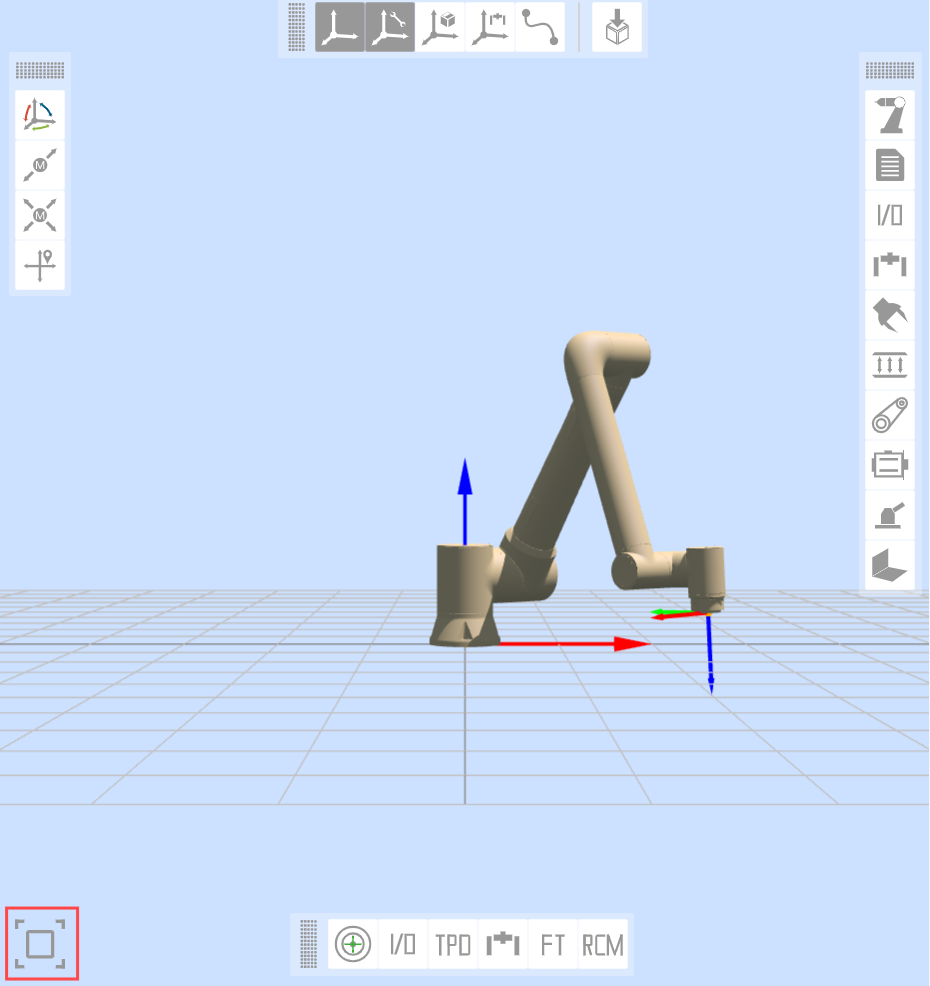
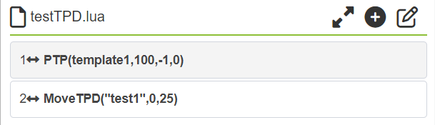
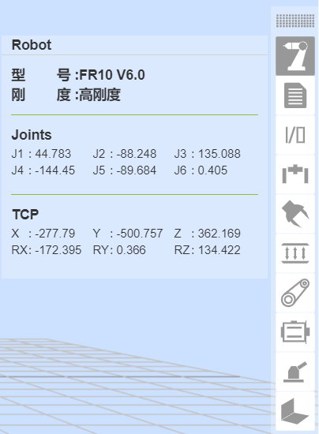
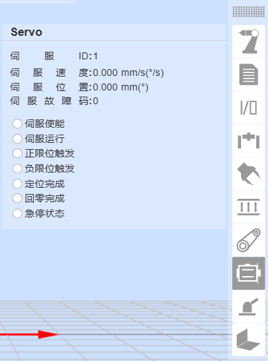

示教器软件基础功能
=========================

.. toctree:: 
   :maxdepth: 6

基础信息
-----------

系统简介
~~~~~~~~~~~

示教器软件是针对机器人开发的配套软件，运行于示教器操作系统中，其主要功能和技术特点如下：

-  能够对机器人进行示教程序的编写；
-  能够实时显示机器人位置坐标，三维模拟实体机器人，并能控制机器人运动；
-  能够实现对机器人的单轴点动以及各轴联动操作；
-  能够查看控制IO状态；
-  用户可以修改密码、查看系统信息等。

机器人首次激活
~~~~~~~~~~~~~~~

1. 开启控制箱并将网线连接PC。

2. PC打开浏览器访问目标网址192.168.58.2，机器人首次开机即进入激活页面。

.. figure:: teaching_pendant_software/058.png
   :width: 4in
   :align: center

.. centered:: 图表 5.1‑1 激活界面

3. 正确输入设备箱的SN码，输入完毕后点击“激活”按钮。
   
4. 系统将验证您的SN码。如果输入正确，将自动完成激活过程。

.. figure:: teaching_pendant_software/059.png
   :width: 4in
   :align: center

.. centered:: 图表 5.1‑2 激活成功界面

5. 激活成功，请手动重启控制箱。
   
6. 再次开机访问目标网址192.168.58.2即进入登录页面。

.. figure:: teaching_pendant_software/001.png
   :width: 6in
   :align: center

.. centered:: 图表 5.1‑3 登录界面

启动软件
~~~~~~~~~~~

1. 控制箱上电；
2. 示教器打开浏览器访问目标网址192.168.58.2；
3. 输入用户名和密码点击登录即可登录系统。

用户登录及权限更新
~~~~~~~~~~~~~~~~~~~~

.. centered:: 表格 5.1-1 初始用户

.. list-table::
   :widths: 70 70 70 70
   :header-rows: 0
   :align: center

   * - **工号**
     - **初始用户名**
     - **密码**
     - **职能代号**

   * - 111
     - admin
     - 123
     - 1

   * - 222
     - MEenginer
     - 222
     - 2

   * - 333
     - PEenginer
     - 333
     - 3
   
   * - 444
     - programmer
     - 444
     - 4
   
   * - 555
     - operator
     - 555
     - 5

   * - 666
     - monitor
     - 666
     - 6

用户（用户管理参考15.2.1 用户管理）默认分为六个等级，管理员无功能限制，操作员和监视员少部分功能可以使用，ME工程师、PE&PQE工程师和技术员&班组长部分功能限制，管理员无功能限制，具体默认职能代号权限参考15.2.2 权限管理。

登录界面如下图所示：

.. figure:: teaching_pendant_software/001.png
   :width: 6in
   :align: center

.. centered:: 图表 5.1‑4 登录界面

登录成功后，系统会加载模型等数据，加载完毕后进入初始页面。

系统初始界面
------------------

登录成功后系统进入“初始界面”，主要包含：

- 1、法奥LOGO；
- 2、菜单栏缩放按钮；
- 3、菜单栏；
- 4、机器人控制区
- 5、机器人状态区；
- 6、三维模拟机器人——三维场景操作；
- 7、三维模拟机器人——机器人本体操作；
- 8、机器人配套功能；
- 9、机器人及配套功能状态。

如下图系统初始界面示意图所示：

.. image:: teaching_pendant_software/002.png
   :align: center
   :width: 6in

.. centered:: 图表 5.2‑1 系统初始界面示意图

当进入 WebApp 的“初始设置”、“示教程序——程序编程”、“示教程序——图形化编程”和辅助应用时，此时三维模拟机器人模型页面是半展开的，点击铺开的图标可重新进入系统初始界面。

.. centered:: 图表 5.2‑2 三维模拟机器人模型页面可铺开图标

控制区
~~~~~~~~~

.. note:: 
   .. image:: teaching_pendant_software/003.png
      :width: 0.75in
      :height: 0.75in
      :align: left

   名称：**使能按钮**
   
   作用：使能机器人

.. note:: 
   .. image:: teaching_pendant_software/004.png
      :width: 0.75in
      :height: 0.75in
      :align: left

   名称：**开始按钮**
   
   作用：上传并开始运行示教程序

.. note:: 
   .. image:: teaching_pendant_software/005.png
      :width: 0.75in
      :height: 0.75in
      :align: left

   名称：**停止按钮**
   
   作用：停止当前示教程序运行

.. note:: 
   .. image:: teaching_pendant_software/006.png
      :width: 0.75in
      :height: 0.75in
      :align: left

   名称：**暂停/恢复按钮**
   
   作用：暂停和恢复当前示教程序
   
.. important::
   暂停指令在程序的末尾，无法进行判断

状态栏
~~~~~~~~~~~~

.. note:: 
   .. image:: teaching_pendant_software/007.png
      :width: 0.75in
      :height: 0.75in
      :align: left

   名称：**机器人状态**
   
   作用：Stopped-停止，Running-运行，Pause-暂停，Drag-拖动

.. note:: 
   .. image:: teaching_pendant_software/008.png
      :width: 0.75in
      :height: 0.75in
      :align: left

   名称：**工具坐标系编号**
   
   作用：展示当前应用的工具坐标系编号

.. note:: 
   .. image:: teaching_pendant_software/027.png
      :width: 0.75in
      :height: 0.75in
      :align: left

   名称：**工件坐标系编号**
   
   作用：展示当前应用的工件坐标系编号
   
.. note:: 
   .. image:: teaching_pendant_software/028.png
      :width: 0.75in
      :height: 0.75in
      :align: left

   名称：**扩展轴坐标系编号**
   
   作用：展示当前应用的扩展轴坐标系编号
   
.. note:: 
   .. image:: teaching_pendant_software/009.png
      :width: 0.75in
      :height: 0.75in
      :align: left

   名称：**运行速度百分比**
   
   作用：机器人当前模式运行时速度

.. note:: 
   .. image:: teaching_pendant_software/010.png
      :width: 0.75in
      :height: 0.75in
      :align: left

   名称：**机器人运行正常状态**
   
   作用：当前机器人正常运行

.. note:: 
   .. image:: teaching_pendant_software/011.png
      :width: 0.75in
      :height: 0.75in
      :align: left

   名称：**机器人运行错误状态**
   
   作用：当前机器人运行有错误

.. note:: 
   .. image:: teaching_pendant_software/012.png
      :width: 0.75in
      :height: 0.75in
      :align: left

   名称：**自动模式**
   
   作用：机器人自动运行模式，开启手动切自动模式全局速度调整并指定速度时，全局速度会自动调整为指定速度

.. note:: 
   .. image:: teaching_pendant_software/013.png
      :width: 0.75in
      :height: 0.75in
      :align: left

   名称：**示教模式**
   
   作用：机器人示教运行模式

.. note:: 
   .. image:: teaching_pendant_software/014.png
      :width: 0.75in
      :height: 0.75in
      :align: left

   名称：**机器人拖动状态**
   
   作用：当前机器人可拖动

.. note:: 
   .. image:: teaching_pendant_software/015.png
      :width: 0.75in
      :height: 0.75in
      :align: left

   名称：**机器人拖动状态**
   
   作用：当前机器人不可拖动

.. note:: 
   .. image:: teaching_pendant_software/017.png
      :width: 0.75in
      :height: 0.75in
      :align: left

   名称：**连接状态**
   
   作用：机器人已连接

.. note:: 
   .. image:: teaching_pendant_software/016.png
      :width: 0.75in
      :height: 0.75in
      :align: left

   名称：**未连接状态**
   
   作用：机器人未连接

.. note:: 
   .. image:: teaching_pendant_software/018.png
      :width: 0.75in
      :height: 0.75in
      :align: left

   名称：**账户信息**
   
   作用：显示用户名和权限及登出用户

菜单栏
~~~~~~~~~~~~

菜单栏如下表格：

.. centered:: 表格 5.2‑1 示教器菜单分栏

+----------+------------+
|   一级   |    二级    |
+==========+============+
| 初始设置 | 基础       |
+          +------------+
|          | 安全       |
+          +------------+
|          | 外设       |
+----------+------------+
| 示教程序 | 程序编程   |
+          +------------+
|          | 图形化编程 |
+          +------------+
|          | 节点图编程 |
+          +------------+
|          | 示教点     |
+----------+------------+
| 状态信息 | 系统日志   |
+          +------------+
|          | 状态查询   |
+----------+------------+
| 辅助应用 | 工具应用   |
+          +------------+
|          | 焊接专家库 |
+----------+------------+
| 系统设置 | /          |
+----------+------------+

三维模拟机器人
----------------

三维场景操作条
~~~~~~~~~~~~~~~~~~~~~~~~~~~

机器人坐标系系统三维可视化展示
++++++++++++++++++++++++++++++++

在WebAPP机器人三维虚拟区域中创建各类三维虚拟坐标系，以基坐标系展示为例，如下图所示。其中X轴红色，Y轴绿色，Z轴蓝色。

.. note:: 
   .. image:: teaching_pendant_software/021.png
      :width: 0.75in
      :height: 0.75in
      :align: left

   名称：**基坐标系**
   
   说明：基坐标系WebAPP中系统机器人三维虚拟区域中进行默认开启展示，固定标记在机器人基座底部中心。三维虚拟基坐标系可进行手动关闭展示。

.. note:: 
   .. image:: teaching_pendant_software/022.png
      :width: 0.75in
      :height: 0.75in
      :align: left

   名称：**工具坐标系**
   
   说明：工具坐标系默认开启展示，可手动关闭。在WebAPP启动并且用户登录成功后，获取当前应用的工具坐标系名称和对应参数数据，初始化当前工具坐标系。

.. important::
   使用的过程中应用其他工具坐标系时，当应用工具坐标系指令成功后，先将机器人三维虚拟区域中已有的工具坐标系清除，再将新应用的工具坐标系参数数据传入三维坐标系生成API进行工具坐标系生成，生成后完成在机器人三维虚拟区域中进行对应展示。

.. note:: 
   .. image:: teaching_pendant_software/023.png
      :width: 0.75in
      :height: 0.75in
      :align: left

   名称：**工件坐标系**
   
   说明：工件坐标系默认关闭，可以进行手动开启展示。流程与工具坐标系一致。

.. note:: 
   .. image:: teaching_pendant_software/024.png
      :width: 0.75in
      :height: 0.75in
      :align: left

   名称：**外部轴坐标系**
   
   说明：外部轴坐标系默认关闭，可以进行手动开启展示。流程与工具坐标系一致。

三维虚拟轨迹和导入工具模型
++++++++++++++++++++++++++++++++

.. note:: 
   .. image:: teaching_pendant_software/020.png
      :width: 0.75in
      :height: 0.75in
      :align: left

   名称：**轨迹绘制**
   
   说明：点击按钮，打开轨迹绘制功能。运行示教程序时，机器人三维模型会描绘机器人运动的轨迹路线。

.. note:: 
   .. image:: teaching_pendant_software/029.png
      :width: 0.75in
      :height: 0.75in
      :align: left

   名称：**导入工具模型**
   
   说明：点击按钮，弹出导入工具模型模态窗，上传文件导入成功后即可在机器人末端进行工具模型展示，目前支持的工具模型文件格式有STL和DAE。

机器人本体操作条
~~~~~~~~~~~~~~~~~~~~~~~~~~~

TCP
+++++++++++

**Base点动**：在基坐标系下，可以点击对应坐标系按钮控制机器人，在X，Y，Z轴上直线移动或绕着RX，RY，RZ旋转。Base点动的功能与Joint运动中单轴点动的功能相似。界面如下图：

.. image:: teaching_pendant_software/030.png
   :width: 3in
   :align: center

.. centered:: 图表 5.3-1 Base点动示意图

.. important:: 
   可随时释放该按钮，使机器人停止运动。在必要情况下，按急停按钮使机器人停止。

**Tool点动**：选择工具坐标系，可以点击对应坐标系按钮控制机器人，在X，Y，Z轴上直线移动或绕着RX，RY，RZ旋转。Tool点动的功能与Joint运动中单轴点动的功能相似。界面如下图：

.. centered:: 图表 5.3-2 Tool点动示意图

**Wobj点动**：选择工件点动，可以点击对应坐标系按钮控制机器人，在工件坐标系下，沿着X，Y，Z轴上直线移动或绕着RX，RY，RZ旋转。Wobj点动的功能与Joint运动中单轴点动的功能相似。界面如下图：

.. image:: teaching_pendant_software/032.png
   :width: 3in
   :align: center

.. centered:: 图表 5.3-3 Wobj点动示意图

Joint运动
++++++++++++++++

Joint运作下，中间的6个滑块条分别表示对应轴的角度，joint运动分单轴点动和多轴联动。

**单轴点动**：用户可通过操作左右两边圆形按钮来控制机器人运动，如下图。在手动模式和关节坐标系下，对机器人某一关节进行转动操作。当机器人超出运动范围（软限位）而停止时，可以利用单轴点动进行手动操作，将机器人移出超限位置。单轴点动在进行粗略定位和较大幅度移动时，会比其他操作模式更快捷方便。

.. image:: teaching_pendant_software/033.png
   :width: 3in
   :align: center

.. centered:: 图表 5.3-4 单轴点动示意图

.. important::
   设置“长按运动阈值”（长按按钮时，机器人运行的最大距离，输入值得范围0~300）参数，长按圆形按钮控制机器人运行，若在机器人运行中松开按钮，机器人会立即停止运动，若一直按住不松开按钮，机器人会运行长按运动阈值所设置的值后停止运动。

**多轴联动**：用户可操作中间六个滑块来调整机器人相应的目标位置，如下图。可通过观察三维虚拟机器人来确定目标位置，若调整的位置不符合自己的预期，点击“还原”按钮，使得三维虚拟机器人回到初始的位置。当用户确定目标位置后，可点击“应用”按钮，实体机器人便会进行相应的运动。

.. image:: teaching_pendant_software/034.png
   :width: 3in
   :align: center

.. centered:: 图表 5.3-5 多轴联动示意图

.. important:: 
   多轴联动中，第5个关节j5的设置值不能小于0.01度，若期望值小于0.01度，则可以先设置为0.011度，然后通过单轴点动微调第5个关节j5。

Move移动
++++++++++++++++

选择Move移动，可以直接输入笛卡尔坐标值，点击“计算关节位置”，关节位置显示为计算后结果，确认无危险，可以点击“移至该点”控制机器人运动至输入的笛卡尔位姿。

.. image:: teaching_pendant_software/035.png
   :width: 3in
   :align: center

.. centered:: 图表 5.3‑6 Move移动示意图

.. important:: 
   当出现给定位姿无法到达时，首先检查笛卡尔空间位姿是否超过机器人工作范围，然后检查当前位姿到目标位姿过程中是否存在奇异位姿，若存在奇异位置则调整下当前姿态或过程中插入一个新的位姿以避开奇异位姿。

机器人配套功能条
~~~~~~~~~~~~~~~~~~~~~~~~~~~

示教点记录
++++++++++++++++

手动示教控制区主要是在示教模式中对考坐标系进行设定，并实时显示机器人各轴角度与坐标值，并可对示教点进行命名保存。

保存示教点时，该示教点的坐标系为当前机器人应用的坐标系。

传感器示教点，选择已经标定的传感器类型工具，输入点名称，点击添加，保存的点的位置为传感器识别到点的位置。

.. image:: teaching_pendant_software/036.png
   :width: 5in
   :align: center

.. centered:: 图表 5.3‑7 手动操作区示意图

.. important:: 
   第一次使用时，请设置30这样较小的速度值，熟悉机器人运动，以免发生意外情况。

I/O
++++++++++++++++

该界面中可实现对机器人控制箱中数字输出、模拟输出（0-10v）和末端工具数字输出、模拟输出（0-10v）进行手动控制。如下图所示：

.. centered:: 图表 5.3‑8 I/O设置示意图

TPD（示教编程）
++++++++++++++++

示教编程（TPD）功能操作步骤如下：

- **Step1记录初始位置**：进入三维模型左侧操作区，记录机器人当前位置。在编辑框内设定好点的名称，点击“保存”按钮，若保存成功，则提示“保存点成功”；

- **Step2配置轨迹记录参数**：点击TPD进入“TPD”功能项配置轨迹记录参数，设定好轨迹文件的名称、位姿类型以及采样周期，配置DI和DO，可以在记录TPD轨迹的过程中，通过触发DI来记录对应需要输出的DO，如图表3.6-8；

.. centered:: 图表 5.3‑9 TPD轨迹记录

- **Step3检查机器人模式**：检查机器人模式是否处于手动模式下，若不处于则切换至手动模式，在手动模式下可通过两种方式切换到托动示教模式，一种是长按末端按钮，一种是界面拖动模式切换按键，在TPD记录是推荐从界面切换机器人进入托动示教模式。如图表3.6-9所示；

.. image:: teaching_pendant_software/039.png
   :width: 3in
   :align: center

.. centered:: 图表 5.3‑10 机器人模式

.. important:: 
   从界面切入拖动模式时，先确认末端工具负载以及质心是否设置正确、摩檫力补偿系数是否设置合理，然后通过长按末端按钮确认拖动是否正常，确认无误后从界面切入拖动模式。

- **Step4开始记录**：点击“开始记录”按钮开始轨迹记录，拖动机器人进行动作示教。此外，末端DI配置中有“TPD记录启动/停止”功能配置项，通过配置此功能，用户可以通过外部信号触发“开始记录”轨迹功能，需要注意的是，通过外部信号开始记录轨迹，首先得在页面先进行TPD轨迹的信息配置。

- **Step5停止记录**：动作示教完成后，点击“停止记录”按钮，停止轨迹记录，然后通过拖动示教切换按键使机器人退出拖动示教模式。示教器接收到“停止轨迹记录成功”即表示轨迹记录成功。同步骤4，在配置“TPD记录启动/停止”功能后，可以通过外部信号触发停止记录。

- **Step6示教编程**：点击新建，选择空白模板，点击进入PTP功能编程项，选择刚保存的初始位置点，点击“添加”按钮，应用完成后，在程序文件中会显示一条PTP指令；然后点击进入TPD功能编程项，选择刚刚记录的轨迹，设定是否平滑以及速度缩放比例，点击“添加”按钮，应用完成后，在程序文件中会显示一条MoveTPD指令，如下图所示；

.. centered:: 图表 5.3‑11 TPD编程

- **Step7轨迹复现**：示教程序编辑完成后，切换至自动运行模式，点击界面上方”开始运行”图标开始运行程序，机器人开始复现示教的动作。

- **Step8轨迹编辑**：TPD轨迹编辑区可对轨迹可视化展示和编辑裁切，以达到TPD轨迹预分析和精简。选择对应轨迹获取点，那么用户记录的轨迹点会展示在机器人三维空间内，其次用户可以拖动“Start”和“End”滚动条对轨迹的起点和终点进行模拟复现和剪辑。

TPD文件删除与异常处理：

- **轨迹文件删除**：点击进入TPD功能项，选择需要删除的轨迹文件，点击”删除轨迹”按钮，若删除成功，则会收到删除成功提示。

- **异常处理：**

  +  **指令点数超限**：一条轨迹最多可记录2万个点数，当超过2万个点时，控制器不再记录超过的点数，并向示教器发出“指令点数超限”告警提示，此时需点击停止记录；

  +  **TPD指令间隔过大**：若示教器报错TPD指令间隔过大，则应检查机器人是否回到了记录前的初始位置，若机器人回到了初始位置依然报错TPD指令间隔过大，则删除当前轨迹重新记录一条新的轨迹；

  +  TPD操作过程中若出现其他异常情况，则应通过示教器或急停按钮立即停止机器人操作，检查原因。

.. important:: 
   TPD功能操作过程中应严格按照示教器上相应的提示进行操作。

Eaxis移动
++++++++++++++++

选择Eaxis移动，该功能为扩展轴的点动功能，需要在配置好扩展轴的前提下，使用该点动功能控制扩展轴，详见“第四章-机器人外设-扩展轴外设配置”。

.. centered:: 图表 5.3‑12 Eaxis移动示意图

FT
++++++++++++++++

选择参考坐标作为力传感器拖动时的参考。

.. centered:: 图表 5.3‑12 FT示意图

远心不动点
++++++++++++++++

该功能主要应用于医疗穿透，设置远心不动点后，机器人末端始终在该点运动。

.. image:: teaching_pendant_software/043.png
   :width: 5in
   :align: center

.. centered:: 图表 5.3‑13 远心不动点示意图

机器人及配套功能状态条
~~~~~~~~~~~~~~~~~~~~~~~~~~~

Robot
++++++++++++++++

显示当前机器人型号、刚度、关节和坐标数据信息。

.. centered:: 图表 5.3‑14 机器人状态

Program
++++++++++++++++

显示当前运行程序和子程序的信息。

.. centered:: 图表 5.3‑15 程序状态

I/O
++++++++++++++++

显示当前IO的状态，数字输入与数字输出中，若该端口电平为高，则该点显示为绿色，若为低，则显示为白色；模拟输入和模拟输出显示值为0-100，100即表示10v。

.. centered:: 图表 5.3‑16 IO状态

ExAxis
++++++++++++++++

显示当前扩展轴（控制器+PLC）伺服状态信息。

.. image:: teaching_pendant_software/047.png
   :width: 3in
   :align: center

.. centered:: 图表 5.3‑17 扩展轴（控制器+PLC）状态

Gripper
++++++++++++++++

显示当前夹爪状态信息。

.. centered:: 图表 5.3‑18 夹爪状态

FT
++++++++++++++++

显示当前力控状态信息。

.. image:: teaching_pendant_software/049.png
   :width: 3in
   :align: center

.. centered:: 图表 5.3‑19 力控状态

Convery
++++++++++++++++

显示当前传送带状态信息。

.. image:: teaching_pendant_software/050.png
   :width: 3in
   :align: center

.. centered:: 图表 5.3‑20 传送带状态

Servo
++++++++++++++++

显示当前扩展轴（控制器+伺服控制器）状态信息。

.. centered:: 图表 5.3‑21 扩展轴（控制器+伺服控制器）状态

Polish
++++++++++++++++

显示当前打磨状态信息。

.. image:: teaching_pendant_software/052.png
   :width: 3in
   :align: center

.. centered:: 图表 5.3‑22 打磨状态

Weld
++++++++++++++++

显示当前焊接状态信息。

.. centered:: 图表 5.3‑23 焊接状态

机器人安装方式设置和展示
~~~~~~~~~~~~~~~~~~~~~~~~~~~

机器人默认安装方式为水平安装，当机器人安装方式更改时，需及时在“初始设置——基础——安装”菜单下设置机器人的实际安装方式，以保证机器人正常工作。

用户点击“初始设置——基础——安装”菜单下的“固定安装”选项，进入机器人固定安装方式设置页面，选择“正装”、“倒装”或者“侧装”，点击“应用”按钮完成机器人安装方式设置。

.. image:: teaching_pendant_software/025.png
   :width: 6in
   :align: center

.. centered:: 图表 5.3‑24 固定安装

考虑到更加灵活丰富的机器人部署场景，我们提供了自由安装功能，用户点击“初始设置——基础——安装”菜单下的中的“自由安装”选项卡，进入机器人自由安装方式设置页面。手动调整“基座倾斜”和“基座旋转”角度，三维模型会对应展示安装效果。修改后点击“应用”按钮即可完成机器人安装方式设置。

.. image:: teaching_pendant_software/026.png
   :width: 6in
   :align: center
   
.. centered:: 图表 5.3‑25 360度自由安装

.. important:: 
   机器人安装完成后，必须正确设置机器人的安装方式，否则会影响机器人的拖动功能以及碰撞检测功能使用。
