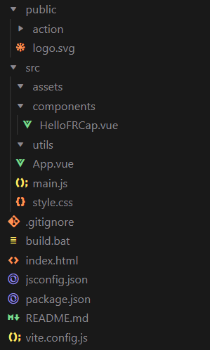

开发指导
=========================

.. toctree:: 
   :maxdepth: 6

开发环境及条件
---------------

开发环境最低需满足以下配置：

- CPU：1.6 GHz或更快的处理器；
- RAM：>=1 GB（建议2 GB以上）；
- ROM：>=128GB；
- OS：需要 Windows 10或更高版本、macOS 10.15或更高版本、Linux（x64）系统（Ubuntu、Debian等）。

我们已经封装了一些接口和模块，但想要达到一个较好的开发效果，建议对Web开发有一定的了解，最好熟悉以下技术：

- HTML，JavaScript/TypeScript，CSS；
- Vue3；
- Vite；
- Node.js。

开发工具
-------------
我们推荐使用最新的Visual Studio Code（VSCode）软件进行开发。下载请访问VSCode官方下载页面，选择对应系统下载即可。

同时在本地计算机中需安装有Node.js运行时环境，安装Node.js时会附带安装npm等工具，方便进行包管理。访问Node.js官方下载页面，选择版本为v20的对应系统下载即可。

在VSCode中开发还有可能会使用到以下的VSCode插件，可以按需进行安装配置。

- Vue；
- ESlint；
- npm Intellisense；
- Vue Language Features (Volar)；
- TypeScript Vue Plugin (Volar)或者Vue.volar；
- Tailwind CSS IntelliSense。

FRCap项目结构
-------------

FRCap的项目文件结构：

.. centered:: 图表 5-1  FRCap项目结构

- Public：

公共资源文件夹，在构建过程中不会对内部文件进行构建处理，而是直接完整复制到构建目录下。

内部默认包含了action文件夹和logo.svg。

Action文件夹是用来存放自定义指令后台接口逻辑文件的。

Logo.svg是插件图标。

- Src：

Assets文件夹主要用来放置静态资源。

Components文件夹主要用来放置组件。

Utils文件夹主要用来放置工具类。

App.vue首页代码。

Main.js主要负责资源全局引入，Vue框架创建等。

Style.css项目基础样式文件。

- Build.bat：Windows平台构建脚本。
- Index.html：页面UI主框架。
- Package.json：包描述文件和编译策略等。
- Vite.config.js：Vite配置文件。

前端frcap-ui、frcap-api使用
----------------------------

Frcap-ui提供了一些已经通过Vue组件封装好的HTML控件，可以导入项目中进行使用，降低页面UI开发难度和代码量，提高代码可读性。当然，您也可以选择一些优秀开源的UI组件库，例如Element plus等。

首先在您的项目路径下打开终端，安装frcap-ui。

.. code-block:: c++
   :linenos:

   npm install frcap-ui -s

安装成功后，在需要使用frcap-ui的组件中引入，以按钮控件为例。

.. code-block:: javascript
   :linenos:

   import { AppButton } from 'frcap-ui'

然后在组件的<template>元素中使用。

.. code-block:: c++
   :linenos:

   <AppButton button-text="Start" button-type="primary"></AppButton>

在浏览器中预览开发项目效果。

.. centered:: 图表 5-2  AppButton效果

目前我们提供了4种比较常见的控件组件。

- AppButton：按钮组件。
  
  - buttonType: 按钮类型，String，对应不同的按钮样式，缺省为primary。
  
    - primary：蓝色；
    - secondery：灰色；
    - safety：绿色；
    - warning：黄色；
    - serious：红色。
  
  - buttonText：按钮文本，String，缺省值为“primary”。

- AppInput：输入组件。
  
  - Type：必要项，String，缺省值text。表示输入框的类型。
  
    - Number：数字输入框；
    - Text：文本输入框。
  
  - inputLabel：必要项，String，输入框标签文本。
  - inputUnit：String，输入框单位文本。
  - hasUnit：Boolean，缺省false，指示是否需要单位文本。
  - isEmptyErr：Boolean，输入框是否为空。
  - isReadonly：Boolean，输入框是否只读。

- AppSelect：选择框组件。
  
  - selectionLabel：必要项，String，选择框标签文本。
  - optionsData：必要项，Array，选项数据。

- Modal：模态窗组件。
  
  - show：Boolean，是否弹出模态窗。
  - title：String，模态窗标题。

我们为了方便FRCap中可能会创建自定义指令开发，已经将Http请求和API内置在“创建向导”下载的初始FRCap项目中。这样可以将自定义指令和默认提供的指令都放到frcap-api中的api.js文件中。api.js具体路径为“./src/api/api.js”。

Frcap-api的使用与frcap-ui类似，具体如下：

1. 在组件等需要用到api的文件中导入api。

.. code-block:: javascript
   :linenos:

   import api from '@/api/api';

2. 在接口中调用默认提供的指令。

.. code-block:: c++
   :linenos:

   api.getRobotStatus()

3. 在返回的promise中编写处理逻辑。

.. code-block:: c++
   :linenos:

    api. getRobotStatus ()
    .then((res) => {
    console.log(res.data);
    })
    .catch((err) => {
        console.error(err);
    });

后端自定义指令开发
----------------------------

数据库操作示例
+++++++++++++++++++++++++

1. 引入数据库模块

.. code-block:: javascript
   :linenos:

    var node = "/usr/local/etc/node/sys"
    var Sqlite3_Action = require(node + '/better-sqlite3/better-sqlite3.js');
    var sqlite = new Sqlite3_Action();

2. 获取点位数据库中内容
   
.. code-block:: javascript
   :linenos:

    // 匹配 cmd
    case 'get_points':
    // 编写sql语句，按照数字升序 + 首字母开头升序 + 中文开头升序 的方式，反馈数据给前端页面进行显示
    var sql = "select * from points order by name ASC"; 
    var sql_data = sqlite.queryall(DB_POINTS, sql); 
    // json数据格式化
    for (var i = 0; i < sql_data.length; i++) {
        response_data[sql_data[i].name] = sql_data[i];
    }
    //json数据反馈给前端
    event_socket.emit('response', res, response_status, response_data);
    break;  

3. socket通信操作示例

socket通信操作示例
+++++++++++++++++++++++++

- 引入socket通信模块
   
.. code-block:: javascript
   :linenos:

    var node = "/usr/local/etc/node/sys"
    var Socket_Cmd = require(node + '/socket/socket_cmd');
    var socket_cmd = new Socket_Cmd();

- 下发设置系统变量指令
  
.. code-block:: javascript
   :linenos:

   // 匹配 cmd
    case 511:
    //获取发送数据内容
    content = data_json.content;
    //获取发送数据长度
    len = data_json.content.length;
    //组发送数据
    send_content = '/f/bIII1III511III' + len + 'III' + content + 'III/b/f'
    //socket send
    socket_cmd.send(send_content);
    //socket recv
    socket_cmd.recv().then((recv_data)=>{
        response_data = recv_data;
    event_socket.emit('response', res, response_status, response_data);
    }).catch((err)=>{
        console.log(err);
    })
    break;