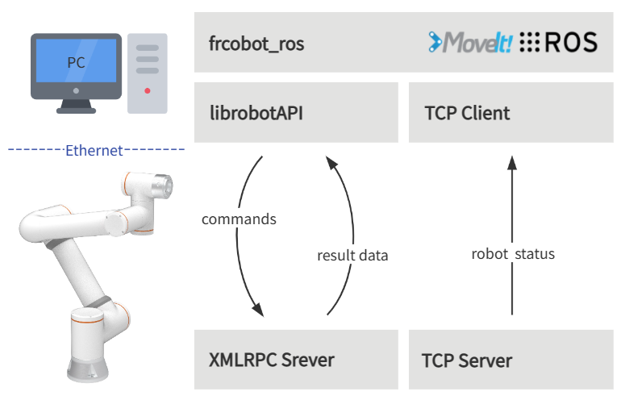

概述
++++++++++
frcobot_ros简要架构如下图所示，协作机器人端提供了XMLRPC服务器和TCP服务器。

- XMLRPC服务器主要提供机器人指令API完成机器人运动和状态值获取功能
- 状态反馈的TCP服务器提供了机器人状态的实时反馈，反馈周期8ms。

用户PC端中已安装了ROS和Moveit!，编译完成frcobot_ros。在frcobot_ros中每个功能包都包含了机器人API的lib库，以及在frcobot_hw建立与机器人状态反馈服务器通讯的TCP客户端，获取机器人状态反馈数据。

安装
++++++++++
本章介绍如何构建frcobot_ros以及所需的安装环境。

环境要求
-----------

frcobot_ros推荐环境如下：

.. note:: 
    -	Ubuntu 18.04 LTS Bionic Beaver和ROS Melodic Morenia
    -	Ubuntu 20.04 LTS Focal Fossa和ROS Noetic Ninjemys

以下说明适用于 Ubuntu 20.04 LTS 系统和 ROS Noetic Ninjemys。

ROS安装要求
--------------
在安装好Ubuntu系统后，`安装和配置好ROS Noetic环境 <https://wiki.ros.org/noetic/Installation/Ubuntu>`__。

在配置好ROS Noetic后，安装如下所需环境：

.. code-block:: shell
    :linenos:

    sudo apt-get install -y \
        ros-noetic-rosparam-shortcuts \
        ros-noetic-ros-control \
        ros-noetic-ros-controllers \
        ros-noetic-moveit 

编译ROS包
-------------
在正确安装和配置好ROS Noetic后，在您选择的目录中创建一个Catkin工作区。

.. code-block:: shell
    :linenos:

    cd /path/to/desired/folder
    mkdir -p catkin_ws/src
    cd catkin_ws
    source /opt/ros/noetic/setup.sh
    catkin_init_workspace src

然后从Github克隆frcobot_ros库。

.. code-block:: shell
    :linenos:

    cd src
    git clone https://github.com/FAIR-INNOVATION/frcobot_ros.git

构建frcobot_ros包

.. code-block::  shell
    :linenos:

    cd ..
    catkin make

如果出现报错请检查ROS安装要求中的包是否都已安装成功，编译完成后，将lib库拷贝到ROS的lib环境下(路径为：/opt/ros/melodic/lib)，以便程序可以正常运行。

.. code-block:: shell
    :linenos:

    # 此处catkin_ws默认路径为“~”，如有不同，将“~”改为实际路径即可
    sudo cp ~/catkin_ws/src/frcobot_ros/frcobot_hw/lib/* /opt/ros/melodic/lib

快速开始
++++++++++

frcobot_hw
-----------------
frcobot_hw主要提供了和协作机器人通讯的基本功能。

.. note:: 
    - 包含协作机器人状态反馈msg
    - 提供控制协作机器人的指令demo
    - 提供协作机器人状态反馈节点和Topic
    - 可通过launch文件快速启动状态节点和指令demo

frcobot_hw.launch内容如下：

.. code-block:: xml
    :linenos:

    <launch>

        <!-- params -->
        <param name="robot_ip" type="string" value="192.168.58.2"/>
        <param name="robot_port" type="int" value="8083"/>

        <!-- frcobot status node -->
        <node pkg="frcobot_hw" type="frcobot_status_node" name="frcobot_status_node" output="screen" />

        <!-- frcobot control demo -->
        <node pkg="frcobot_hw" type="frcobot_cmd_demo" name="frcobot_cmd_demo" output="screen" />
        
    </launch>

.. important:: 

    - ``robot_ip`` 和 ``robot_port`` 需要注意与被控制的协作机器人IP和端口一致
    - 出厂机器人默认IP为192.168.58.2，用户状态反馈端口为8083

通过以下指令可快速启动机器人状态反馈节点和指令demo功能。

.. code-block:: shell
    :linenos:

    roslaunch frcobot_hw frcobot_hw.launch

新开一个terminal，通过以下指令可打印并查看实时的状态反馈数据。

.. code-block:: shell
    :linenos:

    rostopic ehco /frcobot_status

.. frcobot_camera
.. -----------------
.. frcobot_camera提供与图漾RVS和相机的手眼标定功能和无序抓取（Bin-Picking）功能。

.. frcobot_gripper
.. -------------------

.. frcobot_description
.. ----------------------

.. frcobot moveit!
.. -----------------------

    