插件简介
++++++++++++++++++++++++++++++
法奥MoveIt2插件是一款为法奥机器人的运动控制与路径规划提供支持的插件。借助法奥MoveIt2插件能够实现复杂的机器人运动控制、路径规划、逆运动学求解和实时碰撞检测等功能，适用于多种机械臂应用场景，如工业、焊接、制造业、自动化上下料、码垛、医疗等场景。

快速使用
++++++++++++++++++++++++++++++
本章节说明APP运行环境如何配置。

推荐在Ubuntu22.04LTS(Jammy)上使用，系统安装完毕后，就可以安装ROS2，推荐用ros2-humble，ROS2的安装可以参考教程：https://docs.ros.org/en/humble/index.html。

法奥MoveIt2插件包安装及配置
------------------------------
克隆法奥MoveIt2插件
""""""""""""""""""""""""""""""""""
克隆法奥MoveIt2插件到本地，然后cd到目标目录下，其中主要文件包括fairino_msgs法奥机器人数据传输数据类型功能包；fairino_hardware法奥机器人fairino_hardware插件功能包；

fairino_robot/fairino_description法奥机器人外观及urdf文件功能包；

fairino_robot/fairino3mt_v6_moveit2_config、fairino_robot/fairino3_v6_moveit2_config、fairino_robot/fairino5_v6_moveit2_config、fairino_robot/fairino10_v6_moveit2_config、fairino_robot/fairino16_v6_moveit2_config、fairino_robot/fairino20_v6_moveit2_config、fairino_robot/fairino30_v6_moveit2_config法奥机器人moveit2配置包，fairino_robot/fairino_mtc_demo法奥mtc示例代码包。

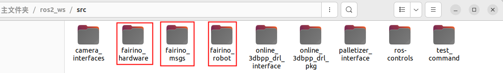
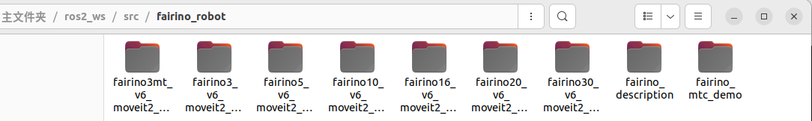

编译功能包
""""""""""""""""""""""""""""""""""

编译fairino_msgs功能包

.. code-block:: shell
    :linenos:

    cd ros2_ws
    colcon build --packages-select fairino_msgs
    source install/setup.bash

编译fairino_hardware功能包

.. code-block:: shell
    :linenos:

    cd ros2_ws
    colcon build --packages-select fairino_hardware
    source install/setup.bash

编译fairino_description功能包

.. code-block:: shell
    :linenos:

    cd ros2_ws
    colcon build --packages-select fairino_description
    source install/setup.bash

编译法奥机器人moveit2配置包，以fairino5_v6_moveit2_config为例

.. code-block:: shell
    :linenos:

    cd ros2_ws
    colcon build --packages-select fairino5_v6_moveit2_config
    source install/setup.bash

编译法奥机器人fairino_mtc_demo示例代码包，若该代码示例包未出现在官方ros2_ws工作空间内，可联系售后服务获取

.. code-block:: shell
    :linenos:

    cd ros2_ws
    colcon build --packages-select fairino_mtc_demo
    source install/setup.bash

配置法奥机械臂Moveit2模型
------------------------------
若不想使用官方提供的机器人moveit2_config配置包，可以通过moveit_setup_assistant配置自定义机器人moveit2_config配置包。

创建工作空间
""""""""""""""""""""""""""""""""""
创建工作空间，并创建功能包

.. code-block:: shell
    :linenos:

    mkdir -p test_fa_ws/src
    cd test_fa_w/src
    mkdir fairino5_v6_robot_moveit_config
    cd ..
    cd ..

编译功能包，并source

.. code-block:: shell
    :linenos:

    colcon build
    source install/setup.bash

启动moveit_setup_assistant进行机器人配置

.. code-block:: shell
    :linenos:

    ros2 launch moveit_setup_assistant setup_assistant.launch.py

配置机器人
""""""""""""""""""""""""""""""""""
启动配置界面
^^^^^^^^^^^^^^^^^^^^^^^^^^^^^^^^^^^^^^^^
在test_fa_ws目录下打开终端，配置界面选择“Create New Moveit Configuration Package”，创建新的moveit配置功能包。

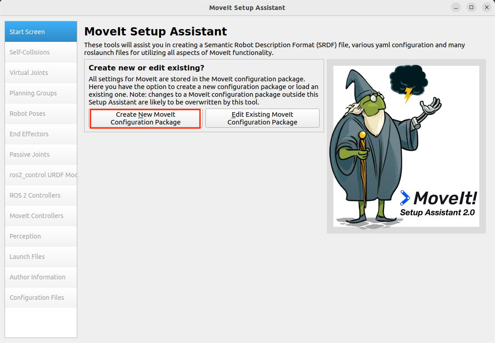

然后选中机器人的描述文件，即.urdf这个文件，然后选择Load Files，加载机器人模型，就可以看到右边加载出来了机器人的模型。

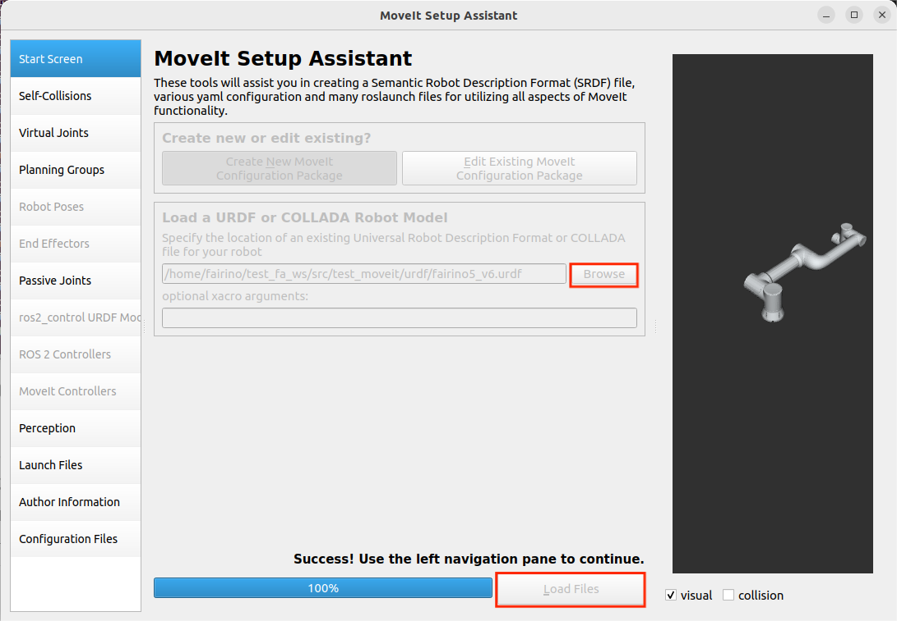

配置Self-Collisions
^^^^^^^^^^^^^^^^^^^^^^^^^^^^^^^^^^^^^^^^
Self-Collisions为机器人碰撞设置，点击Generate Collision Matrix既可自动生成关节碰撞矩阵，其会将两接触连杆以及永远接触不到的连杆之间的碰撞取消，从而配置机器人关节碰撞矩阵的，进而避免计算两接触面碰撞，点击Generate Collision Matrix既可自动生成。

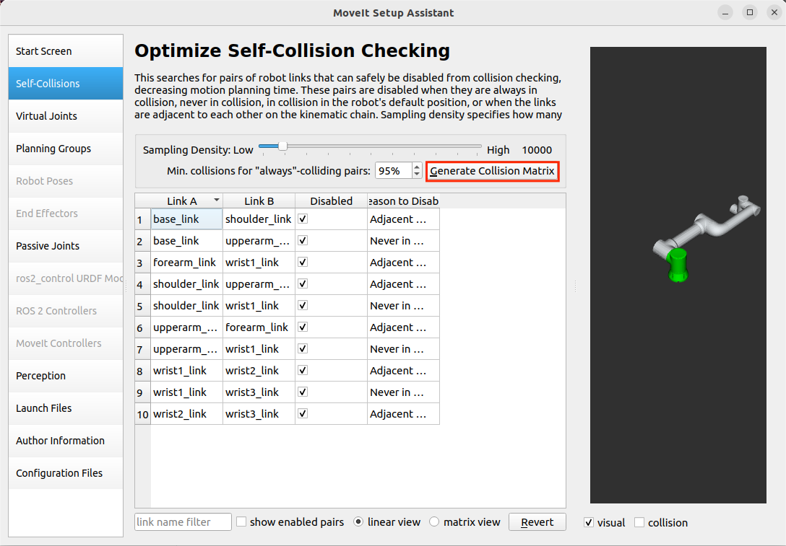

配置Virtual Joints
^^^^^^^^^^^^^^^^^^^^^^^^^^^^^^^^^^^^^^^^
Virtual Joints为机器人虚拟轴，当机器人安装在移动平台上是就需要给机器人设置虚拟轴，设置虚拟轴的name、子连杆、关节类型等，当移动平台移动时，虚拟轴也同步运动，从而带动机器人运动，实现机器人随着移动平台运动的功能本次直接将机器人放置在world坐标系中，取名为virtual_joints。

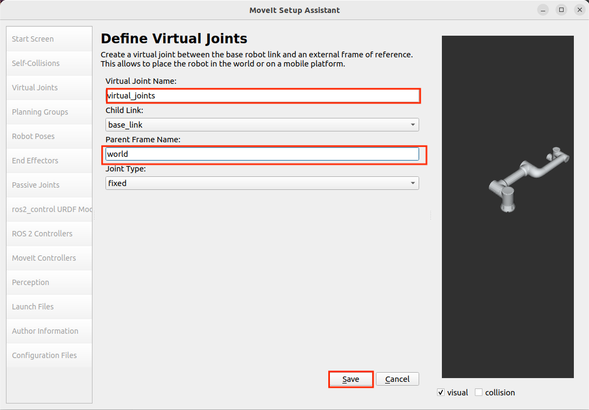

配置Planning Groups
^^^^^^^^^^^^^^^^^^^^^^^^^^^^^^^^^^^^^^^^
Planning Groups为机器人的规划组，它将进行运动学计算时需要同一考虑的关节划在同一规划组内，进行统一的正逆向运动学计算，如将一机器人放在AGV小车上，再在机器人末端安装夹具，测试将AGV小车的四个关节划在一个规划组，机器人的六个关节划在一个规划组，夹具的一个关节划在一个规划组进行运动学计算。

由于本次不涉及夹具所以只添加机器人的各个关节组，即arm组，首先添加arm组，动力学求解器Kinematic Solver选择kdl_kinematics_plugin/KDLKinematicsPlugin，然后默认的规划器Group Default Planner选TRRT，然后点击Add Joints为这个规划组添加关节。

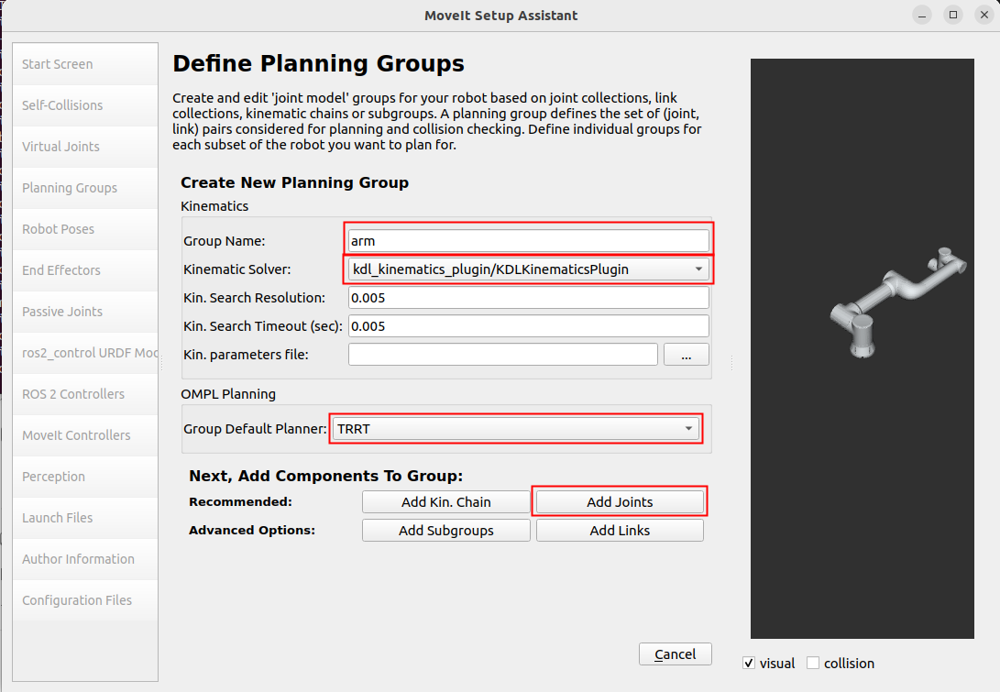

arm的关节按住shift可以进行多选，点击'>'进行添加，然后点击save保存。

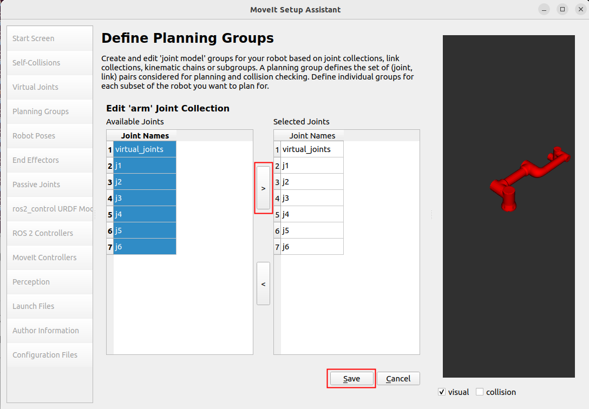

定义好的规划组如下所示：

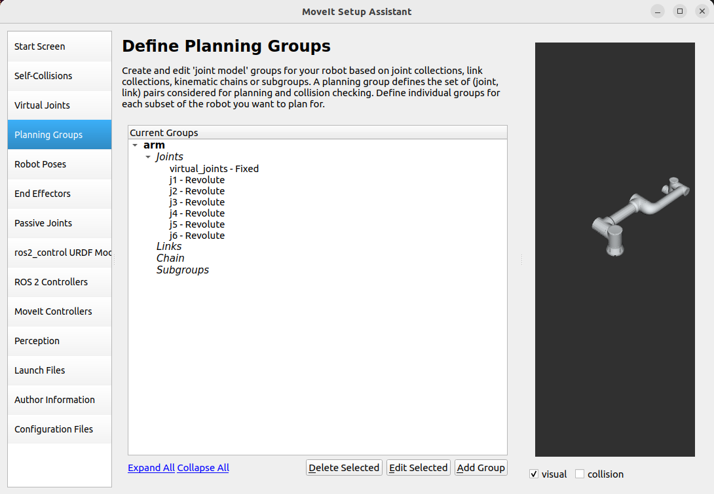

配置Robot Poses
^^^^^^^^^^^^^^^^^^^^^^^^^^^^^^^^^^^^^^^^
Robot Poses为机器人预设位姿，其为每个规划组定义一些预设的位姿，为arm定义一个home位姿态，这个姿态可以随意选择。

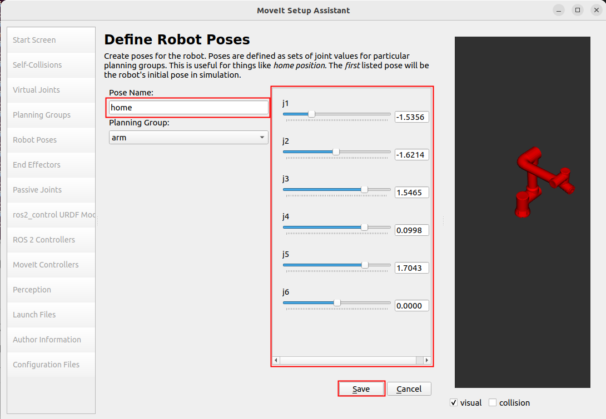

Robot Poses可以为每个规划组定义预设姿态，当机器人中存在夹具时，可在Planning Groups部分添加夹具规划组，然后在Robot Poses设置姿态时就可为夹具设置预设姿态。

配置End Effectors
^^^^^^^^^^^^^^^^^^^^^^^^^^^^^^^^^^^^^^^^
End Effectors为机器人末端执行机构，末端执行机构的规划组为hand，然后默认连接的parent_link是panda_link8，由于本次没有末端执行器，所以这一步可跳过。

ros2_control URDF Modifications
^^^^^^^^^^^^^^^^^^^^^^^^^^^^^^^^^^^^^^^^
ros2_control URDF Modifications主要用于设置下发和反馈的关节数据类型，可以选择位置、速度、扭矩三种，本次选择下发和反馈的关节数据类型都为位置控制，然后直接Add interfaces即可。

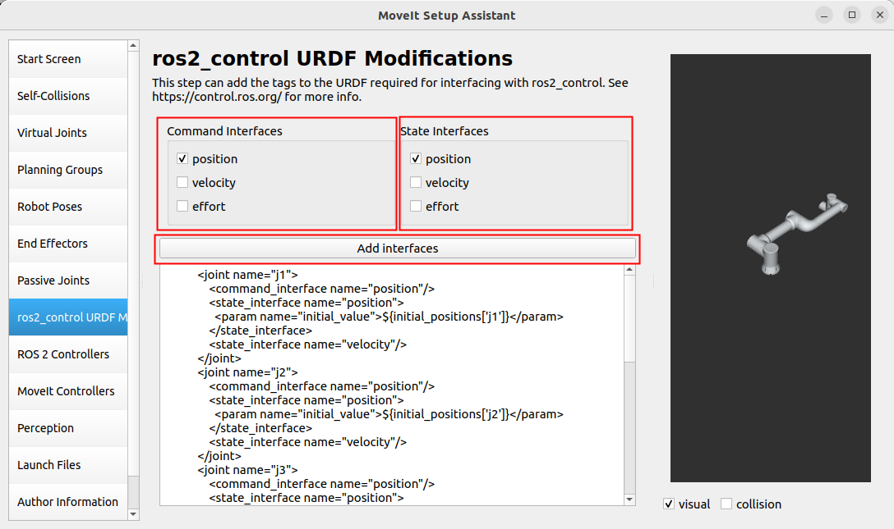

.. important:: 

   - 注意：

    选择关节数据类型需要与后续fairino_hardware插件相匹配，根据fairino_hardware插件传输数据选择下发和反馈的关节数据类型，由于本次控制实际机器人运动的fairino_hardware插件使用的是position数据类型，所以本次选择下发和反馈的关节数据类型都为位置控制。

ROS 2 Controllers
^^^^^^^^^^^^^^^^^^^^^^^^^^^^^^^^^^^^^^^^
ROS 2 Controllers主要用于生成ros2_controllers.yaml文件，该文件设置了发布频率、关节名称、控制器名称、控制器类型等，配置ROS 2 Controllers，为每个规划组配置控制器，点击Auto Add JointTrajectoryController Controllers For Each Planning Group即可。

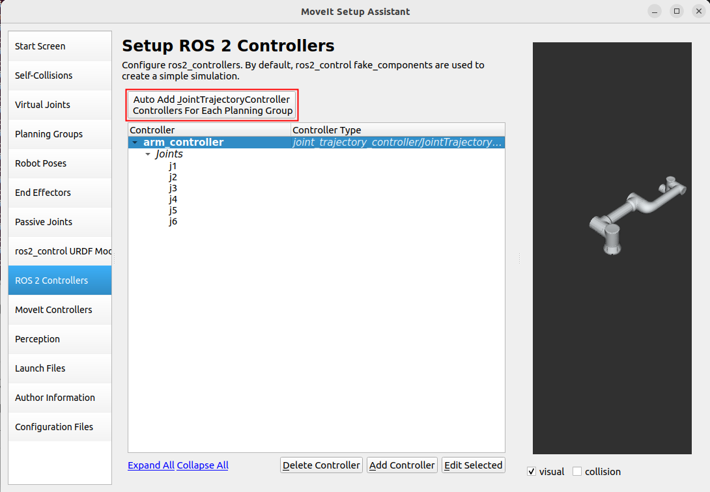

Moveit Controllers
^^^^^^^^^^^^^^^^^^^^^^^^^^^^^^^^^^^^^^^^
Moveit Controllers主要用于生成moveit_controllers文件，该文件设置了控制器名称、控制器类型等，需要注意的是moveit_controllers中的控制器名称需要与ros2_controllers的控制器名称相同，否则不能顺利运行。

并且当moveit_controllers中的控制器名称与ros2_controllers中的控制器名称相同时，moveit_controllers中的控制器类型会自动与ros2_controllers中的控制器类型映射到一起，实现下发的控制数据通过moveit_controllers发送给ros2_controllers，然后再通过ros2_controllers中的插件驱动实际机器人运动。

.. image:: img/fairino_harware_013.png
    :width: 6in
    :align: center

Launch Files
^^^^^^^^^^^^^^^^^^^^^^^^^^^^^^^^^^^^^^^^
配置Launch Files，使用默认配置即可。

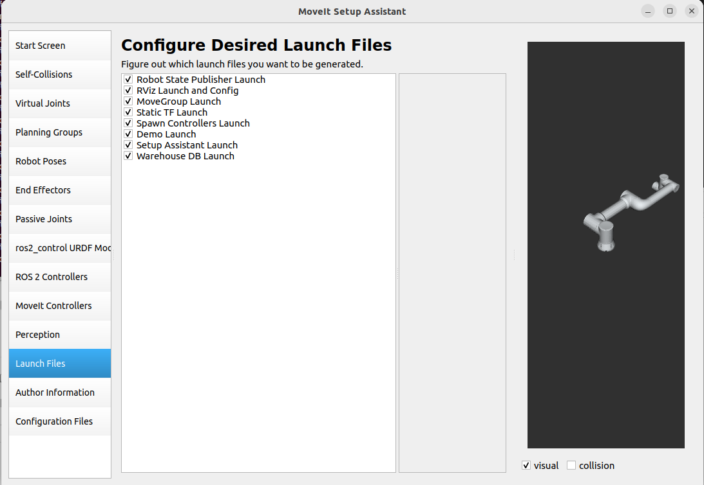

作者信息
^^^^^^^^^^^^^^^^^^^^^^^^^^^^^^^^^^^^^^^^
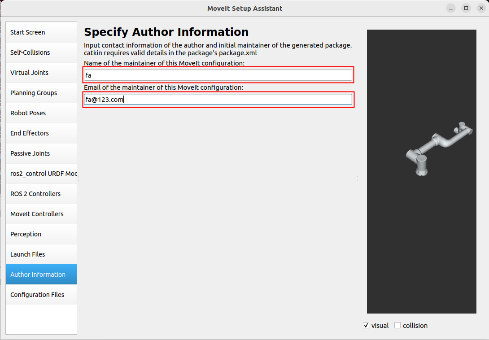

生成Launch文件
^^^^^^^^^^^^^^^^^^^^^^^^^^^^^^^^^^^^^^^^
生成Launch文件，选择生成位置，本次在test_fa_ws/src文件路径下创建一个文件夹fairino5_v6_robot_moveit_config用于存放配置文件，然后选择生成。

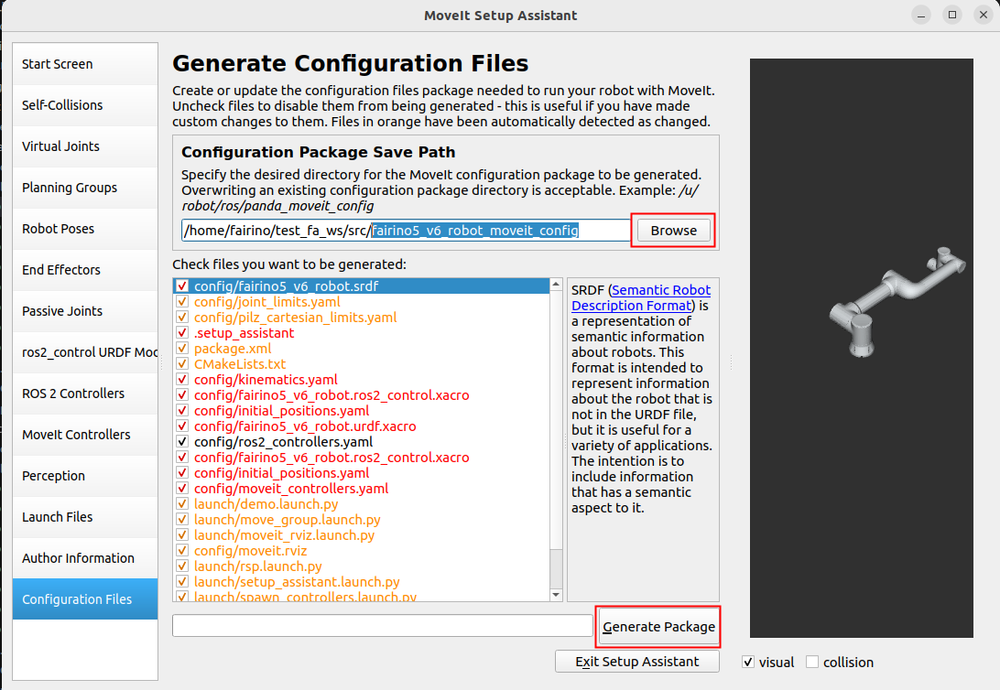

由于本次之前已经配置过一遍，若为初次配置Check files you want to be generated部分内容为黑色，说明可以生成Launch文件。

启动Launch
""""""""""""""""""""""""""""""""""
在配置完成后就可以进行功能包的编译，可以使用自定义机器人moveit2配置包替换法奥机器人moveit2配置包，实现针对用户自定义机器人的插件兼容使用

.. code-block:: shell
    :linenos:

    colcon build --packages-select fairino5_v6_robot_moveit_config
    source install/setup.bash

然后直接运行刚才配置好的Launch文件

.. code-block:: shell
    :linenos:

    ros2 launch fairino5_v6_robot_moveit_config demo.launch.py

就可以看到配置完成的rviz2界面。

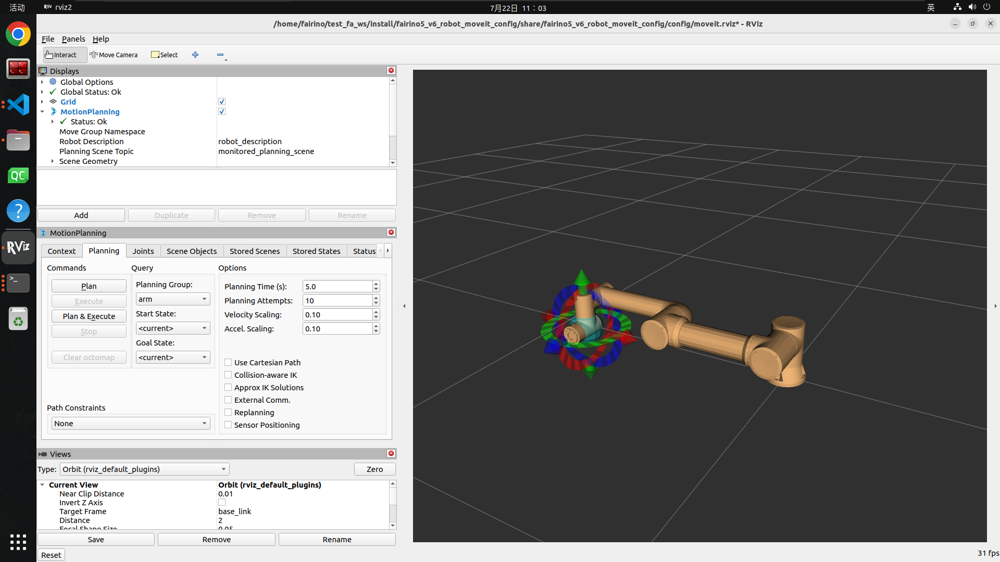

Moveit2使用
""""""""""""""""""""""""""""""""""
打开配置的包后，可以通过拖拽右侧3D界面中机器人末端的蓝色球体设置机器人目标位置，然后通过机器人末端红、绿、蓝三个圆环改变机器人末端姿态。

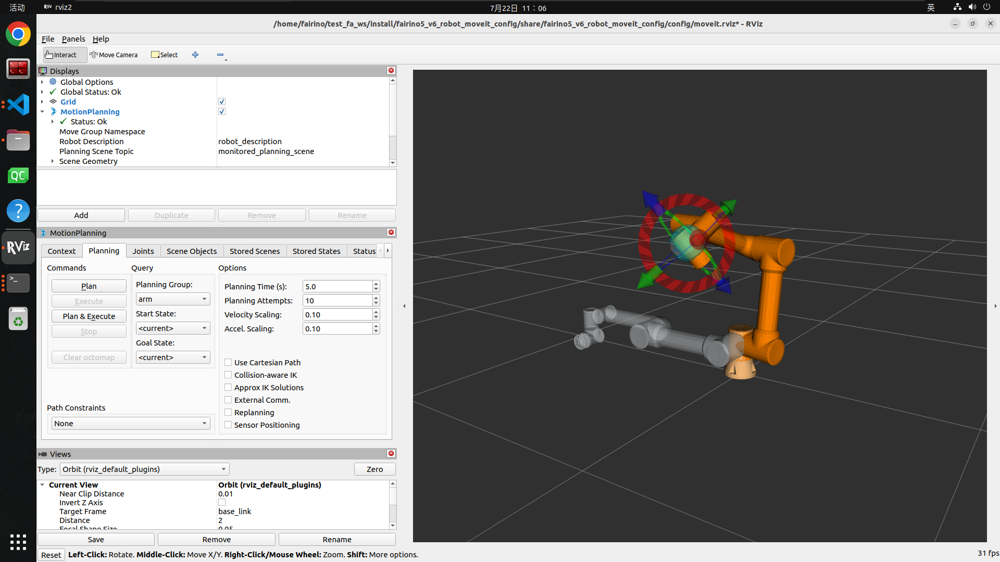

点击左侧Plan按钮，规划机器人运动轨迹。

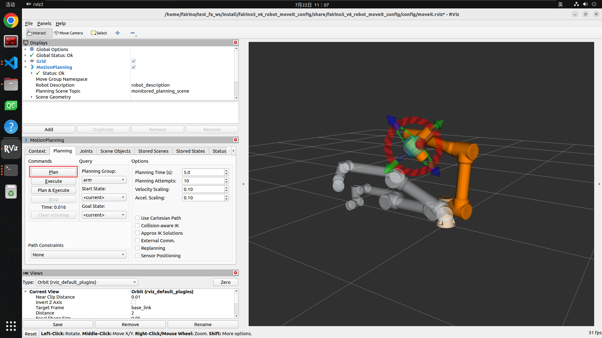

点击左侧Execute按钮，驱动机器人按规划的轨迹运动到目标位姿。

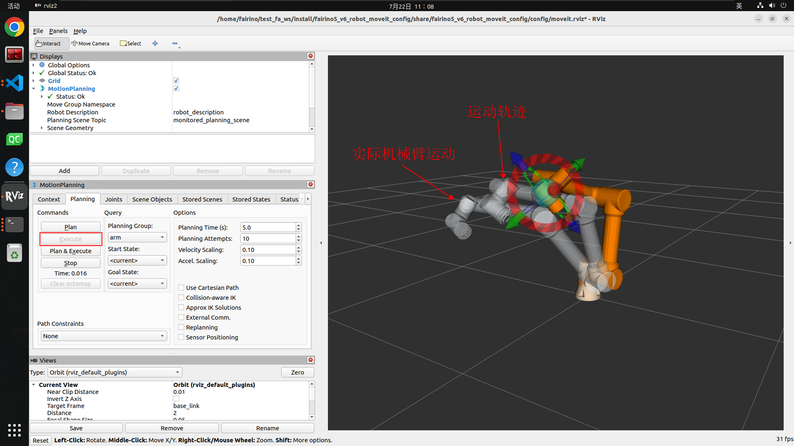

Plan&Execute按钮是在规划轨迹后自动控制机器人运动。

然后点击Joints标签可以通过改变各关节角度改变机器人目标位姿，然后通过Plan、Execute、Plan&Execute按钮驱动机器人运动。

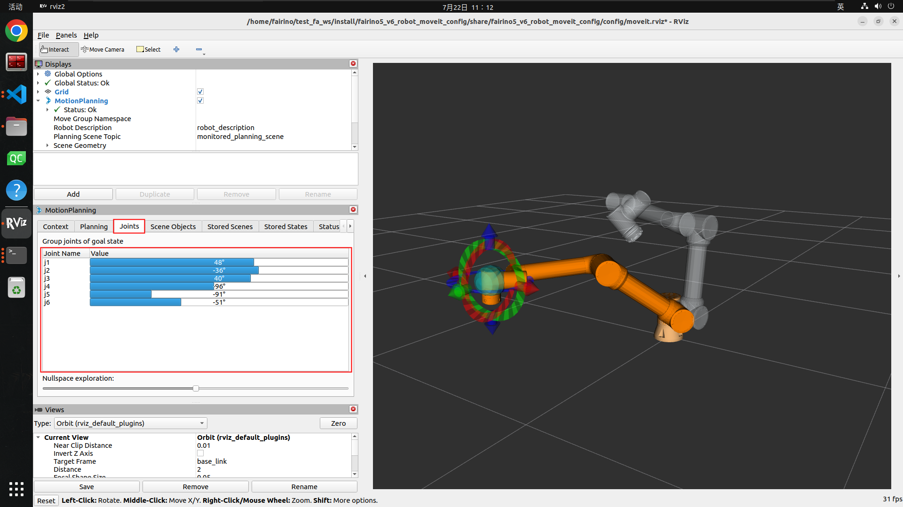

fairino_hardware插件（自定义机器人moveit配置包）
------------------------------------------------------------
fairino_hardware插件为连接moveit与机器人的中间层，通过fairino_hardware插件move_group将运动规划发送给moveit_control，然后转发给ros2_control，ros2_control再通过fairino_hardware插件驱动实际机器人运动，并且fairino_hardware插件还会接受实际机器人的反馈数据，从而实现rviz2仿真界面机器人模型与实际机器人的同步，从而实现用户通过rviz2界面驱动实际机器人运动功能。

并且由于fairino_hardware插件的实现，使得法奥机器人能够接入ros2_control控制框架，使法奥机器人能够兼容基于ros2_control的第三方功能包。

fairino_hardware插件编译
""""""""""""""""""""""""""""""""""
编译官方提供的ros2_ws功能包中的fairino_hardware插件功能包，通过上节编译fairino_hardware插件功能包，然后将会在

.. code-block:: shell
    :linenos:

    ros2_ws/install/fairino_hardware/lib/fairino_hardware
    
下看到插件生成的.so文件libfairino_hardware.so，说明插件编译成功。

需要注意的是需要使fairino_hardware插件对机器人各关节的命名与moveit2配置的机器人各关节命名相同，本fairino_hardware插件对机器人六个关节的命名由基坐标位置到机器人末端分别为j1、j2、j3、j4、j5、j6，所以在moveit2配置的机器人时需要将机器人的关节命名为j1、j2、j3、j4、j5、j6。

fairino_hardware插件使用
""""""""""""""""""""""""""""""""""
若采用配置的自定义机器人moveit配置包，进入目录

.. code-block:: shell
    :linenos:

    /home/fairino/test_fa_ws/install/fairino5_v6_robot_moveit_config/share/fairino5_v6_robot_moveit_config/config

下，找到fairino5_v6_robot.ros2_control.xacro文件，将文件第9行的

.. code-block:: shell
    :linenos:

    <plugin>mock_components/GenericSystem</plugin>

替换为

.. code-block:: shell
    :linenos:

    <plugin>fairino_hardware/FairinoHardwareInterface</plugin>

保存并退出。

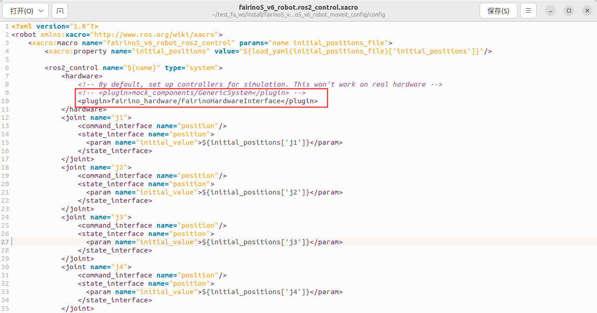

其中“fairino_hardware/FairinoHardwareInterface”hardware插件设置的插件名称，具体可以在“/home/fairino/ros2_ws/src/fairino_hardware”目录下的“fairino_hardware.xml”文件查看。

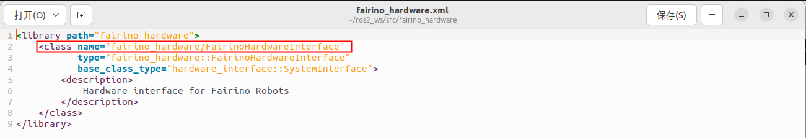

运行插件
""""""""""""""""""""""""""""""""""
打开终端，然后转到ros2_ws工作空间，并source工作空间，目的是将fairino_hardware插件添加进来，也可以将该路径加载到“~/.bashrc”文件中，但不建议

.. code-block:: shell
    :linenos:

    cd ros2_ws
    source install/setup.bash

然后回到主目录，然后转到test_fa_ws工作空间，并source工作空间，然后运行demo.launch.py文件

.. code-block:: shell
    :linenos:

    cd ..
    cd test_fa_ws
    source install/setup.bash
    ros2 launch fairino5_v6_robot_moveit_config demo.launch.py

运行结果
""""""""""""""""""""""""""""""""""
demo.launch.py文件启动后，rviz2界面如下图所示：

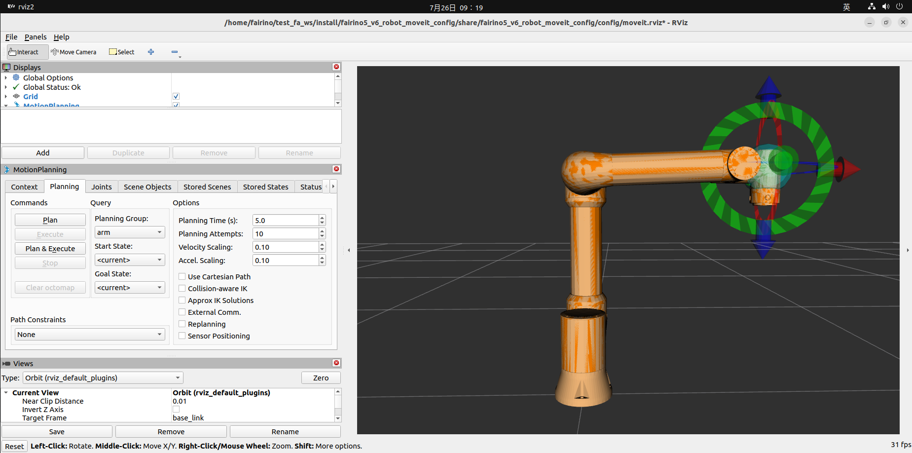

此时rviz2启动界面与3.3.1节的最大不同为机器人初始位姿，此时由于加入了fairino_hardware插件，该插件会实时接受实际机器人关节状态，并通过ros2_control反馈给move_group，进而控制rviz2界面上的仿真机器人位姿，从而实现实际机器人与rviz2仿真机器人的同步。

此时实际机器人位姿如下所示：

.. image:: img/fairino_harware_025.png
    :width: 3in
    :align: center

此时可以通过rviz2界面驱动实际机器人运动，拖拽rviz2界面中的机器人末端蓝色球体移动机器人末端到目标位置，然后拖动机器人末端红、绿、蓝三种颜色的圆环，改变机器人末端姿态，然后点击左侧Planning&Execute按钮，进行运动轨迹规划并驱动机器人运动，会发现实际机器人与rviz2界面上的仿真机器人进行同步运动，并运动到目标位姿停止。

下图为通过rviz2界面控制实际机器人和rviz2界面仿真机器人运动到目标位姿：

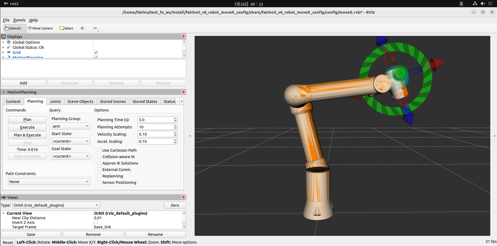

.. image:: img/fairino_harware_027.png
    :width: 3in
    :align: center

至此可以通过moveit2控制实际机器人和rviz2界面上的仿真机器人同步运动。

fairino_hardware插件（官方机器人moveit配置包）
---------------------------------------------------
在ros2_ws目录下编译与对应型号的机器人功能包，以fairino5机器人为例

.. code-block:: shell
    :linenos:

    cd ros2_ws
    colcon build --packages-select fairino5_v6_moveit2_config
    source install/setup.bash

然后需要添加fairino_hardware插件，用于与实际机器人同步运动，转到

.. code-block:: shell
    :linenos:

    ros2_ws/install/fairino5_v6_moveit2_config/share/fairino5_v6_moveit2_config/config
    
目录下，找到fairino5_v6_robot.ros2_control.xacro，将文件第9行的

.. code-block:: shell
    :linenos:

    <plugin>mock_components/GenericSystem</plugin>
    
替换为

.. code-block:: shell
    :linenos:

    <plugin>fairino_hardware/FairinoHardwareInterface</plugin>

保存并退出。

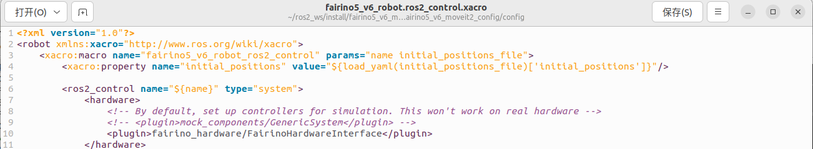

其中hardware插件设置的插件名称，具体可以在

.. code-block:: shell
    :linenos:

    /home/fairino/ros2_ws/src/fairino_hardware
    
目录下的“fairino_hardware.xml”文件查看。

此时运行插件需要转到ros2_ws工作空间下，然后source环境，运行demo.launch.py文件

.. code-block:: shell
    :linenos:

    cd ros2_ws
    source install/setup.bash
    ros2 launch fairino5_v6_moveit2_config demo.launch.py

mtc示例代码包
++++++++++++++++++++++++++++++

mtc示例代码包简介
---------------------------------------------------
mtc示例代码包提供了一个使用moveit2和fairino_hardware插件进行重构的rviz2界面，将原有的MotionPlanning标签页更换为Motion Planning Tasks标签页，用于显示机器人运动各个阶段，rviz2界面可以通过

.. code-block:: shell
    :linenos:

    ros2_ws/install/fairino_mtc_demo/share/fairino_mtc_demo/launch

路径下的“mtc.rviz”文件进行编辑，用户可以通过编辑“mtc.rviz”文件来定制符合用户功能需求的rviz2界面。

并且mtc示例代码包还提供了通过moveit2和fairino_hardware插件驱动机器人循环抓取目标的示例，通过该示例用户可以了解到如何通过代码的形式更好的利用moveit2和fairino_hardware插件与实际机器人进行交互，在此基础上用户可以进行符合需求的个性化定制。

mtc示例代码包编译
---------------------------------------------------

mtc示例代码包克隆
""""""""""""""""""""""""""""""""""
将官方提供的mtc示例代码包“fairino_robot”克隆到"ros2_ws"工作空间的src目录下。

机器人型号选择
""""""""""""""""""""""""""""""""""
在官方提供的mtc示例代码包的

.. code-block:: shell
    :linenos:

    ros2_ws/src/fairino_robot/fairino_mtc_demo/launch

目录下的mtc_demo_env.launch.py文件中选择机器人型号，修改该文件中第9、10、11行以匹配需要设置的机器人。

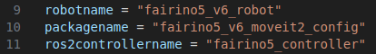

具体机器人型号命名可以参考

.. code-block:: shell
    :linenos:

    ros2_ws/src/fairino_robot/

目录下各机器人型号的功能包。

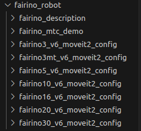

mtc示例代码包编译
""""""""""""""""""""""""""""""""""
编译fairino_description功能包
^^^^^^^^^^^^^^^^^^^^^^^^^^^^^^^^^^^^^^^^
打开终端，转到ros2_ws目录下，编译fairino_description功能包，然后进行source

.. code-block:: shell
    :linenos:

    cd ros2_ws
    colcon build --packages-select fairino_description
    source install/setup.bash

编译机器人功能包
^^^^^^^^^^^^^^^^^^^^^^^^^^^^^^^^^^^^^^^^
在ros2_ws目录下编译与型号对应的机器人功能包，以fairino5机器人为例

.. code-block:: shell
    :linenos:

    colcon build --packages-select fairino5_v6_moveit2_config
    source install/setup.bash

然后需要添加fairino_hardware插件，用于与实际机器人同步运动，转到

.. code-block:: shell
    :linenos:

    ros2_ws/install/fairino5_v6_moveit2_config/share/fairino5_v6_moveit2_config/config
    
目录下，找到fairino5_v6_robot.ros2_control.xacro，将文件第9行的

.. code-block:: shell
    :linenos:

    <plugin>mock_components/GenericSystem</plugin>
    
替换为

.. code-block:: shell
    :linenos:

    <plugin>fairino_hardware/FairinoHardwareInterface</plugin>
    
保存并退出。

编译fairino_mtc_demo功能包
^^^^^^^^^^^^^^^^^^^^^^^^^^^^^^^^^^^^^^^^
编译fairino_mtc_demo功能包，并进行source

.. code-block:: shell
    :linenos:

    colcon build --packages-select fairino_mtc_demo
    source install/setup.bash

mtc示例代码包运行
---------------------------------------------------
rviz2界面
""""""""""""""""""""""""""""""""""
运行mtc_demo_env.launch.py文件打开定制rviz2界面，其中Motion Planning Tasks标签页用于显示自定义的机器人各运动过程

.. code-block:: shell
    :linenos:

    cd ros2_ws
    source install/setup.bash
    ros2 launch fairino_mtc_demo mtc_demo_env.launch.py

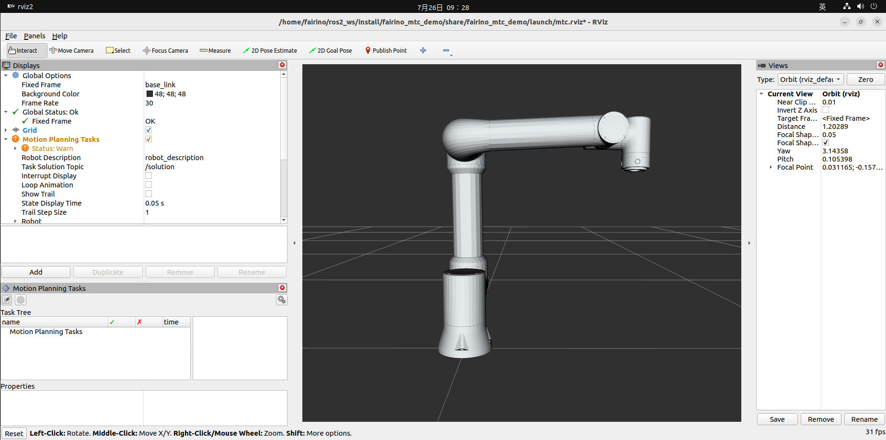

.. image:: img/fairino_harware_034.png
    :width: 3in
    :align: center

机器人运动
""""""""""""""""""""""""""""""""""
重新打开一个新终端，转到ros2_ws目录下，并source文件，运行mtc_demo_app.launch.py文件执行机器人运动

.. code-block:: shell
    :linenos:

    cd ros2_ws
    source install/setup.bash
    ros2 launch fairino_mtc_demo mtc_demo_app.launch.py

然后在rviz2界面Motion Planning Tasks标签页将会显示机器人各运动过程，并且实际机器人与rviz2界面仿真机器人将会同步运动。

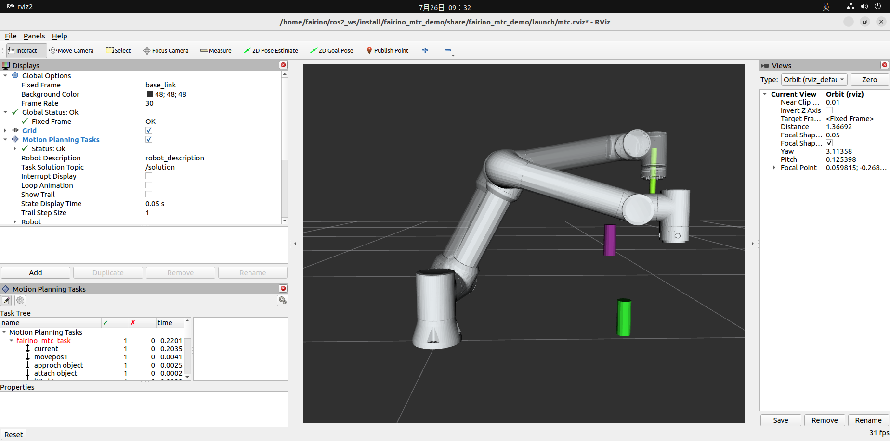

.. image:: img/fairino_harware_036.png
    :width: 3in
    :align: center

注意事项
++++++++++++++++++++++++++++++

fairino_hardware插件版本同步
---------------------------------------------------
使用fairino_hardware插件的前提需要fairino_hardware插件的版本与法奥机器人版本一致；

fairino_hardware插件接受法奥机器人反馈的数据并转换为ros2_control的指定的指令数据类型，然后将ros2_control发送的机器人运动数据转换为法奥机器人特定的数据帧；

鉴于此，fairino_hardware插件的数据类型与法奥机器人数据类型是否一致就至关重要，而插件与机器人的不同版本可能会导致数据类型不同，所以在正式调试fairino_hardware插件前，需确认法奥机器人版本与fairino_hardware插件版本是否一致，若不一致需要对法奥机器人进行升级。

- 首先可以在法奥机器人“WebAPP界面->系统设置->关于”界面查看机器人目前的各个版本型号。

.. image:: img/fairino_harware_037.png
    :width: 6in
    :align: center

- 然后准备官方提供的机器人软件包，然后进入法奥机器人“WebAPP界面->辅助应用->机器人本体->系统升级”界面，然后点击“选择文件”按钮，选择准备的与fairino_hardware插件版本对应的机器人软件升级包，选择“上传升级包”，等待软件升级完成。

- 升级完成后，系统会提示需要重启机器人，将机器人控制箱上的开关打到关闭挡位，等待25秒左右，然后启动机器人，至此机器人软件版本升级完成，可以进行后续的fairino_hardware插件的编译与使用。

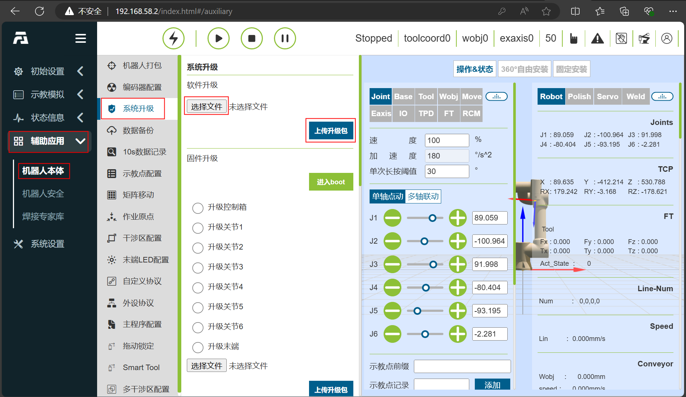

可能遇到的问题
---------------------------------------------------
可能在配置机器人功能包右侧加载不出来机器人模型。
""""""""""""""""""""""""""""""""""""""""""""""""""""""""""""""""""""
解决方法：这种错误可能是由于.urdf文件中的路径没有写对，可以通过修改.urdf文件中的路径和将meshes文件加复制进工作空间中的install/test_moveit/share/test_moveit下解决。

生成package后，运行出错。
""""""""""""""""""""""""""""""""""
解决方法：将launches.py文件中203行“default_value=moveit_config.move_gro-up_capabilities["capabilities"],”中的“["capabilities"]”删除即可解决。

总结
++++++++++++++++++++++++++++++
本手册阐述了MoveIt2插件的安装、配置与使用；fairino_hardware插件的安装与使用，实现rviz2仿真机器人与实际机器人的同步运动；以及mtc示例代码包的编译与运行，借助moveit2和fairino_hardware插件实现定制化功能。

希望通过本教程的阐述可以使用户对MoveIt2和fairino_hardware插件有更加全面的了解，希望能够帮助用户更好的个性化定制法奥机器人服务功能。