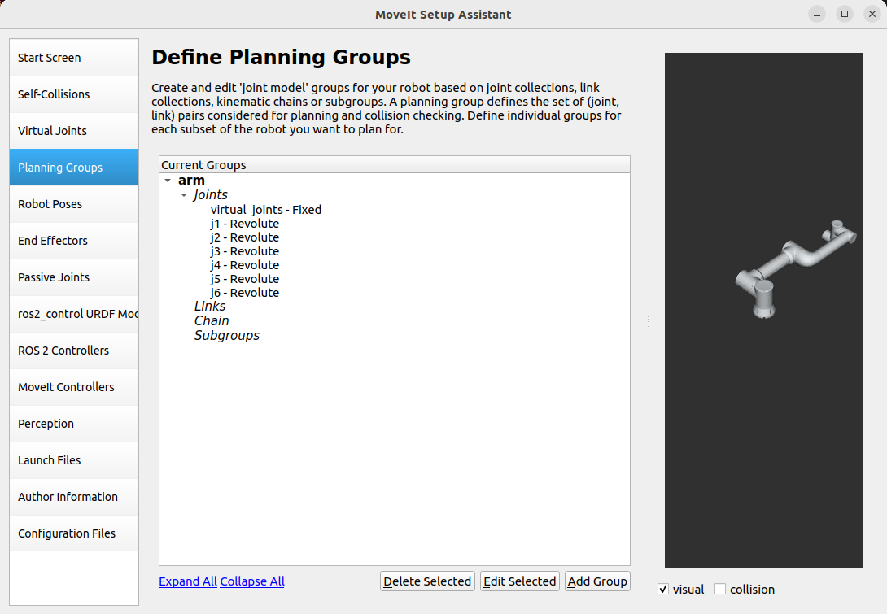
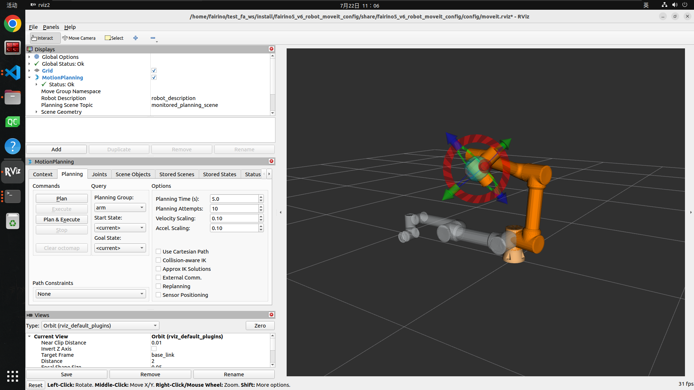
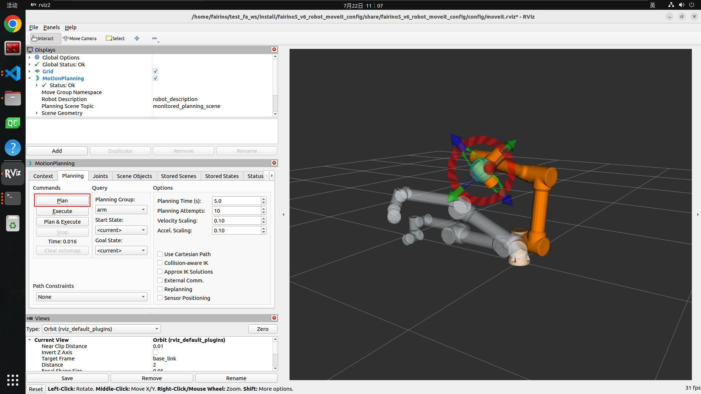
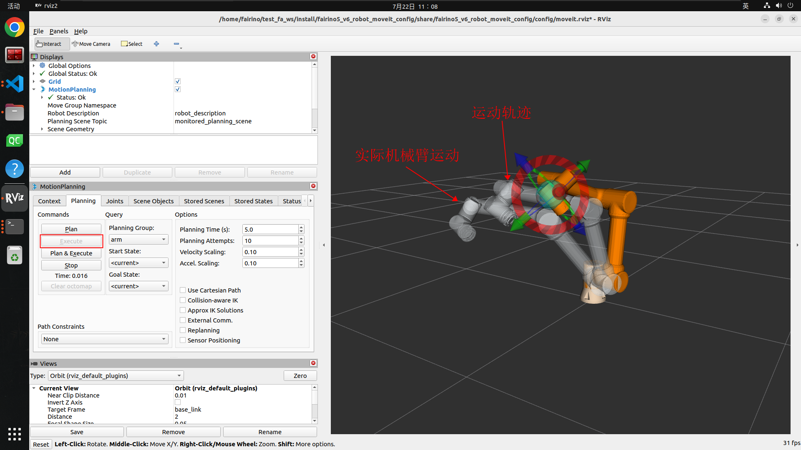
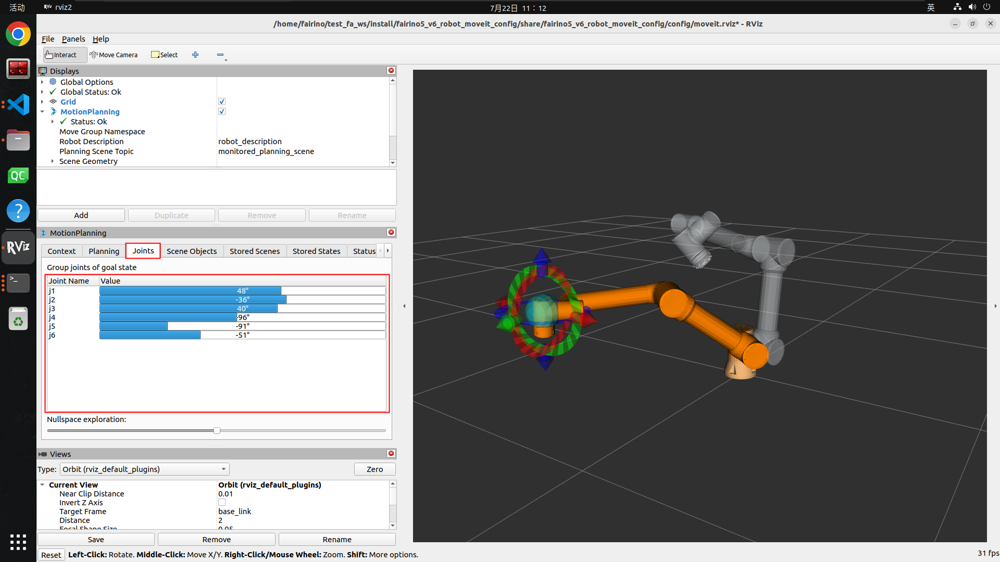
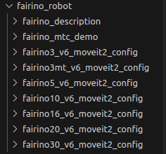
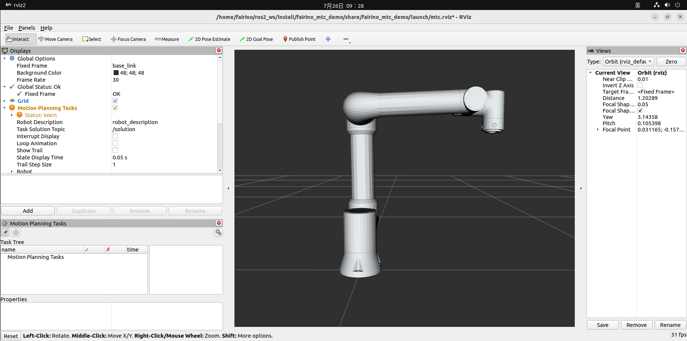
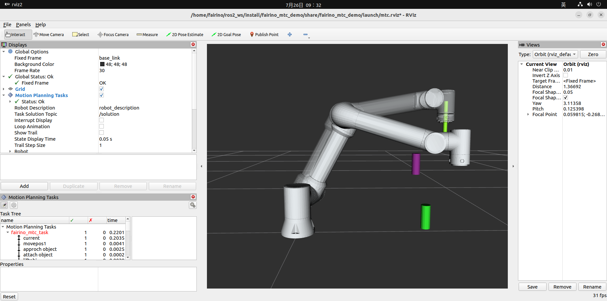
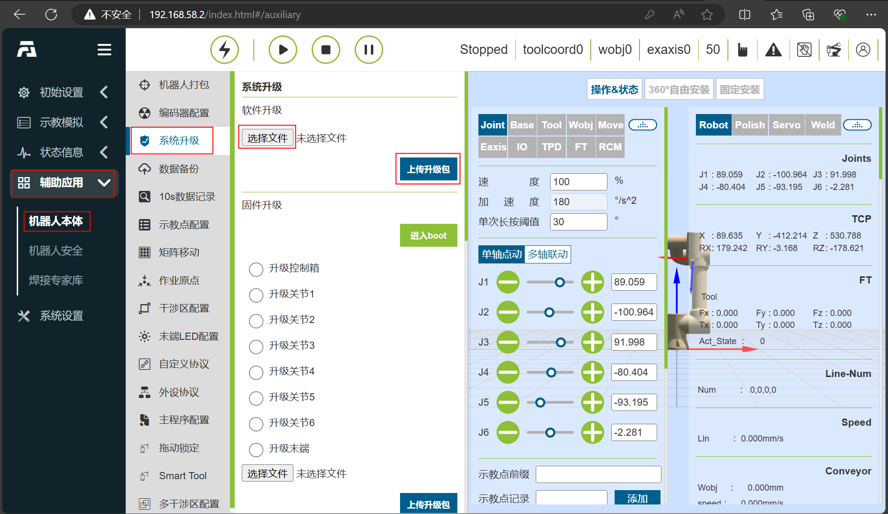

插件简介
++++++++++++++++++++++++++++++
法奥MoveIt2插件是一款为法奥机器人的运动控制与路径规划提供支持的插件。借助法奥MoveIt2插件能够实现复杂的机器人运动控制、路径规划、逆运动学求解和实时碰撞检测等功能，适用于多种机械臂应用场景，如工业、焊接、制造业、自动化上下料、码垛、医疗等场景。

快速使用
++++++++++++++++++++++++++++++
本章节说明APP运行环境如何配置。

推荐在Ubuntu22.04LTS(Jammy)上使用，系统安装完毕后，就可以安装ROS2，推荐用ros2-humble，ROS2的安装可以参考教程：https://docs.ros.org/en/humble/index.html。

法奥MoveIt2插件包安装及配置
------------------------------
克隆法奥MoveIt2插件
""""""""""""""""""""""""""""""""""
克隆法奥MoveIt2插件到本地，然后cd到目标目录下，其中主要文件包括fairino_msgs法奥机器人数据传输数据类型功能包；fairino_hardware法奥机器人fairino_hardware插件功能包；

fairino_robot/fairino_description法奥机器人外观及urdf文件功能包；

fairino_robot/fairino3mt_v6_moveit2_config、fairino_robot/fairino3_v6_moveit2_config、fairino_robot/fairino5_v6_moveit2_config、fairino_robot/fairino10_v6_moveit2_config、fairino_robot/fairino16_v6_moveit2_config、fairino_robot/fairino20_v6_moveit2_config、fairino_robot/fairino30_v6_moveit2_config法奥机器人moveit2配置包，fairino_robot/fairino_mtc_demo法奥mtc示例代码包。

.. image:: img/fairino_harware_001.png
    :width: 6in
    :align: center
.. image:: img/fairino_harware_002.png
    :width: 6in
    :align: center

编译功能包
""""""""""""""""""""""""""""""""""

编译fairino_msgs功能包

.. code-block:: shell
    :linenos:

    cd ros2_ws
    colcon build --packages-select fairino_msgs
    source install/setup.bash

编译fairino_hardware功能包

.. code-block:: shell
    :linenos:

    cd ros2_ws
    colcon build --packages-select fairino_hardware
    source install/setup.bash

编译fairino_description功能包

.. code-block:: shell
    :linenos:

    cd ros2_ws
    colcon build --packages-select fairino_description
    source install/setup.bash

编译法奥机器人moveit2配置包，以fairino5_v6_moveit2_config为例

.. code-block:: shell
    :linenos:

    cd ros2_ws
    colcon build --packages-select fairino5_v6_moveit2_config
    source install/setup.bash

编译法奥机器人fairino_mtc_demo示例代码包，若该代码示例包未出现在官方ros2_ws工作空间内，可联系售后服务获取

.. code-block:: shell
    :linenos:

    cd ros2_ws
    colcon build --packages-select fairino_mtc_demo
    source install/setup.bash

配置法奥机械臂Moveit2模型
------------------------------
若不想使用官方提供的机器人moveit2_config配置包，可以通过moveit_setup_assistant配置自定义机器人moveit2_config配置包。

创建工作空间
""""""""""""""""""""""""""""""""""
创建工作空间，并创建功能包

.. code-block:: shell
    :linenos:

    mkdir -p test_fa_ws/src
    cd test_fa_w/src
    mkdir fairino5_v6_robot_moveit_config
    cd ..
    cd ..

编译功能包，并source

.. code-block:: shell
    :linenos:

    colcon build
    source install/setup.bash

启动moveit_setup_assistant进行机器人配置

.. code-block:: shell
    :linenos:

    ros2 launch moveit_setup_assistant setup_assistant.launch.py

配置机器人
""""""""""""""""""""""""""""""""""
启动配置界面
^^^^^^^^^^^^^^^^^^^^^^^^^^^^^^^^^^^^^^^^
在test_fa_ws目录下打开终端，配置界面选择“Create New Moveit Configuration Package”，创建新的moveit配置功能包。

.. image:: img/fairino_harware_003.png
    :width: 6in
    :align: center

然后选中机器人的描述文件，即.urdf这个文件，然后选择Load Files，加载机器人模型，就可以看到右边加载出来了机器人的模型。

.. image:: img/fairino_harware_004.png
    :width: 6in
    :align: center

配置Self-Collisions
^^^^^^^^^^^^^^^^^^^^^^^^^^^^^^^^^^^^^^^^
Self-Collisions为机器人碰撞设置，点击Generate Collision Matrix既可自动生成关节碰撞矩阵，其会将两接触连杆以及永远接触不到的连杆之间的碰撞取消，从而配置机器人关节碰撞矩阵的，进而避免计算两接触面碰撞，点击Generate Collision Matrix既可自动生成。

.. image:: img/fairino_harware_005.png
    :width: 6in
    :align: center

配置Virtual Joints
^^^^^^^^^^^^^^^^^^^^^^^^^^^^^^^^^^^^^^^^
Virtual Joints为机器人虚拟轴，当机器人安装在移动平台上是就需要给机器人设置虚拟轴，设置虚拟轴的name、子连杆、关节类型等，当移动平台移动时，虚拟轴也同步运动，从而带动机器人运动，实现机器人随着移动平台运动的功能本次直接将机器人放置在world坐标系中，取名为virtual_joints。

.. image:: img/fairino_harware_006.png
    :width: 6in
    :align: center

配置Planning Groups
^^^^^^^^^^^^^^^^^^^^^^^^^^^^^^^^^^^^^^^^
Planning Groups为机器人的规划组，它将进行运动学计算时需要同一考虑的关节划在同一规划组内，进行统一的正逆向运动学计算，如将一机器人放在AGV小车上，再在机器人末端安装夹具，测试将AGV小车的四个关节划在一个规划组，机器人的六个关节划在一个规划组，夹具的一个关节划在一个规划组进行运动学计算。

由于本次不涉及夹具所以只添加机器人的各个关节组，即arm组，首先添加arm组，动力学求解器Kinematic Solver选择kdl_kinematics_plugin/KDLKinematicsPlugin，然后默认的规划器Group Default Planner选TRRT，然后点击Add Joints为这个规划组添加关节。

.. image:: img/fairino_harware_007.png
    :width: 6in
    :align: center

arm的关节按住shift可以进行多选，点击'>'进行添加，然后点击save保存。

.. image:: img/fairino_harware_008.png
    :width: 6in
    :align: center

定义好的规划组如下所示：

配置Robot Poses
^^^^^^^^^^^^^^^^^^^^^^^^^^^^^^^^^^^^^^^^
Robot Poses为机器人预设位姿，其为每个规划组定义一些预设的位姿，为arm定义一个home位姿态，这个姿态可以随意选择。

.. image:: img/fairino_harware_010.png
    :width: 6in
    :align: center

Robot Poses可以为每个规划组定义预设姿态，当机器人中存在夹具时，可在Planning Groups部分添加夹具规划组，然后在Robot Poses设置姿态时就可为夹具设置预设姿态。

配置End Effectors
^^^^^^^^^^^^^^^^^^^^^^^^^^^^^^^^^^^^^^^^
End Effectors为机器人末端执行机构，末端执行机构的规划组为hand，然后默认连接的parent_link是panda_link8，由于本次没有末端执行器，所以这一步可跳过。

ros2_control URDF Modifications
^^^^^^^^^^^^^^^^^^^^^^^^^^^^^^^^^^^^^^^^
ros2_control URDF Modifications主要用于设置下发和反馈的关节数据类型，可以选择位置、速度、扭矩三种，本次选择下发和反馈的关节数据类型都为位置控制，然后直接Add interfaces即可。

.. image:: img/fairino_harware_011.png
    :width: 6in
    :align: center

.. important:: 

   - 注意：

    选择关节数据类型需要与后续fairino_hardware插件相匹配，根据fairino_hardware插件传输数据选择下发和反馈的关节数据类型，由于本次控制实际机器人运动的fairino_hardware插件使用的是position数据类型，所以本次选择下发和反馈的关节数据类型都为位置控制。

ROS 2 Controllers
^^^^^^^^^^^^^^^^^^^^^^^^^^^^^^^^^^^^^^^^
ROS 2 Controllers主要用于生成ros2_controllers.yaml文件，该文件设置了发布频率、关节名称、控制器名称、控制器类型等，配置ROS 2 Controllers，为每个规划组配置控制器，点击Auto Add JointTrajectoryController Controllers For Each Planning Group即可。

.. image:: img/fairino_harware_012.png
    :width: 6in
    :align: center

Moveit Controllers
^^^^^^^^^^^^^^^^^^^^^^^^^^^^^^^^^^^^^^^^
Moveit Controllers主要用于生成moveit_controllers文件，该文件设置了控制器名称、控制器类型等，需要注意的是moveit_controllers中的控制器名称需要与ros2_controllers的控制器名称相同，否则不能顺利运行。

并且当moveit_controllers中的控制器名称与ros2_controllers中的控制器名称相同时，moveit_controllers中的控制器类型会自动与ros2_controllers中的控制器类型映射到一起，实现下发的控制数据通过moveit_controllers发送给ros2_controllers，然后再通过ros2_controllers中的插件驱动实际机器人运动。

.. image:: img/fairino_harware_013.png
    :width: 6in
    :align: center

Launch Files
^^^^^^^^^^^^^^^^^^^^^^^^^^^^^^^^^^^^^^^^
配置Launch Files，使用默认配置即可。

.. image:: img/fairino_harware_014.png
    :width: 6in
    :align: center

作者信息
^^^^^^^^^^^^^^^^^^^^^^^^^^^^^^^^^^^^^^^^
.. image:: img/fairino_harware_015.png
    :width: 6in
    :align: center

生成Launch文件
^^^^^^^^^^^^^^^^^^^^^^^^^^^^^^^^^^^^^^^^
生成Launch文件，选择生成位置，本次在test_fa_ws/src文件路径下创建一个文件夹fairino5_v6_robot_moveit_config用于存放配置文件，然后选择生成。

.. image:: img/fairino_harware_016.png
    :width: 6in
    :align: center

由于本次之前已经配置过一遍，若为初次配置Check files you want to be generated部分内容为黑色，说明可以生成Launch文件。

启动Launch
""""""""""""""""""""""""""""""""""
在配置完成后就可以进行功能包的编译，可以使用自定义机器人moveit2配置包替换法奥机器人moveit2配置包，实现针对用户自定义机器人的插件兼容使用

.. code-block:: shell
    :linenos:

    colcon build --packages-select fairino5_v6_robot_moveit_config
    source install/setup.bash

然后直接运行刚才配置好的Launch文件

.. code-block:: shell
    :linenos:

    ros2 launch fairino5_v6_robot_moveit_config demo.launch.py

就可以看到配置完成的rviz2界面。

.. image:: img/fairino_harware_017.png
    :width: 6in
    :align: center

Moveit2使用
""""""""""""""""""""""""""""""""""
打开配置的包后，可以通过拖拽右侧3D界面中机器人末端的蓝色球体设置机器人目标位置，然后通过机器人末端红、绿、蓝三个圆环改变机器人末端姿态。

点击左侧Plan按钮，规划机器人运动轨迹。

点击左侧Execute按钮，驱动机器人按规划的轨迹运动到目标位姿。

Plan&Execute按钮是在规划轨迹后自动控制机器人运动。

然后点击Joints标签可以通过改变各关节角度改变机器人目标位姿，然后通过Plan、Execute、Plan&Execute按钮驱动机器人运动。

Gazebo仿真环境量产型机器人适配功能包
++++++++++++++++++++++++++++++++++++++++++++++++++++++++++++++++++++++++++++++++++++++++++++++++++++++++++++++++++++++++

简介
------------------------------------------------------------

本项目提供FR系列量产型6自由度协作机器人在Gazebo Classic仿真环境下的仿真功能包，基于ROS2 Humble及ros2_control架构实现。每个机器人对应一个独立的ROS2功能包，采用标准ros2_control的GazeboSystem硬件接口，支持关节控制与关节状态反馈，本手册工作空间默认名为FR_Gazebo_ws，若自定义请自行替换。

支持的机型（11个功能包）
""""""""""""""""""""""""""""""""""""""""""""""""""""""""""""""""""""""""""""""""""""""""""""""""""""""""

表1-1  支持机型与功能包对照表

.. list-table::
   :widths: 50 50
   :header-rows: 0
   :align: center

   * - **机型** 
     - **功能包**

   * - FR3
     - fr3v6_ros2_control

   * - FR5
     - fr5v6_ros2_control

   * - FR10
     - fr10v6_ros2_control

   * - FR16
     - fr16v6_ros2_control

   * - FR20
     - fr20v6_ros2_control

   * - FR30
     - fr30v6_ros2_control

   * - FR3C
     - fr3c_ros2_control

   * - FR5C
     - fr5c_ros2_control

   * - FR5WML
     - fr5l_ros2_control

   * - FR3WML
     - fr3wml_ros2_control

   * - FR3WMS
     - fr3wms_ros2_control

核心特性
""""""""""""""""""""""""""""""""""""""""""""""""""""""""""""""""""""""""""""""""""""""""""""""""""""""""

- 统一关节命名：所有机型均为6个旋转关节，命名为j1 ~ j6，顺序为基座→肩→肘→腕1→腕2→腕3。
- 统一控制接口：通过/joint_trajectory_controller/joint_trajectory话题下发trajectory_msgs/msg/JointTrajectory指令（位置控制）。
- 关节状态反馈：通过各机型命名空间下的joint_states话题实时反馈关节角。
- 演示脚本：每个功能包附带*_demo.py，自动等待控制器就绪后演示各关节运动。

.. image:: img/039.png
    :width: 6in
    :align: center

.. centered:: 图 1-1  Gazebo仿真环境中机器人加载效果

环境要求
------------------------------

操作系统
""""""""""""""""""""""""""""""""""""""""""""""""""""""""""""""""""""""""""""""""""""""""""""""""""""""""

Ubuntu 22.04 LTS（ROS 2 Humble官方支持版本）。

软件依赖
""""""""""""""""""""""""""""""""""""""""""""""""""""""""""""""""""""""""""""""""""""""""""""""""""""""""

表2-1  软件依赖清单

.. list-table::
   :widths: 30 30 40
   :header-rows: 0
   :align: center

   * - **软件/组件** 
     - **版本/说明**
     - **安装位置**

   * - ROS 2
     - Humble
     - /opt/ros/humble

   * - Gazebo
     - Gazebo Classic 11（gzserver / gzclient）
     - 随gazebo_ros安装

   * - ros2_control源码工作空间
     - 含ros2_control、gazebo_ros2_control、ros2_controllers、controller_manager、joint_trajectory_controller、joint_state_broadcaster等
     - ~/ros2_control_ws

   * - Python 3
     - 运行launch与demo脚本
     - 系统自带
		
.. note:: 本工程依赖的gazebo_ros2_control、joint_trajectory_controller、joint_state_broadcaster等包来自源码编译的~/ros2_control_ws工作空间（ros-controls仓库）。启动/编译前必须source该工作空间，否则会出现"无法找到控制器/插件"错误。且建议使用默认编译类型，避免因调试符号导致插件加载异常。

功能包安装及编译步骤
------------------------------------------------------------------------------------------

前置准备：确认ros2_control工作空间
""""""""""""""""""""""""""""""""""""""""""""""""""""""""""""""""""""""""""""""""""""""""""""""""""""""""

确认~/ros2_control_ws已存在且已编译（内含ros-controls仓库）。若已存在，直接进入3.2节。若需搭建，可执行以下命令：

.. centered:: 代码3-1  搭建ros2_control工作空间
    
.. code-block:: console

    # 1. 创建工作空间并拉取 ros-controls 源码
    mkdir -p ~/ros2_control_ws/src
    cd ~/ros2_control_ws/src
    git clone https://github.com/ros-controls/ros2_control -b humble

    # 2. 编译（需已source ROS 2 Humble）
    source /opt/ros/humble/setup.bash
    cd ~/ros2_control_ws
    rosdep install --from-paths src --ignore-src -r -y
    colcon build
    source ~/ros2_control_ws/install/setup.bash

克隆仓库
""""""""""""""""""""""""""""""""""""""""""""""""""""""""""""""""""""""""""""""""""""""""""""""""""""""""

首先，克隆Gazebo适配功能包到本地，其中功能包包括fr3c_ros2_control、fr3v6_ros2_control、fr3wml_ros2_control、fr3wms_ros2_control、fr5c_ros2_control、fr5l_ros2_control、fr5v6_ros2_control、fr10v6_ros2_control、fr16v6_ros2_control、fr20v6_ros2_control、fr30v6_ros2_control。创建FR_Gazebo_ws/src文件夹，将上述功能包克隆到src目录下。

.. image:: img/040.png
    :width: 6in
    :align: center

.. centered:: 图3-1  src目录下机器人适配功能包

编译本工作空间
""""""""""""""""""""""""""""""""""""""""""""""""""""""""""""""""""""""""""""""""""""""""""""""""""""""""

本工程所有功能包均为文件型包（只安装URDF/launch/config/meshes）。

.. centered:: 代码3-2  编译FR_Gazebo_ws工作空间
    
.. code-block:: console

    # 1. 依次加载环境（顺序不能颠倒）
    source /opt/ros/humble/setup.bash
    source ~/ros2_control_ws/install/setup.bash

    # 2. 进入工作空间并编译
    cd ~/FR_Gazebo_ws
    colcon build

    # 3. 编译完成后加载本工作空间环境
    source ~/FR_Gazebo_ws/install/setup.bash

验证编译结果
""""""""""""""""""""""""""""""""""""""""""""""""""""""""""""""""""""""""""""""""""""""""""""""""""""""""

编译成功后，install/目录下应出现全部11个功能包：

代码3-3  验证编译结果
    
.. code-block:: console

    ls ~/FR_Gazebo_ws/install
    # 应看到：fr3v6_ros2_control  fr5v6_ros2_control  fr10v6_ros2_control  ... 共 11 个

.. image:: img/041.png
    :width: 6in
    :align: center

.. centered:: 图3-2  编译成功终端输出

使用方法
------------------------------------------------------------------------------------------

启动仿真（以FR5为例）
""""""""""""""""""""""""""""""""""""""""""""""""""""""""""""""""""""""""""""""""""""""""""""""""""""""""

.. centered:: 代码4-1  启动FR5仿真
    
.. code-block:: console

    # 1. 依次加载环境
    cd ~/FR_Gazebo_ws
    source /opt/ros/humble/setup.bash
    source ~/ros2_control_ws/install/setup.bash
    source ~/FR_Gazebo_ws/install/setup.bash

    # 2. 启动（launch会自动启动gzserver/gzclient、生成机器人并加载控制器，若需清理旧进程，请参考4.2节末尾的提示）
    ros2 launch fr5v6_ros2_control spawn_fr5v6.launch.py
    
启动过程中，launch会自动轮询等待controller_manager就绪后加载控制器。看到如下日志即表示就绪，若等待超过3分钟仍未显示“Successfully loaded”，请参考5.2节排查环境source顺序：

.. centered:: 代码4-2  控制器加载成功日志
    
.. code-block:: console

    Successfully loaded controller joint_trajectory_controller into state active

.. image:: img/042.png
    :width: 6in
    :align: center

.. centered:: 图4-1  控制器加载成功终端日志

.. image:: img/043.png
    :width: 6in
    :align: center

.. centered:: 图4-2  Gazebo界面机器人初始姿态

全机型启动命令对照表
""""""""""""""""""""""""""""""""""""""""""""""""""""""""""""""""""""""""""""""""""""""""""""""""""""""""

所有机型的操作流程一致，仅功能包名、launch文件名、命名空间不同：

表4-1  全机型启动命令对照表

.. list-table::
   :widths: 20 40 20 20
   :header-rows: 0
   :align: center

   * - **机型** 
     - **启动命令**
     - **命名空间**
     - **关节状态话题**

   * - FR3 
     - ros2 launch fr3v6_ros2_control spawn_fr3v6.launch.py
     - fr3v6
     - /fr3v6/joint_states

   * - FR5 
     - ros2 launch fr5v6_ros2_control spawn_fr5v6.launch.py
     - fr5v6
     - /fr5v6/joint_states

   * - FR10 
     - ros2 launch fr10v6_ros2_control spawn_fr10v6.launch.py
     - fr10v6
     - /fr10v6/joint_states

   * - FR16 
     - ros2 launch fr16v6_ros2_control spawn_fr16v6.launch.py
     - fr16v6
     - /fr16v6/joint_states

   * - FR20 
     - ros2 launch fr20v6_ros2_control spawn_fr20v6.launch.py
     - fr20v6
     - /fr20v6/joint_states

   * - FR30 
     - ros2 launch fr30v6_ros2_control spawn_fr30v6.launch.py
     - fr30v6
     - /fr30v6/joint_states

   * - FR3C 
     - ros2 launch fr3c_ros2_control spawn_fr3c.launch.py
     - fr3c
     - /fr3c/joint_states

   * - FR3WML 
     - ros2 launch fr3wml_ros2_control spawn_FR3WML.launch.py
     - fr3wml
     - /fr3wml/joint_states

   * - FR3WMS 
     - ros2 launch fr3wms_ros2_control spawn_FR3WMS.launch.py
     - fr3wms
     - /fr3wms/joint_states

   * - FR5C 
     - ros2 launch fr5c_ros2_control spawn_fr5c.launch.py
     - fr5c
     - /fr5c/joint_states

   * - FR5WML 
     - ros2 launch fr5l_ros2_control spawn_fr5l.launch.py
     - fr5l
     - /fr5l/joint_states
			
.. note:: 一次仅能启动一个机型。若需切换须先关闭当前Gazebo进程（pkill -9 gzserver; pkill -9 gzclient），否则新实例会因端口冲突而失败。

手动控制（下发目标关节）
""""""""""""""""""""""""""""""""""""""""""""""""""""""""""""""""""""""""""""""""""""""""""""""""""""""""

控制器就绪后，向/joint_trajectory_controller/joint_trajectory下发目标关节（6个关节弧度值）：

.. centered:: 代码4-3  手动下发关节轨迹指令
    
.. code-block:: console

    # 移动到目标关节 [1.57, -0.78, -1.57, -1.2, 1.57, 1.3]（单位：弧度）
    ros2 topic pub --once /joint_trajectory_controller/joint_trajectory \
    trajectory_msgs/msg/JointTrajectory \
    "{joint_names: [j1,j2,j3,j4,j5,j6],
        points: [{positions: [1.57, -0.78, -1.57, -1.2, 1.57, 1.3],
                time_from_start: {sec: 2, nanosec: 0}}]}"

    # 回零位
    ros2 topic pub --once /joint_trajectory_controller/joint_trajectory \
    trajectory_msgs/msg/JointTrajectory \
    "{joint_names: [j1,j2,j3,j4,j5,j6],
        points: [{positions: [0.0, 0.0, 0.0, 0.0, 0.0, 0.0],
                time_from_start: {sec: 2, nanosec: 0}}]}"

.. note:: 角度换算公式为 弧度 = 角度 × π / 180。常用值：90° ≈ 1.5708，−90° ≈ −1.5708，100° ≈ 1.7453。

运行演示脚本
""""""""""""""""""""""""""""""""""""""""""""""""""""""""""""""""""""""""""""""""""""""""""""""""""""""""

每个功能包自带演示脚本，会自动等待controller_manager就绪后，逐关节完成0→±90°的往复运动：

.. centered:: 代码4-4  运行演示脚本
    
.. code-block:: console

    # 以FR5为例（其他机型替换脚本路径中的包名即可）
    python3 ~/FR_Gazebo_ws/src/fr5v6_ros2_control/scripts/fr5v6_demo.py

表4-2  全机型演示脚本路径对照表

.. list-table::
   :widths: 30 70
   :header-rows: 0
   :align: center

   * - **机型** 
     - **演示脚本路径**

   * - FR3
     - ~/FR_Gazebo_ws/src/fr3v6_ros2_control/scripts/fr3v6_demo.py

   * - FR5
     - ~/FR_Gazebo_ws/src/fr5v6_ros2_control/scripts/fr5v6_demo.py

   * - FR10
     - ~/FR_Gazebo_ws/src/fr10v6_ros2_control/scripts/fr10v6_demo.py

   * - FR16
     - ~/FR_Gazebo_ws/src/fr16v6_ros2_control/scripts/fr16v6_demo.py

   * - FR20
     - ~/FR_Gazebo_ws/src/fr20v6_ros2_control/scripts/fr20v6_demo.py

   * - FR30
     - ~/FR_Gazebo_ws/src/fr30v6_ros2_control/scripts/fr30v6_demo.py

   * - FR3C
     - ~/FR_Gazebo_ws/src/fr3c_ros2_control/scripts/fr3c_demo.py

   * - FR3WML
     - ~/FR_Gazebo_ws/src/fr3wml_ros2_control/scripts/fr3wml_demo.py

   * - FR3WMS
     - ~/FR_Gazebo_ws/src/fr3wms_ros2_control/scripts/fr3wms_demo.py

   * - FR5C
     - ~/FR_Gazebo_ws/src/fr5c_ros2_control/scripts/fr5c_demo.py

   * - FR5WML
     - ~/FR_Gazebo_ws/src/fr5l_ros2_control/scripts/fr5l_demo.py

.. image:: img/044.png
    :width: 6in
    :align: center

.. centered:: 图4-3  演示脚本运行中机器人运动姿态

监控关节状态
""""""""""""""""""""""""""""""""""""""""""""""""""""""""""""""""""""""""""""""""""""""""""""""""""""""""

.. centered:: 代码4-5  监控关节状态
    
.. code-block:: console
        
    # 实时查看关节角
    ros2 topic echo /joint_states

.. image:: img/045.png
    :width: 6in
    :align: center

.. centered:: 图4-4  关节状态实时输出

常见问题
------------------------------------------------------------------------------------------

启动时报端口冲突/Gazebo打不开
""""""""""""""""""""""""""""""""""""""""""""""""""""""""""""""""""""""""""""""""""""""""""""""""""""""""

- 原因：上一次的 Gazebo 进程未退出，占用了端口。
- 解决：启动前先清理残留进程：pkill -9 gzserver; pkill -9 gzclient

一直卡在Waiting for controller_manager...，超过2分钟
""""""""""""""""""""""""""""""""""""""""""""""""""""""""""""""""""""""""""""""""""""""""""""""""""""""""

- 原因：controller_manager未就绪，常见于未source ~/ros2_control_ws/install/setup.bash，或网格加载过慢。
- 解决：先Ctrl+C退出；确认已按顺序source三个环境(ros2→ros2_control_ws→FR_Gazebo_ws）。

手动发送指令但机器人不动
""""""""""""""""""""""""""""""""""""""""""""""""""""""""""""""""""""""""""""""""""""""""""""""""""""""""

- 原因：大部分可能为时序问题，控制器尚未完全进入active状态就发了指令，指令被丢弃。
- 解决：确认终端打印Successfully loaded controller joint_trajectory_controller into state active后再发控制指令；或直接改用4.4节的demo脚本。

提示无joint_trajectory_controller/gazebo_ros2_control插件
""""""""""""""""""""""""""""""""""""""""""""""""""""""""""""""""""""""""""""""""""""""""""""""""""""""""

- 原因：ros2_control相关依赖未加载。
- 解决：确认已source ~/ros2_control_ws/install/setup.bash；并确认~/.bashrc或当前终端加载顺序为ROS→ros2_control_ws→本工作空间。

机器人加载后缺部件/关节显示不完整
""""""""""""""""""""""""""""""""""""""""""""""""""""""""""""""""""""""""""""""""""""""""""""""""""""""""

- 原因：URDF引用的网格文件缺失。
- 解决：确认对应功能包的meshes/目录存在且完整。

能否同时启动两个机型
""""""""""""""""""""""""""""""""""""""""""""""""""""""""""""""""""""""""""""""""""""""""""""""""""""""""

- 不能。多个仿真实例会争用同一Gazebo端口，应一次只启动一个机型。

fairino_hardware插件（自定义机器人moveit配置包）
++++++++++++++++++++++++++++++++++++++++++++++++++++++++++++++++++++++++++++++++++++++++++
fairino_hardware插件为连接moveit与机器人的中间层，通过fairino_hardware插件move_group将运动规划发送给moveit_control，然后转发给ros2_control，ros2_control再通过fairino_hardware插件驱动实际机器人运动，并且fairino_hardware插件还会接受实际机器人的反馈数据，从而实现rviz2仿真界面机器人模型与实际机器人的同步，从而实现用户通过rviz2界面驱动实际机器人运动功能。

并且由于fairino_hardware插件的实现，使得法奥机器人能够接入ros2_control控制框架，使法奥机器人能够兼容基于ros2_control的第三方功能包。

在适配机械臂软件版本V3.8.3的fairino_hardware插件中，新增了扭矩模式及指令扭矩接口，使得机械臂可以进入扭矩模式并接收指令扭矩。

fairino_hardware插件编译
------------------------------------------------------------------------------------------------
编译官方提供的ros2_ws功能包中的fairino_hardware插件功能包，通过上节编译fairino_hardware插件功能包，然后将会在

.. code-block:: shell
    :linenos:

    ros2_ws/install/fairino_hardware/lib/fairino_hardware
    
下看到插件生成的.so文件libfairino_hardware.so，说明插件编译成功。

需要注意的是需要使fairino_hardware插件对机器人各关节的命名与moveit2配置的机器人各关节命名相同，本fairino_hardware插件对机器人六个关节的命名由基坐标位置到机器人末端分别为j1、j2、j3、j4、j5、j6，所以在moveit2配置的机器人时需要将机器人的关节命名为j1、j2、j3、j4、j5、j6。

fairino_hardware插件使用
------------------------------------------------------------------------------------------------

若采用配置的自定义机器人moveit配置包，进入目录

.. code-block:: shell
    :linenos:

    /home/fairino/test_fa_ws/install/fairino5_v6_robot_moveit_config/share/fairino5_v6_robot_moveit_config/config

下，找到fairino5_v6_robot.ros2_control.xacro文件，将文件第3行的参数

.. code-block:: shell
    :linenos:

    use_fake_hardware:=false

替换为

.. code-block:: shell
    :linenos:

    use_fake_hardware:=true

根据后续的if判断可以看到，将use_fake_hardware设置成true是启用fairino_hardware/FairinoHardwareInterface这个插件，保存文件并退出即可。

.. image:: img/fairino_harware_022.png
    :width: 6in
    :align: center

其中“fairino_hardware/FairinoHardwareInterface”hardware插件设置的插件名称，具体可以在“/home/fairino/ros2_ws/src/fairino_hardware”目录下的“fairino_hardware.xml”文件查看。

.. image:: img/fairino_harware_023.png
    :width: 6in
    :align: center

注意，在文件第3行中的robot_control_mode参数决定了加载插件时候暴露的指令接口，即参数代表了控制模式，0为位置控制模式，插件会暴露position接口，1为扭矩控制模式，插件会暴露effort接口。针对扭矩控制接口的demo预计会在适配机械臂软件V3.8.5版本的fairino_hardware功能包中推出。

当前的Moveit2控制器仅支持位置控制模式，请不要将robot_control_mode设置为1。

运行插件
------------------------------------------------------------------------------------------------

打开终端，然后转到ros2_ws工作空间，并source工作空间，目的是将fairino_hardware插件添加进来，也可以将该路径加载到“~/.bashrc”文件中，但不建议

.. code-block:: shell
    :linenos:

    cd ros2_ws
    source install/setup.bash

然后回到主目录，然后转到test_fa_ws工作空间，并source工作空间，然后运行demo.launch.py文件

.. code-block:: shell
    :linenos:

    cd ..
    cd test_fa_ws
    source install/setup.bash
    ros2 launch fairino5_v6_robot_moveit_config demo.launch.py

运行结果
------------------------------------------------------------------------------------------------

demo.launch.py文件启动后，rviz2界面如下图所示：

.. image:: img/fairino_harware_024.png
    :width: 6in
    :align: center

此时rviz2启动界面与3.3.1节的最大不同为机器人初始位姿，此时由于加入了fairino_hardware插件，该插件会实时接受实际机器人关节状态，并通过ros2_control反馈给move_group，进而控制rviz2界面上的仿真机器人位姿，从而实现实际机器人与rviz2仿真机器人的同步。

此时实际机器人位姿如下所示：

.. image:: img/fairino_harware_025.png
    :width: 3in
    :align: center

此时可以通过rviz2界面驱动实际机器人运动，拖拽rviz2界面中的机器人末端蓝色球体移动机器人末端到目标位置，然后拖动机器人末端红、绿、蓝三种颜色的圆环，改变机器人末端姿态，然后点击左侧Planning&Execute按钮，进行运动轨迹规划并驱动机器人运动，会发现实际机器人与rviz2界面上的仿真机器人进行同步运动，并运动到目标位姿停止。

下图为通过rviz2界面控制实际机器人和rviz2界面仿真机器人运动到目标位姿：

.. image:: img/fairino_harware_026.png
    :width: 6in
    :align: center

.. image:: img/fairino_harware_027.png
    :width: 3in
    :align: center

至此可以通过moveit2控制实际机器人和rviz2界面上的仿真机器人同步运动。

mtc示例代码包
++++++++++++++++++++++++++++++

mtc示例代码包简介
---------------------------------------------------
mtc示例代码包提供了一个使用moveit2和fairino_hardware插件进行重构的rviz2界面，将原有的MotionPlanning标签页更换为Motion Planning Tasks标签页，用于显示机器人运动各个阶段，rviz2界面可以通过

.. code-block:: shell
    :linenos:

    ros2_ws/install/fairino_mtc_demo/share/fairino_mtc_demo/launch

路径下的“mtc.rviz”文件进行编辑，用户可以通过编辑“mtc.rviz”文件来定制符合用户功能需求的rviz2界面。

并且mtc示例代码包还提供了通过moveit2和fairino_hardware插件驱动机器人循环抓取目标的示例，通过该示例用户可以了解到如何通过代码的形式更好的利用moveit2和fairino_hardware插件与实际机器人进行交互，在此基础上用户可以进行符合需求的个性化定制。

mtc示例代码包编译
---------------------------------------------------

mtc示例代码包克隆
""""""""""""""""""""""""""""""""""
将官方提供的mtc示例代码包“fairino_robot”克隆到"ros2_ws"工作空间的src目录下。

机器人型号选择
""""""""""""""""""""""""""""""""""
在官方提供的mtc示例代码包的

.. code-block:: shell
    :linenos:

    ros2_ws/src/fairino_robot/fairino_mtc_demo/launch

目录下的mtc_demo_env.launch.py文件中选择机器人型号，修改该文件中第9、10、11行以匹配需要设置的机器人。

.. image:: img/fairino_harware_030.png
    :width: 6in
    :align: center

具体机器人型号命名可以参考

.. code-block:: shell
    :linenos:

    ros2_ws/src/fairino_robot/

目录下各机器人型号的功能包。

mtc示例代码包编译
""""""""""""""""""""""""""""""""""
编译fairino_description功能包
^^^^^^^^^^^^^^^^^^^^^^^^^^^^^^^^^^^^^^^^
打开终端，转到ros2_ws目录下，编译fairino_description功能包，然后进行source

.. code-block:: shell
    :linenos:

    cd ros2_ws
    colcon build --packages-select fairino_description
    source install/setup.bash

编译机器人功能包
^^^^^^^^^^^^^^^^^^^^^^^^^^^^^^^^^^^^^^^^
在ros2_ws目录下编译与型号对应的机器人功能包，以fairino5机器人为例

.. code-block:: shell
    :linenos:

    colcon build --packages-select fairino5_v6_moveit2_config
    source install/setup.bash

然后需要添加fairino_hardware插件，用于与实际机器人同步运动，转到

.. code-block:: shell
    :linenos:

    ros2_ws/install/fairino5_v6_moveit2_config/share/fairino5_v6_moveit2_config/config
    
目录下，找到fairino5_v6_robot.ros2_control.xacro，将文件第9行的

.. code-block:: shell
    :linenos:

    <plugin>mock_components/GenericSystem</plugin>
    
替换为

.. code-block:: shell
    :linenos:

    <plugin>fairino_hardware/FairinoHardwareInterface</plugin>
    
保存并退出。

.. image:: img/fairino_harware_032.png
    :width: 6in
    :align: center

编译fairino_mtc_demo功能包
^^^^^^^^^^^^^^^^^^^^^^^^^^^^^^^^^^^^^^^^
编译fairino_mtc_demo功能包，并进行source

.. code-block:: shell
    :linenos:

    colcon build --packages-select fairino_mtc_demo
    source install/setup.bash

mtc示例代码包运行
---------------------------------------------------
rviz2界面
""""""""""""""""""""""""""""""""""
运行mtc_demo_env.launch.py文件打开定制rviz2界面，其中Motion Planning Tasks标签页用于显示自定义的机器人各运动过程

.. code-block:: shell
    :linenos:

    cd ros2_ws
    source install/setup.bash
    ros2 launch fairino_mtc_demo mtc_demo_env.launch.py

.. image:: img/fairino_harware_034.png
    :width: 3in
    :align: center

机器人运动
""""""""""""""""""""""""""""""""""
重新打开一个新终端，转到ros2_ws目录下，并source文件，运行mtc_demo_app.launch.py文件执行机器人运动

.. code-block:: shell
    :linenos:

    cd ros2_ws
    source install/setup.bash
    ros2 launch fairino_mtc_demo mtc_demo_app.launch.py

然后在rviz2界面Motion Planning Tasks标签页将会显示机器人各运动过程，并且实际机器人与rviz2界面仿真机器人将会同步运动。

.. image:: img/fairino_harware_036.png
    :width: 3in
    :align: center

注意事项
++++++++++++++++++++++++++++++

fairino_hardware插件版本同步
---------------------------------------------------
使用fairino_hardware插件的前提需要fairino_hardware插件的版本与法奥机器人版本一致；

fairino_hardware插件接受法奥机器人反馈的数据并转换为ros2_control的指定的指令数据类型，然后将ros2_control发送的机器人运动数据转换为法奥机器人特定的数据帧；

鉴于此，fairino_hardware插件的数据类型与法奥机器人数据类型是否一致就至关重要，而插件与机器人的不同版本可能会导致数据类型不同，所以在正式调试fairino_hardware插件前，需确认法奥机器人版本与fairino_hardware插件版本是否一致，若不一致需要对法奥机器人进行升级。

- 首先可以在法奥机器人“WebAPP界面->系统设置->关于”界面查看机器人目前的各个版本型号。

.. image:: img/fairino_harware_037.png
    :width: 6in
    :align: center

- 然后准备官方提供的机器人软件包，然后进入法奥机器人“WebAPP界面->辅助应用->机器人本体->系统升级”界面，然后点击“选择文件”按钮，选择准备的与fairino_hardware插件版本对应的机器人软件升级包，选择“上传升级包”，等待软件升级完成。

- 升级完成后，系统会提示需要重启机器人，将机器人控制箱上的开关打到关闭挡位，等待25秒左右，然后启动机器人，至此机器人软件版本升级完成，可以进行后续的fairino_hardware插件的编译与使用。

可能遇到的问题
---------------------------------------------------
可能在配置机器人功能包右侧加载不出来机器人模型。
""""""""""""""""""""""""""""""""""""""""""""""""""""""""""""""""""""
解决方法：这种错误可能是由于.urdf文件中的路径没有写对，可以通过修改.urdf文件中的路径和将meshes文件加复制进工作空间中的install/test_moveit/share/test_moveit下解决。

生成package后，运行出错。
""""""""""""""""""""""""""""""""""
解决方法：将launches.py文件中203行“default_value=moveit_config.move_gro-up_capabilities["capabilities"],”中的“["capabilities"]”删除即可解决。

总结
++++++++++++++++++++++++++++++
本手册阐述了MoveIt2插件的安装、配置与使用；fairino_hardware插件的安装与使用，实现rviz2仿真机器人与实际机器人的同步运动；以及mtc示例代码包的编译与运行，借助moveit2和fairino_hardware插件实现定制化功能。

希望通过本教程的阐述可以使用户对MoveIt2和fairino_hardware插件有更加全面的了解，希望能够帮助用户更好的个性化定制法奥机器人服务功能。