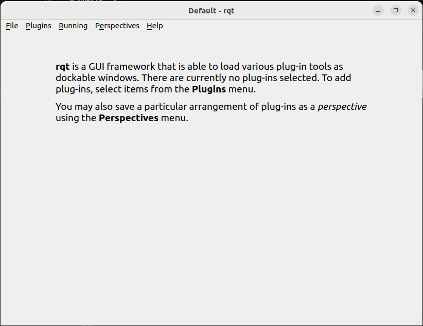

前言
++++++++++
frcobot_ros2为法奥协作机器人基于ROS2开发的API接口，旨在针对入门级用户更便捷的使用法奥SDK。通过参数配置文件对默认参数的配置，即可适应不同的客户要求。 

fr_ros2
++++++++++++++
本章节说明APP运行环境如何配置。

基本环境安装
--------------

推荐在Ubuntu22.04LTS(Jammy)上使用，系统安装完毕后，就可以安装ROS2，推荐用ros2-humble，ROS2的安装可以参考教程：https://docs.ros.org/en/humble/index.html。

编译及构建fr_ros2
---------------------
1. 创建colcon工作区
fr_ros2有两个功能包组成，一个是自定义数据结构的功能包frhal_msgs，另外一个是程序主体fr_ros2功能包。在安装好基本环境后，先创建一个colcon工作区，比如:

.. code-block:: shell
    :linenos:

    cd ~/
    mkdir -p ros2_ws/src

2. 编译功能包
将安装包的代码拷贝至ros2_ws/src目录下，在ros2_ws目录下运行如下命令：

.. code-block:: shell
    :linenos:

    colcon build --packages-select frhal_msgs

等待上一条命令完成编译后

.. code-block::  shell
    :linenos:

    colcon build --packages-select fr_ros2

快速开始
++++++++++++++

启动流程
-----------------
在Ubuntu下打开命令行，输入：

.. code-block::  shell
    :linenos:

    cd ros2_ws
    source install/setup.bash
    ros2 run fr_ros2 ros2_cmd_server

查看机械臂状态反馈流程
--------------------------
机械臂的状态反馈是通过topic发布的，用户可以通过ros2自带的命令观察到状态数据刷新，也可以编写程序获取该数据，下面展示如何通过ros2命令观察机械臂状态数据。

在ubuntu下打开命令行，输入：

.. code-block:: shell
    :linenos:

    cd ros2_ws
    source install/setup.bash
    ros2 topic echo /nonrt_state_data

可以看到命令行窗口中不断刷新的状态数据，如下图所示。

.. image:: img/fr_ros2_002.png
    :width: 6in
    :align: center

下发指令流程
--------------------------
在ubuntu下打开命令行，输入：

.. code-block:: shell
    :linenos:

    cd ros2_ws
    source install/setup.bash
    rqt

以上命令执行完毕后，会调出一个rqt GUI界面，如下图所示。

在GUI界面选择plugins->serivce->serivce caller，调出如下界面，选择/FR_ROS_API_service这项，在界面expression中输入指令字符串点击call即可看到下方对话框中跳出回复信息。

.. image:: img/fr_ros2_004.png
    :width: 6in
    :align: center

.. important:: 

   - 输入字符串规则说明：

   程序内部对输入的字符串形式进行了筛选，函数输入的格式必须是 [函数名]() 这样的形式，且圆括号的参数字符串必须是由字母，数字，逗号还有负号组成，出现其他字符或者空格均会报错。

   - 指令反馈值说明：

   除了GET指令会反馈一串字符串，其余的函数反馈值都是int型，一般0为出现错误，1为正确执行，如果出现其他的值那么参考xmlrpc SDK中定义的错误代码对应的错误。

修改参数流程
--------------------------
由于简化SDK是改进自原生的SDK接口，能够简化是因为赋予了一些参数默认值，而在实际使用过程中也会遇到默认参数无法满足要求的情况，这个时候可以通过修改对应默认参数的数值，然后加载到节点中。

源代码文件中存在一个fr_ros2_para.yaml参数文件，文件中的参数为预先设置的默认参数，用于简化指令输入参数，可以根据自己的具体需要修改其中的参数，然后使用命令动态修改参数: ros2 param load FR_ROS_API_nod ~/ros2_ws/src/fr_ros2/fr_ros2_para.yaml。

API说明
++++++++++++++

.. code-block:: c++
    :linenos:

    int JNTPoint(int id, double j1-j6)//存储一个关节空间点位，注意，关节点位id与下面的笛卡尔点位id各自独立
    // 例子
    JNTPoint(1,10,11,12,13,14,15)

    int CARTPoint(int id, double x,y,z,rx,ry,rz)//存储一个笛卡尔空间点位
    // 例子
    CARTPoint(1,100,110,200,0,0,0)

    string GET(string name, int id)//获取对应id序号点位的内容，name可以输入JNT或者CART
    // 例子
    GET("JNT",1)

    int DragTeachSwitch(uint8_t state)
    // 例子
    DragTeachSwitch(0)

    int RobotEnable(uint8_t state)
    // 例子
    RobotEnable(1)

    int Mode(uint8_t state)
    // 例子
    Mode(1)

    int SetSpeed(float vel)
    // 例子
    SetSpeed(10)

    int SetToolCoord(int id, float x,float y, float z,float rx,float ry,float rz)
    // 例子
    SetToolCoord(1,0,0,0,0,0,0)

    int SetToolList(int id, float x,float y, float z,float rx,float ry,float rz );
    // 例子
    SetToolList(1,0,0,0,0,0,0)

    int SetExToolCoord(int id, float x,float y, float z,float rx,float ry,float rz);	
    // 例子
    SetExToolCoord(1,0,0,0,0,0,0)

    int SetExToolList(int id, float x,float y, float z,float rx,float ry,float rz);
    // 例子
    SetExToolList(1,0,0,0,0,0,0)

    int SetWObjCoord(int id, float x,float y, float z,float rx,float ry,float rz);
    // 例子
    SetWObjCoord(1,0,0,0,0,0,0)

    int SetWObjList(int id, float x,float y, float z,float rx,float ry,float rz);
    // 例子
    SetWObjList(1,0,0,0,0,0,0)

    int SetLoadWeight(float weight);
    // 例子
    SetLoadWeight(3.5)

    int SetLoadCoord(float x,float y,float z);
    // 例子
    SetLoadCoord(10,20,30)

    int SetRobotInstallPos(uint8_t install);
    // 例子
    SetRobotInstallPos(0)

    int SetRobotInstallAngle(double yangle,double zangle);
    // 例子
    SetRobotInstallAngle(90,0)

    //安全配置
    int SetAnticollision(float level1-level6);
    // 例子
    SetAnticollision(0.5,0.5,0.5,0.5,0.5,0.5)

    int SetCollisionStrategy(int strategy);
    // 例子
    SetCollisionStrategy(1)

    int SetLimitPositive(float limit1-limit6);
    // 例子
    SetLimitPositve(100,90,90,90,90,90)

    int SetLimitNegative(float limit1-limit6);
    // 例子
    SetLimitNegative(-100,-90,-90,-90,-90,-90)

    int ResetAllError();  // 清除所有错误

    int FrictionCompensationOnOff(uint8_t state);
    // 例子
    FrictionCompensationOnOff(1)

    int SetFrictionValue_level(float coeff1-coeff6);
    // 例子
    SetFrictionValue_level(1,1,1,1,1,1)

    int SetFrictionValue_wall(float coeff1-coeff6);
    // 例子
    SetFrictionValue_wall(0.5,0.5,0.5,0.5,0.5,0.5)

    int SetFrictionValue_ceiling(float coeff1-coeff6);
    // 例子
    SetFrictionValue_ceiling(0.5,0.5,0.5,0.5,0.5,0.5)

    //外设控制
    int ActGripper(int idex,uint8_t act);
    // 例子
    ActGripper(1,1)

    int MoveGripper(int index,int pos);
    // 例子
    MoveGripper(1,10)

    //IO控制
    int SetDO(int id,uint8_t status);
    // 例子
    SetDO(1,1)

    int SetToolDO(int id,uint8_t status);
    // 例子
    SetToolDO(0,1)

    int SetAO(int id,uint8_t status);
    // 例子
    SetAO(1,100)

    int SetToolAO(int id,uint8_t status);
    // 例子
    SetToolAO(0,100)

    //运动指令
    int StartJOG(uint8_t ref, uint8_t dir, float vel);
    // 例子
    StartJOG(1,1,10)

    int StopJOG(uint8_t ref);
    // 例子
    StartJOG(1)

    int ImmStopJOG();

    int MoveJ(string point_name, float vel);//point_name是输入预存点位信息，比如JNT1就是关节点位信息序号为1的点位，CART1就是笛卡尔点位信息序号为1的点位，MoveJ指令支持输入关节点位或者笛卡尔点位
    // 例子
    MoveJ("JNT1",10)

    int MoveL(string point_name,float vel);
    // 例子
    MoveL("CART1",10)

    int MoveC(string point1_name,string point2_name, float vel);
    // 例子
    MoveC("JNT1","JNT2",10)

    int SplineStart();

    int SplinePTP(string point_name, float vel);//该指令只支持输入JNT1这样的关节数据，输入笛卡尔点位会报错
    // 例子
    SplinePTP("JNT2",10)

    int SplineEnd();

    int NewSplineStart(uint8_t ctlpoint);
    // 例子
    NewSplineStrart(1)

    int NewSplinePoint(string point_name, float vel, int lastflag);//该指令只支持输入CART1这样的笛卡尔数据，输入关节数据会报错
    // 例子
    NewSplinePoint("JNT2",20,0)

    int NewSplineEnd();

    int StopMotion();   // 停止机器人运动

    int PointsOffsetEnable(int flag, double x,y,z,rx,ry,rz);
    // 例子
    PointsOffsetEnable(1,10,10,10,0,0,0)

    int PointsOffsetDisable();
