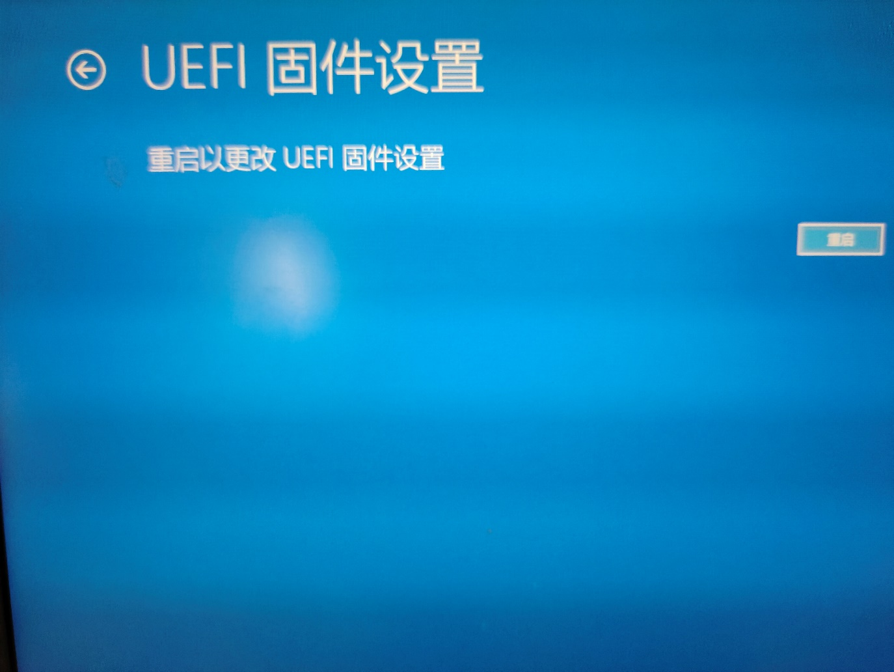

虚拟机环境配置
===================

安装Virtual Box
-----------------

- Virtual Box版本：VirtualBox-7.0.14。
- 文件名称：VirtualBox-7.0.14-161095-Win.exe。
- 下载安装包后选择默认路径安装即可。

.. image:: controller_virtual_machine/001.png
   :width: 6in
   :align: center

.. centered:: 图表 6.1-1 VirtualBox 7.0.14

镜像配置
-------------

1) 下载并打开镜像。

- 下载虚拟机镜像FAIRINO SimMachine.rar并解压。
- 打开VirtualBox，选择“注册”，选择虚拟机“FAIRINO SimMachine.vbox”文件，即可导入虚拟环境。

.. centered:: 图表 6.1-2 VirtualBox 中选择注册

.. centered:: 图表 6.1-3 选择虚拟机文件

- 导入后，选择“FAIRINO SimMachine”，点击“启动”按钮，开启虚拟机。

.. centered:: 图表 6.1-4 启动虚拟机

.. note:: 
    虚拟机设置 -> 系统 -> 处理器，默认启用 PAE/NX，如果电脑BIOS尚未启用虚拟化，会导致启动失败，需在 BIOS 中开启虚拟化，详见 \ `附录1 <#bios>`__\。

2) 共享文件夹。

虚拟机和宿主机之间的共享文件夹已经默认设置好，建议拷贝文件时都使用共享文件夹进行拷贝。同时虚拟机环境已经安装增强功能，共享粘贴板，方便复制粘贴。

- 宿主机共享文件夹在 D:\share（需要手动创建share文件夹）。
- 虚拟机共享文件夹在 /home/fr/shared。

.. image:: controller_virtual_machine/005.png
   :width: 6in
   :align: center

.. centered:: 图表 6.1-5 共享文件夹配置

3) 进入虚拟机系统。

- 虚拟机运行环境系统：Ubuntu 18.04.6。
- 虚拟机运行环境系统：RAM 4G，ROM 50G，6核CPU 。
- 用户名：root，密码：123。

.. image:: controller_virtual_machine/007.png
   :width: 6in
   :align: center

.. centered:: 图表 6.1-6 tty登录虚拟机系统

虚拟机系统默认关闭用户图形界面，使用tty登录。

- 如果用户需要开启用户图形界面：
  
.. list-table::
   :widths: 200
   :align: center

   * - systemctl set-default graphical.target

   * - reboot
  
- 如果用户需要再次关闭用户图形界面：
  
.. list-table::
   :widths: 200
   :align: center

   * - systemctl set-default multi-user.target

   * - reboot

用户登录web页面，操作虚拟机器人
=================================

- 首次登录，用戶准备一台测试电脑，通过网线连接到虚拟机，测试电脑网口IP设置为192.168.58.XXX 网段，子网掩码设置为255.255.255.0。
- 在测试电脑上，打开 Chrome 浏览器，输入默认IP：192.168.58.2，即可访问web界面，操作虚拟机器人。

.. centered:: 图表 6.2-1 虚拟机web登录界面

.. centered:: 图表 6.2-2 虚拟机web操作界面

用户修改IP地址
------------------

.. image:: controller_virtual_machine/010.png
   :width: 6in
   :align: center

.. centered:: 图表 6.2-3 设置网络页面

1. 打开浏览器，输入默认IP：192.168.58.2，打开web页面；
2. 使用admin账号登录，密码：123；
3. 进入“系统设置” -> “通用设置” -> “网络设置”，修改 IP为目标IP地址，点击“设置网络”；
4. 重启虚拟机，虚拟机桥接网卡上 IP 已经自动变更为修改后的 IP地址；
5. 配置本地测试电脑以太网口、宿主机以太网口与虚拟机桥接网卡上 IP为同一网段；
6. 此时用户在测试电脑上，打开 Chrome 浏览器，输入修改后IP地址，即可访问web界面，操作虚拟机器人。

.. image:: controller_virtual_machine/011.png
   :width: 6in
   :align: center

.. centered:: 图表 6.2-4 网络拓扑图

.. note:: 
    如当前没有测试电脑，可在本地电脑上添加虚拟网卡（环回网络适配器），详见\ `附录2 <#id4>`__\。

附录
===================

附录1：BIOS 中启用虚拟化
-------------------------

不同型号的电脑启用虚拟化的流程可能不同，现以联想ThinkPad系列windows10举例：

- 打开电脑设置，选择更新和安全。

.. image:: controller_virtual_machine/013.png
   :width: 4in
   :align: center

.. image:: controller_virtual_machine/014.png
   :width: 4in
   :align: center

- 选择“恢复”。

- 选择“立即重启”。

.. image:: controller_virtual_machine/016.png
   :width: 4in
   :align: center

- 选择“疑难解答”。
  
.. image:: controller_virtual_machine/017.png
   :width: 4in
   :align: center

- 选择“高级选项”。

.. image:: controller_virtual_machine/018.png
   :width: 4in
   :align: center

- 选择UEFI固件设置。

- 选择“重启”。

- 选择“Security”下的“Virtualization”。

- 选择“Enabled”，按下“Enter”确认。

- 按下“F10”，选择“Yes”，按下“Enter”保存修改。

.. image:: controller_virtual_machine/023.png
   :width: 4in
   :align: center

附录2：添加虚拟网卡（环回网络适配器）
--------------------------------------

1. 打开设备管理器，按下“Windows键-X”，选择“设备管理器”。
   

2. 添加网络适配器。

.. image:: controller_virtual_machine/028.png
   :width: 4in
   :align: center

.. image:: controller_virtual_machine/029.png
   :width: 4in
   :align: center

.. image:: controller_virtual_machine/030.png
   :width: 4in
   :align: center

   
3. 查看虚拟网卡，按下“Windows键-X”，选择“网络连接”。

.. image:: controller_virtual_machine/032.png
   :width: 4in
   :align: center

.. image:: controller_virtual_machine/035.png
   :width: 4in
   :align: center
   
4. 配置环回适配器网络。

- IP地址: 192.168.58.XXX（与192.168.58.2 同一网段即可）。
- 子网掩码：255.255.255.0。

5. 打开Virtualbox网络配置，网卡名称选择“环回适配器网络”，启动虚拟机即可。

.. image:: controller_virtual_machine/013.png
   :width: 6in
   :align: center
